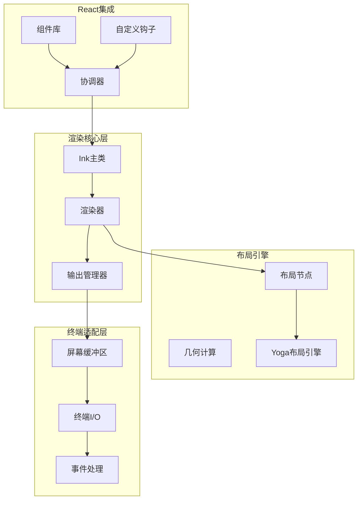
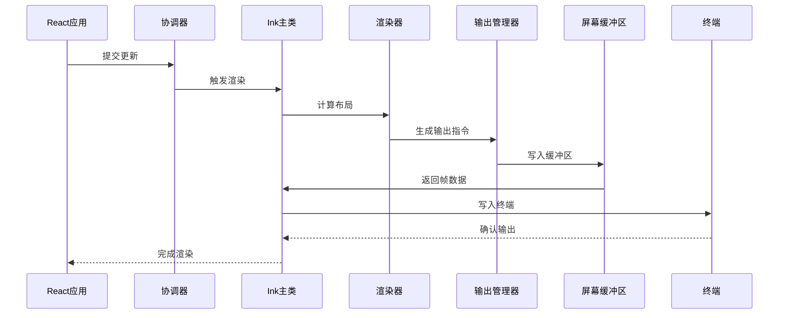
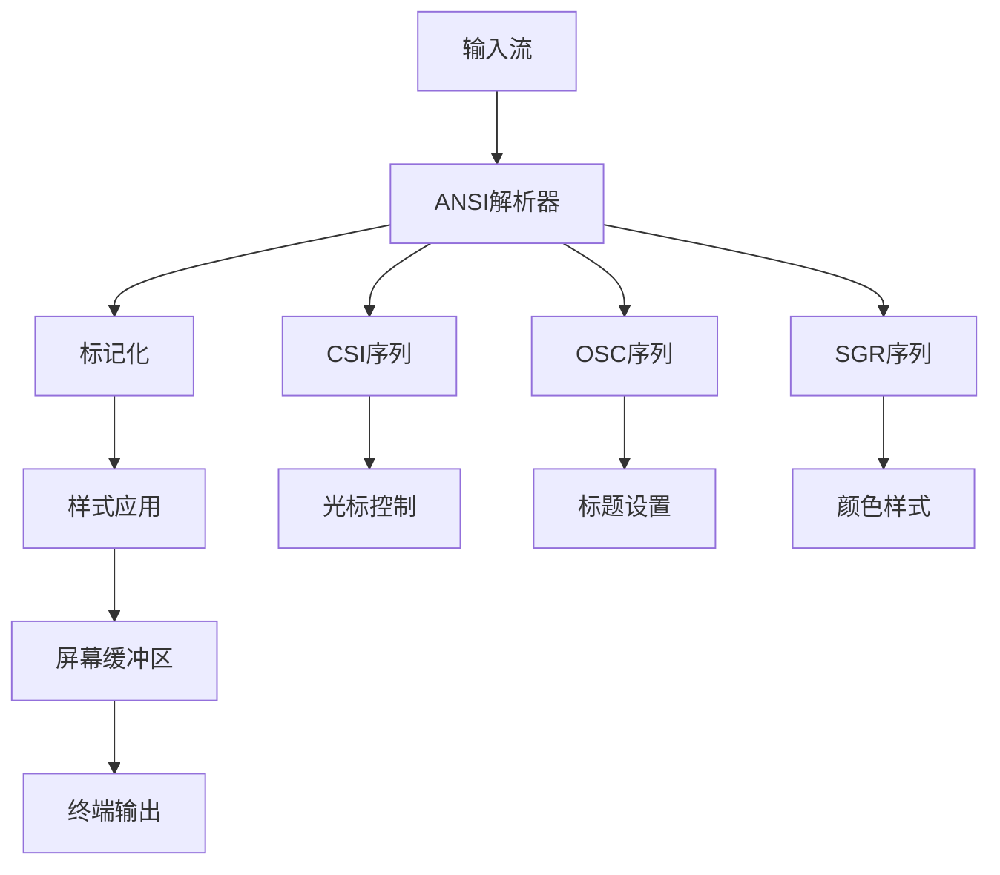
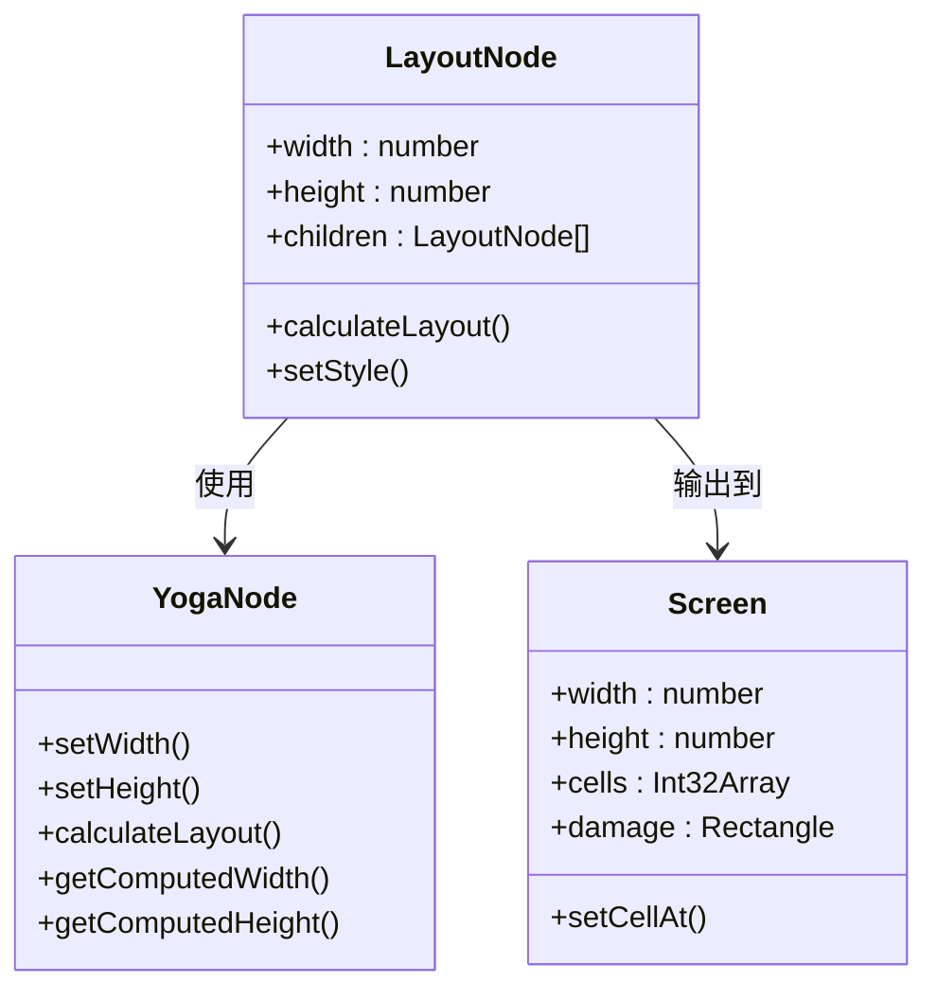
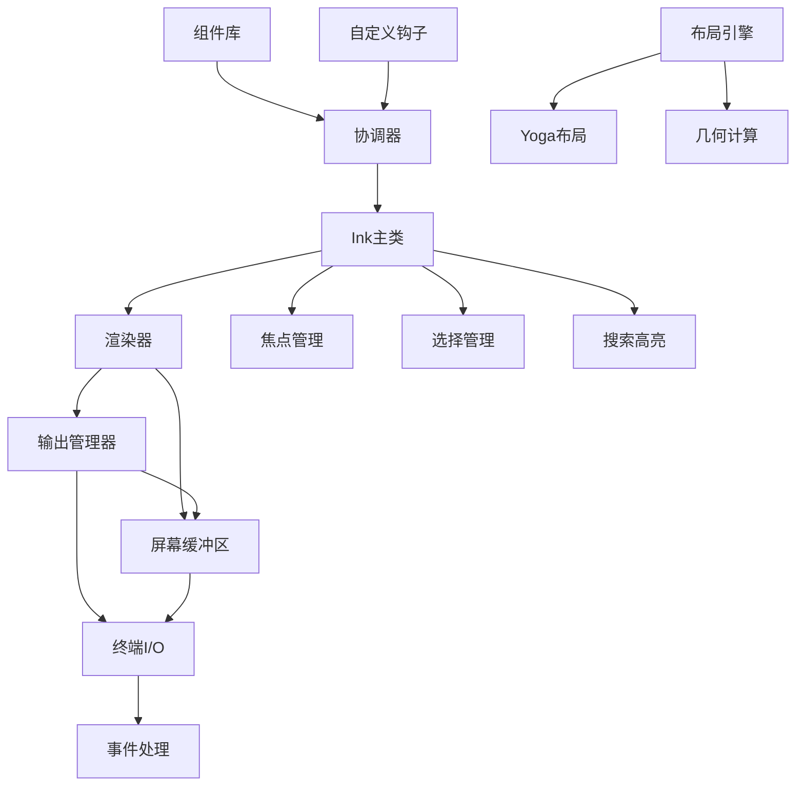

# Ink终端渲染系统

<cite>
**本文档引用的文件**
- [ink.tsx](file://src/ink/ink.tsx)
- [renderer.ts](file://src/ink/renderer.ts)
- [root.ts](file://src/ink/root.ts)
- [reconciler.ts](file://src/ink/reconciler.ts)
- [render-to-screen.ts](file://src/ink/render-to-screen.ts)
- [termio.ts](file://src/ink/termio.ts)
- [screen.ts](file://src/ink/screen.ts)
- [output.ts](file://src/ink/output.ts)
- [App.tsx](file://src/ink/components/App.tsx)
</cite>

## 目录
1. [简介](#简介)
2. [项目结构](#项目结构)
3. [核心组件](#核心组件)
4. [架构概览](#架构概览)
5. [详细组件分析](#详细组件分析)
6. [依赖关系分析](#依赖关系分析)
7. [性能考虑](#性能考虑)
8. [故障排除指南](#故障排除指南)
9. [结论](#结论)

## 简介

Ink是一个专为终端环境设计的React渲染系统，它能够将React组件树渲染到终端界面中。该系统通过精心设计的渲染管道、高效的布局引擎和智能的终端适配层，实现了高性能的终端UI渲染。

Ink的核心特性包括：
- 基于React 18的并发渲染能力
- 高效的屏幕缓冲区管理
- 智能的增量渲染和差异算法
- 完整的ANSI转义序列处理
- 终端焦点管理和输入事件处理
- 性能优化的布局计算

## 项目结构

Ink终端渲染系统采用模块化架构，主要分为以下几个核心模块：

**图表来源**
- [ink.tsx:76-279](file://src/ink/ink.tsx#L76-279)
- [renderer.ts:31-178](file://src/ink/renderer.ts#L31-178)
- [screen.ts:451-544](file://src/ink/screen.ts#L451-544)

**章节来源**
- [ink.tsx:1-800](file://src/ink/ink.tsx#L1-800)
- [renderer.ts:1-179](file://src/ink/renderer.ts#L1-179)

## 核心组件

### Ink主类

Ink是整个渲染系统的核心控制器，负责管理渲染循环、处理用户输入和协调各个子系统。

**关键职责：**
- 管理React渲染生命周期
- 处理终端大小变化和恢复事件
- 协调渲染管道的各个阶段
- 管理文本选择和搜索高亮功能

**主要特性：**
- 基于微任务的延迟渲染机制
- 智能的帧率控制和节流
- 完整的错误处理和清理机制

### 渲染器

渲染器负责将React组件树转换为终端可显示的屏幕缓冲区。

**核心功能：**
- 调用Yoga布局引擎计算布局
- 将DOM节点转换为屏幕单元格
- 管理屏幕缓冲区的双缓冲机制
- 实现智能的增量渲染

### 输出管理器

Output类负责将渲染结果写入屏幕缓冲区，并优化写入操作以提高性能。

**优化策略：**
- 批量写入操作减少系统调用
- 智能的区域裁剪避免不必要的绘制
- 内存池管理减少垃圾回收压力

**章节来源**
- [ink.tsx:180-800](file://src/ink/ink.tsx#L180-800)
- [renderer.ts:31-178](file://src/ink/renderer.ts#L31-178)
- [output.ts:170-532](file://src/ink/output.ts#L170-532)

## 架构概览

Ink采用分层架构设计，确保了良好的模块分离和可维护性：

**图表来源**
- [reconciler.ts:247-315](file://src/ink/reconciler.ts#L247-315)
- [ink.tsx:420-789](file://src/ink/ink.tsx#L420-789)
- [renderer.ts:38-177](file://src/ink/renderer.ts#L38-177)

## 详细组件分析

### 终端渲染管道

Ink的渲染管道由多个阶段组成，每个阶段都有特定的职责和优化策略：

#### 阶段1：React协调阶段
协调器监听React的提交阶段，在布局完成后触发渲染。

#### 阶段2：布局计算阶段
使用Yoga布局引擎计算所有DOM节点的位置和尺寸。

#### 阶段3：渲染生成阶段
将DOM节点转换为屏幕单元格，应用样式和格式化。

#### 阶段4：差异比较阶段
与上一帧进行比较，只发送发生变化的部分。

#### 阶段5：终端输出阶段
将差异写入终端，更新光标位置和状态。

**章节来源**
- [reconciler.ts:247-315](file://src/ink/reconciler.ts#L247-315)
- [renderer.ts:38-177](file://src/ink/renderer.ts#L38-177)
- [ink.tsx:420-789](file://src/ink/ink.tsx#L420-789)

### ANSI转义序列处理

Ink提供了完整的ANSI转义序列解析和处理能力：

**图表来源**
- [termio.ts:1-43](file://src/ink/termio.ts#L1-43)
- [output.ts:553-620](file://src/ink/output.ts#L553-620)

**关键特性：**
- 支持完整的ANSI转义序列集
- 实时样式跟踪和应用
- 双宽字符的正确处理
- 光标位置的精确控制

### 布局引擎工作原理

Ink的布局引擎基于Yoga，提供了高效的Flexbox布局计算：

**图表来源**
- [renderer.ts:84-104](file://src/ink/renderer.ts#L84-104)
- [screen.ts:366-415](file://src/ink/screen.ts#L366-415)

**布局优化：**
- 智能的布局缓存机制
- 只重新计算受影响的节点
- 支持复杂的Flexbox属性

### 终端适配层

终端适配层负责处理各种终端特性和兼容性问题：

**尺寸检测：**
- 自动检测终端宽度和高度
- 监听resize事件动态调整
- 支持全屏模式切换

**焦点管理：**
- 终端焦点状态跟踪
- 自动焦点恢复机制
- 支持外部程序暂停/恢复

**输入事件处理：**
- 完整的键盘事件支持
- 鼠标事件处理和选择
- 终端特定的按键组合

**章节来源**
- [ink.tsx:309-346](file://src/ink/ink.tsx#L309-346)
- [App.tsx:181-205](file://src/ink/components/App.tsx#L181-205)

## 依赖关系分析

Ink系统内部的依赖关系体现了清晰的分层设计：

**图表来源**
- [ink.tsx:180-279](file://src/ink/ink.tsx#L180-279)
- [reconciler.ts:224-512](file://src/ink/reconciler.ts#L224-512)

**依赖特点：**
- 低耦合的模块设计
- 明确的接口边界
- 可替换的组件实现

**章节来源**
- [root.ts:1-185](file://src/ink/root.ts#L1-185)
- [reconciler.ts:1-513](file://src/ink/reconciler.ts#L1-513)

## 性能考虑

Ink在设计时充分考虑了性能优化，采用了多种策略来确保流畅的用户体验：

### 内存优化策略

**内存池管理：**
- 字符串池减少内存分配
- 样式池避免重复样式对象
- 屏幕缓冲区重用避免频繁分配

**垃圾回收优化：**
- 对象池减少GC压力
- 批量操作合并减少分配次数
- 弱引用避免内存泄漏

### 渲染性能优化

**增量渲染：**
- 智能的差异算法只更新变化部分
- 屏幕损坏区域跟踪精确计算
- 双缓冲机制避免闪烁

**布局优化：**
- 布局结果缓存避免重复计算
- 只重新计算受影响的节点
- 支持布局懒加载

### 输入处理优化

**事件节流：**
- 关键事件去抖动处理
- 批量事件合并
- 智能的输入缓冲

**章节来源**
- [screen.ts:21-75](file://src/ink/screen.ts#L21-75)
- [output.ts:170-205](file://src/ink/output.ts#L170-205)
- [ink.tsx:212-216](file://src/ink/ink.tsx#L212-216)

## 故障排除指南

### 常见问题及解决方案

**问题1：渲染闪烁或卡顿**
- 检查帧率设置是否合理
- 确认没有过多的强制重排
- 验证布局计算是否被缓存

**问题2：颜色显示异常**
- 确认终端支持的颜色深度
- 检查ANSI序列的正确性
- 验证颜色池的状态

**问题3：布局错乱**
- 检查CSS样式的兼容性
- 确认Flexbox属性的正确使用
- 验证容器尺寸的设置

**问题4：输入无响应**
- 确认终端处于原始模式
- 检查键盘事件处理器
- 验证焦点状态

### 调试技巧

**启用调试模式：**
- 设置调试环境变量获取详细日志
- 使用性能分析工具监控渲染时间
- 启用布局可视化辅助调试

**性能监控：**
- 监控帧渲染时间
- 跟踪内存使用情况
- 分析布局计算开销

**章节来源**
- [ink.tsx:179-185](file://src/ink/ink.tsx#L179-185)
- [reconciler.ts:179-185](file://src/ink/reconciler.ts#L179-185)

## 结论

Ink终端渲染系统通过精心设计的架构和多项性能优化，成功地将React的强大组件化能力带到了终端环境中。其核心优势包括：

**技术优势：**
- 基于React 18的现代渲染架构
- 高效的增量渲染和差异算法
- 完整的ANSI转义序列支持
- 智能的布局和样式处理

**性能表现：**
- 优化的内存使用和垃圾回收
- 高效的屏幕缓冲区管理
- 智能的渲染管道优化

**开发体验：**
- 简洁的API设计
- 完善的错误处理机制
- 良好的调试支持

Ink为开发者提供了一个强大而灵活的终端UI开发平台，既保持了React的开发便利性，又充分发挥了终端环境的性能优势。随着持续的优化和功能扩展，Ink有望成为终端应用开发的标准选择。