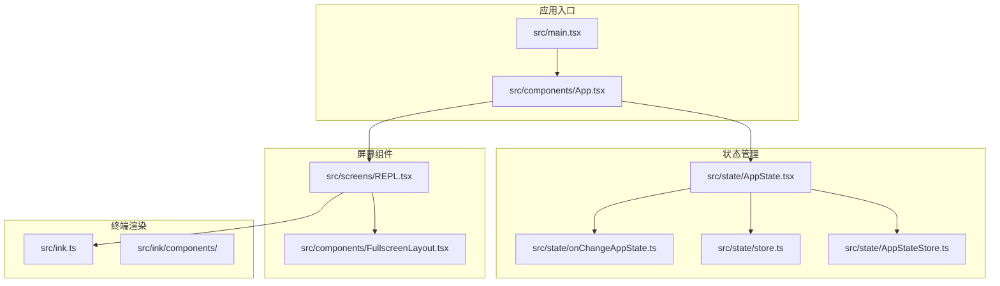
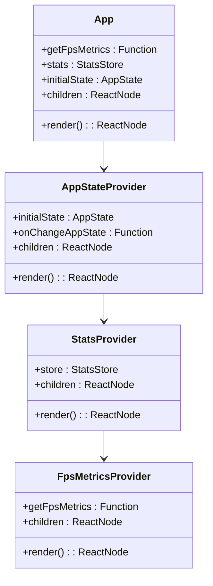
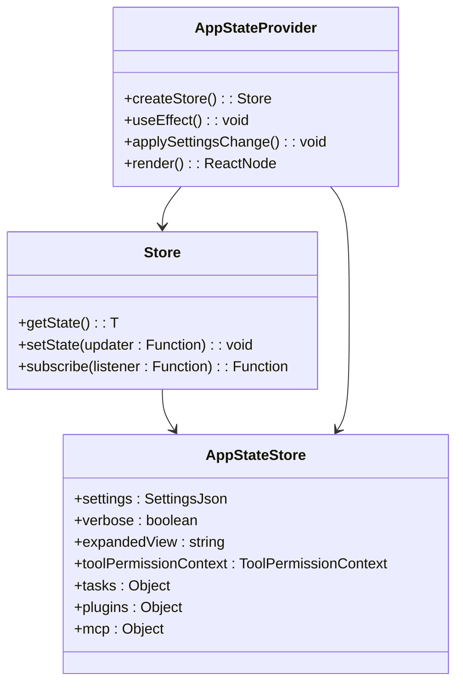
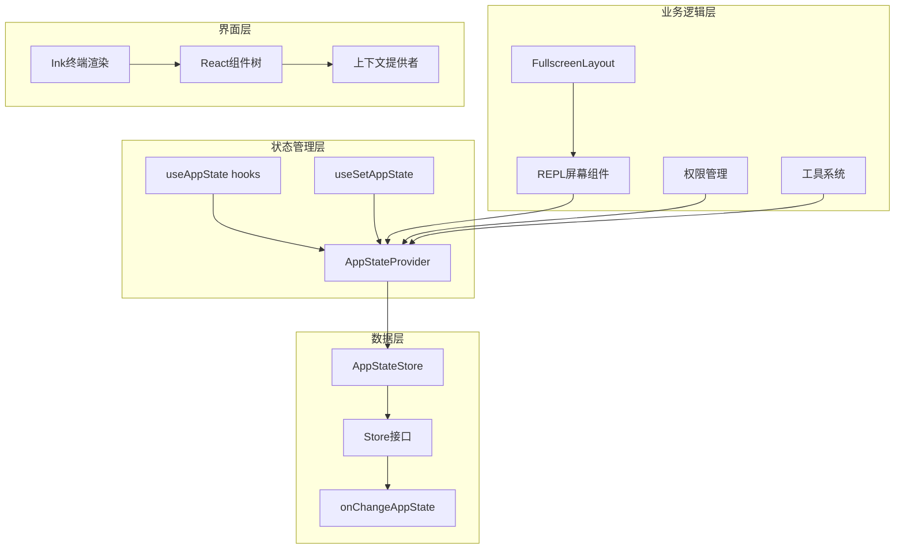
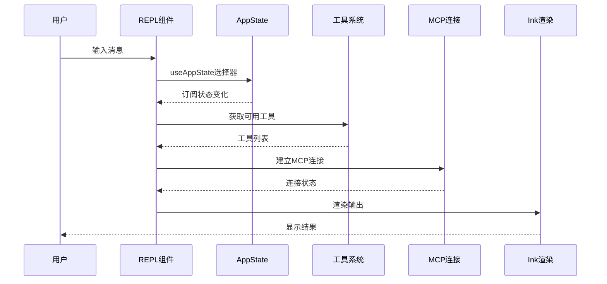
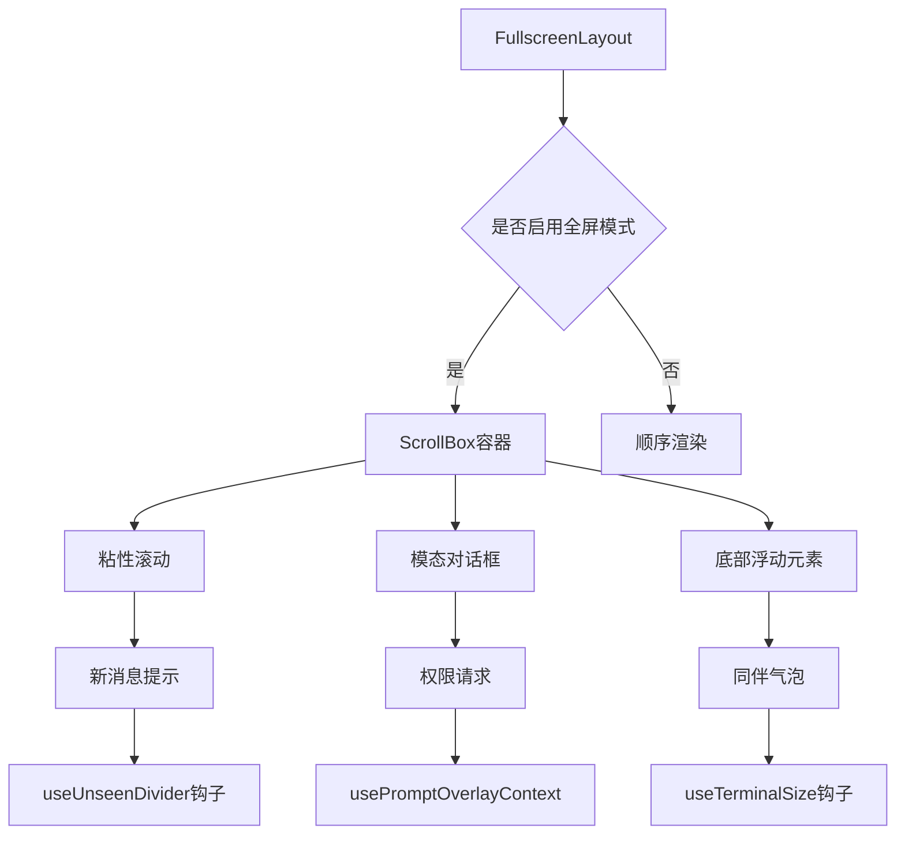
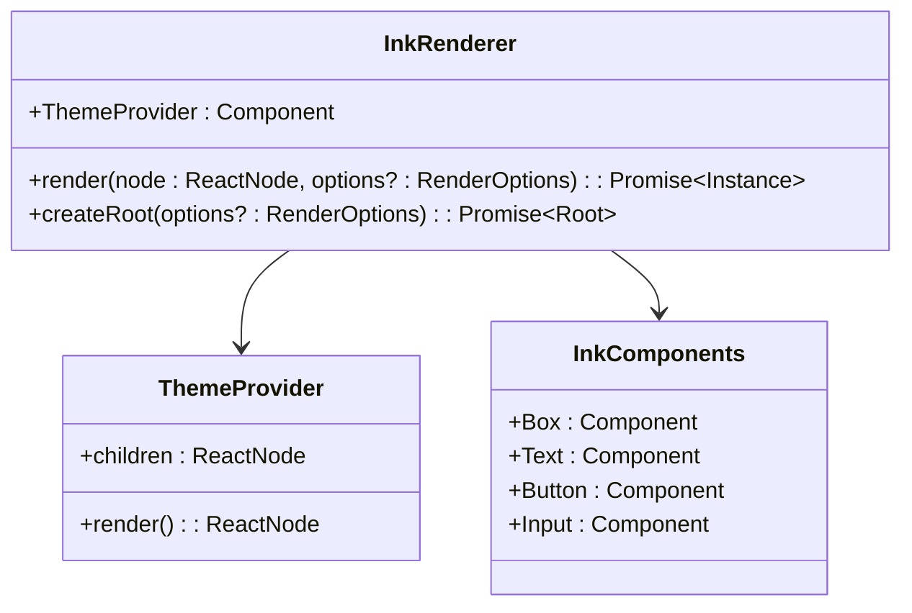
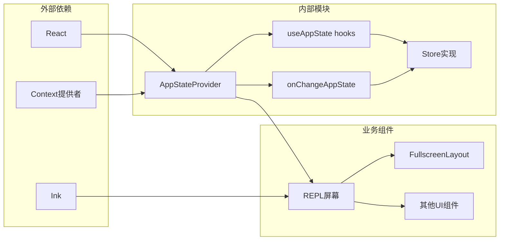
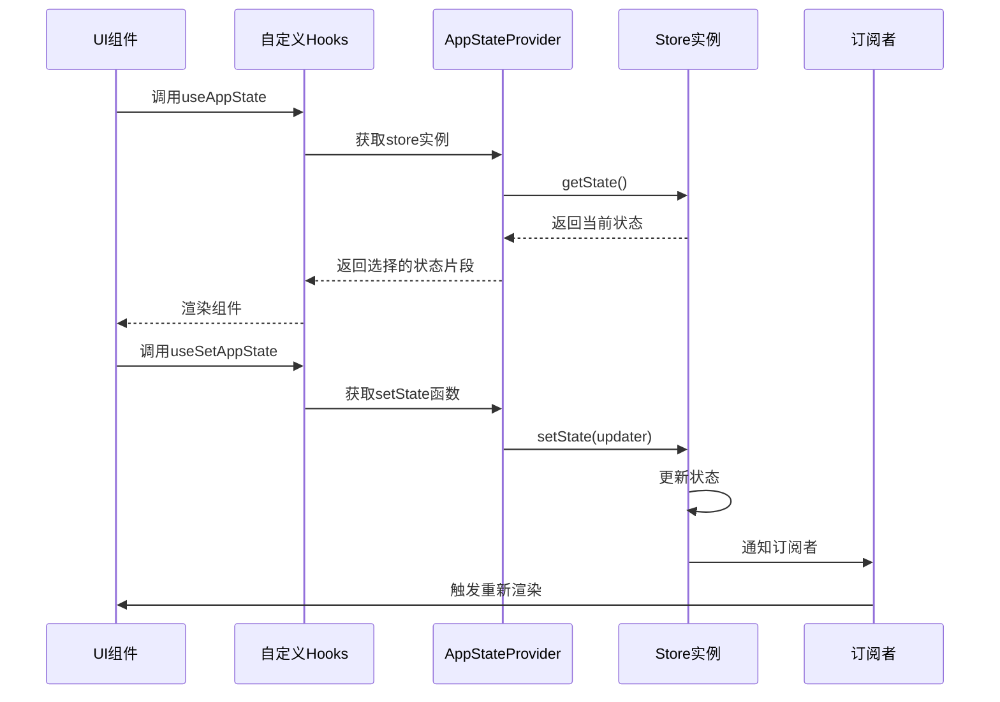
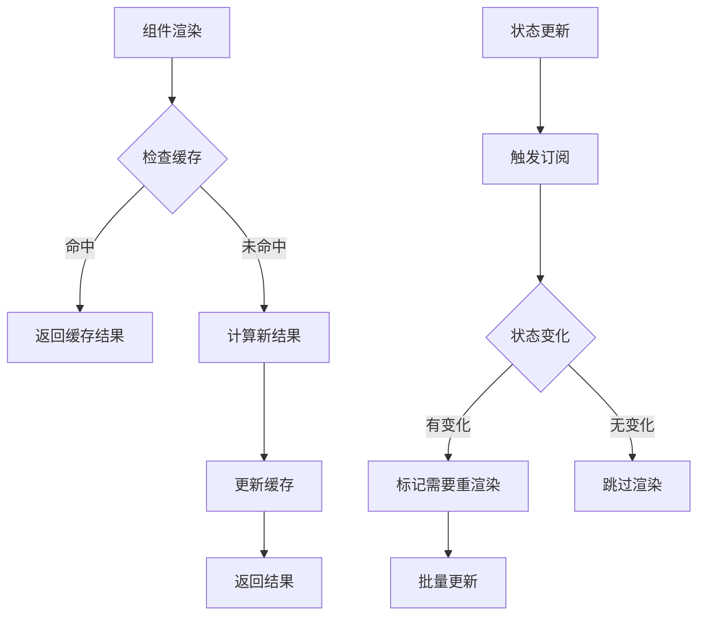

# React组件架构

<cite>
**本文档引用的文件**
- [App.tsx](file://src/components/App.tsx)
- [AppState.tsx](file://src/state/AppState.tsx)
- [AppStateStore.ts](file://src/state/AppStateStore.ts)
- [store.ts](file://src/state/store.ts)
- [onChangeAppState.ts](file://src/state/onChangeAppState.ts)
- [main.tsx](file://src/main.tsx)
- [REPL.tsx](file://src/screens/REPL.tsx)
- [FullscreenLayout.tsx](file://src/components/FullscreenLayout.tsx)
- [ink.ts](file://src/ink.ts)
</cite>

## 目录
1. [引言](#引言)
2. [项目结构](#项目结构)
3. [核心组件](#核心组件)
4. [架构概览](#架构概览)
5. [详细组件分析](#详细组件分析)
6. [依赖关系分析](#依赖关系分析)
7. [性能考虑](#性能考虑)
8. [故障排除指南](#故障排除指南)
9. [结论](#结论)

## 引言

本文档深入分析Claude Code React组件架构，这是一个基于React的终端交互应用程序。该架构采用现代React模式，结合自定义状态管理、上下文提供者和Ink终端渲染技术，为开发者提供了强大的命令行界面解决方案。

## 项目结构

该项目采用模块化组织方式，主要分为以下几个核心目录：

**图表来源**
- [main.tsx:585-800](file://src/main.tsx#L585-L800)
- [App.tsx:1-56](file://src/components/App.tsx#L1-L56)

**章节来源**
- [main.tsx:1-800](file://src/main.tsx#L1-L800)
- [App.tsx:1-56](file://src/components/App.tsx#L1-L56)

## 核心组件

### App顶级组件

App组件作为整个应用程序的根容器，负责提供全局状态和上下文：

**图表来源**
- [App.tsx:8-30](file://src/components/App.tsx#L8-L30)
- [AppState.tsx:27-110](file://src/state/AppState.tsx#L27-L110)

App组件的核心职责包括：
- 提供FPS指标监控
- 管理统计信息存储
- 传递初始应用状态
- 组合多个上下文提供者

**章节来源**
- [App.tsx:1-56](file://src/components/App.tsx#L1-L56)

### AppState状态管理系统

AppState系统是整个应用的核心状态管理机制：

**图表来源**
- [store.ts:4-34](file://src/state/store.ts#L4-L34)
- [AppStateStore.ts:89-454](file://src/state/AppStateStore.ts#L89-L454)
- [AppState.tsx:37-110](file://src/state/AppState.tsx#L37-L110)

**章节来源**
- [AppState.tsx:1-200](file://src/state/AppState.tsx#L1-L200)
- [AppStateStore.ts:1-570](file://src/state/AppStateStore.ts#L1-L570)
- [store.ts:1-35](file://src/state/store.ts#L1-L35)

## 架构概览

整个应用程序采用分层架构设计，从底层数据存储到顶层用户界面：

**图表来源**
- [main.tsx:191-193](file://src/main.tsx#L191-L193)
- [REPL.tsx:598-640](file://src/screens/REPL.tsx#L598-L640)
- [ink.ts:18-31](file://src/ink.ts#L18-L31)

## 详细组件分析

### REPL主屏幕组件

REPL组件是应用程序的核心交互界面，集成了多种功能特性：

**图表来源**
- [REPL.tsx:598-640](file://src/screens/REPL.tsx#L598-L640)
- [REPL.tsx:696-702](file://src/screens/REPL.tsx#L696-L702)

REPL组件的关键特性包括：
- 实时状态订阅（useAppState）
- 动态工具加载
- MCP服务器连接管理
- 终端输出渲染

**章节来源**
- [REPL.tsx:1-800](file://src/screens/REPL.tsx#L1-L800)

### 全屏布局组件

FullscreenLayout组件提供了现代化的全屏终端体验：

**图表来源**
- [FullscreenLayout.tsx:338-446](file://src/components/FullscreenLayout.tsx#L338-L446)
- [FullscreenLayout.tsx:86-190](file://src/components/FullscreenLayout.tsx#L86-L190)

**章节来源**
- [FullscreenLayout.tsx:1-637](file://src/components/FullscreenLayout.tsx#L1-L637)

### Ink终端渲染集成

Ink框架提供了强大的终端渲染能力：

**图表来源**
- [ink.ts:18-31](file://src/ink.ts#L18-L31)
- [ink.ts:33-86](file://src/ink.ts#L33-L86)

**章节来源**
- [ink.ts:1-86](file://src/ink.ts#L1-L86)

## 依赖关系分析

### 组件间依赖关系

**图表来源**
- [AppState.tsx:1-200](file://src/state/AppState.tsx#L1-L200)
- [REPL.tsx:1-800](file://src/screens/REPL.tsx#L1-L800)

### 状态流分析

**图表来源**
- [AppState.tsx:142-163](file://src/state/AppState.tsx#L142-L163)
- [store.ts:20-27](file://src/state/store.ts#L20-L27)

**章节来源**
- [AppState.tsx:117-179](file://src/state/AppState.tsx#L117-L179)
- [store.ts:1-35](file://src/state/store.ts#L1-L35)

## 性能考虑

### 状态订阅优化

应用程序采用了多种性能优化策略：

1. **选择器模式**：使用useAppState选择器避免不必要的重渲染
2. **稳定引用**：useSetAppState返回稳定的引用，减少组件重渲染
3. **订阅机制**：useSyncExternalStore提供高效的订阅管理
4. **条件渲染**：React Compiler优化和memo缓存

### 渲染性能优化

**章节来源**
- [AppState.tsx:142-163](file://src/state/AppState.tsx#L142-L163)
- [REPL.tsx:611-614](file://src/screens/REPL.tsx#L611-L614)

## 故障排除指南

### 常见问题诊断

1. **状态不更新问题**
   - 检查useAppState选择器是否返回新对象
   - 验证onChangeAppState回调是否正确处理状态变更
   - 确认订阅者是否正确注册

2. **渲染性能问题**
   - 使用React DevTools检查组件重渲染
   - 检查useMemo和useCallback的使用
   - 验证状态订阅的粒度

3. **Ink渲染问题**
   - 确认终端环境支持
   - 检查主题配置
   - 验证组件树结构

**章节来源**
- [onChangeAppState.ts:1-172](file://src/state/onChangeAppState.ts#L1-L172)
- [AppState.tsx:126-179](file://src/state/AppState.tsx#L126-L179)

## 结论

Claude Code的React组件架构展现了现代前端开发的最佳实践：

1. **清晰的分层设计**：从状态管理到界面渲染的明确分离
2. **高性能实现**：通过选择器模式和订阅机制优化渲染性能
3. **可扩展性**：模块化的组件设计支持功能扩展
4. **用户体验**：结合Ink框架提供优秀的终端交互体验

该架构为复杂的命令行应用程序提供了坚实的前端基础，同时保持了良好的可维护性和扩展性。通过合理使用React Hooks、Context API和自定义状态管理，实现了高效的状态同步和组件通信。