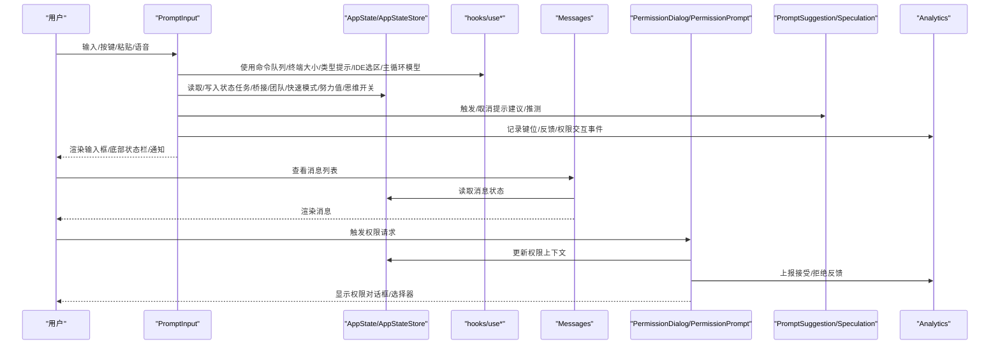
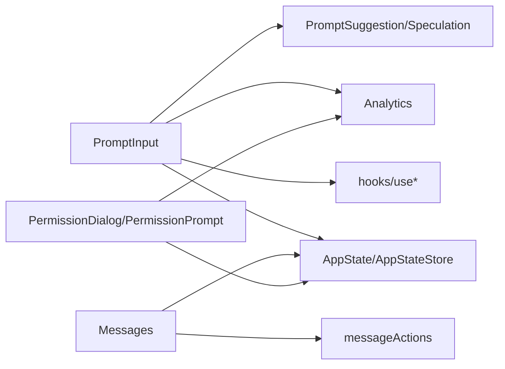

# UI组件库

<cite>
**本文引用的文件**
- [src/components/PromptInput/PromptInput.tsx](file://src/components/PromptInput/PromptInput.tsx)
- [src/components/PromptInput/PromptInputFooter.tsx](file://src/components/PromptInput/PromptInputFooter.tsx)
- [src/components/PromptInput/PromptInputModeIndicator.tsx](file://src/components/PromptInput/PromptInputModeIndicator.tsx)
- [src/components/PromptInput/PromptInputQueuedCommands.tsx](file://src/components/PromptInput/PromptInputQueuedCommands.tsx)
- [src/components/PromptInput/PromptInputStashNotice.tsx](file://src/components/PromptInput/PromptInputStashNotice.tsx)
- [src/components/PromptInput/Notifications.tsx](file://src/components/PromptInput/Notifications.tsx)
- [src/components/PromptInput/inputModes.ts](file://src/components/PromptInput/inputModes.ts)
- [src/components/PromptInput/utils.ts](file://src/components/PromptInput/utils.ts)
- [src/components/permissions/PermissionDialog.tsx](file://src/components/permissions/PermissionDialog.tsx)
- [src/components/permissions/PermissionPrompt.tsx](file://src/components/permissions/PermissionPrompt.tsx)
- [src/components/permissions/PermissionRequest.tsx](file://src/components/permissions/PermissionRequest.tsx)
- [src/components/permissions/PermissionRequestTitle.tsx](file://src/components/permissions/PermissionRequestTitle.tsx)
- [src/components/permissions/WorkerBadge.tsx](file://src/components/permissions/WorkerBadge.tsx)
- [src/components/permissions/SandboxPermissionRequest.tsx](file://src/components/permissions/SandboxPermissionRequest.tsx)
- [src/components/permissions/WorkerPendingPermission.tsx](file://src/components/permissions/WorkerPendingPermission.tsx)
- [src/components/permissions/PermissionDecisionDebugInfo.tsx](file://src/components/permissions/PermissionDecisionDebugInfo.tsx)
- [src/components/permissions/PermissionExplanation.tsx](file://src/components/permissions/PermissionExplanation.tsx)
- [src/components/permissions/WorkerBadge.tsx](file://src/components/permissions/WorkerBadge.tsx)
- [src/components/permissions/shellPermissionHelpers.tsx](file://src/components/permissions/shellPermissionHelpers.tsx)
- [src/components/TextInput.tsx](file://src/components/TextInput.tsx)
- [src/components/VimTextInput.tsx](file://src/components/VimTextInput.tsx)
- [src/components/Message.tsx](file://src/components/Message.tsx)
- [src/components/Messages.tsx](file://src/components/Messages.tsx)
- [src/components/messageActions.tsx](file://src/components/messageActions.tsx)
- [src/components/messages/AssistantTextMessage.tsx](file://src/components/messages/AssistantTextMessage.tsx)
- [src/components/messages/AssistantThinkingMessage.tsx](file://src/components/messages/AssistantThinkingMessage.tsx)
- [src/components/messages/AssistantToolUseMessage.tsx](file://src/components/messages/AssistantToolUseMessage.tsx)
- [src/components/messages/UserBashInputMessage.tsx](file://src/components/messages/UserBashInputMessage.tsx)
- [src/components/messages/UserBashOutputMessage.tsx](file://src/components/messages/UserBashOutputMessage.tsx)
- [src/components/messages/SystemTextMessage.tsx](file://src/components/messages/SystemTextMessage.tsx)
- [src/components/messages/RateLimitMessage.tsx](file://src/components/messages/RateLimitMessage.tsx)
- [src/components/messages/TaskAssignmentMessage.tsx](file://src/components/messages/TaskAssignmentMessage.tsx)
- [src/components/messages/PlanApprovalMessage.tsx](file://src/components/messages/PlanApprovalMessage.tsx)
- [src/components/messages/CompactBoundaryMessage.tsx](file://src/components/messages/CompactBoundaryMessage.tsx)
- [src/components/messages/ShutdownMessage.tsx](file://src/components/messages/ShutdownMessage.tsx)
- [src/components/messages/AttachmentMessage.tsx](file://src/components/messages/AttachmentMessage.tsx)
- [src/components/messages/AdvisorMessage.tsx](file://src/components/messages/AdvisorMessage.tsx)
- [src/components/messages/AssistantRedactedThinkingMessage.tsx](file://src/components/messages/AssistantRedactedThinkingMessage.tsx)
- [src/components/messages/AssistantToolUseMessage.tsx](file://src/components/messages/AssistantToolUseMessage.tsx)
- [src/components/messages/GroupedToolUseContent.tsx](file://src/components/messages/GroupedToolUseContent.tsx)
- [src/components/messages/HighlightedThinkingText.tsx](file://src/components/messages/HighlightedThinkingText.tsx)
- [src/components/messages/HookProgressMessage.tsx](file://src/components/messages/HookProgressMessage.tsx)
- [src/components/messages/SystemAPIErrorMessage.tsx](file://src/components/messages/SystemAPIErrorMessage.tsx)
- [src/components/messages/UserAgentNotificationMessage.tsx](file://src/components/messages/UserAgentNotificationMessage.tsx)
- [src/components/messages/CollapsedReadSearchContent.tsx](file://src/components/messages/CollapsedReadSearchContent.tsx)
- [src/components/messages/TaskAssignmentMessage.tsx](file://src/components/messages/TaskAssignmentMessage.tsx)
- [src/components/messages/PlanApprovalMessage.tsx](file://src/components/messages/PlanApprovalMessage.tsx)
- [src/components/messages/CompactBoundaryMessage.tsx](file://src/components/messages/CompactBoundaryMessage.tsx)
- [src/components/messages/ShutdownMessage.tsx](file://src/components/messages/ShutdownMessage.tsx)
- [src/components/messages/AttachmentMessage.tsx](file://src/components/messages/AttachmentMessage.tsx)
- [src/components/messages/AdvisorMessage.tsx](file://src/components/messages/AdvisorMessage.tsx)
- [src/components/messages/AssistantRedactedThinkingMessage.tsx](file://src/components/messages/AssistantRedactedThinkingMessage.tsx)
- [src/components/messages/AssistantToolUseMessage.tsx](file://src/components/messages/AssistantToolUseMessage.tsx)
- [src/components/messages/GroupedToolUseContent.tsx](file://src/components/messages/GroupedToolUseContent.tsx)
- [src/components/messages/HighlightedThinkingText.tsx](file://src/components/messages/HighlightedThinkingText.tsx)
- [src/components/messages/HookProgressMessage.tsx](file://src/components/messages/HookProgressMessage.tsx)
- [src/components/messages/SystemAPIErrorMessage.tsx](file://src/components/messages/SystemAPIErrorMessage.tsx)
- [src/components/messages/UserAgentNotificationMessage.tsx](file://src/components/messages/UserAgentNotificationMessage.tsx)
- [src/components/messages/CollapsedReadSearchContent.tsx](file://src/components/messages/CollapsedReadSearchContent.tsx)
- [src/components/teams/TeamsDialog.tsx](file://src/components/teams/TeamsDialog.tsx)
- [src/components/tasks/BackgroundTasksDialog.tsx](file://src/components/tasks/BackgroundTasksDialog.tsx)
- [src/components/CoordinatorAgentStatus.tsx](file://src/components/CoordinatorAgentStatus.tsx)
- [src/components/ModelPicker.tsx](file://src/components/ModelPicker.tsx)
- [src/components/QuickOpenDialog.tsx](file://src/components/QuickOpenDialog.tsx)
- [src/components/GlobalSearchDialog.tsx](file://src/components/GlobalSearchDialog.tsx)
- [src/components/HistorySearchDialog.tsx](file://src/components/HistorySearchDialog.tsx)
- [src/components/AutoModeOptInDialog.tsx](file://src/components/AutoModeOptInDialog.tsx)
- [src/components/BridgeDialog.tsx](file://src/components/BridgeDialog.tsx)
- [src/components/ThinkingToggle.tsx](file://src/components/ThinkingToggle.tsx)
- [src/components/ConfigurableShortcutHint.tsx](file://src/components/ConfigurableShortcutHint.tsx)
- [src/components/FastIcon.tsx](file://src/components/FastIcon.tsx)
- [src/components/EffortIndicator.tsx](file://src/components/EffortIndicator.tsx)
- [src/components/teams/TeamsDialog.tsx](file://src/components/teams/TeamsDialog.tsx)
- [src/components/tasks/BackgroundTasksDialog.tsx](file://src/components/tasks/BackgroundTasksDialog.tsx)
- [src/components/CoordinatorAgentStatus.tsx](file://src/components/CoordinatorAgentStatus.tsx)
- [src/components/ModelPicker.tsx](file://src/components/ModelPicker.tsx)
- [src/components/QuickOpenDialog.tsx](file://src/components/QuickOpenDialog.tsx)
- [src/components/GlobalSearchDialog.tsx](file://src/components/GlobalSearchDialog.tsx)
- [src/components/HistorySearchDialog.tsx](file://src/components/HistorySearchDialog.tsx)
- [src/components/AutoModeOptInDialog.tsx](file://src/components/AutoModeOptInDialog.tsx)
- [src/components/BridgeDialog.tsx](file://src/components/BridgeDialog.tsx)
- [src/components/ThinkingToggle.tsx](file://src/components/ThinkingToggle.tsx)
- [src/components/ConfigurableShortcutHint.tsx](file://src/components/ConfigurableShortcutHint.tsx)
- [src/components/FastIcon.tsx](file://src/components/FastIcon.tsx)
- [src/components/EffortIndicator.tsx](file://src/components/EffortIndicator.tsx)
- [src/state/AppState.tsx](file://src/state/AppState.tsx)
- [src/state/AppStateStore.ts](file://src/state/AppStateStore.ts)
- [src/context/notifications.tsx](file://src/context/notifications.tsx)
- [src/hooks/useArrowKeyHistory.tsx](file://src/hooks/useArrowKeyHistory.tsx)
- [src/hooks/usePromptSuggestion.ts](file://src/hooks/usePromptSuggestion.ts)
- [src/hooks/useCommandQueue.ts](file://src/hooks/useCommandQueue.ts)
- [src/hooks/useTerminalSize.ts](file://src/hooks/useTerminalSize.ts)
- [src/hooks/useTypeahead.ts](file://src/hooks/useTypeahead.ts)
- [src/hooks/useIdeAtMentioned.ts](file://src/hooks/useIdeAtMentioned.ts)
- [src/hooks/useIdeSelection.ts](file://src/hooks/useIdeSelection.ts)
- [src/hooks/useInputBuffer.ts](file://src/hooks/useInputBuffer.ts)
- [src/hooks/useMainLoopModel.ts](file://src/hooks/useMainLoopModel.ts)
- [src/hooks/useTerminalSize.ts](file://src/hooks/useTerminalSize.ts)
- [src/hooks/useDoublePress.ts](file://src/hooks/useDoublePress.ts)
- [src/hooks/useHistorySearch.ts](file://src/hooks/useHistorySearch.ts)
- [src/hooks/usePromptInputPlaceholder.ts](file://src/hooks/usePromptInputPlaceholder.ts)
- [src/hooks/useShowFastIconHint.ts](file://src/hooks/useShowFastIconHint.ts)
- [src/hooks/useSwarmBanner.ts](file://src/hooks/useSwarmBanner.ts)
- [src/services/PromptSuggestion/promptSuggestion.ts](file://src/services/PromptSuggestion/promptSuggestion.ts)
- [src/services/PromptSuggestion/speculation.ts](file://src/services/PromptSuggestion/speculation.ts)
- [src/utils/handlePromptSubmit.ts](file://src/utils/handlePromptSubmit.ts)
- [src/utils/textHighlighting.ts](file://src/utils/textHighlighting.ts)
- [src/utils/theme.ts](file://src/utils/theme.ts)
- [src/utils/thinking.ts](file://src/utils/thinking.ts)
- [src/utils/fastMode.ts](file://src/utils/fastMode.ts)
- [src/utils/effort.ts](file://src/utils/effort.ts)
- [src/utils/model/model.ts](file://src/utils/model/model.ts)
- [src/utils/suggestions/commandSuggestions.ts](file://src/utils/suggestions/commandSuggestions.ts)
- [src/utils/suggestions/slackChannelSuggestions.ts](file://src/utils/suggestions/slackChannelSuggestions.ts)
- [src/utils/sideQuestion.ts](file://src/utils/sideQuestion.ts)
- [src/utils/ultraplan/keyword.ts](file://src/utils/ultraplan/keyword.ts)
- [src/utils/agentSwarmsEnabled.ts](file://src/utils/agentSwarmsEnabled.ts)
- [src/utils/teammateContext.ts](file://src/utils/teammateContext.ts)
- [src/utils/teammate.js](file://src/utils/teammate.js)
- [src/utils/teammateMailbox.js](file://src/utils/teammateMailbox.js)
- [src/utils/teammateViewHelpers.ts](file://src/utils/teammateViewHelpers.ts)
- [src/utils/teammate.js](file://src/utils/teammate.js)
- [src/utils/teammateViewHelpers.ts](file://src/utils/teammateViewHelpers.ts)
- [src/utils/teammate.js](file://src/utils/teammate.js)
- [src/utils/teammateViewHelpers.ts](file://src/utils/teammateViewHelpers.ts)
- [src/utils/teammate.js](file://src/utils/teammate.js)
- [src/utils/teammateViewHelpers.ts](file://src/utils/teammateViewHelpers.ts)
- [src/utils/teammate.js](file://src/utils/teammate.js)
- [src/utils/teammateViewHelpers.ts](file://src/utils/teammateViewHelpers.ts)
- [src/utils/teammate.js](file://src/utils/teammate.js)
- [src/utils/teammateViewHelpers.ts](file://src/utils/teammateViewHelpers.ts)
- [src/utils/teammate.js](file://src/utils/teammate.js)
- [src/utils/teammateViewHelpers.ts](file://src/utils/teammateViewHelpers.ts)
- [src/utils/teammate.js](file://src/utils/teammate.js)
- [src/utils/teammateViewHelpers.ts](file://src/utils/teammateViewHelpers.ts)
- [src/utils/teammate.js](file://src/utils/teammate.js)
- [src/utils/teammateViewHelpers.ts](file://src/utils/teammateViewHelpers.ts)
- [src/utils/teammate.js](file://src/utils/teammate.js)
- [src/utils/teammateViewHelpers.ts](file://src/utils/teammateViewHelpers.ts)
- [src/utils/teammate.js](file://src/utils/teammate.js)
- [src/utils/teammateViewHelpers.ts](file://src/utils/teammateViewHelpers.ts)
- [src/utils/teammate.js](file://src/utils/teammate.js)
- [src/utils/teammateViewHelpers.ts](file://src/utils/teammateViewHelpers.ts)
- [src/utils/teammate.js](file://src/utils/teammate.js)
- [src/utils/......](file://src/utils/teammateViewHelpers.ts)
</cite>

## 目录
1. [简介](#简介)
2. [项目结构](#项目结构)
3. [核心组件](#核心组件)
4. [架构总览](#架构总览)
5. [详细组件分析](#详细组件分析)
6. [依赖分析](#依赖分析)
7. [性能考量](#性能考量)
8. [故障排查指南](#故障排查指南)
9. [结论](#结论)
10. [附录](#附录)

## 简介
本文件为 Claude Code UI 组件库的综合文档，聚焦于以下核心 UI 组件群：
- PromptInput 输入组件：支持多模式输入（含 Vim 模式）、历史搜索、提示建议、快捷键导航、底部状态栏与“任务/团队/桥接”等交互入口。
- 消息显示组件族：涵盖助手文本、思考态、工具调用、系统消息、限流提示、任务分配、计划审批、压缩边界、关闭提示、附件、顾问消息等。
- 权限对话框与权限提示：统一的权限请求对话框、可带反馈的权限选择器、沙箱权限请求、工作者徽章与待处理权限等。
- 代理与任务管理组件：团队对话框、后台任务对话框、协调者代理状态、模型选择器、快速打开、全局搜索、历史搜索、自动模式弹窗、桥接对话框、思维开关、快捷键提示、快速模式图标、努力值指示器等。

文档将从架构、数据流、事件处理、状态管理、组合模式、可定制性、最佳实践等方面进行系统化阐述，并提供可视化图示帮助理解。

## 项目结构
UI 组件主要位于 src/components 下，按功能域分层组织：
- PromptInput：输入框及其子组件（底部栏、模式指示器、队列命令、提示通知、输入模式等）
- messages：消息渲染族（助手文本/思考/工具调用、用户 Bash 输入/输出、系统消息、限流、任务、计划、压缩边界、关闭、附件、顾问、工具调用聚合、高亮思考文本、钩子进度、系统 API 错误、用户代理通知、折叠内容等）
- permissions：权限对话框与权限提示（对话框容器、权限请求、标题、工作者徽章、沙箱请求、待处理权限、决策调试信息、解释、shell 辅助）
- teams、tasks、ui、wizard、agents 等：团队、任务、向导、代理等配套 UI
- hooks、context、state：与组件交互的状态与上下文（如通知、命令队列、终端大小、类型提示、IDE 选区、主循环模型等）

```mermaid
graph TB
subgraph "输入层"
PI["PromptInput<br/>输入框主组件"]
PIF["PromptInputFooter<br/>底部状态栏"]
PIMI["PromptInputModeIndicator<br/>模式指示器"]
PIQC["PromptInputQueuedCommands<br/>队列命令"]
PIST["PromptInputStashNotice<br/>暂存提示"]
PIN["Notifications<br/>通知"]
end
subgraph "消息层"
MSG["Messages<br/>消息列表"]
MT["Message<br/>单条消息"]
AST["AssistantTextMessage"]
ASTH["AssistantThinkingMessage"]
ASTT["AssistantToolUseMessage"]
UBI["UserBashInputMessage"]
UBO["UserBashOutputMessage"]
SYS["SystemTextMessage"]
RL["RateLimitMessage"]
TA["TaskAssignmentMessage"]
PA["PlanApprovalMessage"]
CB["CompactBoundaryMessage"]
SD["ShutdownMessage"]
ATT["AttachmentMessage"]
ADV["AdvisorMessage"]
end
subgraph "权限层"
PD["PermissionDialog"]
PP["PermissionPrompt"]
PR["PermissionRequest"]
SPP["SandboxPermissionRequest"]
WP["WorkerBadge"]
WPP["WorkerPendingPermission"]
end
subgraph "辅助与状态"
AS["AppState/AppStateStore"]
CTX["notifications/overlay/..."]
HK["hooks/use*"]
end
PI --> PIF
PI --> PIMI
PI --> PIQC
PI --> PIST
PI --> PIN
MSG --> MT
MT --> AST
MT --> ASTH
MT --> ASTT
MT --> UBI
MT --> UBO
MT --> SYS
MT --> RL
MT --> TA
MT --> PA
MT --> CB
MT --> SD
MT --> ATT
MT --> ADV
PD --> PR
PR --> PP
PR --> SPP
PR --> WP
PR --> WPP
PI --- AS
MSG --- AS
PD --- AS
PI --- CTX
MSG --- CTX
PD --- CTX
PI --- HK
MSG --- HK
PD --- HK
```

图表来源
- [src/components/PromptInput/PromptInput.tsx](file://src/components/PromptInput/PromptInput.tsx)
- [src/components/PromptInput/PromptInputFooter.tsx](file://src/components/PromptInput/PromptInputFooter.tsx)
- [src/components/Messages.tsx](file://src/components/Messages.tsx)
- [src/components/Message.tsx](file://src/components/Message.tsx)
- [src/components/permissions/PermissionDialog.tsx](file://src/components/permissions/PermissionDialog.tsx)
- [src/components/permissions/PermissionPrompt.tsx](file://src/components/permissions/PermissionPrompt.tsx)
- [src/state/AppState.tsx](file://src/state/AppState.tsx)
- [src/context/notifications.tsx](file://src/context/notifications.tsx)
- [src/hooks/useArrowKeyHistory.tsx](file://src/hooks/useArrowKeyHistory.tsx)

章节来源
- [src/components/PromptInput/PromptInput.tsx](file://src/components/PromptInput/PromptInput.tsx)
- [src/components/Messages.tsx](file://src/components/Messages.tsx)
- [src/components/permissions/PermissionDialog.tsx](file://src/components/permissions/PermissionDialog.tsx)
- [src/state/AppState.tsx](file://src/state/AppState.tsx)

## 核心组件
本节对三大核心组件群进行概览式说明，后续章节将深入到具体实现细节。

- PromptInput 输入组件
  - 职责：接收用户输入、处理多模式（普通/命令/编辑器/Vim）、历史搜索、提示建议、快捷键导航、底部状态栏交互（任务/团队/桥接/伙伴）、语音/图像粘贴、光标与高亮、自动模式切换、模型选择、全局搜索、快速打开、历史搜索、思维开关、快捷键提示、快速模式图标、努力值指示等。
  - 关键特性：可注入 insertTextRef 实现语音/外部编辑器拼接；支持 stashedPrompt/pastedContents 的持久化；与 AppStateStore 共享状态；通过 hooks 集成命令队列、终端大小、类型提示、IDE 选区、主循环模型等。
  - 可定制性：通过 props 注入 onSubmit/onAgentSubmit、getToolUseContext、工具权限上下文、消息列表、自动更新结果回调等；底部状态栏项可按条件渲染并支持键盘导航。

- 消息显示组件族
  - 职责：渲染各类消息（助手文本/思考/工具调用、用户 Bash 输入/输出、系统消息、限流、任务分配、计划审批、压缩边界、关闭、附件、顾问、工具调用聚合、高亮思考文本、钩子进度、系统 API 错误、用户代理通知、折叠内容等）。
  - 特性：消息行组件 Message.tsx 作为基础容器，各消息类型组件负责特定渲染逻辑；支持消息选择器、时间戳、动作菜单、虚拟滚动等能力（在 Messages.tsx 中体现）。
  - 可定制性：消息渲染由消息类型决定，可通过扩展消息类型组件实现新的消息形态；消息动作由 messageActions.tsx 提供统一入口。

- 权限对话框与权限提示
  - 职责：统一的权限请求对话框容器（PermissionDialog），可带反馈的权限选择器（PermissionPrompt），以及针对沙箱、工作者、待处理权限等场景的具体请求组件。
  - 特性：支持选项级反馈输入（Tab 展开/收起）、键绑定直达、分析事件上报（接受/拒绝反馈进入/提交）、可选工作者徽章与标题右部区域。
  - 可定制性：通过 props 定义标题、副标题、颜色、内边距、工作者徽章、右侧内容等；选项可配置键绑定与反馈占位符。

章节来源
- [src/components/PromptInput/PromptInput.tsx](file://src/components/PromptInput/PromptInput.tsx)
- [src/components/Message.tsx](file://src/components/Message.tsx)
- [src/components/Messages.tsx](file://src/components/Messages.tsx)
- [src/components/permissions/PermissionDialog.tsx](file://src/components/permissions/PermissionDialog.tsx)
- [src/components/permissions/PermissionPrompt.tsx](file://src/components/permissions/PermissionPrompt.tsx)

## 架构总览
下图展示 PromptInput 与消息层、权限层、状态与上下文之间的交互关系，以及与外部服务（提示建议、推测、分析事件）的集成。

图表来源
- [src/components/PromptInput/PromptInput.tsx](file://src/components/PromptInput/PromptInput.tsx)
- [src/state/AppState.tsx](file://src/state/AppState.tsx)
- [src/state/AppStateStore.ts](file://src/state/AppStateStore.ts)
- [src/hooks/useArrowKeyHistory.tsx](file://src/hooks/useArrowKeyHistory.tsx)
- [src/services/PromptSuggestion/promptSuggestion.ts](file://src/services/PromptSuggestion/promptSuggestion.ts)
- [src/services/PromptSuggestion/speculation.ts](file://src/services/PromptSuggestion/speculation.ts)
- [src/context/notifications.tsx](file://src/context/notifications.tsx)
- [src/components/Messages.tsx](file://src/components/Messages.tsx)
- [src/components/permissions/PermissionDialog.tsx](file://src/components/permissions/PermissionDialog.tsx)
- [src/components/permissions/PermissionPrompt.tsx](file://src/components/permissions/PermissionPrompt.tsx)

## 详细组件分析

### PromptInput 输入组件
- 组件定位与职责
  - 作为会话输入的核心入口，负责处理用户输入、多模式切换、历史搜索、提示建议、快捷键导航、底部状态栏交互、语音/图像粘贴、光标与高亮、自动模式切换、模型选择、全局搜索、快速打开、历史搜索、思维开关、快捷键提示、快速模式图标、努力值指示等。
  - 支持 insertTextRef 注入，允许外部（如语音转文本）以非替换方式插入文本并维护光标位置。
  - 与 AppStateStore 共享状态，底部状态栏项根据条件渲染并支持键盘导航。

- 属性接口与事件处理
  - 关键属性（节选）：debug、ideSelection、toolPermissionContext、apiKeyStatus、commands、agents、isLoading、verbose、messages、autoUpdaterResult、input、mode、stashedPrompt、submitCount、mcpClients、pastedContents、vimMode、showBashesDialog、onExit、getToolUseContext、onSubmit、onAgentSubmit、isSearchingHistory、helpOpen、hasSuppressedDialogs、isLocalJSXCommandActive、insertTextRef、voiceInterimRange。
  - 关键事件：onInputChange、onModeChange、onSubmit、onAgentSubmit、onShowMessageSelector、onMessageActionsEnter、setToolPermissionContext、setStashedPrompt、setPastedContents、setVimMode、setIsSearchingHistory、setHelpOpen。
  - 状态管理：通过 useAppState/useSetAppState/useAppStateStore 读写任务、桥接、团队、快速模式、努力值、思维开关、主循环模型等状态；底部状态栏选择通过 AppStateStore 的 footerSelection 管理。

- 数据流与处理逻辑
  - 输入变更：trackAndSetInput 包装 onInputChange，确保外部输入变化时移动光标至末尾；insertTextRef 提供 insert/setInputWithCursor 以在光标处拼接文本。
  - 历史搜索：useHistorySearch 提供查询、匹配、历史项选择与 pastedContents 同步；支持在历史模式下高亮查询片段。
  - 提示建议：usePromptSuggestion 提供 suggestion/markAccepted/logOutcomeAtSubmission/markShown；与 speculation 协同控制推测与提交时机。
  - 底部状态栏：footerItems 动态生成，navigateFooter 实现键盘导航；footerItemSelected 与 selectFooterItem 控制焦点；tasksSelected/teamsSelected/bridgeSelected 等布尔值驱动对应对话框或面板的打开。
  - 高亮与触发词：结合多种触发词（/命令、@成员、[Image 引用、btw、令牌预算、Slack 频道、ultrathink/ultraplan/ultrareview/buddy）生成高亮数组，用于渲染时的视觉强调与交互提示。
  - 通知：通过 useNotifications 添加/移除通知，如 ultrathink/ultraplan/ultrareview 提示与“暂存提示”。

- 组合使用模式与嵌套关系
  - PromptInput 内部组合 PromptInputFooter、PromptInputModeIndicator、PromptInputQueuedCommands、PromptInputStashNotice、Notifications 等子组件。
  - 与对话框/面板联动：TeamsDialog、BackgroundTasksDialog、CoordinatorAgentStatus、ModelPicker、QuickOpenDialog、GlobalSearchDialog、HistorySearchDialog、AutoModeOptInDialog、BridgeDialog、ThinkingToggle、ConfigurableShortcutHint、FastIcon、EffortIndicator 等通过状态或 props 打开。
  - 与 hooks/上下文集成：useCommandQueue、useTerminalSize、useTypeahead、useIdeAtMentioned、useIdeSelection、useInputBuffer、useMainLoopModel、useArrowKeyHistory、usePromptSuggestion 等贯穿输入处理流程。

- 可定制性
  - 样式覆盖：通过主题色（Theme）与边框样式（borderStyle/borderColor）控制外观；底部状态栏项可自定义颜色与内边距。
  - 行为配置：通过 props 注入 onSubmit/onAgentSubmit、getToolUseContext、工具权限上下文、消息列表、自动更新结果回调等；支持禁用/启用某些输入模式与功能（如快速模式、思维开关、模型选择等）。
  - 扩展点：insertTextRef 与 stashedPrompt/pastedContents 为外部扩展（如语音/外部编辑器/历史恢复）提供接入点。

- 实际示例与常见用法模式
  - 多模式输入：普通输入、命令模式（/命令）、外部编辑器模式（/edit）、Vim 模式（VimTextInput）。
  - 历史搜索：在输入中触发历史查询，选择匹配项后同步 pastedContents 并提交。
  - 权限请求：当工具使用需要权限时，PermissionPrompt 以可选反馈的方式引导用户确认。
  - 底部状态栏导航：使用方向键在任务/团队/桥接/伙伴等状态栏项间切换，打开对应对话框或面板。

- 组件开发规范与最佳实践
  - 状态集中：优先通过 AppState/AppStateStore 管理跨组件共享状态，避免重复状态。
  - 事件解耦：通过 hooks 与上下文传递输入处理逻辑，保持组件职责单一。
  - 可访问性：为键盘导航提供明确的焦点顺序与提示（如 Tab 提示、Esc 取消）。
  - 性能：对高亮计算与历史搜索进行 memo 化；对频繁渲染的子组件使用 React.memo 或稳定引用。

章节来源
- [src/components/PromptInput/PromptInput.tsx](file://src/components/PromptInput/PromptInput.tsx)
- [src/components/PromptInput/PromptInputFooter.tsx](file://src/components/PromptInput/PromptInputFooter.tsx)
- [src/components/PromptInput/PromptInputModeIndicator.tsx](file://src/components/PromptInput/PromptInputModeIndicator.tsx)
- [src/components/PromptInput/PromptInputQueuedCommands.tsx](file://src/components/PromptInput/PromptInputQueuedCommands.tsx)
- [src/components/PromptInput/PromptInputStashNotice.tsx](file://src/components/PromptInput/PromptInputStashNotice.tsx)
- [src/components/PromptInput/Notifications.tsx](file://src/components/PromptInput/Notifications.tsx)
- [src/components/PromptInput/inputModes.ts](file://src/components/PromptInput/inputModes.ts)
- [src/components/PromptInput/utils.ts](file://src/components/PromptInput/utils.ts)
- [src/hooks/useArrowKeyHistory.tsx](file://src/hooks/useArrowKeyHistory.tsx)
- [src/hooks/usePromptSuggestion.ts](file://src/hooks/usePromptSuggestion.ts)
- [src/hooks/useCommandQueue.ts](file://src/hooks/useCommandQueue.ts)
- [src/hooks/useTerminalSize.ts](file://src/hooks/useTerminalSize.ts)
- [src/hooks/useTypeahead.ts](file://src/hooks/useTypeahead.ts)
- [src/hooks/useIdeAtMentioned.ts](file://src/hooks/useIdeAtMentioned.ts)
- [src/hooks/useIdeSelection.ts](file://src/hooks/useIdeSelection.ts)
- [src/hooks/useInputBuffer.ts](file://src/hooks/useInputBuffer.ts)
- [src/hooks/useMainLoopModel.ts](file://src/hooks/useMainLoopModel.ts)
- [src/services/PromptSuggestion/promptSuggestion.ts](file://src/services/PromptSuggestion/promptSuggestion.ts)
- [src/services/PromptSuggestion/speculation.ts](file://src/services/PromptSuggestion/speculation.ts)
- [src/utils/handlePromptSubmit.ts](file://src/utils/handlePromptSubmit.ts)
- [src/utils/textHighlighting.ts](file://src/utils/textHighlighting.ts)
- [src/utils/theme.ts](file://src/utils/theme.ts)
- [src/utils/thinking.ts](file://src/utils/thinking.ts)
- [src/utils/fastMode.ts](file://src/utils/fastMode.ts)
- [src/utils/effort.ts](file://src/utils/effort.ts)
- [src/utils/model/model.ts](file://src/utils/model/model.ts)
- [src/utils/suggestions/commandSuggestions.ts](file://src/utils/suggestions/commandSuggestions.ts)
- [src/utils/suggestions/slackChannelSuggestions.ts](file://src/utils/suggestions/slackChannelSuggestions.ts)
- [src/utils/sideQuestion.ts](file://src/utils/sideQuestion.ts)
- [src/utils/ultraplan/keyword.ts](file://src/utils/ultraplan/keyword.ts)
- [src/utils/agentSwarmsEnabled.ts](file://src/utils/agentSwarmsEnabled.ts)
- [src/utils/teammateContext.ts](file://src/utils/teammateContext.ts)
- [src/utils/teammate.js](file://src/utils/teammate.js)
- [src/utils/teammateMailbox.js](file://src/utils/teammateMailbox.js)
- [src/utils/teammateViewHelpers.ts](file://src/utils/teammateViewHelpers.ts)

### 消息显示组件族
- 组件定位与职责
  - Messages.tsx 作为消息列表容器，Message.tsx 作为单条消息的基础容器，各消息类型组件负责特定渲染逻辑（助手文本/思考/工具调用、用户 Bash 输入/输出、系统消息、限流、任务分配、计划审批、压缩边界、关闭、附件、顾问、工具调用聚合、高亮思考文本、钩子进度、系统 API 错误、用户代理通知、折叠内容等）。
  - 支持消息选择器、时间戳、动作菜单、虚拟滚动等能力。

- 属性接口与事件处理
  - Messages：接收 messages 列表、onMessageActionsEnter、onShowMessageSelector 等，内部通过 Message 渲染每条消息。
  - Message：作为容器，承载具体消息类型的渲染组件。
  - 各消息类型组件：根据消息类型（如 AssistantTextMessage、AssistantThinkingMessage、AssistantToolUseMessage、UserBashInputMessage、UserBashOutputMessage、SystemTextMessage、RateLimitMessage、TaskAssignmentMessage、PlanApprovalMessage、CompactBoundaryMessage、ShutdownMessage、AttachmentMessage、AdvisorMessage 等）渲染不同 UI 结构与交互。

- 数据流与处理逻辑
  - 消息渲染：Messages 读取 AppState 中的消息状态，逐条交给 Message；Message 再根据消息类型选择对应组件渲染。
  - 消息动作：messageActions.tsx 提供统一的动作入口（复制、展开、删除、查看差异等），与消息选择器、时间戳、动作菜单配合使用。
  - 虚拟滚动：在长消息列表场景下，通过虚拟滚动提升性能（在 Messages.tsx 中体现）。

- 组合使用模式与嵌套关系
  - Messages -> Message -> 具体消息类型组件（如 AssistantTextMessage 等）
  - 与 PromptInput 的消息列表保持一致的数据结构，保证输入/输出的一致性。

- 可定制性
  - 通过扩展消息类型组件实现新的消息形态；消息动作由 messageActions.tsx 统一管理。
  - 主题与样式：通过主题色与边框样式控制消息容器外观。

- 实际示例与常见用法模式
  - 助手文本消息：渲染纯文本回复，支持复制与展开。
  - 工具调用消息：渲染工具调用过程与结果，支持查看差异与重试。
  - 用户 Bash 输入/输出：渲染用户在 Bash 中的输入与输出，支持复制与展开。
  - 系统消息/限流/任务/计划/压缩边界/关闭/附件/顾问：分别渲染对应场景的 UI 与交互。

- 组件开发规范与最佳实践
  - 类型安全：消息类型组件应严格遵循消息类型定义，避免渲染错误。
  - 性能优化：长消息列表使用虚拟滚动；对高亮与复杂渲染进行 memo 化。
  - 可访问性：为消息动作提供键盘可达性与屏幕阅读器友好的标签。

章节来源
- [src/components/Messages.tsx](file://src/components/Messages.tsx)
- [src/components/Message.tsx](file://src/components/Message.tsx)
- [src/components/messageActions.tsx](file://src/components/messageActions.tsx)
- [src/components/messages/AssistantTextMessage.tsx](file://src/components/messages/AssistantTextMessage.tsx)
- [src/components/messages/AssistantThinkingMessage.tsx](file://src/components/messages/AssistantThinkingMessage.tsx)
- [src/components/messages/AssistantToolUseMessage.tsx](file://src/components/messages/AssistantToolUseMessage.tsx)
- [src/components/messages/UserBashInputMessage.tsx](file://src/components/messages/UserBashInputMessage.tsx)
- [src/components/messages/UserBashOutputMessage.tsx](file://src/components/messages/UserBashOutputMessage.tsx)
- [src/components/messages/SystemTextMessage.tsx](file://src/components/messages/SystemTextMessage.tsx)
- [src/components/messages/RateLimitMessage.tsx](file://src/components/messages/RateLimitMessage.tsx)
- [src/components/messages/TaskAssignmentMessage.tsx](file://src/components/messages/TaskAssignmentMessage.tsx)
- [src/components/messages/PlanApprovalMessage.tsx](file://src/components/messages/PlanApprovalMessage.tsx)
- [src/components/messages/CompactBoundaryMessage.tsx](file://src/components/messages/CompactBoundaryMessage.tsx)
- [src/components/messages/ShutdownMessage.tsx](file://src/components/messages/ShutdownMessage.tsx)
- [src/components/messages/AttachmentMessage.tsx](file://src/components/messages/AttachmentMessage.tsx)
- [src/components/messages/AdvisorMessage.tsx](file://src/components/messages/AdvisorMessage.tsx)

### 权限对话框与权限提示
- 组件定位与职责
  - PermissionDialog：权限请求对话框容器，支持标题、副标题、颜色、内边距、工作者徽章、右侧内容等。
  - PermissionPrompt：可带反馈的权限选择器，支持 Tab 展开/收起反馈输入、键绑定直达、分析事件上报（接受/拒绝反馈进入/提交）。
  - PermissionRequest/SandboxPermissionRequest/WorkerPendingPermission：针对不同权限场景的具体请求组件。
  - WorkerBadge：工作者徽章，用于标识执行者身份。
  - PermissionExplanation/PermissionDecisionDebugInfo：权限解释与决策调试信息。

- 属性接口与事件处理
  - PermissionDialog：title、subtitle、color、titleColor、innerPaddingX、workerBadge、titleRight、children。
  - PermissionPrompt：options（含 value/label/feedbackConfig/keybinding）、onSelect、onCancel、question、toolAnalyticsContext。
  - 事件：onSelect 返回所选值及可选反馈；onCancel 触发状态回退与分析事件记录。

- 数据流与处理逻辑
  - 选项转换：将 options 转换为 Select 组件可用的格式，支持输入模式（Tab）切换。
  - 反馈输入：根据选项的 feedbackConfig 决定是否显示输入框，支持空提交取消。
  - 分析事件：进入/收起反馈模式、提交反馈均记录分析事件，包含工具名、是否 MCP、是否有指令、指令长度、是否进入反馈模式等。

- 组合使用模式与嵌套关系
  - PermissionDialog -> PermissionRequest/PermissionPrompt/SandboxPermissionRequest/WorkerBadge/WorkerPendingPermission
  - 与 AppState 集成，更新工具权限上下文与权限模式。

- 可定制性
  - 通过 props 自定义标题、副标题、颜色、内边距、工作者徽章、右侧内容等。
  - 选项可配置键绑定与反馈占位符，满足不同工具/场景需求。

- 实际示例与常见用法模式
  - 接受/拒绝权限：用户可在接受/拒绝时填写反馈，Tab 展开输入框。
  - 键绑定直达：为选项配置 keybinding，直接通过快捷键确认。
  - 沙箱权限：针对沙箱限制的工具使用场景，提供专门的请求组件。

- 组件开发规范与最佳实践
  - 一致性：统一的权限请求对话框容器，确保用户体验一致。
  - 可访问性：为反馈输入提供清晰的占位符与键盘提示；为取消提供明确的 Esc 快捷键。
  - 分析：所有权限交互均应记录分析事件，便于后续优化与审计。

章节来源
- [src/components/permissions/PermissionDialog.tsx](file://src/components/permissions/PermissionDialog.tsx)
- [src/components/permissions/PermissionPrompt.tsx](file://src/components/permissions/PermissionPrompt.tsx)
- [src/components/permissions/PermissionRequest.tsx](file://src/components/permissions/PermissionRequest.tsx)
- [src/components/permissions/PermissionRequestTitle.tsx](file://src/components/permissions/PermissionRequestTitle.tsx)
- [src/components/permissions/WorkerBadge.tsx](file://src/components/permissions/WorkerBadge.tsx)
- [src/components/permissions/SandboxPermissionRequest.tsx](file://src/components/permissions/SandboxPermissionRequest.tsx)
- [src/components/permissions/WorkerPendingPermission.tsx](file://src/components/permissions/WorkerPendingPermission.tsx)
- [src/components/permissions/PermissionDecisionDebugInfo.tsx](file://src/components/permissions/PermissionDecisionDebugInfo.tsx)
- [src/components/permissions/PermissionExplanation.tsx](file://src/components/permissions/PermissionExplanation.tsx)
- [src/components/permissions/WorkerBadge.tsx](file://src/components/permissions/WorkerBadge.tsx)
- [src/components/permissions/shellPermissionHelpers.tsx](file://src/components/permissions/shellPermissionHelpers.tsx)

### 代理与任务管理组件
- 组件定位与职责
  - TeamsDialog：团队对话框，用于团队成员与任务视图。
  - BackgroundTasksDialog：后台任务对话框，展示运行中的任务与状态。
  - CoordinatorAgentStatus：协调者代理状态，展示任务计数与状态。
  - ModelPicker：模型选择器，用于切换主循环模型。
  - QuickOpenDialog/GlobalSearchDialog/HistorySearchDialog：快速打开、全局搜索、历史搜索对话框。
  - AutoModeOptInDialog：自动模式同意对话框。
  - BridgeDialog：桥接对话框，用于桥接状态与设置。
  - ThinkingToggle：思维开关，控制思考模式。
  - ConfigurableShortcutHint：可配置快捷键提示。
  - FastIcon：快速模式图标。
  - EffortIndicator：努力值指示器。

- 组合使用模式与嵌套关系
  - PromptInput 通过底部状态栏项与这些组件联动；TeamsDialog/BackgroundTasksDialog/CoordinatorAgentStatus 与 AppState 集成；ModelPicker/QuickOpenDialog/GlobalSearchDialog/HistorySearchDialog 通过状态或 props 打开；AutoModeOptInDialog/BridgeDialog/ThinkingToggle/ConfigurableShortcutHint/FastIcon/EffortIndicator 通过状态或 props 控制显示与交互。

- 可定制性
  - 通过 props 控制显示/隐藏、标题、描述、颜色等；与 AppState 集成实现状态驱动的显示逻辑。

章节来源
- [src/components/teams/TeamsDialog.tsx](file://src/components/teams/TeamsDialog.tsx)
- [src/components/tasks/BackgroundTasksDialog.tsx](file://src/components/tasks/BackgroundTasksDialog.tsx)
- [src/components/CoordinatorAgentStatus.tsx](file://src/components/CoordinatorAgentStatus.tsx)
- [src/components/ModelPicker.tsx](file://src/components/ModelPicker.tsx)
- [src/components/QuickOpenDialog.tsx](file://src/components/QuickOpenDialog.tsx)
- [src/components/GlobalSearchDialog.tsx](file://src/components/GlobalSearchDialog.tsx)
- [src/components/HistorySearchDialog.tsx](file://src/components/HistorySearchDialog.tsx)
- [src/components/AutoModeOptInDialog.tsx](file://src/components/AutoModeOptInDialog.tsx)
- [src/components/BridgeDialog.tsx](file://src/components/BridgeDialog.tsx)
- [src/components/ThinkingToggle.tsx](file://src/components/ThinkingToggle.tsx)
- [src/components/ConfigurableShortcutHint.tsx](file://src/components/ConfigurableShortcutHint.tsx)
- [src/components/FastIcon.tsx](file://src/components/FastIcon.tsx)
- [src/components/EffortIndicator.tsx](file://src/components/EffortIndicator.tsx)

## 依赖分析
- 组件耦合与内聚
  - PromptInput 与 AppStateStore 高度耦合，用于读写任务、桥接、团队、快速模式、努力值、思维开关、主循环模型等状态；与 hooks 集成实现输入处理逻辑。
  - 消息层与 AppState 解耦，通过消息列表 prop 传入；消息动作由 messageActions.tsx 统一管理。
  - 权限层与 AppState 集成，更新工具权限上下文与权限模式；与分析事件服务集成。

- 直接与间接依赖
  - PromptInput 直接依赖 hooks/useArrowKeyHistory、usePromptSuggestion、useCommandQueue、useTerminalSize、useTypeahead、useIdeAtMentioned、useIdeSelection、useInputBuffer、useMainLoopModel 等；间接依赖 AppState/AppStateStore、notifications、analytics、prompt suggestion/speculation 等。
  - 消息层直接依赖 Message.tsx 与各消息类型组件；间接依赖 AppState、消息动作管理、主题与样式。
  - 权限层直接依赖 PermissionDialog/PermissionPrompt/PermissionRequest/SandboxPermissionRequest/WorkerBadge/WorkerPendingPermission 等；间接依赖 AppState、分析事件服务。

- 外部依赖与集成点
  - 分析事件：通过 type AnalyticsMetadata_I_VERIFIED_THIS_IS_NOT_CODE_OR_FILEPATHS 记录权限交互、反馈进入/提交、键位使用等。
  - 提示建议与推测：通过 usePromptSuggestion 与 speculation 协同控制提示与提交时机。
  - 主循环模型：通过 useMainLoopModel 与 AppState 获取当前主循环模型。

图表来源
- [src/components/PromptInput/PromptInput.tsx](file://src/components/PromptInput/PromptInput.tsx)
- [src/state/AppState.tsx](file://src/state/AppState.tsx)
- [src/state/AppStateStore.ts](file://src/state/AppStateStore.ts)
- [src/hooks/useArrowKeyHistory.tsx](file://src/hooks/useArrowKeyHistory.tsx)
- [src/services/PromptSuggestion/promptSuggestion.ts](file://src/services/PromptSuggestion/promptSuggestion.ts)
- [src/services/PromptSuggestion/speculation.ts](file://src/services/PromptSuggestion/speculation.ts)
- [src/context/notifications.tsx](file://src/context/notifications.tsx)
- [src/components/Messages.tsx](file://src/components/Messages.tsx)
- [src/components/messageActions.tsx](file://src/components/messageActions.tsx)
- [src/components/permissions/PermissionDialog.tsx](file://src/components/permissions/PermissionDialog.tsx)
- [src/components/permissions/PermissionPrompt.tsx](file://src/components/permissions/PermissionPrompt.tsx)

章节来源
- [src/components/PromptInput/PromptInput.tsx](file://src/components/PromptInput/PromptInput.tsx)
- [src/components/Messages.tsx](file://src/components/Messages.tsx)
- [src/components/permissions/PermissionDialog.tsx](file://src/components/permissions/PermissionDialog.tsx)
- [src/state/AppState.tsx](file://src/state/AppState.tsx)

## 性能考量
- 渲染性能
  - PromptInput 对高亮计算与历史搜索进行 memo 化，减少不必要的重渲染。
  - 消息列表采用虚拟滚动，提升长列表渲染性能。
  - 合理拆分组件，避免大组件一次性渲染。

- 事件处理
  - 使用 useCallback/useMemo 缓存回调与派生数据，降低事件处理器重建频率。
  - 将高频状态更新合并到 AppStateStore，避免局部状态导致的重复渲染。

- 外部依赖
  - 分析事件与提示建议/推测在后台异步处理，不影响主线程渲染。
  - 图像粘贴与语音输入通过 insertTextRef 与 pastedContents 进行增量更新，避免全量重渲染。

## 故障排查指南
- 输入无响应或光标异常
  - 检查 insertTextRef 是否正确注入，确保外部输入（如语音）通过 insert/setInputWithCursor 正确更新光标位置。
  - 确认 onInputChange 是否被 trackAndSetInput 包装，避免外部输入未触发光标移动。

- 历史搜索不生效
  - 确认 useHistorySearch 的回调是否正确设置 pastedContents 与提交逻辑。
  - 检查 isSearchingHistory 与 setIsSearchingHistory 的状态同步。

- 权限请求无反馈
  - 确认 PermissionPrompt 的 options 是否配置 feedbackConfig 与 keybinding。
  - 检查分析事件是否正确记录（接受/拒绝反馈进入/提交）。

- 底部状态栏不可导航
  - 确认 footerItems 是否按条件渲染，navigateFooter 的边界处理是否正确。
  - 检查 AppStateStore 的 footerSelection 是否被清空或重置。

章节来源
- [src/components/PromptInput/PromptInput.tsx](file://src/components/PromptInput/PromptInput.tsx)
- [src/components/permissions/PermissionPrompt.tsx](file://src/components/permissions/PermissionPrompt.tsx)
- [src/hooks/useArrowKeyHistory.tsx](file://src/hooks/useArrowKeyHistory.tsx)

## 结论
本 UI 组件库围绕 PromptInput、消息显示与权限对话框三大核心领域构建，具备良好的模块化与可扩展性。通过 AppState/AppStateStore 集中管理状态，结合 hooks 与上下文实现输入处理与渲染解耦；通过统一的权限对话框容器与可带反馈的选择器，提升权限交互体验；通过虚拟滚动与 memo 化策略保障长列表性能。建议在扩展新功能时遵循统一的状态管理模式与可访问性规范，持续优化分析事件与性能指标。

## 附录
- 组件开发最佳实践
  - 状态集中：优先使用 AppState/AppStateStore 管理跨组件共享状态。
  - 事件解耦：通过 hooks 与上下文传递输入处理逻辑，保持组件职责单一。
  - 可访问性：为键盘导航提供明确的焦点顺序与提示；为反馈输入提供清晰的占位符与键盘提示。
  - 性能：对高亮计算与历史搜索进行 memo 化；对长消息列表使用虚拟滚动；合并高频状态更新。
  - 分析：所有用户交互均应记录分析事件，便于后续优化与审计。