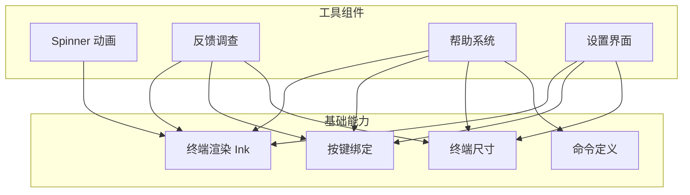
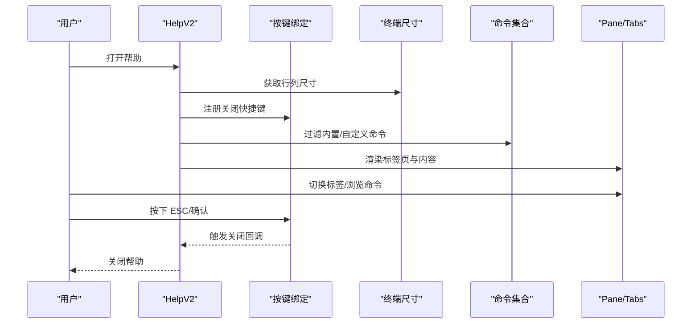
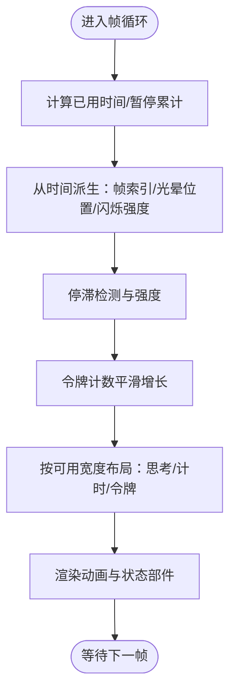
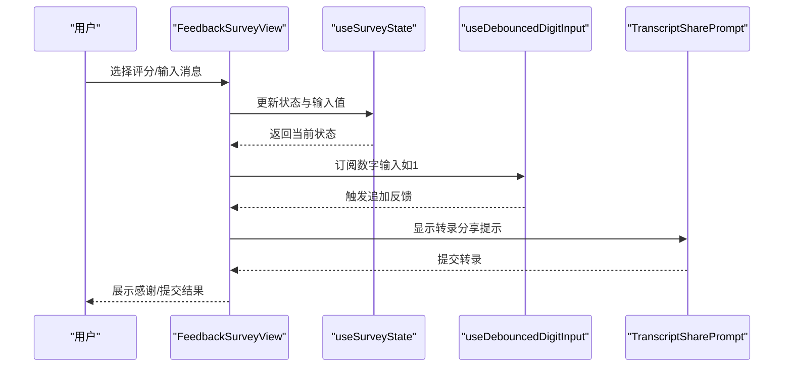
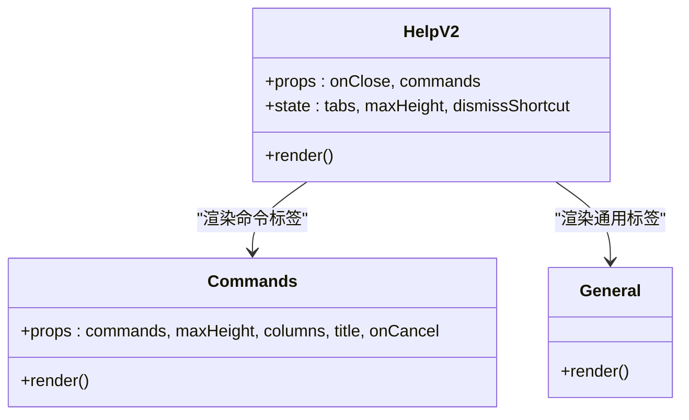
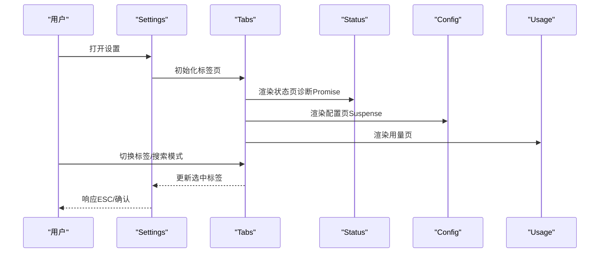
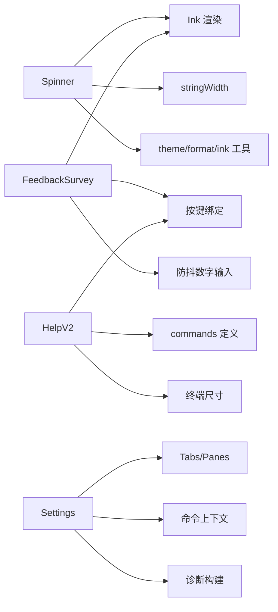

# 工具组件

<cite>
**本文档引用的文件**
- [SpinnerAnimationRow.tsx](file://src/components/Spinner/SpinnerAnimationRow.tsx)
- [FeedbackSurvey.tsx](file://src/components/FeedbackSurvey/FeedbackSurvey.tsx)
- [HelpV2.tsx](file://src/components/HelpV2/HelpV2.tsx)
- [Settings.tsx](file://src/components/Settings/Settings.tsx)
- [useDebouncedDigitInput.ts](file://src/components/FeedbackSurvey/useDebouncedDigitInput.ts)
- [useFeedbackSurvey.tsx](file://src/components/FeedbackSurvey/useFeedbackSurvey.tsx)
- [useSurveyState.tsx](file://src/components/FeedbackSurvey/useSurveyState.tsx)
- [TranscriptSharePrompt.tsx](file://src/components/FeedbackSurvey/TranscriptSharePrompt.tsx)
- [Commands.tsx](file://src/components/HelpV2/Commands.tsx)
- [General.tsx](file://src/components/HelpV2/General.tsx)
- [Config.tsx](file://src/components/Settings/Config.tsx)
- [Status.tsx](file://src/components/Settings/Status.tsx)
- [Usage.tsx](file://src/components/Settings/Usage.tsx)
- [useTerminalSize.ts](file://src/hooks/useTerminalSize.ts)
- [useExitOnCtrlCDWithKeybindings.ts](file://src/hooks/useExitOnCtrlCDWithKeybindings.ts)
- [useShortcutDisplay.ts](file://src/keybindings/useShortcutDisplay.ts)
- [useKeybinding.ts](file://src/keybindings/useKeybinding.ts)
- [commands.ts](file://src/commands.ts)
- [ink.ts](file://src/ink.ts)
- [stringWidth.ts](file://src/ink/stringWidth.ts)
- [theme.ts](file://src/utils/theme.ts)
- [format.ts](file://src/utils/format.ts)
- [ink.js](file://src/utils/ink.js)
- [Byline.tsx](file://src/components/design-system/Byline.tsx)
- [Pane.tsx](file://src/components/design-system/Pane.tsx)
- [Tabs.tsx](file://src/components/design-system/Tabs.tsx)
</cite>

## 目录
1. [简介](#简介)
2. [项目结构](#项目结构)
3. [核心组件](#核心组件)
4. [架构总览](#架构总览)
5. [详细组件分析](#详细组件分析)
6. [依赖关系分析](#依赖关系分析)
7. [性能考量](#性能考量)
8. [故障排查指南](#故障排查指南)
9. [结论](#结论)
10. [附录](#附录)

## 简介
本文件系统化梳理并说明项目中的工具组件，涵盖加载动画、反馈调查、帮助系统、设置界面等。内容包括各组件的功能特性、使用场景、配置选项、通用设计模式与复用机制、可访问性与国际化适配建议，以及扩展开发指南与最佳实践。目标是帮助开发者快速理解与高效复用这些组件。

## 项目结构
工具组件主要位于 src/components 下，按功能划分为多个子模块：
- 加载动画：Spinner（包含多文件子组件）
- 反馈调查：FeedbackSurvey（含视图、状态钩子、输入处理等）
- 帮助系统：HelpV2（命令浏览、通用信息、快捷键提示）
- 设置界面：Settings（状态、配置、用量、权限门禁）

图表来源
- [HelpV2.tsx:14-183](file://src/components/HelpV2/HelpV2.tsx#L14-L183)
- [Settings.tsx:15-129](file://src/components/Settings/Settings.tsx#L15-L129)
- [FeedbackSurvey.tsx:10-102](file://src/components/FeedbackSurvey/FeedbackSurvey.tsx#L10-L102)
- [SpinnerAnimationRow.tsx:36-231](file://src/components/Spinner/SpinnerAnimationRow.tsx#L36-L231)

章节来源
- [HelpV2.tsx:14-183](file://src/components/HelpV2/HelpV2.tsx#L14-L183)
- [Settings.tsx:15-129](file://src/components/Settings/Settings.tsx#L15-L129)
- [FeedbackSurvey.tsx:10-102](file://src/components/FeedbackSurvey/FeedbackSurvey.tsx#L10-L102)
- [SpinnerAnimationRow.tsx:36-231](file://src/components/Spinner/SpinnerAnimationRow.tsx#L36-L231)

## 核心组件
- 加载动画（Spinner）：在终端中以高帧率驱动的闪烁、光晕、计数与状态显示，支持“减少动态”模式、停滞检测、令牌计数平滑增长、思考态闪烁等。
- 反馈调查（FeedbackSurvey）：提供评分选择、感谢页、转录分享提示、提交流程与防抖数字输入处理。
- 帮助系统（HelpV2）：内置命令与自定义命令分类浏览、通用帮助、快捷键提示、ESC/退出策略。
- 设置界面（Settings）：状态诊断、配置管理、用量统计、权限门禁（可选），支持标签切换与高度自适应。

章节来源
- [SpinnerAnimationRow.tsx:36-231](file://src/components/Spinner/SpinnerAnimationRow.tsx#L36-L231)
- [FeedbackSurvey.tsx:10-102](file://src/components/FeedbackSurvey/FeedbackSurvey.tsx#L10-L102)
- [HelpV2.tsx:14-183](file://src/components/HelpV2/HelpV2.tsx#L14-L183)
- [Settings.tsx:15-129](file://src/components/Settings/Settings.tsx#L15-L129)

## 架构总览
工具组件围绕“终端渲染（Ink）+ 键盘交互 + 终端尺寸感知 + 命令与上下文”的基础设施协作：

图表来源
- [HelpV2.tsx:26-182](file://src/components/HelpV2/HelpV2.tsx#L26-L182)
- [useTerminalSize.ts](file://src/hooks/useTerminalSize.ts)
- [useKeybinding.ts](file://src/keybindings/useKeybinding.ts)
- [commands.ts](file://src/commands.ts)
- [Pane.tsx](file://src/components/design-system/Pane.tsx)
- [Tabs.tsx](file://src/components/design-system/Tabs.tsx)

## 详细组件分析

### 加载动画（Spinner）
- 功能要点
  - 高频帧驱动（每50ms）的状态派生：停滞检测、光晕移动、闪烁强度、令牌计数平滑增长。
  - 多模式显示：请求中、工具输入/使用、响应中、思考中。
  - 时间与令牌显示：根据窗口宽度与内容动态裁剪，避免溢出。
  - 思考态发光：基于共享时间源的正弦波透明度变化。
- 使用场景
  - 长任务执行时的可视化反馈；多智能体/队友并发时的进度指示。
- 配置选项
  - mode、reducedMotion、hasActiveTools、message、颜色主题、verbose、列宽、队友状态等。
- 设计模式
  - 将高频动画逻辑下沉到独立组件，父组件仅负责状态传递与低频重渲染，降低渲染压力。
- 可访问性与国际化
  - 支持“减少动态”模式；文本与颜色通过主题映射，便于无障碍阅读与本地化。

图表来源
- [SpinnerAnimationRow.tsx:102-231](file://src/components/Spinner/SpinnerAnimationRow.tsx#L102-L231)

章节来源
- [SpinnerAnimationRow.tsx:36-231](file://src/components/Spinner/SpinnerAnimationRow.tsx#L36-L231)
- [stringWidth.ts](file://src/ink/stringWidth.ts)
- [ink.ts](file://src/ink.ts)
- [theme.ts](file://src/utils/theme.ts)
- [format.ts](file://src/utils/format.ts)
- [ink.js](file://src/utils/ink.js)

### 反馈调查（FeedbackSurvey）
- 功能要点
  - 状态机：关闭、打开、感谢、转录提示、提交中、已提交。
  - 评分选择与消息输入；转录分享提示；提交流程与防抖数字输入。
  - 感谢页支持“追加反馈”触发器（数字1）。
- 使用场景
  - 用户完成任务后的满意度收集；可选转录分享；二次反馈入口。
- 配置选项
  - state、lastResponse、inputValue、handleSelect、handleTranscriptSelect、onRequestFeedback、message。
- 设计模式
  - 将视图与状态分离（useSurveyState、useFeedbackSurvey），输入处理抽离为独立钩子（useDebouncedDigitInput）。
- 可访问性与国际化
  - 文本与颜色通过主题与样式系统统一；数字输入限制与校验确保可操作性。

图表来源
- [FeedbackSurvey.tsx:20-102](file://src/components/FeedbackSurvey/FeedbackSurvey.tsx#L20-L102)
- [useSurveyState.tsx](file://src/components/FeedbackSurvey/useSurveyState.tsx)
- [useFeedbackSurvey.tsx](file://src/components/FeedbackSurvey/useFeedbackSurvey.tsx)
- [useDebouncedDigitInput.ts](file://src/components/FeedbackSurvey/useDebouncedDigitInput.ts)
- [TranscriptSharePrompt.tsx](file://src/components/FeedbackSurvey/TranscriptSharePrompt.tsx)

章节来源
- [FeedbackSurvey.tsx:10-174](file://src/components/FeedbackSurvey/FeedbackSurvey.tsx#L10-L174)
- [useDebouncedDigitInput.ts](file://src/components/FeedbackSurvey/useDebouncedDigitInput.ts)
- [useFeedbackSurvey.tsx](file://src/components/FeedbackSurvey/useFeedbackSurvey.tsx)
- [useSurveyState.tsx](file://src/components/FeedbackSurvey/useSurveyState.tsx)
- [TranscriptSharePrompt.tsx](file://src/components/FeedbackSurvey/TranscriptSharePrompt.tsx)

### 帮助系统（HelpV2）
- 功能要点
  - 分类标签：通用、内置命令、自定义命令、（可选）ANT专用命令。
  - 快捷键提示与ESC/退出策略；根据终端尺寸自适应高度。
  - 内置命令与自定义命令过滤与展示。
- 使用场景
  - 快速查阅命令、切换查看模式、在模态与全屏间切换。
- 配置选项
  - onClose、commands、默认标签页、快捷键上下文。
- 设计模式
  - 将命令过滤与标签页构建逻辑封装，避免重复计算；按键绑定与快捷键显示解耦。
- 可访问性与国际化
  - 标题与提示文本统一；快捷键显示支持多语言；模态内高度约束避免遮挡。

图表来源
- [HelpV2.tsx:20-182](file://src/components/HelpV2/HelpV2.tsx#L20-L182)
- [Commands.tsx](file://src/components/HelpV2/Commands.tsx)
- [General.tsx](file://src/components/HelpV2/General.tsx)

章节来源
- [HelpV2.tsx:14-183](file://src/components/HelpV2/HelpV2.tsx#L14-L183)
- [useTerminalSize.ts](file://src/hooks/useTerminalSize.ts)
- [useExitOnCtrlCDWithKeybindings.ts](file://src/hooks/useExitOnCtrlCDWithKeybindings.ts)
- [useShortcutDisplay.ts](file://src/keybindings/useShortcutDisplay.ts)
- [useKeybinding.ts](file://src/keybindings/useKeybinding.ts)
- [commands.ts](file://src/commands.ts)

### 设置界面（Settings）
- 功能要点
  - 标签页：状态、配置、用量、（可选）门禁。
  - 状态页：诊断信息异步加载；配置页：搜索模式下的ESC接管；门禁页：可选。
  - 高度自适应：模态内与终端内不同策略；默认标签聚焦优化。
- 使用场景
  - 查看系统状态、调整配置、监控用量、必要时管理权限门禁。
- 配置选项
  - onClose、context、defaultTab、内容高度、标签页可见性。
- 设计模式
  - 通过Suspense延迟加载配置页；状态页诊断Promise仅初始化一次；ESC策略按标签与模式动态启用。
- 可访问性与国际化
  - 标签页初始聚焦与键盘导航；颜色方案统一；内容高度约束避免滚动冲突。

图表来源
- [Settings.tsx:22-129](file://src/components/Settings/Settings.tsx#L22-L129)
- [Status.tsx](file://src/components/Settings/Status.tsx)
- [Config.tsx](file://src/components/Settings/Config.tsx)
- [Usage.tsx](file://src/components/Settings/Usage.tsx)

章节来源
- [Settings.tsx:15-137](file://src/components/Settings/Settings.tsx#L15-L137)

## 依赖关系分析
- 组件间依赖
  - Spinner 依赖 Ink 渲染、字符串宽度计算、主题与格式化工具。
  - FeedbackSurvey 依赖 Analytics 日志、Ink 渲染、防抖输入钩子。
  - HelpV2 依赖命令集合、按键绑定、终端尺寸、快捷键显示。
  - Settings 依赖 Tabs/Panes 容器、命令上下文、诊断构建。
- 外部依赖
  - 键盘绑定与快捷键显示、终端尺寸感知、命令定义与上下文。

图表来源
- [SpinnerAnimationRow.tsx:1-265](file://src/components/Spinner/SpinnerAnimationRow.tsx#L1-L265)
- [FeedbackSurvey.tsx:1-174](file://src/components/FeedbackSurvey/FeedbackSurvey.tsx#L1-L174)
- [HelpV2.tsx:1-184](file://src/components/HelpV2/HelpV2.tsx#L1-L184)
- [Settings.tsx:1-137](file://src/components/Settings/Settings.tsx#L1-L137)

章节来源
- [SpinnerAnimationRow.tsx:1-265](file://src/components/Spinner/SpinnerAnimationRow.tsx#L1-L265)
- [FeedbackSurvey.tsx:1-174](file://src/components/FeedbackSurvey/FeedbackSurvey.tsx#L1-L174)
- [HelpV2.tsx:1-184](file://src/components/HelpV2/HelpV2.tsx#L1-L184)
- [Settings.tsx:1-137](file://src/components/Settings/Settings.tsx#L1-L137)

## 性能考量
- 高频动画与渲染
  - Spinner 将高频帧循环下沉至子组件，父组件仅在状态变更时重渲染，显著降低渲染成本。
  - 字符串宽度计算通过 memo 化减少昂贵调用。
- 异步与懒加载
  - Settings 的诊断构建仅初始化一次；配置页使用 Suspense 延迟加载，避免首屏阻塞。
- 交互与事件
  - 反馈调查的数字输入采用防抖策略，减少无效渲染与网络请求。
- 可视化与布局
  - 帮助与设置均根据终端尺寸动态计算高度，避免溢出与滚动冲突。

[本节为通用指导，无需特定文件引用]

## 故障排查指南
- 加载动画不刷新或卡顿
  - 检查 reducedMotion 是否开启；确认 hasActiveTools 与 leaderIsIdle 的状态是否正确传递；核对帧循环是否被父组件抑制。
- 反馈调查无法提交
  - 校验输入合法性（isValidResponseInput）；确认转录提示状态与 handleTranscriptSelect 是否存在；检查 Analytics 日志是否上报。
- 帮助界面标签不显示或高度异常
  - 确认命令列表是否为空；检查内置/自定义命令过滤逻辑；核对终端尺寸钩子返回值。
- 设置界面配置页空白
  - 检查 Suspense fallback 是否被意外覆盖；确认诊断 Promise 是否成功解析；核对内容高度与模态状态。

章节来源
- [SpinnerAnimationRow.tsx:102-231](file://src/components/Spinner/SpinnerAnimationRow.tsx#L102-L231)
- [FeedbackSurvey.tsx:32-102](file://src/components/FeedbackSurvey/FeedbackSurvey.tsx#L32-L102)
- [HelpV2.tsx:55-137](file://src/components/HelpV2/HelpV2.tsx#L55-L137)
- [Settings.tsx:70-129](file://src/components/Settings/Settings.tsx#L70-L129)

## 结论
上述工具组件通过清晰的职责划分、高频动画下沉、异步与懒加载策略，以及统一的主题与键盘交互体系，实现了高性能、可维护且易扩展的终端工具集。建议在新功能开发中遵循现有模式：将高频渲染逻辑下沉、使用钩子抽象交互与状态、通过容器组件统一布局与尺寸策略，并结合主题与快捷键系统提升可访问性与一致性。

[本节为总结，无需特定文件引用]

## 附录
- 扩展开发指南
  - 复用渲染与主题：优先使用 Ink 组件与主题映射，保持一致的视觉与无障碍体验。
  - 交互与快捷键：通过统一的按键绑定与快捷键显示钩子，保证跨组件一致的行为。
  - 性能优化：高频动画下沉、memo 化与防抖策略、Suspense 懒加载。
  - 可访问性：提供“减少动态”模式、语义化文本、颜色对比度与键盘导航。
  - 国际化：文本与提示统一管理，快捷键显示支持多语言环境。
- 最佳实践
  - 将状态与视图分离，使用独立钩子管理复杂交互。
  - 在容器组件中集中处理尺寸、焦点与布局，子组件专注渲染。
  - 对外部依赖进行抽象（如命令、上下文、诊断），便于测试与替换。

[本节为通用指导，无需特定文件引用]