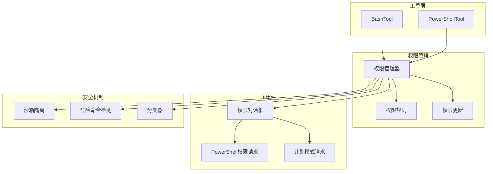
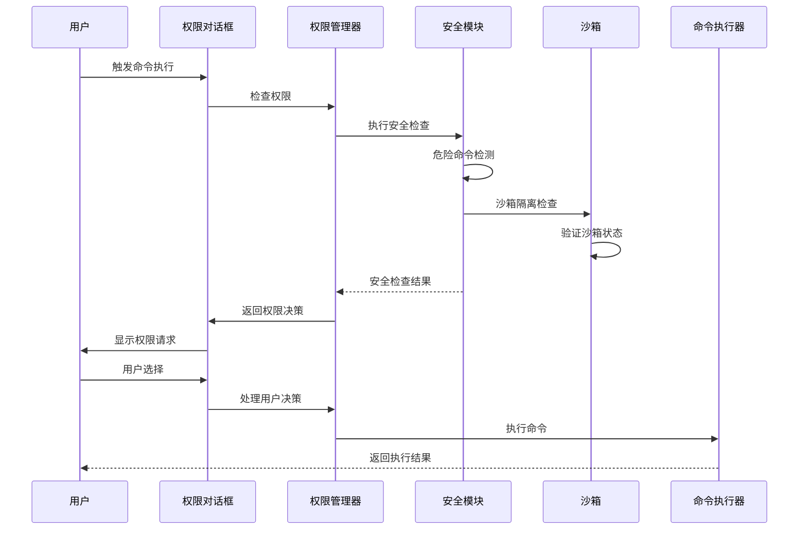
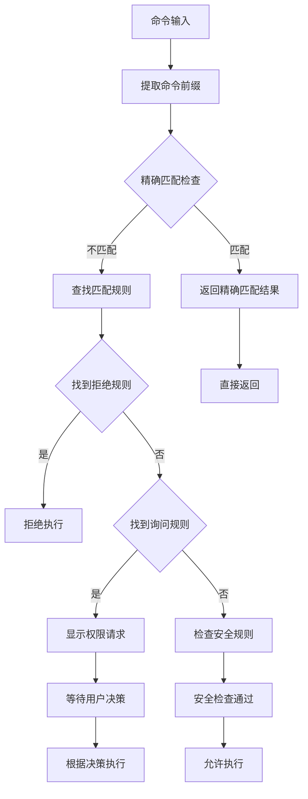
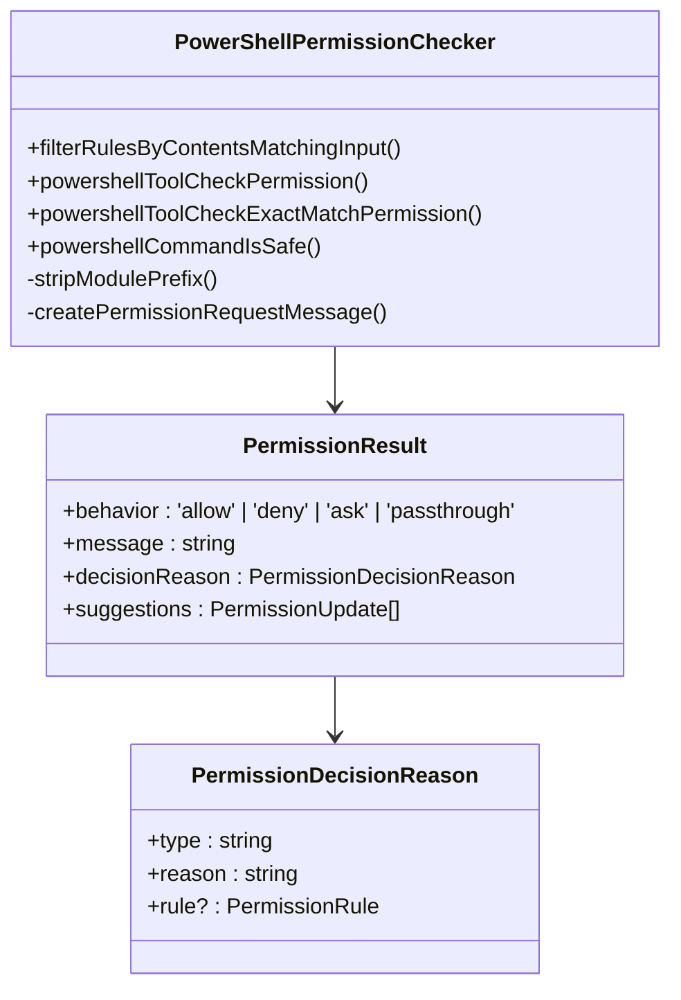
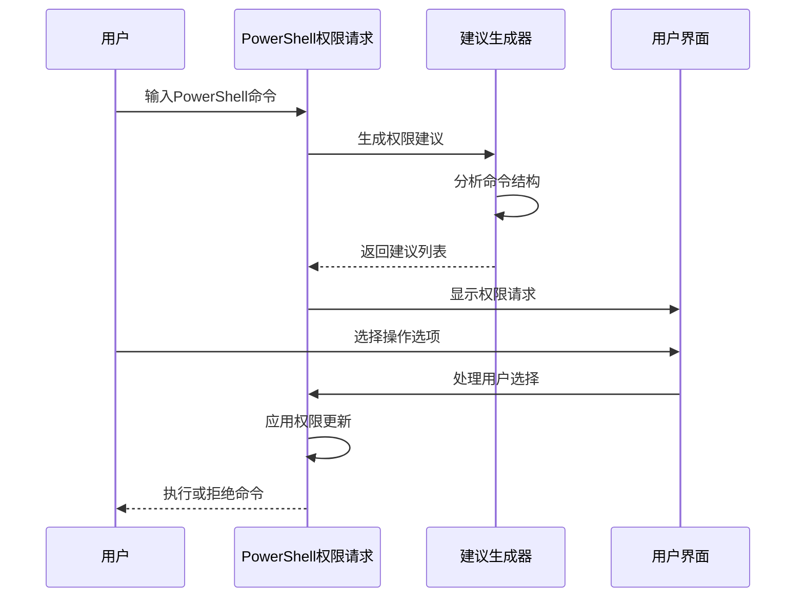
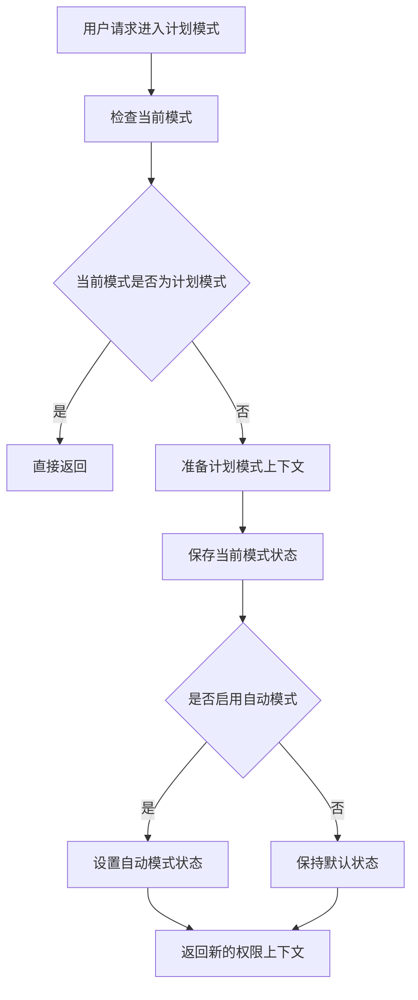
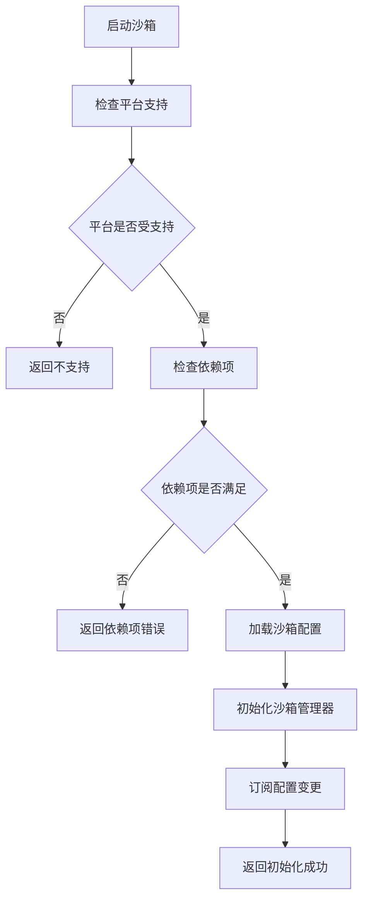
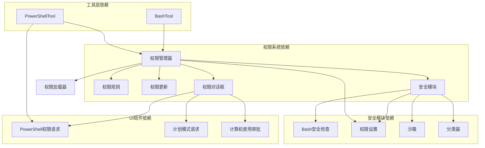

# Shell权限对话框

<cite>
**本文档引用的文件**
- [bashPermissions.ts](file://src/tools/BashTool/bashPermissions.ts)
- [powershellPermissions.ts](file://src/tools/PowerShellTool/powershellPermissions.ts)
- [bashSecurity.ts](file://src/tools/BashTool/bashSecurity.ts)
- [PowerShellPermissionRequest.tsx](file://src/components/permissions/PowerShellPermissionRequest/PowerShellPermissionRequest.tsx)
- [permissions.ts](file://src/utils/permissions/permissions.ts)
- [permissionsLoader.ts](file://src/utils/permissions/permissionsLoader.ts)
- [permissionSetup.ts](file://src/utils/permissions/permissionSetup.ts)
- [PermissionDialog.tsx](file://src/components/permissions/PermissionDialog.tsx)
- [bashClassifier.ts](file://src/utils/permissions/bashClassifier.ts)
- [sandbox-adapter.ts](file://src/utils/sandbox/sandbox-adapter.ts)
- [sandbox-ui-utils.ts](file://src/utils/sandbox/sandbox-ui-utils.ts)
- [SandboxConfigTab.tsx](file://src/components/sandbox/SandboxConfigTab.tsx)
- [EnterPlanModePermissionRequest.tsx](file://src/components/permissions/EnterPlanModePermissionRequest/EnterPlanModePermissionRequest.tsx)
- [ComputerUseApproval.tsx](file://src/components/permissions/ComputerUseApproval/ComputerUseApproval.tsx)
</cite>

## 目录
1. [简介](#简介)
2. [项目结构](#项目结构)
3. [核心组件](#核心组件)
4. [架构概览](#架构概览)
5. [详细组件分析](#详细组件分析)
6. [依赖关系分析](#依赖关系分析)
7. [性能考虑](#性能考虑)
8. [故障排除指南](#故障排除指南)
9. [结论](#结论)

## 简介

Shell权限对话框系统是一个全面的安全框架，用于管理和控制Bash和PowerShell命令执行权限。该系统提供了多层次的安全保护，包括权限验证、危险命令警告、沙箱隔离机制，以及计划模式和计算机使用权限的审批流程。

该系统的核心目标是确保用户在执行潜在危险的Shell命令时能够得到适当的权限验证和安全保护，同时为用户提供透明的权限决策过程和可追溯的操作记录。

## 项目结构

Shell权限对话框系统主要分布在以下关键目录中：

**图表来源**
- [bashPermissions.ts:1-800](file://src/tools/BashTool/bashPermissions.ts#L1-L800)
- [powershellPermissions.ts:157-430](file://src/tools/PowerShellTool/powershellPermissions.ts#L157-L430)
- [permissions.ts:1-800](file://src/utils/permissions/permissions.ts#L1-L800)

**章节来源**
- [bashPermissions.ts:1-800](file://src/tools/BashTool/bashPermissions.ts#L1-L800)
- [powershellPermissions.ts:157-430](file://src/tools/PowerShellTool/powershellPermissions.ts#L157-L430)
- [permissions.ts:1-800](file://src/utils/permissions/permissions.ts#L1-L800)

## 核心组件

### 权限管理系统

权限管理系统是整个Shell权限对话框的核心，负责处理所有权限相关的逻辑：

- **权限规则引擎**：支持允许、拒绝、询问三种行为模式
- **规则匹配算法**：支持精确匹配和前缀匹配
- **动态权限更新**：支持运行时添加和删除权限规则
- **权限上下文管理**：维护当前用户的权限状态

### 安全检测机制

系统实现了多层次的安全检测机制：

- **Bash安全检查**：检测危险的命令模式和注入攻击
- **PowerShell危险命令识别**：识别潜在的恶意PowerShell命令
- **沙箱隔离**：提供额外的执行环境隔离
- **路径约束验证**：防止路径遍历攻击

### 用户界面组件

权限对话框系统提供了直观的用户界面：

- **PowerShell权限请求对话框**：专门针对PowerShell命令的权限请求
- **通用权限对话框**：适用于各种工具的权限请求
- **计划模式权限请求**：用于进入和退出计划模式
- **计算机使用权限审批**：用于计算机使用权限的审批流程

**章节来源**
- [permissions.ts:1-800](file://src/utils/permissions/permissions.ts#L1-L800)
- [PowerShellPermissionRequest.tsx:1-235](file://src/components/permissions/PowerShellPermissionRequest/PowerShellPermissionRequest.tsx#L1-L235)
- [PermissionDialog.tsx:1-72](file://src/components/permissions/PermissionDialog.tsx#L1-L72)

## 架构概览

**图表来源**
- [permissions.ts:473-520](file://src/utils/permissions/permissions.ts#L473-L520)
- [bashSecurity.ts:1-800](file://src/tools/BashTool/bashSecurity.ts#L1-L800)
- [sandbox-adapter.ts:537-985](file://src/utils/sandbox/sandbox-adapter.ts#L537-L985)

## 详细组件分析

### Bash权限系统

Bash权限系统提供了全面的命令执行安全保护：

#### 权限检查流程

**图表来源**
- [bashPermissions.ts:435-469](file://src/tools/BashTool/bashPermissions.ts#L435-L469)

#### 危险命令检测

Bash安全系统实现了多种危险命令检测机制：

- **命令替换检测**：检测`$()`、`${}`等命令替换模式
- **进程替换检测**：识别`<()`、`>()`等进程替换
- **Zsh危险命令检测**：检测zmodload等危险命令
- **Git提交安全检查**：验证git commit命令的安全性

**章节来源**
- [bashSecurity.ts:1-800](file://src/tools/BashTool/bashSecurity.ts#L1-L800)
- [bashPermissions.ts:1-800](file://src/tools/BashTool/bashPermissions.ts#L1-L800)

### PowerShell权限系统

PowerShell权限系统专门为Windows环境设计：

#### 权限检查算法

PowerShell权限检查采用了独特的算法来处理大小写不敏感的匹配：

**图表来源**
- [powershellPermissions.ts:170-430](file://src/tools/PowerShellTool/powershellPermissions.ts#L170-L430)

#### PowerShell安全特性

PowerShell权限系统具有以下安全特性：

- **大小写不敏感匹配**：确保权限规则对PowerShell命令的大小写不敏感
- **模块前缀处理**：正确处理PowerShell模块前缀的匹配
- **危险命令识别**：识别PowerShell中的危险命令模式
- **脚本块检测**：检测潜在的恶意脚本块

**章节来源**
- [powershellPermissions.ts:157-430](file://src/tools/PowerShellTool/powershellPermissions.ts#L157-L430)

### 权限对话框组件

权限对话框系统提供了用户友好的交互界面：

#### PowerShell权限请求对话框

PowerShell权限请求对话框具有以下特点：

- **自动前缀建议**：基于命令内容自动生成权限规则建议
- **多选项支持**：支持"是"、"是并应用建议"、"是并编辑前缀"、"否"等多种选项
- **破坏性警告**：对可能造成破坏的命令显示警告信息
- **调试信息**：提供详细的权限决策调试信息

**图表来源**
- [PowerShellPermissionRequest.tsx:100-194](file://src/components/permissions/PowerShellPermissionRequest/PowerShellPermissionRequest.tsx#L100-L194)

**章节来源**
- [PowerShellPermissionRequest.tsx:1-235](file://src/components/permissions/PowerShellPermissionRequest/PowerShellPermissionRequest.tsx#L1-L235)

### 计划模式权限系统

计划模式提供了特殊的权限管理模式：

#### 计划模式进入流程

**图表来源**
- [permissionSetup.ts:1457-1493](file://src/utils/permissions/permissionSetup.ts#L1457-L1493)

#### 计划模式权限请求

计划模式权限请求对话框提供了专门的用户界面：

- **模式转换支持**：支持从其他模式切换到计划模式
- **自动模式集成**：与自动模式权限系统集成
- **权限状态跟踪**：跟踪计划模式的权限状态变化

**章节来源**
- [EnterPlanModePermissionRequest.tsx:1-32](file://src/components/permissions/EnterPlanModePermissionRequest/EnterPlanModePermissionRequest.tsx#L1-L32)
- [permissionSetup.ts:1457-1493](file://src/utils/permissions/permissionSetup.ts#L1457-L1493)

### 沙箱隔离机制

沙箱隔离提供了额外的执行环境保护：

#### 沙箱初始化流程

**图表来源**
- [sandbox-adapter.ts:537-792](file://src/utils/sandbox/sandbox-adapter.ts#L537-L792)

#### 沙箱配置管理

沙箱系统提供了灵活的配置管理：

- **动态配置更新**：支持运行时更新沙箱配置
- **平台特定设置**：支持不同平台的特定配置
- **依赖项检查**：自动检查沙箱运行所需的依赖项
- **错误处理**：提供详细的沙箱初始化错误信息

**章节来源**
- [sandbox-adapter.ts:537-985](file://src/utils/sandbox/sandbox-adapter.ts#L537-L985)
- [SandboxConfigTab.tsx:1-34](file://src/components/sandbox/SandboxConfigTab.tsx#L1-L34)

## 依赖关系分析

**图表来源**
- [permissions.ts:1-800](file://src/utils/permissions/permissions.ts#L1-L800)
- [permissionsLoader.ts:1-297](file://src/utils/permissions/permissionsLoader.ts#L1-L297)
- [permissionSetup.ts:1-800](file://src/utils/permissions/permissionSetup.ts#L1-L800)

**章节来源**
- [permissions.ts:1-800](file://src/utils/permissions/permissions.ts#L1-L800)
- [permissionsLoader.ts:1-297](file://src/utils/permissions/permissionsLoader.ts#L1-L297)
- [permissionSetup.ts:1-800](file://src/utils/permissions/permissionSetup.ts#L1-L800)

## 性能考虑

### 权限检查优化

系统在权限检查方面采用了多种优化策略：

- **规则缓存**：缓存已解析的权限规则以提高查询速度
- **早期短路**：在找到明确匹配时立即停止进一步检查
- **并发处理**：支持并发的权限检查操作
- **内存管理**：优化内存使用以避免权限检查过程中的内存泄漏

### 安全检查性能

安全检查系统在保证安全性的同时也考虑了性能影响：

- **渐进式检查**：按照复杂度递增的顺序进行安全检查
- **智能跳过**：对于明显安全的命令跳过复杂的检查步骤
- **异步处理**：将耗时的安全检查操作异步化
- **结果缓存**：缓存安全检查结果以避免重复计算

## 故障排除指南

### 常见问题诊断

#### 权限请求不显示

如果权限请求对话框没有正常显示，可以检查以下问题：

1. **权限规则配置**：确认权限规则是否正确配置
2. **用户权限状态**：检查用户的权限状态是否正确
3. **工具集成**：确认工具是否正确集成了权限检查
4. **UI渲染**：检查权限对话框组件是否正常渲染

#### 沙箱初始化失败

沙箱初始化失败的常见原因：

1. **平台不支持**：检查当前平台是否支持沙箱功能
2. **依赖项缺失**：确认所有必需的依赖项都已安装
3. **权限不足**：检查是否有足够的权限启动沙箱
4. **配置错误**：验证沙箱配置是否正确

#### 安全检查误报

如果安全检查系统错误地阻止了合法的命令：

1. **检查规则配置**：确认权限规则是否过于严格
2. **更新安全规则**：根据实际使用情况调整安全规则
3. **联系支持**：报告误报情况以获得帮助

**章节来源**
- [sandbox-adapter.ts:562-592](file://src/utils/sandbox/sandbox-adapter.ts#L562-L592)
- [sandbox-ui-utils.ts:1-12](file://src/utils/sandbox/sandbox-ui-utils.ts#L1-L12)

## 结论

Shell权限对话框系统提供了一个全面而强大的安全框架，用于保护用户免受潜在危险的Shell命令的影响。该系统通过多层次的安全检查、智能的权限管理和直观的用户界面，为用户提供了既安全又易用的Shell命令执行体验。

系统的主要优势包括：

- **全面的安全保护**：涵盖Bash和PowerShell两种主要的Shell环境
- **灵活的权限管理**：支持动态权限规则和实时权限更新
- **用户友好的界面**：提供清晰的权限请求和决策流程
- **可扩展的架构**：支持新的安全检查和权限管理功能
- **详细的审计日志**：提供完整的权限使用记录和分析能力

通过持续改进和扩展，该系统将继续为用户提供可靠的安全保护，同时保持良好的用户体验。