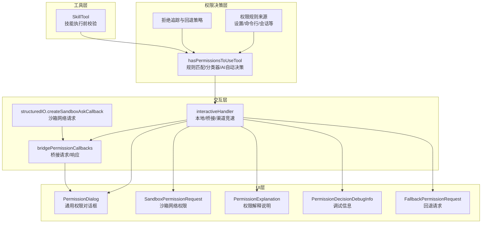
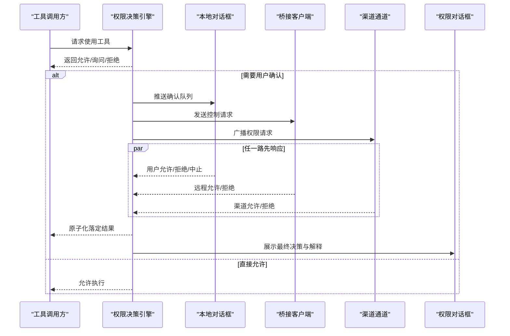
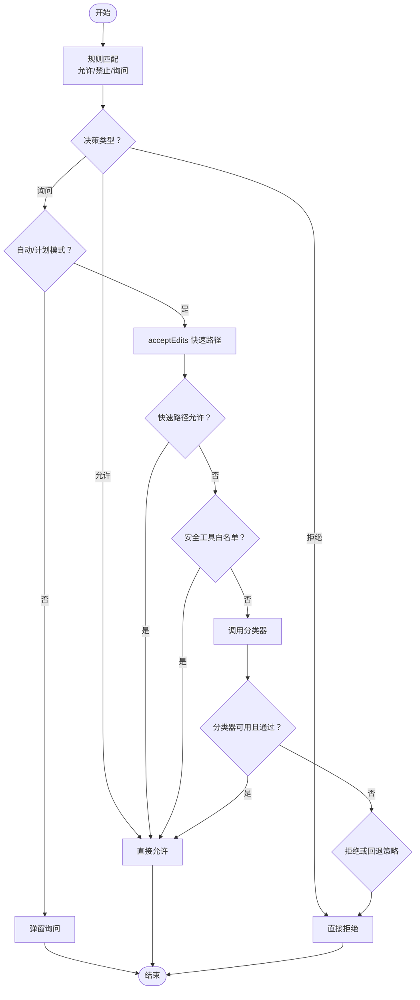
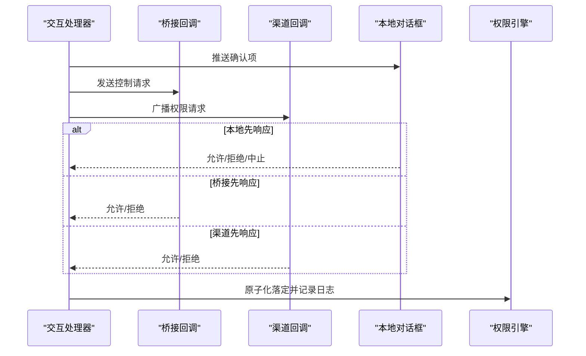
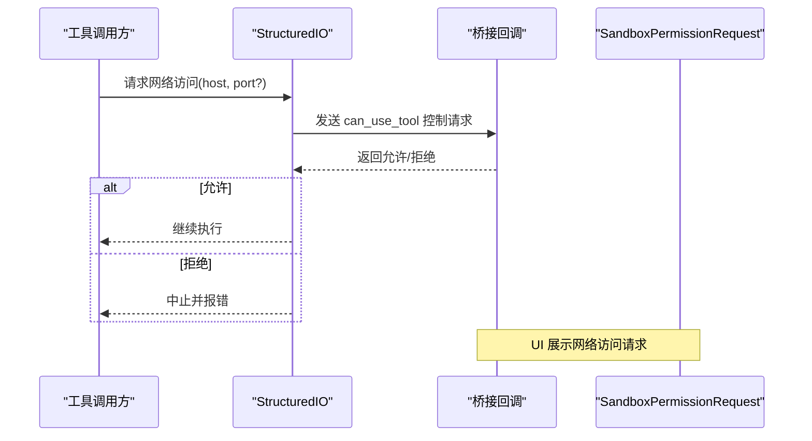
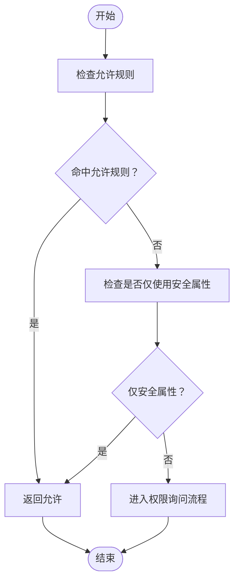
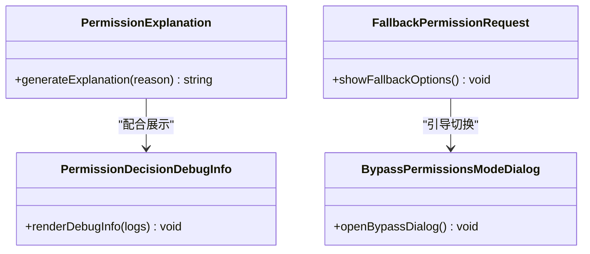
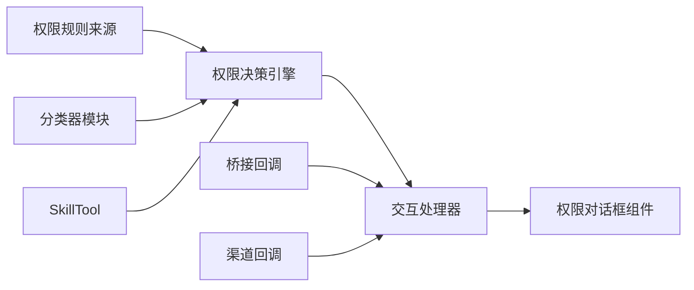

# 技能和特殊权限对话框

<cite>
**本文引用的文件**   
- [bridgePermissionCallbacks.ts](file://src/bridge/bridgePermissionCallbacks.ts)
- [interactiveHandler.ts](file://src/hooks/toolPermission/handlers/interactiveHandler.ts)
- [permissions.ts](file://src/utils/permissions/permissions.ts)
- [structuredIO.ts](file://src/cli/structuredIO.ts)
- [PermissionDialog.tsx](file://src/components/permissions/PermissionDialog.tsx)
- [SandboxPermissionRequest.tsx](file://src/components/permissions/SandboxPermissionRequest.tsx)
- [PermissionExplanation.tsx](file://src/components/permissions/PermissionExplanation.tsx)
- [PermissionDecisionDebugInfo.tsx](file://src/components/permissions/PermissionDecisionDebugInfo.tsx)
- [FallbackPermissionRequest.tsx](file://src/components/permissions/FallbackPermissionRequest.tsx)
- [BypassPermissionsModeDialog.tsx](file://src/components/BypassPermissionsModeDialog.tsx)
- [SkillTool.ts](file://src/tools/SkillTool/SkillTool.ts)
- [inProcessTeammateHelpers.ts](file://src/utils/inProcessTeammateHelpers.ts)
- [useRemoteSession.ts](file://src/hooks/useRemoteSession.ts)
</cite>

## 目录
1. [简介](#简介)
2. [项目结构](#项目结构)
3. [核心组件](#核心组件)
4. [架构总览](#架构总览)
5. [详细组件分析](#详细组件分析)
6. [依赖关系分析](#依赖关系分析)
7. [性能考量](#性能考量)
8. [故障排除指南](#故障排除指南)
9. [结论](#结论)
10. [附录](#附录)

## 简介
本文件系统性阐述“技能和特殊权限对话框”体系：从技能执行前的权限验证、沙箱网络访问的特殊权限请求，到回退权限请求的触发与降级策略；并提供权限决策调试信息查看方法与权限解释说明的生成机制，最后给出故障排除与性能优化建议。目标是帮助开发者与使用者理解权限系统如何在多端（本地 CLI、桥接客户端、渠道通道）协同工作，并在保证安全的前提下提供流畅体验。

## 项目结构
权限系统围绕“权限决策引擎 + 多路交互通道 + 对话框组件 + 沙箱/技能工具”的协作展开。关键模块包括：
- 权限决策与规则：位于工具权限上下文与规则解析器中，负责规则匹配、分类器自动决策与拒绝追踪。
- 交互处理器：统一调度本地/桥接/渠道三路响应，原子化处理用户选择与自动化结果。
- 对话框组件：呈现权限请求、解释说明、调试信息与回退策略。
- 特殊权限：沙箱网络访问通过专用请求回调转发至桥接协议。
- 技能工具：对技能调用进行前置校验与安全检查，支持仅使用安全属性时的自动放行。

**图表来源**
- [permissions.ts:473-800](file://src/utils/permissions/permissions.ts#L473-L800)
- [interactiveHandler.ts:57-537](file://src/hooks/toolPermission/handlers/interactiveHandler.ts#L57-L537)
- [bridgePermissionCallbacks.ts:1-44](file://src/bridge/bridgePermissionCallbacks.ts#L1-L44)
- [structuredIO.ts:723-753](file://src/cli/structuredIO.ts#L723-L753)
- [PermissionDialog.tsx](file://src/components/permissions/PermissionDialog.tsx)
- [SandboxPermissionRequest.tsx](file://src/components/permissions/SandboxPermissionRequest.tsx)
- [PermissionExplanation.tsx](file://src/components/permissions/PermissionExplanation.tsx)
- [PermissionDecisionDebugInfo.tsx](file://src/components/permissions/PermissionDecisionDebugInfo.tsx)
- [FallbackPermissionRequest.tsx](file://src/components/permissions/FallbackPermissionRequest.tsx)
- [SkillTool.ts:506-538](file://src/tools/SkillTool/SkillTool.ts#L506-L538)

**章节来源**
- [permissions.ts:1-800](file://src/utils/permissions/permissions.ts#L1-L800)
- [interactiveHandler.ts:1-537](file://src/hooks/toolPermission/handlers/interactiveHandler.ts#L1-L537)
- [bridgePermissionCallbacks.ts:1-44](file://src/bridge/bridgePermissionCallbacks.ts#L1-L44)
- [structuredIO.ts:723-753](file://src/cli/structuredIO.ts#L723-L753)

## 核心组件
- 权限决策引擎
  - 规则匹配：允许/禁止/询问规则按来源聚合，支持工具全名与 MCP 服务器级匹配。
  - 自动决策：在“自动/计划”模式下，优先尝试 acceptEdits 快速路径与安全工具白名单，再使用分类器进行 AI 决策。
  - 拒绝追踪：记录连续拒绝次数与总次数，用于触发回退提示或降级策略。
- 交互处理器
  - 本地/桥接/渠道三路竞速：任一路先返回即原子化落定，其余竞速者被取消。
  - 分类器指示器：在 Bash 工具上显示“分类器运行中”，避免误触。
  - 用户反馈：支持允许/拒绝/中止，以及更新输入与权限规则。
- 对话框与解释
  - 通用权限对话框：展示描述、输入预览、建议更新与阻断路径。
  - 沙箱网络权限：以专用对话框请求网络访问许可。
  - 权限解释：基于决策原因生成可读说明，含规则来源、Hook 名称、子命令列表等。
  - 调试信息：记录决策来源、耗时、分类器阶段与成本等指标。
  - 回退请求：当分类器不可用或拒绝过多时，引导用户进入“提示模式”或“绕过权限模式”。

**章节来源**
- [permissions.ts:122-302](file://src/utils/permissions/permissions.ts#L122-L302)
- [permissions.ts:473-800](file://src/utils/permissions/permissions.ts#L473-L800)
- [interactiveHandler.ts:57-537](file://src/hooks/toolPermission/handlers/interactiveHandler.ts#L57-L537)
- [PermissionDialog.tsx](file://src/components/permissions/PermissionDialog.tsx)
- [SandboxPermissionRequest.tsx](file://src/components/permissions/SandboxPermissionRequest.tsx)
- [PermissionExplanation.tsx](file://src/components/permissions/PermissionExplanation.tsx)
- [PermissionDecisionDebugInfo.tsx](file://src/components/permissions/PermissionDecisionDebugInfo.tsx)
- [FallbackPermissionRequest.tsx](file://src/components/permissions/FallbackPermissionRequest.tsx)

## 架构总览
权限系统采用“决策引擎 + 多通道交互 + 统一 UI”的分层设计。工具调用发起后，先由权限引擎评估是否需要用户确认；若需要，则通过本地对话框、桥接客户端或渠道通道并发弹窗，用户任一选择都会立即生效并取消其他竞速通道。对于沙箱网络访问，系统通过桥接协议转发为“工具使用”请求，从而复用现有 UI 与规则体系。

**图表来源**
- [permissions.ts:473-800](file://src/utils/permissions/permissions.ts#L473-L800)
- [interactiveHandler.ts:57-537](file://src/hooks/toolPermission/handlers/interactiveHandler.ts#L57-L537)
- [bridgePermissionCallbacks.ts:10-27](file://src/bridge/bridgePermissionCallbacks.ts#L10-L27)

## 详细组件分析

### 权限决策与规则匹配
- 规则来源与聚合
  - 支持来自设置、命令行、会话等多源规则，统一转换为规则对象并按行为（允许/禁止/询问）分类。
  - 工具级匹配支持 MCP 服务器级规则（如 mcp__server1 匹配该服务器下的所有工具）。
- 自动决策路径
  - 在自动/计划模式下，优先尝试 acceptEdits 快速路径与安全工具白名单；若仍需人类判断，则调用分类器进行 AI 决策。
  - 若分类器不可用或失败，根据拒绝追踪状态决定是否回退到“提示模式”或直接拒绝。
- 拒绝追踪与回退
  - 记录连续拒绝次数与总次数，超过阈值时触发回退提示，引导用户调整权限模式或查看调试信息。

**图表来源**
- [permissions.ts:122-302](file://src/utils/permissions/permissions.ts#L122-L302)
- [permissions.ts:473-800](file://src/utils/permissions/permissions.ts#L473-L800)

**章节来源**
- [permissions.ts:122-302](file://src/utils/permissions/permissions.ts#L122-L302)
- [permissions.ts:473-800](file://src/utils/permissions/permissions.ts#L473-L800)

### 交互处理器：本地/桥接/渠道竞速
- 原子化落定
  - 使用“仅一次解析”机制防止多路竞速导致的重复决议；任一路先到达即取消其他通道。
- 分类器指示器
  - 在 Bash 工具上显示“分类器运行中”，并在用户交互后清除，避免误触。
- 桥接与渠道
  - 桥接：通过桥接回调发送请求并订阅响应；渠道：向已连接的渠道客户端广播请求。
- 用户反馈
  - 支持允许（可携带更新后的输入与权限）、拒绝（可携带反馈）、中止（取消当前请求）。

**图表来源**
- [interactiveHandler.ts:57-537](file://src/hooks/toolPermission/handlers/interactiveHandler.ts#L57-L537)
- [bridgePermissionCallbacks.ts:10-27](file://src/bridge/bridgePermissionCallbacks.ts#L10-L27)

**章节来源**
- [interactiveHandler.ts:57-537](file://src/hooks/toolPermission/handlers/interactiveHandler.ts#L57-L537)
- [bridgePermissionCallbacks.ts:1-44](file://src/bridge/bridgePermissionCallbacks.ts#L1-L44)

### 沙箱权限请求：网络访问的特殊处理
- 请求转发
  - 将沙箱网络访问请求通过桥接协议转发为“工具使用”请求，使用合成工具名与描述，以便复用现有 UI 与规则。
- 安全检查
  - 若请求失败（如流关闭、中止），默认拒绝，确保最小暴露面。
- UI 协同
  - 通过专用对话框呈现网络访问请求，用户可在桥接端或本地确认。

**图表来源**
- [structuredIO.ts:723-753](file://src/cli/structuredIO.ts#L723-L753)
- [bridgePermissionCallbacks.ts:10-27](file://src/bridge/bridgePermissionCallbacks.ts#L10-L27)
- [SandboxPermissionRequest.tsx](file://src/components/permissions/SandboxPermissionRequest.tsx)

**章节来源**
- [structuredIO.ts:723-753](file://src/cli/structuredIO.ts#L723-L753)
- [bridgePermissionCallbacks.ts:1-44](file://src/bridge/bridgePermissionCallbacks.ts#L1-L44)

### 技能权限请求：执行前的安全检查
- 规则优先
  - 首先检查允许规则，命中即直接允许。
- 安全属性白名单
  - 对于特定类型的技能（如仅包含安全属性），直接允许，避免过度拦截。
- 决策原因
  - 允许时可携带决策原因（规则命中），便于解释与调试。

**图表来源**
- [SkillTool.ts:506-538](file://src/tools/SkillTool/SkillTool.ts#L506-L538)

**章节来源**
- [SkillTool.ts:506-538](file://src/tools/SkillTool/SkillTool.ts#L506-L538)

### 权限解释与调试信息
- 解释生成
  - 基于决策原因生成可读说明，涵盖规则来源、Hook 名称、子命令列表、模式限制等。
- 调试信息
  - 记录决策来源、耗时、分类器阶段、令牌用量与成本等，便于定位问题与优化。
- 回退请求
  - 当分类器不可用或拒绝过多时，提供回退策略入口，引导用户切换到“提示模式”或“绕过权限模式”。

**图表来源**
- [PermissionExplanation.tsx](file://src/components/permissions/PermissionExplanation.tsx)
- [PermissionDecisionDebugInfo.tsx](file://src/components/permissions/PermissionDecisionDebugInfo.tsx)
- [FallbackPermissionRequest.tsx](file://src/components/permissions/FallbackPermissionRequest.tsx)
- [BypassPermissionsModeDialog.tsx](file://src/components/BypassPermissionsModeDialog.tsx)

**章节来源**
- [PermissionExplanation.tsx](file://src/components/permissions/PermissionExplanation.tsx)
- [PermissionDecisionDebugInfo.tsx](file://src/components/permissions/PermissionDecisionDebugInfo.tsx)
- [FallbackPermissionRequest.tsx](file://src/components/permissions/FallbackPermissionRequest.tsx)
- [BypassPermissionsModeDialog.tsx](file://src/components/BypassPermissionsModeDialog.tsx)

## 依赖关系分析
- 决策引擎依赖规则来源与分类器模块，输出统一的决策对象。
- 交互处理器依赖桥接回调与渠道回调，统一管理三路竞速。
- UI 组件依赖决策原因与调试数据，提供可视化解释与回退入口。
- 工具层（如 SkillTool）依赖权限引擎进行前置校验。

**图表来源**
- [permissions.ts:1-800](file://src/utils/permissions/permissions.ts#L1-L800)
- [interactiveHandler.ts:1-537](file://src/hooks/toolPermission/handlers/interactiveHandler.ts#L1-L537)
- [bridgePermissionCallbacks.ts:1-44](file://src/bridge/bridgePermissionCallbacks.ts#L1-L44)
- [SkillTool.ts:506-538](file://src/tools/SkillTool/SkillTool.ts#L506-L538)

**章节来源**
- [permissions.ts:1-800](file://src/utils/permissions/permissions.ts#L1-L800)
- [interactiveHandler.ts:1-537](file://src/hooks/toolPermission/handlers/interactiveHandler.ts#L1-L537)
- [bridgePermissionCallbacks.ts:1-44](file://src/bridge/bridgePermissionCallbacks.ts#L1-L44)
- [SkillTool.ts:506-538](file://src/tools/SkillTool/SkillTool.ts#L506-L538)

## 性能考量
- 减少分类器调用
  - 优先使用 acceptEdits 快速路径与安全工具白名单，避免不必要的分类器开销。
- 并发竞速优化
  - 本地/桥接/渠道三路竞速应尽快收敛，减少 UI 切换与内存占用。
- 拒绝追踪节流
  - 连续拒绝计数与总次数统计应定期持久化，避免频繁写入。
- 日志与指标
  - 分类器阶段与成本指标可用于性能分析，建议在开发环境开启更详细的日志。

[本节为通用指导，无需具体文件来源]

## 故障排除指南
- 无权限弹窗
  - 检查是否处于“不要求询问”模式，或工具要求用户交互但未满足。
  - 确认桥接连接正常，渠道客户端已连接。
- 分类器不可用
  - 查看调试信息中的分类器阶段与错误 dump 路径；必要时切换到“提示模式”或“绕过权限模式”。
- 沙箱网络访问被拒
  - 确认请求参数正确；若桥接端拒绝，检查远程端权限设置。
- 技能执行失败
  - 检查技能是否仅使用安全属性；查看决策原因与规则来源，必要时添加允许规则。

**章节来源**
- [PermissionDecisionDebugInfo.tsx](file://src/components/permissions/PermissionDecisionDebugInfo.tsx)
- [FallbackPermissionRequest.tsx](file://src/components/permissions/FallbackPermissionRequest.tsx)
- [BypassPermissionsModeDialog.tsx](file://src/components/BypassPermissionsModeDialog.tsx)
- [structuredIO.ts:723-753](file://src/cli/structuredIO.ts#L723-L753)

## 结论
该权限系统通过“规则 + 自动决策 + 多通道交互”的组合，在保障安全的同时兼顾易用性。其核心在于：
- 明确的规则来源与匹配逻辑；
- 在自动模式下的快速路径与分类器协同；
- 本地/桥接/渠道三路竞速的原子化落定；
- 可解释、可调试、可回退的 UI 与策略。

建议在生产环境中结合拒绝追踪与分类器指标持续优化，同时为用户提供清晰的解释与回退路径。

## 附录
- 关键接口与类型
  - 权限响应类型：BridgePermissionResponse
  - 权限回调接口：BridgePermissionCallbacks
  - 交互处理器参数：InteractivePermissionParams
- 相关工具与辅助
  - isPermissionRelatedResponse：识别权限相关消息
  - useRemoteSession：合成权限请求并进入“询问”流程

**章节来源**
- [bridgePermissionCallbacks.ts:1-44](file://src/bridge/bridgePermissionCallbacks.ts#L1-L44)
- [interactiveHandler.ts:34-41](file://src/hooks/toolPermission/handlers/interactiveHandler.ts#L34-L41)
- [inProcessTeammateHelpers.ts:97-102](file://src/utils/inProcessTeammateHelpers.ts#L97-L102)
- [useRemoteSession.ts:340-351](file://src/hooks/useRemoteSession.ts#L340-L351)