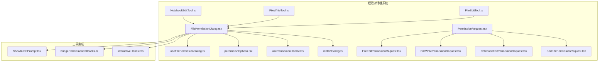
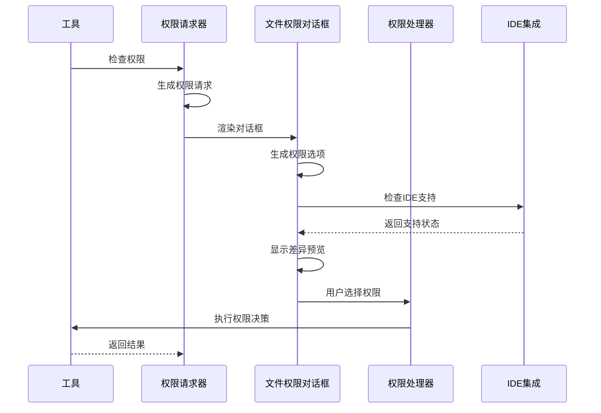
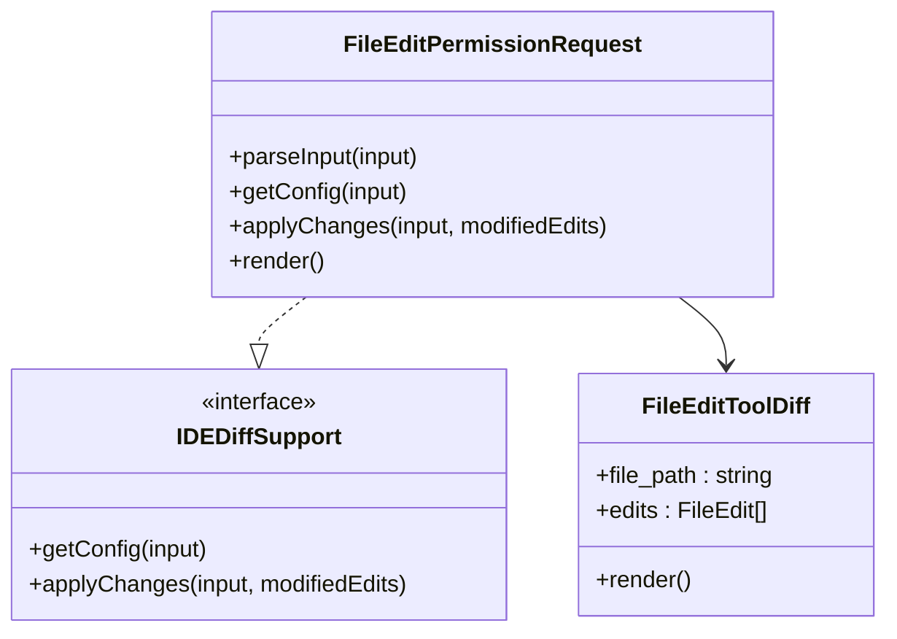
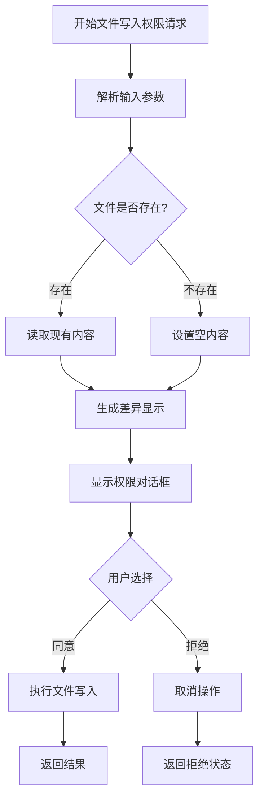
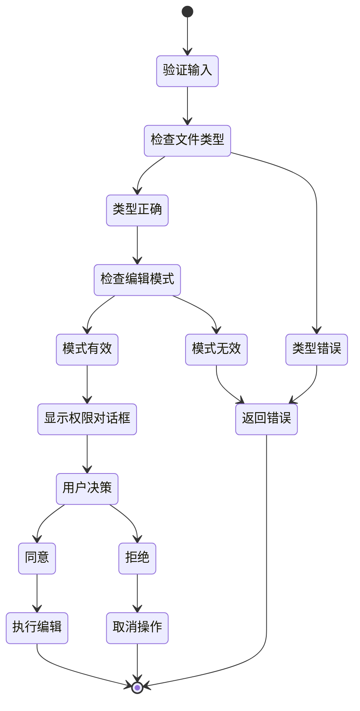
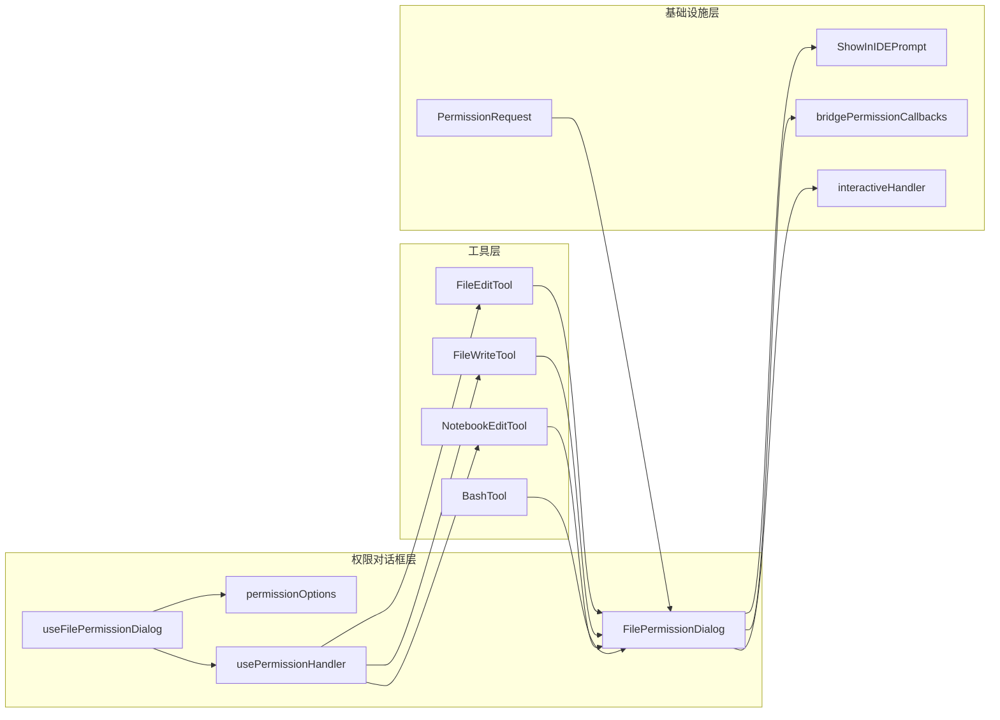

# 文件权限对话框

<cite>
**本文档引用的文件**
- [FilePermissionDialog.tsx](file://src/components/permissions/FilePermissionDialog/FilePermissionDialog.tsx)
- [useFilePermissionDialog.ts](file://src/components/permissions/FilePermissionDialog/useFilePermissionDialog.ts)
- [permissionOptions.tsx](file://src/components/permissions/FilePermissionDialog/permissionOptions.tsx)
- [usePermissionHandler.ts](file://src/components/permissions/FilePermissionDialog/usePermissionHandler.ts)
- [ideDiffConfig.ts](file://src/components/permissions/FilePermissionDialog/ideDiffConfig.ts)
- [PermissionRequest.tsx](file://src/components/permissions/PermissionRequest.tsx)
- [FileEditPermissionRequest.tsx](file://src/components/permissions/FileEditPermissionRequest/FileEditPermissionRequest.tsx)
- [FileWritePermissionRequest.tsx](file://src/components/permissions/FileWritePermissionRequest/FileWritePermissionRequest.tsx)
- [NotebookEditPermissionRequest.tsx](file://src/components/permissions/NotebookEditPermissionRequest/NotebookEditPermissionRequest.tsx)
- [SedEditPermissionRequest.tsx](file://src/components/permissions/SedEditPermissionRequest/SedEditPermissionRequest.tsx)
- [FileEditTool.ts](file://src/tools/FileEditTool/FileEditTool.ts)
- [FileWriteTool.ts](file://src/tools/FileWriteTool/FileWriteTool.ts)
- [NotebookEditTool.ts](file://src/tools/NotebookEditTool/NotebookEditTool.ts)
- [ShowInIDEPrompt.tsx](file://src/components/ShowInIDEPrompt.tsx)
- [bridgePermissionCallbacks.ts](file://src/bridge/bridgePermissionCallbacks.ts)
- [interactiveHandler.ts](file://src/hooks/toolPermission/handlers/interactiveHandler.ts)
</cite>

## 目录
1. [简介](#简介)
2. [项目结构](#项目结构)
3. [核心组件](#核心组件)
4. [架构概览](#架构概览)
5. [详细组件分析](#详细组件分析)
6. [依赖关系分析](#依赖关系分析)
7. [性能考虑](#性能考虑)
8. [故障排除指南](#故障排除指南)
9. [结论](#结论)

## 简介

文件权限对话框系统是 Claude Code 中用于管理文件系统权限的核心组件。该系统提供了统一的权限请求界面，支持多种文件操作类型的权限验证，包括文件编辑、文件写入、笔记本编辑和 sed 编辑等。

该系统采用模块化设计，通过可重用的对话框组件和权限处理器，为不同的工具提供一致的用户体验。系统还集成了 IDE 差异显示功能，允许用户在支持的 IDE 中预览文件更改。

## 项目结构

文件权限对话框系统主要位于 `src/components/permissions/` 目录下，包含以下核心文件：

**图表来源**
- [FilePermissionDialog.tsx:1-204](file://src/components/permissions/FilePermissionDialog/FilePermissionDialog.tsx#L1-L204)
- [PermissionRequest.tsx:1-217](file://src/components/permissions/PermissionRequest.tsx#L1-L217)

**章节来源**
- [FilePermissionDialog.tsx:1-204](file://src/components/permissions/FilePermissionDialog/FilePermissionDialog.tsx#L1-L204)
- [PermissionRequest.tsx:1-217](file://src/components/permissions/PermissionRequest.tsx#L1-L217)

## 核心组件

### FilePermissionDialog 组件

FilePermissionDialog 是权限对话框系统的核心组件，负责渲染统一的权限请求界面。它接收工具使用确认信息、工具上下文和回调函数，并提供标准化的用户交互体验。

该组件的主要功能包括：
- 动态生成权限选项（接受一次、会话级接受、拒绝）
- 处理用户输入模式切换（反馈模式）
- 集成 IDE 差异显示功能
- 管理符号链接检测和警告

### 权限选项系统

权限选项系统根据文件路径、操作类型和工具权限上下文动态生成合适的权限选项。系统支持三种主要的权限类型：

1. **接受一次** (`accept-once`)：单次权限授予
2. **会话级接受** (`accept-session`)：当前会话内的权限授予
3. **拒绝** (`reject`)：拒绝权限请求

### 权限处理器

权限处理器负责处理用户选择的权限决策，包括：
- 记录权限事件日志
- 生成权限更新建议
- 调用工具的 onAllow/onReject 回调
- 处理反馈信息传递

**章节来源**
- [useFilePermissionDialog.ts:1-213](file://src/components/permissions/FilePermissionDialog/useFilePermissionDialog.ts#L1-L213)
- [permissionOptions.tsx:1-177](file://src/components/permissions/FilePermissionDialog/permissionOptions.tsx#L1-L177)
- [usePermissionHandler.ts:1-186](file://src/components/permissions/FilePermissionDialog/usePermissionHandler.ts#L1-L186)

## 架构概览

文件权限对话框系统采用分层架构设计，确保了良好的模块分离和可扩展性：

**图表来源**
- [PermissionRequest.tsx:146-216](file://src/components/permissions/PermissionRequest.tsx#L146-L216)
- [FilePermissionDialog.tsx:48-203](file://src/components/permissions/FilePermissionDialog/FilePermissionDialog.tsx#L48-L203)

系统架构的关键特点：
- **统一接口**：所有工具通过相同的权限检查接口
- **可扩展性**：新的工具类型可以轻松添加到权限请求器中
- **IDE 集成**：支持差异显示和 IDE 内部编辑
- **安全性**：严格的权限验证和错误处理

## 详细组件分析

### 文件编辑权限请求

文件编辑权限请求专门处理文件内容修改操作。它提供了详细的差异显示功能，让用户可以看到具体的更改内容。

**图表来源**
- [FileEditPermissionRequest.tsx:13-27](file://src/components/permissions/FileEditPermissionRequest/FileEditPermissionRequest.tsx#L13-L27)
- [ideDiffConfig.ts:20-23](file://src/components/permissions/FilePermissionDialog/ideDiffConfig.ts#L20-L23)

### 文件写入权限请求

文件写入权限请求处理文件创建和覆盖操作。它能够检测文件是否存在，并提供相应的用户界面提示。

**图表来源**
- [FileWritePermissionRequest.tsx:15-37](file://src/components/permissions/FileWritePermissionRequest/FileWritePermissionRequest.tsx#L15-L37)

### 笔记本编辑权限请求

笔记本编辑权限请求专门处理 Jupyter Notebook (.ipynb) 文件的编辑操作。它具有特殊的验证逻辑，确保只处理正确的文件类型。

**图表来源**
- [NotebookEditPermissionRequest.tsx:12-152](file://src/components/permissions/NotebookEditPermissionRequest/NotebookEditPermissionRequest.tsx#L12-L152)

### sed 编辑权限请求

sed 编辑权限请求处理基于正则表达式的文件编辑操作。它能够预览 sed 命令的效果，确保用户了解可能的更改。

**章节来源**
- [FileEditPermissionRequest.tsx:1-182](file://src/components/permissions/FileEditPermissionRequest/FileEditPermissionRequest.tsx#L1-L182)
- [FileWritePermissionRequest.tsx:1-161](file://src/components/permissions/FileWritePermissionRequest/FileWritePermissionRequest.tsx#L1-L161)
- [NotebookEditPermissionRequest.tsx:1-166](file://src/components/permissions/NotebookEditPermissionRequest/NotebookEditPermissionRequest.tsx#L1-L166)
- [SedEditPermissionRequest.tsx:1-230](file://src/components/permissions/SedEditPermissionRequest/SedEditPermissionRequest.tsx#L1-L230)

## 依赖关系分析

文件权限对话框系统与其他组件的依赖关系如下：

**图表来源**
- [PermissionRequest.tsx:47-82](file://src/components/permissions/PermissionRequest.tsx#L47-L82)
- [FilePermissionDialog.tsx:1-204](file://src/components/permissions/FilePermissionDialog/FilePermissionDialog.tsx#L1-L204)

### IDE 集成

系统支持与多种 IDE 的深度集成，特别是 VS Code。当用户选择在 IDE 中查看差异时，系统会自动检测 IDE 支持情况并提供相应的编辑体验。

### 权限处理机制

权限处理机制采用事件驱动的方式，确保权限决策的及时性和一致性：

1. **权限检查**：工具在执行前检查权限状态
2. **对话框显示**：如果需要权限，显示相应的权限对话框
3. **用户决策**：用户选择接受或拒绝权限
4. **权限应用**：根据用户选择应用权限决策
5. **结果反馈**：向工具返回权限处理结果

**章节来源**
- [bridgePermissionCallbacks.ts:1-43](file://src/bridge/bridgePermissionCallbacks.ts#L1-L43)
- [interactiveHandler.ts:128-431](file://src/hooks/toolPermission/handlers/interactiveHandler.ts#L128-L431)

## 性能考虑

文件权限对话框系统在设计时充分考虑了性能优化：

### 异步处理
- 使用 React.memo 和 useMemo 优化组件渲染
- 异步读取文件内容，避免阻塞 UI 线程
- 延迟加载 IDE 差异显示组件

### 内存管理
- 使用稳定的 Promise 对象避免不必要的重新计算
- 及时清理临时数据和缓存
- 控制权限建议的数量和复杂度

### 错误处理
- 全面的错误边界处理
- 用户友好的错误消息
- 自动降级到基本功能

## 故障排除指南

### 常见问题及解决方案

**问题1：权限对话框不显示**
- 检查工具是否正确实现了权限检查方法
- 验证工具权限上下文配置
- 确认用户权限设置

**问题2：IDE 差异显示不工作**
- 检查 IDE 连接状态
- 验证 IDE 支持的差异显示功能
- 确认文件路径解析正确

**问题3：权限决策未生效**
- 检查权限处理器回调函数
- 验证权限更新建议格式
- 确认工具正确处理权限结果

### 调试技巧

1. **启用详细日志**：查看权限事件和决策日志
2. **检查网络连接**：确保 IDE 连接正常
3. **验证文件权限**：确认文件系统权限设置
4. **测试不同场景**：验证各种权限场景下的行为

**章节来源**
- [ShowInIDEPrompt.tsx:1-49](file://src/components/ShowInIDEPrompt.tsx#L1-L49)

## 结论

文件权限对话框系统通过其模块化设计和强大的功能集，为 Claude Code 提供了灵活而安全的文件系统权限管理能力。系统支持多种文件操作类型，提供了丰富的用户交互体验，并且具有良好的扩展性和维护性。

该系统的关键优势包括：
- 统一的权限管理接口
- 灵活的权限选项配置
- 深度的 IDE 集成
- 完善的安全验证机制
- 良好的性能表现

通过持续的优化和扩展，文件权限对话框系统将继续为用户提供更好的文件操作体验。