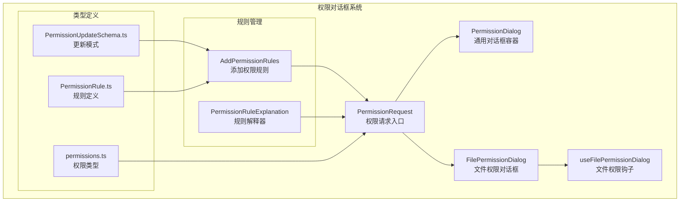
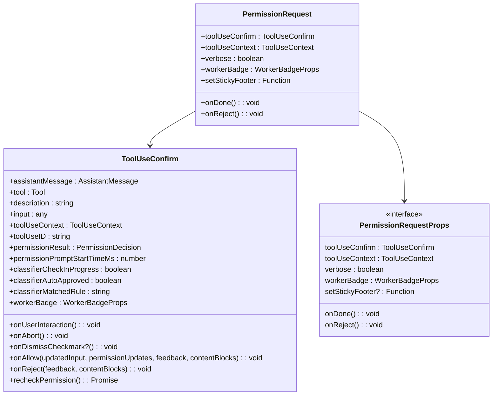
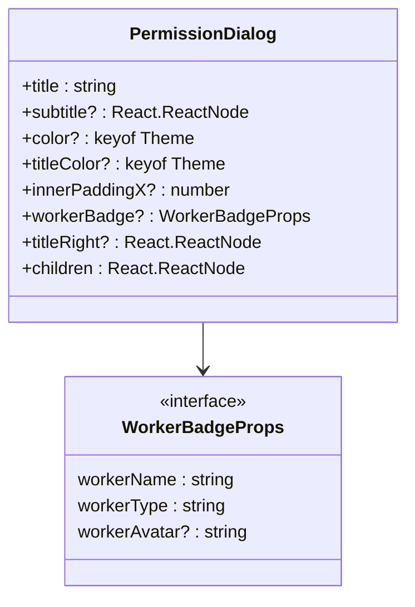
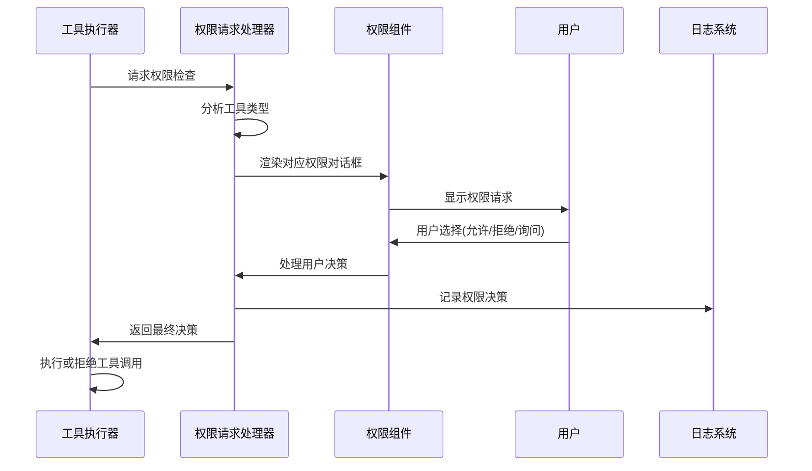
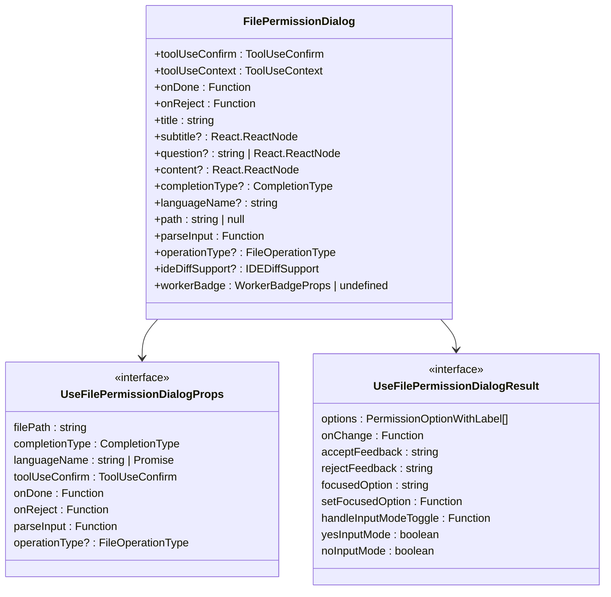
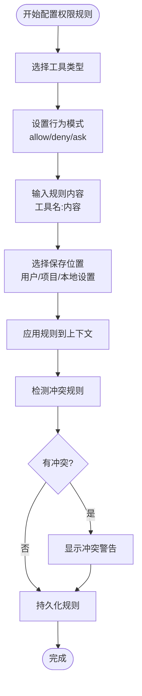
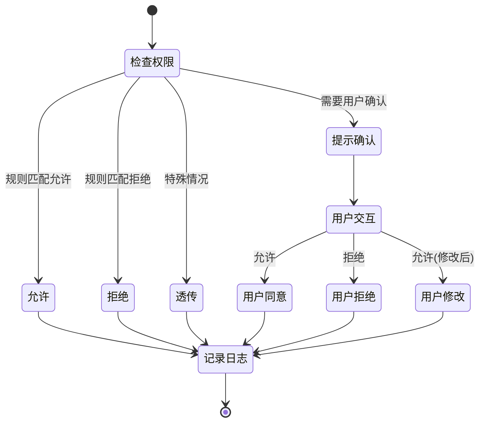
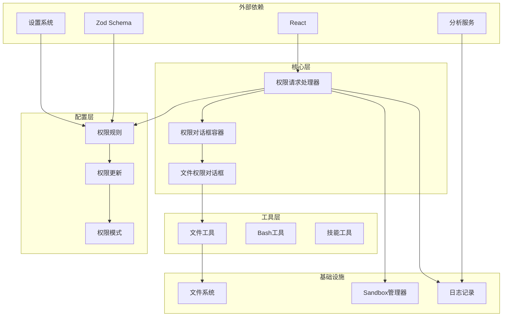

# 权限对话框

<cite>
**本文档引用的文件**
- [src/components/permissions/PermissionDialog.tsx](file://src/components/permissions/PermissionDialog.tsx)
- [src/components/permissions/PermissionRequest.tsx](file://src/components/permissions/PermissionRequest.tsx)
- [src/components/permissions/FilePermissionDialog/FilePermissionDialog.tsx](file://src/components/permissions/FilePermissionDialog/FilePermissionDialog.tsx)
- [src/components/permissions/FilePermissionDialog/useFilePermissionDialog.ts](file://src/components/permissions/FilePermissionDialog/useFilePermissionDialog.ts)
- [src/types/permissions.ts](file://src/types/permissions.ts)
- [src/components/permissions/hooks.ts](file://src/components/permissions/hooks.ts)
- [src/utils/permissions/PermissionUpdateSchema.ts](file://src/utils/permissions/PermissionUpdateSchema.ts)
- [src/components/permissions/rules/AddPermissionRules.tsx](file://src/components/permissions/rules/AddPermissionRules.tsx)
- [src/components/permissions/PermissionRuleExplanation.tsx](file://src/components/permissions/PermissionRuleExplanation.tsx)
- [src/utils/permissions/PermissionRule.ts](file://src/utils/permissions/PermissionRule.ts)
- [src/utils/permissions/PermissionResult.ts](file://src/utils/permissions/PermissionResult.ts)
</cite>

## 目录
1. [简介](#简介)
2. [项目结构](#项目结构)
3. [核心组件](#核心组件)
4. [架构概览](#架构概览)
5. [详细组件分析](#详细组件分析)
6. [依赖关系分析](#依赖关系分析)
7. [性能考虑](#性能考虑)
8. [故障排除指南](#故障排除指南)
9. [结论](#结论)

## 简介

权限对话框系统是 Claude Code 中用于管理和控制工具使用权限的核心组件。该系统提供了完整的权限管理机制，包括权限请求、审批流程、规则配置和审计日志等功能。

系统支持多种类型的权限对话框，包括文件权限、命令权限、工具使用权限等，为用户提供安全可控的开发环境。

## 项目结构

权限对话框系统主要位于 `src/components/permissions/` 目录下，包含以下核心组件：

**图表来源**
- [src/components/permissions/PermissionRequest.tsx:146-217](file://src/components/permissions/PermissionRequest.tsx#L146-L217)
- [src/components/permissions/PermissionDialog.tsx:17-72](file://src/components/permissions/PermissionDialog.tsx#L17-L72)
- [src/components/permissions/FilePermissionDialog/FilePermissionDialog.tsx:48-204](file://src/components/permissions/FilePermissionDialog/FilePermissionDialog.tsx#L48-L204)

**章节来源**
- [src/components/permissions/PermissionRequest.tsx:1-217](file://src/components/permissions/PermissionRequest.tsx#L1-L217)
- [src/components/permissions/PermissionDialog.tsx:1-72](file://src/components/permissions/PermissionDialog.tsx#L1-L72)

## 核心组件

### 权限请求处理器

权限请求处理器是整个系统的核心，负责根据不同的工具类型选择相应的权限对话框组件。

**图表来源**
- [src/components/permissions/PermissionRequest.tsx:83-127](file://src/components/permissions/PermissionRequest.tsx#L83-L127)

### 权限对话框容器

通用权限对话框容器提供了统一的界面样式和布局结构。

**图表来源**
- [src/components/permissions/PermissionDialog.tsx:7-16](file://src/components/permissions/PermissionDialog.tsx#L7-L16)

**章节来源**
- [src/components/permissions/PermissionRequest.tsx:146-217](file://src/components/permissions/PermissionRequest.tsx#L146-L217)
- [src/components/permissions/PermissionDialog.tsx:17-72](file://src/components/permissions/PermissionDialog.tsx#L17-L72)

## 架构概览

权限对话框系统采用模块化设计，通过工具类型映射到相应的权限对话框组件。

**图表来源**
- [src/components/permissions/PermissionRequest.tsx:47-82](file://src/components/permissions/PermissionRequest.tsx#L47-L82)
- [src/components/permissions/hooks.ts:101-209](file://src/components/permissions/hooks.ts#L101-L209)

## 详细组件分析

### 文件权限对话框

文件权限对话框是专门处理文件操作权限的组件，支持多种文件操作类型。

**图表来源**
- [src/components/permissions/FilePermissionDialog/FilePermissionDialog.tsx:20-47](file://src/components/permissions/FilePermissionDialog/FilePermissionDialog.tsx#L20-L47)
- [src/components/permissions/FilePermissionDialog/useFilePermissionDialog.ts:27-48](file://src/components/permissions/FilePermissionDialog/useFilePermissionDialog.ts#L27-L48)

### 权限规则管理系统

权限规则系统提供了灵活的规则配置和管理功能。

**图表来源**
- [src/components/permissions/rules/AddPermissionRules.tsx:48-180](file://src/components/permissions/rules/AddPermissionRules.tsx#L48-L180)
- [src/utils/permissions/PermissionUpdate.ts:85-120](file://src/utils/permissions/PermissionUpdate.ts#L85-L120)

**章节来源**
- [src/components/permissions/FilePermissionDialog/FilePermissionDialog.tsx:48-204](file://src/components/permissions/FilePermissionDialog/FilePermissionDialog.tsx#L48-L204)
- [src/components/permissions/FilePermissionDialog/useFilePermissionDialog.ts:53-213](file://src/components/permissions/FilePermissionDialog/useFilePermissionDialog.ts#L53-L213)
- [src/components/permissions/rules/AddPermissionRules.tsx:48-180](file://src/components/permissions/rules/AddPermissionRules.tsx#L48-L180)

### 权限决策处理

系统支持多种权限决策类型，每种都有特定的处理逻辑。

**图表来源**
- [src/types/permissions.ts:174-267](file://src/types/permissions.ts#L174-L267)
- [src/components/permissions/hooks.ts:31-59](file://src/components/permissions/hooks.ts#L31-L59)

**章节来源**
- [src/types/permissions.ts:174-267](file://src/types/permissions.ts#L174-L267)
- [src/components/permissions/hooks.ts:101-209](file://src/components/permissions/hooks.ts#L101-L209)

## 依赖关系分析

权限对话框系统具有清晰的依赖层次结构：

**图表来源**
- [src/components/permissions/PermissionRequest.tsx:1-46](file://src/components/permissions/PermissionRequest.tsx#L1-L46)
- [src/utils/permissions/PermissionUpdateSchema.ts:8-22](file://src/utils/permissions/PermissionUpdateSchema.ts#L8-L22)

**章节来源**
- [src/components/permissions/PermissionRequest.tsx:1-46](file://src/components/permissions/PermissionRequest.tsx#L1-L46)
- [src/utils/permissions/PermissionUpdateSchema.ts:8-22](file://src/utils/permissions/PermissionUpdateSchema.ts#L8-L22)

## 性能考虑

权限对话框系统在设计时充分考虑了性能优化：

### 内存管理
- 使用 `useMemo` 缓存计算结果，避免重复渲染
- 通过 `useRef` 跟踪已记录的工具使用 ID，防止重复日志
- 合理的组件卸载清理机制

### 渲染优化
- 条件渲染减少不必要的 DOM 更新
- 键盘快捷键处理避免全量重渲染
- IDE Diff 功能按需加载

### 异步处理
- 权限检查异步执行，不阻塞主线程
- 分类器检查可并行处理多个请求
- 缓存机制提升重复请求性能

## 故障排除指南

### 常见问题及解决方案

**权限对话框不显示**
1. 检查工具是否正确注册到权限系统
2. 验证权限模式配置是否正确
3. 确认用户设置中没有禁用权限提示

**权限规则不生效**
1. 检查规则格式是否正确
2. 验证规则优先级和冲突
3. 确认规则保存位置正确

**性能问题**
1. 检查是否有过多的权限请求同时触发
2. 验证缓存机制是否正常工作
3. 监控内存使用情况

**章节来源**
- [src/components/permissions/hooks.ts:116-120](file://src/components/permissions/hooks.ts#L116-L120)
- [src/utils/permissions/PermissionUpdate.ts:85-120](file://src/utils/permissions/PermissionUpdate.ts#L85-L120)

## 结论

权限对话框系统提供了完整、灵活且安全的权限管理解决方案。通过模块化的架构设计、完善的规则管理系统和强大的审计功能，确保了用户在使用各种工具时的安全性和可控性。

系统的主要优势包括：
- **模块化设计**：清晰的组件分离和职责划分
- **灵活配置**：支持多种权限模式和规则配置
- **安全保障**：多层次的安全检查和审计日志
- **用户体验**：直观的界面和流畅的交互流程
- **性能优化**：高效的渲染和内存管理机制

该系统为 Claude Code 提供了坚实的基础，确保用户能够在安全可控的环境中高效地使用各种开发工具。