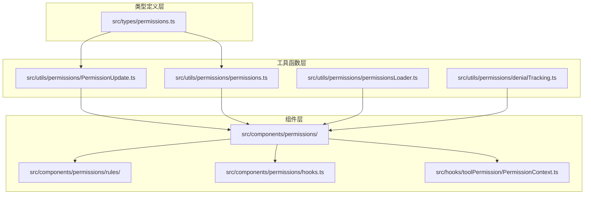
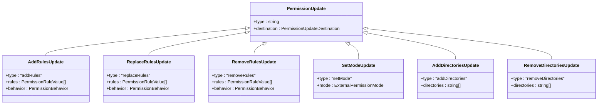
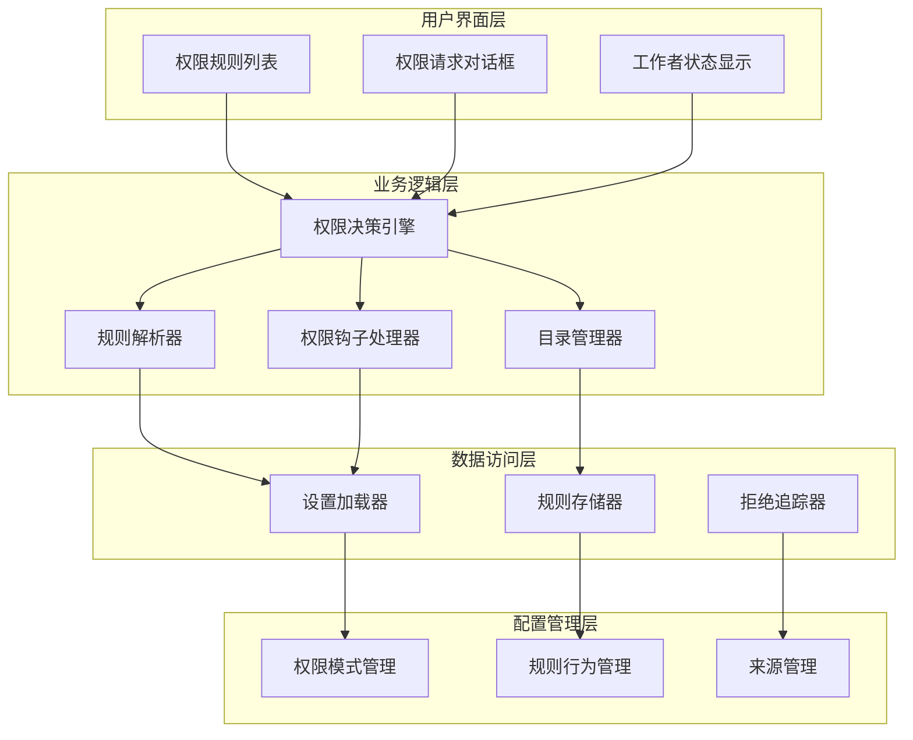
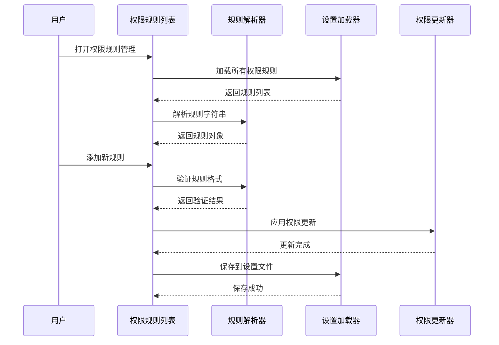
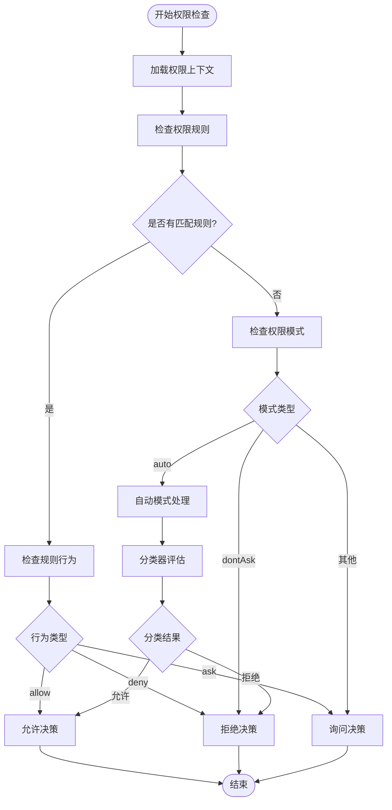
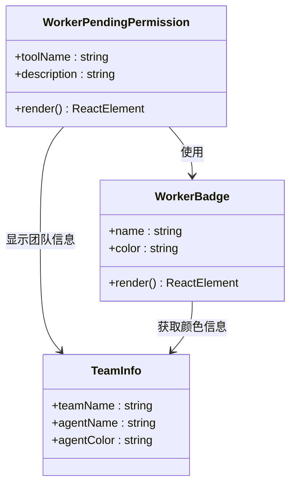
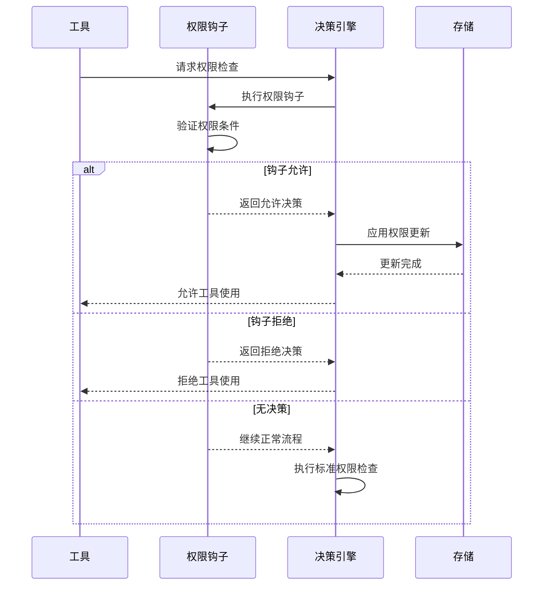
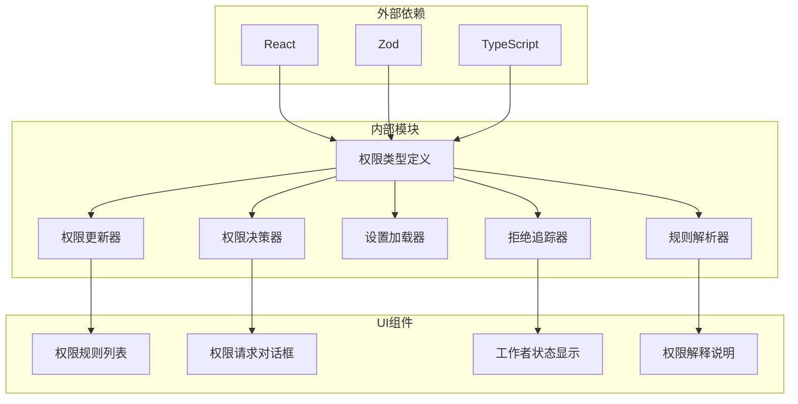

# 权限规则管理

<cite>
**本文档引用的文件**
- [src/types/permissions.ts](file://src/types/permissions.ts)
- [src/utils/permissions/PermissionUpdate.ts](file://src/utils/permissions/PermissionUpdate.ts)
- [src/utils/permissions/permissions.ts](file://src/utils/permissions/permissions.ts)
- [src/utils/permissions/permissionsLoader.ts](file://src/utils/permissions/permissionsLoader.ts)
- [src/utils/permissions/denialTracking.ts](file://src/utils/permissions/denialTracking.ts)
- [src/components/permissions/rules/PermissionRuleList.tsx](file://src/components/permissions/rules/PermissionRuleList.tsx)
- [src/components/permissions/WorkerPendingPermission.tsx](file://src/components/permissions/WorkerPendingPermission.tsx)
- [src/components/permissions/WorkerBadge.tsx](file://src/components/permissions/WorkerBadge.tsx)
- [src/components/permissions/PermissionRuleExplanation.tsx](file://src/components/permissions/PermissionRuleExplanation.tsx)
- [src/components/permissions/PermissionRequest.tsx](file://src/components/permissions/PermissionRequest.tsx)
- [src/components/permissions/PermissionDialog.tsx](file://src/components/permissions/PermissionDialog.tsx)
- [src/components/permissions/PermissionRequestTitle.tsx](file://src/components/permissions/PermissionRequestTitle.tsx)
- [src/components/permissions/hooks.ts](file://src/components/permissions/hooks.ts)
- [src/hooks/toolPermission/PermissionContext.ts](file://src/hooks/toolPermission/PermissionContext.ts)
</cite>

## 目录
1. [简介](#简介)
2. [项目结构](#项目结构)
3. [核心组件](#核心组件)
4. [架构概览](#架构概览)
5. [详细组件分析](#详细组件分析)
6. [依赖关系分析](#依赖关系分析)
7. [性能考虑](#性能考虑)
8. [故障排除指南](#故障排除指南)
9. [结论](#结论)
10. [附录](#附录)

## 简介

权限规则管理系统是 Claude Code 源码中一个关键的安全组件，负责管理工具使用权限、工作空间目录权限和权限决策流程。该系统提供了完整的权限规则配置、工作空间目录管理、权限解释说明、最近拒绝记录等功能。

系统的核心功能包括：
- 权限规则的添加、删除、替换和查询
- 工作空间目录的动态管理
- 权限决策的自动化和人工确认流程
- 权限规则的持久化存储
- 权限状态的可视化展示

## 项目结构

权限规则管理系统主要分布在以下目录结构中：

**图表来源**
- [src/types/permissions.ts:1-442](file://src/types/permissions.ts#L1-L442)
- [src/utils/permissions/PermissionUpdate.ts:1-390](file://src/utils/permissions/PermissionUpdate.ts#L1-L390)
- [src/utils/permissions/permissions.ts:1-800](file://src/utils/permissions/permissions.ts#L1-L800)

**章节来源**
- [src/types/permissions.ts:1-442](file://src/types/permissions.ts#L1-L442)
- [src/utils/permissions/PermissionUpdate.ts:1-390](file://src/utils/permissions/PermissionUpdate.ts#L1-L390)
- [src/utils/permissions/permissions.ts:1-800](file://src/utils/permissions/permissions.ts#L1-L800)

## 核心组件

### 权限模式和行为

系统支持多种权限模式和行为类型：

**权限模式类型：**
- `acceptEdits`: 接受编辑模式
- `bypassPermissions`: 绕过权限模式  
- `default`: 默认模式
- `dontAsk`: 不询问模式
- `plan`: 计划模式
- `auto`: 自动模式（特性开关）
- `bubble`: 冒泡模式

**权限行为类型：**
- `allow`: 允许
- `deny`: 拒绝  
- `ask`: 询问

**章节来源**
- [src/types/permissions.ts:16-38](file://src/types/permissions.ts#L16-L38)
- [src/types/permissions.ts:44](file://src/types/permissions.ts#L44)

### 权限更新操作

系统定义了多种权限更新操作类型：

**图表来源**
- [src/types/permissions.ts:98-131](file://src/types/permissions.ts#L98-L131)

**章节来源**
- [src/types/permissions.ts:85-131](file://src/types/permissions.ts#L85-L131)

## 架构概览

权限规则管理系统采用分层架构设计，确保了模块间的清晰分离和高内聚低耦合：

**图表来源**
- [src/utils/permissions/permissions.ts:473-800](file://src/utils/permissions/permissions.ts#L473-L800)
- [src/utils/permissions/PermissionUpdate.ts:55-206](file://src/utils/permissions/PermissionUpdate.ts#L55-L206)

## 详细组件分析

### 权限规则列表组件

权限规则列表组件提供了完整的权限规则管理界面：

**图表来源**
- [src/components/permissions/rules/PermissionRuleList.tsx:473-800](file://src/components/permissions/rules/PermissionRuleList.tsx#L473-L800)
- [src/utils/permissions/permissionsLoader.ts:120-145](file://src/utils/permissions/permissionsLoader.ts#L120-L145)

**章节来源**
- [src/components/permissions/rules/PermissionRuleList.tsx:1-800](file://src/components/permissions/rules/PermissionRuleList.tsx#L1-L800)

### 权限决策引擎

权限决策引擎是系统的核心组件，负责处理权限请求和做出决策：

**图表来源**
- [src/utils/permissions/permissions.ts:473-800](file://src/utils/permissions/permissions.ts#L473-L800)

**章节来源**
- [src/utils/permissions/permissions.ts:473-800](file://src/utils/permissions/permissions.ts#L473-L800)

### 工作者状态管理系统

工作者状态管理系统用于显示等待权限批准的工作进程状态：

**图表来源**
- [src/components/permissions/WorkerPendingPermission.tsx:16-105](file://src/components/permissions/WorkerPendingPermission.tsx#L16-L105)
- [src/components/permissions/WorkerBadge.tsx:15-48](file://src/components/permissions/WorkerBadge.tsx#L15-L48)

**章节来源**
- [src/components/permissions/WorkerPendingPermission.tsx:1-105](file://src/components/permissions/WorkerPendingPermission.tsx#L1-L105)
- [src/components/permissions/WorkerBadge.tsx:1-48](file://src/components/permissions/WorkerBadge.tsx#L1-L48)

### 权限钩子系统

权限钩子系统提供了扩展权限检查逻辑的能力：

**图表来源**
- [src/hooks/toolPermission/PermissionContext.ts:216-263](file://src/hooks/toolPermission/PermissionContext.ts#L216-L263)

**章节来源**
- [src/hooks/toolPermission/PermissionContext.ts:1-389](file://src/hooks/toolPermission/PermissionContext.ts#L1-L389)

## 依赖关系分析

权限规则管理系统具有清晰的依赖关系结构：

**图表来源**
- [src/types/permissions.ts:1-442](file://src/types/permissions.ts#L1-L442)
- [src/utils/permissions/PermissionUpdate.ts:1-390](file://src/utils/permissions/PermissionUpdate.ts#L1-L390)

**章节来源**
- [src/types/permissions.ts:1-442](file://src/types/permissions.ts#L1-L442)
- [src/utils/permissions/PermissionUpdate.ts:1-390](file://src/utils/permissions/PermissionUpdate.ts#L1-L390)

## 性能考虑

权限规则管理系统在设计时充分考虑了性能优化：

### 缓存策略
- 权限规则按来源进行缓存，避免重复解析
- 工具名称映射使用缓存机制减少计算开销
- 设置文件读取采用懒加载策略

### 异步处理
- 分类器评估采用异步处理避免阻塞主线程
- 权限钩子执行支持并发处理
- 拒绝追踪使用本地状态减少全局状态更新

### 内存管理
- 使用 WeakMap 和 WeakSet 避免内存泄漏
- React 组件使用 memo 包装减少不必要的重渲染
- 大量数据使用分页和虚拟化技术

## 故障排除指南

### 常见问题及解决方案

**权限规则不生效**
1. 检查规则来源是否正确
2. 验证规则格式是否符合规范
3. 确认权限模式设置是否正确
4. 查看日志中的权限决策原因

**权限请求循环**
1. 检查是否存在相互冲突的规则
2. 验证权限钩子是否正确处理
3. 确认分类器配置是否合理
4. 检查拒绝追踪状态

**性能问题**
1. 检查是否有过多的权限规则
2. 验证设置文件大小是否合理
3. 确认缓存机制是否正常工作
4. 监控内存使用情况

**章节来源**
- [src/utils/permissions/permissions.ts:95-101](file://src/utils/permissions/permissions.ts#L95-L101)
- [src/utils/permissions/denialTracking.ts:17-45](file://src/utils/permissions/denialTracking.ts#L17-L45)

## 结论

权限规则管理系统通过其模块化的架构设计和完善的权限控制机制，为 Claude Code 提供了强大而灵活的权限管理能力。系统不仅支持基本的权限规则配置，还提供了高级的自动化权限决策、工作者状态管理和扩展接口。

该系统的主要优势包括：
- 清晰的分层架构便于维护和扩展
- 完善的权限决策流程确保安全性
- 灵活的钩子系统支持自定义权限逻辑
- 友好的用户界面提供良好的用户体验
- 良好的性能优化确保系统响应性

## 附录

### 最佳实践指南

**权限规则配置最佳实践：**
1. 从最小权限原则出发配置规则
2. 使用明确的规则描述便于理解和维护
3. 定期审查和清理不再使用的规则
4. 利用规则来源区分不同级别的权限控制

**安全配置建议：**
1. 启用适当的权限模式保护敏感操作
2. 配置合理的分类器阈值平衡安全性和便利性
3. 定期监控权限拒绝统计信息
4. 建立权限变更的审计机制

**扩展开发指导：**
1. 遵循现有的权限钩子接口规范
2. 使用统一的错误处理和日志记录机制
3. 考虑性能影响，避免阻塞操作
4. 提供充分的测试覆盖确保稳定性