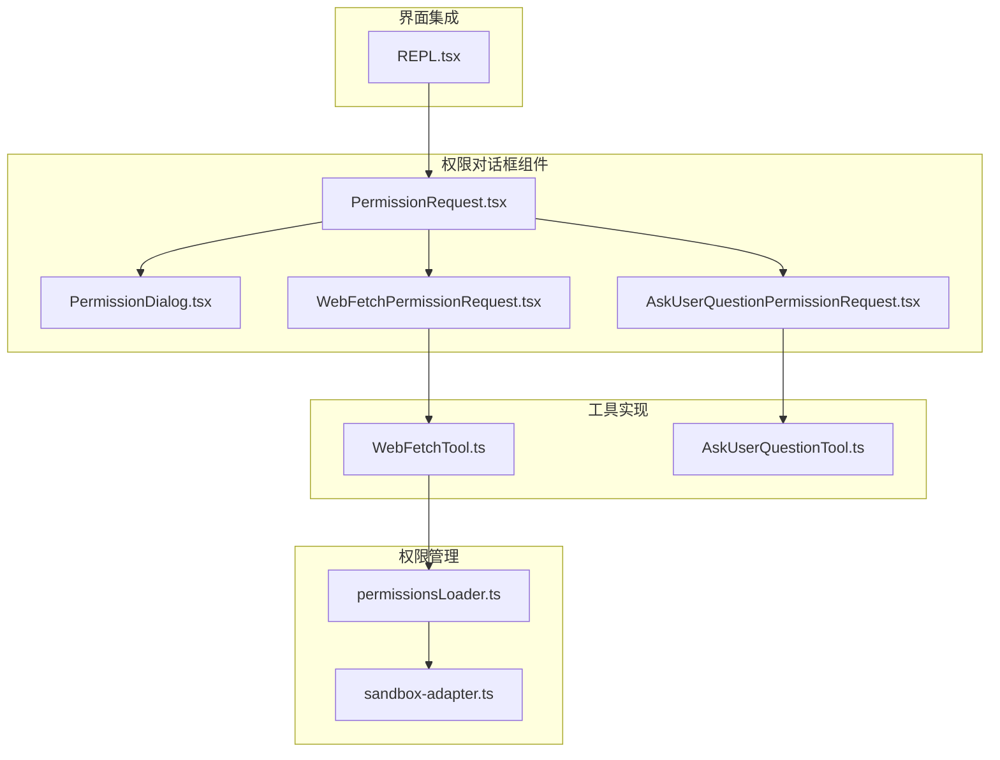
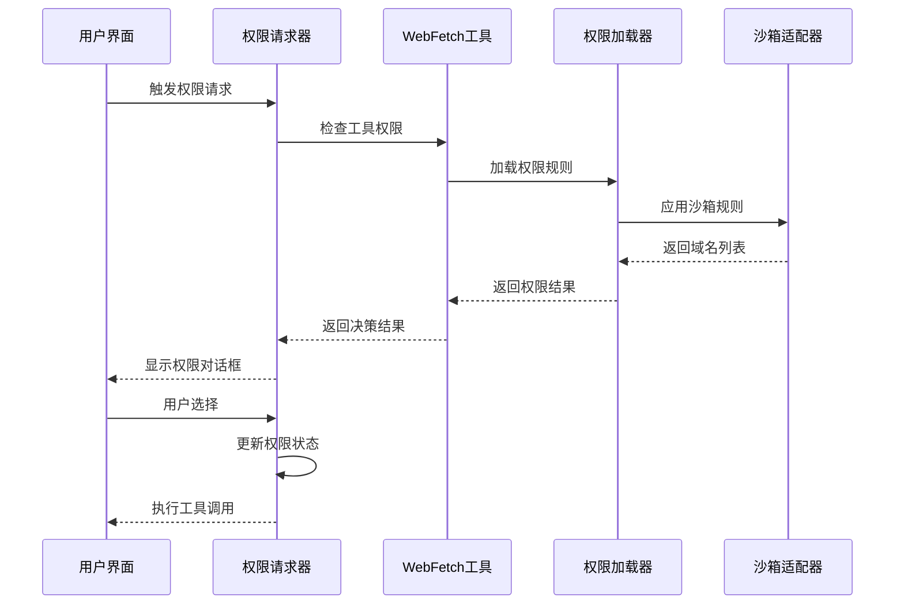
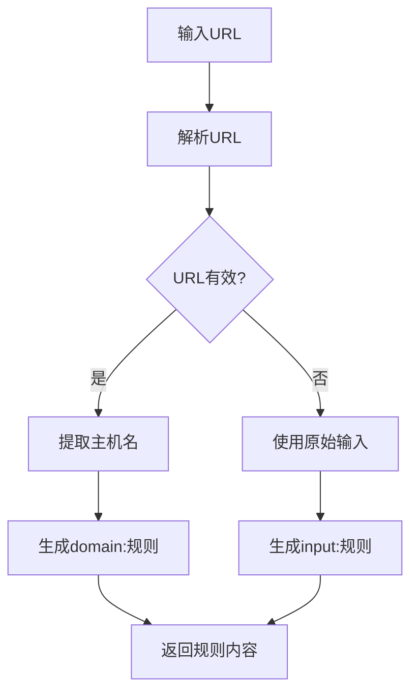
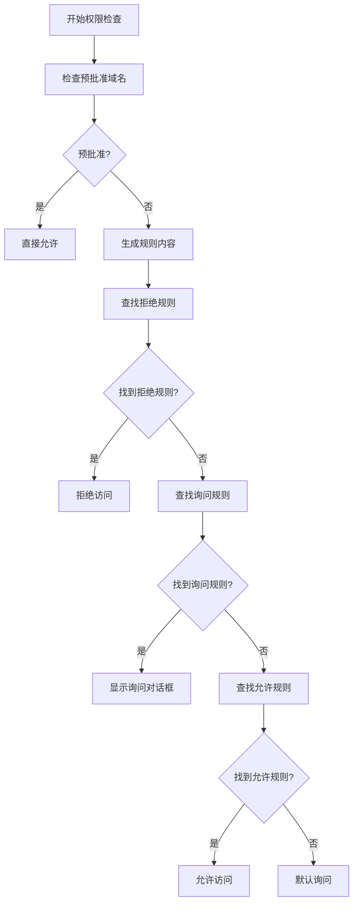
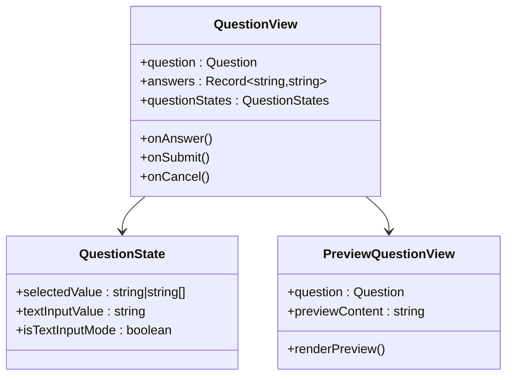
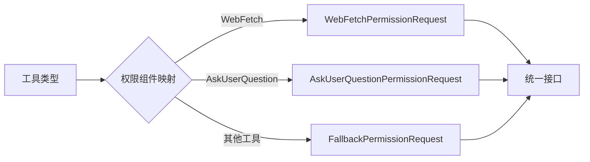
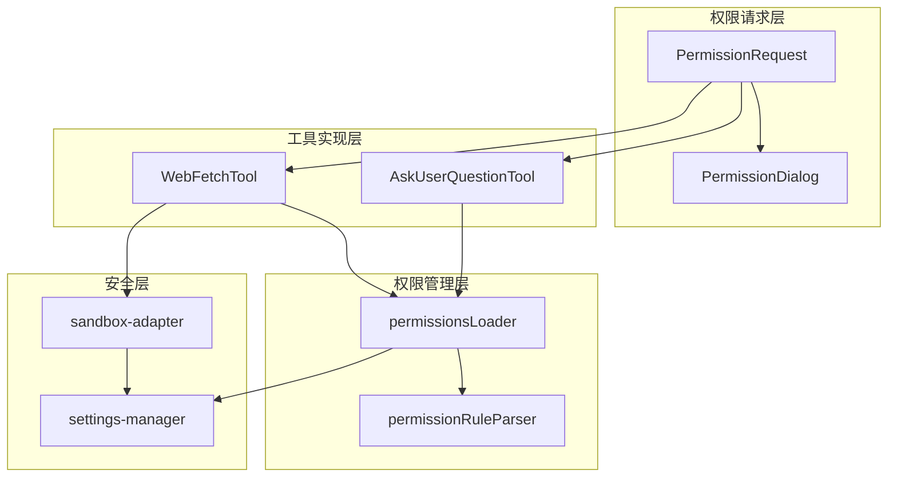

# 网页内容权限对话框

<cite>
**本文档引用的文件**
- [WebFetchTool.ts](file://src/tools/WebFetchTool/WebFetchTool.ts)
- [WebFetchPermissionRequest.tsx](file://src/components/permissions/WebFetchPermissionRequest/WebFetchPermissionRequest.tsx)
- [AskUserQuestionPermissionRequest.tsx](file://src/components/permissions/AskUserQuestionPermissionRequest/AskUserQuestionPermissionRequest.tsx)
- [PermissionRequest.tsx](file://src/components/permissions/PermissionRequest.tsx)
- [PermissionDialog.tsx](file://src/components/permissions/PermissionDialog.tsx)
- [permissionsLoader.ts](file://src/utils/permissions/permissionsLoader.ts)
- [sandbox-adapter.ts](file://src/utils/sandbox/sandbox-adapter.ts)
- [REPL.tsx](file://src/screens/REPL.tsx)
</cite>

## 目录
1. [简介](#简介)
2. [项目结构](#项目结构)
3. [核心组件](#核心组件)
4. [架构概览](#架构概览)
5. [详细组件分析](#详细组件分析)
6. [依赖关系分析](#依赖关系分析)
7. [性能考虑](#性能考虑)
8. [故障排除指南](#故障排除指南)
9. [结论](#结论)

## 简介

本文档详细介绍了Claude Code源码中的网页内容权限对话框系统。该系统实现了对WebFetch工具的权限控制机制，包括网页抓取的安全验证、预批准域名列表和内容过滤规则。同时涵盖了AskUserQuestion权限请求的多选题处理、问题预览和提交流程。

系统采用模块化设计，通过权限对话框组件与工具执行逻辑分离，实现了灵活的权限管理机制。用户可以通过直观的对话界面进行权限决策，系统则根据预设规则和用户选择执行相应的安全策略。

## 项目结构

网页内容权限对话框系统主要分布在以下目录结构中：

**图表来源**
- [PermissionRequest.tsx:47-82](file://src/components/permissions/PermissionRequest.tsx#L47-L82)
- [WebFetchTool.ts:66-180](file://src/tools/WebFetchTool/WebFetchTool.ts#L66-L180)
- [permissionsLoader.ts:120-133](file://src/utils/permissions/permissionsLoader.ts#L120-L133)

**章节来源**
- [PermissionRequest.tsx:1-217](file://src/components/permissions/PermissionRequest.tsx#L1-L217)
- [WebFetchTool.ts:1-319](file://src/tools/WebFetchTool/WebFetchTool.ts#L1-L319)

## 核心组件

### WebFetch权限请求组件

WebFetch权限请求组件负责处理网页内容抓取的权限验证和用户交互：

- **输入解析**: 将URL转换为域名规则内容
- **权限检查**: 验证是否在预批准列表中
- **用户交互**: 提供允许/拒绝选项
- **规则应用**: 支持"始终允许"等高级选项

### AskUserQuestion权限请求组件

多选题权限请求组件提供了复杂的问题处理能力：

- **多选题支持**: 处理单选和多选问题
- **问题预览**: 实时显示问题内容和预览
- **答案收集**: 收集用户回答并验证
- **提交流程**: 完整的答案提交和确认流程

### 权限对话框基础组件

权限对话框提供了统一的UI框架：

- **标题管理**: 动态生成权限请求标题
- **内容布局**: 标准化的对话框布局
- **样式系统**: 基于主题的颜色系统
- **工人徽章**: 显示执行上下文信息

**章节来源**
- [WebFetchPermissionRequest.tsx:1-258](file://src/components/permissions/WebFetchPermissionRequest/WebFetchPermissionRequest.tsx#L1-L258)
- [AskUserQuestionPermissionRequest.tsx:1-645](file://src/components/permissions/AskUserQuestionPermissionRequest/AskUserQuestionPermissionRequest.tsx#L1-L645)
- [PermissionDialog.tsx:1-72](file://src/components/permissions/PermissionDialog.tsx#L1-L72)

## 架构概览

系统采用分层架构设计，实现了权限控制的完整生命周期：

**图表来源**
- [WebFetchTool.ts:104-180](file://src/tools/WebFetchTool/WebFetchTool.ts#L104-L180)
- [permissionsLoader.ts:120-133](file://src/utils/permissions/permissionsLoader.ts#L120-L133)
- [sandbox-adapter.ts:177-210](file://src/utils/sandbox/sandbox-adapter.ts#L177-L210)

系统的核心流程包括：

1. **权限检查阶段**: 工具执行权限验证
2. **规则加载阶段**: 从多个数据源加载权限规则
3. **用户交互阶段**: 显示权限对话框并收集用户决策
4. **执行阶段**: 根据用户选择执行相应操作

## 详细组件分析

### WebFetch权限请求实现

WebFetch权限请求组件实现了完整的网页抓取权限控制：

#### 权限规则生成

组件将URL输入转换为域名规则内容，确保权限匹配的准确性：

**图表来源**
- [WebFetchTool.ts:50-64](file://src/tools/WebFetchTool/WebFetchTool.ts#L50-L64)

#### 预批准域名检查

系统支持预批准域名列表，提高用户体验：

- **预批准检测**: 检查主机名是否在预批准列表中
- **路径匹配**: 支持基于路径的精确匹配
- **自动放行**: 预批准域名可直接放行

#### 权限决策流程

**图表来源**
- [WebFetchTool.ts:104-180](file://src/tools/WebFetchTool/WebFetchTool.ts#L104-L180)

**章节来源**
- [WebFetchTool.ts:104-180](file://src/tools/WebFetchTool/WebFetchTool.ts#L104-L180)
- [WebFetchPermissionRequest.tsx:12-28](file://src/components/permissions/WebFetchPermissionRequest/WebFetchPermissionRequest.tsx#L12-L28)

### AskUserQuestion权限请求实现

多选题权限请求组件提供了丰富的交互体验：

#### 多选题处理机制

组件支持复杂的多选题场景：

- **单选模式**: 标准的单选问题处理
- **多选模式**: 支持多选题的处理
- **混合模式**: 单选和多选的组合处理

#### 问题预览功能

**图表来源**
- [AskUserQuestionPermissionRequest.tsx:1-645](file://src/components/permissions/AskUserQuestionPermissionRequest/AskUserQuestionPermissionRequest.tsx#L1-L645)

#### 图像处理和附件管理

系统支持图像附件的处理：

- **图像粘贴**: 支持图像粘贴功能
- **尺寸调整**: 自动调整图像尺寸
- **缓存管理**: 图像缓存和存储管理

**章节来源**
- [AskUserQuestionPermissionRequest.tsx:1-645](file://src/components/permissions/AskUserQuestionPermissionRequest/AskUserQuestionPermissionRequest.tsx#L1-L645)

### 权限对话框系统

权限对话框系统提供了统一的用户交互界面：

#### 组件映射机制

**图表来源**
- [PermissionRequest.tsx:47-82](file://src/components/permissions/PermissionRequest.tsx#L47-L82)

#### 对话框布局系统

权限对话框采用标准化的布局设计：

- **标题区域**: 显示权限请求标题和描述
- **内容区域**: 显示具体的权限内容
- **操作区域**: 提供用户选择选项
- **状态指示**: 显示当前权限状态

**章节来源**
- [PermissionRequest.tsx:146-217](file://src/components/permissions/PermissionRequest.tsx#L146-L217)
- [PermissionDialog.tsx:1-72](file://src/components/permissions/PermissionDialog.tsx#L1-L72)

## 依赖关系分析

系统各组件之间的依赖关系如下：

**图表来源**
- [PermissionRequest.tsx:1-217](file://src/components/permissions/PermissionRequest.tsx#L1-L217)
- [permissionsLoader.ts:1-297](file://src/utils/permissions/permissionsLoader.ts#L1-L297)

### 关键依赖关系

1. **权限加载依赖**: 所有工具都依赖权限加载器获取规则
2. **沙箱适配依赖**: WebFetch工具依赖沙箱适配器进行安全检查
3. **设置管理依赖**: 权限系统依赖设置管理系统进行持久化
4. **工具注册依赖**: 权限请求器依赖工具注册表进行组件映射

**章节来源**
- [sandbox-adapter.ts:177-210](file://src/utils/sandbox/sandbox-adapter.ts#L177-L210)
- [permissionsLoader.ts:1-297](file://src/utils/permissions/permissionsLoader.ts#L1-L297)

## 性能考虑

系统在设计时充分考虑了性能优化：

### 缓存策略

- **规则缓存**: 权限规则在内存中缓存，避免重复加载
- **组件缓存**: React组件使用memo优化，减少重新渲染
- **图像缓存**: 图像资源缓存到本地，提高响应速度

### 异步处理

- **异步权限检查**: 权限验证采用异步方式，不阻塞主线程
- **延迟加载**: 复杂组件按需加载，减少初始加载时间
- **并发处理**: 支持多个权限请求的并发处理

### 内存管理

- **垃圾回收**: 及时清理不再使用的权限状态
- **资源释放**: 正确释放图像和其他资源
- **状态管理**: 使用高效的状态管理模式

## 故障排除指南

### 常见问题及解决方案

#### 权限请求不显示

**问题症状**: 用户无法看到权限请求对话框

**可能原因**:
1. 工具未正确注册到权限系统
2. 权限规则配置错误
3. 界面渲染异常

**解决步骤**:
1. 检查工具是否在权限组件映射中注册
2. 验证权限规则格式是否正确
3. 查看控制台是否有错误信息

#### 权限检查失败

**问题症状**: 权限检查总是返回相同结果

**可能原因**:
1. 缓存的权限规则过期
2. 设置文件读取失败
3. 规则解析错误

**解决步骤**:
1. 清除权限规则缓存
2. 检查设置文件权限
3. 验证规则格式的正确性

#### WebFetch抓取失败

**问题症状**: WebFetch工具无法抓取网页内容

**可能原因**:
1. 目标网站需要认证
2. 网络连接问题
3. URL格式错误

**解决步骤**:
1. 检查目标URL是否需要认证
2. 验证网络连接状态
3. 确认URL格式的有效性

**章节来源**
- [WebFetchTool.ts:181-204](file://src/tools/WebFetchTool/WebFetchTool.ts#L181-L204)
- [REPL.tsx:4624-4710](file://src/screens/REPL.tsx#L4624-L4710)

## 结论

网页内容权限对话框系统展现了现代权限管理的最佳实践。通过模块化设计、清晰的职责分离和完善的错误处理机制，系统实现了安全性和用户体验的平衡。

系统的主要优势包括：

1. **安全性**: 通过多层权限检查和沙箱隔离确保系统安全
2. **灵活性**: 支持多种权限规则和用户交互模式
3. **可扩展性**: 模块化架构便于添加新的工具和权限类型
4. **用户体验**: 直观的对话框界面和流畅的交互体验

未来可以考虑的改进方向包括：增强权限规则的可视化编辑、添加权限审计日志、支持更复杂的权限组合规则等。