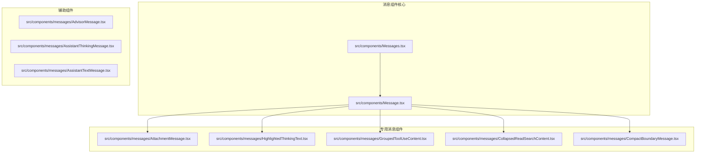
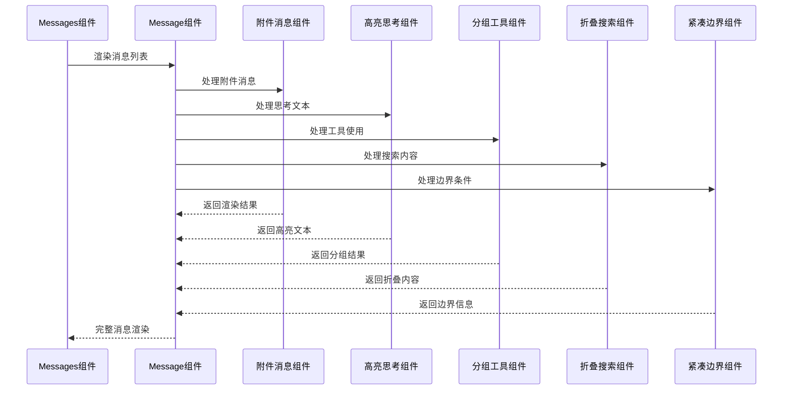
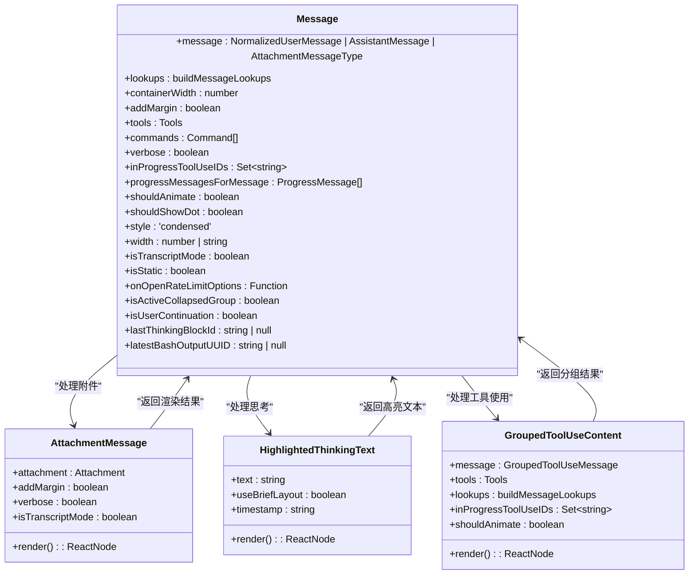
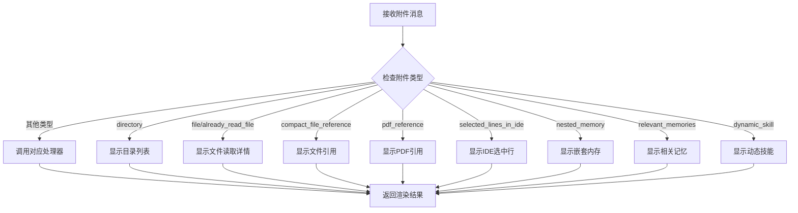
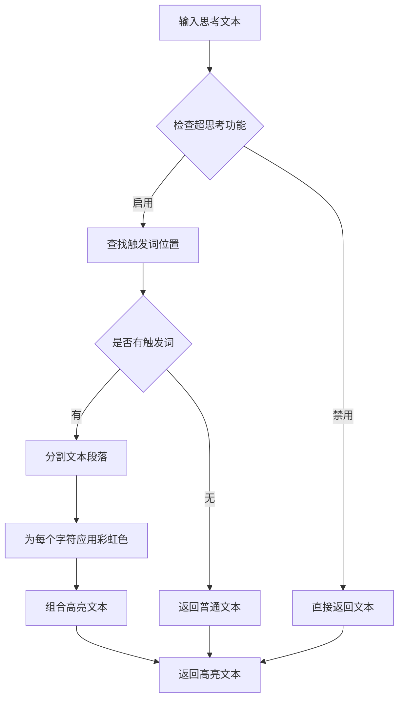
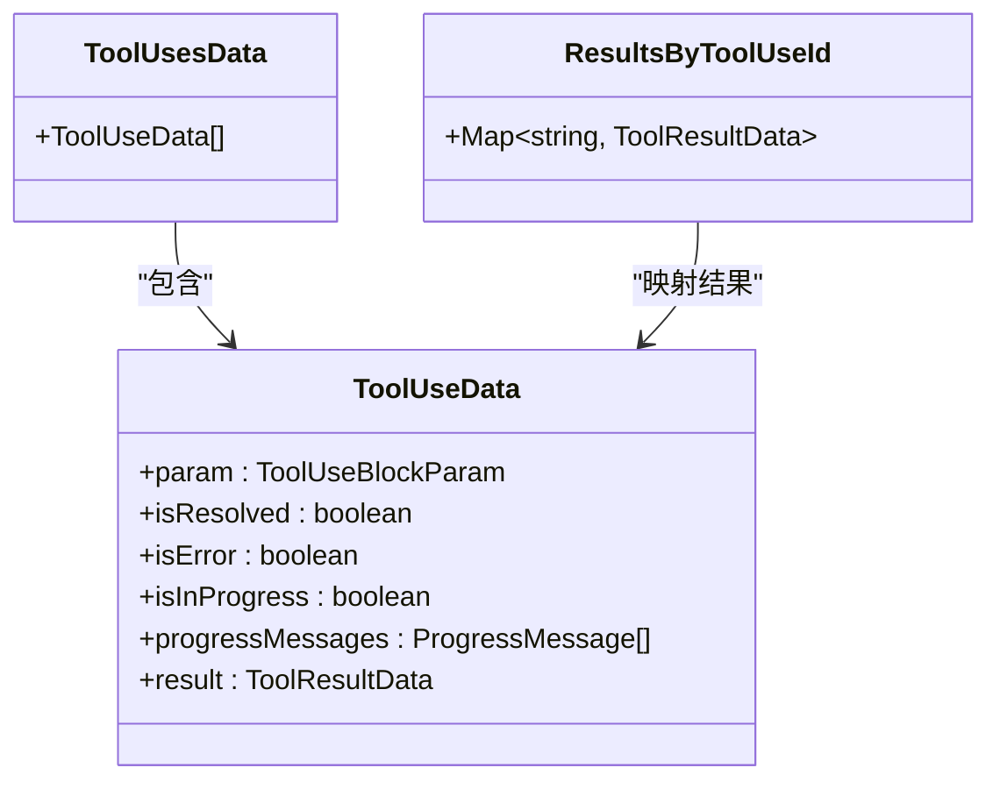
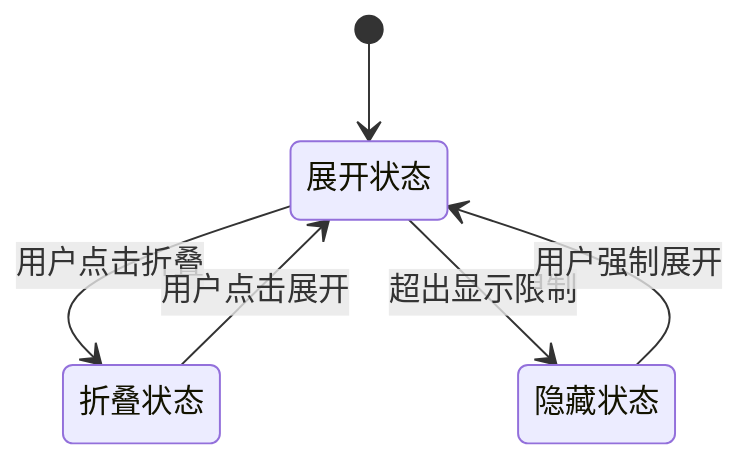
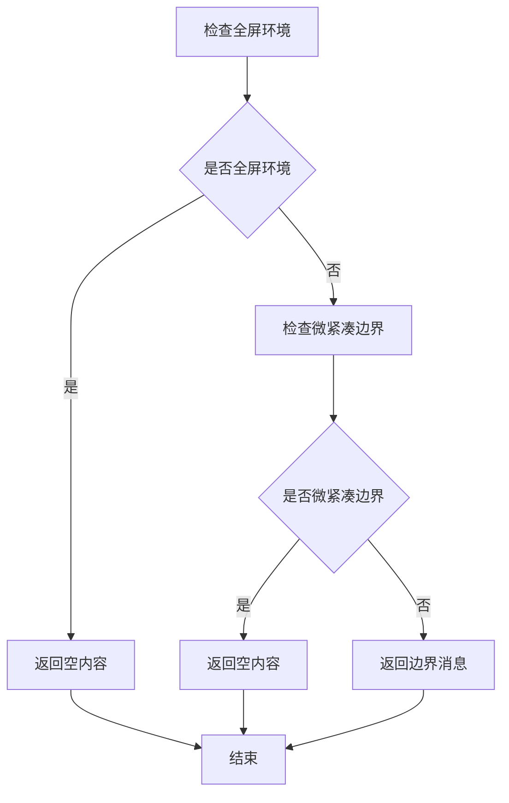
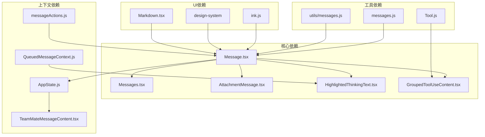

# 专用消息组件

<cite>
**本文档引用的文件**
- [Message.tsx](file://src/components/Message.tsx)
- [Messages.tsx](file://src/components/Messages.tsx)
- [AttachmentMessage.tsx](file://src/components/messages/AttachmentMessage.tsx)
- [HighlightedThinkingText.tsx](file://src/components/messages/HighlightedThinkingText.tsx)
- [GroupedToolUseContent.tsx](file://src/components/messages/GroupedToolUseContent.tsx)
- [CollapsedReadSearchContent.tsx](file://src/components/messages/CollapsedReadSearchContent.tsx)
- [CompactBoundaryMessage.tsx](file://src/components/messages/CompactBoundaryMessage.tsx)
</cite>

## 目录
1. [简介](#简介)
2. [项目结构](#项目结构)
3. [核心组件](#核心组件)
4. [架构概览](#架构概览)
5. [详细组件分析](#详细组件分析)
6. [依赖关系分析](#依赖关系分析)
7. [性能考虑](#性能考虑)
8. [故障排除指南](#故障排除指南)
9. [结论](#结论)

## 简介

专用消息组件是 Claude Code 源代码中用于处理特殊类型消息的核心组件集合。这些组件专门设计用于处理附件消息、高亮思考文本、分组工具使用内容、折叠读取搜索内容、紧凑边界消息等特殊场景。

本文档深入分析了这些专用消息组件的设计目的、实现原理、使用场景以及配置选项，为开发者提供了全面的技术参考。

## 项目结构

专用消息组件主要分布在以下目录结构中：

**图表来源**
- [Message.tsx:1-627](file://src/components/Message.tsx#L1-L627)
- [Messages.tsx:1-834](file://src/components/Messages.tsx#L1-L834)

**章节来源**
- [Message.tsx:1-627](file://src/components/Message.tsx#L1-L627)
- [Messages.tsx:1-834](file://src/components/Messages.tsx#L1-L834)

## 核心组件

专用消息组件系统由多个精心设计的组件构成，每个组件都有其特定的功能和使用场景：

### 主要组件分类

1. **附件消息处理组件** - 处理各种类型的附件消息
2. **高亮思考文本组件** - 提供语法高亮和可读性优化
3. **分组工具使用组件** - 管理多个工具使用的聚合显示
4. **折叠搜索内容组件** - 处理搜索结果的折叠显示
5. **紧凑边界消息组件** - 控制消息显示的边界条件

### 组件交互模式

**图表来源**
- [Message.tsx:82-354](file://src/components/Message.tsx#L82-L354)
- [Messages.tsx:341-721](file://src/components/Messages.tsx#L341-L721)

**章节来源**
- [Message.tsx:82-354](file://src/components/Message.tsx#L82-L354)
- [Messages.tsx:341-721](file://src/components/Messages.tsx#L341-L721)

## 架构概览

专用消息组件采用模块化设计，通过统一的消息路由机制来处理不同类型的特殊消息：

**图表来源**
- [Message.tsx:32-57](file://src/components/Message.tsx#L32-L57)
- [AttachmentMessage.tsx:30-35](file://src/components/messages/AttachmentMessage.tsx#L30-L35)
- [HighlightedThinkingText.tsx:10-14](file://src/components/messages/HighlightedThinkingText.tsx#L10-L14)
- [GroupedToolUseContent.tsx:6-12](file://src/components/messages/GroupedToolUseContent.tsx#L6-L12)

## 详细组件分析

### 附件消息组件 (AttachmentMessage)

附件消息组件是专用消息系统中最复杂的组件之一，负责处理各种类型的附件数据：

#### 支持的附件类型

| 附件类型 | 描述 | 显示格式 |
|---------|------|----------|
| directory | 目录列表 | "列出目录路径" |
| file | 文件读取 | "读取文件 (行数/大小)" |
| already_read_file | 已读文件 | "读取文件 (未更改)" |
| compact_file_reference | 文件引用 | "引用文件路径" |
| pdf_reference | PDF引用 | "引用PDF (页数)" |
| selected_lines_in_ide | IDE选中行 | "选中行数 (文件名)" |
| nested_memory | 嵌套内存 | "加载内存路径" |
| relevant_memories | 相关记忆 | "回忆记忆数量" |
| dynamic_skill | 动态技能 | "加载技能数量 (路径)" |

#### 附件消息处理流程

**图表来源**
- [AttachmentMessage.tsx:126-356](file://src/components/messages/AttachmentMessage.tsx#L126-L356)

#### 附件消息的处理逻辑

附件消息组件实现了智能的条件渲染机制，根据不同的环境和配置来决定显示内容：

**章节来源**
- [AttachmentMessage.tsx:126-356](file://src/components/messages/AttachmentMessage.tsx#L126-L356)

### 高亮思考文本组件 (HighlightedThinkingText)

高亮思考文本组件专注于提供语法高亮和可读性优化的思考文本显示：

#### 高亮功能特性

1. **触发词高亮** - 自动识别思考文本中的触发词并进行彩虹色高亮
2. **指针标记** - 在文本前添加指针符号以增强视觉引导
3. **时间戳支持** - 支持在简要布局中显示时间戳
4. **队列状态指示** - 根据消息是否在队列中调整颜色主题

#### 高亮算法实现

**图表来源**
- [HighlightedThinkingText.tsx:82-160](file://src/components/messages/HighlightedThinkingText.tsx#L82-L160)

#### 可读性优化策略

组件采用了多种策略来提高思考文本的可读性：

1. **颜色对比度** - 使用高对比度的颜色方案确保文本清晰可见
2. **布局优化** - 采用适当的内边距和对齐方式
3. **状态感知** - 根据消息状态（选中、队列中）调整视觉样式

**章节来源**
- [HighlightedThinkingText.tsx:15-161](file://src/components/messages/HighlightedThinkingText.tsx#L15-L161)

### 分组工具使用内容组件 (GroupedToolUseContent)

分组工具使用内容组件专门处理多个工具使用的聚合显示：

#### 数据结构设计

组件内部维护了一个复杂的数据结构来管理工具使用信息：

**图表来源**
- [GroupedToolUseContent.tsx:26-51](file://src/components/messages/GroupedToolUseContent.tsx#L26-L51)

#### 分组渲染逻辑

组件通过以下步骤实现高效的分组渲染：

1. **结果映射构建** - 创建从工具使用ID到结果数据的映射
2. **数据转换** - 将原始消息转换为工具使用数据结构
3. **状态检测** - 检查是否存在进行中的工具使用
4. **工具渲染** - 调用相应工具的渲染函数

**章节来源**
- [GroupedToolUseContent.tsx:13-57](file://src/components/messages/GroupedToolUseContent.tsx#L13-L57)

### 折叠读取搜索内容组件 (CollapsedReadSearchContent)

折叠读取搜索内容组件处理搜索结果的折叠显示，提供高效的搜索结果浏览体验：

#### 折叠机制

组件实现了智能的折叠机制，允许用户控制搜索结果的显示和隐藏：

#### 性能优化

组件采用了多种性能优化技术：

1. **虚拟滚动** - 仅渲染可见区域的内容
2. **懒加载** - 搜索结果按需加载
3. **缓存机制** - 缓存已渲染的结果以提高性能

**章节来源**
- [CollapsedReadSearchContent.tsx](file://src/components/messages/CollapsedReadSearchContent.tsx)

### 紧凑边界消息组件 (CompactBoundaryMessage)

紧凑边界消息组件用于控制消息显示的边界条件，特别是在紧凑模式下的显示控制：

#### 边界控制逻辑

组件实现了复杂的边界控制逻辑，根据不同的环境和配置来决定消息的显示方式：

**图表来源**
- [Message.tsx:233-248](file://src/components/Message.tsx#L233-L248)

**章节来源**
- [Message.tsx:233-248](file://src/components/Message.tsx#L233-L248)

## 依赖关系分析

专用消息组件之间存在复杂的依赖关系，形成了一个完整的消息处理生态系统：

**图表来源**
- [Message.tsx:1-50](file://src/components/Message.tsx#L1-L50)
- [Messages.tsx:1-50](file://src/components/Messages.tsx#L1-L50)

### 关键依赖点

1. **工具系统集成** - 所有工具使用相关的组件都依赖于工具系统
2. **消息处理管道** - 核心消息处理逻辑依赖于消息工具函数
3. **UI框架集成** - 组件依赖于 Ink 框架提供的 UI 组件
4. **上下文系统** - 组件依赖于各种 React 上下文提供者

**章节来源**
- [Message.tsx:1-50](file://src/components/Message.tsx#L1-L50)
- [Messages.tsx:1-50](file://src/components/Messages.tsx#L1-L50)

## 性能考虑

专用消息组件系统在设计时充分考虑了性能优化：

### 渲染优化策略

1. **React.memo 缓存** - 大量使用 React.memo 来避免不必要的重新渲染
2. **条件渲染** - 根据环境和配置进行条件渲染，减少不必要的工作
3. **虚拟化** - 对大量消息使用虚拟化技术，只渲染可见区域
4. **懒加载** - 搜索结果和其他大数据集采用懒加载策略

### 内存管理

1. **对象池模式** - 复用消息对象以减少内存分配
2. **缓存机制** - 实现多层缓存来存储计算结果
3. **垃圾回收友好** - 设计时考虑了 JavaScript 垃圾回收机制

## 故障排除指南

### 常见问题及解决方案

#### 附件消息不显示

**问题描述**: 附件消息没有正确显示

**可能原因**:
1. 附件类型不在支持列表中
2. 特性开关未启用
3. 环境变量配置错误

**解决方案**:
1. 检查附件类型是否在支持列表中
2. 验证相关特性开关的状态
3. 确认环境变量配置正确

#### 高亮文本显示异常

**问题描述**: 高亮文本没有正确显示或显示异常

**可能原因**:
1. 触发词识别算法失败
2. 彩虹色计算错误
3. 样式应用问题

**解决方案**:
1. 检查触发词识别算法
2. 验证彩虹色计算逻辑
3. 确认样式应用正常

#### 工具使用分组错误

**问题描述**: 工具使用没有正确分组显示

**可能原因**:
1. 工具名称匹配失败
2. 结果映射构建错误
3. 状态检测逻辑问题

**解决方案**:
1. 验证工具名称匹配
2. 检查结果映射构建过程
3. 确认状态检测逻辑

**章节来源**
- [AttachmentMessage.tsx:344-356](file://src/components/messages/AttachmentMessage.tsx#L344-L356)
- [HighlightedThinkingText.tsx:82-160](file://src/components/messages/HighlightedThinkingText.tsx#L82-L160)
- [GroupedToolUseContent.tsx:13-57](file://src/components/messages/GroupedToolUseContent.tsx#L13-L57)

## 结论

专用消息组件系统展现了现代前端开发的最佳实践，通过模块化设计、性能优化和用户体验优先的理念，为 Claude Code 提供了强大而灵活的消息处理能力。

这些组件不仅满足了当前的功能需求，还为未来的扩展和定制提供了良好的基础。通过深入理解这些组件的设计原理和实现细节，开发者可以更好地利用和扩展这个系统。