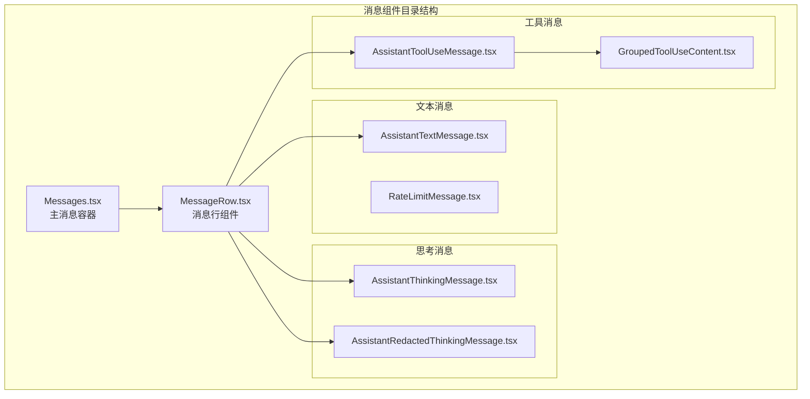
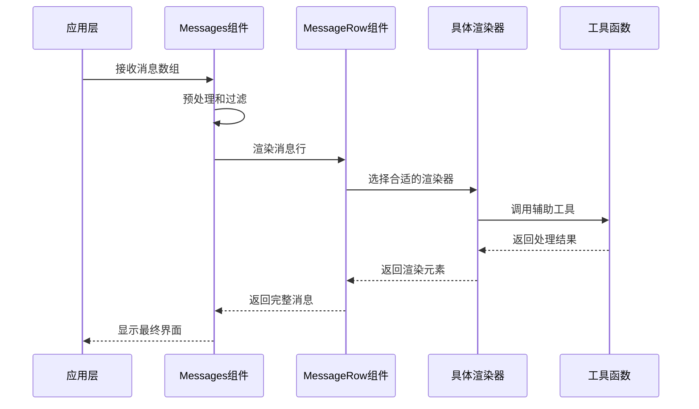
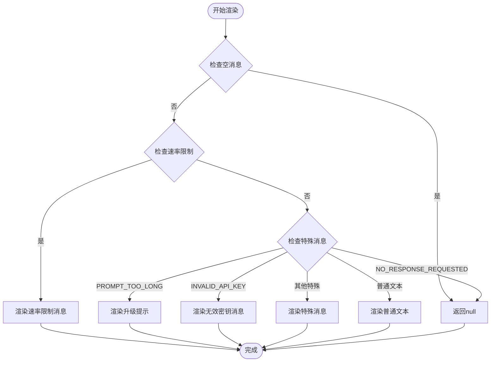
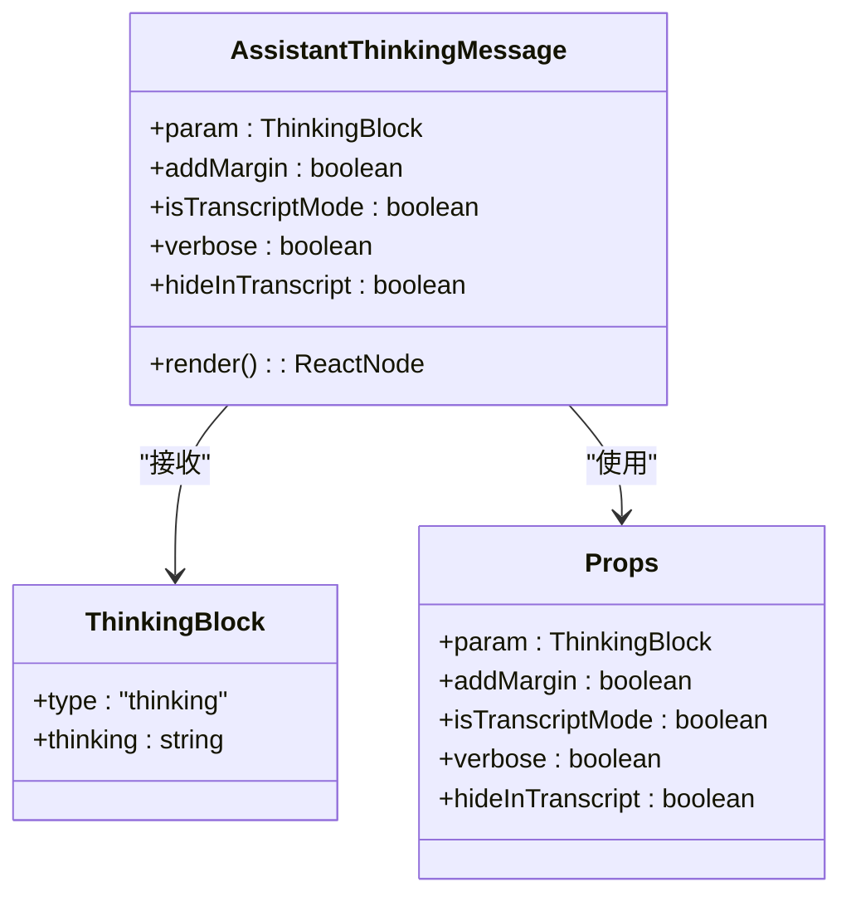
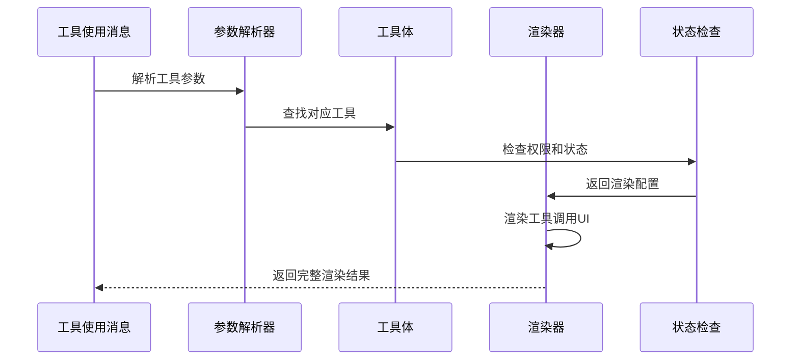
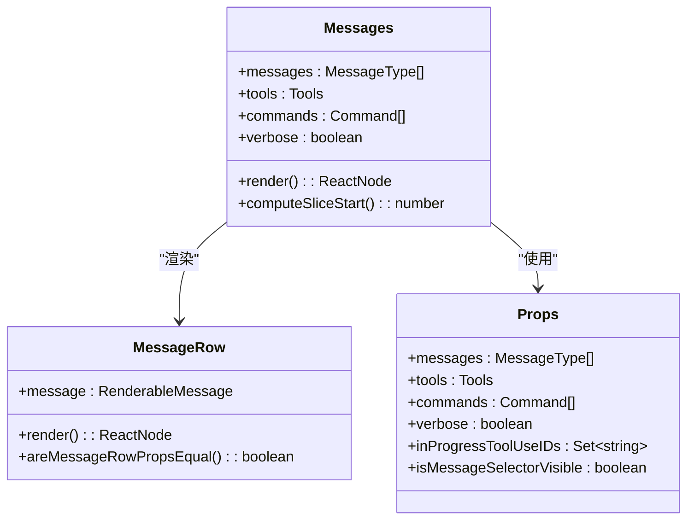
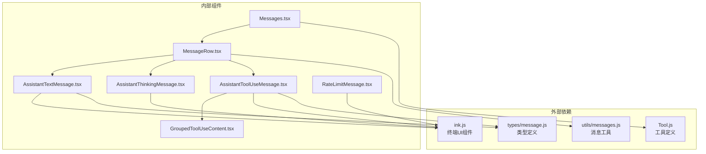

# 助手消息组件

<cite>
**本文档引用的文件**
- [AssistantTextMessage.tsx](file://src/components/messages/AssistantTextMessage.tsx)
- [AssistantThinkingMessage.tsx](file://src/components/messages/AssistantThinkingMessage.tsx)
- [AssistantRedactedThinkingMessage.tsx](file://src/components/messages/AssistantRedactedThinkingMessage.tsx)
- [AssistantToolUseMessage.tsx](file://src/components/messages/AssistantToolUseMessage.tsx)
- [GroupedToolUseContent.tsx](file://src/components/messages/GroupedToolUseContent.tsx)
- [Messages.tsx](file://src/components/Messages.tsx)
- [MessageRow.tsx](file://src/components/MessageRow.tsx)
- [RateLimitMessage.tsx](file://src/components/messages/RateLimitMessage.tsx)
</cite>

## 目录
1. [简介](#简介)
2. [项目结构](#项目结构)
3. [核心组件](#核心组件)
4. [架构概览](#架构概览)
5. [详细组件分析](#详细组件分析)
6. [依赖关系分析](#依赖关系分析)
7. [性能考虑](#性能考虑)
8. [故障排除指南](#故障排除指南)
9. [结论](#结论)

## 简介

助手消息组件是 Claude 代码编辑器中用于显示 AI 助手响应的核心组件系统。该系统支持多种消息类型，包括文本回复、思考过程、脱敏思考、工具使用等，并提供了丰富的交互功能和样式定制能力。

该组件系统采用模块化设计，每个消息类型都有专门的渲染组件，通过统一的消息处理流程进行协调工作。系统还集成了错误处理、权限检查、动画效果等高级功能。

## 项目结构

助手消息组件位于 `src/components/messages/` 目录下，包含以下主要文件：

**图表来源**
- [Messages.tsx:1-800](file://src/components/Messages.tsx#L1-800)
- [MessageRow.tsx:1-383](file://src/components/MessageRow.tsx#L1-383)

**章节来源**
- [Messages.tsx:1-800](file://src/components/Messages.tsx#L1-800)
- [MessageRow.tsx:1-383](file://src/components/MessageRow.tsx#L1-383)

## 核心组件

助手消息系统包含以下核心组件：

### 文本消息组件
- **AssistantTextMessage**: 处理标准文本回复消息
- **RateLimitMessage**: 处理速率限制相关消息
- **AssistantRedactedThinkingMessage**: 处理脱敏思考消息

### 思考过程组件
- **AssistantThinkingMessage**: 渲染完整的思考过程内容
- 支持简洁模式和详细模式显示

### 工具使用组件
- **AssistantToolUseMessage**: 渲染工具调用消息
- **GroupedToolUseContent**: 处理工具使用分组内容

**章节来源**
- [AssistantTextMessage.tsx:1-270](file://src/components/messages/AssistantTextMessage.tsx#L1-270)
- [AssistantThinkingMessage.tsx:1-86](file://src/components/messages/AssistantThinkingMessage.tsx#L1-86)
- [AssistantRedactedThinkingMessage.tsx:1-31](file://src/components/messages/AssistantRedactedThinkingMessage.tsx#L1-31)
- [AssistantToolUseMessage.tsx:1-368](file://src/components/messages/AssistantToolUseMessage.tsx#L1-368)
- [GroupedToolUseContent.tsx:1-58](file://src/components/messages/GroupedToolUseContent.tsx#L1-58)

## 架构概览

助手消息组件采用分层架构设计，从上到下分为多个处理层次：

**图表来源**
- [Messages.tsx:341-721](file://src/components/Messages.tsx#L341-721)
- [MessageRow.tsx:93-287](file://src/components/MessageRow.tsx#L93-287)

系统架构特点：
- **模块化设计**: 每个消息类型有独立的渲染组件
- **可扩展性**: 新的消息类型可以轻松添加
- **性能优化**: 使用记忆化和虚拟化技术
- **状态管理**: 集成工具使用状态和权限检查

**章节来源**
- [Messages.tsx:341-778](file://src/components/Messages.tsx#L341-778)
- [MessageRow.tsx:93-382](file://src/components/MessageRow.tsx#L93-382)

## 详细组件分析

### 文本消息渲染器

AssistantTextMessage 组件负责处理各种文本类型的助手回复：

**图表来源**
- [AssistantTextMessage.tsx:47-270](file://src/components/messages/AssistantTextMessage.tsx#L47-270)

**章节来源**
- [AssistantTextMessage.tsx:1-270](file://src/components/messages/AssistantTextMessage.tsx#L1-270)

### 思考过程渲染器

AssistantThinkingMessage 组件提供灵活的思考过程显示：

**图表来源**
- [AssistantThinkingMessage.tsx:7-18](file://src/components/messages/AssistantThinkingMessage.tsx#L7-18)

思考过程的显示策略：
- **简洁模式**: 显示 "思考中..." 提示
- **详细模式**: 完整显示思考内容
- **转录模式**: 根据配置显示或隐藏
- **脱敏模式**: 使用 AssistantRedactedThinkingMessage

**章节来源**
- [AssistantThinkingMessage.tsx:1-86](file://src/components/messages/AssistantThinkingMessage.tsx#L1-86)
- [AssistantRedactedThinkingMessage.tsx:1-31](file://src/components/messages/AssistantRedactedThinkingMessage.tsx#L1-31)

### 工具使用渲染器

AssistantToolUseMessage 组件处理复杂的工具调用场景：

**图表来源**
- [AssistantToolUseMessage.tsx:35-294](file://src/components/messages/AssistantToolUseMessage.tsx#L35-294)

工具使用消息的特性：
- **权限检查**: 自动检测工具权限状态
- **进度显示**: 实时显示工具执行进度
- **错误处理**: 妥善处理工具调用错误
- **状态指示**: 使用 ToolUseLoader 显示加载状态

**章节来源**
- [AssistantToolUseMessage.tsx:1-368](file://src/components/messages/AssistantToolUseMessage.tsx#L1-368)
- [GroupedToolUseContent.tsx:1-58](file://src/components/messages/GroupedToolUseContent.tsx#L1-58)

### 消息容器组件

Messages 组件作为整个消息系统的容器，负责协调各个子组件：

**图表来源**
- [Messages.tsx:207-275](file://src/components/Messages.tsx#L207-275)

**章节来源**
- [Messages.tsx:1-800](file://src/components/Messages.tsx#L1-800)

## 依赖关系分析

助手消息组件之间的依赖关系如下：

**图表来源**
- [Messages.tsx:1-50](file://src/components/Messages.tsx#L1-50)
- [MessageRow.tsx:1-15](file://src/components/MessageRow.tsx#L1-15)

**章节来源**
- [Messages.tsx:1-800](file://src/components/Messages.tsx#L1-800)
- [MessageRow.tsx:1-383](file://src/components/MessageRow.tsx#L1-383)

## 性能考虑

助手消息组件系统在设计时充分考虑了性能优化：

### 内存管理
- **React.memo 缓存**: 多个组件使用 React.memo 进行记忆化缓存
- **虚拟化渲染**: 大量消息时使用虚拟列表减少内存占用
- **条件渲染**: 只渲染可见消息，隐藏不相关的内容

### 渲染优化
- **批量更新**: 合并多个状态更新以减少重渲染
- **懒加载**: 按需加载工具和消息内容
- **节流处理**: 对频繁更新的状态进行节流处理

### 性能监控
- **渲染时间统计**: 监控组件渲染性能
- **内存使用监控**: 跟踪内存使用情况
- **优化建议**: 提供性能优化建议

## 故障排除指南

### 常见问题及解决方案

**问题1: 消息不显示**
- 检查消息是否为空或被过滤
- 验证消息类型是否正确
- 确认渲染条件是否满足

**问题2: 工具调用失败**
- 检查工具权限设置
- 验证工具参数格式
- 查看错误日志信息

**问题3: 思考过程显示异常**
- 确认思考内容是否为空
- 检查转录模式设置
- 验证权限配置

**问题4: 性能问题**
- 检查消息数量是否过多
- 验证虚拟化功能是否启用
- 监控内存使用情况

**章节来源**
- [AssistantTextMessage.tsx:28-46](file://src/components/messages/AssistantTextMessage.tsx#L28-46)
- [AssistantToolUseMessage.tsx:90-93](file://src/components/messages/AssistantToolUseMessage.tsx#L90-93)
- [Messages.tsx:314-340](file://src/components/Messages.tsx#L314-340)

## 结论

助手消息组件系统是一个功能完整、设计精良的消息显示框架。它通过模块化的组件设计、灵活的渲染策略和完善的性能优化，为用户提供了一个强大而易用的消息显示系统。

系统的主要优势包括：
- **高度模块化**: 每个消息类型都有独立的渲染组件
- **灵活配置**: 支持多种显示模式和自定义选项
- **性能优化**: 采用多种技术确保良好的运行性能
- **错误处理**: 完善的错误处理和恢复机制
- **扩展性强**: 易于添加新的消息类型和功能

该系统为 Claude 代码编辑器提供了坚实的消息显示基础，能够满足各种复杂的消息展示需求。