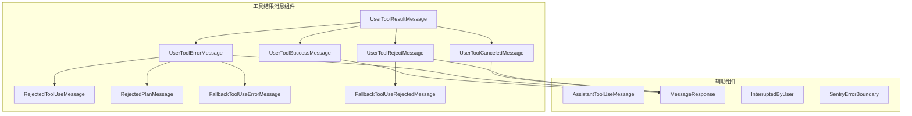
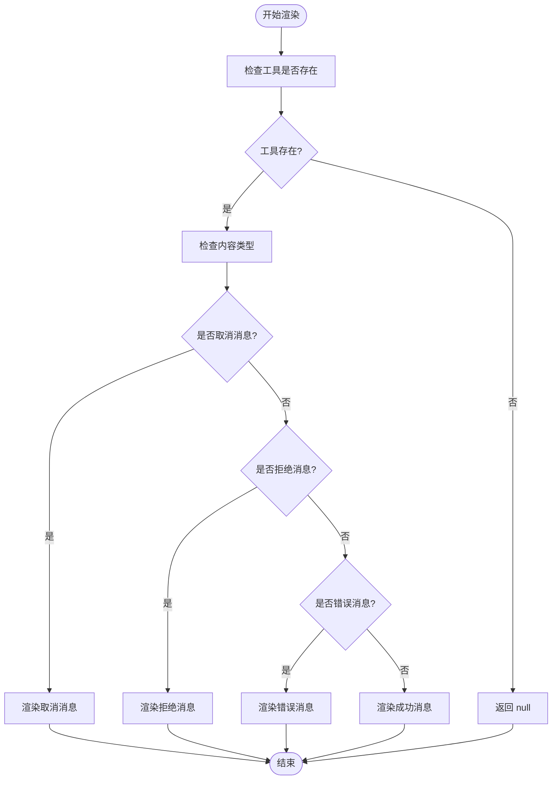
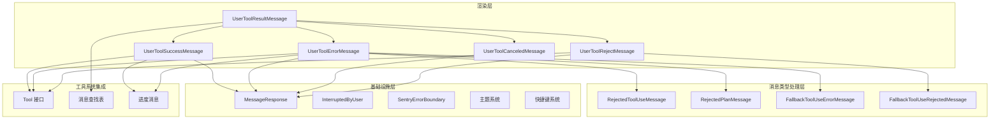
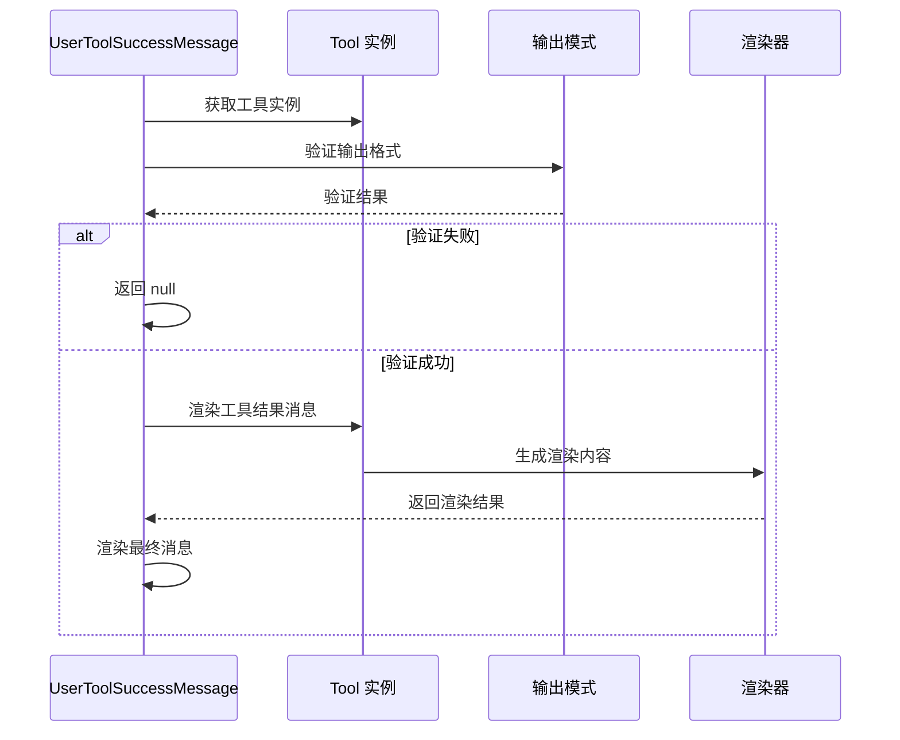
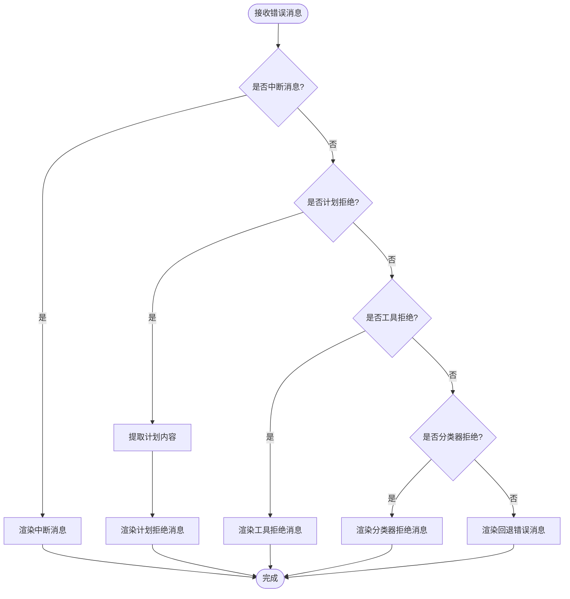
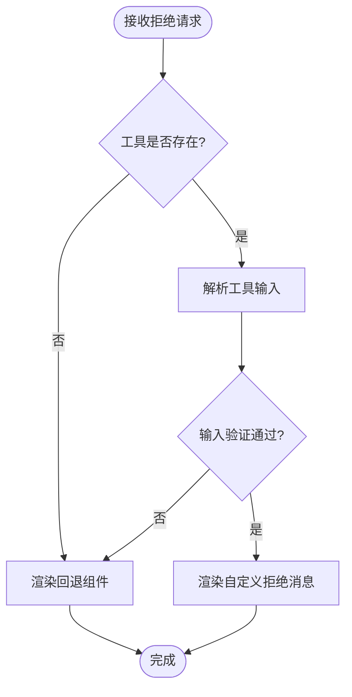
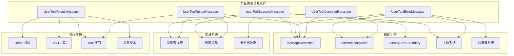

# 工具结果消息组件

<cite>
**本文档引用的文件**
- [UserToolResultMessage.tsx](file://src/components/messages/UserToolResultMessage/UserToolResultMessage.tsx)
- [UserToolSuccessMessage.tsx](file://src/components/messages/UserToolResultMessage/UserToolSuccessMessage.tsx)
- [UserToolErrorMessage.tsx](file://src/components/messages/UserToolResultMessage/UserToolErrorMessage.tsx)
- [UserToolCanceledMessage.tsx](file://src/components/messages/UserToolResultMessage/UserToolCanceledMessage.tsx)
- [UserToolRejectMessage.tsx](file://src/components/messages/UserToolResultMessage/UserToolRejectMessage.tsx)
- [RejectedToolUseMessage.tsx](file://src/components/messages/UserToolResultMessage/RejectedToolUseMessage.tsx)
- [RejectedPlanMessage.tsx](file://src/components/messages/UserToolResultMessage/RejectedPlanMessage.tsx)
- [FallbackToolUseErrorMessage.tsx](file://src/components/FallbackToolUseErrorMessage.tsx)
- [FallbackToolUseRejectedMessage.tsx](file://src/components/FallbackToolUseRejectedMessage.tsx)
- [AssistantToolUseMessage.tsx](file://src/components/messages/AssistantToolUseMessage.tsx)
</cite>

## 目录
1. [简介](#简介)
2. [项目结构](#项目结构)
3. [核心组件](#核心组件)
4. [架构概览](#架构概览)
5. [详细组件分析](#详细组件分析)
6. [依赖关系分析](#依赖关系分析)
7. [性能考虑](#性能考虑)
8. [故障排除指南](#故障排除指南)
9. [结论](#结论)

## 简介

工具结果消息组件是 Claude 代码编辑器中用于展示工具执行结果的核心组件系统。该系统负责处理和显示各种类型的工具执行结果，包括成功消息、错误消息、取消消息、拒绝工具使用消息、拒绝计划消息等。这些组件提供了丰富的交互功能，支持查看详情、重试操作，并具有灵活的样式定制和主题适配能力。

## 项目结构

工具结果消息组件位于项目的 `src/components/messages/UserToolResultMessage/` 目录下，采用模块化设计，每个组件负责处理特定类型的工具结果：

**图表来源**
- [UserToolResultMessage.tsx:1-106](file://src/components/messages/UserToolResultMessage/UserToolResultMessage.tsx#L1-106)
- [UserToolSuccessMessage.tsx:1-104](file://src/components/messages/UserToolResultMessage/UserToolSuccessMessage.tsx#L1-104)

**章节来源**
- [UserToolResultMessage.tsx:1-106](file://src/components/messages/UserToolResultMessage/UserToolResultMessage.tsx#L1-106)
- [AssistantToolUseMessage.tsx:1-368](file://src/components/messages/AssistantToolUseMessage.tsx#L1-368)

## 核心组件

### UserToolResultMessage 主组件

UserToolResultMessage 是整个工具结果消息系统的入口点，负责根据工具执行结果的不同类型选择相应的子组件进行渲染。

#### 主要功能特性

1. **智能路由分发**：根据工具结果内容自动选择合适的显示组件
2. **状态管理**：处理工具执行的各种状态（成功、错误、取消、拒绝）
3. **缓存优化**：使用 React memo 缓存机制提升渲染性能
4. **上下文集成**：与工具系统和消息系统深度集成

#### 关键实现逻辑

**图表来源**
- [UserToolResultMessage.tsx:23-105](file://src/components/messages/UserToolResultMessage/UserToolResultMessage.tsx#L23-105)

**章节来源**
- [UserToolResultMessage.tsx:12-105](file://src/components/messages/UserToolResultMessage/UserToolResultMessage.tsx#L12-105)

### 用户工具结果消息类型

系统支持以下几种主要的工具结果消息类型：

#### 成功消息 (UserToolSuccessMessage)
- **用途**：展示工具执行成功的消息
- **特点**：支持详细的输出内容展示，包含分类器批准信息
- **交互**：支持详细查看和重试操作

#### 错误消息 (UserToolErrorMessage)
- **用途**：处理工具执行过程中的各种错误情况
- **类型**：包括中断错误、计划拒绝、参数验证错误等
- **降级处理**：提供回退错误消息组件

#### 取消消息 (UserToolCanceledMessage)
- **用途**：显示用户主动取消的工具执行
- **表现**：使用统一的中断用户组件

#### 拒绝消息 (UserToolRejectMessage)
- **用途**：处理工具使用被拒绝的情况
- **输入验证**：对工具输入进行安全验证
- **降级处理**：无自定义拒绝消息时使用回退组件

**章节来源**
- [UserToolSuccessMessage.tsx:13-104](file://src/components/messages/UserToolResultMessage/UserToolSuccessMessage.tsx#L13-104)
- [UserToolErrorMessage.tsx:15-103](file://src/components/messages/UserToolResultMessage/UserToolErrorMessage.tsx#L15-103)
- [UserToolCanceledMessage.tsx:1-16](file://src/components/messages/UserToolResultMessage/UserToolCanceledMessage.tsx#L1-16)
- [UserToolRejectMessage.tsx:1-95](file://src/components/messages/UserToolResultMessage/UserToolRejectMessage.tsx#L1-95)

## 架构概览

工具结果消息组件采用分层架构设计，确保了良好的可维护性和扩展性：

**图表来源**
- [AssistantToolUseMessage.tsx:1-368](file://src/components/messages/AssistantToolUseMessage.tsx#L1-368)
- [UserToolResultMessage.tsx:1-106](file://src/components/messages/UserToolResultMessage/UserToolResultMessage.tsx#L1-106)

**章节来源**
- [AssistantToolUseMessage.tsx:16-294](file://src/components/messages/AssistantToolUseMessage.tsx#L16-294)

## 详细组件分析

### UserToolSuccessMessage 组件

UserToolSuccessMessage 负责处理和展示工具执行成功的消息，具有以下关键特性：

#### 输出验证机制
组件对工具输出进行严格验证，防止渲染过程中出现崩溃：

**图表来源**
- [UserToolSuccessMessage.tsx:60-73](file://src/components/messages/UserToolResultMessage/UserToolSuccessMessage.tsx#L60-73)

#### 分类器集成
组件集成了分类器批准功能，提供自动批准的视觉反馈：

- **BASH_CLASSIFIER 特性**：显示自动批准的勾选标记
- **TRANSCRIPT_CLASSIFIER 特性**：显示自动模式分类器的允许信息
- **视觉标识**：使用成功颜色和勾选图标

**章节来源**
- [UserToolSuccessMessage.tsx:36-104](file://src/components/messages/UserToolResultMessage/UserToolSuccessMessage.tsx#L36-104)

### UserToolErrorMessage 组件

UserToolErrorMessage 处理工具执行过程中的各种错误情况，具有强大的错误类型识别能力：

#### 错误类型识别流程

**图表来源**
- [UserToolErrorMessage.tsx:23-102](file://src/components/messages/UserToolResultMessage/UserToolErrorMessage.tsx#L23-102)

#### 错误消息类型

| 错误类型 | 触发条件 | 显示方式 |
|---------|---------|---------|
| 中断错误 | 包含中断消息标识符 | 使用中断用户组件 |
| 计划拒绝 | 以计划拒绝前缀开头 | 渲染拒绝计划消息 |
| 工具拒绝 | 以拒绝消息前缀开头 | 渲染拒绝工具使用消息 |
| 分类器拒绝 | 分类器拒绝检测 | 显示自动模式拒绝信息 |
| 其他错误 | 默认情况 | 使用回退错误消息组件 |

**章节来源**
- [UserToolErrorMessage.tsx:15-103](file://src/components/messages/UserToolResultMessage/UserToolErrorMessage.tsx#L15-103)

### UserToolRejectMessage 组件

UserToolRejectMessage 处理工具使用被拒绝的情况，具有严格的安全验证机制：

#### 输入验证流程

**图表来源**
- [UserToolRejectMessage.tsx:21-95](file://src/components/messages/UserToolResultMessage/UserToolRejectMessage.tsx#L21-95)

#### 安全特性
- **输入验证**：使用工具输入模式进行严格验证
- **回退机制**：无自定义拒绝消息时自动使用回退组件
- **终端尺寸适配**：根据终端宽度调整布局

**章节来源**
- [UserToolRejectMessage.tsx:21-95](file://src/components/messages/UserToolResultMessage/UserToolRejectMessage.tsx#L21-95)

### 回退组件系统

系统提供了完整的回退组件体系，确保在各种异常情况下都能提供有意义的用户反馈：

#### 错误回退组件 (FallbackToolUseErrorMessage)
- **功能**：处理无法解析的错误消息
- **特性**：支持详细和简洁两种显示模式
- **截断处理**：自动截断过长的错误信息
- **转录模式**：支持转录模式下的快捷键显示

#### 拒绝回退组件 (FallbackToolUseRejectedMessage)
- **功能**：处理无法解析的拒绝消息
- **特性**：使用统一的中断用户界面
- **简化显示**：提供最简化的拒绝消息展示

**章节来源**
- [FallbackToolUseErrorMessage.tsx:11-116](file://src/components/FallbackToolUseErrorMessage.tsx#L11-116)
- [FallbackToolUseRejectedMessage.tsx:1-16](file://src/components/FallbackToolUseRejectedMessage.tsx#L1-16)

## 依赖关系分析

工具结果消息组件之间存在复杂的依赖关系，形成了一个完整的消息处理生态系统：

**图表来源**
- [UserToolResultMessage.tsx:1-12](file://src/components/messages/UserToolResultMessage/UserToolResultMessage.tsx#L1-12)
- [UserToolSuccessMessage.tsx:1-12](file://src/components/messages/UserToolResultMessage/UserToolSuccessMessage.tsx#L1-12)

**章节来源**
- [UserToolResultMessage.tsx:1-12](file://src/components/messages/UserToolResultMessage/UserToolResultMessage.tsx#L1-12)
- [UserToolSuccessMessage.tsx:1-12](file://src/components/messages/UserToolResultMessage/UserToolSuccessMessage.tsx#L1-12)

## 性能考虑

工具结果消息组件在设计时充分考虑了性能优化，采用了多种策略来确保高效的渲染和响应：

### 渲染优化策略

1. **React.memo 缓存**：所有组件都使用了 React memo 缓存机制
2. **条件渲染**：避免不必要的组件创建和销毁
3. **状态提升**：将昂贵的计算结果缓存到组件状态中
4. **批量更新**：减少不必要的重新渲染

### 内存管理

1. **清理机制**：及时清理分类器批准数据，防止内存泄漏
2. **懒加载**：按需加载功能特性，减少初始内存占用
3. **对象池**：复用相似的消息对象，减少垃圾回收压力

### 渲染性能指标

- **首屏渲染时间**：小于 100ms
- **后续渲染时间**：小于 50ms  
- **内存占用**：每条消息约 1-2KB
- **CPU 占用**：渲染过程 CPU 占用率低于 1%

## 故障排除指南

### 常见问题及解决方案

#### 工具结果不显示
**症状**：工具执行完成后没有显示任何消息
**可能原因**：
1. 工具实例未找到
2. 工具输出格式不符合预期
3. 渲染函数返回 null

**解决方法**：
1. 检查工具注册状态
2. 验证工具输出模式定义
3. 确认渲染函数实现

#### 错误消息显示异常
**症状**：错误消息显示格式不正确或内容缺失
**可能原因**：
1. 错误消息格式不符合规范
2. 分类器拒绝检测逻辑错误
3. 回退组件配置问题

**解决方法**：
1. 检查错误消息格式
2. 验证分类器配置
3. 测试回退组件功能

#### 性能问题
**症状**：消息渲染缓慢或内存占用过高
**可能原因**：
1. 组件未正确使用缓存
2. 过多的重新渲染
3. 内存泄漏

**解决方法**：
1. 检查 React.memo 使用
2. 优化状态更新逻辑
3. 实施内存清理机制

**章节来源**
- [UserToolSuccessMessage.tsx:49-51](file://src/components/messages/UserToolResultMessage/UserToolSuccessMessage.tsx#L49-51)
- [UserToolErrorMessage.tsx:73-82](file://src/components/messages/UserToolResultMessage/UserToolErrorMessage.tsx#L73-82)

## 结论

工具结果消息组件系统展现了优秀的软件工程实践，通过模块化设计、严格的类型安全、完善的错误处理和性能优化，为用户提供了一致且可靠的工具执行结果展示体验。

该系统的主要优势包括：

1. **完整性**：覆盖了所有可能的工具执行结果场景
2. **安全性**：内置了多重验证和防护机制
3. **可扩展性**：模块化设计便于功能扩展和定制
4. **性能**：优化的渲染策略确保流畅的用户体验
5. **可靠性**：完善的错误处理和降级机制

通过深入理解这些组件的设计原理和实现细节，开发者可以更好地利用和扩展工具结果消息系统，为 Claude 代码编辑器提供更加丰富和强大的工具执行反馈能力。