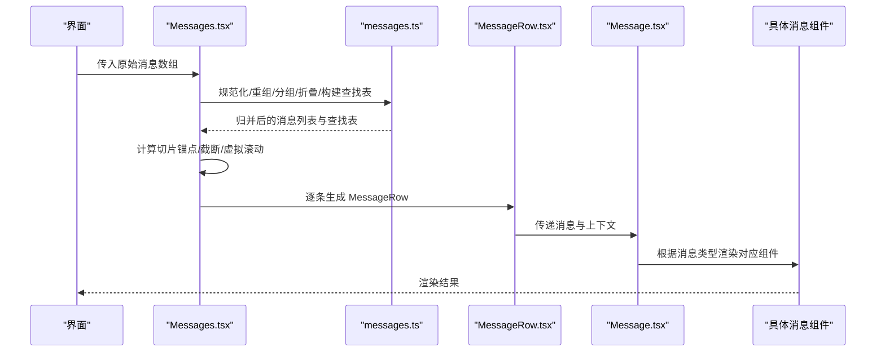
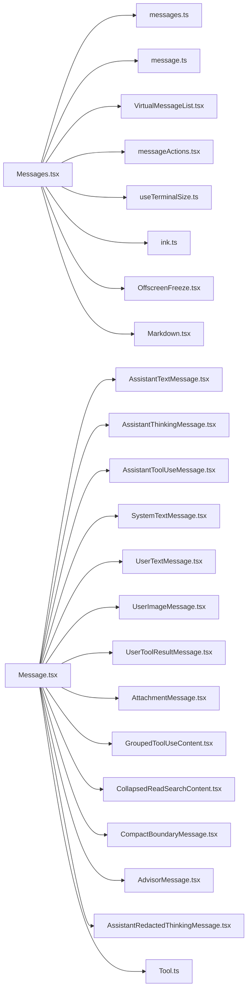

# 消息组件

<cite>
**本文档引用的文件**
- [Message.tsx](file://src/components/Message.tsx)
- [Messages.tsx](file://src/components/Messages.tsx)
- [MessageRow.tsx](file://src/components/MessageRow.tsx)
- [messageActions.tsx](file://src/components/messageActions.tsx)
- [VirtualMessageList.tsx](file://src/components/VirtualMessageList.tsx)
- [OffscreenFreeze.tsx](file://src/components/OffscreenFreeze.tsx)
- [Markdown.tsx](file://src/components/Markdown.tsx)
- [AssistantThinkingMessage.tsx](file://src/components/messages/AssistantThinkingMessage.tsx)
- [AssistantTextMessage.tsx](file://src/components/messages/AssistantTextMessage.tsx)
- [AssistantToolUseMessage.tsx](file://src/components/messages/AssistantToolUseMessage.tsx)
- [SystemTextMessage.tsx](file://src/components/messages/SystemTextMessage.tsx)
- [UserTextMessage.tsx](file://src/components/messages/UserTextMessage.tsx)
- [UserImageMessage.tsx](file://src/components/messages/UserImageMessage.tsx)
- [UserToolResultMessage.tsx](file://src/components/messages/UserToolResultMessage/UserToolResultMessage.tsx)
- [AttachmentMessage.tsx](file://src/components/messages/AttachmentMessage.tsx)
- [GroupedToolUseContent.tsx](file://src/components/messages/GroupedToolUseContent.tsx)
- [CollapsedReadSearchContent.tsx](file://src/components/messages/CollapsedReadSearchContent.tsx)
- [CompactBoundaryMessage.tsx](file://src/components/messages/CompactBoundaryMessage.tsx)
- [AdvisorMessage.tsx](file://src/components/messages/AdvisorMessage.tsx)
- [AssistantRedactedThinkingMessage.tsx](file://src/components/messages/AssistantRedactedThinkingMessage.tsx)
- [messages.ts](file://src/utils/messages.ts)
- [message.ts](file://src/types/message.ts)
- [Tool.ts](file://src/Tool.ts)
- [useTerminalSize.ts](file://src/hooks/useTerminalSize.ts)
- [ink.ts](file://src/ink.ts)
</cite>

## 目录
1. [简介](#简介)
2. [项目结构](#项目结构)
3. [核心组件](#核心组件)
4. [架构总览](#架构总览)
5. [详细组件分析](#详细组件分析)
6. [依赖关系分析](#依赖关系分析)
7. [性能考量](#性能考量)
8. [故障排查指南](#故障排查指南)
9. [结论](#结论)

## 简介
本文件系统性梳理消息组件体系，覆盖用户消息、助手消息（含思考、文本、工具调用）、系统消息、工具结果、附件、分组工具使用、折叠读取搜索等各类消息类型。文档重点阐述：
- 渲染逻辑与内容格式化策略
- 附件与工具结果的处理流程
- 消息状态管理（思考中、已完成、错误等）
- 交互能力（复制、展开、删除等）
- 样式定制与主题适配方案

## 项目结构
消息组件由顶层容器 Messages 负责消息归并、折叠、分组与截断策略，内部通过 MessageRow 渲染单条消息，具体消息类型由 Message 组件根据消息类型分发到对应的消息子组件。

```mermaid
graph TB
Messages["Messages.tsx<br/>消息容器与策略"] --> VirtualMessageList["VirtualMessageList.tsx<br/>虚拟列表"]
Messages --> MessageRow["MessageRow.tsx<br/>消息行包装"]
MessageRow --> Message["Message.tsx<br/>消息分发器"]
Message --> AssistantThinking["AssistantThinkingMessage.tsx"]
Message --> AssistantText["AssistantTextMessage.tsx"]
Message --> AssistantToolUse["AssistantToolUseMessage.tsx"]
Message --> SystemText["SystemTextMessage.tsx"]
Message --> UserText["UserTextMessage.tsx"]
Message --> UserImage["UserImageMessage.tsx"]
Message --> UserToolResult["UserToolResultMessage.tsx"]
Message --> Attachment["AttachmentMessage.tsx"]
Message --> GroupedToolUse["GroupedToolUseContent.tsx"]
Message --> CollapsedReadSearch["CollapsedReadSearchContent.tsx"]
Message --> CompactBoundary["CompactBoundaryMessage.tsx"]
Message --> Advisor["AdvisorMessage.tsx"]
Message --> RedactedThinking["AssistantRedactedThinkingMessage.tsx"]
Messages --> OffscreenFreeze["OffscreenFreeze.tsx<br/>离屏冻结"]
Messages --> Markdown["Markdown.tsx<br/>流式渲染"]
Messages --> Actions["messageActions.tsx<br/>消息动作上下文"]
Messages --> Utils["messages.ts<br/>消息工具函数"]
Messages --> Types["message.ts<br/>消息类型定义"]
Messages --> Hooks["useTerminalSize.ts<br/>终端尺寸"]
Messages --> Ink["ink.ts<br/>终端渲染"]
```

**图表来源**
- [Messages.tsx:341-721](file://src/components/Messages.tsx#L341-L721)
- [Message.tsx:58-355](file://src/components/Message.tsx#L58-L355)
- [MessageRow.tsx](file://src/components/MessageRow.tsx)
- [messageActions.tsx](file://src/components/messageActions.tsx)
- [VirtualMessageList.tsx](file://src/components/VirtualMessageList.tsx)
- [OffscreenFreeze.tsx](file://src/components/OffscreenFreeze.tsx)
- [Markdown.tsx](file://src/components/Markdown.tsx)
- [AssistantThinkingMessage.tsx](file://src/components/messages/AssistantThinkingMessage.tsx)
- [AssistantTextMessage.tsx](file://src/components/messages/AssistantTextMessage.tsx)
- [AssistantToolUseMessage.tsx](file://src/components/messages/AssistantToolUseMessage.tsx)
- [SystemTextMessage.tsx](file://src/components/messages/SystemTextMessage.tsx)
- [UserTextMessage.tsx](file://src/components/messages/UserTextMessage.tsx)
- [UserImageMessage.tsx](file://src/components/messages/UserImageMessage.tsx)
- [UserToolResultMessage.tsx](file://src/components/messages/UserToolResultMessage/UserToolResultMessage.tsx)
- [AttachmentMessage.tsx](file://src/components/messages/AttachmentMessage.tsx)
- [GroupedToolUseContent.tsx](file://src/components/messages/GroupedToolUseContent.tsx)
- [CollapsedReadSearchContent.tsx](file://src/components/messages/CollapsedReadSearchContent.tsx)
- [CompactBoundaryMessage.tsx](file://src/components/messages/CompactBoundaryMessage.tsx)
- [AdvisorMessage.tsx](file://src/components/messages/AdvisorMessage.tsx)
- [AssistantRedactedThinkingMessage.tsx](file://src/components/messages/AssistantRedactedThinkingMessage.tsx)
- [messages.ts](file://src/utils/messages.ts)
- [message.ts](file://src/types/message.ts)
- [useTerminalSize.ts](file://src/hooks/useTerminalSize.ts)
- [ink.ts](file://src/ink.ts)

**章节来源**
- [Messages.tsx:341-721](file://src/components/Messages.tsx#L341-L721)
- [Message.tsx:58-355](file://src/components/Message.tsx#L58-L355)

## 核心组件
- Messages：负责消息预处理（去重、重组、分组、折叠、截断）、虚拟滚动、搜索索引、进度条通知、展开/收起状态管理、以及将消息映射为可渲染的 MessageRow 列表。
- MessageRow：为每条消息提供统一的包裹层，支持选择态、分割线插入、以及传递列宽等上下文信息。
- Message：根据消息类型分发到具体的消息子组件，处理思考块可见性、转录模式下的历史过滤、以及工具调用/结果的渲染细节。

关键特性
- 思考块控制：在转录模式下仅显示最新思考块或根据配置显示全部；支持“思考中”状态的流式展示。
- 工具调用与结果：支持工具调用块、工具结果块、以及分组工具使用的聚合渲染。
- 附件与系统消息：对特定系统边界消息进行特殊处理（如紧凑边界）；附件消息按类型渲染。
- 性能优化：虚拟列表、切片锚点、记忆化、浅比较优化等。

**章节来源**
- [Messages.tsx:341-721](file://src/components/Messages.tsx#L341-L721)
- [Message.tsx:58-355](file://src/components/Message.tsx#L58-L355)

## 架构总览
消息渲染的整体流程如下：

**图表来源**
- [Messages.tsx:475-529](file://src/components/Messages.tsx#L475-L529)
- [messages.ts](file://src/utils/messages.ts)
- [MessageRow.tsx](file://src/components/MessageRow.tsx)
- [Message.tsx:58-355](file://src/components/Message.tsx#L58-L355)

## 详细组件分析

### Messages 容器组件
职责与策略
- 消息规范化与过滤：去除空消息、进度消息、以及不满足转录模式条件的附件。
- 分组与折叠：应用工具调用分组、钩子摘要折叠、团队成员关闭提示折叠、读取/搜索折叠等。
- 截断与虚拟滚动：在转录模式下默认只显示最近若干条；非虚拟滚动路径采用基于 UUID 的切片锚点以避免频繁重排。
- 展开/收起：维护展开键集合，支持点击展开/收起；仅对具备“可展开内容”的消息生效。
- 流式渲染：支持“思考中”流式块与文本流式预览的无缝衔接。
- 搜索索引：为工具结果消息优先使用工具自定义提取文本，否则回退到通用提取逻辑。

交互与状态
- 展开键：基于工具调用 ID 或消息 UUID，确保工具调用与其结果一起展开。
- 进度条：根据是否有进行中的工具调用决定终端进度条状态。
- 选择态：支持消息选择与键盘导航，结合虚拟列表实现高效定位。

**章节来源**
- [Messages.tsx:341-721](file://src/components/Messages.tsx#L341-L721)
- [Messages.tsx:729-778](file://src/components/Messages.tsx#L729-L778)

### Message 分发组件
职责与策略
- 类型分发：根据消息类型将消息分发到对应的子组件（用户文本/图片/工具结果、助手文本/思考/工具调用、系统文本、附件、分组工具使用、折叠读取搜索等）。
- 思考块控制：在非转录模式且未开启 verbose 时，隐藏思考块；在转录模式下仅显示最新思考块。
- 连接器文本：当检测到连接器文本块时，转换为普通文本块进行渲染。
- 错误兜底：无法识别的消息类型或服务器工具块时记录错误并返回空节点。

渲染细节
- 用户消息：支持文本、图片、工具结果三种内容块；图片块支持边距控制与连续输入场景。
- 助手消息：支持文本、思考、工具调用、顾问工具结果等；思考块支持转录模式下的隐藏策略。
- 系统消息：对紧凑边界、本地命令等进行特殊处理；在全屏环境下对某些边界消息进行跳过。
- 附件与分组：附件消息按类型渲染；分组工具使用与折叠读取搜索内容进行聚合渲染。

**章节来源**
- [Message.tsx:58-355](file://src/components/Message.tsx#L58-L355)

### 具体消息类型组件

#### 用户消息
- 文本消息：支持计划内容、时间戳、转录模式下的不同渲染策略。
- 图片消息：支持图片粘贴索引与边距控制，避免在连续输入场景下重复留白。
- 工具结果：根据工具能力与列宽计算，支持工具结果的详细渲染与可选展开。

**章节来源**
- [Message.tsx:356-432](file://src/components/Message.tsx#L356-L432)
- [UserTextMessage.tsx](file://src/components/messages/UserTextMessage.tsx)
- [UserImageMessage.tsx](file://src/components/messages/UserImageMessage.tsx)
- [UserToolResultMessage.tsx](file://src/components/messages/UserToolResultMessage/UserToolResultMessage.tsx)

#### 助手消息
- 文本消息：支持点状前缀、宽度控制、速率限制选项弹窗回调。
- 思考消息：支持转录模式下的隐藏策略、verbose 控制、以及“思考中”流式块。
- 工具调用：支持进行中工具调用计数、动画、点状前缀等。
- 顾问工具结果：支持顾问模型渲染、错误/成功工具使用 ID 查找表。

**章节来源**
- [Message.tsx:433-590](file://src/components/Message.tsx#L433-L590)
- [AssistantTextMessage.tsx](file://src/components/messages/AssistantTextMessage.tsx)
- [AssistantThinkingMessage.tsx](file://src/components/messages/AssistantThinkingMessage.tsx)
- [AssistantToolUseMessage.tsx](file://src/components/messages/AssistantToolUseMessage.tsx)
- [AdvisorMessage.tsx](file://src/components/messages/AdvisorMessage.tsx)
- [AssistantRedactedThinkingMessage.tsx](file://src/components/messages/AssistantRedactedThinkingMessage.tsx)

#### 系统消息
- 紧凑边界：在全屏环境下跳过；在主屏幕模式下渲染紧凑边界消息。
- 本地命令：将系统消息内容转换为用户文本消息进行渲染。
- 其他系统消息：统一交由系统文本消息组件渲染。

**章节来源**
- [Message.tsx:231-318](file://src/components/Message.tsx#L231-L318)
- [SystemTextMessage.tsx](file://src/components/messages/SystemTextMessage.tsx)
- [CompactBoundaryMessage.tsx](file://src/components/messages/CompactBoundaryMessage.tsx)

#### 附件与分组
- 附件消息：按附件类型渲染，支持转录模式与 verbose 控制。
- 分组工具使用：将多个工具调用聚合展示，支持进行中状态与动画。
- 折叠读取搜索：对读取/搜索组进行折叠，支持“思考中”流式块与后续内容的动态更新。

**章节来源**
- [Message.tsx:82-97](file://src/components/Message.tsx#L82-L97)
- [Message.tsx:319-353](file://src/components/Message.tsx#L319-L353)
- [AttachmentMessage.tsx](file://src/components/messages/AttachmentMessage.tsx)
- [GroupedToolUseContent.tsx](file://src/components/messages/GroupedToolUseContent.tsx)
- [CollapsedReadSearchContent.tsx](file://src/components/messages/CollapsedReadSearchContent.tsx)

### 交互功能与状态管理

#### 展开/收起
- 展开键策略：优先使用工具调用 ID，若不可用则回退到消息 UUID，确保工具调用与其结果一起展开。
- 可展开条件：仅对折叠读取搜索组或具备“结果被截断”的工具结果消息启用点击展开。
- 状态存储：使用 Set 存储展开键，支持点击切换。

**章节来源**
- [Messages.tsx:559-595](file://src/components/Messages.tsx#L559-L595)
- [MessageRow.tsx](file://src/components/MessageRow.tsx)

#### 复制与删除
- 复制：通过消息动作上下文提供复制能力，支持复制消息文本内容。
- 删除：通过消息动作上下文提供删除能力，删除后触发重新渲染与状态更新。

**章节来源**
- [messageActions.tsx](file://src/components/messageActions.tsx)

#### 思考中状态
- 流式思考：当存在“思考中”流式块时，在顶部渲染一个临时的思考块，持续时间为 30 秒。
- 隐藏策略：在转录模式下，仅显示最新思考块；若存在流式思考，则隐藏所有已完成的思考块。

**章节来源**
- [Messages.tsx:381-419](file://src/components/Messages.tsx#L381-L419)
- [AssistantThinkingMessage.tsx](file://src/components/messages/AssistantThinkingMessage.tsx)

#### 工具调用状态
- 进行中：通过进行中工具调用 ID 集合标识当前进行中的工具调用，影响渲染与动画。
- 结果：工具结果消息支持截断检测与自定义提取文本，提升搜索体验。

**章节来源**
- [Messages.tsx:595-596](file://src/components/Messages.tsx#L595-L596)
- [messages.ts](file://src/utils/messages.ts)

### 内容格式化与附件处理
- Markdown 流式渲染：对于流式文本预览，使用 Markdown 组件进行实时渲染。
- 附件渲染：根据附件类型进行差异化渲染，支持转录模式与 verbose 控制。
- 工具结果提取：优先使用工具自定义提取文本，否则回退到通用提取逻辑，降低搜索索引漂移。

**章节来源**
- [Messages.tsx:703-719](file://src/components/Messages.tsx#L703-L719)
- [Markdown.tsx](file://src/components/Markdown.tsx)
- [messages.ts](file://src/utils/messages.ts)

## 依赖关系分析

**图表来源**
- [Messages.tsx:341-721](file://src/components/Messages.tsx#L341-L721)
- [Message.tsx:58-355](file://src/components/Message.tsx#L58-L355)
- [messages.ts](file://src/utils/messages.ts)
- [message.ts](file://src/types/message.ts)
- [Tool.ts](file://src/Tool.ts)
- [useTerminalSize.ts](file://src/hooks/useTerminalSize.ts)
- [ink.ts](file://src/ink.ts)

**章节来源**
- [Messages.tsx:341-721](file://src/components/Messages.tsx#L341-L721)
- [Message.tsx:58-355](file://src/components/Message.tsx#L58-L355)

## 性能考量
- 虚拟滚动：在全屏环境下启用虚拟列表，避免一次性渲染大量消息导致内存与渲染压力。
- 切片锚点：采用基于 UUID 的锚点机制，避免因分组/压缩导致的消息长度变化引发的频繁重排。
- 记忆化与浅比较：对昂贵的预处理步骤进行记忆化；对消息组件进行浅比较优化，减少不必要的重渲染。
- 流式渲染：仅在需要时渲染“思考中”与文本流式预览，避免阻塞主线程。
- 终端进度条：根据是否进行中工具调用动态更新终端进度条，减少无效渲染。

**章节来源**
- [Messages.tsx:278-340](file://src/components/Messages.tsx#L278-L340)
- [Messages.tsx:729-778](file://src/components/Messages.tsx#L729-L778)

## 故障排查指南
- 无法识别的消息类型：当遇到未知类型的消息块时，会记录错误并返回空节点，检查消息类型定义与渲染分支。
- 思考块不显示：确认是否处于转录模式且未开启 verbose；检查“思考中”流式块状态与最后思考块 ID。
- 工具结果未展开：确认消息是否具备“结果被截断”的特征；检查工具是否实现自定义提取文本。
- 附件渲染异常：检查附件类型与渲染分支；在转录模式下确认 verbose 设置。
- 性能问题：启用虚拟滚动、避免一次性渲染过多消息、减少不必要的记忆化对象变更。

**章节来源**
- [Message.tsx:584-588](file://src/components/Message.tsx#L584-L588)
- [Messages.tsx:381-419](file://src/components/Messages.tsx#L381-L419)
- [messages.ts](file://src/utils/messages.ts)

## 结论
消息组件系统通过清晰的分层设计与完善的策略（分组、折叠、截断、虚拟滚动、流式渲染），在保证渲染正确性的前提下实现了良好的性能与交互体验。开发者可通过扩展消息类型组件与工具接口，进一步丰富消息渲染能力，并通过样式与主题适配满足不同界面需求。