# 用户消息组件

<cite>
**本文档引用的文件**
- [UserTextMessage.tsx](file://src/components/messages/UserTextMessage.tsx)
- [UserCommandMessage.tsx](file://src/components/messages/UserCommandMessage.tsx)
- [UserBashInputMessage.tsx](file://src/components/messages/UserBashInputMessage.tsx)
- [UserImageMessage.tsx](file://src/components/messages/UserImageMessage.tsx)
- [UserChannelMessage.tsx](file://src/components/messages/UserChannelMessage.tsx)
- [UserMemoryInputMessage.tsx](file://src/components/messages/UserMemoryInputMessage.tsx)
- [UserPlanMessage.tsx](file://src/components/messages/UserPlanMessage.tsx)
- [UserAgentNotificationMessage.tsx](file://src/components/messages/UserAgentNotificationMessage.tsx)
- [UserTeammateMessage.tsx](file://src/components/messages/UserTeammateMessage.tsx)
</cite>

## 目录
1. [简介](#简介)
2. [项目结构](#项目结构)
3. [核心组件](#核心组件)
4. [架构概览](#架构概览)
5. [详细组件分析](#详细组件分析)
6. [依赖关系分析](#依赖关系分析)
7. [性能考虑](#性能考虑)
8. [故障排除指南](#故障排除指南)
9. [结论](#结论)

## 简介

用户消息组件是 Claude 代码源码中的核心 UI 组件，负责渲染各种类型的用户消息。该系统支持多种消息类型，包括文本消息、提示消息、命令消息、Bash 输入输出消息、图像消息、频道消息、内存输入消息、计划消息、代理通知消息、队友消息等。

这些组件基于 React 构建，使用自定义的 Ink 组件库进行终端渲染，并通过智能路由机制将不同类型的消息分发到相应的渲染组件。

## 项目结构

用户消息组件位于 `src/components/messages/` 目录下，采用模块化设计，每个消息类型都有独立的组件文件：

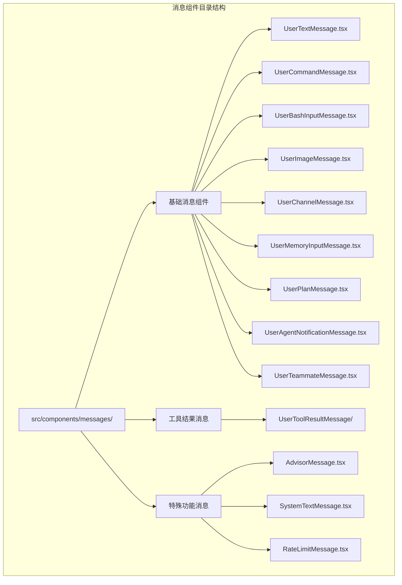

**图表来源**
- [UserTextMessage.tsx:1-275](file://src/components/messages/UserTextMessage.tsx#L1-L275)
- [UserCommandMessage.tsx:1-108](file://src/components/messages/UserCommandMessage.tsx#L1-L108)

**章节来源**
- [UserTextMessage.tsx:1-275](file://src/components/messages/UserTextMessage.tsx#L1-L275)

## 核心组件

用户消息系统的核心是 `UserTextMessage` 组件，它充当消息路由器，根据消息内容的特征将消息分发到相应的专用组件。

### 消息类型识别机制

组件通过多种识别机制来确定消息类型：

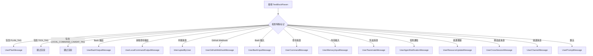

**图表来源**
- [UserTextMessage.tsx:29-275](file://src/components/messages/UserTextMessage.tsx#L29-L275)

### 渲染优化策略

组件采用了多种优化技术来提高渲染性能：

1. **记忆化缓存**：使用 React 编译器的 `_c` 函数进行状态缓存
2. **条件渲染**：避免不必要的组件重新创建
3. **按需加载**：对大型或不常用的消息类型使用动态导入

**章节来源**
- [UserTextMessage.tsx:29-275](file://src/components/messages/UserTextMessage.tsx#L29-L275)

## 架构概览

用户消息系统的整体架构采用分层设计：

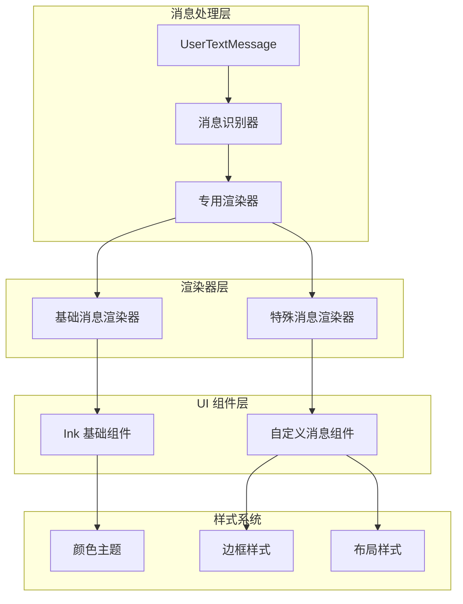

**图表来源**
- [UserTextMessage.tsx:1-275](file://src/components/messages/UserTextMessage.tsx#L1-L275)

### 组件交互流程

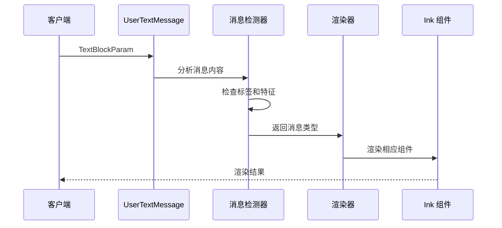

**图表来源**
- [UserTextMessage.tsx:29-275](file://src/components/messages/UserTextMessage.tsx#L29-L275)

## 详细组件分析

### 文本消息组件 (UserTextMessage)

这是最复杂的组件，负责处理所有类型的用户文本消息。它实现了智能路由功能，根据消息内容自动选择合适的渲染组件。

#### 主要特性

1. **多标签支持**：支持多种 XML 标签来标识不同类型的命令
2. **条件渲染**：根据环境变量和功能标志动态启用特定消息类型
3. **性能优化**：使用记忆化缓存减少不必要的重新渲染

#### 渲染逻辑

组件的渲染逻辑遵循以下优先级：

1. 计划内容优先级最高
2. 特殊标记过滤（如 TICK 标记）
3. Bash 输出和输入消息
4. GitHub Webhook 消息
5. 命令消息
6. 内存输入消息
7. 队友消息
8. 任务通知
9. 默认提示消息

**章节来源**
- [UserTextMessage.tsx:29-275](file://src/components/messages/UserTextMessage.tsx#L29-L275)

### 命令消息组件 (UserCommandMessage)

专门用于渲染用户执行的命令消息，支持两种格式：

#### 技能格式
- 显示为 `Skill(命令名)` 的格式
- 使用特殊图标和颜色主题

#### 普通格式  
- 显示为 `/命令 参数` 的格式
- 支持命令参数的提取和格式化

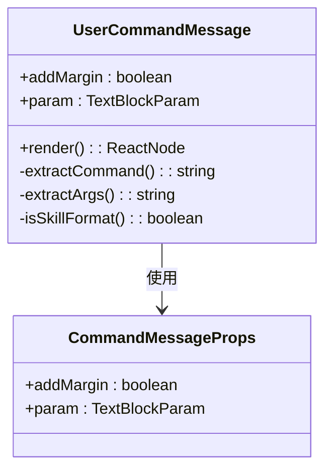

**图表来源**
- [UserCommandMessage.tsx:8-108](file://src/components/messages/UserCommandMessage.tsx#L8-L108)

**章节来源**
- [UserCommandMessage.tsx:1-108](file://src/components/messages/UserCommandMessage.tsx#L1-L108)

### Bash 输入消息组件 (UserBashInputMessage)

用于渲染用户输入的 Bash 命令，具有以下特点：

- 使用特殊的 `!` 图标标识
- 应用 Bash 特定的颜色主题
- 支持边框样式和内边距设置

#### 渲染特性

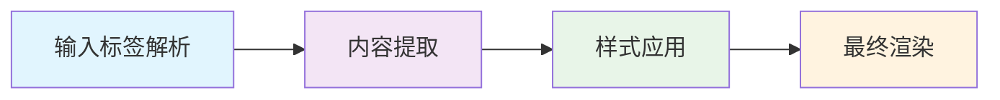

**图表来源**
- [UserBashInputMessage.tsx:10-58](file://src/components/messages/UserBashInputMessage.tsx#L10-L58)

**章节来源**
- [UserBashInputMessage.tsx:1-58](file://src/components/messages/UserBashInputMessage.tsx#L1-L58)

### 图像消息组件 (UserImageMessage)

处理用户上传的图像消息，提供以下功能：

- 支持超链接点击（当终端支持时）
- 自动获取存储的图像路径
- 智能的边距处理

#### 图像渲染策略

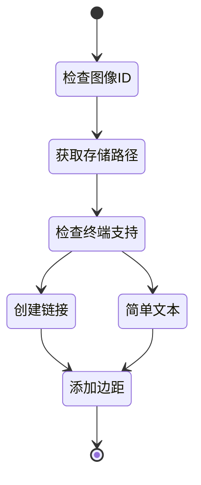

**图表来源**
- [UserImageMessage.tsx:20-59](file://src/components/messages/UserImageMessage.tsx#L20-L59)

**章节来源**
- [UserImageMessage.tsx:1-59](file://src/components/messages/UserImageMessage.tsx#L1-L59)

### 频道消息组件 (UserChannelMessage)

专门处理来自外部频道的消息，支持以下特性：

- 解析 XML 格式的频道消息
- 提取服务器名称并进行格式化
- 支持用户字段显示
- 内容截断和格式化

#### 频道消息解析

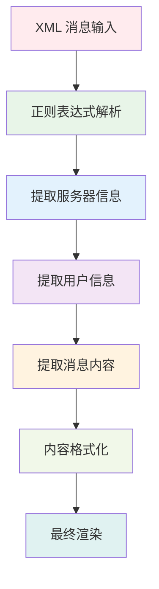

**图表来源**
- [UserChannelMessage.tsx:26-137](file://src/components/messages/UserChannelMessage.tsx#L26-L137)

**章节来源**
- [UserChannelMessage.tsx:1-137](file://src/components/messages/UserChannelMessage.tsx#L1-L137)

### 内存输入消息组件 (UserMemoryInputMessage)

处理用户提供的记忆内容，具有以下特点：

- 自动保存确认消息
- 特殊的记忆符号 `#`
- 内存背景色主题
- 连续的消息响应

#### 内存处理流程

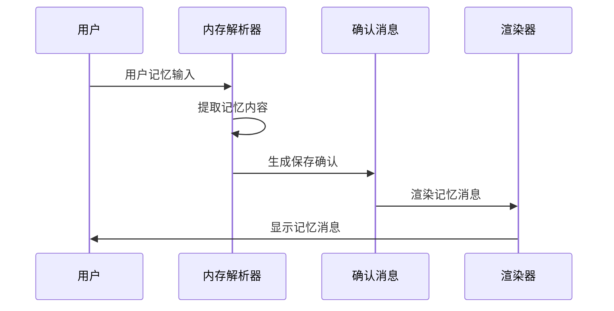

**图表来源**
- [UserMemoryInputMessage.tsx:15-75](file://src/components/messages/UserMemoryInputMessage.tsx#L15-L75)

**章节来源**
- [UserMemoryInputMessage.tsx:1-75](file://src/components/messages/UserMemoryInputMessage.tsx#L1-L75)

### 计划消息组件 (UserPlanMessage)

专门用于渲染用户计划内容，具有以下特性：

- 圆角边框样式
- 专门的计划模式颜色主题
- Markdown 格式支持
- 标题和内容分离显示

#### 计划渲染结构

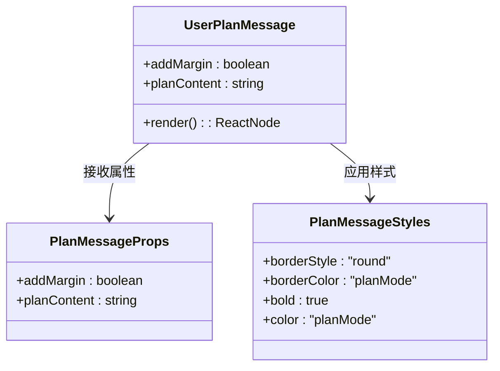

**图表来源**
- [UserPlanMessage.tsx:9-42](file://src/components/messages/UserPlanMessage.tsx#L9-L42)

**章节来源**
- [UserPlanMessage.tsx:1-42](file://src/components/messages/UserPlanMessage.tsx#L1-L42)

### 代理通知消息组件 (UserAgentNotificationMessage)

处理代理执行状态的通知消息，支持以下状态：

- 成功：绿色显示
- 失败：红色显示  
- 中止：黄色显示
- 默认：普通文本颜色

#### 状态处理逻辑

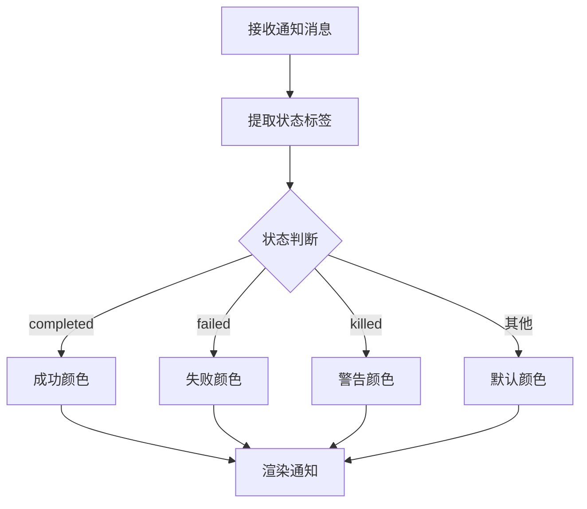

**图表来源**
- [UserAgentNotificationMessage.tsx:23-83](file://src/components/messages/UserAgentNotificationMessage.tsx#L23-L83)

**章节来源**
- [UserAgentNotificationMessage.tsx:1-83](file://src/components/messages/UserAgentNotificationMessage.tsx#L1-L83)

### 队友消息组件 (UserTeammateMessage)

处理团队成员之间的消息，支持多种消息类型：

#### 支持的消息类型

1. **计划审批消息**：处理计划请求和响应
2. **关闭消息**：处理代理关闭请求
3. **任务分配消息**：处理任务分配通知
4. **JSON 结构化消息**：处理结构化数据
5. **空闲通知**：静默处理的空闲状态通知
6. **任务完成通知**：显示已完成的任务信息

#### 队友消息解析

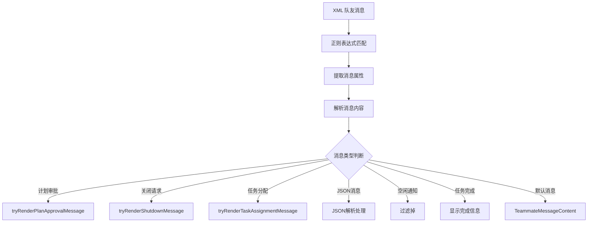

**图表来源**
- [UserTeammateMessage.tsx:55-206](file://src/components/messages/UserTeammateMessage.tsx#L55-L206)

**章节来源**
- [UserTeammateMessage.tsx:1-206](file://src/components/messages/UserTeammateMessage.tsx#L1-L206)

## 依赖关系分析

用户消息组件之间存在复杂的依赖关系：

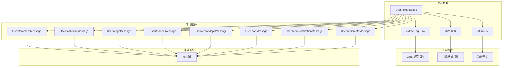

**图表来源**
- [UserTextMessage.tsx:1-275](file://src/components/messages/UserTextMessage.tsx#L1-L275)

### 组件耦合度分析

- **低耦合**：各组件相对独立，通过统一的接口进行通信
- **高内聚**：每个组件专注于特定的消息类型处理
- **可扩展性**：新的消息类型可以通过添加新组件轻松集成

**章节来源**
- [UserTextMessage.tsx:1-275](file://src/components/messages/UserTextMessage.tsx#L1-L275)

## 性能考虑

### 渲染优化策略

1. **记忆化缓存**：使用 React 编译器的缓存机制减少重复渲染
2. **条件渲染**：避免不必要的组件创建和销毁
3. **按需加载**：对大型组件使用动态导入延迟加载
4. **状态最小化**：只在必要时更新组件状态

### 内存管理

- 合理使用缓存键值
- 及时清理不需要的状态
- 避免内存泄漏

### 渲染性能指标

- **首屏渲染时间**：优化初始消息渲染速度
- **增量更新**：支持部分更新而非全量重渲染
- **批量处理**：支持多个消息的批量渲染

## 故障排除指南

### 常见问题及解决方案

#### 消息未正确渲染

**症状**：某些消息类型没有显示或显示异常

**可能原因**：
1. XML 标签格式不正确
2. 功能标志未启用
3. 消息内容为空或格式错误

**解决步骤**：
1. 检查消息内容是否包含正确的 XML 标签
2. 验证相关功能标志的状态
3. 确认消息内容格式符合预期

#### 渲染性能问题

**症状**：消息渲染缓慢或卡顿

**可能原因**：
1. 缓存未正确配置
2. 组件树过于复杂
3. 大量消息同时渲染

**优化建议**：
1. 检查记忆化缓存的使用
2. 考虑分批渲染大量消息
3. 优化组件结构

#### 样式显示异常

**症状**：消息样式不符合预期

**可能原因**：
1. 主题配置错误
2. 样式覆盖冲突
3. 终端兼容性问题

**解决方法**：
1. 检查主题配置文件
2. 验证样式优先级
3. 测试不同终端的兼容性

**章节来源**
- [UserTextMessage.tsx:39-52](file://src/components/messages/UserTextMessage.tsx#L39-L52)

## 结论

用户消息组件系统展现了优秀的软件架构设计，具有以下特点：

1. **模块化设计**：每个消息类型都有独立的组件，便于维护和扩展
2. **智能路由**：通过标签识别机制自动分发消息到相应组件
3. **性能优化**：采用多种优化技术确保高效的渲染性能
4. **可扩展性**：支持新消息类型的轻松集成
5. **用户体验**：提供丰富的消息类型和良好的视觉效果

该系统为 Claude 平台提供了强大而灵活的消息处理能力，能够满足各种复杂的用户交互需求。通过合理的架构设计和优化策略，确保了系统的高性能和高可用性。