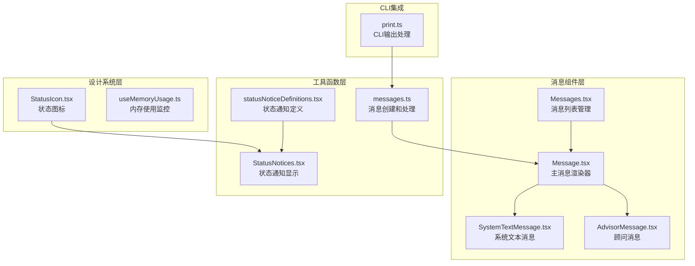
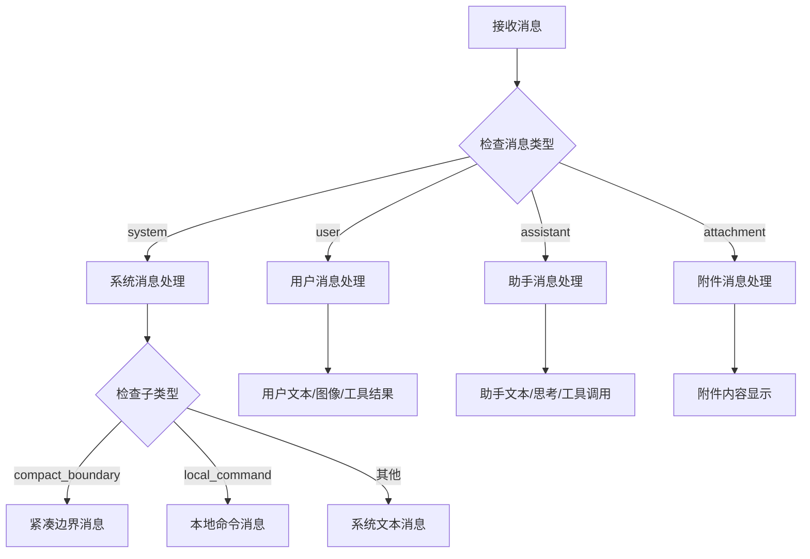
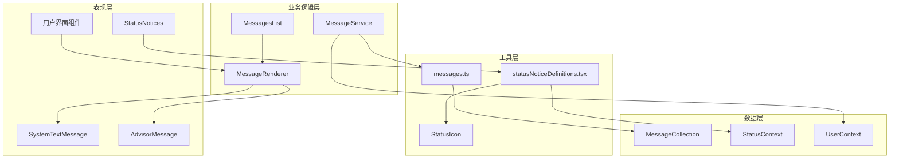
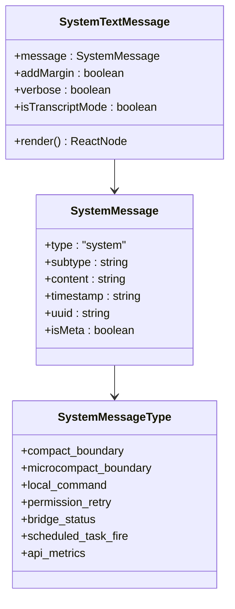
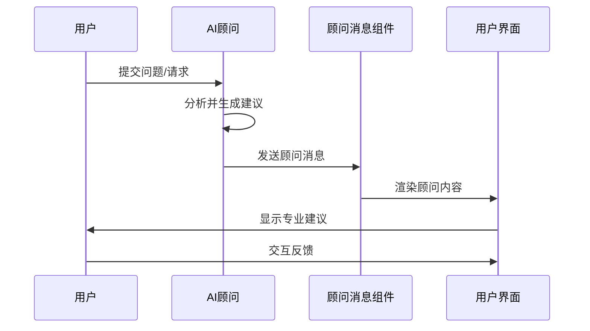
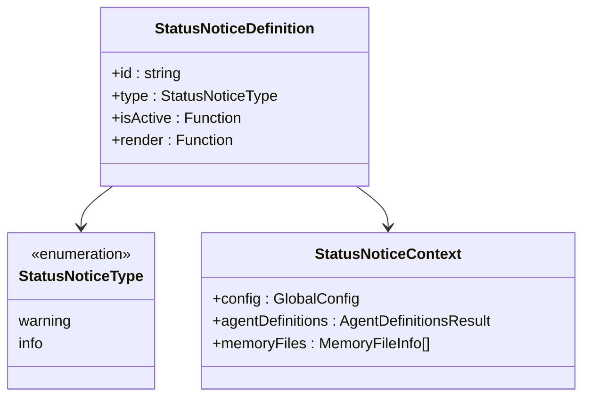
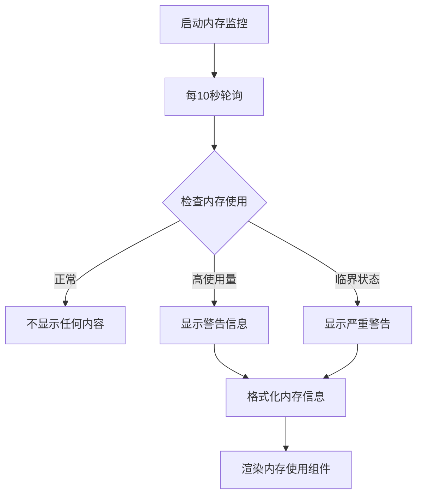
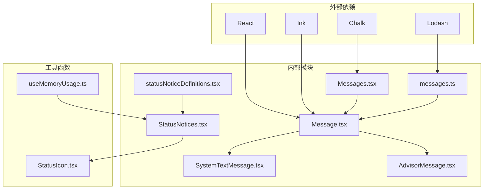

# 系统消息组件

<cite>
**本文档引用的文件**
- [src/components/Message.tsx](file://src/components/Message.tsx)
- [src/components/Messages.tsx](file://src/components/Messages.tsx)
- [src/utils/messages.ts](file://src/utils/messages.ts)
- [src/utils/statusNoticeDefinitions.tsx](file://src/utils/statusNoticeDefinitions.tsx)
- [src/components/StatusNotices.tsx](file://src/components/StatusNotices.tsx)
- [src/components/messages/SystemTextMessage.tsx](file://src/components/messages/SystemTextMessage.tsx)
- [src/components/messages/AdvisorMessage.tsx](file://src/components/messages/AdvisorMessage.tsx)
- [src/components/design-system/StatusIcon.tsx](file://src/components/design-system/StatusIcon.tsx)
- [src/hooks/useMemoryUsage.ts](file://src/hooks/useMemoryUsage.ts)
- [src/cli/print.ts](file://src/cli/print.ts)
</cite>

## 目录
1. [简介](#简介)
2. [项目结构](#项目结构)
3. [核心组件](#核心组件)
4. [架构概览](#架构概览)
5. [详细组件分析](#详细组件分析)
6. [依赖关系分析](#依赖关系分析)
7. [性能考虑](#性能考虑)
8. [故障排除指南](#故障排除指南)
9. [结论](#结论)

## 简介

系统消息组件是 Claude Code 智能编码 CLI 的核心组成部分，负责处理和显示各种系统生成的消息内容。这些消息包括系统文本消息、API 错误消息、速率限制消息、关闭消息、顾问消息、钩子进度消息、任务分配消息、计划审批消息等。

系统消息在用户界面中扮演着至关重要的角色，它们为用户提供关键的系统状态信息、操作反馈和环境提示。通过精心设计的显示策略和用户体验考虑，系统消息帮助用户更好地理解系统的运行状态和可用功能。

## 项目结构

系统消息组件主要分布在以下目录结构中：

**图表来源**
- [src/components/Message.tsx:1-627](file://src/components/Message.tsx#L1-627)
- [src/components/Messages.tsx:1-834](file://src/components/Messages.tsx#L1-834)
- [src/utils/messages.ts:1-800](file://src/utils/messages.ts#L1-800)

**章节来源**
- [src/components/Message.tsx:1-627](file://src/components/Message.tsx#L1-L627)
- [src/components/Messages.tsx:1-834](file://src/components/Messages.tsx#L1-L834)

## 核心组件

### 主消息渲染器 (Message)

主消息渲染器是系统消息组件的核心，负责根据消息类型选择合适的渲染组件。它支持多种消息类型，包括系统消息、用户消息、助手消息和附件消息。

**图表来源**
- [src/components/Message.tsx:231-318](file://src/components/Message.tsx#L231-L318)

### 消息列表管理器 (Messages)

消息列表管理器负责处理大量消息的渲染优化，包括虚拟滚动、消息截断和性能优化。

**章节来源**
- [src/components/Messages.tsx:341-778](file://src/components/Messages.tsx#L341-L778)

## 架构概览

系统消息组件采用分层架构设计，确保了良好的可维护性和扩展性：

**图表来源**
- [src/components/Message.tsx:58-355](file://src/components/Message.tsx#L58-L355)
- [src/components/Messages.tsx:341-721](file://src/components/Messages.tsx#L341-L721)

## 详细组件分析

### 系统文本消息组件

系统文本消息组件负责显示各种系统生成的文本信息，包括状态更新、操作反馈和系统通知。

#### 组件结构

**图表来源**
- [src/components/messages/SystemTextMessage.tsx](file://src/components/messages/SystemTextMessage.tsx)
- [src/utils/messages.ts:4354-4396](file://src/utils/messages.ts#L4354-L4396)

#### 触发条件和显示逻辑

系统文本消息的触发条件主要包括：

1. **权限重试消息**：当用户权限发生变化时触发
2. **桥接状态消息**：远程控制连接状态变化时显示
3. **计划任务触发**：定时任务执行时的通知
4. **本地命令消息**：用户本地命令执行结果

**章节来源**
- [src/utils/messages.ts:4354-4396](file://src/utils/messages.ts#L4354-L4396)
- [src/components/Message.tsx:281-305](file://src/components/Message.tsx#L281-L305)

### 顾问消息组件

顾问消息组件用于显示 AI 顾问提供的专业建议和指导信息。

#### 设计特点

**图表来源**
- [src/components/messages/AdvisorMessage.tsx](file://src/components/messages/AdvisorMessage.tsx)

#### 显示策略

顾问消息采用专门的视觉设计，突出显示专业建议的重要性和权威性。

**章节来源**
- [src/components/messages/AdvisorMessage.tsx](file://src/components/messages/AdvisorMessage.tsx)

### 状态通知系统

状态通知系统负责显示系统状态信息和环境提示。

#### 状态通知定义

**图表来源**
- [src/utils/statusNoticeDefinitions.tsx:16-28](file://src/utils/statusNoticeDefinitions.tsx#L16-L28)

#### 常见状态通知

1. **大内存文件警告**：当检测到大型内存文件时显示
2. **API 密钥冲突**：当存在多个认证方式时提醒
3. **代理插件安装**：JetBrains IDE 插件安装提示
4. **性能警告**：系统性能相关的重要信息

**章节来源**
- [src/utils/statusNoticeDefinitions.tsx:30-198](file://src/utils/statusNoticeDefinitions.tsx#L30-L198)

### 内存使用监控

内存使用监控组件提供实时的内存使用情况反馈。

#### 监控机制

**图表来源**
- [src/hooks/useMemoryUsage.ts:18-39](file://src/hooks/useMemoryUsage.ts#L18-L39)

**章节来源**
- [src/hooks/useMemoryUsage.ts:1-39](file://src/hooks/useMemoryUsage.ts#L1-L39)

## 依赖关系分析

系统消息组件之间的依赖关系如下：

**图表来源**
- [src/components/Message.tsx:1-11](file://src/components/Message.tsx#L1-L11)
- [src/components/Messages.tsx:1-34](file://src/components/Messages.tsx#L1-L34)

**章节来源**
- [src/components/Message.tsx:1-627](file://src/components/Message.tsx#L1-L627)
- [src/components/Messages.tsx:1-834](file://src/components/Messages.tsx#L1-L834)

## 性能考虑

系统消息组件在设计时充分考虑了性能优化：

### 虚拟滚动优化

对于大量消息的场景，系统采用虚拟滚动技术，只渲染可见区域的消息，大大减少了内存占用和渲染时间。

### 消息缓存机制

- **React.memo 缓存**：对消息组件进行记忆化处理，避免不必要的重新渲染
- **消息查找缓存**：对消息查找和映射进行缓存，提高查询效率
- **文本搜索缓存**：对搜索文本进行缓存，减少重复计算

### 渲染优化策略

1. **按需渲染**：只在必要时渲染特定类型的消息
2. **批量更新**：合并多个状态更新，减少渲染次数
3. **懒加载**：对重型组件采用懒加载策略

## 故障排除指南

### 常见问题及解决方案

#### 消息显示异常

**问题描述**：某些系统消息无法正确显示或显示格式错误

**可能原因**：
1. 消息类型识别失败
2. 渲染组件未正确导入
3. 消息数据结构不符合预期

**解决步骤**：
1. 检查消息类型是否正确设置
2. 验证渲染组件的导入路径
3. 确认消息数据结构的完整性

#### 性能问题

**问题描述**：大量消息导致界面卡顿或内存占用过高

**解决方案**：
1. 启用虚拟滚动功能
2. 实施消息截断策略
3. 优化消息渲染逻辑

#### 状态通知不显示

**问题描述**：状态通知组件没有按预期显示

**排查步骤**：
1. 检查状态通知定义是否正确
2. 验证状态上下文数据
3. 确认渲染条件判断逻辑

**章节来源**
- [src/components/Messages.tsx:278-340](file://src/components/Messages.tsx#L278-L340)

## 结论

系统消息组件通过精心设计的架构和实现，为 Claude Code 提供了强大而灵活的消息处理能力。组件系统具有以下优势：

1. **模块化设计**：清晰的组件层次结构，便于维护和扩展
2. **性能优化**：采用虚拟滚动、缓存和按需渲染等优化策略
3. **用户体验**：提供直观的视觉反馈和及时的状态更新
4. **可配置性**：支持多种显示策略和自定义选项

通过合理使用这些组件，开发者可以构建出更加友好和高效的系统消息显示功能，提升整体用户体验。