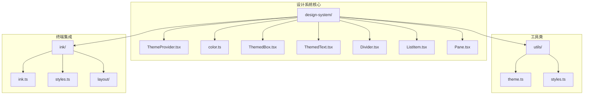
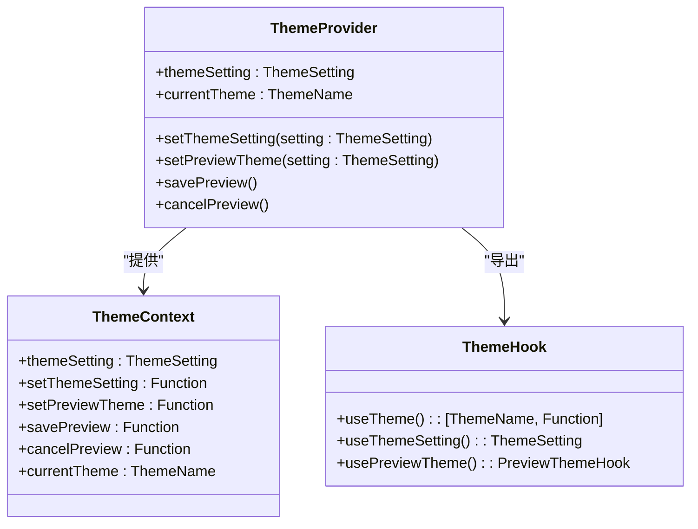
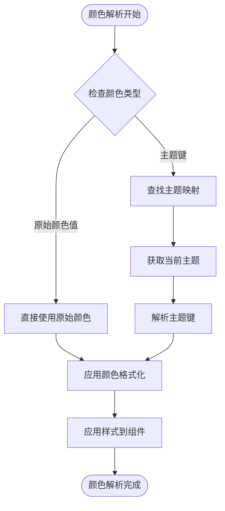
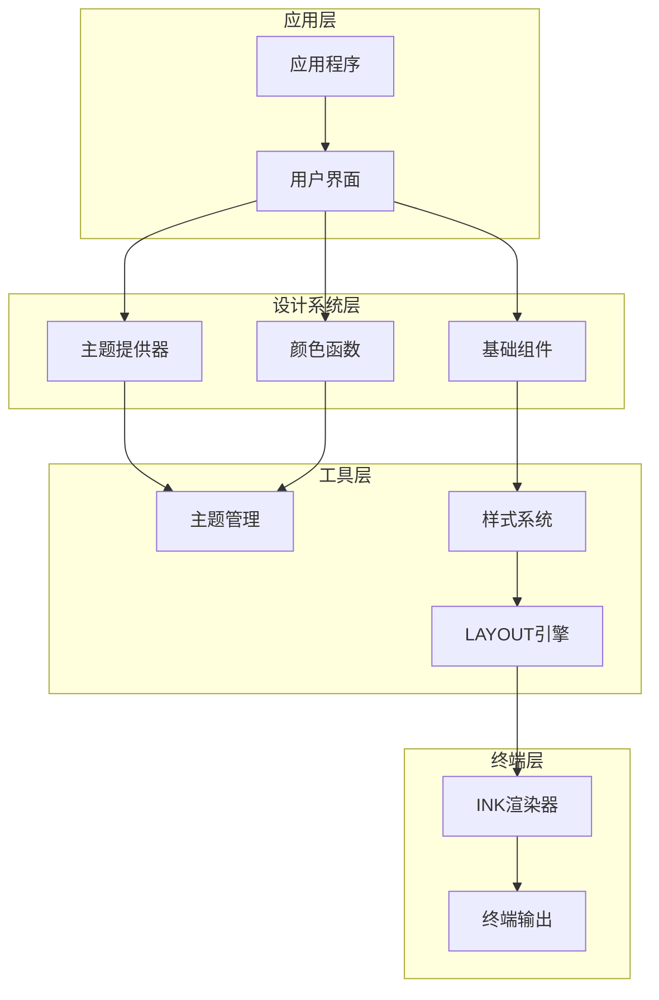
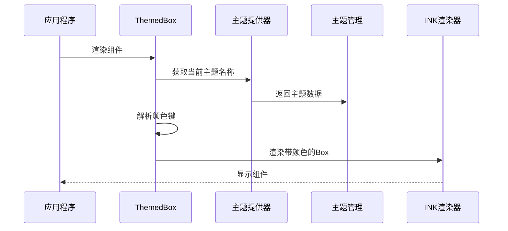
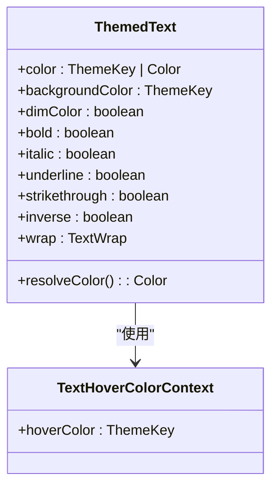
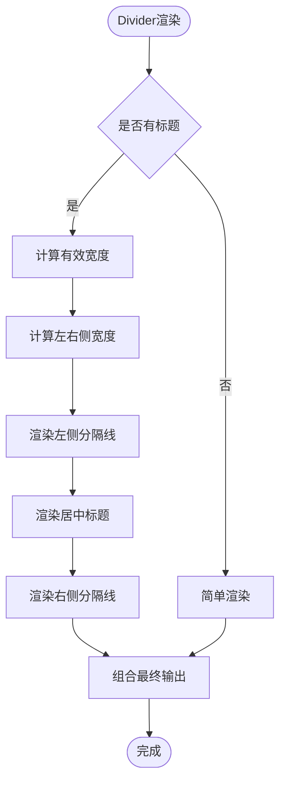
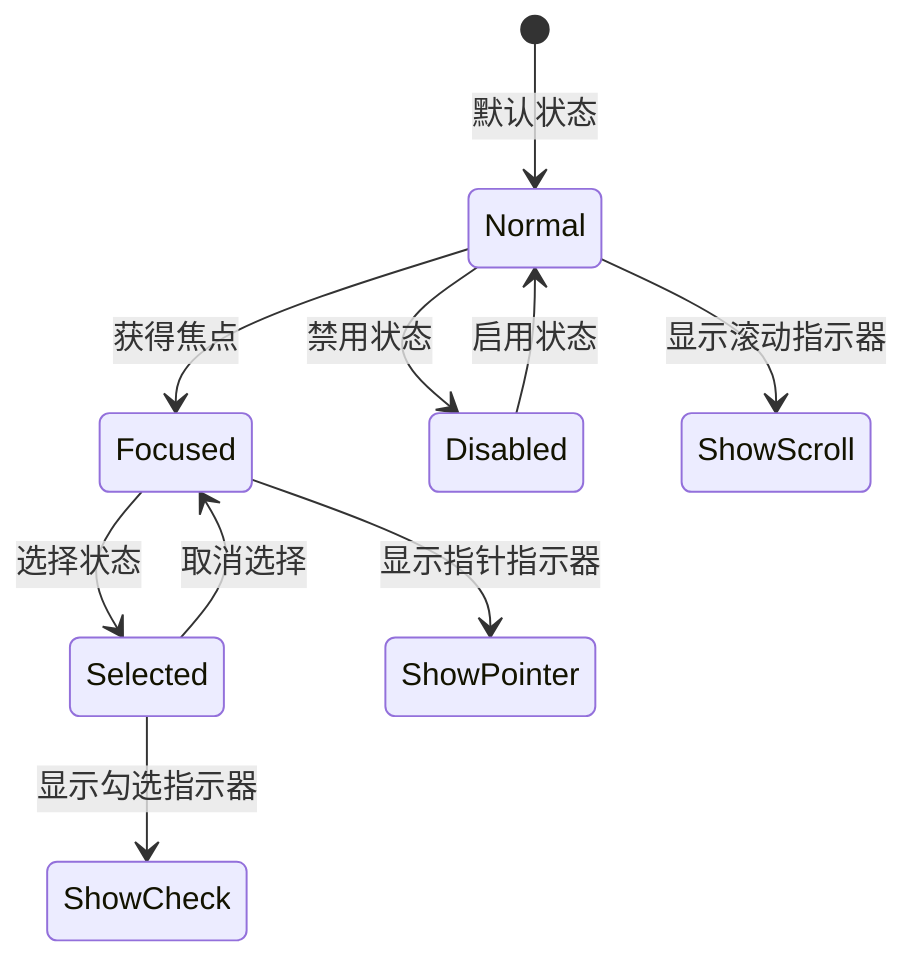
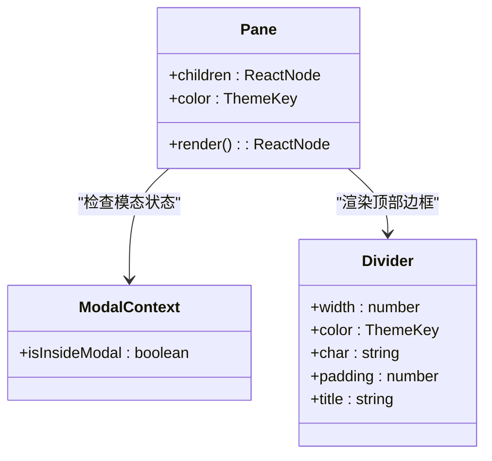
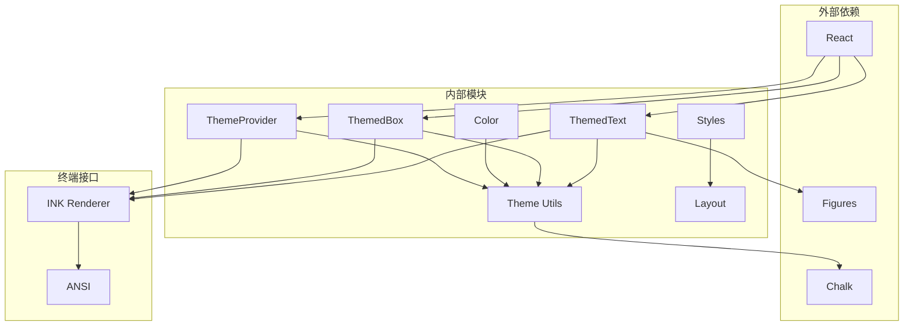

# 设计系统

<cite>
**本文档引用的文件**
- [src/components/design-system/ThemeProvider.tsx](file://src/components/design-system/ThemeProvider.tsx)
- [src/components/design-system/color.ts](file://src/components/design-system/color.ts)
- [src/components/design-system/ThemedBox.tsx](file://src/components/design-system/ThemedBox.tsx)
- [src/components/design-system/ThemedText.tsx](file://src/components/design-system/ThemedText.tsx)
- [src/utils/theme.ts](file://src/utils/theme.ts)
- [src/ink.ts](file://src/ink.ts)
- [src/components/design-system/Divider.tsx](file://src/components/design-system/Divider.tsx)
- [src/components/design-system/ListItem.tsx](file://src/components/design-system/ListItem.tsx)
- [src/components/design-system/Pane.tsx](file://src/components/design-system/Pane.tsx)
- [src/ink/styles.ts](file://src/ink/styles.ts)
- [src/ink/layout/node.ts](file://src/ink/layout/node.ts)
- [src/native-ts/color-diff/index.ts](file://src/native-ts/color-diff/index.ts)
</cite>

## 目录
1. [简介](#简介)
2. [项目结构](#项目结构)
3. [核心组件](#核心组件)
4. [架构概览](#架构概览)
5. [详细组件分析](#详细组件分析)
6. [依赖关系分析](#依赖关系分析)
7. [性能考虑](#性能考虑)
8. [故障排除指南](#故障排除指南)
9. [结论](#结论)
10. [附录](#附录)

## 简介

Claude Code 设计系统是一个完整的终端用户界面设计框架，专为命令行环境优化。该系统提供了统一的颜色管理、主题切换机制、基础组件库和一致的视觉语言，确保在各种终端环境中提供优秀的用户体验。

设计系统的核心目标是：
- 提供一致的视觉体验和交互模式
- 支持多种主题和颜色方案
- 确保可访问性和色彩对比度
- 提供灵活的组件扩展能力
- 优化终端渲染性能

## 项目结构

设计系统采用模块化架构，主要组件分布在以下目录：

**图表来源**
- [src/components/design-system/ThemeProvider.tsx:1-170](file://src/components/design-system/ThemeProvider.tsx#L1-L170)
- [src/utils/theme.ts:1-640](file://src/utils/theme.ts#L1-L640)

**章节来源**
- [src/components/design-system/ThemeProvider.tsx:1-170](file://src/components/design-system/ThemeProvider.tsx#L1-L170)
- [src/utils/theme.ts:1-640](file://src/utils/theme.ts#L1-L640)

## 核心组件

### 主题提供器（ThemeProvider）

主题提供器是设计系统的核心组件，负责管理全局主题状态和提供主题切换功能：

**图表来源**
- [src/components/design-system/ThemeProvider.tsx:8-28](file://src/components/design-system/ThemeProvider.tsx#L8-L28)
- [src/components/design-system/ThemeProvider.tsx:122-138](file://src/components/design-system/ThemeProvider.tsx#L122-L138)

### 颜色系统

设计系统提供了多层次的颜色抽象和解析机制：

**图表来源**
- [src/components/design-system/color.ts:9-30](file://src/components/design-system/color.ts#L9-L30)
- [src/components/design-system/ThemedText.tsx:66-74](file://src/components/design-system/ThemedText.tsx#L66-L74)

**章节来源**
- [src/components/design-system/ThemeProvider.tsx:43-116](file://src/components/design-system/ThemeProvider.tsx#L43-L116)
- [src/components/design-system/color.ts:1-31](file://src/components/design-system/color.ts#L1-L31)
- [src/components/design-system/ThemedText.tsx:66-123](file://src/components/design-system/ThemedText.tsx#L66-L123)

## 架构概览

设计系统采用分层架构，确保组件间的松耦合和高内聚：

**图表来源**
- [src/ink.ts:33-43](file://src/ink.ts#L33-L43)
- [src/utils/theme.ts:4-89](file://src/utils/theme.ts#L4-L89)

## 详细组件分析

### ThemedBox 组件

ThemedBox 是一个主题感知的 Box 组件，自动解析主题颜色并应用到边框和背景：

**图表来源**
- [src/components/design-system/ThemedBox.tsx:56-155](file://src/components/design-system/ThemedBox.tsx#L56-L155)

### ThemedText 组件

ThemedText 提供了丰富的文本样式支持，包括颜色、背景色、粗体、斜体等：

**图表来源**
- [src/components/design-system/ThemedText.tsx:12-61](file://src/components/design-system/ThemedText.tsx#L12-L61)
- [src/components/design-system/ThemedText.tsx:101-123](file://src/components/design-system/ThemedText.tsx#L101-L123)

**章节来源**
- [src/components/design-system/ThemedBox.tsx:1-156](file://src/components/design-system/ThemedBox.tsx#L1-L156)
- [src/components/design-system/ThemedText.tsx:1-124](file://src/components/design-system/ThemedText.tsx#L1-L124)

### Divider 组件

Divider 组件提供了灵活的分隔线功能，支持标题、颜色和宽度自定义：

**图表来源**
- [src/components/design-system/Divider.tsx:66-149](file://src/components/design-system/Divider.tsx#L66-L149)

**章节来源**
- [src/components/design-system/Divider.tsx:1-149](file://src/components/design-system/Divider.tsx#L1-L149)

### ListItem 组件

ListItem 组件处理列表项的选择状态和指示器显示：

**图表来源**
- [src/components/design-system/ListItem.tsx:104-244](file://src/components/design-system/ListItem.tsx#L104-L244)

**章节来源**
- [src/components/design-system/ListItem.tsx:1-244](file://src/components/design-system/ListItem.tsx#L1-L244)

### Pane 组件

Pane 组件提供了一个带有彩色顶部边框的内容面板：

**图表来源**
- [src/components/design-system/Pane.tsx:33-77](file://src/components/design-system/Pane.tsx#L33-L77)

**章节来源**
- [src/components/design-system/Pane.tsx:1-77](file://src/components/design-system/Pane.tsx#L1-L77)

## 依赖关系分析

设计系统内部的依赖关系展现了清晰的层次结构：

**图表来源**
- [src/components/design-system/ThemeProvider.tsx:1-8](file://src/components/design-system/ThemeProvider.tsx#L1-L8)
- [src/utils/theme.ts:1-3](file://src/utils/theme.ts#L1-L3)

**章节来源**
- [src/ink.ts:33-43](file://src/ink.ts#L33-L43)
- [src/components/design-system/ThemeProvider.tsx:1-8](file://src/components/design-system/ThemeProvider.tsx#L1-L8)

## 性能考虑

设计系统在性能方面采用了多项优化策略：

### 渲染优化
- 使用 React 编译器运行时优化
- 实现了智能的重新渲染控制
- 避免不必要的组件重渲染

### 主题切换优化
- 支持实时主题预览功能
- 自动检测系统主题变化
- 智能缓存机制减少重复计算

### 颜色解析优化
- 原始颜色值直接传递，避免额外解析
- 主题键缓存机制
- 批量颜色应用优化

## 故障排除指南

### 常见问题及解决方案

**主题不生效**
- 检查 ThemeProvider 是否正确包装应用
- 验证主题设置是否正确保存
- 确认终端支持的颜色模式

**颜色显示异常**
- 检查颜色值格式是否正确
- 验证主题键是否存在
- 确认终端颜色支持情况

**组件渲染问题**
- 检查组件属性传递是否正确
- 验证依赖版本兼容性
- 确认 React 版本要求

**章节来源**
- [src/components/design-system/ThemeProvider.tsx:43-116](file://src/components/design-system/ThemeProvider.tsx#L43-L116)
- [src/utils/theme.ts:598-613](file://src/utils/theme.ts#L598-L613)

## 结论

Claude Code 设计系统通过其精心设计的架构和实现，为终端应用提供了强大而灵活的设计基础设施。系统的主要优势包括：

1. **统一性**：通过主题提供器确保整个应用的一致性
2. **可扩展性**：模块化的组件设计支持功能扩展
3. **可访问性**：内置色盲友好主题和对比度优化
4. **性能**：优化的渲染机制和缓存策略
5. **灵活性**：支持多种主题和自定义选项

该设计系统为开发者提供了一个坚实的基础，可以在此基础上构建复杂的终端应用程序，同时保持良好的用户体验和代码质量。

## 附录

### 设计令牌参考

设计系统定义了丰富的设计令牌，包括：
- 颜色令牌：用于界面元素的标准化颜色
- 间距令牌：用于布局和对齐的一致性
- 字体令牌：用于文本样式的统一管理
- 圆角令牌：用于组件边框和装饰的一致性

### 主题扩展指南

扩展设计系统主题的方法：
1. 在主题配置中添加新的颜色定义
2. 更新主题提供器以支持新主题
3. 在组件中使用新的主题令牌
4. 测试不同终端环境下的显示效果

### 最佳实践

- 始终使用主题令牌而非硬编码颜色值
- 在组件中保持设计的一致性
- 考虑不同终端环境的兼容性
- 定期测试可访问性要求
- 文档化自定义扩展的变更