# PromptInput主输入组件

<cite>
**本文档引用的文件**
- [PromptInput.tsx](file://src/components/PromptInput/PromptInput.tsx)
- [inputModes.ts](file://src/components/PromptInput/inputModes.ts)
- [inputPaste.ts](file://src/components/PromptInput/inputPaste.ts)
- [utils.ts](file://src/components/PromptInput/utils.ts)
- [useMaybeTruncateInput.ts](file://src/components/PromptInput/useMaybeTruncateInput.ts)
- [usePromptInputPlaceholder.ts](file://src/components/PromptInput/usePromptInputPlaceholder.ts)
- [useShowFastIconHint.ts](file://src/components/PromptInput/useShowFastIconHint.ts)
- [useSwarmBanner.ts](file://src/components/PromptInput/useSwarmBanner.ts)
- [ShimmeredInput.tsx](file://src/components/PromptInput/ShimmeredInput.tsx)
- [textInputTypes.ts](file://src/types/textInputTypes.ts)
</cite>

## 目录
1. [简介](#简介)
2. [项目结构](#项目结构)
3. [核心组件](#核心组件)
4. [架构概览](#架构概览)
5. [详细组件分析](#详细组件分析)
6. [依赖关系分析](#依赖关系分析)
7. [性能考虑](#性能考虑)
8. [故障排除指南](#故障排除指南)
9. [结论](#结论)

## 简介

PromptInput主输入组件是Claude Code项目中的核心交互组件，负责处理用户输入、状态管理和事件处理。该组件提供了丰富的输入模式支持，包括普通输入、快速输入、计划模式等，并集成了智能验证规则、自动完成功能和粘贴处理机制。

该组件采用现代化的React Hooks架构，通过状态管理、事件处理和数据绑定实现了高度可定制的输入体验。组件支持多种编辑模式，包括标准文本输入和Vim模式，同时集成了团队协作、权限管理和智能提示等功能。

## 项目结构

PromptInput组件位于`src/components/PromptInput/`目录下，包含多个子模块和辅助文件：

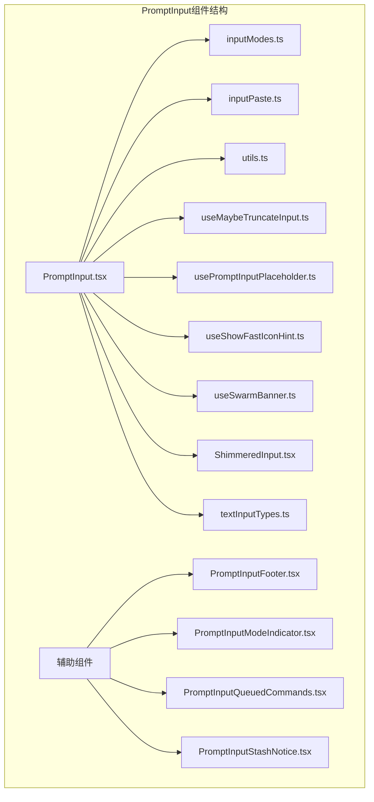

**图表来源**
- [PromptInput.tsx:194-2339](file://src/components/PromptInput/PromptInput.tsx#L194-L2339)
- [inputModes.ts:1-34](file://src/components/PromptInput/inputModes.ts#L1-L34)
- [inputPaste.ts:1-91](file://src/components/PromptInput/inputPaste.ts#L1-L91)

**章节来源**
- [PromptInput.tsx:1-2339](file://src/components/PromptInput/PromptInput.tsx#L1-L2339)

## 核心组件

### 主要功能特性

PromptInput组件提供了以下核心功能：

1. **多模式输入支持**
   - 普通文本输入模式
   - Bash命令模式
   - 快速模式（Fast Mode）
   - 计划模式（Plan Mode）

2. **智能状态管理**
   - 输入值跟踪和同步
   - 光标位置管理
   - 历史记录导航
   - 粘贴内容管理

3. **高级事件处理**
   - 键盘快捷键支持
   - 鼠标点击定位
   - 模态对话框集成
   - 自动完成系统

4. **数据绑定机制**
   - 双向数据绑定
   - 状态持久化
   - 实时更新反馈

**章节来源**
- [PromptInput.tsx:124-189](file://src/components/PromptInput/PromptInput.tsx#L124-L189)
- [textInputTypes.ts:265-274](file://src/types/textInputTypes.ts#L265-L274)

### 组件架构设计

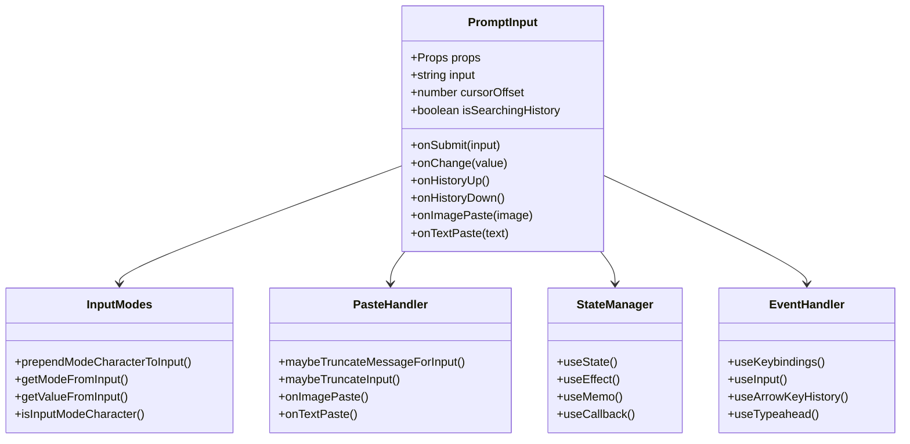

**图表来源**
- [PromptInput.tsx:194-2339](file://src/components/PromptInput/PromptInput.tsx#L194-L2339)
- [inputModes.ts:4-33](file://src/components/PromptInput/inputModes.ts#L4-L33)
- [inputPaste.ts:20-90](file://src/components/PromptInput/inputPaste.ts#L20-L90)

## 架构概览

### 整体架构设计

PromptInput组件采用了分层架构设计，将不同的功能职责分离到专门的模块中：

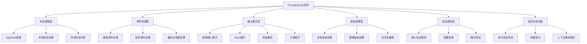

**图表来源**
- [PromptInput.tsx:194-2339](file://src/components/PromptInput/PromptInput.tsx#L194-L2339)
- [useMaybeTruncateInput.ts:13-58](file://src/components/PromptInput/useMaybeTruncateInput.ts#L13-L58)

### 数据流架构

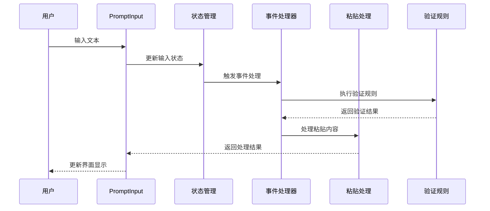

**图表来源**
- [PromptInput.tsx:854-901](file://src/components/PromptInput/PromptInput.tsx#L854-L901)
- [inputPaste.ts:1200-1240](file://src/components/PromptInput/inputPaste.ts#L1200-L1240)

## 详细组件分析

### 输入模式管理系统

#### 模式定义和转换

PromptInput组件支持多种输入模式，每种模式都有特定的功能和行为：

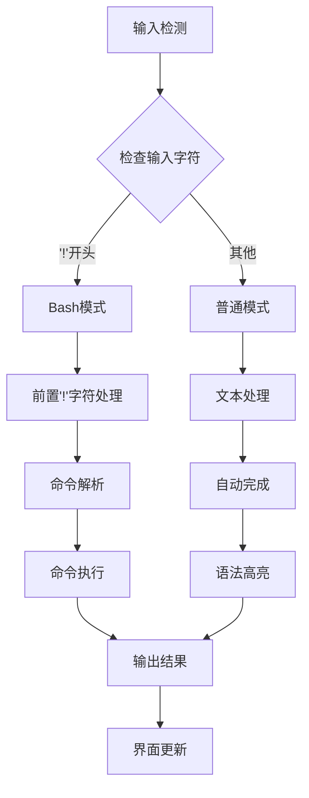

**图表来源**
- [inputModes.ts:4-33](file://src/components/PromptInput/inputModes.ts#L4-L33)

#### 模式切换机制

组件实现了智能的模式切换机制，能够根据用户输入动态调整输入模式：

**章节来源**
- [inputModes.ts:16-33](file://src/components/PromptInput/inputModes.ts#L16-L33)

### 粘贴处理系统

#### 文本粘贴处理

粘贴处理系统能够智能识别和处理不同类型的内容：

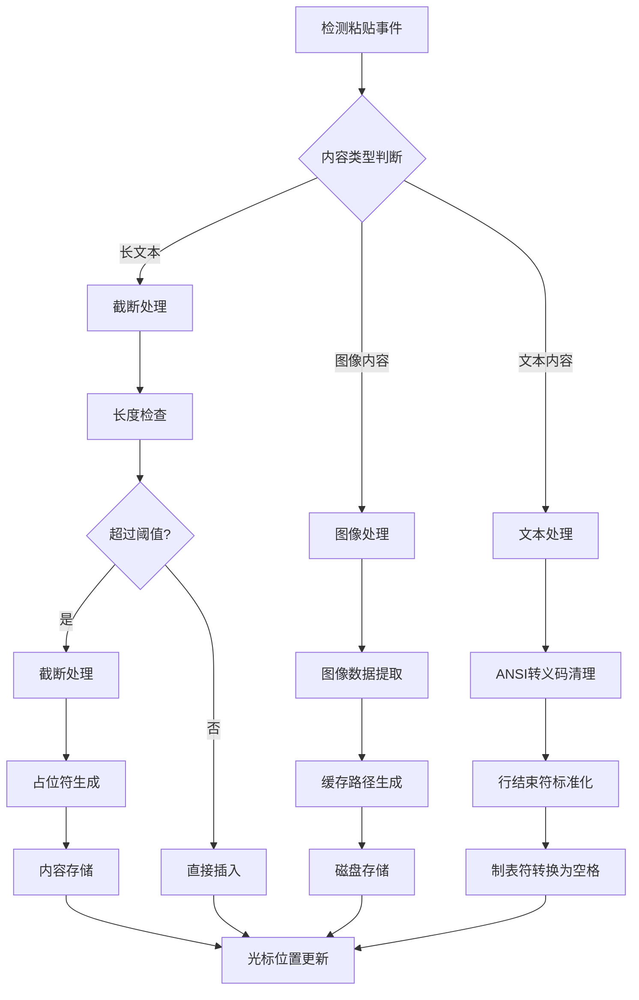

**图表来源**
- [inputPaste.ts:12-90](file://src/components/PromptInput/inputPaste.ts#L12-L90)

#### 图像粘贴处理

图像粘贴功能提供了完整的图像处理流程：

**章节来源**
- [inputPaste.ts:1200-1240](file://src/components/PromptInput/inputPaste.ts#L1200-L1240)

### 状态管理机制

#### 输入状态跟踪

组件实现了全面的状态管理机制，确保输入状态的一致性和完整性：

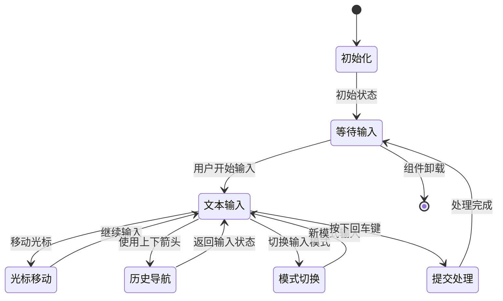

**图表来源**
- [PromptInput.tsx:252-285](file://src/components/PromptInput/PromptInput.tsx#L252-L285)

#### 状态同步机制

组件通过多种机制确保状态的实时同步：

**章节来源**
- [PromptInput.tsx:286-327](file://src/components/PromptInput/PromptInput.tsx#L286-L327)

### 事件处理系统

#### 键盘事件处理

组件提供了完整的键盘事件处理系统：

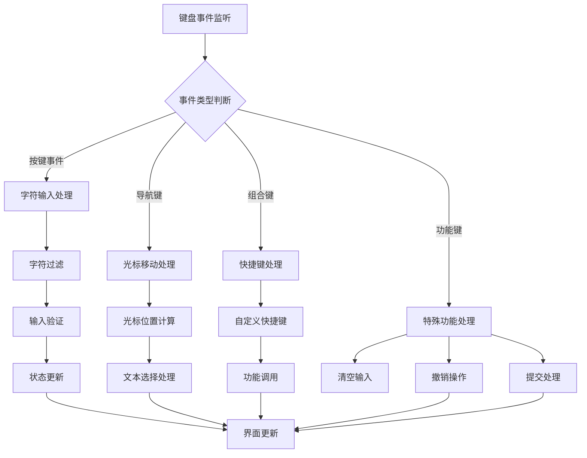

**图表来源**
- [PromptInput.tsx:1865-1961](file://src/components/PromptInput/PromptInput.tsx#L1865-L1961)

#### 鼠标事件处理

鼠标事件处理提供了直观的交互方式：

**章节来源**
- [PromptInput.tsx:2000-2012](file://src/components/PromptInput/PromptInput.tsx#L2000-L2012)

### 验证规则系统

#### 输入验证机制

组件实现了多层次的输入验证机制：

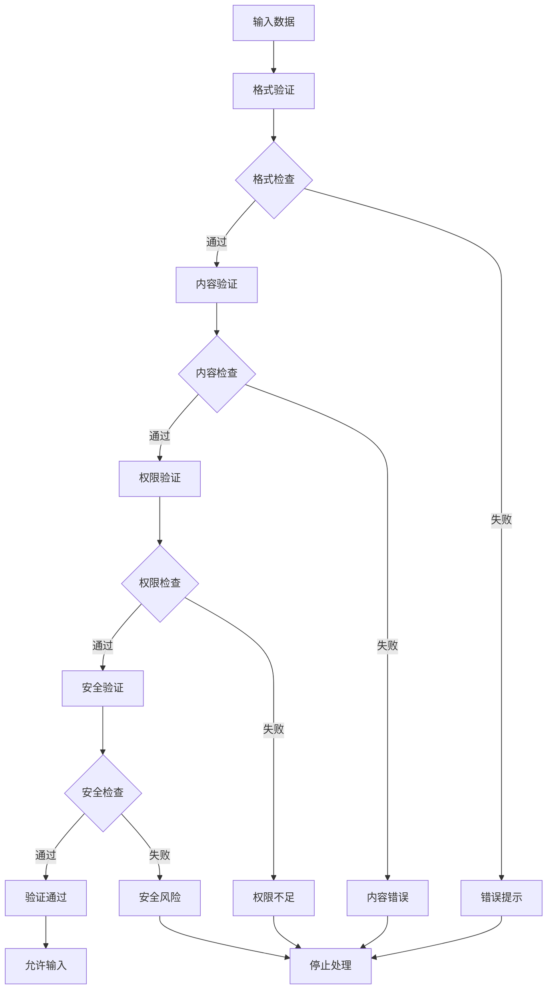

**图表来源**
- [PromptInput.tsx:1007-1077](file://src/components/PromptInput/PromptInput.tsx#L1007-L1077)

#### 权限检查机制

权限检查确保了输入的安全性：

**章节来源**
- [PromptInput.tsx:1409-1556](file://src/components/PromptInput/PromptInput.tsx#L1409-L1556)

### 自动完成功能

#### 命令自动完成

自动完成功能提供了智能的命令补全：

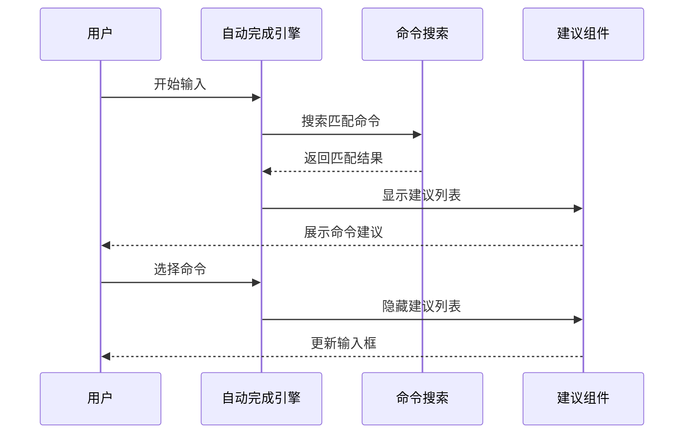

**图表来源**
- [PromptInput.tsx:1112-1126](file://src/components/PromptInput/PromptInput.tsx#L1112-L1126)

#### 参数提示系统

参数提示提供了详细的参数信息：

**章节来源**
- [PromptInput.tsx:1107-1126](file://src/components/PromptInput/PromptInput.tsx#L1107-L1126)

## 依赖关系分析

### 组件间依赖关系

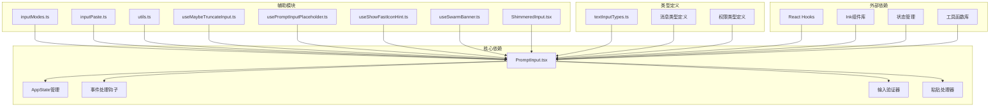

**图表来源**
- [PromptInput.tsx:1-100](file://src/components/PromptInput/PromptInput.tsx#L1-L100)
- [textInputTypes.ts:1-50](file://src/types/textInputTypes.ts#L1-L50)

### 数据流依赖

组件的数据流依赖关系如下：

**章节来源**
- [PromptInput.tsx:1-200](file://src/components/PromptInput/PromptInput.tsx#L1-L200)

## 性能考虑

### 性能优化策略

PromptInput组件采用了多种性能优化策略：

1. **状态最小化更新**
   - 使用`useMemo`和`useCallback`避免不必要的重渲染
   - 实现状态缓存机制减少重复计算

2. **事件处理优化**
   - 智能事件过滤减少无效处理
   - 批量更新机制提高响应速度

3. **内存管理**
   - 及时清理事件监听器
   - 合理的垃圾回收策略

### 性能监控

组件提供了性能监控机制：

**章节来源**
- [PromptInput.tsx:832-848](file://src/components/PromptInput/PromptInput.tsx#L832-L848)

## 故障排除指南

### 常见问题诊断

#### 输入状态异常

当遇到输入状态异常时，可以按照以下步骤进行诊断：

1. **检查状态同步**
   - 验证`lastInternalInputRef`是否正确更新
   - 检查`trackAndSetInput`函数的调用链

2. **验证事件处理**
   - 确认键盘事件监听器正常工作
   - 检查事件冒泡和捕获机制

3. **调试粘贴处理**
   - 验证粘贴内容的解析和处理
   - 检查截断机制的触发条件

#### 性能问题排查

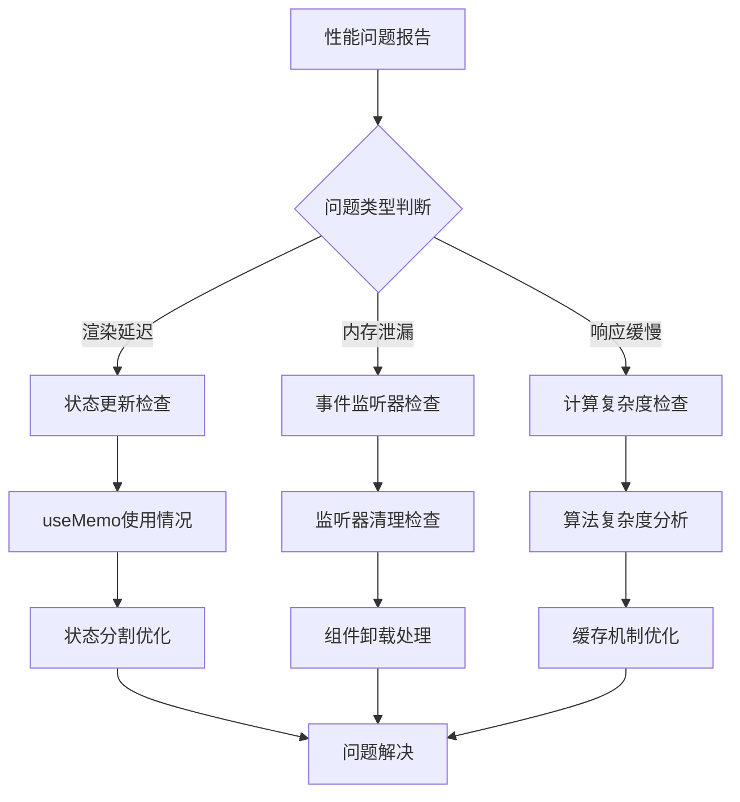

**图表来源**
- [PromptInput.tsx:832-848](file://src/components/PromptInput/PromptInput.tsx#L832-L848)

### 调试技巧

1. **启用调试模式**
   - 设置`debug`属性为`true`
   - 查看控制台日志输出

2. **状态检查**
   - 使用浏览器开发者工具检查组件状态
   - 监控状态变化的频率和模式

3. **性能分析**
   - 使用React Profiler分析渲染性能
   - 监控内存使用情况

**章节来源**
- [PromptInput.tsx:854-901](file://src/components/PromptInput/PromptInput.tsx#L854-L901)

## 结论

PromptInput主输入组件是一个功能丰富、架构清晰的现代化React组件。它通过精心设计的状态管理、事件处理和数据绑定机制，为用户提供了一流的输入体验。

组件的主要优势包括：

1. **模块化设计**：功能按模块分离，便于维护和扩展
2. **高性能实现**：采用多种优化策略确保流畅的用户体验
3. **强大的扩展性**：支持自定义配置和插件机制
4. **完善的错误处理**：提供全面的错误检测和恢复机制

通过深入理解组件的设计理念和实现细节，开发者可以更好地利用和扩展这个强大的输入组件，为各种应用场景提供优秀的用户界面解决方案。