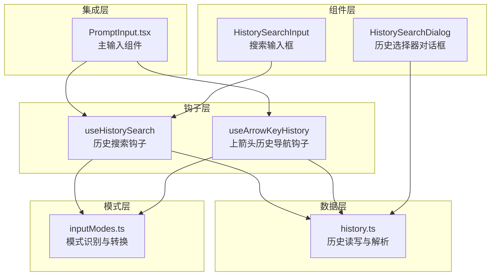
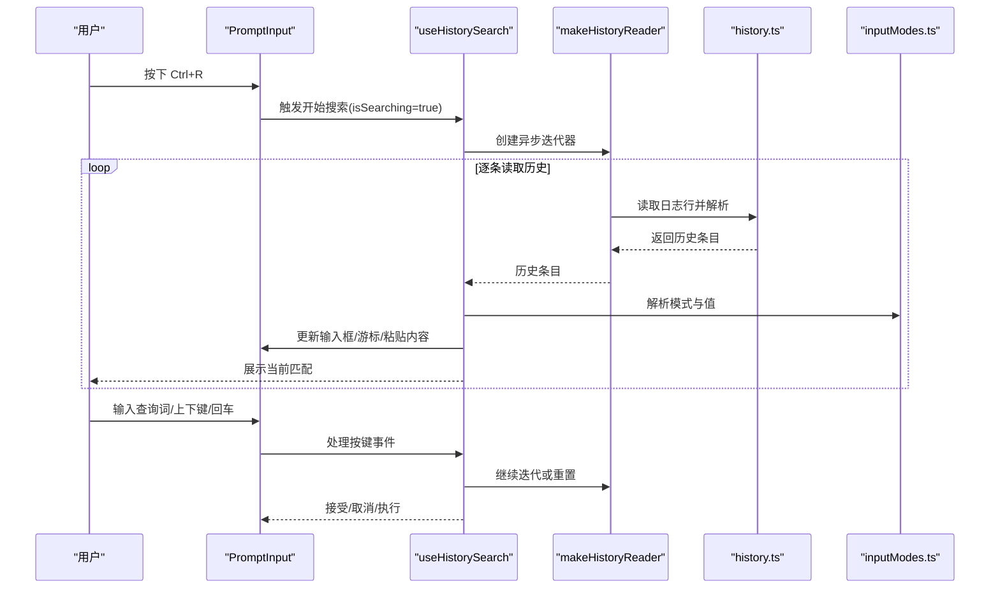
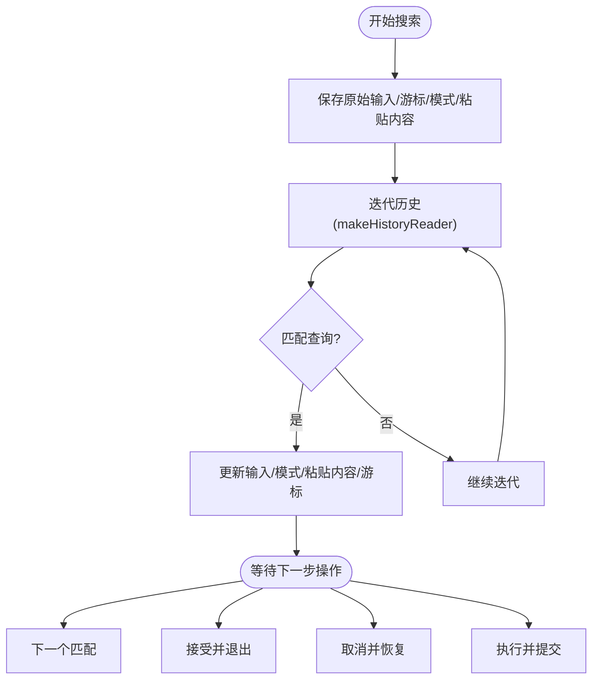
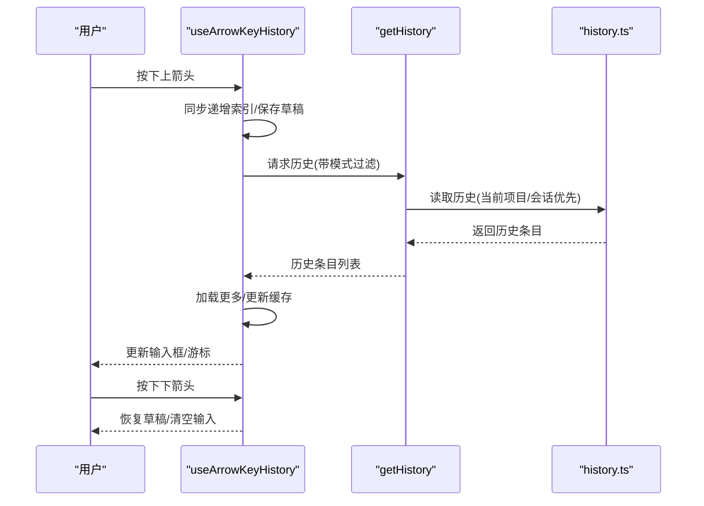
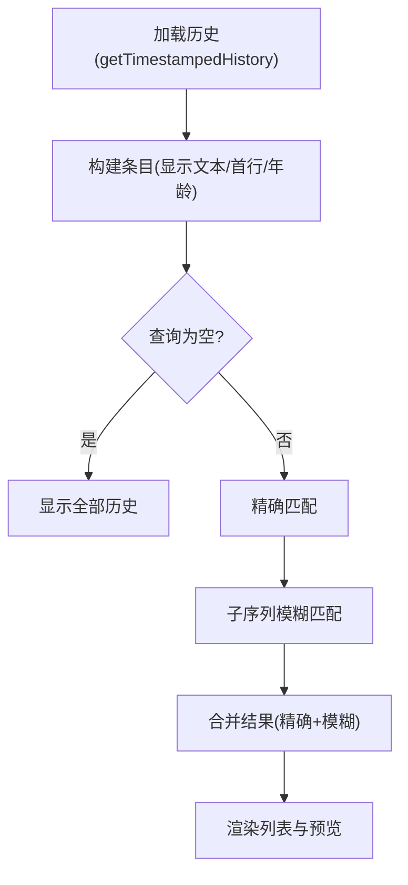
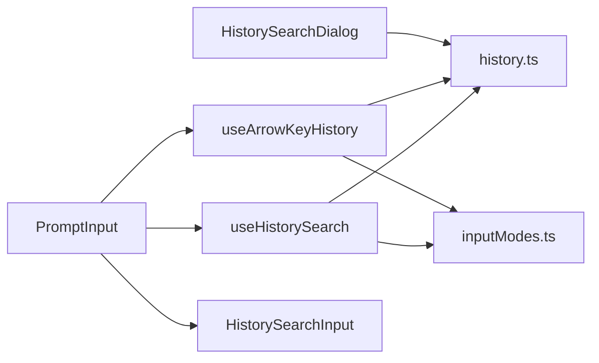

# 历史搜索输入

<cite>
**本文档引用的文件**
- [useHistorySearch.ts](file://src/hooks/useHistorySearch.ts)
- [useArrowKeyHistory.tsx](file://src/hooks/useArrowKeyHistory.tsx)
- [HistorySearchDialog.tsx](file://src/components/HistorySearchDialog.tsx)
- [HistorySearchInput.tsx](file://src/components/PromptInput/HistorySearchInput.tsx)
- [history.ts](file://src/history.ts)
- [inputModes.ts](file://src/components/PromptInput/inputModes.ts)
- [PromptInput.tsx](file://src/components/PromptInput/PromptInput.tsx)
</cite>

## 目录
1. [简介](#简介)
2. [项目结构](#项目结构)
3. [核心组件](#核心组件)
4. [架构总览](#架构总览)
5. [详细组件分析](#详细组件分析)
6. [依赖关系分析](#依赖关系分析)
7. [性能考量](#性能考量)
8. [故障排查指南](#故障排查指南)
9. [结论](#结论)
10. [附录](#附录)

## 简介
本文件系统性阐述“历史搜索输入”组件的设计与实现，覆盖历史记录存储、搜索算法、结果展示、键盘导航与快捷键、自动完成、过滤与排序、缓存策略、配置项、性能优化与用户体验改进，并提供可直接定位到源码位置的路径指引，便于开发者快速理解与扩展。

## 项目结构
历史搜索输入由多个模块协同工作：
- 钩子层：负责状态管理、事件处理与搜索逻辑（useHistorySearch、useArrowKeyHistory）
- 组件层：提供交互界面（HistorySearchInput、HistorySearchDialog）
- 数据层：负责历史记录的读写与解析（history.ts）
- 模式解析：负责输入模式识别与转换（inputModes.ts）
- 集成层：在 PromptInput 中整合历史搜索能力

**图表来源**
- [useHistorySearch.ts:15-303](file://src/hooks/useHistorySearch.ts#L15-L303)
- [useArrowKeyHistory.tsx:63-228](file://src/hooks/useArrowKeyHistory.tsx#L63-L228)
- [HistorySearchDialog.tsx:27-110](file://src/components/HistorySearchDialog.tsx#L27-L110)
- [HistorySearchInput.tsx:6-50](file://src/components/PromptInput/HistorySearchInput.tsx#L6-L50)
- [history.ts:145-217](file://src/history.ts#L145-L217)
- [inputModes.ts:16-29](file://src/components/PromptInput/inputModes.ts#L16-L29)
- [PromptInput.tsx:25-27](file://src/components/PromptInput/PromptInput.tsx#L25-L27)

**章节来源**
- [useHistorySearch.ts:15-303](file://src/hooks/useHistorySearch.ts#L15-L303)
- [useArrowKeyHistory.tsx:63-228](file://src/hooks/useArrowKeyHistory.tsx#L63-L228)
- [HistorySearchDialog.tsx:27-110](file://src/components/HistorySearchDialog.tsx#L27-L110)
- [HistorySearchInput.tsx:6-50](file://src/components/PromptInput/HistorySearchInput.tsx#L6-L50)
- [history.ts:145-217](file://src/history.ts#L145-L217)
- [inputModes.ts:16-29](file://src/components/PromptInput/inputModes.ts#L16-L29)
- [PromptInput.tsx:25-27](file://src/components/PromptInput/PromptInput.tsx#L25-L27)

## 核心组件
- useHistorySearch：提供基于 Ctrl+R 的实时历史搜索，支持模糊匹配、游标定位、粘贴内容恢复与模式切换
- useArrowKeyHistory：提供上/下箭头浏览历史，带分块加载、缓存与模式过滤
- HistorySearchInput：搜索模式下的输入框 UI，提示“搜索提示”
- HistorySearchDialog：全量历史选择器，支持精确/模糊匹配与预览
- history.ts：历史记录的持久化、去重、排序与懒解析
- inputModes.ts：输入模式识别与值提取（如 bash 模式前缀）

**章节来源**
- [useHistorySearch.ts:15-303](file://src/hooks/useHistorySearch.ts#L15-L303)
- [useArrowKeyHistory.tsx:63-228](file://src/hooks/useArrowKeyHistory.tsx#L63-L228)
- [HistorySearchDialog.tsx:27-110](file://src/components/HistorySearchDialog.tsx#L27-L110)
- [HistorySearchInput.tsx:6-50](file://src/components/PromptInput/HistorySearchInput.tsx#L6-L50)
- [history.ts:145-217](file://src/history.ts#L145-L217)
- [inputModes.ts:16-29](file://src/components/PromptInput/inputModes.ts#L16-L29)

## 架构总览
历史搜索的端到端流程如下：

**图表来源**
- [useHistorySearch.ts:150-235](file://src/hooks/useHistorySearch.ts#L150-L235)
- [history.ts:145-149](file://src/history.ts#L145-L149)
- [inputModes.ts:16-29](file://src/components/PromptInput/inputModes.ts#L16-L29)

## 详细组件分析

### 组件A：useHistorySearch（历史搜索钩子）
职责与行为：
- 状态管理：维护搜索词、当前匹配、失败标记、原始输入/游标/模式/粘贴内容快照
- 异步搜索：通过 makeHistoryReader 迭代历史，按末尾匹配过滤并去重
- 键盘事件：支持 Ctrl+R 启动、Backspace 在空查询时取消、上下文快捷键（next/accept/cancel/execute）
- 模式与游标：根据 display 解析模式与值，计算游标位置；支持粘贴内容恢复
- 资源清理：显式关闭迭代器，避免文件句柄泄漏

**图表来源**
- [useHistorySearch.ts:73-148](file://src/hooks/useHistorySearch.ts#L73-L148)
- [useHistorySearch.ts:150-235](file://src/hooks/useHistorySearch.ts#L150-L235)

**章节来源**
- [useHistorySearch.ts:15-303](file://src/hooks/useHistorySearch.ts#L15-L303)

### 组件B：useArrowKeyHistory（上箭头历史导航）
职责与行为：
- 分块加载：批量从历史中读取，减少磁盘读取次数
- 缓存策略：共享缓存与模式过滤，避免混合不同模式的结果
- 同步索引：使用 ref 同步索引，应对快速按键导致的闭包问题
- 草稿保留：首次按下上箭头时保存当前输入草稿，便于后续恢复
- 模式过滤：首次进入时固定模式过滤，直到重置
- 提示显示：导航超过一定次数后提示“搜索历史”的快捷键

**图表来源**
- [useArrowKeyHistory.tsx:124-182](file://src/hooks/useArrowKeyHistory.tsx#L124-L182)
- [useArrowKeyHistory.tsx:183-207](file://src/hooks/useArrowKeyHistory.tsx#L183-L207)
- [history.ts:190-217](file://src/history.ts#L190-L217)

**章节来源**
- [useArrowKeyHistory.tsx:63-228](file://src/hooks/useArrowKeyHistory.tsx#L63-L228)
- [history.ts:190-217](file://src/history.ts#L190-L217)

### 组件C：HistorySearchDialog（历史选择器对话框）
职责与行为：
- 全量历史加载：基于 getTimestampedHistory，按项目去重、按时间倒序
- 搜索算法：精确包含匹配与子序列模糊匹配组合
- 预览渲染：按终端宽度动态布局列表与右侧预览
- 交互反馈：统计查询长度与结果数量，记录选择事件

**图表来源**
- [HistorySearchDialog.tsx:38-81](file://src/components/HistorySearchDialog.tsx#L38-L81)
- [HistorySearchDialog.tsx:111-117](file://src/components/HistorySearchDialog.tsx#L111-L117)

**章节来源**
- [HistorySearchDialog.tsx:27-110](file://src/components/HistorySearchDialog.tsx#L27-L110)

### 组件D：HistorySearchInput（搜索输入框）
职责与行为：
- 提示文案：根据是否匹配失败显示不同提示
- 输入行为：聚焦、显示光标、单行输入
- 动态宽度：根据输入长度调整列宽

**章节来源**
- [HistorySearchInput.tsx:6-50](file://src/components/PromptInput/HistorySearchInput.tsx#L6-L50)

### 组件E：history.ts（历史存储与解析）
职责与行为：
- 存储格式：JSONL 行式存储，追加写入，带锁文件
- 写入策略：批量写入，失败重试，进程退出时清理
- 读取策略：反向读取，跳过被移除的条目，按项目/会话过滤
- 去重与限制：按项目去重，限制最大条数
- 粘贴内容：小文本内联存储，大文本哈希引用并异步落盘
- 懒解析：选择器仅读取显示文本与时间戳，需要时再解析粘贴内容

**章节来源**
- [history.ts:19-465](file://src/history.ts#L19-L465)

### 组件F：inputModes.ts（输入模式解析）
职责与行为：
- 模式识别：以特定字符作为前缀判断模式（如 bash）
- 值提取：去除模式前缀得到纯值
- 模式转换：用于搜索与导航时的模式一致性

**章节来源**
- [inputModes.ts:16-29](file://src/components/PromptInput/inputModes.ts#L16-L29)

## 依赖关系分析
- useHistorySearch 依赖 history.ts 的 makeHistoryReader 与 inputModes.ts 的模式解析
- useArrowKeyHistory 依赖 history.ts 的 getHistory 与 inputModes.ts
- HistorySearchDialog 依赖 history.ts 的 getTimestampedHistory
- PromptInput 将上述钩子与组件集成到主输入界面

**图表来源**
- [useHistorySearch.ts:7-13](file://src/hooks/useHistorySearch.ts#L7-L13)
- [useArrowKeyHistory.tsx:2-6](file://src/hooks/useArrowKeyHistory.tsx#L2-L6)
- [HistorySearchDialog.tsx:4](file://src/components/HistorySearchDialog.tsx#L4)
- [PromptInput.tsx:25-27](file://src/components/PromptInput/PromptInput.tsx#L25-L27)

**章节来源**
- [useHistorySearch.ts:7-13](file://src/hooks/useHistorySearch.ts#L7-L13)
- [useArrowKeyHistory.tsx:2-6](file://src/hooks/useArrowKeyHistory.tsx#L2-L6)
- [HistorySearchDialog.tsx:4](file://src/components/HistorySearchDialog.tsx#L4)
- [PromptInput.tsx:25-27](file://src/components/PromptInput/PromptInput.tsx#L25-L27)

## 性能考量
- I/O 批处理与锁：批量写入与锁文件避免并发冲突与频繁打开/关闭文件句柄
- 分块加载与缓存：上箭头导航采用分块与缓存，减少磁盘读取与重复解析
- 异步迭代：历史搜索使用异步迭代器，边读边匹配，避免一次性加载全部历史
- 去重与限制：按项目去重与最大条数限制，降低内存与 CPU 压力
- 懒解析：选择器仅读取必要字段，粘贴内容按需解析
- 取消与重置：查询变化时及时中断搜索，避免无效计算

[本节为通用性能讨论，不直接分析具体文件，故无章节来源]

## 故障排查指南
常见问题与定位要点：
- 搜索无结果或反复失败
  - 检查搜索词是否为空（空查询会重置为原始输入）
  - 确认历史文件是否存在与可读
  - 查看资源清理逻辑是否正确关闭迭代器
  - 参考：[useHistorySearch.ts:79-89](file://src/hooks/useHistorySearch.ts#L79-L89)、[useHistorySearch.ts:51-58](file://src/hooks/useHistorySearch.ts#L51-L58)
- 上箭头导航卡顿或错乱
  - 检查分块加载与缓存是否生效
  - 确认模式过滤是否一致
  - 参考：[useArrowKeyHistory.tsx:154-163](file://src/hooks/useArrowKeyHistory.tsx#L154-L163)、[useArrowKeyHistory.tsx:147-152](file://src/hooks/useArrowKeyHistory.tsx#L147-L152)
- 写入失败或历史丢失
  - 查看写入重试与清理注册逻辑
  - 确认锁文件与权限设置
  - 参考：[history.ts:292-353](file://src/history.ts#L292-L353)、[history.ts:411-434](file://src/history.ts#L411-L434)
- 模式不一致或游标位置异常
  - 检查模式解析与值提取逻辑
  - 参考：[inputModes.ts:16-29](file://src/components/PromptInput/inputModes.ts#L16-L29)

**章节来源**
- [useHistorySearch.ts:79-89](file://src/hooks/useHistorySearch.ts#L79-L89)
- [useHistorySearch.ts:51-58](file://src/hooks/useHistorySearch.ts#L51-L58)
- [useArrowKeyHistory.tsx:154-163](file://src/hooks/useArrowKeyHistory.tsx#L154-L163)
- [useArrowKeyHistory.tsx:147-152](file://src/hooks/useArrowKeyHistory.tsx#L147-L152)
- [history.ts:292-353](file://src/history.ts#L292-L353)
- [history.ts:411-434](file://src/history.ts#L411-L434)
- [inputModes.ts:16-29](file://src/components/PromptInput/inputModes.ts#L16-L29)

## 结论
该历史搜索输入组件通过钩子与组件的清晰分层，结合高效的 I/O 批处理、分块缓存与异步迭代，实现了低延迟、高可用的历史检索体验。其模式解析与粘贴内容恢复增强了跨会话的一致性与可编辑性。建议在大规模历史场景下进一步引入索引与增量更新策略，以持续提升性能与稳定性。

[本节为总结性内容，不直接分析具体文件，故无章节来源]

## 附录

### 实际使用场景与代码示例路径
- 启动历史搜索（Ctrl+R）并输入关键词进行实时匹配
  - 示例路径：[useHistorySearch.ts:238-241](file://src/hooks/useHistorySearch.ts#L238-L241)
- 使用上箭头浏览历史并按模式过滤
  - 示例路径：[useArrowKeyHistory.tsx:124-182](file://src/hooks/useArrowKeyHistory.tsx#L124-L182)
- 在全量历史选择器中进行精确/模糊搜索
  - 示例路径：[HistorySearchDialog.tsx:65-79](file://src/components/HistorySearchDialog.tsx#L65-L79)
- 接受当前匹配并提交
  - 示例路径：[useHistorySearch.ts:210-226](file://src/hooks/useHistorySearch.ts#L210-L226)

### 配置选项与参数
- 历史条目上限：MAX_HISTORY_ITEMS（用于去重与限制）
  - 定义路径：[history.ts:19](file://src/history.ts#L19)
- 粘贴内容内联阈值：MAX_PASTED_CONTENT_LENGTH
  - 定义路径：[history.ts:20](file://src/history.ts#L20)
- 上箭头导航分块大小：HISTORY_CHUNK_SIZE
  - 定义路径：[useArrowKeyHistory.tsx:13](file://src/hooks/useArrowKeyHistory.tsx#L13)

### 用户体验改进建议
- 增加搜索历史的快捷键提示与引导
  - 参考：[useArrowKeyHistory.tsx:114-123](file://src/hooks/useArrowKeyHistory.tsx#L114-L123)
- 在搜索输入框中增加“无匹配”状态提示
  - 参考：[HistorySearchInput.tsx:18](file://src/components/PromptInput/HistorySearchInput.tsx#L18)
- 为长历史提供进度反馈与取消按钮
  - 参考：[HistorySearchDialog.tsx:61-64](file://src/components/HistorySearchDialog.tsx#L61-L64)