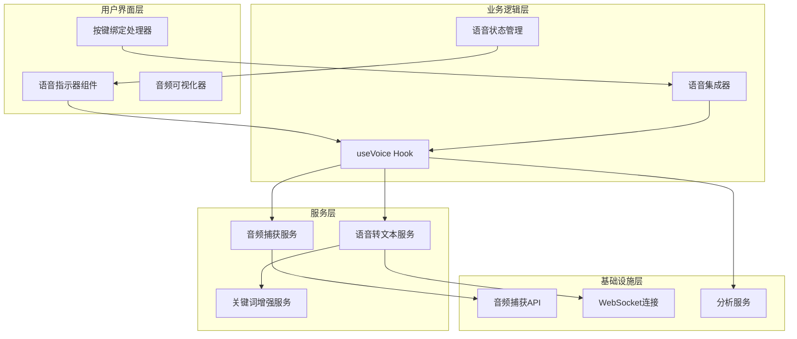
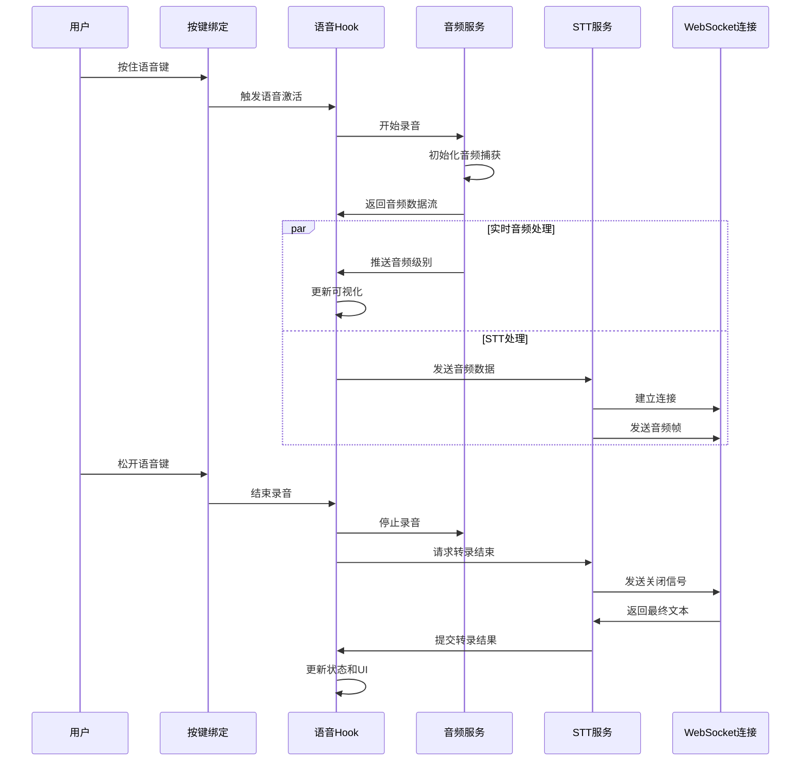
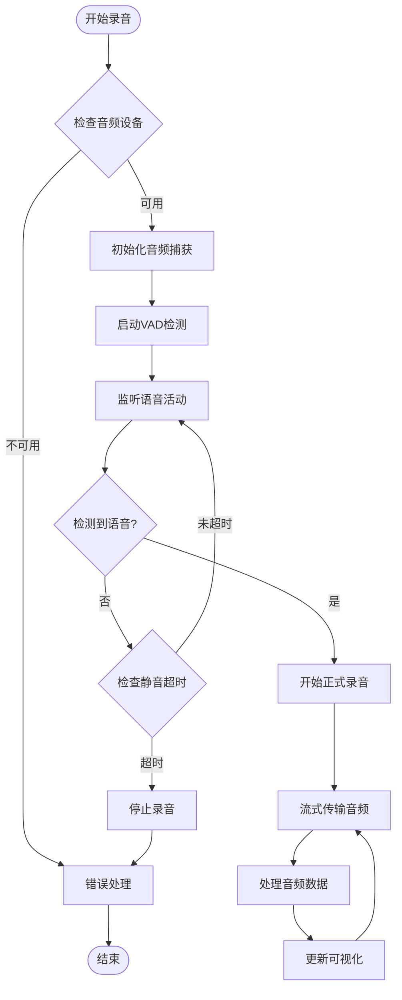
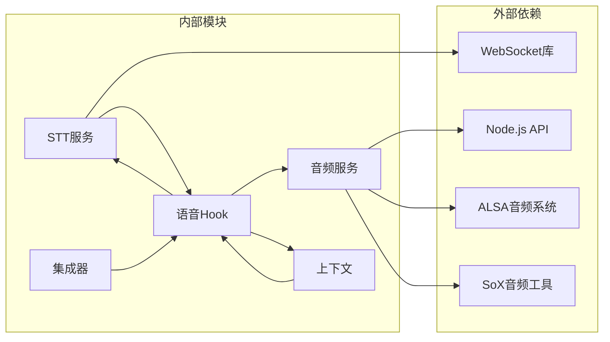

# 语音输入指示器

<cite>
**本文档引用的文件**
- [src/services/voice.ts](file://src/services/voice.ts)
- [src/services/voiceStreamSTT.ts](file://src/services/voiceStreamSTT.ts)
- [src/hooks/useVoice.ts](file://src/hooks/useVoice.ts)
- [src/hooks/useVoiceIntegration.tsx](file://src/hooks/useVoiceIntegration.tsx)
- [src/context/voice.tsx](file://src/context/voice.tsx)
- [src/commands/voice/voice.ts](file://src/commands/voice/voice.ts)
- [src/services/voiceKeyterms.ts](file://src/services/voiceKeyterms.ts)
</cite>

## 目录
1. [简介](#简介)
2. [项目结构](#项目结构)
3. [核心组件](#核心组件)
4. [架构概览](#架构概览)
5. [详细组件分析](#详细组件分析)
6. [依赖关系分析](#依赖关系分析)
7. [性能考虑](#性能考虑)
8. [故障排除指南](#故障排除指南)
9. [结论](#结论)

## 简介

语音输入指示器是 Claude Code 中一个强大的语音交互功能，它提供了完整的语音到文本转换体验。该系统支持按住键触发录音、实时语音指示和状态反馈，集成了先进的语音激活检测、噪声抑制和音频质量控制技术。

该功能的核心特性包括：
- 按住指定键（默认为空格键）触发语音录制
- 实时音频波形可视化和音量指示
- 自动语音激活检测（VAD）
- 多平台音频捕获支持（macOS、Linux、Windows）
- 高级 STT 引擎集成（Deepgram Nova 3）
- 语音关键词增强功能
- 完整的错误处理和状态管理

## 项目结构

语音输入功能由多个相互协作的模块组成，采用分层架构设计：



**图表来源**
- [src/hooks/useVoice.ts:1-800](file://src/hooks/useVoice.ts#L1-L800)
- [src/services/voice.ts:1-526](file://src/services/voice.ts#L1-L526)
- [src/services/voiceStreamSTT.ts:1-545](file://src/services/voiceStreamSTT.ts#L1-L545)

**章节来源**
- [src/hooks/useVoice.ts:1-800](file://src/hooks/useVoice.ts#L1-L800)
- [src/services/voice.ts:1-526](file://src/services/voice.ts#L1-L526)
- [src/services/voiceStreamSTT.ts:1-545](file://src/services/voiceStreamSTT.ts#L1-L545)

## 核心组件

### 音频捕获服务

音频捕获服务是整个语音系统的基础设施，负责跨平台的音频捕获和处理。

**主要功能：**
- 原生音频模块优先级（macOS、Linux、Windows）
- SoX 录音工具回退机制
- ALSA 设备探测和验证
- 静音检测和自动停止
- 实时音频数据流处理

**章节来源**
- [src/services/voice.ts:335-466](file://src/services/voice.ts#L335-L466)

### 语音转文本服务

语音转文本服务负责将音频数据转换为文本，并提供实时的中间结果和最终结果。

**主要功能：**
- WebSocket 连接管理
- 实时转录流处理
- 传输协议消息解析
- 错误恢复和重试机制
- 关键词增强支持

**章节来源**
- [src/services/voiceStreamSTT.ts:111-545](file://src/services/voiceStreamSTT.ts#L111-L545)

### 语音状态管理

语音状态管理组件负责跟踪和协调整个语音输入过程的状态变化。

**主要功能：**
- 语音状态跟踪（空闲、录音中、处理中）
- 实时音频级别计算
- 会话生命周期管理
- 错误状态处理
- 用户界面状态同步

**章节来源**
- [src/context/voice.tsx:1-88](file://src/context/voice.tsx#L1-L88)
- [src/hooks/useVoice.ts:200-320](file://src/hooks/useVoice.ts#L200-L320)

## 架构概览

语音输入系统采用事件驱动的异步架构，通过多个服务层协同工作：



**图表来源**
- [src/hooks/useVoiceIntegration.tsx:373-677](file://src/hooks/useVoiceIntegration.tsx#L373-L677)
- [src/hooks/useVoice.ts:632-760](file://src/hooks/useVoice.ts#L632-L760)
- [src/services/voiceStreamSTT.ts:322-348](file://src/services/voiceStreamSTT.ts#L322-L348)

## 详细组件分析

### 语音激活检测机制

语音激活检测（VAD）是语音输入系统的核心功能之一，负责智能地检测用户的语音活动并自动开始/停止录音。



**图表来源**
- [src/services/voice.ts:335-466](file://src/services/voice.ts#L335-L466)
- [src/hooks/useVoice.ts:688-745](file://src/hooks/useVoice.ts#L688-L745)

### 音频质量控制

音频质量控制确保语音输入的可靠性和准确性，通过多种机制实现：

**噪声抑制策略：**
- 实时音频级别检测
- 静音阈值调整
- 动态范围压缩
- 频率响应优化

**音频格式处理：**
- 16kHz 采样率
- 单声道 PCM 编码
- 实时缓冲区管理
- 流式数据传输

**章节来源**
- [src/hooks/useVoice.ts:185-197](file://src/hooks/useVoice.ts#L185-L197)
- [src/services/voice.ts:40-46](file://src/services/voice.ts#L40-L46)

### 语音转文本集成

语音转文本服务集成了先进的 STT 引擎，提供高精度的语音识别能力。

```mermaid
classDiagram
class VoiceStreamConnection {
+send(audioChunk : Buffer) void
+finalize() Promise~FinalizeSource~
+close() void
+isConnected() boolean
}
class VoiceStreamCallbacks {
+onTranscript(text : string, isFinal : boolean) void
+onError(message : string, opts? : {fatal? : boolean}) void
+onClose() void
+onReady(connection : VoiceStreamConnection) void
}
class VoiceStreamMessage {
+type : string
+data? : string
+error_code? : string
+description? : string
}
VoiceStreamConnection --> VoiceStreamCallbacks : 使用
VoiceStreamCallbacks --> VoiceStreamMessage : 处理
```

**图表来源**
- [src/services/voiceStreamSTT.ts:67-95](file://src/services/voiceStreamSTT.ts#L67-L95)

**章节来源**
- [src/services/voiceStreamSTT.ts:111-212](file://src/services/voiceStreamSTT.ts#L111-L212)

### 错误处理和恢复机制

系统实现了多层次的错误处理和自动恢复机制：

**连接错误处理：**
- WebSocket 连接失败重试
- 认证令牌刷新
- 网络异常自动恢复
- 超时处理和超时重试

**音频设备错误：**
- 设备权限检查
- 设备可用性验证
- 回退机制选择
- 用户友好的错误提示

**章节来源**
- [src/services/voiceStreamSTT.ts:498-541](file://src/services/voiceStreamSTT.ts#L498-L541)
- [src/services/voice.ts:259-328](file://src/services/voice.ts#L259-L328)

## 依赖关系分析

语音输入系统的依赖关系体现了清晰的分层架构：



**图表来源**
- [src/services/voice.ts:7-12](file://src/services/voice.ts#L7-L12)
- [src/services/voiceStreamSTT.ts:14-27](file://src/services/voiceStreamSTT.ts#L14-L27)

**章节来源**
- [src/hooks/useVoiceIntegration.tsx:1-35](file://src/hooks/useVoiceIntegration.tsx#L1-L35)
- [src/services/voiceKeyterms.ts:1-107](file://src/services/voiceKeyterms.ts#L1-L107)

## 性能考虑

### 实时性能优化

语音输入系统在性能方面采用了多项优化策略：

**内存管理：**
- 音频缓冲区大小优化（32KB 切片）
- 及时释放不再使用的音频数据
- 内存使用监控和限制
- 垃圾回收优化

**网络性能：**
- WebSocket 连接池管理
- 压缩音频数据传输
- 异步数据处理
- 连接复用和重用

**CPU 使用：**
- 多线程音频处理
- 智能任务调度
- CPU 使用率监控
- 动态性能调优

### 用户体验优化

**响应时间优化：**
- 预加载音频模块避免首次延迟
- 预连接 WebSocket 减少等待时间
- 实时反馈机制
- 平滑的动画过渡

**可靠性保证：**
- 自动重连机制
- 数据完整性检查
- 错误状态恢复
- 用户操作保护

## 故障排除指南

### 常见问题诊断

**麦克风权限问题：**
- 检查操作系统权限设置
- 验证麦克风设备可用性
- 重新请求麦克风访问权限
- 查看系统隐私设置

**音频设备检测失败：**
- 确认音频设备正确连接
- 检查 ALSA 配置（Linux）
- 验证 SoX 工具安装
- 测试其他应用程序的音频功能

**网络连接问题：**
- 检查互联网连接稳定性
- 验证代理服务器配置
- 确认防火墙设置允许连接
- 测试 WebSocket 连接

### 诊断工具和日志

系统提供了丰富的诊断信息：

**调试日志：**
- 音频捕获状态日志
- WebSocket 连接日志
- STT 处理进度日志
- 错误和异常记录

**性能监控：**
- 音频延迟测量
- 网络带宽使用
- CPU 和内存使用率
- 连接成功率统计

**章节来源**
- [src/services/voice.ts:48-61](file://src/services/voice.ts#L48-L61)
- [src/commands/voice/voice.ts:82-112](file://src/commands/voice/voice.ts#L82-L112)

### 配置选项和自定义

**语音功能配置：**
- 启用/禁用语音输入
- 设置录音键绑定
- 配置语言偏好
- 调整音频参数

**高级设置：**
- 自定义关键词列表
- 调整 VAD 参数
- 配置网络设置
- 设置性能选项

**章节来源**
- [src/commands/voice/voice.ts:16-150](file://src/commands/voice/voice.ts#L16-L150)
- [src/hooks/useVoice.ts:31-134](file://src/hooks/useVoice.ts#L31-L134)

## 结论

语音输入指示器组件代表了现代语音交互技术的综合应用，通过精心设计的架构和实现，提供了稳定、高效的语音输入体验。

**核心优势：**
- 跨平台兼容性确保广泛的适用性
- 实时处理能力提供流畅的用户体验
- 智能错误处理提升系统可靠性
- 可扩展的架构支持功能增强

**未来发展：**
- AI 驱动的语音识别优化
- 更多语言和方言支持
- 增强的噪声抑制算法
- 个性化语音模型训练

该系统为开发者和用户提供了一个强大而可靠的语音输入解决方案，显著提升了代码编写和交互的效率与便利性。