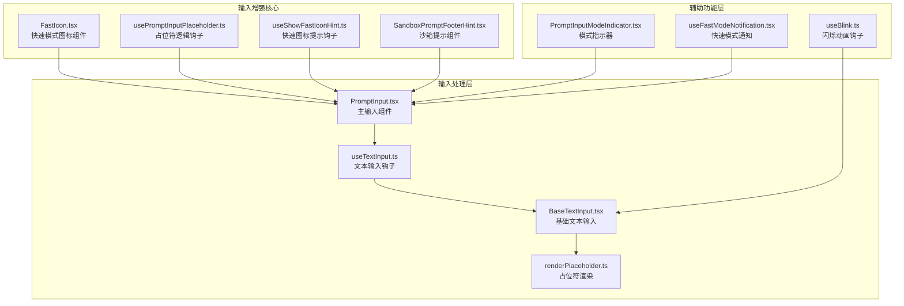
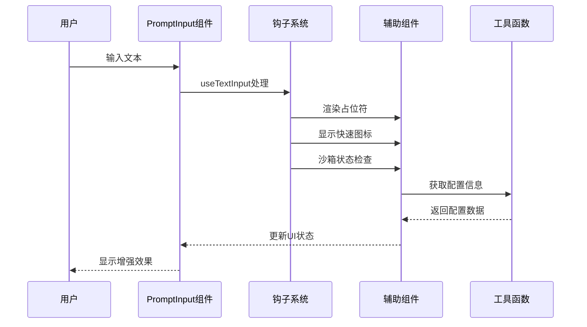
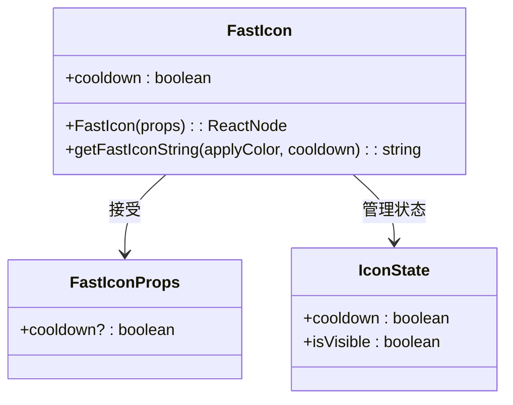
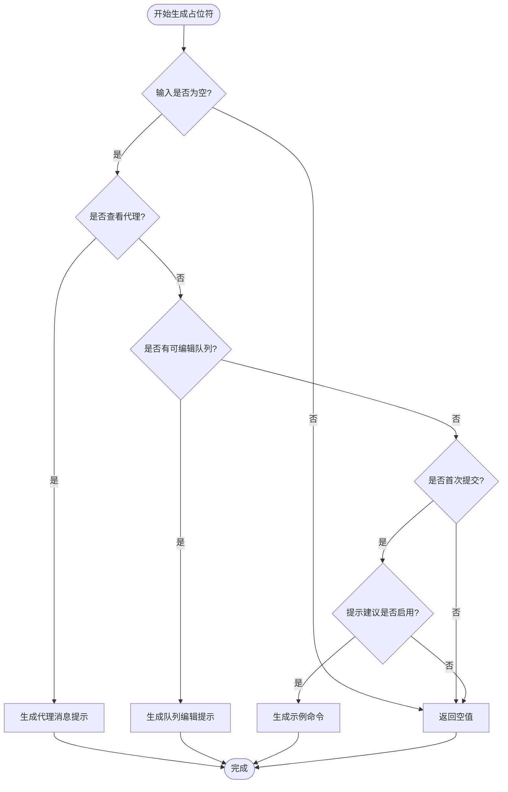
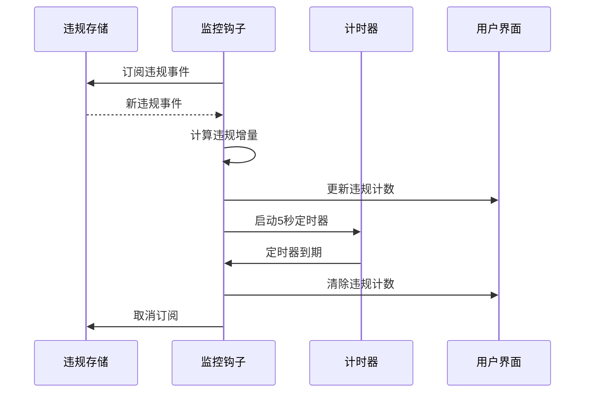
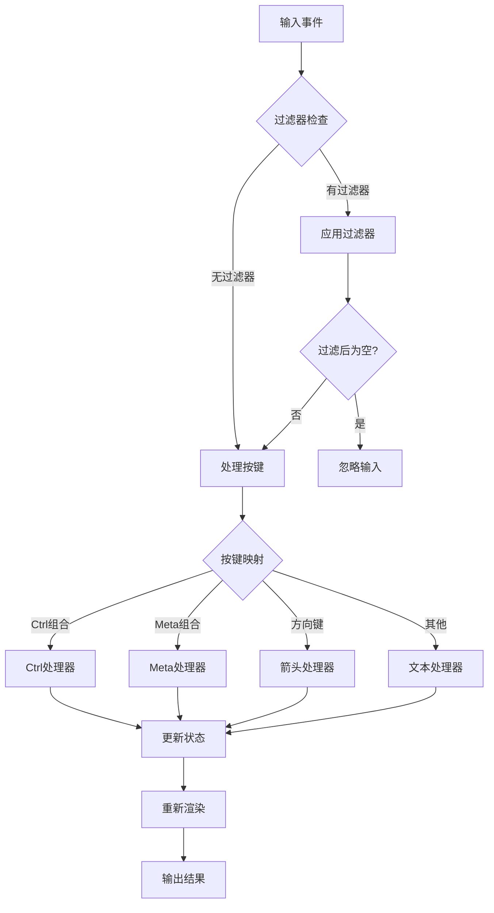
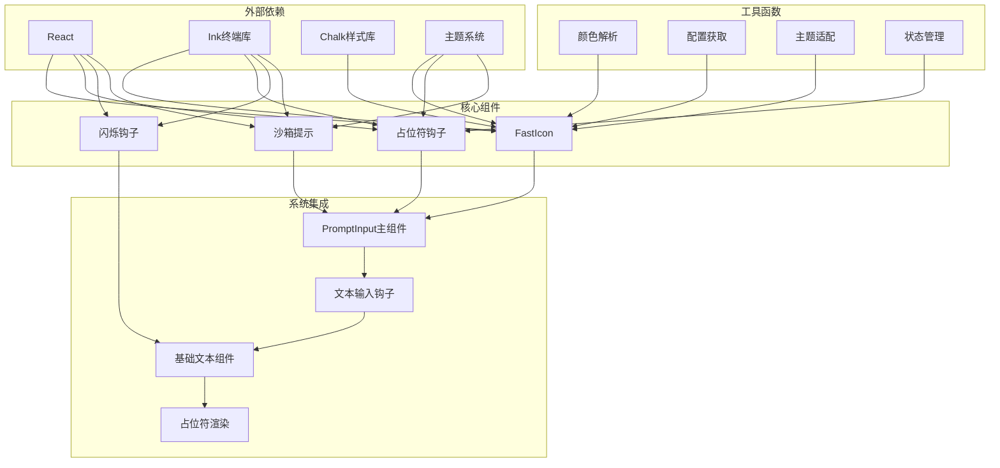

# 输入增强辅助功能

<cite>
**本文档引用的文件**
- [FastIcon.tsx](file://src/components/FastIcon.tsx)
- [usePromptInputPlaceholder.ts](file://src/components/PromptInput/usePromptInputPlaceholder.ts)
- [useShowFastIconHint.ts](file://src/components/PromptInput/useShowFastIconHint.ts)
- [SandboxPromptFooterHint.tsx](file://src/components/PromptInput/SandboxPromptFooterHint.tsx)
- [PromptInput.tsx](file://src/components/PromptInput/PromptInput.tsx)
- [useBlink.ts](file://src/hooks/useBlink.ts)
- [useTextInput.ts](file://src/hooks/useTextInput.ts)
- [BaseTextInput.tsx](file://src/components/BaseTextInput.tsx)
- [renderPlaceholder.ts](file://src/hooks/renderPlaceholder.ts)
- [PromptInputModeIndicator.tsx](file://src/components/PromptInput/PromptInputModeIndicator.tsx)
- [useFastModeNotification.tsx](file://src/hooks/notifs/useFastModeNotification.tsx)
</cite>

## 目录
1. [简介](#简介)
2. [项目结构](#项目结构)
3. [核心组件](#核心组件)
4. [架构概览](#架构概览)
5. [详细组件分析](#详细组件分析)
6. [依赖关系分析](#依赖关系分析)
7. [性能考虑](#性能考虑)
8. [故障排除指南](#故障排除指南)
9. [结论](#结论)

## 简介

本文档深入介绍了 Claude 代码编辑器中的输入增强辅助功能系统。该系统通过多种视觉和交互增强技术来改善用户的输入体验，包括闪烁输入效果、沙箱提示、快速模式图标以及智能占位符文本等核心功能。

这些辅助功能旨在提供更直观、更高效的用户界面，帮助用户更好地理解和操作输入组件。系统采用模块化设计，每个功能都可以独立配置和使用，同时又能协同工作以创造一致的用户体验。

## 项目结构

输入增强辅助功能主要分布在以下目录结构中：

**图表来源**
- [FastIcon.tsx:1-46](file://src/components/FastIcon.tsx#L1-L46)
- [usePromptInputPlaceholder.ts:1-77](file://src/components/PromptInput/usePromptInputPlaceholder.ts#L1-L77)
- [PromptInput.tsx:1-200](file://src/components/PromptInput/PromptInput.tsx#L1-L200)

## 核心组件

### 快速模式图标系统

快速模式图标是输入增强的核心视觉元素，提供即时的状态反馈和交互提示。

**组件特性：**
- 动态颜色变化（正常/冷却状态）
- 支持纯文本和彩色输出
- 自动主题适配
- 智能提示显示机制

**实现要点：**
- 使用 `cooldown` 属性控制状态
- 通过 `getFastIconString` 提供字符串版本
- 集成主题系统进行颜色解析

### 占位符文本系统

智能占位符文本根据用户状态和上下文动态生成，提供个性化的输入指导。

**触发条件：**
- 用户首次进入输入状态
- 无历史命令可编辑时
- 在特定代理模式下
- 首次提交前的示例命令

**显示逻辑：**
- 基于 `input` 字符串长度判断
- 检查 `submitCount` 确保首次体验
- 验证 `promptSuggestionEnabled` 设置
- 支持代理视图模式下的特殊提示

### 沙箱提示系统

沙箱违规检测和提示系统为用户提供安全操作的即时反馈。

**监控机制：**
- 实时监听沙箱违规事件
- 5秒自动清除机制
- 细节快捷键提示
- 状态持久化管理

**显示策略：**
- 仅在启用沙箱时激活
- 违规计数动态更新
- 复数形式自动处理
- 键盘快捷键集成

### 闪烁输入效果

同步闪烁动画提供视觉焦点和状态指示，所有实例保持时间同步。

**技术实现：**
- 基于动画帧的时间同步
- 终端焦点状态检查
- 600ms 间隔配置
- 批量实例同步机制

**图表来源**
- [useBlink.ts:1-35](file://src/hooks/useBlink.ts#L1-L35)

## 架构概览

输入增强辅助功能采用分层架构设计，确保功能模块的独立性和可维护性：

**图表来源**
- [PromptInput.tsx:194-200](file://src/components/PromptInput/PromptInput.tsx#L194-L200)
- [useTextInput.ts:73-97](file://src/hooks/useTextInput.ts#L73-L97)

## 详细组件分析

### 快速模式图标组件分析

快速模式图标组件实现了完整的状态管理和视觉反馈系统：

**状态管理机制：**
- 冷却状态：灰色/暗色显示
- 正常状态：主题色彩显示
- 字符串版本：支持纯文本输出
- 缓存优化：React.memo 缓存机制

**配置选项：**
- `cooldown` 属性控制状态
- 主题系统集成
- 颜色解析缓存
- 性能优化的渲染策略

**图表来源**
- [FastIcon.tsx:9-45](file://src/components/FastIcon.tsx#L9-L45)

### 占位符文本生成逻辑

占位符系统采用条件优先级机制，确保最相关和最有价值的提示信息：

**触发条件分析：**
- 代理查看模式：显示 "@用户名…" 提示
- 队列编辑：显示 "按向上键编辑..." 提示
- 首次体验：显示示例命令
- Proactive 模式：跳过示例命令

**图表来源**
- [usePromptInputPlaceholder.ts:32-76](file://src/components/PromptInput/usePromptInputPlaceholder.ts#L32-L76)

### 沙箱违规监控系统

沙箱提示系统实现了实时监控和自动清理机制：

**监控策略：**
- 实时事件监听
- 增量计算机制
- 自动清理定时器
- 内存泄漏防护

**显示规则：**
- 仅在沙箱启用时显示
- 违规计数大于0时激活
- 复数形式自动处理
- 快捷键提示集成

**图表来源**
- [SandboxPromptFooterHint.tsx:14-63](file://src/components/PromptInput/SandboxPromptFooterHint.tsx#L14-L63)

### 文本输入处理系统

文本输入处理系统提供了完整的键盘事件处理和光标管理：

**功能特性：**
- 多平台兼容性（Apple Terminal 特殊处理）
- 双击 ESC 清空输入保护
- Kill/Yank 剪贴板操作
- 光标位置精确管理
- 行包装和逻辑行处理

**图表来源**
- [useTextInput.ts:318-413](file://src/hooks/useTextInput.ts#L318-L413)

## 依赖关系分析

输入增强辅助功能的依赖关系呈现清晰的层次结构：

**依赖特点：**
- 松耦合设计，便于独立测试
- 主题系统集中管理
- 终端兼容性优先
- 性能优化的渲染策略

**章节来源**
- [FastIcon.tsx:1-46](file://src/components/FastIcon.tsx#L1-L46)
- [usePromptInputPlaceholder.ts:1-77](file://src/components/PromptInput/usePromptInputPlaceholder.ts#L1-L77)
- [useBlink.ts:1-35](file://src/hooks/useBlink.ts#L1-L35)
- [SandboxPromptFooterHint.tsx:1-64](file://src/components/PromptInput/SandboxPromptFooterHint.tsx#L1-L64)

## 性能考虑

### 渲染优化策略

输入增强系统采用了多层次的性能优化措施：

**React.memo 缓存：**
- FastIcon 组件使用 React.memo 缓存
- 多个组件实现记忆化优化
- 避免不必要的重渲染

**动画性能：**
- 同步闪烁动画基于共享时间源
- 终端失焦时暂停动画
- 600ms 间隔确保流畅度

**内存管理：**
- 沙箱提示的定时器自动清理
- 订阅事件的正确取消
- 状态提升避免重复计算

### 配置和扩展性

**可配置参数：**
- 闪烁间隔可调（默认600ms）
- 快速图标提示持续时间（默认5000ms）
- 占位符显示次数限制（默认3次）

**主题集成：**
- 自动主题适配
- 颜色解析缓存
- 动态主题切换支持

## 故障排除指南

### 常见问题诊断

**闪烁效果不工作：**
1. 检查终端焦点状态
2. 验证动画帧循环
3. 确认组件挂载状态

**占位符不显示：**
1. 验证输入框是否为空
2. 检查配置项 `promptSuggestionEnabled`
3. 确认用户提交次数

**沙箱提示异常：**
1. 验证沙箱功能是否启用
2. 检查违规存储状态
3. 确认定时器是否正确清理

### 调试技巧

**开发环境调试：**
- 使用 React DevTools 检查组件状态
- 监控事件订阅和取消
- 验证主题系统集成

**生产环境监控：**
- 查看日志输出
- 监控内存使用
- 性能指标分析

**章节来源**
- [useBlink.ts:22-34](file://src/hooks/useBlink.ts#L22-L34)
- [usePromptInputPlaceholder.ts:32-76](file://src/components/PromptInput/usePromptInputPlaceholder.ts#L32-L76)
- [SandboxPromptFooterHint.tsx:14-47](file://src/components/PromptInput/SandboxPromptFooterHint.tsx#L14-L47)

## 结论

输入增强辅助功能系统通过精心设计的模块化架构，成功地将多种视觉和交互增强技术整合到统一的用户体验中。系统的主要优势包括：

**设计优势：**
- 模块化设计便于维护和扩展
- 主题系统提供一致的视觉体验
- 性能优化确保流畅的用户体验
- 松耦合架构支持灵活的配置

**用户体验改进：**
- 智能占位符提供个性化指导
- 实时状态反馈增强操作信心
- 同步闪烁动画提升视觉吸引力
- 沙箱提示保障安全操作

**最佳实践建议：**
- 合理使用占位符数量，避免信息过载
- 根据用户群体调整提示显示频率
- 确保主题系统的完整性和一致性
- 定期审查性能指标，优化渲染效率

该系统为开发者提供了强大的输入体验增强能力，通过合理的配置和使用，可以显著提升用户的工作效率和满意度。