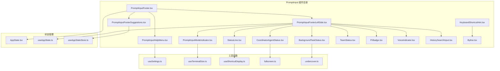
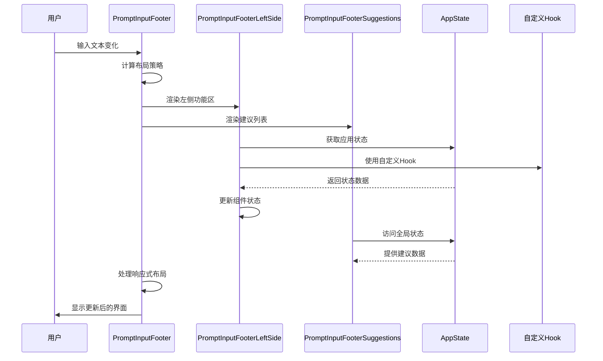
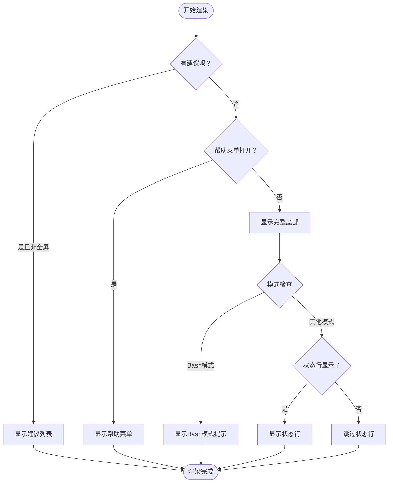
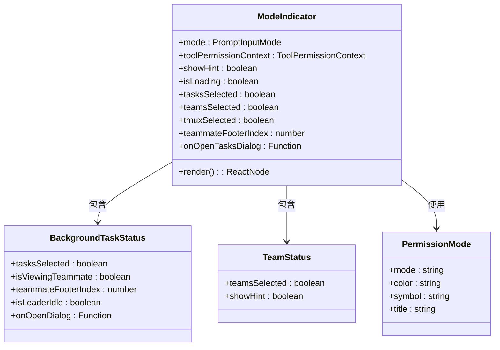
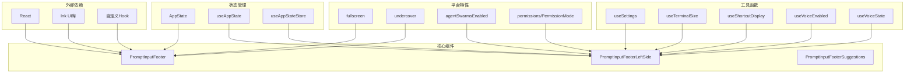

# 输入栏底部组件

<cite>
**本文档引用的文件**
- [PromptInputFooter.tsx](file://src/components/PromptInput/PromptInputFooter.tsx)
- [PromptInputFooterLeftSide.tsx](file://src/components/PromptInput/PromptInputFooterLeftSide.tsx)
- [PromptInputFooterSuggestions.tsx](file://src/components/PromptInput/PromptInputFooterSuggestions.tsx)
- [PromptInputModeIndicator.tsx](file://src/components/PromptInput/PromptInputModeIndicator.tsx)
- [PromptInputHelpMenu.tsx](file://src/components/PromptInput/PromptInputHelpMenu.tsx)
- [StatusLine.tsx](file://src/components/StatusLine.tsx)
- [CoordinatorAgentStatus.tsx](file://src/components/CoordinatorAgentStatus.tsx)
- [BackgroundTaskStatus.tsx](file://src/components/tasks/BackgroundTaskStatus.tsx)
- [TeamStatus.tsx](file://src/components/teams/TeamStatus.tsx)
- [PrBadge.tsx](file://src/components/PrBadge.tsx)
- [VoiceIndicator.tsx](file://src/components/PromptInput/VoiceIndicator.tsx)
- [HistorySearchInput.tsx](file://src/components/PromptInput/HistorySearchInput.tsx)
- [KeyboardShortcutHint.tsx](file://src/components/design-system/KeyboardShortcutHint.tsx)
- [Byline.tsx](file://src/components/design-system/Byline.tsx)
- [AppState.tsx](file://src/state/AppState.tsx)
- [useSettings.ts](file://src/hooks/useSettings.ts)
- [useTerminalSize.ts](file://src/hooks/useTerminalSize.ts)
- [useShortcutDisplay.ts](file://src/keybindings/useShortcutDisplay.ts)
- [useVoiceEnabled.ts](file://src/hooks/useVoiceEnabled.ts)
- [useVoiceState.ts](file://src/hooks/useVoiceState.ts)
- [fullscreen.ts](file://src/utils/fullscreen.ts)
- [undercover.ts](file://src/utils/undercover.ts)
- [permissions/PermissionMode.ts](file://src/utils/permissions/PermissionMode.ts)
- [agentSwarmsEnabled.ts](file://src/utils/agentSwarmsEnabled.ts)
- [taskStatusUtils.ts](file://src/components/tasks/taskStatusUtils.ts)
- [usePrStatus.ts](file://src/hooks/usePrStatus.ts)
- [useAppState.ts](file://src/hooks/useAppState.ts)
- [useAppStateStore.ts](file://src/hooks/useAppStateStore.ts)
- [promptOverlayContext.tsx](file://src/context/promptOverlayContext.tsx)
</cite>

## 目录
1. [简介](#简介)
2. [项目结构](#项目结构)
3. [核心组件](#核心组件)
4. [架构概览](#架构概览)
5. [详细组件分析](#详细组件分析)
6. [依赖关系分析](#依赖关系分析)
7. [性能考虑](#性能考虑)
8. [故障排除指南](#故障排除指南)
9. [结论](#结论)

## 简介

输入栏底部组件是 Claude Assistant 应用程序中一个关键的用户界面元素，位于主输入区域的底部。该组件提供了丰富的功能集，包括左侧功能区、建议列表和模式指示器等子组件。本文档将深入分析这些组件的架构设计、布局策略、响应式行为以及交互机制。

该组件系统采用模块化设计，支持多种输入模式（聊天、Bash、Vim），并集成了权限管理、任务管理、团队协作、语音输入等多种高级功能。组件通过状态管理和上下文提供者实现数据流和状态同步，确保用户界面的一致性和响应性。

## 项目结构

输入栏底部组件主要位于 `src/components/PromptInput/` 目录下，包含以下核心文件：

**图表来源**
- [PromptInputFooter.tsx:1-191](file://src/components/PromptInput/PromptInputFooter.tsx#L1-L191)
- [PromptInputFooterLeftSide.tsx:1-517](file://src/components/PromptInput/PromptInputFooterLeftSide.tsx#L1-L517)

**章节来源**
- [PromptInputFooter.tsx:1-191](file://src/components/PromptInput/PromptInputFooter.tsx#L1-L191)
- [PromptInputFooterLeftSide.tsx:1-517](file://src/components/PromptInput/PromptInputFooterLeftSide.tsx#L1-L517)

## 核心组件

输入栏底部组件系统由三个主要部分组成：

### 1. 主容器组件 - PromptInputFooter
主容器负责协调所有子组件的布局和显示逻辑，根据终端宽度和全屏状态动态调整布局策略。

### 2. 左侧功能区 - PromptInputFooterLeftSide
包含模式指示器、任务状态、团队状态、权限模式等核心功能按钮和状态显示。

### 3. 建议列表 - PromptInputFooterSuggestions
在非全屏环境下显示智能建议和自动完成选项。

### 4. 模式指示器 - PromptInputModeIndicator
显示当前输入模式和相关操作提示。

**章节来源**
- [PromptInputFooter.tsx:63-153](file://src/components/PromptInput/PromptInputFooter.tsx#L63-L153)
- [PromptInputFooterLeftSide.tsx:127-225](file://src/components/PromptInput/PromptInputFooterLeftSide.tsx#L127-L225)

## 架构概览

输入栏底部组件采用分层架构设计，实现了清晰的关注点分离：

**图表来源**
- [PromptInputFooter.tsx:96-151](file://src/components/PromptInput/PromptInputFooter.tsx#L96-L151)
- [PromptInputFooterLeftSide.tsx:127-225](file://src/components/PromptInput/PromptInputFooterLeftSide.tsx#L127-L225)

## 详细组件分析

### PromptInputFooter 主容器组件

主容器组件负责整体布局协调和条件渲染逻辑：

#### 布局策略
组件根据终端宽度和全屏状态采用不同的布局策略：
- 宽屏（≥80列）：横向布局，左右分区显示
- 窄屏（<80列）：纵向布局，功能区在上，建议列表在下
- 全屏模式：固定高度，避免影响滚动内容

#### 条件渲染逻辑

**图表来源**
- [PromptInputFooter.tsx:124-151](file://src/components/PromptInput/PromptInputFooter.tsx#L124-L151)

#### 状态管理集成
组件通过 `useAppState` 和 `useSettings` Hook 实现状态同步：
- 应用全局状态：任务计数、权限模式、视图模式
- 设置状态：终端尺寸、自定义状态行显示
- 动态状态：桥接连接状态、通知状态

**章节来源**
- [PromptInputFooter.tsx:96-153](file://src/components/PromptInput/PromptInputFooter.tsx#L96-L153)

### PromptInputFooterLeftSide 左侧功能区

左侧功能区是组件的核心交互区域，包含多个功能模块：

#### 模式指示器系统

**图表来源**
- [PromptInputFooterLeftSide.tsx:237-483](file://src/components/PromptInput/PromptInputFooterLeftSide.tsx#L237-L483)

#### 功能模块详解

##### 1. 任务状态管理
- 背景任务计数和状态监控
- 团队成员任务视图切换
- 任务管理对话框集成

##### 2. 团队协作状态
- 多代理团队模式支持
- 团队成员状态显示
- 协调者模式集成

##### 3. 权限管理模式
- 当前权限模式检测
- 模式切换快捷键支持
- 权限模式颜色标识

##### 4. 视觉反馈系统
- 加载状态指示器
- 错误状态警告
- 成功状态确认

**章节来源**
- [PromptInputFooterLeftSide.tsx:247-483](file://src/components/PromptInput/PromptInputFooterLeftSide.tsx#L247-L483)

### PromptInputFooterSuggestions 建议列表

建议列表组件提供智能输入辅助功能：

#### 响应式设计
- 根据可用空间动态调整列数
- 支持水平和垂直滚动
- 智能截断和省略号处理

#### 交互行为
- 键盘导航支持（上下箭头）
- 鼠标悬停选择
- 自动完成触发

**章节来源**
- [PromptInputFooter.tsx:130-134](file://src/components/PromptInput/PromptInputFooter.tsx#L130-L134)

### PromptInputModeIndicator 模式指示器

模式指示器提供当前输入模式的状态反馈：

#### 模式类型
- **聊天模式**：标准文本输入
- **Bash模式**：命令行输入
- **Vim模式**：Vim编辑器模式

#### 状态反馈
- 当前模式的颜色编码
- 模式切换快捷键提示
- 特殊模式的功能标识

**章节来源**
- [PromptInputFooterLeftSide.tsx:317-319](file://src/components/PromptInput/PromptInputFooterLeftSide.tsx#L317-L319)

## 依赖关系分析

输入栏底部组件系统具有清晰的依赖层次结构：

**图表来源**
- [PromptInputFooter.tsx:1-20](file://src/components/PromptInput/PromptInputFooter.tsx#L1-L20)
- [PromptInputFooterLeftSide.tsx:1-48](file://src/components/PromptInput/PromptInputFooterLeftSide.tsx#L1-L48)

### 组件间通信机制

组件间通过以下机制进行通信：

#### 1. 状态提升模式
- 父组件通过 props 向子组件传递状态
- 子组件通过回调函数向上级组件报告事件

#### 2. 上下文提供者
- `promptOverlayContext` 用于全屏模式下的组件通信
- `AppState` 提供全局状态访问

#### 3. 自定义Hook模式
- 封装复杂的状态逻辑
- 提供可复用的业务功能

**章节来源**
- [promptOverlayContext.tsx:1-50](file://src/context/promptOverlayContext.tsx#L1-L50)
- [AppState.tsx:1-100](file://src/state/AppState.tsx#L1-L100)

## 性能考虑

输入栏底部组件系统在设计时充分考虑了性能优化：

### 渲染优化
- 使用 `React.memo` 缓存组件结果
- 条件渲染减少不必要的DOM更新
- 智能的布局计算避免重复计算

### 内存管理
- 及时清理定时器和事件监听器
- 合理使用 `useRef` 和 `useMemo`
- 避免内存泄漏的副作用

### 响应式性能
- 终端尺寸变化的防抖处理
- 状态更新的批处理机制
- 条件渲染的快速路径

## 故障排除指南

### 常见问题及解决方案

#### 1. 布局异常
**症状**：组件布局错乱或重叠
**原因**：终端宽度计算错误或状态更新延迟
**解决**：检查 `useTerminalSize` Hook 的实现，确保正确的响应式处理

#### 2. 功能按钮无响应
**症状**：点击功能按钮没有反应
**原因**：事件处理器未正确绑定或状态更新失败
**解决**：验证事件处理器的绑定方式，检查状态更新逻辑

#### 3. 建议列表不显示
**症状**：输入时没有出现智能建议
**原因**：建议数据获取失败或条件渲染逻辑错误
**解决**：检查建议数据源，验证条件渲染逻辑

#### 4. 全屏模式问题
**症状**：全屏模式下组件显示异常
**原因**：全屏状态检测错误或布局计算问题
**解决**：验证 `isFullscreenEnvEnabled` 函数，检查全屏布局逻辑

**章节来源**
- [PromptInputFooter.tsx:105-110](file://src/components/PromptInput/PromptInputFooter.tsx#L105-L110)
- [PromptInputFooterLeftSide.tsx:456-466](file://src/components/PromptInput/PromptInputFooterLeftSide.tsx#L456-L466)

## 结论

输入栏底部组件系统展现了现代前端架构的最佳实践，通过模块化设计、清晰的职责分离和高效的性能优化，为用户提供了一个功能丰富且响应迅速的交互界面。

该系统的成功之处在于：

1. **架构清晰**：组件职责明确，依赖关系简单
2. **性能优秀**：通过多种优化技术确保流畅的用户体验
3. **扩展性强**：模块化设计便于功能扩展和维护
4. **用户体验好**：响应式设计适应不同设备和屏幕尺寸

未来可以考虑的改进方向包括进一步的性能优化、更多的主题定制选项以及更丰富的交互功能。