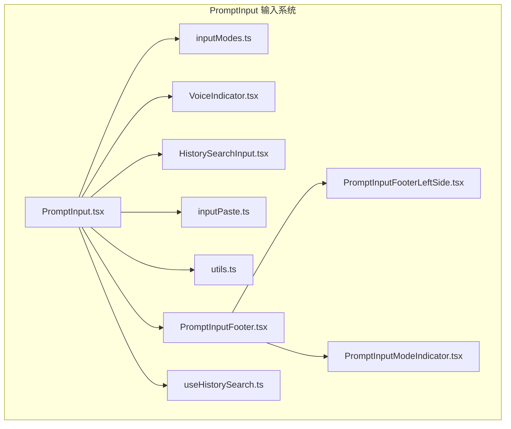
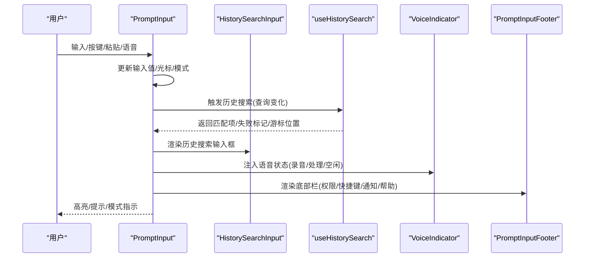
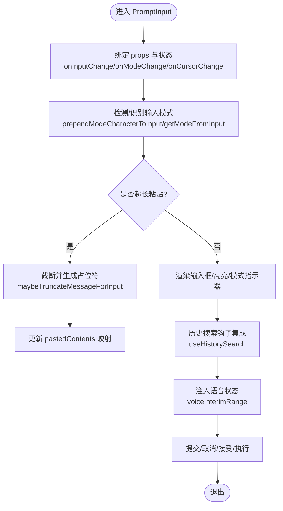
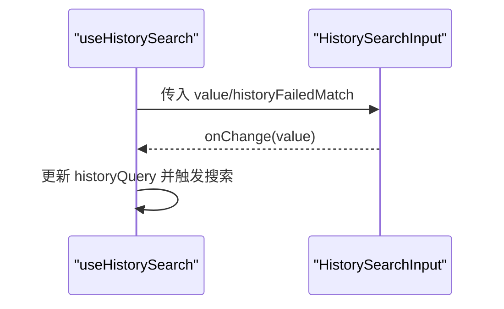
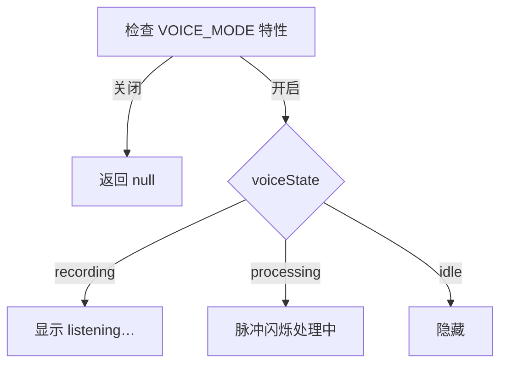
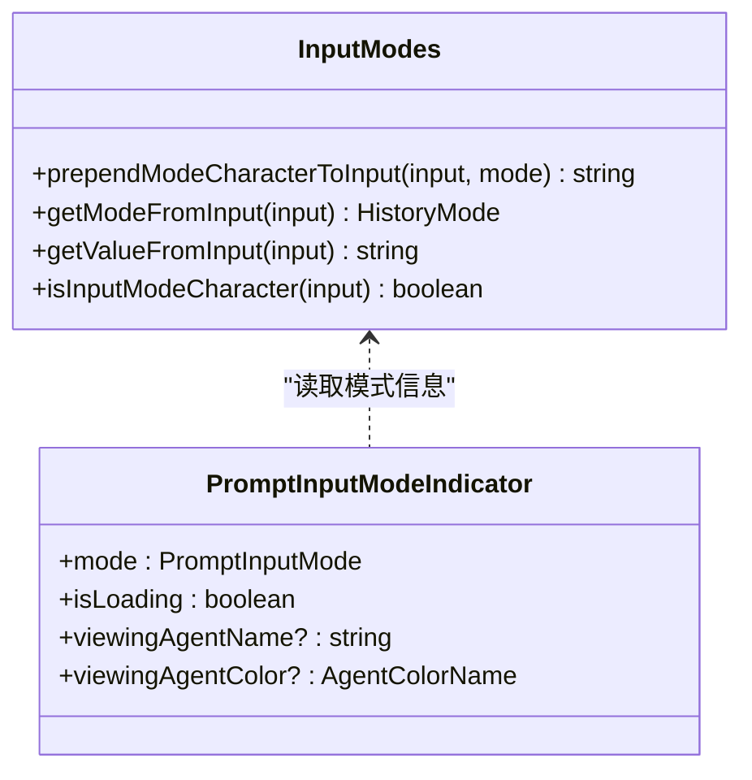
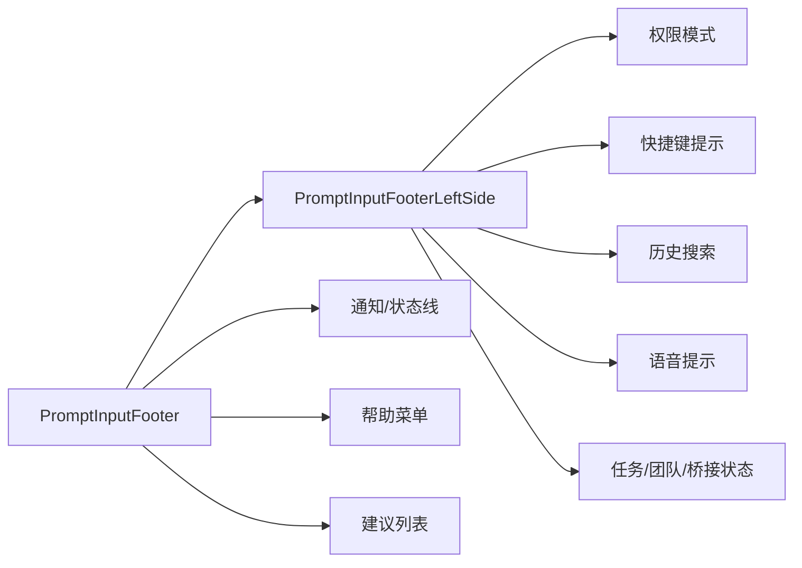
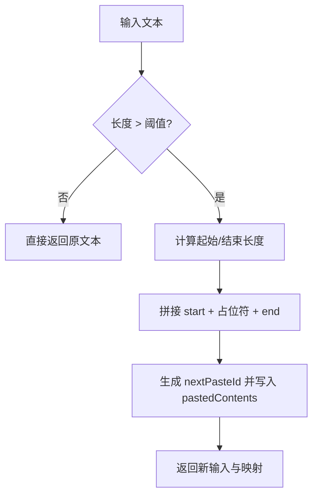
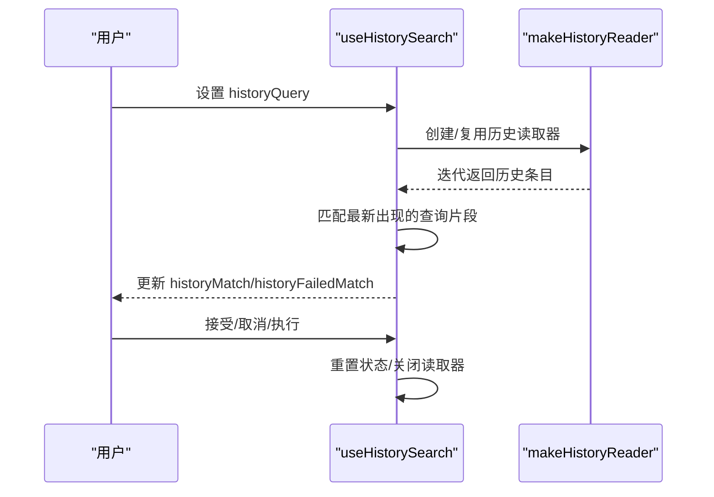
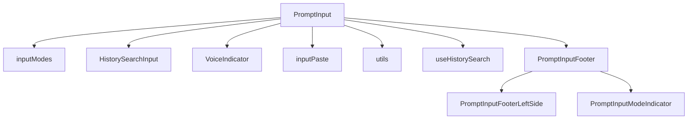

# 输入组件

<cite>
**本文档引用的文件**
- [PromptInput.tsx](file://src/components/PromptInput/PromptInput.tsx)
- [inputModes.ts](file://src/components/PromptInput/inputModes.ts)
- [VoiceIndicator.tsx](file://src/components/PromptInput/VoiceIndicator.tsx)
- [HistorySearchInput.tsx](file://src/components/PromptInput/HistorySearchInput.tsx)
- [inputPaste.ts](file://src/components/PromptInput/inputPaste.ts)
- [utils.ts](file://src/components/PromptInput/utils.ts)
- [PromptInputFooter.tsx](file://src/components/PromptInput/PromptInputFooter.tsx)
- [PromptInputModeIndicator.tsx](file://src/components/PromptInput/PromptInputModeIndicator.tsx)
- [PromptInputFooterLeftSide.tsx](file://src/components/PromptInput/PromptInputFooterLeftSide.tsx)
- [useHistorySearch.ts](file://src/hooks/useHistorySearch.ts)
</cite>

## 目录
1. [简介](#简介)
2. [项目结构](#项目结构)
3. [核心组件](#核心组件)
4. [架构总览](#架构总览)
5. [详细组件分析](#详细组件分析)
6. [依赖关系分析](#依赖关系分析)
7. [性能考量](#性能考量)
8. [故障排查指南](#故障排查指南)
9. [结论](#结论)
10. [附录](#附录)

## 简介
本文件系统性梳理输入组件体系，重点围绕 PromptInput 主输入组件及其配套子组件（历史搜索输入、语音指示器、快速模式提示、模式指示器、底部栏等），全面解析状态管理、事件处理、数据绑定、输入模式切换、验证与自动完成、粘贴处理以及可定制化配置与样式覆盖方法。目标是帮助开发者在不深入源码的情况下也能高效理解与使用该输入系统。

## 项目结构
输入组件主要位于 `src/components/PromptInput/` 目录下，围绕 PromptInput 核心组件构建了完整的输入体验闭环：顶部输入框、底部状态栏与快捷提示、历史检索、语音状态指示、模式切换与高亮提示等。

**图表来源**
- [PromptInput.tsx:194-237](file://src/components/PromptInput/PromptInput.tsx#L194-L237)
- [inputModes.ts:1-34](file://src/components/PromptInput/inputModes.ts#L1-L34)
- [VoiceIndicator.tsx:24-72](file://src/components/PromptInput/VoiceIndicator.tsx#L24-L72)
- [HistorySearchInput.tsx:11-48](file://src/components/PromptInput/HistorySearchInput.tsx#L11-L48)
- [inputPaste.ts:20-91](file://src/components/PromptInput/inputPaste.ts#L20-L91)
- [utils.ts:12-61](file://src/components/PromptInput/utils.ts#L12-L61)
- [PromptInputFooter.tsx:63-152](file://src/components/PromptInput/PromptInputFooter.tsx#L63-L152)
- [PromptInputFooterLeftSide.tsx:1-517](file://src/components/PromptInput/PromptInputFooterLeftSide.tsx#L1-L517)
- [PromptInputModeIndicator.tsx:63-92](file://src/components/PromptInput/PromptInputModeIndicator.tsx#L63-L92)
- [useHistorySearch.ts:15-33](file://src/hooks/useHistorySearch.ts#L15-L33)

**章节来源**
- [PromptInput.tsx:194-237](file://src/components/PromptInput/PromptInput.tsx#L194-L237)
- [PromptInputFooter.tsx:63-152](file://src/components/PromptInput/PromptInputFooter.tsx#L63-L152)

## 核心组件
- PromptInput 主输入组件：负责输入值与模式的双向绑定、光标位置管理、粘贴内容追踪、历史搜索集成、语音状态注入、快捷键与命令队列联动、底部栏渲染与导航、以及与外部提交流程的对接。
- inputModes 模式工具：提供模式字符前缀、从输入中提取“干净值”、识别模式字符等功能，支撑普通/快速模式切换。
- VoiceIndicator 语音指示器：根据录音/处理状态渲染“正在监听/处理中”的提示，并支持无障碍设置下的静态提示。
- HistorySearchInput 历史搜索输入框：在“搜索历史”模式下提供输入与高亮提示，支持失败匹配时的视觉反馈。
- inputPaste 粘贴处理：对超长文本进行截断与占位符插入，同时维护粘贴内容映射，避免输入过载。
- utils 工具集：包含 Vim 模式检测、换行提示文案生成、非空白可打印字符判断等辅助逻辑。
- PromptInputFooter 底部栏：整合任务/团队/桥接/伙伴等状态栏、通知、帮助菜单与建议列表展示。
- PromptInputFooterLeftSide 底部左侧区域：权限模式、快捷键提示、历史搜索交互、语音状态提示等。
- PromptInputModeIndicator 模式指示器：根据当前模式（普通/快速/bash）与是否在加载中显示不同的提示符号或颜色。
- useHistorySearch 历史搜索钩子：封装历史记录读取、匹配、游标定位、模式同步、取消/接受/执行等行为。

**章节来源**
- [PromptInput.tsx:124-189](file://src/components/PromptInput/PromptInput.tsx#L124-L189)
- [inputModes.ts:4-34](file://src/components/PromptInput/inputModes.ts#L4-L34)
- [VoiceIndicator.tsx:24-137](file://src/components/PromptInput/VoiceIndicator.tsx#L24-L137)
- [HistorySearchInput.tsx:11-51](file://src/components/PromptInput/HistorySearchInput.tsx#L11-L51)
- [inputPaste.ts:20-91](file://src/components/PromptInput/inputPaste.ts#L20-L91)
- [utils.ts:12-61](file://src/components/PromptInput/utils.ts#L12-L61)
- [PromptInputFooter.tsx:63-152](file://src/components/PromptInput/PromptInputFooter.tsx#L63-L152)
- [PromptInputFooterLeftSide.tsx:1-517](file://src/components/PromptInput/PromptInputFooterLeftSide.tsx#L1-L517)
- [PromptInputModeIndicator.tsx:63-92](file://src/components/PromptInput/PromptInputModeIndicator.tsx#L63-L92)
- [useHistorySearch.ts:15-33](file://src/hooks/useHistorySearch.ts#L15-L33)

## 架构总览
PromptInput 作为输入中枢，通过 props 与上下文状态驱动子组件渲染与交互；底部栏与模式指示器提供即时反馈；历史搜索与粘贴处理分别解决“输入复用”和“大文本安全”问题；语音指示器在支持特性下提供听写状态可视化。

**图表来源**
- [PromptInput.tsx:357-360](file://src/components/PromptInput/PromptInput.tsx#L357-L360)
- [useHistorySearch.ts:73-148](file://src/hooks/useHistorySearch.ts#L73-L148)
- [HistorySearchInput.tsx:11-48](file://src/components/PromptInput/HistorySearchInput.tsx#L11-L48)
- [VoiceIndicator.tsx:24-72](file://src/components/PromptInput/VoiceIndicator.tsx#L24-L72)
- [PromptInputFooter.tsx:138-151](file://src/components/PromptInput/PromptInputFooter.tsx#L138-L151)

## 详细组件分析

### PromptInput 主输入组件
- 状态管理
  - 内部状态：输入值、光标偏移、插入文本引用、粘贴内容映射、自动更新状态、退出消息、语音临时范围等。
  - 外部状态：通过 props 接收模式、消息、工具权限上下文、提交回调等；与 AppStateStore/状态选择器联动。
- 事件处理
  - 键盘输入、粘贴、双击、光标移动、全屏点击等事件统一由 Ink 的 useInput/useKeybinding 驱动。
  - 插入文本引用允许 STT 等外部来源以“在光标处拼接而非替换”的方式注入文本。
- 数据绑定
  - 双向绑定：onInputChange/onModeChange/onCursorChange 等回调确保外部状态与内部状态一致。
  - 粘贴内容映射：pastedContents 与 nextPasteIdRef 协作，保证超长文本被截断并保留引用。
- 输入模式切换
  - 普通/快速/bash 模式：通过 inputModes 工具与模式指示器联动；支持从输入中识别模式字符。
- 历史搜索集成
  - 使用 useHistorySearch 钩子实现“搜索历史→高亮匹配→定位光标→接受/取消/执行”的完整流程。
- 语音状态注入
  - 通过 voiceInterimRange 将语音转写中的临时片段以“弱化高亮”方式呈现，避免干扰用户输入。
- 自动完成与验证
  - 通过组合高亮与触发词（如 /command、@mention、关键词高亮）提供上下文感知的输入提示。
- 粘贴处理
  - 超长文本截断为“开始+占位符+结尾”，占位符以 [文本省略 +N 行] 形式存在，同时保留原始片段以便后续展开或替换。

**图表来源**
- [PromptInput.tsx:262-285](file://src/components/PromptInput/PromptInput.tsx#L262-L285)
- [inputModes.ts:4-34](file://src/components/PromptInput/inputModes.ts#L4-L34)
- [inputPaste.ts:20-91](file://src/components/PromptInput/inputPaste.ts#L20-L91)
- [useHistorySearch.ts:73-235](file://src/hooks/useHistorySearch.ts#L73-L235)
- [VoiceIndicator.tsx:24-72](file://src/components/PromptInput/VoiceIndicator.tsx#L24-L72)

**章节来源**
- [PromptInput.tsx:194-800](file://src/components/PromptInput/PromptInput.tsx#L194-L800)
- [inputModes.ts:4-34](file://src/components/PromptInput/inputModes.ts#L4-L34)
- [inputPaste.ts:20-91](file://src/components/PromptInput/inputPaste.ts#L20-L91)
- [useHistorySearch.ts:73-235](file://src/hooks/useHistorySearch.ts#L73-L235)
- [VoiceIndicator.tsx:24-72](file://src/components/PromptInput/VoiceIndicator.tsx#L24-L72)

### 历史搜索输入 HistorySearchInput
- 功能要点
  - 在“搜索历史”模式下渲染带提示的输入框，失败时显示“无匹配”提示。
  - 自适应宽度，强制光标置于末尾，避免导航键影响搜索。
- 交互流程
  - 由 useHistorySearch 提供查询值与变更回调，HistorySearchInput 仅负责 UI 层渲染。

**图表来源**
- [HistorySearchInput.tsx:11-48](file://src/components/PromptInput/HistorySearchInput.tsx#L11-L48)
- [useHistorySearch.ts:27-33](file://src/hooks/useHistorySearch.ts#L27-L33)

**章节来源**
- [HistorySearchInput.tsx:11-51](file://src/components/PromptInput/HistorySearchInput.tsx#L11-L51)
- [useHistorySearch.ts:27-33](file://src/hooks/useHistorySearch.ts#L27-L33)

### 语音指示器 VoiceIndicator
- 功能要点
  - 支持特性开关：feature("VOICE_MODE") 控制是否渲染。
  - 三种状态：录音中（弱化提示）、处理中（脉冲闪烁）、空闲（隐藏）。
  - 处理中状态支持无障碍设置，降级为静态文本提示。
- 渲染策略
  - 使用 useAnimationFrame 实现脉冲动画；根据设置决定是否启用。

**图表来源**
- [VoiceIndicator.tsx:24-137](file://src/components/PromptInput/VoiceIndicator.tsx#L24-L137)

**章节来源**
- [VoiceIndicator.tsx:24-137](file://src/components/PromptInput/VoiceIndicator.tsx#L24-L137)

### 输入模式与模式指示器
- 模式识别
  - 通过 inputModes 工具识别“!”开头的 bash 快速模式；普通模式则去除模式字符。
- 模式指示器
  - 普通模式：显示指针符号，加载中时弱化。
  - bash 模式：显示“!”符号，配合主题色。
  - 团队模式：根据查看中的代理颜色动态着色。

**图表来源**
- [inputModes.ts:4-34](file://src/components/PromptInput/inputModes.ts#L4-L34)
- [PromptInputModeIndicator.tsx:63-92](file://src/components/PromptInput/PromptInputModeIndicator.tsx#L63-L92)

**章节来源**
- [inputModes.ts:4-34](file://src/components/PromptInput/inputModes.ts#L4-L34)
- [PromptInputModeIndicator.tsx:63-92](file://src/components/PromptInput/PromptInputModeIndicator.tsx#L63-L92)

### 底部栏与左侧区域
- PromptInputFooter
  - 统一承载通知、状态线、帮助菜单、建议列表等；在全屏环境下将建议数据传递给覆盖层。
- PromptInputFooterLeftSide
  - 权限模式符号与标题、快捷键提示、历史搜索入口、语音状态提示、任务/团队/桥接状态等。
  - 支持窄屏布局折叠，适配不同终端尺寸。

**图表来源**
- [PromptInputFooter.tsx:63-152](file://src/components/PromptInput/PromptInputFooter.tsx#L63-L152)
- [PromptInputFooterLeftSide.tsx:1-517](file://src/components/PromptInput/PromptInputFooterLeftSide.tsx#L1-L517)

**章节来源**
- [PromptInputFooter.tsx:63-152](file://src/components/PromptInput/PromptInputFooter.tsx#L63-L152)
- [PromptInputFooterLeftSide.tsx:1-517](file://src/components/PromptInput/PromptInputFooterLeftSide.tsx#L1-L517)

### 粘贴处理与截断
- 截断策略
  - 超过阈值（字符数）的文本被截断为“起始部分 + 占位符 + 结束部分”，占位符包含省略行数信息。
- 占位符映射
  - 新增 nextPasteId 并将原始片段存入 pastedContents，便于后续展开或替换。
- 输入更新
  - 返回新的输入文本与粘贴映射，保持一致性。

**图表来源**
- [inputPaste.ts:20-91](file://src/components/PromptInput/inputPaste.ts#L20-L91)

**章节来源**
- [inputPaste.ts:20-91](file://src/components/PromptInput/inputPaste.ts#L20-L91)

### 历史搜索钩子 useHistorySearch
- 关键职责
  - 启动/暂停/恢复历史搜索；在搜索过程中持续读取历史记录并匹配最近一次出现的查询片段。
  - 同步模式与光标位置到“干净值”（去除模式字符后的值）。
  - 提供接受/取消/执行等操作，支持中断与资源释放。
- 交互约束
  - 当查询为空时，恢复原始输入、模式与粘贴内容。
  - 查询变化时自动重启搜索并支持中断。

**图表来源**
- [useHistorySearch.ts:73-148](file://src/hooks/useHistorySearch.ts#L73-L148)
- [useHistorySearch.ts:172-235](file://src/hooks/useHistorySearch.ts#L172-L235)

**章节来源**
- [useHistorySearch.ts:15-33](file://src/hooks/useHistorySearch.ts#L15-L33)
- [useHistorySearch.ts:73-148](file://src/hooks/useHistorySearch.ts#L73-L148)
- [useHistorySearch.ts:172-235](file://src/hooks/useHistorySearch.ts#L172-L235)

## 依赖关系分析
- 组件耦合
  - PromptInput 对 inputModes、useHistorySearch、VoiceIndicator、inputPaste、utils 等模块存在直接依赖。
  - 底部栏组件通过状态与 props 与 PromptInput 解耦，但共享 AppStateStore。
- 外部依赖
  - Ink 渲染框架（Box/Text/Link/键盘事件）。
  - 状态管理（AppState/AppStateStore）与选择器。
  - 键盘快捷键系统（useKeybinding/useKeybindings）。
- 潜在循环依赖
  - 组件间通过 props 与回调传递，未见直接循环导入；历史搜索通过钩子抽象降低耦合。

**图表来源**
- [PromptInput.tsx:112-123](file://src/components/PromptInput/PromptInput.tsx#L112-L123)
- [PromptInputFooter.tsx:22-26](file://src/components/PromptInput/PromptInputFooter.tsx#L22-L26)
- [PromptInputFooterLeftSide.tsx:28-38](file://src/components/PromptInput/PromptInputFooterLeftSide.tsx#L28-L38)

**章节来源**
- [PromptInput.tsx:112-123](file://src/components/PromptInput/PromptInput.tsx#L112-L123)
- [PromptInputFooter.tsx:22-26](file://src/components/PromptInput/PromptInputFooter.tsx#L22-L26)
- [PromptInputFooterLeftSide.tsx:28-38](file://src/components/PromptInput/PromptInputFooterLeftSide.tsx#L28-L38)

## 性能考量
- 历史搜索
  - 使用异步迭代器逐条读取历史，命中后立即停止；查询为空时及时释放资源，避免文件句柄泄漏。
  - 通过 AbortController 支持中断，减少不必要的 IO 开销。
- 文本截断
  - 截断阈值与预览长度合理设置，避免在超长文本上做重复扫描。
- 渲染优化
  - 多处使用 useMemo/useCallback 缓存计算结果，减少不必要的重渲染。
  - 语音处理采用 useAnimationFrame，结合无障碍设置降级，平衡性能与体验。

[本节为通用指导，无需特定文件引用]

## 故障排查指南
- 历史搜索无响应
  - 检查 useHistorySearch 的 isActive 上下文与 feature(HISTORY_PICKER) 状态；确认查询变化是否触发搜索重启。
  - 若 backspace 导致取消，请确认 handleKeyDown 的条件分支已生效。
- 语音状态不显示
  - 确认 feature("VOICE_MODE") 已启用；处理中状态在无障碍设置下会降级为静态文本。
- 模式切换异常
  - 检查输入是否以“!”开头；确认 inputModes 的 getModeFromInput/getValueFromInput 是否正确工作。
- 粘贴内容过多导致卡顿
  - 确认截断逻辑已触发；检查 pastedContents 映射是否正确更新。
- 底部栏不显示或错位
  - 检查 PromptInputFooter 的 isFullscreen 与 narrow 判断；确认 overlayData 是否正确传递。

**章节来源**
- [useHistorySearch.ts:238-279](file://src/hooks/useHistorySearch.ts#L238-L279)
- [VoiceIndicator.tsx:26-38](file://src/components/PromptInput/VoiceIndicator.tsx#L26-L38)
- [inputModes.ts:16-33](file://src/components/PromptInput/inputModes.ts#L16-L33)
- [inputPaste.ts:61-91](file://src/components/PromptInput/inputPaste.ts#L61-L91)
- [PromptInputFooter.tsx:109-129](file://src/components/PromptInput/PromptInputFooter.tsx#L109-L129)

## 结论
输入组件系统以 PromptInput 为核心，围绕模式识别、历史搜索、语音状态、粘贴安全与底部栏反馈构建了完整的输入体验。通过钩子与工具模块解耦关键流程，借助状态管理与快捷键系统提升可用性。遵循本文档的配置与样式覆盖建议，可在不破坏整体架构的前提下实现定制化需求。

[本节为总结性内容，无需特定文件引用]

## 附录

### 输入模式切换机制
- 普通模式：默认输入，无前缀。
- 快速模式：以“!”开头，对应 bash 模式；模式指示器显示“!”符号。
- 模式识别与转换：通过 inputModes 工具在输入前后进行转换，确保 UI 与逻辑一致。

**章节来源**
- [inputModes.ts:4-34](file://src/components/PromptInput/inputModes.ts#L4-L34)
- [PromptInputModeIndicator.tsx:63-92](file://src/components/PromptInput/PromptInputModeIndicator.tsx#L63-L92)

### 输入验证与自动完成
- 触发词高亮：/command、@mention、关键词（如 ultraplan/ultrareview/thinking）等按规则高亮。
- 光标定位：在历史搜索匹配时，将光标定位到“干净值”中的匹配位置。
- 建议列表：在非全屏环境下直接展示建议列表；全屏环境下通过覆盖层传递数据。

**章节来源**
- [PromptInput.tsx:509-741](file://src/components/PromptInput/PromptInput.tsx#L509-L741)
- [PromptInputFooter.tsx:124-134](file://src/components/PromptInput/PromptInputFooter.tsx#L124-L134)

### 粘贴处理与安全
- 截断阈值与预览长度：超过阈值时截断为“起始+占位符+结尾”，占位符包含省略行数。
- 占位符映射：新增 nextPasteId 并写入 pastedContents，便于后续展开或替换。
- 输入更新：返回新的输入文本与粘贴映射，保持一致性。

**章节来源**
- [inputPaste.ts:20-91](file://src/components/PromptInput/inputPaste.ts#L20-L91)

### 定制化配置与样式覆盖
- 模式指示器颜色：根据代理颜色或主题色动态调整。
- 无障碍设置：语音处理状态在 reduce motion 下降级为静态文本。
- 底部栏布局：窄屏与全屏下自适应布局，必要时隐藏状态线以节省空间。
- 快捷键提示：基于 useShortcutDisplay 生成平台相关的换行提示与快捷键显示。

**章节来源**
- [PromptInputModeIndicator.tsx:21-33](file://src/components/PromptInput/PromptInputModeIndicator.tsx#L21-L33)
- [VoiceIndicator.tsx:96-106](file://src/components/PromptInput/VoiceIndicator.tsx#L96-L106)
- [PromptInputFooter.tsx:105-111](file://src/components/PromptInput/PromptInputFooter.tsx#L105-L111)
- [utils.ts:17-32](file://src/components/PromptInput/utils.ts#L17-L32)