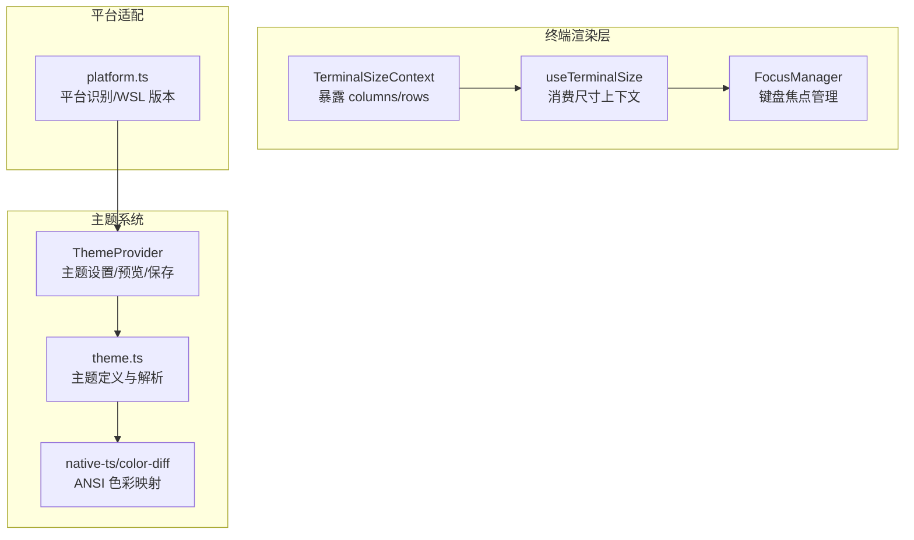
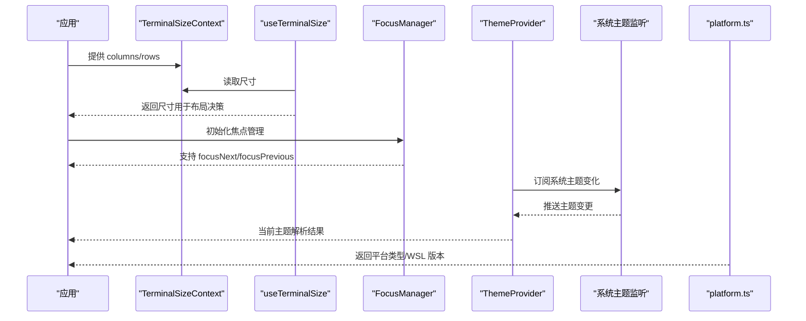
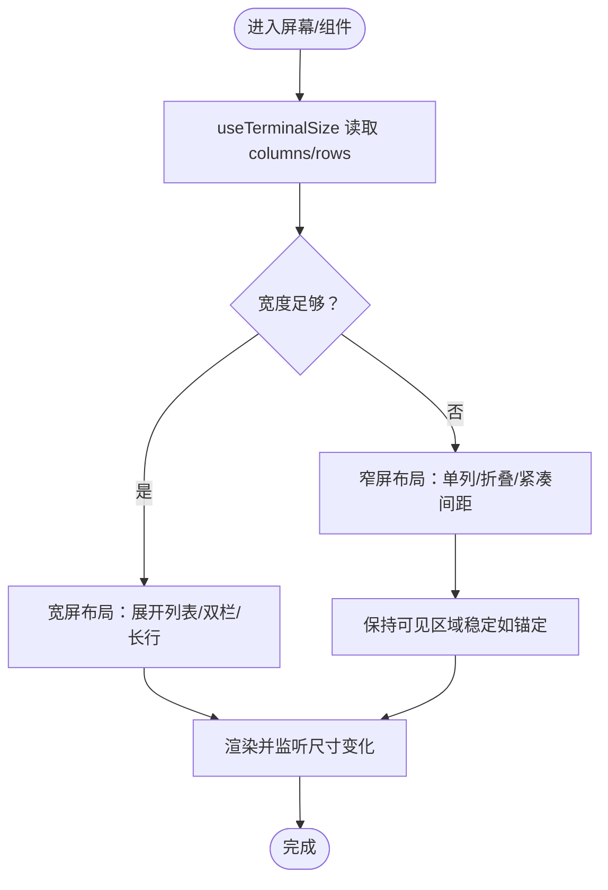
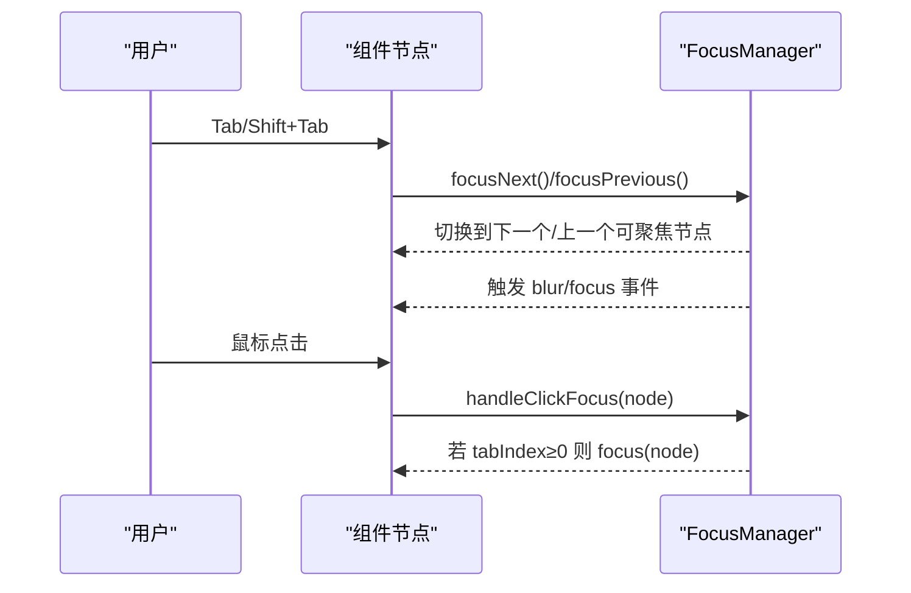
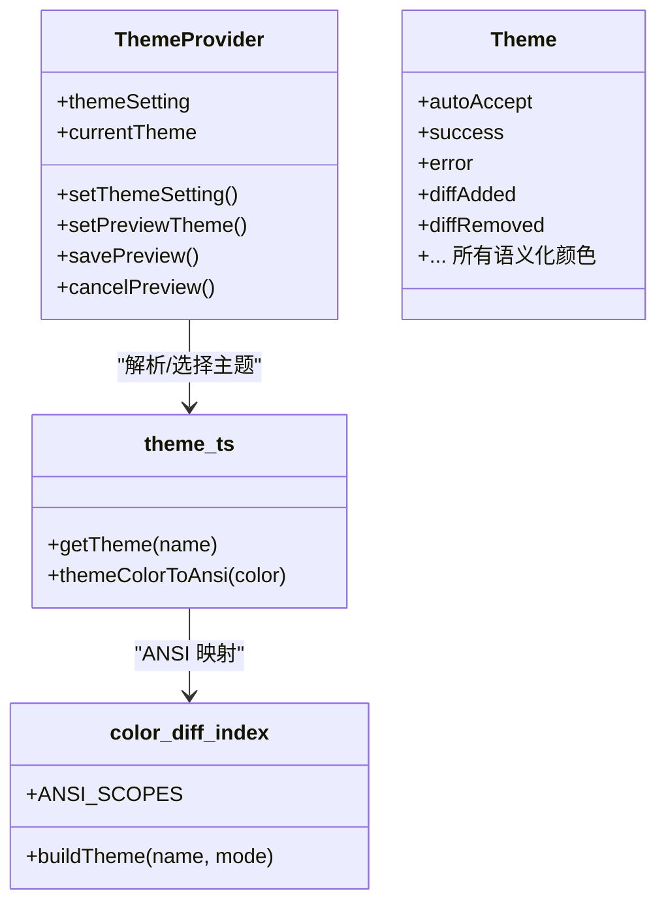
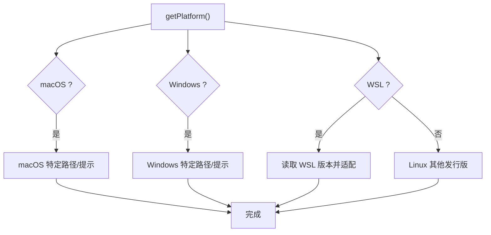
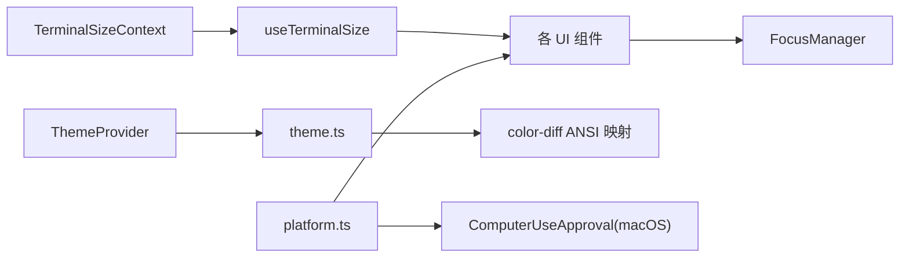

# 响应式设计与无障碍访问

<cite>
**本文引用的文件**
- [src/ink/components/TerminalSizeContext.tsx](file://src/ink/components/TerminalSizeContext.tsx)
- [src/hooks/useTerminalSize.ts](file://src/hooks/useTerminalSize.ts)
- [src/ink/focus.ts](file://src/ink/focus.ts)
- [src/utils/theme.ts](file://src/utils/theme.ts)
- [src/components/design-system/ThemeProvider.tsx](file://src/components/design-system/ThemeProvider.tsx)
- [src/utils/platform.ts](file://src/utils/platform.ts)
- [src/native-ts/color-diff/index.ts](file://src/native-ts/color-diff/index.ts)
- [src/screens/REPL.tsx](file://src/screens/REPL.tsx)
- [src/components/permissions/ComputerUseApproval/ComputerUseApproval.tsx](file://src/components/permissions/ComputerUseApproval/ComputerUseApproval.tsx)
</cite>

## 目录
1. [简介](#简介)
2. [项目结构](#项目结构)
3. [核心组件](#核心组件)
4. [架构总览](#架构总览)
5. [详细组件分析](#详细组件分析)
6. [依赖关系分析](#依赖关系分析)
7. [性能考量](#性能考量)
8. [故障排查指南](#故障排查指南)
9. [结论](#结论)
10. [附录](#附录)

## 简介
本文件聚焦于终端环境下的响应式设计与无障碍访问实践，结合代码库中的终端渲染框架、主题系统与平台适配能力，系统阐述以下主题：
- 终端尺寸感知与布局自适应策略
- 键盘焦点管理与交互可达性
- 主题系统对无障碍的支持（颜色对比度、色觉友好与真彩/ANSI回退）
- 平台差异处理（Windows、macOS、WSL/Linux）
- 无障碍测试方法与工具建议
- 实际改进案例与最佳实践

## 项目结构
本项目采用基于 Ink 的终端 UI 渲染体系，围绕“上下文感知 + 主题系统 + 平台探测”的架构组织响应式与无障碍能力：
- 终端尺寸上下文：通过上下文暴露列数/行数，供组件按需自适应
- 焦点管理：在终端 DOM 树中模拟浏览器焦点行为，支持 Tab 导航与自动聚焦
- 主题系统：内置多套主题（含色觉友好与 ANSI 回退），支持系统主题联动
- 平台探测：识别 Windows/macOS/WSL/Linux，为差异化行为提供依据

**图表来源**
- [src/ink/components/TerminalSizeContext.tsx:1-7](file://src/ink/components/TerminalSizeContext.tsx#L1-L7)
- [src/hooks/useTerminalSize.ts:1-16](file://src/hooks/useTerminalSize.ts#L1-L16)
- [src/ink/focus.ts:1-182](file://src/ink/focus.ts#L1-L182)
- [src/components/design-system/ThemeProvider.tsx:61-138](file://src/components/design-system/ThemeProvider.tsx#L61-L138)
- [src/utils/theme.ts:1-640](file://src/utils/theme.ts#L1-L640)
- [src/native-ts/color-diff/index.ts:267-331](file://src/native-ts/color-diff/index.ts#L267-L331)
- [src/utils/platform.ts:1-151](file://src/utils/platform.ts#L1-L151)

**章节来源**
- [src/ink/components/TerminalSizeContext.tsx:1-7](file://src/ink/components/TerminalSizeContext.tsx#L1-L7)
- [src/hooks/useTerminalSize.ts:1-16](file://src/hooks/useTerminalSize.ts#L1-L16)
- [src/ink/focus.ts:1-182](file://src/ink/focus.ts#L1-L182)
- [src/utils/theme.ts:1-640](file://src/utils/theme.ts#L1-L640)
- [src/components/design-system/ThemeProvider.tsx:61-138](file://src/components/design-system/ThemeProvider.tsx#L61-L138)
- [src/native-ts/color-diff/index.ts:267-331](file://src/native-ts/color-diff/index.ts#L267-L331)
- [src/utils/platform.ts:1-151](file://src/utils/platform.ts#L1-L151)

## 核心组件
- 终端尺寸上下文与 Hook：提供 columns/rows，便于组件根据终端宽度动态调整布局与换行策略
- 焦点管理器：在终端 DOM 中维护 activeElement 与焦点栈，支持 Tab/Shift+Tab 循环与点击聚焦
- 主题系统：提供亮/暗、色觉友好、ANSI 回退等主题；支持“跟随系统”模式与预览保存
- 平台探测：识别 macOS/Windows/WSL/Linux，并可读取 WSL 版本信息

**章节来源**
- [src/ink/components/TerminalSizeContext.tsx:1-7](file://src/ink/components/TerminalSizeContext.tsx#L1-L7)
- [src/hooks/useTerminalSize.ts:1-16](file://src/hooks/useTerminalSize.ts#L1-L16)
- [src/ink/focus.ts:1-182](file://src/ink/focus.ts#L1-L182)
- [src/utils/theme.ts:1-640](file://src/utils/theme.ts#L1-L640)
- [src/components/design-system/ThemeProvider.tsx:61-138](file://src/components/design-system/ThemeProvider.tsx#L61-L138)
- [src/utils/platform.ts:1-151](file://src/utils/platform.ts#L1-L151)

## 架构总览
下图展示从“尺寸感知—焦点管理—主题应用—平台适配”的关键流程：

**图表来源**
- [src/ink/components/TerminalSizeContext.tsx:1-7](file://src/ink/components/TerminalSizeContext.tsx#L1-L7)
- [src/hooks/useTerminalSize.ts:1-16](file://src/hooks/useTerminalSize.ts#L1-L16)
- [src/ink/focus.ts:1-182](file://src/ink/focus.ts#L1-L182)
- [src/components/design-system/ThemeProvider.tsx:61-138](file://src/components/design-system/ThemeProvider.tsx#L61-L138)
- [src/utils/platform.ts:1-151](file://src/utils/platform.ts#L1-L151)

## 详细组件分析

### 终端尺寸感知与响应式布局
- 设计要点
  - 使用上下文暴露 columns/rows，组件通过 Hook 获取后决定是否换行、截断或折叠
  - 在 REPL 等长文本场景，结合滚动锚定与搜索状态，避免因窗口收缩导致的可见区域丢失
- 关键实现位置
  - 上下文定义与 Hook 消费
  - REPL 屏幕中的搜索与滚动锚定逻辑，体现对小窗口的适配

**图表来源**
- [src/hooks/useTerminalSize.ts:1-16](file://src/hooks/useTerminalSize.ts#L1-L16)
- [src/ink/components/TerminalSizeContext.tsx:1-7](file://src/ink/components/TerminalSizeContext.tsx#L1-L7)
- [src/screens/REPL.tsx:4199-4226](file://src/screens/REPL.tsx#L4199-L4226)

**章节来源**
- [src/hooks/useTerminalSize.ts:1-16](file://src/hooks/useTerminalSize.ts#L1-L16)
- [src/ink/components/TerminalSizeContext.tsx:1-7](file://src/ink/components/TerminalSizeContext.tsx#L1-L7)
- [src/screens/REPL.tsx:4199-4226](file://src/screens/REPL.tsx#L4199-L4226)

### 键盘焦点管理与可达性
- 设计要点
  - 在终端 UI 中模拟浏览器焦点语义：activeElement、blur/focus 事件、焦点栈
  - 支持 Tab/Shift+Tab 循环遍历可聚焦元素（tabIndex≥0）
  - 点击时根据 tabIndex 自动聚焦，提升触控/鼠标辅助场景的可达性
- 关键实现位置
  - FocusManager 的焦点切换、栈管理与树遍历

**图表来源**
- [src/ink/focus.ts:1-182](file://src/ink/focus.ts#L1-L182)

**章节来源**
- [src/ink/focus.ts:1-182](file://src/ink/focus.ts#L1-L182)

### 主题系统与无障碍支持
- 设计要点
  - 多主题覆盖：亮/暗、色觉友好（daltonized）、仅 ANSI（light/dark-ansi）
  - “跟随系统”模式：自动监听系统深浅主题并即时切换
  - 颜色对比度与可辨识性：针对色觉障碍者优化色彩组合，避免易混淆的红/绿搭配
  - 真彩/ANSI 回退：在不支持真彩的终端中使用 ANSI 16 调色板
- 关键实现位置
  - 主题定义与解析
  - 主题提供器与系统主题监听
  - ANSI 色彩映射与真彩回退

**图表来源**
- [src/components/design-system/ThemeProvider.tsx:61-138](file://src/components/design-system/ThemeProvider.tsx#L61-L138)
- [src/utils/theme.ts:1-640](file://src/utils/theme.ts#L1-L640)
- [src/native-ts/color-diff/index.ts:267-331](file://src/native-ts/color-diff/index.ts#L267-L331)

**章节来源**
- [src/utils/theme.ts:1-640](file://src/utils/theme.ts#L1-L640)
- [src/components/design-system/ThemeProvider.tsx:61-138](file://src/components/design-system/ThemeProvider.tsx#L61-L138)
- [src/native-ts/color-diff/index.ts:267-331](file://src/native-ts/color-diff/index.ts#L267-L331)

### 平台特定适配（Windows/macOS/WSL/Linux）
- 设计要点
  - 识别平台类型与 WSL 版本，为权限弹窗、快捷键提示与系统集成提供差异化处理
  - macOS 权限面板针对“辅助功能/屏幕录制”进行引导
- 关键实现位置
  - 平台识别与 WSL 版本检测
  - macOS 权限引导对话框

**图表来源**
- [src/utils/platform.ts:1-151](file://src/utils/platform.ts#L1-L151)
- [src/components/permissions/ComputerUseApproval/ComputerUseApproval.tsx:50-154](file://src/components/permissions/ComputerUseApproval/ComputerUseApproval.tsx#L50-L154)

**章节来源**
- [src/utils/platform.ts:1-151](file://src/utils/platform.ts#L1-L151)
- [src/components/permissions/ComputerUseApproval/ComputerUseApproval.tsx:50-154](file://src/components/permissions/ComputerUseApproval/ComputerUseApproval.tsx#L50-L154)

## 依赖关系分析
- 尺寸感知依赖 Ink 上下文与 React Context
- 焦点管理独立于 UI 结构，仅依赖 DOM 元素属性与树遍历
- 主题系统依赖系统主题监听与 ANSI 映射模块
- 平台探测与权限弹窗存在耦合，用于在 macOS 上提供系统设置入口

**图表来源**
- [src/ink/components/TerminalSizeContext.tsx:1-7](file://src/ink/components/TerminalSizeContext.tsx#L1-L7)
- [src/hooks/useTerminalSize.ts:1-16](file://src/hooks/useTerminalSize.ts#L1-L16)
- [src/ink/focus.ts:1-182](file://src/ink/focus.ts#L1-L182)
- [src/components/design-system/ThemeProvider.tsx:61-138](file://src/components/design-system/ThemeProvider.tsx#L61-L138)
- [src/utils/theme.ts:1-640](file://src/utils/theme.ts#L1-L640)
- [src/native-ts/color-diff/index.ts:267-331](file://src/native-ts/color-diff/index.ts#L267-L331)
- [src/utils/platform.ts:1-151](file://src/utils/platform.ts#L1-L151)
- [src/components/permissions/ComputerUseApproval/ComputerUseApproval.tsx:50-154](file://src/components/permissions/ComputerUseApproval/ComputerUseApproval.tsx#L50-L154)

**章节来源**
- 同“图表来源”所列文件

## 性能考量
- 尺寸感知
  - 使用 Context 避免逐层传递，但需注意频繁 resize 时的重渲染成本；可通过节流/防抖或最小化订阅范围降低开销
- 焦点管理
  - 树遍历与焦点栈长度有限制（固定最大栈深），避免在超大 DOM 中产生过多计算
- 主题系统
  - ANSI 回退与真彩转换在大量文本渲染时可能带来额外开销；建议在大数据量场景下优先使用 ANSI 主题
- 平台探测
  - 对 /proc/version 等文件的读取应缓存结果，避免重复 IO

[本节为通用指导，无需列出具体文件来源]

## 故障排查指南
- 焦点无法循环或点击无响应
  - 检查节点是否设置有效的 tabIndex（≥0）
  - 确认 FocusManager 已启用且未被禁用
- 主题切换无效或闪烁
  - 确认“跟随系统”模式已启用且系统主题监听正常
  - 检查 ANSI/真彩终端兼容性，必要时切换至 ANSI 主题
- macOS 权限弹窗无法打开系统设置
  - 确认系统偏好设置 URL 可用，或改为手动引导用户打开对应面板
- 小窗口显示异常
  - 检查 useTerminalSize 是否正确消费尺寸
  - 在 REPL 等场景确认锚定逻辑是否生效

**章节来源**
- [src/ink/focus.ts:1-182](file://src/ink/focus.ts#L1-L182)
- [src/components/design-system/ThemeProvider.tsx:61-138](file://src/components/design-system/ThemeProvider.tsx#L61-L138)
- [src/utils/theme.ts:1-640](file://src/utils/theme.ts#L1-L640)
- [src/components/permissions/ComputerUseApproval/ComputerUseApproval.tsx:50-154](file://src/components/permissions/ComputerUseApproval/ComputerUseApproval.tsx#L50-L154)
- [src/hooks/useTerminalSize.ts:1-16](file://src/hooks/useTerminalSize.ts#L1-L16)
- [src/screens/REPL.tsx:4199-4226](file://src/screens/REPL.tsx#L4199-L4226)

## 结论
本项目在终端环境中实现了较为完善的响应式与无障碍基础：
- 尺寸感知与焦点管理为小窗口与键盘可达性提供了坚实支撑
- 主题系统覆盖多场景与多平台，兼顾真彩与 ANSI 回退
- 平台探测与 macOS 权限引导提升了跨平台可用性

建议持续关注：
- 更细粒度的尺寸断点与布局策略
- 无障碍测试自动化与覆盖率
- 在大数据量场景下的渲染性能优化

[本节为总结性内容，无需列出具体文件来源]

## 附录

### 无障碍测试方法与工具推荐
- 人工测试
  - 键盘导航：Tab/Shift+Tab 循环、Esc/Enter 行为、快捷键提示可见性
  - 屏幕阅读器：NVDA/VO/Orca（若在桌面终端可用），验证标签与语义化结构
  - 高对比度：启用系统高对比度模式，验证文本与图标可辨识
- 自动化测试
  - 结构化快照：记录渲染输出，确保布局一致性
  - 可达性扫描：在可运行环境下使用 axe-core 或 similar 工具（需适配终端上下文）
- 终端特性验证
  - 真彩/ANSI：在 iTerm2/Windows Terminal/Apple Terminal 等不同终端验证主题效果
  - 字体缩放：在不同 DPI 下观察文本清晰度与行高

[本节为通用指导，无需列出具体文件来源]

### 实际改进案例与最佳实践
- 案例一：REPL 搜索与滚动锚定
  - 场景：在小窗口中输入搜索时，锚定当前滚动位置，避免匹配消失导致的可视区域跳变
  - 实施：在打开搜索条前记录 scrollTop，并在关闭后恢复
  - 参考位置：[src/screens/REPL.tsx:4199-4226](file://src/screens/REPL.tsx#L4199-L4226)
- 案例二：macOS 权限引导
  - 场景：当需要辅助功能/屏幕录制权限时，直接打开系统设置面板
  - 实施：在权限不足时提供“打开系统设置”选项，减少用户操作步骤
  - 参考位置：[src/components/permissions/ComputerUseApproval/ComputerUseApproval.tsx:50-154](file://src/components/permissions/ComputerUseApproval/ComputerUseApproval.tsx#L50-L154)
- 最佳实践清单
  - 为所有交互元素提供明确的 tabIndex 与键盘快捷键提示
  - 在小窗口优先保证核心信息可见，次级信息可折叠
  - 使用色觉友好主题作为默认选项之一，确保对比度满足 WCAG 基本要求
  - 在不支持真彩的终端中自动回退到 ANSI 主题，避免渲染异常

**章节来源**
- [src/screens/REPL.tsx:4199-4226](file://src/screens/REPL.tsx#L4199-L4226)
- [src/components/permissions/ComputerUseApproval/ComputerUseApproval.tsx:50-154](file://src/components/permissions/ComputerUseApproval/ComputerUseApproval.tsx#L50-L154)