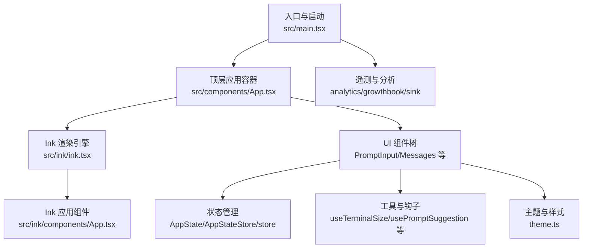
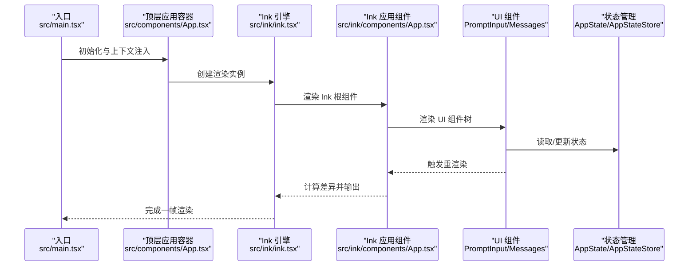
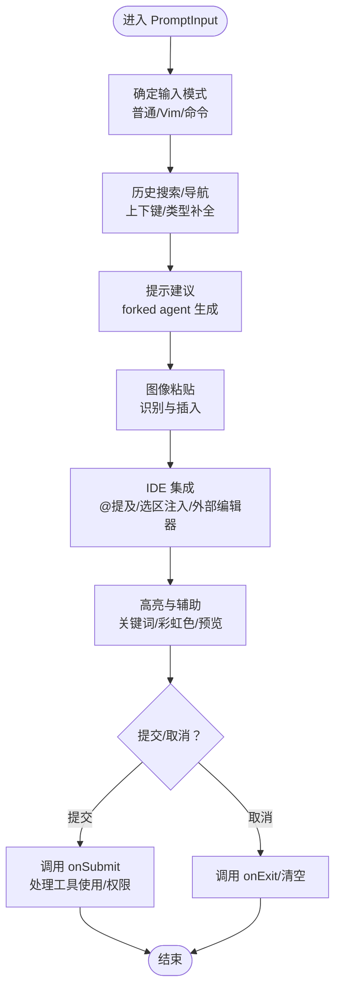
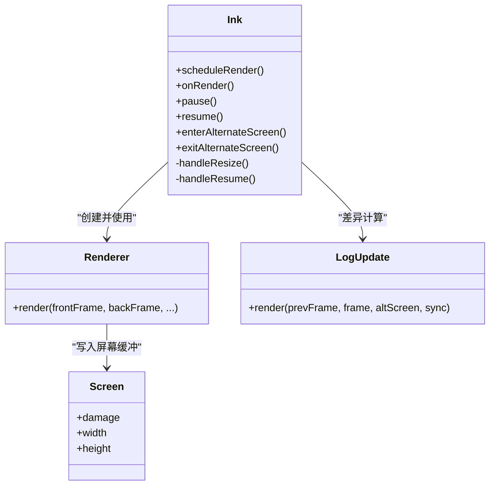
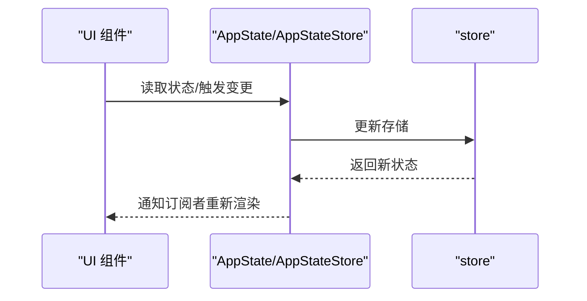
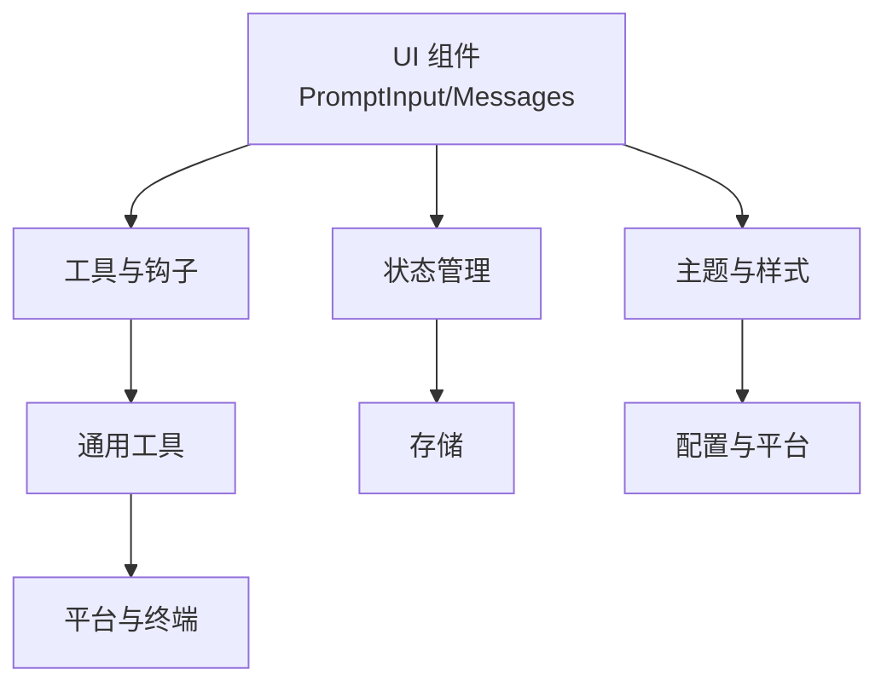

# 用户界面系统

<cite>
**本文档引用的文件**
- [src/main.tsx](file://src/main.tsx)
- [src/ink/ink.tsx](file://src/ink/ink.tsx)
- [src/ink/components/App.tsx](file://src/ink/components/App.tsx)
- [src/components/App.tsx](file://src/components/App.tsx)
- [src/components/PromptInput/PromptInput.tsx](file://src/components/PromptInput/PromptInput.tsx)
- [src/components/Messages.tsx](file://src/components/Messages.tsx)
- [src/state/AppState.tsx](file://src/state/AppState.tsx)
- [src/state/AppStateStore.ts](file://src/state/AppStateStore.ts)
- [src/state/store.ts](file://src/state/store.ts)
- [src/context/stats.ts](file://src/context/stats.ts)
- [src/context/fpsMetrics.tsx](file://src/context/fpsMetrics.tsx)
- [src/hooks/useTerminalSize.ts](file://src/hooks/useTerminalSize.ts)
- [src/hooks/useArrowKeyHistory.tsx](file://src/hooks/useArrowKeyHistory.tsx)
- [src/hooks/usePromptSuggestion.ts](file://src/hooks/usePromptSuggestion.ts)
- [src/hooks/useTypeahead.ts](file://src/hooks/useTypeahead.ts)
- [src/hooks/useCommandQueue.ts](file://src/hooks/useCommandQueue.ts)
- [src/utils/theme.ts](file://src/utils/theme.ts)
- [src/utils/config.ts](file://src/utils/config.ts)
- [src/utils/platform.ts](file://src/utils/platform.ts)
- [src/utils/messages.ts](file://src/utils/messages.ts)
- [src/utils/renderOptions.ts](file://src/utils/renderOptions.ts)
- [src/utils/earlyInput.ts](file://src/utils/earlyInput.ts)
- [src/utils/warningHandler.ts](file://src/utils/warningHandler.ts)
- [src/utils/telemetry/pluginTelemetry.ts](file://src/utils/telemetry/pluginTelemetry.ts)
- [src/utils/telemetry/skillLoadedEvent.ts](file://src/utils/telemetry/skillLoadedEvent.ts)
- [src/utils/telemetry/diagnosticTracking.ts](file://src/utils/telemetry/diagnosticTracking.ts)
- [src/utils/telemetry/analytics.ts](file://src/utils/telemetry/analytics.ts)
- [src/utils/telemetry/growthbook.ts](file://src/utils/telemetry/growthbook.ts)
- [src/utils/telemetry/sink.ts](file://src/utils/telemetry/sink.ts)
- [src/utils/telemetry/pluginTelemetry.js](file://src/utils/telemetry/pluginTelemetry.js)
- [src/utils/telemetry/skillLoadedEvent.js](file://src/utils/telemetry/skillLoadedEvent.js)
- [src/utils/telemetry/diagnosticTracking.js](file://src/utils/telemetry/diagnosticTracking.js)
- [src/utils/telemetry/analytics.js](file://src/utils/telemetry/analytics.js)
- [src/utils/telemetry/growthbook.js](file://src/utils/telemetry/growthbook.js)
- [src/utils/telemetry/sink.js](file://src/utils/telemetry/sink.js)
- [src/utils/telemetry/pluginTelemetry.ts](file://src/utils/telemetry/pluginTelemetry.ts)
- [src/utils/telemetry/skillLoadedEvent.ts](file://src/utils/telemetry/skillLoadedEvent.ts)
- [src/utils/telemetry/diagnosticTracking.ts](file://src/utils/telemetry/diagnosticTracking.ts)
- [src/utils/telemetry/analytics.ts](file://src/utils/telemetry/analytics.ts)
- [src/utils/telemetry/growthbook.ts](file://src/utils/telemetry/growthbook.ts)
- [src/utils/telemetry/sink.ts](file://src/utils/telemetry/sink.ts)
</cite>

## 目录
1. [简介](#简介)
2. [项目结构](#项目结构)
3. [核心组件](#核心组件)
4. [架构总览](#架构总览)
5. [详细组件分析](#详细组件分析)
6. [依赖关系分析](#依赖关系分析)
7. [性能考虑](#性能考虑)
8. [故障排除指南](#故障排除指南)
9. [结论](#结论)
10. [附录](#附录)

## 简介
本文件为 Claude Code 用户界面系统的综合技术文档，聚焦于基于 React 和 Ink 的终端用户界面架构。文档从系统架构、组件组织、终端渲染机制、主题与样式定制、响应式与无障碍支持、到状态管理集成等方面进行深入解析，并提供使用示例与最佳实践。

## 项目结构
该系统采用分层模块化组织：
- 入口与启动：主入口负责初始化、配置加载、延迟预取、事件处理与渲染启动。
- UI 核心：顶层应用容器提供状态上下文（FPS、统计、应用状态），Ink 提供终端渲染引擎。
- 组件体系：输入组件（PromptInput）、消息列表（Messages）、权限与设置对话框等。
- 工具与钩子：终端尺寸、历史记录、提示建议、命令队列等。
- 状态管理：集中式 AppState 与 Redux 风格的 store，配合选择器与变更回调。
- 主题与样式：主题系统、颜色映射、样式定制接口。
- 性能与遥测：帧率监控、性能计数器、诊断日志与分析埋点。

图表来源
- [src/main.tsx](file://src/main.tsx)
- [src/components/App.tsx](file://src/components/App.tsx)
- [src/ink/ink.tsx](file://src/ink/ink.tsx)
- [src/ink/components/App.tsx](file://src/ink/components/App.tsx)
- [src/state/AppState.tsx](file://src/state/AppState.tsx)
- [src/state/AppStateStore.ts](file://src/state/AppStateStore.ts)
- [src/state/store.ts](file://src/state/store.ts)
- [src/utils/theme.ts](file://src/utils/theme.ts)
- [src/utils/telemetry/analytics.ts](file://src/utils/telemetry/analytics.ts)
- [src/utils/telemetry/growthbook.ts](file://src/utils/telemetry/growthbook.ts)
- [src/utils/telemetry/sink.ts](file://src/utils/telemetry/sink.ts)

章节来源
- [src/main.tsx](file://src/main.tsx)
- [src/components/App.tsx](file://src/components/App.tsx)

## 核心组件
- 顶层应用容器：提供 FPS 指标、统计上下文与应用状态，作为 UI 树根节点。
- Ink 渲染引擎：负责 React 节点到终端屏幕缓冲区的布局、差异计算与输出写入。
- 输入组件 PromptInput：多模式输入、历史搜索、快捷键绑定、提示建议、图像粘贴、IDE 集成等。
- 消息组件 Messages：消息列表渲染、滚动、高亮、交互（复制、选择、链接）。
- 状态管理：AppState 与 AppStateStore 提供集中式状态与选择器；store.ts 提供底层存储。
- 工具与钩子：useTerminalSize、useArrowKeyHistory、usePromptSuggestion、useTypeahead、useCommandQueue 等。
- 主题与样式：主题定义、颜色映射、样式定制接口。

章节来源
- [src/components/App.tsx](file://src/components/App.tsx)
- [src/ink/ink.tsx](file://src/ink/ink.tsx)
- [src/ink/components/App.tsx](file://src/ink/components/App.tsx)
- [src/components/PromptInput/PromptInput.tsx](file://src/components/PromptInput/PromptInput.tsx)
- [src/components/Messages.tsx](file://src/components/Messages.tsx)
- [src/state/AppState.tsx](file://src/state/AppState.tsx)
- [src/state/AppStateStore.ts](file://src/state/AppStateStore.ts)
- [src/state/store.ts](file://src/state/store.ts)
- [src/hooks/useTerminalSize.ts](file://src/hooks/useTerminalSize.ts)
- [src/hooks/useArrowKeyHistory.tsx](file://src/hooks/useArrowKeyHistory.tsx)
- [src/hooks/usePromptSuggestion.ts](file://src/hooks/usePromptSuggestion.ts)
- [src/hooks/useTypeahead.ts](file://src/hooks/useTypeahead.ts)
- [src/hooks/useCommandQueue.ts](file://src/hooks/useCommandQueue.ts)
- [src/utils/theme.ts](file://src/utils/theme.ts)

## 架构总览
系统以 React + Ink 为核心，通过 Ink 将 React 虚拟 DOM 渲染到终端屏幕缓冲区，结合差异算法与 ANSI 转义序列输出，实现高性能的终端 UI。顶层应用容器提供状态上下文，组件通过状态管理与工具钩子协作完成复杂交互。

图表来源
- [src/main.tsx](file://src/main.tsx)
- [src/components/App.tsx](file://src/components/App.tsx)
- [src/ink/ink.tsx](file://src/ink/ink.tsx)
- [src/ink/components/App.tsx](file://src/ink/components/App.tsx)

## 详细组件分析

### PromptInput 组件分析
PromptInput 是终端交互的核心输入组件，具备以下能力：
- 多模式输入：普通文本、Vim 模式、命令模式等。
- 历史搜索与导航：上下键浏览历史，支持正则/模糊匹配。
- 快捷键绑定：全局与局部快捷键，支持自定义显示。
- 提示建议：forked agent 生成的建议，支持接受/拒绝与埋点。
- 图像粘贴：识别与插入图片引用，支持粘贴阈值与缓存。
- IDE 集成：@ 符号提及、选区注入、外部编辑器集成。
- 通知与状态：语音转写、任务状态、权限模式、快速模式等可视化提示。
- 高亮与辅助：关键词高亮（/command、@mention、token 预算、彩虹色）、光标在图片引用上的可编辑性约束。

图表来源
- [src/components/PromptInput/PromptInput.tsx](file://src/components/PromptInput/PromptInput.tsx)
- [src/hooks/useArrowKeyHistory.tsx](file://src/hooks/useArrowKeyHistory.tsx)
- [src/hooks/usePromptSuggestion.ts](file://src/hooks/usePromptSuggestion.ts)
- [src/hooks/useTypeahead.ts](file://src/hooks/useTypeahead.ts)
- [src/hooks/useCommandQueue.ts](file://src/hooks/useCommandQueue.ts)

章节来源
- [src/components/PromptInput/PromptInput.tsx](file://src/components/PromptInput/PromptInput.tsx)

### Ink 渲染引擎分析
Ink 负责将 React 节点转换为终端屏幕缓冲区的差异输出，关键特性：
- 帧调度：微任务触发渲染，避免布局阶段滞后；节流控制帧间隔。
- 布局计算：Yoga 布局引擎，支持 flexbox、宽度计算与布局缓存。
- 差异算法：LogUpdate 纯差异引擎，支持全屏损坏回退与选择高亮覆盖。
- 终端输出：ANSI 转义序列处理、光标定位、鼠标事件、超链接、剪贴板。
- 响应式：窗口大小变化时重算布局并触发全量重绘；SIGCONT 恢复时自愈。
- 可访问性：可配置隐藏原生光标；支持无障碍模式下的光标可见性策略。

图表来源
- [src/ink/ink.tsx](file://src/ink/ink.tsx)

章节来源
- [src/ink/ink.tsx](file://src/ink/ink.tsx)

### 终端渲染工作原理
- ANSI 转义序列：Ink 在输出前对文本进行颜色/样式处理，确保跨终端兼容。
- 布局计算：React 节点在提交阶段触发 Yoga 计算，生成布局数据，用于后续差异比较。
- 差异输出：LogUpdate 计算前后帧差异，合并相邻写入，减少输出次数。
- 光标管理：在 alt 屏幕模式下固定锚点，在主屏幕模式下相对移动，避免漂移。
- 鼠标与键盘：解析键盘与鼠标事件，派发到 DOM 树，支持点击、悬停、拖拽选择、超链接打开。

章节来源
- [src/ink/ink.tsx](file://src/ink/ink.tsx)

### 主题系统与样式定制
- 主题定义：统一的颜色映射与语义化主题键，支持浅色/深色模式切换。
- 组件样式：通过主题键映射到具体颜色，支持高亮、反色、闪烁等视觉效果。
- 自定义配置：支持通过配置文件或环境变量调整主题参数与行为。
- 无障碍适配：在无障碍模式下保持光标可见，避免反色影响可读性。

章节来源
- [src/utils/theme.ts](file://src/utils/theme.ts)
- [src/utils/config.ts](file://src/utils/config.ts)

### 响应式设计与无障碍支持
- 响应式：根据终端尺寸动态调整布局与内容密度，避免溢出与截断。
- 无障碍：可配置隐藏原生光标；支持高对比度与色彩弱视友好方案；键盘优先导航。
- 可访问性模式：通过环境变量启用无障碍模式，自动调整光标与高亮策略。

章节来源
- [src/hooks/useTerminalSize.ts](file://src/hooks/useTerminalSize.ts)
- [src/ink/components/App.tsx](file://src/ink/components/App.tsx)

### 状态管理集成
- AppState：集中式应用状态，包含模型、权限、任务、提示建议、推测等。
- AppStateStore：状态选择器与变更回调，支持订阅与派发。
- store：底层存储实现，提供状态持久化与变更追踪。
- 上下文注入：顶层应用容器提供 FPS、统计与应用状态上下文，供子组件消费。

图表来源
- [src/state/AppState.tsx](file://src/state/AppState.tsx)
- [src/state/AppStateStore.ts](file://src/state/AppStateStore.ts)
- [src/state/store.ts](file://src/state/store.ts)
- [src/components/App.tsx](file://src/components/App.tsx)

章节来源
- [src/state/AppState.tsx](file://src/state/AppState.tsx)
- [src/state/AppStateStore.ts](file://src/state/AppStateStore.ts)
- [src/state/store.ts](file://src/state/store.ts)
- [src/components/App.tsx](file://src/components/App.tsx)

## 依赖关系分析
- 组件间耦合：PromptInput 与 Ink 渲染引擎强耦合；与状态管理弱耦合（通过 hooks）。
- 外部依赖：Ink 依赖 React、Yoga 布局、ANSI 处理；终端交互依赖终端协议与转义序列。
- 分层清晰：入口层负责初始化与渲染启动；UI 层负责交互与展示；工具层提供通用能力。

图表来源
- [src/components/PromptInput/PromptInput.tsx](file://src/components/PromptInput/PromptInput.tsx)
- [src/hooks/useTerminalSize.ts](file://src/hooks/useTerminalSize.ts)
- [src/state/AppState.tsx](file://src/state/AppState.tsx)
- [src/utils/theme.ts](file://src/utils/theme.ts)
- [src/utils/config.ts](file://src/utils/config.ts)
- [src/utils/platform.ts](file://src/utils/platform.ts)

章节来源
- [src/components/PromptInput/PromptInput.tsx](file://src/components/PromptInput/PromptInput.tsx)
- [src/hooks/useTerminalSize.ts](file://src/hooks/useTerminalSize.ts)
- [src/state/AppState.tsx](file://src/state/AppState.tsx)
- [src/utils/theme.ts](file://src/utils/theme.ts)
- [src/utils/config.ts](file://src/utils/config.ts)
- [src/utils/platform.ts](file://src/utils/platform.ts)

## 性能考虑
- 帧调度：微任务触发渲染，避免布局滞后；节流控制帧间隔，平衡流畅度与资源占用。
- 差异优化：LogUpdate 纯差异引擎，合并相邻写入，减少输出次数；全屏损坏回退保证正确性。
- 布局缓存：Yoga 布局结果缓存，布局变化时才重新计算。
- 预取与懒加载：入口层延迟预取与后台任务，避免阻塞首帧渲染。
- 诊断与埋点：性能计数器、帧率监控、遥测分析，持续优化渲染路径。

## 故障排除指南
- 输入无响应：检查 stdin 是否为 TTY，raw 模式是否正确开启；确认键盘事件解析与派发链路。
- 光标漂移：确认 alt 屏幕锚点与主屏幕相对移动逻辑；检查 SIGCONT 恢复流程。
- 输出闪烁：排查全屏损坏回退与选择高亮覆盖导致的额外写入；检查帧间差异计算。
- 性能抖动：检查布局变化频率与重排成本；关注长任务与事件循环阻塞。
- 错误处理：顶层错误边界捕获异常；日志与警告处理器记录调试信息。

章节来源
- [src/ink/ink.tsx](file://src/ink/ink.tsx)
- [src/utils/warningHandler.ts](file://src/utils/warningHandler.ts)
- [src/utils/telemetry/diagnosticTracking.ts](file://src/utils/telemetry/diagnosticTracking.ts)

## 结论
该用户界面系统以 React + Ink 为基础，构建了高性能、可扩展、可定制的终端 UI。通过集中式状态管理、完善的工具与钩子、主题与样式系统以及严格的性能与可访问性设计，实现了复杂交互场景下的稳定体验。建议在扩展新功能时遵循现有架构与命名规范，充分利用状态选择器与钩子，确保渲染性能与用户体验。

## 附录
- 使用示例与最佳实践
  - PromptInput：合理使用历史搜索与提示建议，避免一次性输入过长；利用快捷键与类型补全提升效率。
  - Ink：尽量减少不必要的重渲染；合理使用微任务与节流；注意窗口大小变化的处理。
  - 主题：通过主题键映射颜色，避免硬编码；为高对比度与色彩弱视用户提供替代方案。
  - 状态管理：使用选择器隔离状态读取；通过变更回调批量更新；避免在渲染过程中产生副作用。
- 关键流程参考
  - 启动流程：入口初始化 → 配置加载 → 延迟预取 → 渲染启动 → 事件循环。
  - 渲染流程：React 提交阶段 → Yoga 布局 → Ink 渲染 → 差异计算 → 输出写入。
  - 输入流程：键盘/鼠标事件解析 → DOM 派发 → 状态更新 → 重新渲染。

章节来源
- [src/main.tsx](file://src/main.tsx)
- [src/ink/ink.tsx](file://src/ink/ink.tsx)
- [src/components/PromptInput/PromptInput.tsx](file://src/components/PromptInput/PromptInput.tsx)
- [src/state/AppState.tsx](file://src/state/AppState.tsx)
- [src/utils/messages.ts](file://src/utils/messages.ts)
- [src/utils/renderOptions.ts](file://src/utils/renderOptions.ts)
- [src/utils/earlyInput.ts](file://src/utils/earlyInput.ts)
- [src/utils/telemetry/pluginTelemetry.ts](file://src/utils/telemetry/pluginTelemetry.ts)
- [src/utils/telemetry/skillLoadedEvent.ts](file://src/utils/telemetry/skillLoadedEvent.ts)
- [src/utils/telemetry/analytics.ts](file://src/utils/telemetry/analytics.ts)
- [src/utils/telemetry/growthbook.ts](file://src/utils/telemetry/growthbook.ts)
- [src/utils/telemetry/sink.ts](file://src/utils/telemetry/sink.ts)