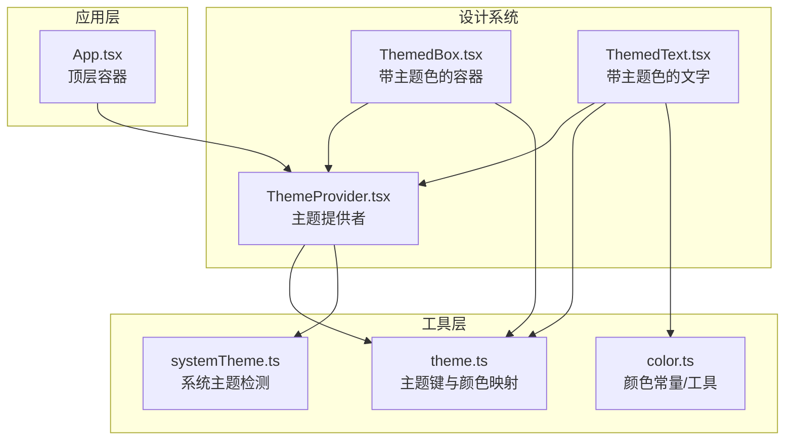
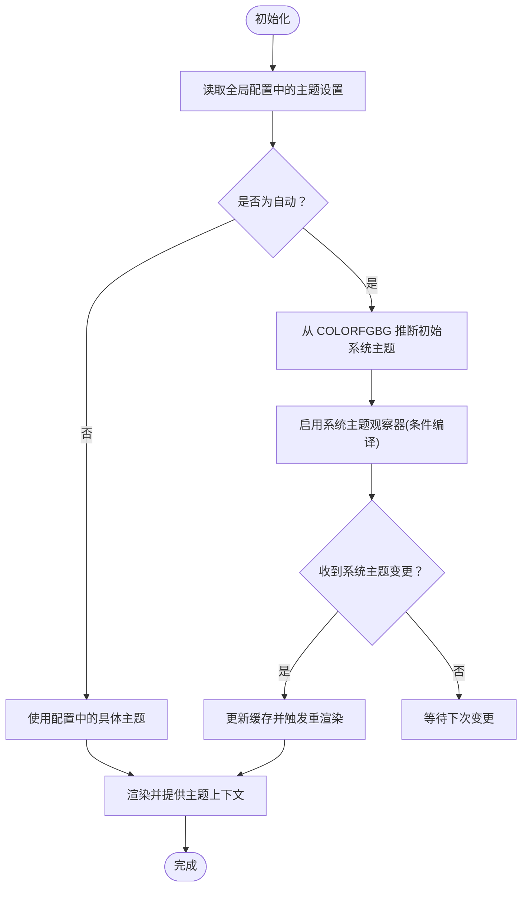
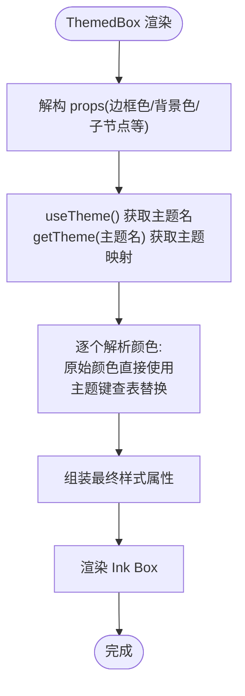
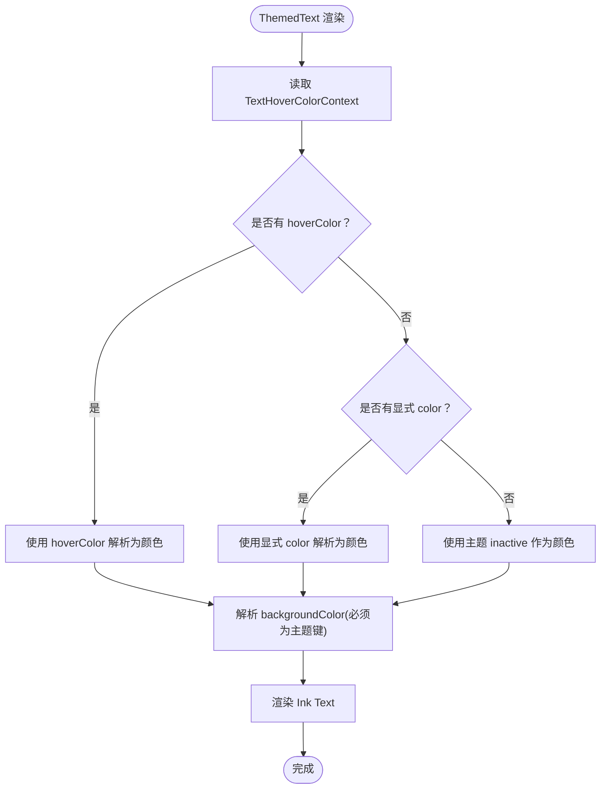
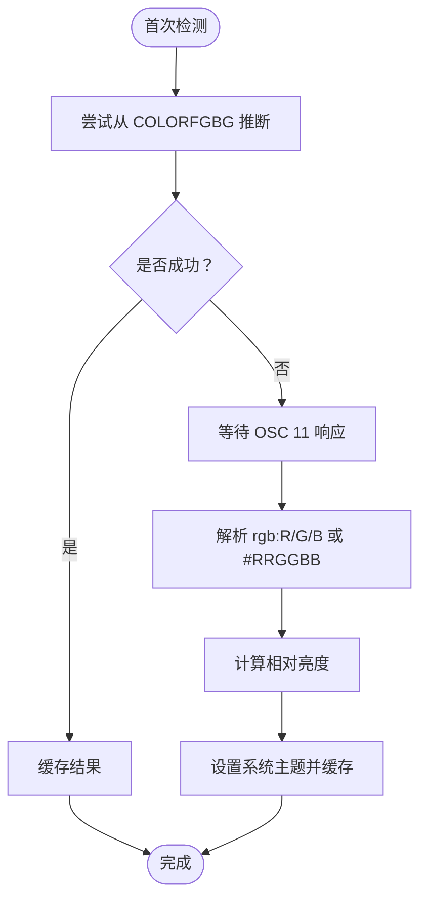
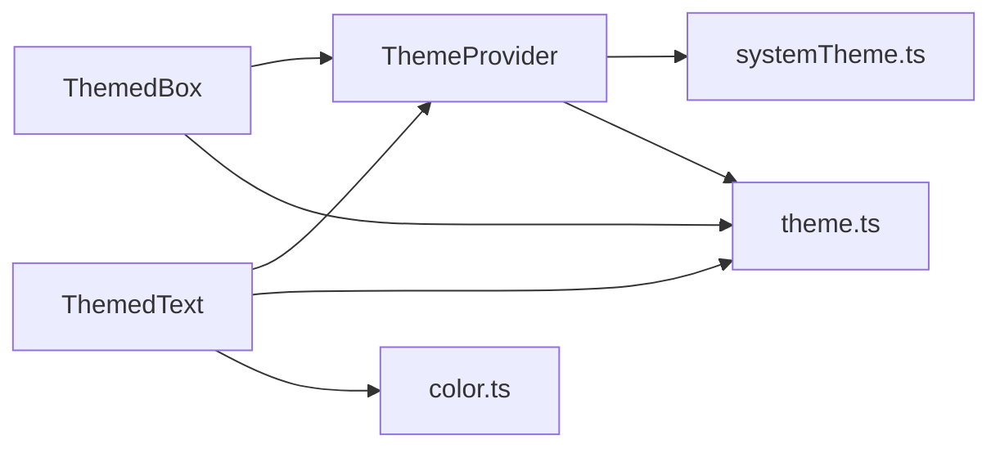

# 设计系统

<cite>
**本文档引用的文件**
- [App.tsx](file://src/components/App.tsx)
- [ThemeProvider.tsx](file://src/components/design-system/ThemeProvider.tsx)
- [ThemedBox.tsx](file://src/components/design-system/ThemedBox.tsx)
- [ThemedText.tsx](file://src/components/design-system/ThemedText.tsx)
- [theme.ts](file://src/utils/theme.ts)
- [systemTheme.ts](file://src/utils/systemTheme.ts)
- [color.ts](file://src/components/design-system/color.ts)
</cite>

## 目录
1. [简介](#简介)
2. [项目结构](#项目结构)
3. [核心组件](#核心组件)
4. [架构总览](#架构总览)
5. [详细组件分析](#详细组件分析)
6. [依赖关系分析](#依赖关系分析)
7. [性能考量](#性能考量)
8. [故障排查指南](#故障排查指南)
9. [结论](#结论)
10. [附录](#附录)

## 简介
本设计系统基于 React 构建，采用主题提供者（ThemeProvider）统一管理主题状态与解析逻辑，结合颜色系统（Theme）与样式组件（ThemedBox、ThemedText），实现跨终端的统一视觉语言。系统支持多种主题变体（明暗、色弱友好、纯 ANSI），并提供自动跟随系统主题的能力。通过 CSS-in-JS 风格的运行时解析与 Ink 组件组合，确保在 TUI 环境中也能获得一致的样式体验。

## 项目结构
设计系统主要由以下模块组成：
- 主题提供者：负责主题设置、预览、保存以及系统主题监听
- 颜色系统：定义主题键值与具体颜色映射，支持多套主题方案
- 样式组件：对 Ink 的 Box/Text 进行封装，实现主题键到颜色值的解析
- 应用入口：在顶层提供主题上下文，供全树使用



图表来源
- [App.tsx:19-55](file://src/components/App.tsx#L19-L55)
- [ThemeProvider.tsx:43-116](file://src/components/design-system/ThemeProvider.tsx#L43-L116)
- [ThemedBox.tsx:56-154](file://src/components/design-system/ThemedBox.tsx#L56-L154)
- [ThemedText.tsx:80-123](file://src/components/design-system/ThemedText.tsx#L80-L123)
- [theme.ts:598-613](file://src/utils/theme.ts#L598-L613)
- [systemTheme.ts:24-47](file://src/utils/systemTheme.ts#L24-L47)
- [color.ts](file://src/components/design-system/color.ts)

章节来源
- [App.tsx:19-55](file://src/components/App.tsx#L19-L55)

## 核心组件
- 主题提供者（ThemeProvider）
  - 负责主题设置的读取、更新、预览与保存
  - 支持“自动”模式，根据系统主题动态切换
  - 提供 useTheme、useThemeSetting、usePreviewTheme 等 Hook
- 主题化容器（ThemedBox）
  - 对 Ink Box 的封装，支持边框色、背景色等主题键解析
  - 将主题键转换为具体颜色值后传递给底层组件
- 主题化文字（ThemedText）
  - 对 Ink Text 的封装，支持文本色、背景色、强调、反色等
  - 提供 TextHoverColorContext 实现子树颜色覆盖优先级
- 颜色系统（Theme）
  - 定义完整的主题键集合（语义色、功能色、差异色、彩虹色等）
  - 提供多套主题方案（light/dark 及其 ANSI、色弱友好变体）

章节来源
- [ThemeProvider.tsx:43-116](file://src/components/design-system/ThemeProvider.tsx#L43-L116)
- [ThemedBox.tsx:56-154](file://src/components/design-system/ThemedBox.tsx#L56-L154)
- [ThemedText.tsx:80-123](file://src/components/design-system/ThemedText.tsx#L80-L123)
- [theme.ts:4-89](file://src/utils/theme.ts#L4-L89)

## 架构总览
设计系统的运行流程如下：
- 应用启动时，App 将主题提供者置于顶层
- ThemeProvider 从全局配置读取初始主题设置，若为“自动”，则通过系统主题检测器获取当前系统主题
- 用户可通过 ThemePicker 等界面进行主题切换或预览，预览状态仅在当前选择期间生效
- ThemedBox/ThemedText 在渲染时调用 useTheme 获取当前主题名，再通过 getTheme 解析主题键为具体颜色值
- 所有颜色值最终以 Ink 组件属性形式传入，保证终端渲染一致性

```mermaid
sequenceDiagram
participant App as "App.tsx"
participant Provider as "ThemeProvider"
participant Sys as "systemTheme.ts"
participant Theme as "theme.ts"
participant Box as "ThemedBox"
participant Text as "ThemedText"
App->>Provider : 初始化主题提供者
Provider->>Sys : 检测系统主题(若为自动)
Provider-->>App : 提供主题上下文
App->>Box : 渲染带主题色的容器
Box->>Provider : useTheme()
Provider-->>Box : 返回当前主题名
Box->>Theme : getTheme(主题名)
Theme-->>Box : 返回主题键到颜色的映射
Box-->>App : 渲染解析后的颜色属性
App->>Text : 渲染带主题色的文字
Text->>Provider : useTheme()
Provider-->>Text : 返回当前主题名
Text->>Theme : getTheme(主题名)
Theme-->>Text : 返回主题键到颜色的映射
Text-->>App : 渲染解析后的颜色属性
```

图表来源
- [App.tsx:19-55](file://src/components/App.tsx#L19-L55)
- [ThemeProvider.tsx:82-114](file://src/components/design-system/ThemeProvider.tsx#L82-L114)
- [systemTheme.ts:24-47](file://src/utils/systemTheme.ts#L24-L47)
- [theme.ts:598-613](file://src/utils/theme.ts#L598-L613)
- [ThemedBox.tsx:100-136](file://src/components/design-system/ThemedBox.tsx#L100-L136)
- [ThemedText.tsx:101-122](file://src/components/design-system/ThemedText.tsx#L101-L122)

## 详细组件分析

### 主题提供者（ThemeProvider）
- 功能要点
  - 状态管理：主题设置、预览状态、当前生效主题
  - 自动模式：当设置为“自动”时，监听系统主题变化并缓存结果
  - 配置持久化：通过 onThemeSave 回调保存主题设置
  - Hook 暴露：useTheme、useThemeSetting、usePreviewTheme
- 关键流程
  - 初始化：从全局配置读取初始设置；若为“自动”，尝试从 COLORFGBG 推断初始系统主题
  - 切换：setThemeSetting 更新设置并重置预览；若切换至“自动”，重新读取系统主题
  - 预览：setPreviewTheme 临时保存预览设置；savePreview 将预览提交为正式设置；cancelPreview 取消预览
  - 监听：feature 条件编译开启时，使用系统主题观察器实时更新



图表来源
- [ThemeProvider.tsx:43-116](file://src/components/design-system/ThemeProvider.tsx#L43-L116)
- [systemTheme.ts:24-47](file://src/utils/systemTheme.ts#L24-L47)

章节来源
- [ThemeProvider.tsx:43-116](file://src/components/design-system/ThemeProvider.tsx#L43-L116)

### 主题化容器（ThemedBox）
- 功能要点
  - 接收主题键或原始颜色作为边框色与背景色
  - 在渲染前解析主题键为具体颜色值
  - 透传非颜色类样式属性（如布局、事件处理等）
- 解析规则
  - 若为以 rgb(、#、ansi256( 或 ansi: 开头的字符串，则视为原始颜色直接使用
  - 否则按主题键查找对应颜色值
- 性能优化
  - 使用 useMemo 缓存上下文值
  - 在组件内部对 props 做浅比较，避免不必要的重渲染



图表来源
- [ThemedBox.tsx:56-154](file://src/components/design-system/ThemedBox.tsx#L56-L154)
- [theme.ts:598-613](file://src/utils/theme.ts#L598-L613)

章节来源
- [ThemedBox.tsx:56-154](file://src/components/design-system/ThemedBox.tsx#L56-L154)

### 主题化文字（ThemedText）
- 功能要点
  - 支持文本色、背景色、强调（dim）、粗体、斜体、下划线、删除线、反色、文本换行策略
  - 提供 TextHoverColorContext 实现子树颜色覆盖优先级
  - dimColor 与显式 color 的优先级：显式 color > hoverColor > dimColor
- 解析规则
  - backgroundColor 必须为主题键
  - color 可为主题键或原始颜色
  - dimColor 使用主题的 inactive 值
- 性能优化
  - 对常用属性做浅比较缓存，减少重复渲染



图表来源
- [ThemedText.tsx:80-123](file://src/components/design-system/ThemedText.tsx#L80-L123)
- [theme.ts:598-613](file://src/utils/theme.ts#L598-L613)

章节来源
- [ThemedText.tsx:80-123](file://src/components/design-system/ThemedText.tsx#L80-L123)

### 颜色系统（Theme）
- 主题键分类
  - 基础语义色：success、error、warning、merged
  - 文本与背景：text、inverseText、inactive、subtle、background
  - 差异高亮：diffAdded、diffRemoved、diffAddedDimmed、diffRemovedDimmed、diffAddedWord、diffRemovedWord
  - 彩虹高亮：rainbow_red 至 rainbow_violet 及其 shimmer 版本
  - Agent/功能色：多组子代理颜色、快速模式、记忆背景、速率限制等
- 主题变体
  - light、dark 及其 ANSI、色弱友好变体
  - 通过 getTheme 根据主题名返回对应映射
- ANSI 兼容
  - light-ansi、dark-ansi 使用 ANSI 键（如 ansi:magenta）保证无真彩终端兼容
- ANSI 转换
  - themeColorToAnsi 将 rgb(...) 转换为 ANSI 转义序列，针对 Apple Terminal 使用 256 色级别

```mermaid
classDiagram
class Theme {
+autoAccept
+bashBorder
+claude
+permission
+planMode
+ide
+promptBorder
+text
+inverseText
+inactive
+subtle
+background
+success
+error
+warning
+merged
+diffAdded
+diffRemoved
+diffAddedDimmed
+diffRemovedDimmed
+diffAddedWord
+diffRemovedWord
+red_FOR_SUBAGENTS_ONLY
+blue_FOR_SUBAGENTS_ONLY
+green_FOR_SUBAGENTS_ONLY
+yellow_FOR_SUBAGENTS_ONLY
+purple_FOR_SUBAGENTS_ONLY
+orange_FOR_SUBAGENTS_ONLY
+pink_FOR_SUBAGENTS_ONLY
+cyan_FOR_SUBAGENTS_ONLY
+professionalBlue
+chromeYellow
+clawd_body
+clawd_background
+userMessageBackground
+userMessageBackgroundHover
+messageActionsBackground
+selectionBg
+bashMessageBackgroundColor
+memoryBackgroundColor
+rate_limit_fill
+rate_limit_empty
+fastMode
+fastModeShimmer
+briefLabelYou
+briefLabelClaude
+rainbow_red..violet
+rainbow_red..violet_shimmer
}
class ThemeName {
<<enumeration>>
"light"
"dark"
"light-daltonized"
"dark-daltonized"
"light-ansi"
"dark-ansi"
}
class ThemeSetting {
<<enumeration>>
"'auto'"
"ThemeName"
}
ThemeName <.. Theme : "getTheme()"
ThemeSetting --> ThemeName : "解析为"
```

图表来源
- [theme.ts:4-89](file://src/utils/theme.ts#L4-L89)
- [theme.ts:91-109](file://src/utils/theme.ts#L91-L109)
- [theme.ts:598-613](file://src/utils/theme.ts#L598-L613)

章节来源
- [theme.ts:4-89](file://src/utils/theme.ts#L4-L89)
- [theme.ts:91-109](file://src/utils/theme.ts#L91-L109)
- [theme.ts:598-613](file://src/utils/theme.ts#L598-L613)
- [theme.ts:626-639](file://src/utils/theme.ts#L626-L639)

### 系统主题检测（systemTheme.ts）
- 功能要点
  - 通过 OSC 11 查询终端背景色，计算相对亮度判断明/暗
  - 首次检测使用 COLORFGBG 作为同步初值，随后由观察器异步更新
  - 提供 getSystemThemeName、setCachedSystemTheme、resolveThemeSetting、themeFromOscColor、parseOscRgb 等工具函数
- 亮度计算
  - 使用 ITU-R BT.709 相对亮度公式，阈值 0.5 区分明/暗



图表来源
- [systemTheme.ts:24-47](file://src/utils/systemTheme.ts#L24-L47)
- [systemTheme.ts:60-66](file://src/utils/systemTheme.ts#L60-L66)
- [systemTheme.ts:70-94](file://src/utils/systemTheme.ts#L70-L94)
- [systemTheme.ts:96-119](file://src/utils/systemTheme.ts#L96-L119)

章节来源
- [systemTheme.ts:24-47](file://src/utils/systemTheme.ts#L24-L47)
- [systemTheme.ts:60-66](file://src/utils/systemTheme.ts#L60-L66)
- [systemTheme.ts:70-94](file://src/utils/systemTheme.ts#L70-L94)
- [systemTheme.ts:96-119](file://src/utils/systemTheme.ts#L96-L119)

## 依赖关系分析
- 组件耦合
  - ThemedBox/ThemedText 依赖 ThemeProvider 提供的主题上下文
  - ThemeProvider 依赖 systemTheme.ts 进行系统主题检测
  - ThemedBox/ThemedText 依赖 theme.ts 提供的颜色映射
- 外部依赖
  - Ink 组件（Box、Text）用于终端渲染
  - chalk 用于 ANSI 转换（特定场景）
- 潜在风险
  - 主题切换与系统主题监听存在条件编译开关，需确保构建环境正确
  - 颜色解析依赖主题键名称一致性，新增颜色键需同步更新映射



图表来源
- [ThemeProvider.tsx:43-116](file://src/components/design-system/ThemeProvider.tsx#L43-L116)
- [ThemedBox.tsx:56-154](file://src/components/design-system/ThemedBox.tsx#L56-L154)
- [ThemedText.tsx:80-123](file://src/components/design-system/ThemedText.tsx#L80-L123)
- [theme.ts:598-613](file://src/utils/theme.ts#L598-L613)
- [systemTheme.ts:24-47](file://src/utils/systemTheme.ts#L24-L47)
- [color.ts](file://src/components/design-system/color.ts)

章节来源
- [ThemeProvider.tsx:43-116](file://src/components/design-system/ThemeProvider.tsx#L43-L116)
- [ThemedBox.tsx:56-154](file://src/components/design-system/ThemedBox.tsx#L56-L154)
- [ThemedText.tsx:80-123](file://src/components/design-system/ThemedText.tsx#L80-L123)
- [theme.ts:598-613](file://src/utils/theme.ts#L598-L613)
- [systemTheme.ts:24-47](file://src/utils/systemTheme.ts#L24-L47)
- [color.ts](file://src/components/design-system/color.ts)

## 性能考量
- 渲染优化
  - ThemedBox/ThemedText 内部对 props 做浅比较缓存，避免重复渲染
  - ThemeProvider 使用 useMemo 缓存上下文值
- 主题切换
  - “自动”模式下，系统主题监听为可选特性（条件编译），避免在不支持的环境中引入额外开销
- 颜色解析
  - 主题映射为静态对象，解析成本低；ANSI 转换仅在需要时执行

## 故障排查指南
- 主题未生效或闪烁
  - 检查全局配置中的主题设置是否正确保存
  - 若为“自动”，确认系统主题检测是否正常工作（COLORFGBG 是否存在、OSC 11 是否可达）
- 颜色显示异常
  - 确认使用的颜色键存在于目标主题中
  - 在纯 ANSI 终端中，部分颜色键会回退为 ANSI 键，注意对比预期
- 预览无法保存
  - 确认 usePreviewTheme 返回的方法是否被正确调用
  - 检查 onThemeSave 回调是否被覆盖且正确执行

章节来源
- [ThemeProvider.tsx:82-114](file://src/components/design-system/ThemeProvider.tsx#L82-L114)
- [systemTheme.ts:24-47](file://src/utils/systemTheme.ts#L24-L47)
- [theme.ts:598-613](file://src/utils/theme.ts#L598-L613)

## 结论
该设计系统通过主题提供者与颜色系统的协同，实现了在不同终端环境下的一致视觉体验。其核心优势在于：
- 明确的主题键体系与多套主题变体，满足不同用户需求
- 运行时解析与 Ink 组件结合，保证渲染一致性
- 自动系统主题检测与预览机制，提升用户体验
建议在后续迭代中持续完善颜色键命名规范与文档，确保新组件与现有体系保持一致。

## 附录
- 设计系统使用最佳实践
  - 新增颜色键时，先在 theme.ts 中补充键名与默认值，再在各主题变体中补齐
  - 组件中优先使用主题键而非硬编码颜色，确保与主题一致
  - 对于需要强调或禁用态的文本，优先使用 dimColor 或 inactive，避免破坏整体配色
  - 在纯 ANSI 终端中测试关键路径，确保颜色可辨识度
- 可扩展性指南
  - 新增主题变体：在 theme.ts 中添加新主题对象，并在 getTheme 分支中处理
  - 新增样式组件：参考 ThemedBox/ThemedText 的模式，封装 Ink 组件并实现主题键解析
  - 新增颜色常量：在 color.ts 中集中管理，避免散落的魔法值