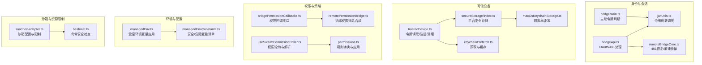
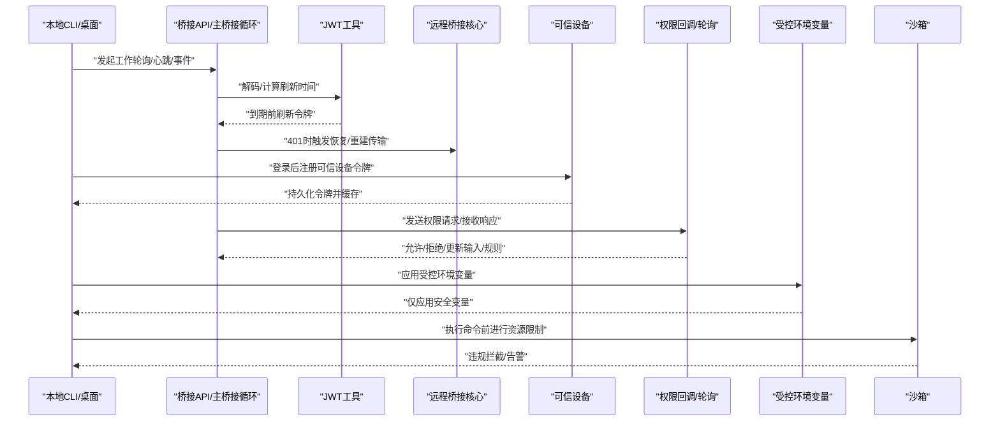
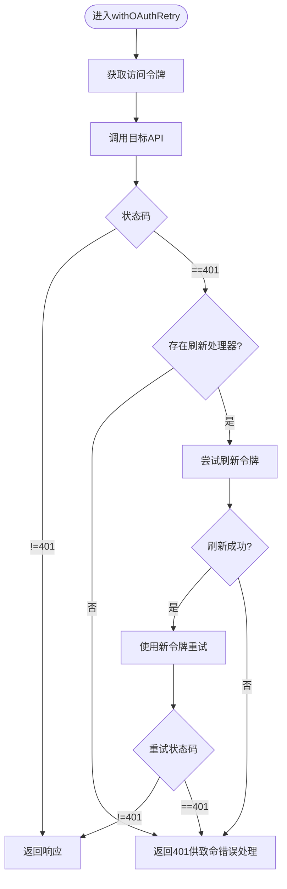
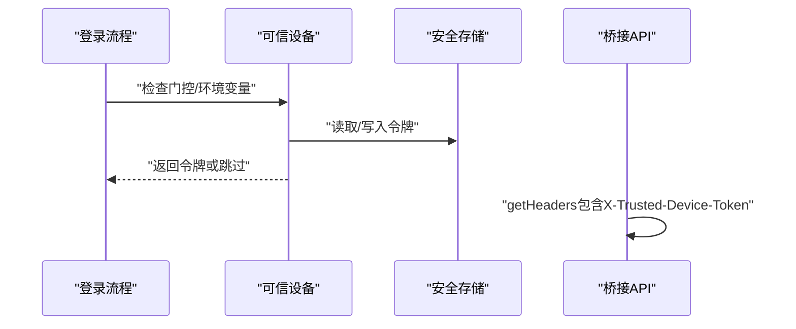
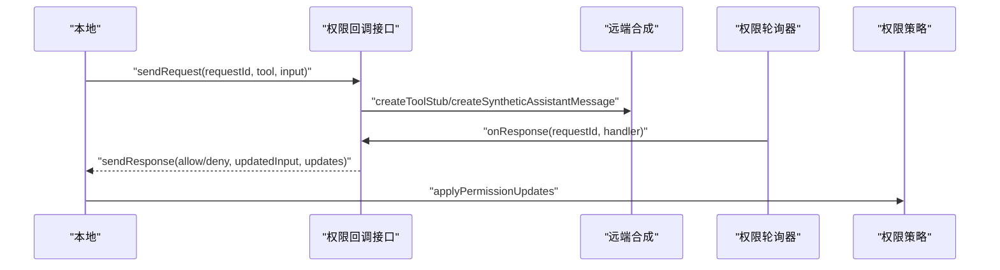
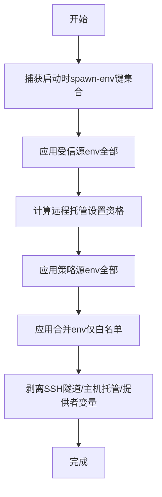
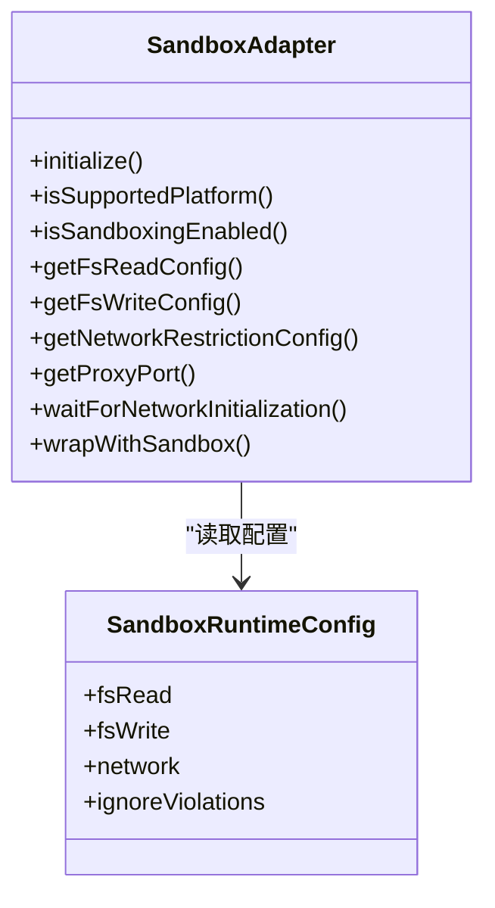
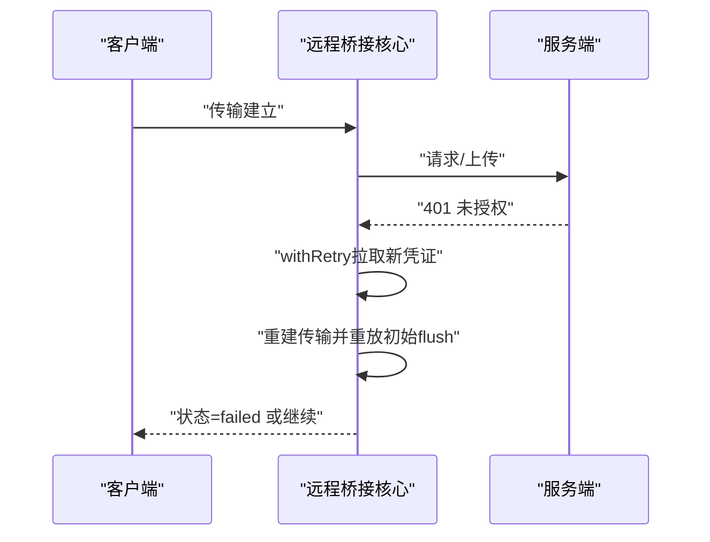
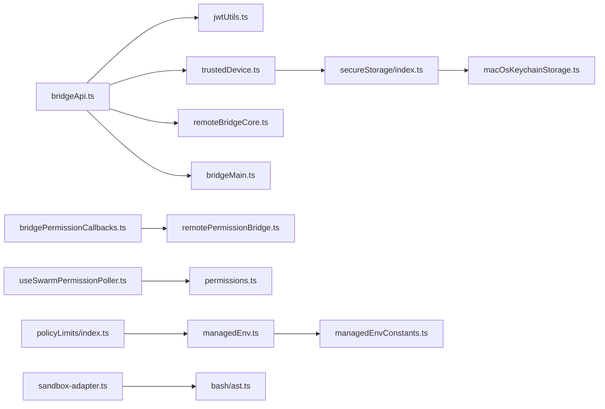

# 安全机制保障

<cite>
**本文引用的文件**
- [src/bridge/trustedDevice.ts](file://src/bridge/trustedDevice.ts)
- [src/bridge/bridgeApi.ts](file://src/bridge/bridgeApi.ts)
- [src/bridge/jwtUtils.ts](file://src/bridge/jwtUtils.ts)
- [src/bridge/bridgePermissionCallbacks.ts](file://src/bridge/bridgePermissionCallbacks.ts)
- [src/remote/remotePermissionBridge.ts](file://src/remote/remotePermissionBridge.ts)
- [src/utils/managedEnv.ts](file://src/utils/managedEnv.ts)
- [src/utils/managedEnvConstants.ts](file://src/utils/managedEnvConstants.ts)
- [src/utils/secureStorage/index.ts](file://src/utils/secureStorage/index.ts)
- [src/utils/secureStorage/macOsKeychainStorage.ts](file://src/utils/secureStorage/macOsKeychainStorage.ts)
- [src/utils/secureStorage/keychainPrefetch.ts](file://src/utils/secureStorage/keychainPrefetch.ts)
- [src/utils/secureStorage/macOsKeychainHelpers.ts](file://src/utils/secureStorage/macOsKeychainHelpers.ts)
- [src/hooks/useSwarmPermissionPoller.ts](file://src/hooks/useSwarmPermissionPoller.ts)
- [src/utils/permissions/permissions.ts](file://src/utils/permissions/permissions.ts)
- [src/utils/permissions/PermissionResult.ts](file://src/utils/permissions/PermissionResult.ts)
- [src/utils/sandbox/sandbox-adapter.ts](file://src/utils/sandbox/sandbox-adapter.ts)
- [src/services/policyLimits/index.ts](file://src/services/policyLimits/index.ts)
- [src/utils/bash/ast.ts](file://src/utils/bash/ast.ts)
- [src/utils/diagLogs.ts](file://src/utils/diagLogs.ts)
- [src/services/analytics/metadata.ts](file://src/services/analytics/metadata.ts)
- [src/bridge/remoteBridgeCore.ts](file://src/bridge/remoteBridgeCore.ts)
- [src/bridge/bridgeMain.ts](file://src/bridge/bridgeMain.ts)
- [src/bridge/bridgeMessaging.ts](file://src/bridge/bridgeMessaging.ts)
- [docs/en/01-telemetry-and-privacy.md](file://docs/en/01-telemetry-and-privacy.md)
</cite>

## 目录
1. [引言](#引言)
2. [项目结构](#项目结构)
3. [核心组件](#核心组件)
4. [架构总览](#架构总览)
5. [详细组件分析](#详细组件分析)
6. [依赖关系分析](#依赖关系分析)
7. [性能考量](#性能考量)
8. [故障排查指南](#故障排查指南)
9. [结论](#结论)
10. [附录](#附录)

## 引言
本文件面向Claude Code远程协作系统的安全机制，围绕身份认证、访问控制、数据加密、可信设备、权限回调、环境无关配置、远程会话安全边界以及安全审计与威胁检测进行系统化技术说明。文档以代码为依据，结合流程图与类图，帮助读者理解各模块如何协同构建端到端安全体系。

## 项目结构
从安全视角看，系统的关键安全模块分布如下：
- 身份与会话：桥接API、JWT工具、远程桥接核心、主桥接循环
- 可信设备：设备令牌获取、注册、存储与缓存
- 权限与策略：权限回调接口、权限轮询器、权限上下文与规则
- 环境变量与配置：受控环境变量应用、安全默认值与危险项过滤
- 沙箱与资源限制：文件系统、网络、代理与违规检测
- 诊断与遥测：诊断日志、遥测元数据清洗、隐私策略

图表来源
- [src/bridge/bridgeApi.ts:68-452](file://src/bridge/bridgeApi.ts#L68-L452)
- [src/bridge/jwtUtils.ts:72-256](file://src/bridge/jwtUtils.ts#L72-L256)
- [src/bridge/remoteBridgeCore.ts:553-592](file://src/bridge/remoteBridgeCore.ts#L553-L592)
- [src/bridge/bridgeMain.ts:279-314](file://src/bridge/bridgeMain.ts#L279-L314)
- [src/bridge/trustedDevice.ts:98-210](file://src/bridge/trustedDevice.ts#L98-L210)
- [src/utils/secureStorage/index.ts:9-17](file://src/utils/secureStorage/index.ts#L9-L17)
- [src/utils/secureStorage/macOsKeychainStorage.ts:26-158](file://src/utils/secureStorage/macOsKeychainStorage.ts#L26-L158)
- [src/utils/secureStorage/keychainPrefetch.ts:69-98](file://src/utils/secureStorage/keychainPrefetch.ts#L69-L98)
- [src/bridge/bridgePermissionCallbacks.ts:10-44](file://src/bridge/bridgePermissionCallbacks.ts#L10-L44)
- [src/remote/remotePermissionBridge.ts:12-79](file://src/remote/remotePermissionBridge.ts#L12-L79)
- [src/hooks/useSwarmPermissionPoller.ts:28-257](file://src/hooks/useSwarmPermissionPoller.ts#L28-L257)
- [src/utils/permissions/permissions.ts:1436-1486](file://src/utils/permissions/permissions.ts#L1436-L1486)
- [src/utils/managedEnv.ts:124-199](file://src/utils/managedEnv.ts#L124-L199)
- [src/utils/managedEnvConstants.ts:108-192](file://src/utils/managedEnvConstants.ts#L108-L192)
- [src/utils/sandbox/sandbox-adapter.ts:880-985](file://src/utils/sandbox/sandbox-adapter.ts#L880-L985)
- [src/utils/bash/ast.ts:2658-2679](file://src/utils/bash/ast.ts#L2658-L2679)

章节来源
- [src/bridge/bridgeApi.ts:68-452](file://src/bridge/bridgeApi.ts#L68-L452)
- [src/bridge/jwtUtils.ts:72-256](file://src/bridge/jwtUtils.ts#L72-L256)
- [src/bridge/remoteBridgeCore.ts:553-592](file://src/bridge/remoteBridgeCore.ts#L553-L592)
- [src/bridge/bridgeMain.ts:279-314](file://src/bridge/bridgeMain.ts#L279-L314)
- [src/bridge/trustedDevice.ts:98-210](file://src/bridge/trustedDevice.ts#L98-L210)
- [src/utils/secureStorage/index.ts:9-17](file://src/utils/secureStorage/index.ts#L9-L17)
- [src/utils/secureStorage/macOsKeychainStorage.ts:26-158](file://src/utils/secureStorage/macOsKeychainStorage.ts#L26-L158)
- [src/utils/secureStorage/keychainPrefetch.ts:69-98](file://src/utils/secureStorage/keychainPrefetch.ts#L69-L98)
- [src/bridge/bridgePermissionCallbacks.ts:10-44](file://src/bridge/bridgePermissionCallbacks.ts#L10-L44)
- [src/remote/remotePermissionBridge.ts:12-79](file://src/remote/remotePermissionBridge.ts#L12-L79)
- [src/hooks/useSwarmPermissionPoller.ts:28-257](file://src/hooks/useSwarmPermissionPoller.ts#L28-L257)
- [src/utils/permissions/permissions.ts:1436-1486](file://src/utils/permissions/permissions.ts#L1436-L1486)
- [src/utils/managedEnv.ts:124-199](file://src/utils/managedEnv.ts#L124-L199)
- [src/utils/managedEnvConstants.ts:108-192](file://src/utils/managedEnvConstants.ts#L108-L192)
- [src/utils/sandbox/sandbox-adapter.ts:880-985](file://src/utils/sandbox/sandbox-adapter.ts#L880-L985)
- [src/utils/bash/ast.ts:2658-2679](file://src/utils/bash/ast.ts#L2658-L2679)

## 核心组件
- 身份认证与会话管理
  - OAuth令牌获取与401重试、JWT过期前刷新、v2会话通过reconnect保持租约
- 可信设备机制
  - 设备令牌注册、持久化、缓存与清理；支持企业环境变量覆盖
- 权限回调与策略
  - 权限请求/响应协议、远端权限消息合成、权限轮询与规则应用
- 环境无关配置
  - 受控环境变量应用顺序、危险变量过滤、安全默认值
- 远程会话安全边界
  - 沙箱配置（文件/网络/代理）、违规检测与告警
- 诊断与遥测
  - 诊断日志、遥测元数据清洗、隐私策略

章节来源
- [src/bridge/bridgeApi.ts:68-452](file://src/bridge/bridgeApi.ts#L68-L452)
- [src/bridge/jwtUtils.ts:72-256](file://src/bridge/jwtUtils.ts#L72-L256)
- [src/bridge/trustedDevice.ts:98-210](file://src/bridge/trustedDevice.ts#L98-L210)
- [src/bridge/bridgePermissionCallbacks.ts:10-44](file://src/bridge/bridgePermissionCallbacks.ts#L10-L44)
- [src/remote/remotePermissionBridge.ts:12-79](file://src/remote/remotePermissionBridge.ts#L12-L79)
- [src/hooks/useSwarmPermissionPoller.ts:28-257](file://src/hooks/useSwarmPermissionPoller.ts#L28-L257)
- [src/utils/permissions/permissions.ts:1436-1486](file://src/utils/permissions/permissions.ts#L1436-L1486)
- [src/utils/managedEnv.ts:124-199](file://src/utils/managedEnv.ts#L124-L199)
- [src/utils/managedEnvConstants.ts:108-192](file://src/utils/managedEnvConstants.ts#L108-L192)
- [src/utils/sandbox/sandbox-adapter.ts:880-985](file://src/utils/sandbox/sandbox-adapter.ts#L880-L985)
- [src/utils/diagLogs.ts:37-94](file://src/utils/diagLogs.ts#L37-L94)
- [src/services/analytics/metadata.ts:44-77](file://src/services/analytics/metadata.ts#L44-L77)

## 架构总览
下图展示远程协作中“身份—权限—配置—沙箱”四条主线如何协同：

图表来源
- [src/bridge/bridgeApi.ts:68-452](file://src/bridge/bridgeApi.ts#L68-L452)
- [src/bridge/jwtUtils.ts:72-256](file://src/bridge/jwtUtils.ts#L72-L256)
- [src/bridge/remoteBridgeCore.ts:553-592](file://src/bridge/remoteBridgeCore.ts#L553-L592)
- [src/bridge/bridgeMain.ts:279-314](file://src/bridge/bridgeMain.ts#L279-L314)
- [src/bridge/trustedDevice.ts:98-210](file://src/bridge/trustedDevice.ts#L98-L210)
- [src/bridge/bridgePermissionCallbacks.ts:10-44](file://src/bridge/bridgePermissionCallbacks.ts#L10-L44)
- [src/hooks/useSwarmPermissionPoller.ts:28-257](file://src/hooks/useSwarmPermissionPoller.ts#L28-L257)
- [src/utils/managedEnv.ts:124-199](file://src/utils/managedEnv.ts#L124-L199)
- [src/utils/sandbox/sandbox-adapter.ts:880-985](file://src/utils/sandbox/sandbox-adapter.ts#L880-L985)

## 详细组件分析

### 身份认证与会话安全
- OAuth与401处理
  - 统一withOAuthRetry在401时尝试刷新令牌并重试一次；失败则抛出致命错误，避免静默失败
  - 通过getHeaders注入Authorization与可选X-Trusted-Device-Token头
- JWT过期与刷新
  - 解析exp并基于缓冲窗口提前刷新；失败重试有限次数；长周期会话设置回退刷新间隔
- v2会话租约维持
  - 在接近过期前通过reconnectSession触发服务端重新派发，避免无声失效

图表来源
- [src/bridge/bridgeApi.ts:106-139](file://src/bridge/bridgeApi.ts#L106-L139)
- [src/bridge/jwtUtils.ts:165-230](file://src/bridge/jwtUtils.ts#L165-L230)
- [src/bridge/remoteBridgeCore.ts:553-592](file://src/bridge/remoteBridgeCore.ts#L553-L592)
- [src/bridge/bridgeMain.ts:279-314](file://src/bridge/bridgeMain.ts#L279-L314)

章节来源
- [src/bridge/bridgeApi.ts:68-452](file://src/bridge/bridgeApi.ts#L68-L452)
- [src/bridge/jwtUtils.ts:72-256](file://src/bridge/jwtUtils.ts#L72-L256)
- [src/bridge/remoteBridgeCore.ts:553-592](file://src/bridge/remoteBridgeCore.ts#L553-L592)
- [src/bridge/bridgeMain.ts:279-314](file://src/bridge/bridgeMain.ts#L279-L314)

### 可信设备机制
- 门控与注册
  - 通过特性门控决定是否启用；登录后立即注册，避免会话切换导致旧令牌泄露
  - 支持企业环境变量优先覆盖，跳过注册
- 存储与缓存
  - 平台安全存储封装（macOS使用钥匙串，其他平台明文后备），读写带缓存与预取
  - 读取操作memoize，减少系统调用开销；写入后清空缓存保证一致性
- 传输增强
  - 当启用时，在桥接请求头中附加X-Trusted-Device-Token，提升远程控制会话安全等级

图表来源
- [src/bridge/trustedDevice.ts:98-210](file://src/bridge/trustedDevice.ts#L98-L210)
- [src/utils/secureStorage/index.ts:9-17](file://src/utils/secureStorage/index.ts#L9-L17)
- [src/utils/secureStorage/macOsKeychainStorage.ts:26-158](file://src/utils/secureStorage/macOsKeychainStorage.ts#L26-L158)
- [src/utils/secureStorage/keychainPrefetch.ts:69-98](file://src/utils/secureStorage/keychainPrefetch.ts#L69-L98)
- [src/bridge/bridgeApi.ts:76-89](file://src/bridge/bridgeApi.ts#L76-L89)

章节来源
- [src/bridge/trustedDevice.ts:98-210](file://src/bridge/trustedDevice.ts#L98-L210)
- [src/utils/secureStorage/index.ts:9-17](file://src/utils/secureStorage/index.ts#L9-L17)
- [src/utils/secureStorage/macOsKeychainStorage.ts:26-158](file://src/utils/secureStorage/macOsKeychainStorage.ts#L26-L158)
- [src/utils/secureStorage/keychainPrefetch.ts:69-98](file://src/utils/secureStorage/keychainPrefetch.ts#L69-L98)
- [src/bridge/bridgeApi.ts:76-89](file://src/bridge/bridgeApi.ts#L76-L89)

### 权限回调机制设计
- 协议与类型
  - 定义请求/响应结构与类型守卫，确保跨进程/跨端通信的健壮性
- 远端合成
  - 对于远端不可见工具，生成最小stub与合成消息，保证权限对话连续性
- 轮询与解析
  - 周期轮询响应，校验并解析权限更新，过滤异常条目，回调处理允许/拒绝路径

图表来源
- [src/bridge/bridgePermissionCallbacks.ts:10-44](file://src/bridge/bridgePermissionCallbacks.ts#L10-L44)
- [src/remote/remotePermissionBridge.ts:12-79](file://src/remote/remotePermissionBridge.ts#L12-L79)
- [src/hooks/useSwarmPermissionPoller.ts:28-257](file://src/hooks/useSwarmPermissionPoller.ts#L28-L257)
- [src/utils/permissions/permissions.ts:1436-1486](file://src/utils/permissions/permissions.ts#L1436-L1486)

章节来源
- [src/bridge/bridgePermissionCallbacks.ts:10-44](file://src/bridge/bridgePermissionCallbacks.ts#L10-L44)
- [src/remote/remotePermissionBridge.ts:12-79](file://src/remote/remotePermissionBridge.ts#L12-L79)
- [src/hooks/useSwarmPermissionPoller.ts:28-257](file://src/hooks/useSwarmPermissionPoller.ts#L28-L257)
- [src/utils/permissions/permissions.ts:1436-1486](file://src/utils/permissions/permissions.ts#L1436-L1486)

### 环境无关配置的安全考虑
- 双阶段应用
  - 先应用受信源（用户设置、策略设置、命令行标志）的全部环境变量，再应用合并后的安全白名单变量
- 危险变量过滤
  - 严格区分安全/危险变量清单，非白名单变量触发安全对话框或被过滤
- 主机托管路由保护
  - 当主机托管推理路由时，剥离可能被滥用的路由变量，防止被项目设置覆盖

图表来源
- [src/utils/managedEnv.ts:124-199](file://src/utils/managedEnv.ts#L124-L199)
- [src/utils/managedEnvConstants.ts:108-192](file://src/utils/managedEnvConstants.ts#L108-L192)

章节来源
- [src/utils/managedEnv.ts:124-199](file://src/utils/managedEnv.ts#L124-L199)
- [src/utils/managedEnvConstants.ts:108-192](file://src/utils/managedEnvConstants.ts#L108-L192)

### 远程会话的安全边界
- 沙箱配置
  - 文件系统读写限制、网络访问限制、代理端口、Unix Socket/本地绑定白名单
  - 提供违规存储与错误注解，便于定位问题
- 命令安全检查
  - 针对读取/proc/*/environ等高危路径进行静态AST扫描，阻止潜在信息泄露
- 策略限制轮询
  - 后台轮询策略限制，变更时不中断业务，失败静默重试

图表来源
- [src/utils/sandbox/sandbox-adapter.ts:880-985](file://src/utils/sandbox/sandbox-adapter.ts#L880-L985)

章节来源
- [src/utils/sandbox/sandbox-adapter.ts:880-985](file://src/utils/sandbox/sandbox-adapter.ts#L880-L985)
- [src/utils/bash/ast.ts:2658-2679](file://src/utils/bash/ast.ts#L2658-L2679)
- [src/services/policyLimits/index.ts:613-663](file://src/services/policyLimits/index.ts#L613-L663)

### 401恢复与传输重建
- 场景
  - 服务器返回401时，尝试拉取新的凭证并重建传输通道
- 行为
  - 失败时记录诊断事件，状态置为失败，避免静默退出

图表来源
- [src/bridge/remoteBridgeCore.ts:553-592](file://src/bridge/remoteBridgeCore.ts#L553-L592)

章节来源
- [src/bridge/remoteBridgeCore.ts:553-592](file://src/bridge/remoteBridgeCore.ts#L553-L592)

### 控制请求与权限模式设置
- set_permission_mode
  - 在支持的上下文中应用权限模式；不支持时返回错误响应，避免误应用
- interrupt
  - 触发中断并返回成功响应

章节来源
- [src/bridge/bridgeMessaging.ts:328-371](file://src/bridge/bridgeMessaging.ts#L328-L371)

## 依赖关系分析
- 组件耦合
  - 桥接API依赖JWT工具进行令牌刷新；依赖可信设备提供额外头
  - 权限轮询器依赖权限更新schema与回调注册表
  - 环境变量应用依赖常量表与策略限制轮询
- 外部依赖
  - macOS钥匙串子进程调用、代理/证书缓存、遥测与诊断日志

图表来源
- [src/bridge/bridgeApi.ts:68-452](file://src/bridge/bridgeApi.ts#L68-L452)
- [src/bridge/jwtUtils.ts:72-256](file://src/bridge/jwtUtils.ts#L72-L256)
- [src/bridge/trustedDevice.ts:98-210](file://src/bridge/trustedDevice.ts#L98-L210)
- [src/utils/secureStorage/index.ts:9-17](file://src/utils/secureStorage/index.ts#L9-L17)
- [src/utils/secureStorage/macOsKeychainStorage.ts:26-158](file://src/utils/secureStorage/macOsKeychainStorage.ts#L26-L158)
- [src/bridge/remoteBridgeCore.ts:553-592](file://src/bridge/remoteBridgeCore.ts#L553-L592)
- [src/bridge/bridgeMain.ts:279-314](file://src/bridge/bridgeMain.ts#L279-L314)
- [src/bridge/bridgePermissionCallbacks.ts:10-44](file://src/bridge/bridgePermissionCallbacks.ts#L10-L44)
- [src/remote/remotePermissionBridge.ts:12-79](file://src/remote/remotePermissionBridge.ts#L12-L79)
- [src/hooks/useSwarmPermissionPoller.ts:28-257](file://src/hooks/useSwarmPermissionPoller.ts#L28-L257)
- [src/utils/permissions/permissions.ts:1436-1486](file://src/utils/permissions/permissions.ts#L1436-L1486)
- [src/utils/managedEnv.ts:124-199](file://src/utils/managedEnv.ts#L124-L199)
- [src/utils/managedEnvConstants.ts:108-192](file://src/utils/managedEnvConstants.ts#L108-L192)
- [src/utils/sandbox/sandbox-adapter.ts:880-985](file://src/utils/sandbox/sandbox-adapter.ts#L880-L985)
- [src/utils/bash/ast.ts:2658-2679](file://src/utils/bash/ast.ts#L2658-L2679)
- [src/services/policyLimits/index.ts:613-663](file://src/services/policyLimits/index.ts#L613-L663)

章节来源
- [src/bridge/bridgeApi.ts:68-452](file://src/bridge/bridgeApi.ts#L68-L452)
- [src/bridge/jwtUtils.ts:72-256](file://src/bridge/jwtUtils.ts#L72-L256)
- [src/bridge/trustedDevice.ts:98-210](file://src/bridge/trustedDevice.ts#L98-L210)
- [src/utils/secureStorage/index.ts:9-17](file://src/utils/secureStorage/index.ts#L9-L17)
- [src/utils/secureStorage/macOsKeychainStorage.ts:26-158](file://src/utils/secureStorage/macOsKeychainStorage.ts#L26-L158)
- [src/bridge/remoteBridgeCore.ts:553-592](file://src/bridge/remoteBridgeCore.ts#L553-L592)
- [src/bridge/bridgeMain.ts:279-314](file://src/bridge/bridgeMain.ts#L279-L314)
- [src/bridge/bridgePermissionCallbacks.ts:10-44](file://src/bridge/bridgePermissionCallbacks.ts#L10-L44)
- [src/remote/remotePermissionBridge.ts:12-79](file://src/remote/remotePermissionBridge.ts#L12-L79)
- [src/hooks/useSwarmPermissionPoller.ts:28-257](file://src/hooks/useSwarmPermissionPoller.ts#L28-L257)
- [src/utils/permissions/permissions.ts:1436-1486](file://src/utils/permissions/permissions.ts#L1436-L1486)
- [src/utils/managedEnv.ts:124-199](file://src/utils/managedEnv.ts#L124-L199)
- [src/utils/managedEnvConstants.ts:108-192](file://src/utils/managedEnvConstants.ts#L108-L192)
- [src/utils/sandbox/sandbox-adapter.ts:880-985](file://src/utils/sandbox/sandbox-adapter.ts#L880-L985)
- [src/utils/bash/ast.ts:2658-2679](file://src/utils/bash/ast.ts#L2658-L2679)
- [src/services/policyLimits/index.ts:613-663](file://src/services/policyLimits/index.ts#L613-L663)

## 性能考量
- 缓存与预取
  - 可信设备令牌读取memoize；macOS钥匙串读取预取与缓存，降低UI阻塞
- 刷新策略
  - 基于exp的到期前刷新与回退刷新间隔，兼顾稳定性与低延迟
- 轮询与幂等
  - 权限轮询与策略轮询采用短周期与幂等设计，避免频繁IO与网络压力

章节来源
- [src/bridge/trustedDevice.ts:45-59](file://src/bridge/trustedDevice.ts#L45-L59)
- [src/utils/secureStorage/keychainPrefetch.ts:69-98](file://src/utils/secureStorage/keychainPrefetch.ts#L69-L98)
- [src/bridge/jwtUtils.ts:165-230](file://src/bridge/jwtUtils.ts#L165-L230)
- [src/services/policyLimits/index.ts:635-663](file://src/services/policyLimits/index.ts#L635-L663)

## 故障排查指南
- 401/403错误
  - 使用致命错误包装，区分会话过期与权限不足；suppressible 403用于非关键场景
- 令牌刷新失败
  - 记录诊断事件并限制重试次数；必要时触发回退刷新
- 钥匙串读写失败
  - 采用“陈旧-可用”策略，失败时返回上一次有效缓存，避免全局失效
- 权限轮询异常
  - 过滤非法条目，保留合法更新；超时/无回调按调试日志处理

章节来源
- [src/bridge/bridgeApi.ts:454-524](file://src/bridge/bridgeApi.ts#L454-L524)
- [src/bridge/jwtUtils.ts:185-205](file://src/bridge/jwtUtils.ts#L185-L205)
- [src/utils/secureStorage/macOsKeychainStorage.ts:47-65](file://src/utils/secureStorage/macOsKeychainStorage.ts#L47-L65)
- [src/hooks/useSwarmPermissionPoller.ts:35-53](file://src/hooks/useSwarmPermissionPoller.ts#L35-L53)

## 结论
该系统通过“可信设备+权限回调+受控环境变量+沙箱限制+诊断与遥测”的多层安全设计，实现了远程协作场景下的身份认证、访问控制与运行时安全。令牌刷新与401恢复确保会话连续性；权限轮询与规则应用保障最小授权；环境变量双阶段应用与危险项过滤降低配置风险；沙箱与命令扫描提供资源与行为边界；诊断与遥测支持持续监控与改进。

## 附录
- 遥测与隐私要点
  - 事件体量大、不可直接禁用、持久化重试、第三方共享；可通过环境变量开启工具详情日志
- 遥测元数据清洗
  - 工具名脱敏、元数据类型标注，避免泄露代码与路径

章节来源
- [docs/en/01-telemetry-and-privacy.md:117-125](file://docs/en/01-telemetry-and-privacy.md#L117-L125)
- [src/services/analytics/metadata.ts:44-77](file://src/services/analytics/metadata.ts#L44-L77)