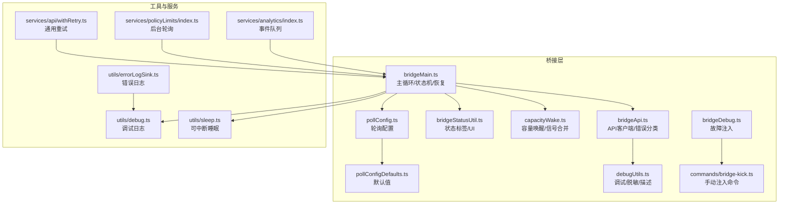
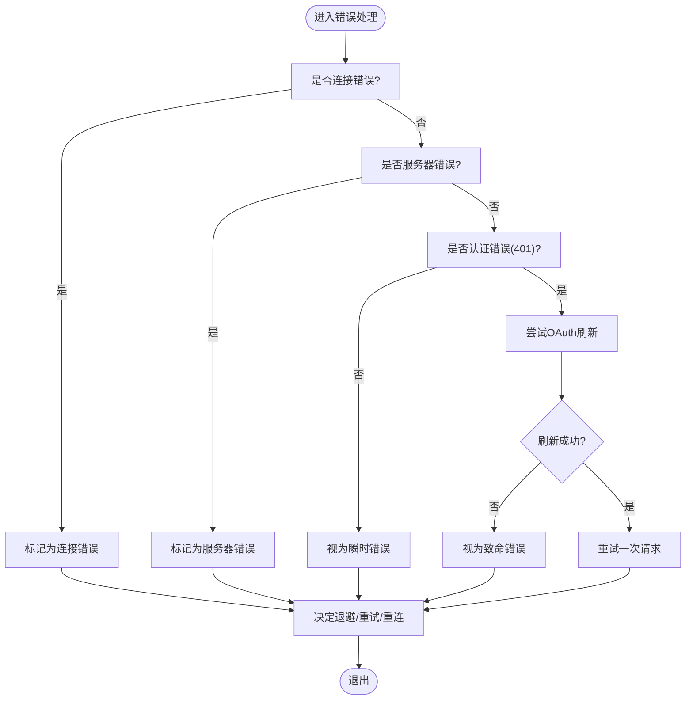
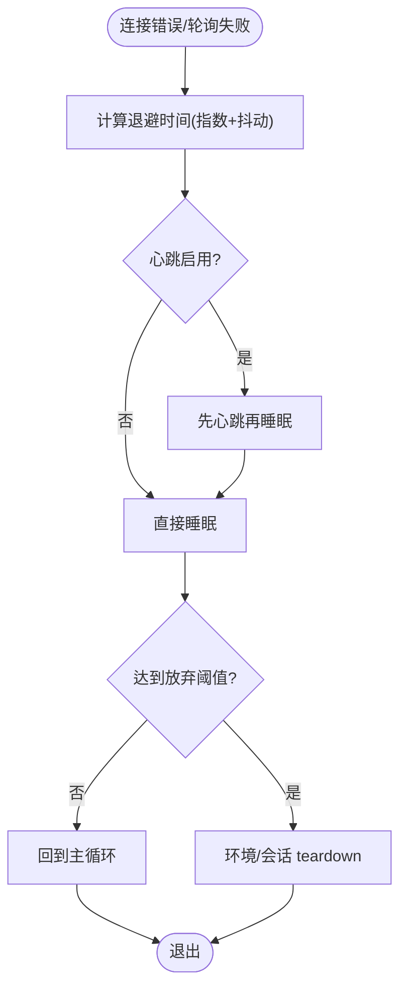
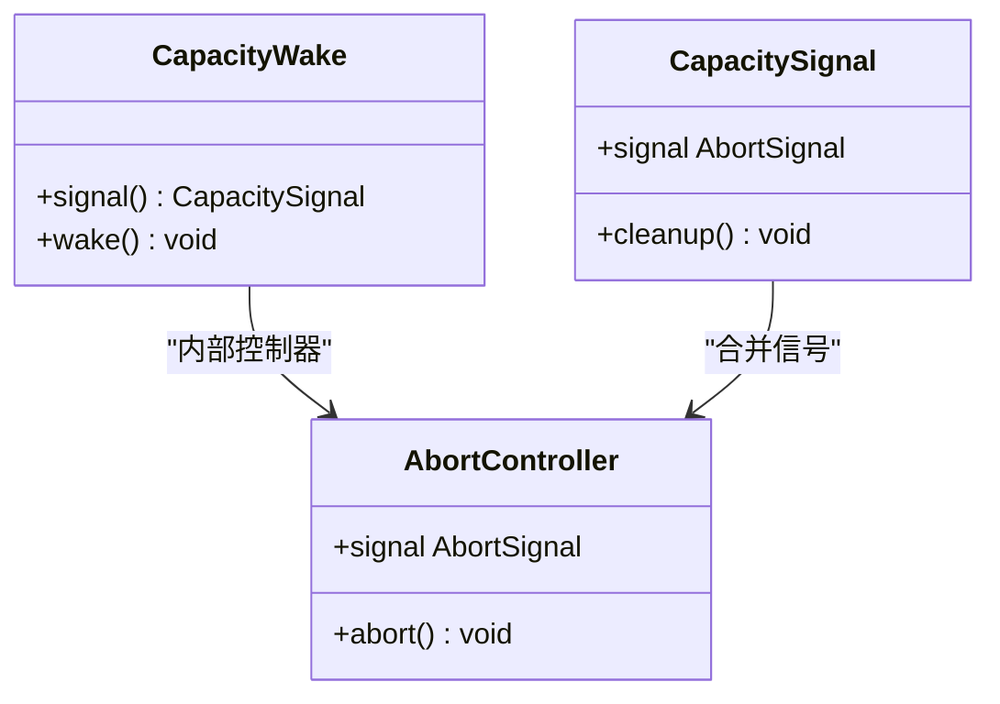
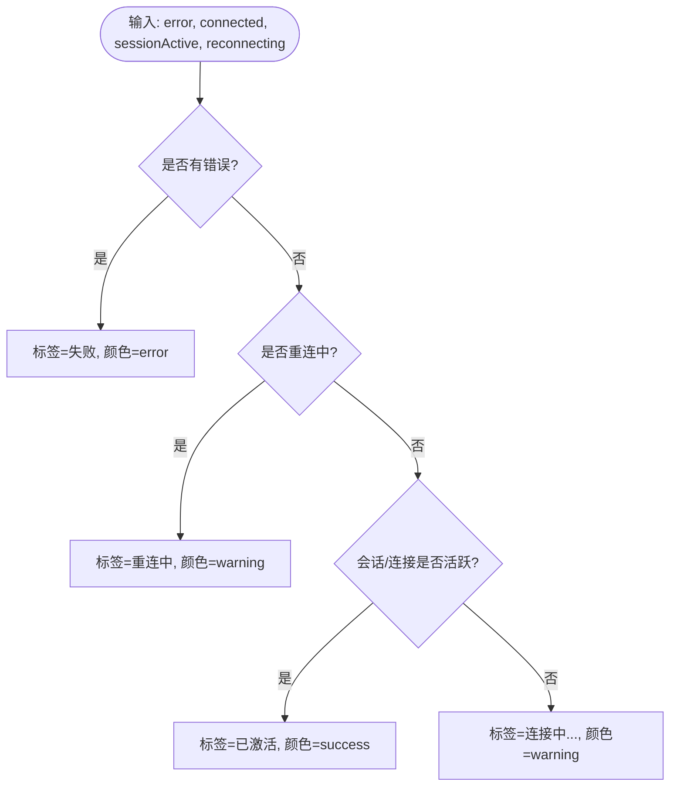
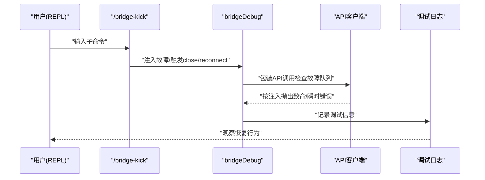
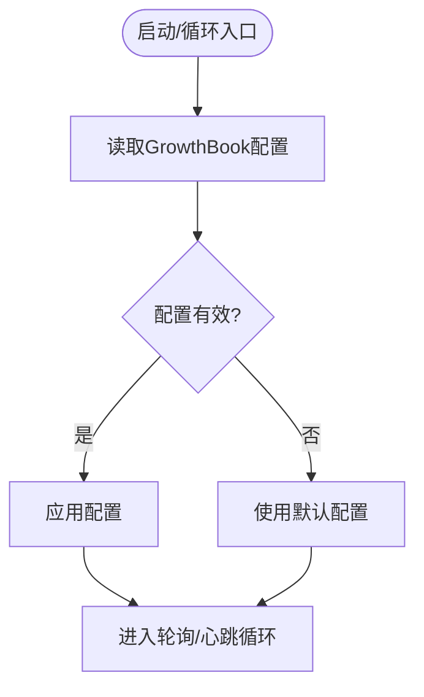
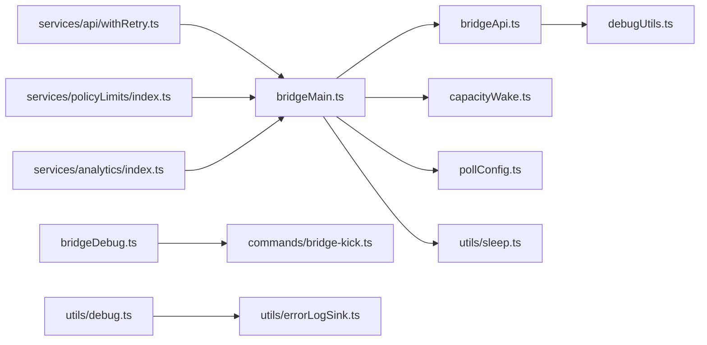

# 容错与恢复机制

<cite>
**本文引用的文件**
- [src/bridge/bridgeMain.ts](file://src/bridge/bridgeMain.ts)
- [src/bridge/bridgeApi.ts](file://src/bridge/bridgeApi.ts)
- [src/bridge/bridgeStatusUtil.ts](file://src/bridge/bridgeStatusUtil.ts)
- [src/bridge/capacityWake.ts](file://src/bridge/capacityWake.ts)
- [src/bridge/pollConfig.ts](file://src/bridge/pollConfig.ts)
- [src/bridge/pollConfigDefaults.ts](file://src/bridge/pollConfigDefaults.ts)
- [src/bridge/debugUtils.ts](file://src/bridge/debugUtils.ts)
- [src/bridge/bridgeDebug.ts](file://src/bridge/bridgeDebug.ts)
- [src/commands/bridge-kick.ts](file://src/commands/bridge-kick.ts)
- [src/utils/debug.ts](file://src/utils/debug.ts)
- [src/utils/sleep.ts](file://src/utils/sleep.ts)
- [src/services/api/withRetry.ts](file://src/services/api/withRetry.ts)
- [src/services/policyLimits/index.ts](file://src/services/policyLimits/index.ts)
- [src/utils/errorLogSink.ts](file://src/utils/errorLogSink.ts)
- [src/services/analytics/index.ts](file://src/services/analytics/index.ts)
</cite>

## 目录
1. [简介](#简介)
2. [项目结构](#项目结构)
3. [核心组件](#核心组件)
4. [架构总览](#架构总览)
5. [详细组件分析](#详细组件分析)
6. [依赖关系分析](#依赖关系分析)
7. [性能考量](#性能考量)
8. [故障排除指南](#故障排除指南)
9. [结论](#结论)

## 简介
本文件面向Claude Code远程协作系统的容错与恢复机制，聚焦以下目标：
- 故障检测：连接错误、服务器错误、认证失败、心跳异常、轮询失败等
- 自动恢复：指数退避、重连策略、会话重连、停止工作项重试
- 降级处理：禁用轮询、仅心跳、空闲检测、容量感知与及时唤醒
- 容量唤醒机制：空闲检测、容量感知、及时唤醒
- 状态工具函数：状态跟踪、状态转换、状态恢复
- 调试工具：错误诊断、性能监控、日志分析
- 轮询配置：默认值与自适应调整
- 最佳实践与故障排除

## 项目结构
围绕桥接（bridge）与远程控制（remote control）的核心模块，容错与恢复涉及如下层次：
- 桥接主循环与状态机：bridgeMain.ts
- API客户端与错误分类：bridgeApi.ts
- 状态工具与UI标签：bridgeStatusUtil.ts
- 容量唤醒与信号合并：capacityWake.ts
- 轮询配置与默认值：pollConfig.ts、pollConfigDefaults.ts
- 调试与故障注入：debugUtils.ts、bridgeDebug.ts、commands/bridge-kick.ts
- 通用调试与日志：utils/debug.ts、utils/errorLogSink.ts
- 通用重试与退避：services/api/withRetry.ts
- 策略性后台轮询：services/policyLimits/index.ts
- 分析事件队列：services/analytics/index.ts



**图表来源**
- [src/bridge/bridgeMain.ts:141-200](file://src/bridge/bridgeMain.ts#L141-L200)
- [src/bridge/bridgeApi.ts:68-140](file://src/bridge/bridgeApi.ts#L68-L140)
- [src/bridge/bridgeStatusUtil.ts:114-141](file://src/bridge/bridgeStatusUtil.ts#L114-L141)
- [src/bridge/capacityWake.ts:28-56](file://src/bridge/capacityWake.ts#L28-L56)
- [src/bridge/pollConfig.ts:102-110](file://src/bridge/pollConfig.ts#L102-L110)
- [src/bridge/pollConfigDefaults.ts:55-82](file://src/bridge/pollConfigDefaults.ts#L55-L82)
- [src/bridge/debugUtils.ts:1-142](file://src/bridge/debugUtils.ts#L1-L142)
- [src/bridge/bridgeDebug.ts:84-110](file://src/bridge/bridgeDebug.ts#L84-L110)
- [src/commands/bridge-kick.ts:51-114](file://src/commands/bridge-kick.ts#L51-L114)
- [src/utils/debug.ts:155-196](file://src/utils/debug.ts#L155-L196)
- [src/utils/errorLogSink.ts:225-235](file://src/utils/errorLogSink.ts#L225-L235)
- [src/utils/sleep.ts:14-38](file://src/utils/sleep.ts#L14-L38)
- [src/services/api/withRetry.ts:353-517](file://src/services/api/withRetry.ts#L353-L517)
- [src/services/policyLimits/index.ts:635-663](file://src/services/policyLimits/index.ts#L635-L663)
- [src/services/analytics/index.ts:95-123](file://src/services/analytics/index.ts#L95-L123)

**章节来源**
- [src/bridge/bridgeMain.ts:141-200](file://src/bridge/bridgeMain.ts#L141-L200)
- [src/bridge/bridgeApi.ts:68-140](file://src/bridge/bridgeApi.ts#L68-L140)
- [src/bridge/bridgeStatusUtil.ts:114-141](file://src/bridge/bridgeStatusUtil.ts#L114-L141)
- [src/bridge/capacityWake.ts:28-56](file://src/bridge/capacityWake.ts#L28-L56)
- [src/bridge/pollConfig.ts:102-110](file://src/bridge/pollConfig.ts#L102-L110)
- [src/bridge/pollConfigDefaults.ts:55-82](file://src/bridge/pollConfigDefaults.ts#L55-L82)
- [src/bridge/debugUtils.ts:1-142](file://src/bridge/debugUtils.ts#L1-L142)
- [src/bridge/bridgeDebug.ts:84-110](file://src/bridge/bridgeDebug.ts#L84-L110)
- [src/commands/bridge-kick.ts:51-114](file://src/commands/bridge-kick.ts#L51-L114)
- [src/utils/debug.ts:155-196](file://src/utils/debug.ts#L155-L196)
- [src/utils/errorLogSink.ts:225-235](file://src/utils/errorLogSink.ts#L225-L235)
- [src/utils/sleep.ts:14-38](file://src/utils/sleep.ts#L14-L38)
- [src/services/api/withRetry.ts:353-517](file://src/services/api/withRetry.ts#L353-L517)
- [src/services/policyLimits/index.ts:635-663](file://src/services/policyLimits/index.ts#L635-L663)
- [src/services/analytics/index.ts:95-123](file://src/services/analytics/index.ts#L95-L123)

## 核心组件
- 桥接主循环与恢复策略：负责连接、轮询、心跳、容量感知、错误分类与恢复
- API客户端与错误分类：区分致命错误与瞬时错误，支持OAuth刷新与重试
- 状态工具：桥接状态标签、颜色、URL构建、闪烁动画辅助
- 容量唤醒：在“满载”状态下睡眠并可被会话结束或传输丢失唤醒
- 轮询配置：GrowthBook动态配置、默认值、校验与自适应调整
- 调试与故障注入：脱敏日志、错误描述、手动注入故障、REPL命令
- 通用重试：指数退避、分块睡眠、持久重试
- 策略性后台轮询：策略限制的后台拉取与变更检测
- 分析事件队列：事件缓冲、异步投递、采样与脱敏

**章节来源**
- [src/bridge/bridgeMain.ts:141-200](file://src/bridge/bridgeMain.ts#L141-L200)
- [src/bridge/bridgeApi.ts:56-139](file://src/bridge/bridgeApi.ts#L56-L139)
- [src/bridge/bridgeStatusUtil.ts:114-141](file://src/bridge/bridgeStatusUtil.ts#L114-L141)
- [src/bridge/capacityWake.ts:28-56](file://src/bridge/capacityWake.ts#L28-L56)
- [src/bridge/pollConfig.ts:102-110](file://src/bridge/pollConfig.ts#L102-L110)
- [src/bridge/pollConfigDefaults.ts:55-82](file://src/bridge/pollConfigDefaults.ts#L55-L82)
- [src/bridge/debugUtils.ts:26-82](file://src/bridge/debugUtils.ts#L26-L82)
- [src/bridge/bridgeDebug.ts:84-110](file://src/bridge/bridgeDebug.ts#L84-L110)
- [src/utils/sleep.ts:14-38](file://src/utils/sleep.ts#L14-L38)
- [src/services/api/withRetry.ts:353-517](file://src/services/api/withRetry.ts#L353-L517)
- [src/services/policyLimits/index.ts:635-663](file://src/services/policyLimits/index.ts#L635-L663)
- [src/services/analytics/index.ts:95-123](file://src/services/analytics/index.ts#L95-L123)

## 架构总览
下图展示桥接主循环如何在“满载/非满载”两种状态下进行轮询与心跳，并通过容量唤醒与退避策略实现容错与恢复。

```mermaid
sequenceDiagram
participant Loop as "桥接主循环"
participant Poll as "轮询/心跳"
participant API as "API客户端"
participant Cap as "容量唤醒"
participant Retry as "重试/退避"
Loop->>Poll : "根据配置选择轮询/心跳"
Poll->>API : "请求工作/心跳"
API-->>Poll : "返回状态/错误"
alt "致命错误(401/404/410)"
Poll->>Loop : "触发恢复路径"
Loop->>Retry : "指数退避/重连"
else "瞬时错误(5xx/网络)"
Poll->>Retry : "短暂退避后重试"
else "正常"
Poll->>Cap : "满载时等待容量释放"
Cap-->>Poll : "被会话结束/传输丢失唤醒"
end
Retry-->>Loop : "恢复后继续循环"
```

**图表来源**
- [src/bridge/bridgeMain.ts:657-746](file://src/bridge/bridgeMain.ts#L657-L746)
- [src/bridge/bridgeApi.ts:106-139](file://src/bridge/bridgeApi.ts#L106-L139)
- [src/bridge/capacityWake.ts:28-56](file://src/bridge/capacityWake.ts#L28-L56)
- [src/utils/sleep.ts:14-38](file://src/utils/sleep.ts#L14-L38)
- [src/services/api/withRetry.ts:353-517](file://src/services/api/withRetry.ts#L353-L517)

## 详细组件分析

### 故障检测与错误分类
- 连接错误识别：基于错误码集合判断网络连接类错误
- 服务器错误识别：基于axios错误码判断HTTP 5xx
- 认证错误处理：401触发OAuth刷新，刷新失败则转为致命错误
- 致命错误类型：401/403/404/410等，触发工作项重连或环境重建
- 瞬时错误类型：5xx/网络异常，采用退避重试



**图表来源**
- [src/bridge/bridgeMain.ts:1590-1612](file://src/bridge/bridgeMain.ts#L1590-L1612)
- [src/bridge/bridgeApi.ts:106-139](file://src/bridge/bridgeApi.ts#L106-L139)
- [src/bridge/debugUtils.ts:88-100](file://src/bridge/debugUtils.ts#L88-L100)

**章节来源**
- [src/bridge/bridgeMain.ts:1590-1612](file://src/bridge/bridgeMain.ts#L1590-L1612)
- [src/bridge/bridgeApi.ts:106-139](file://src/bridge/bridgeApi.ts#L106-L139)
- [src/bridge/debugUtils.ts:88-100](file://src/bridge/debugUtils.ts#L88-L100)

### 自动恢复与退避策略
- 连接退避：指数退避，上限与放弃阈值可配置
- 停止工作项重试：最多三次，确保服务器端僵尸任务清理
- 心跳与轮询：在满载时以心跳为主，必要时切换到轮询；心跳失败后延迟再进入下一轮
- 系统休眠检测：超过两倍最大退避阈值判定为系统休眠，重置错误预算



**图表来源**
- [src/bridge/bridgeMain.ts:1314-1339](file://src/bridge/bridgeMain.ts#L1314-L1339)
- [src/bridge/bridgeMain.ts:1627-1634](file://src/bridge/bridgeMain.ts#L1627-L1634)
- [src/bridge/bridgeMain.ts:107-109](file://src/bridge/bridgeMain.ts#L107-L109)

**章节来源**
- [src/bridge/bridgeMain.ts:1314-1339](file://src/bridge/bridgeMain.ts#L1314-L1339)
- [src/bridge/bridgeMain.ts:1627-1634](file://src/bridge/bridgeMain.ts#L1627-L1634)
- [src/bridge/bridgeMain.ts:107-109](file://src/bridge/bridgeMain.ts#L107-L109)

### 降级处理与空闲检测
- 仅心跳模式：当满载轮询禁用时，以心跳作为活性信号
- 空闲检测：超过两倍最大退避阈值视为系统休眠，避免误判
- 会话超时：超时会话与服务器中断/关闭不同，便于区分

**章节来源**
- [src/bridge/bridgeMain.ts:732-744](file://src/bridge/bridgeMain.ts#L732-L744)
- [src/bridge/bridgeMain.ts:107-109](file://src/bridge/bridgeMain.ts#L107-L109)
- [src/bridge/bridgeMain.ts:185-194](file://src/bridge/bridgeMain.ts#L185-L194)

### 容量唤醒机制
容量唤醒用于在“满载”状态下睡眠，一旦有会话完成或传输丢失，立即唤醒以接受新工作，避免延迟与资源浪费。



**图表来源**
- [src/bridge/capacityWake.ts:28-56](file://src/bridge/capacityWake.ts#L28-L56)

**章节来源**
- [src/bridge/capacityWake.ts:28-56](file://src/bridge/capacityWake.ts#L28-L56)

### 状态工具函数
- 状态标签与颜色：根据错误、重连、会话活动状态生成UI标签
- URL构建：连接与会话URL生成
- 动画与截断：闪烁动画片段计算、文本宽度截断



**图表来源**
- [src/bridge/bridgeStatusUtil.ts:124-141](file://src/bridge/bridgeStatusUtil.ts#L124-L141)

**章节来源**
- [src/bridge/bridgeStatusUtil.ts:114-141](file://src/bridge/bridgeStatusUtil.ts#L114-L141)
- [src/bridge/bridgeStatusUtil.ts:38-58](file://src/bridge/bridgeStatusUtil.ts#L38-L58)
- [src/bridge/bridgeStatusUtil.ts:79-111](file://src/bridge/bridgeStatusUtil.ts#L79-L111)

### 调试工具与手动注入
- 故障注入：针对轮询、注册、重连、心跳等API调用注入致命或瞬时错误
- 手动命令：/bridge-kick 提供close、poll、register、reconnect-session、heartbeat、reconnect、status等子命令
- 日志脱敏：对敏感字段进行脱敏与长度截断
- 错误描述：从axios响应提取人类可读信息与状态码



**图表来源**
- [src/commands/bridge-kick.ts:51-157](file://src/commands/bridge-kick.ts#L51-L157)
- [src/bridge/bridgeDebug.ts:84-110](file://src/bridge/bridgeDebug.ts#L84-L110)
- [src/bridge/debugUtils.ts:26-82](file://src/bridge/debugUtils.ts#L26-L82)
- [src/utils/debug.ts:155-196](file://src/utils/debug.ts#L155-L196)

**章节来源**
- [src/commands/bridge-kick.ts:51-157](file://src/commands/bridge-kick.ts#L51-L157)
- [src/bridge/bridgeDebug.ts:84-110](file://src/bridge/bridgeDebug.ts#L84-L110)
- [src/bridge/debugUtils.ts:26-82](file://src/bridge/debugUtils.ts#L26-L82)
- [src/utils/debug.ts:155-196](file://src/utils/debug.ts#L155-L196)

### 轮询配置与自适应调整
- 默认值：非满载轮询间隔、满载轮询间隔、非独占心跳间隔、多会话轮询间隔、回收阈值、会话保活间隔
- 动态配置：通过GrowthBook获取配置，Zod校验，拒绝部分可信配置，回退到默认值
- 自适应：每轮循环重新读取配置，确保灰度更新即时生效



**图表来源**
- [src/bridge/pollConfig.ts:102-110](file://src/bridge/pollConfig.ts#L102-L110)
- [src/bridge/pollConfigDefaults.ts:55-82](file://src/bridge/pollConfigDefaults.ts#L55-L82)

**章节来源**
- [src/bridge/pollConfig.ts:102-110](file://src/bridge/pollConfig.ts#L102-L110)
- [src/bridge/pollConfigDefaults.ts:55-82](file://src/bridge/pollConfigDefaults.ts#L55-L82)

### 通用重试与持久重试
- 指数退避：基于尝试次数与最大延迟，加入随机抖动
- 分块睡眠：长等待分块，周期性输出系统消息，避免被误判为空闲
- 持久重试：对特定容量类瞬时错误启用持久重试，统计等待时长与尝试次数

**章节来源**
- [src/services/api/withRetry.ts:530-548](file://src/services/api/withRetry.ts#L530-L548)
- [src/services/api/withRetry.ts:477-512](file://src/services/api/withRetry.ts#L477-L512)

### 策略性后台轮询
- 后台轮询：定时拉取策略限制，变更时记录调试信息
- 不失败闭合：后台轮询异常不阻断主流程
- 清理注册：进程退出时停止轮询

**章节来源**
- [src/services/policyLimits/index.ts:613-630](file://src/services/policyLimits/index.ts#L613-L630)
- [src/services/policyLimits/index.ts:655-663](file://src/services/policyLimits/index.ts#L655-L663)

### 分析事件队列
- 事件缓冲：未附着分析接收器时事件入队
- 异步投递：附着后批量投递，避免阻塞启动
- 脱敏与采样：支持采样与字段脱敏

**章节来源**
- [src/services/analytics/index.ts:95-123](file://src/services/analytics/index.ts#L95-L123)
- [src/services/analytics/index.ts:133-144](file://src/services/analytics/index.ts#L133-L144)
- [src/services/analytics/index.ts:154-164](file://src/services/analytics/index.ts#L154-L164)

## 依赖关系分析
- bridgeMain.ts依赖bridgeApi.ts进行API调用与错误分类，依赖capacityWake.ts进行容量唤醒，依赖pollConfig.ts进行轮询配置，依赖sleep.ts进行可中断睡眠
- bridgeApi.ts依赖debugUtils.ts进行错误描述与脱敏
- bridgeDebug.ts与commands/bridge-kick.ts共同提供手动故障注入能力
- utils/debug.ts与utils/errorLogSink.ts提供统一调试与错误日志输出
- services/api/withRetry.ts为通用重试逻辑
- services/policyLimits/index.ts提供后台轮询
- services/analytics/index.ts提供事件队列与采样



**图表来源**
- [src/bridge/bridgeMain.ts:141-200](file://src/bridge/bridgeMain.ts#L141-L200)
- [src/bridge/bridgeApi.ts:68-140](file://src/bridge/bridgeApi.ts#L68-L140)
- [src/bridge/capacityWake.ts:28-56](file://src/bridge/capacityWake.ts#L28-L56)
- [src/bridge/pollConfig.ts:102-110](file://src/bridge/pollConfig.ts#L102-L110)
- [src/bridge/debugUtils.ts:1-142](file://src/bridge/debugUtils.ts#L1-L142)
- [src/bridge/bridgeDebug.ts:84-110](file://src/bridge/bridgeDebug.ts#L84-L110)
- [src/commands/bridge-kick.ts:51-114](file://src/commands/bridge-kick.ts#L51-L114)
- [src/utils/debug.ts:155-196](file://src/utils/debug.ts#L155-L196)
- [src/utils/errorLogSink.ts:225-235](file://src/utils/errorLogSink.ts#L225-L235)
- [src/utils/sleep.ts:14-38](file://src/utils/sleep.ts#L14-L38)
- [src/services/api/withRetry.ts:353-517](file://src/services/api/withRetry.ts#L353-L517)
- [src/services/policyLimits/index.ts:635-663](file://src/services/policyLimits/index.ts#L635-L663)
- [src/services/analytics/index.ts:95-123](file://src/services/analytics/index.ts#L95-L123)

**章节来源**
- [src/bridge/bridgeMain.ts:141-200](file://src/bridge/bridgeMain.ts#L141-L200)
- [src/bridge/bridgeApi.ts:68-140](file://src/bridge/bridgeApi.ts#L68-L140)
- [src/bridge/capacityWake.ts:28-56](file://src/bridge/capacityWake.ts#L28-L56)
- [src/bridge/pollConfig.ts:102-110](file://src/bridge/pollConfig.ts#L102-L110)
- [src/bridge/debugUtils.ts:1-142](file://src/bridge/debugUtils.ts#L1-L142)
- [src/bridge/bridgeDebug.ts:84-110](file://src/bridge/bridgeDebug.ts#L84-L110)
- [src/commands/bridge-kick.ts:51-114](file://src/commands/bridge-kick.ts#L51-L114)
- [src/utils/debug.ts:155-196](file://src/utils/debug.ts#L155-L196)
- [src/utils/errorLogSink.ts:225-235](file://src/utils/errorLogSink.ts#L225-L235)
- [src/utils/sleep.ts:14-38](file://src/utils/sleep.ts#L14-L38)
- [src/services/api/withRetry.ts:353-517](file://src/services/api/withRetry.ts#L353-L517)
- [src/services/policyLimits/index.ts:635-663](file://src/services/policyLimits/index.ts#L635-L663)
- [src/services/analytics/index.ts:95-123](file://src/services/analytics/index.ts#L95-L123)

## 性能考量
- 抖动与退避：指数退避配合±25%抖动，避免同步重试风暴
- 分块睡眠：长睡眠分块，减少长时间阻塞与空闲误判
- 配置缓存：轮询配置带刷新窗口，避免频繁访问GrowthBook
- 日志缓冲：调试日志缓冲写入，降低I/O开销
- 事件队列：分析事件队列异步投递，避免阻塞启动路径

[本节为通用指导，无需具体文件分析]

## 故障排除指南
- 观察桥接状态：使用状态工具函数生成的标签与颜色快速定位问题阶段
- 启用调试日志：通过运行参数或命令开启调试模式，查看详细日志
- 使用故障注入命令：/bridge-kick模拟常见故障场景，验证恢复路径
- 检查轮询配置：确认GrowthBook配置是否生效，是否存在无效字段导致回退默认值
- 处理认证失败：401触发OAuth刷新，若失败则按致命错误处理
- 监控后台轮询：策略限制后台轮询异常不应影响主流程，但应关注变更通知
- 分析事件队列：确认分析事件是否正确投递与采样

**章节来源**
- [src/bridge/bridgeStatusUtil.ts:124-141](file://src/bridge/bridgeStatusUtil.ts#L124-L141)
- [src/utils/debug.ts:64-69](file://src/utils/debug.ts#L64-L69)
- [src/commands/bridge-kick.ts:51-157](file://src/commands/bridge-kick.ts#L51-L157)
- [src/bridge/pollConfig.ts:102-110](file://src/bridge/pollConfig.ts#L102-L110)
- [src/bridge/bridgeApi.ts:106-139](file://src/bridge/bridgeApi.ts#L106-L139)
- [src/services/policyLimits/index.ts:613-630](file://src/services/policyLimits/index.ts#L613-L630)
- [src/services/analytics/index.ts:133-144](file://src/services/analytics/index.ts#L133-L144)

## 结论
该系统通过明确的错误分类、指数退避与重试、容量唤醒与空闲检测、动态轮询配置以及完善的调试与事件队列机制，实现了远程协作的高可用与可恢复性。建议在生产环境中结合动态配置与手动注入测试，持续优化退避参数与轮询策略，确保在复杂网络环境下稳定运行。