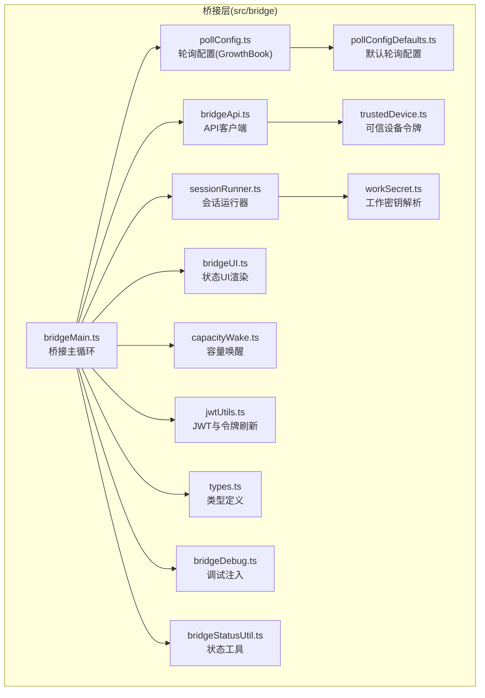
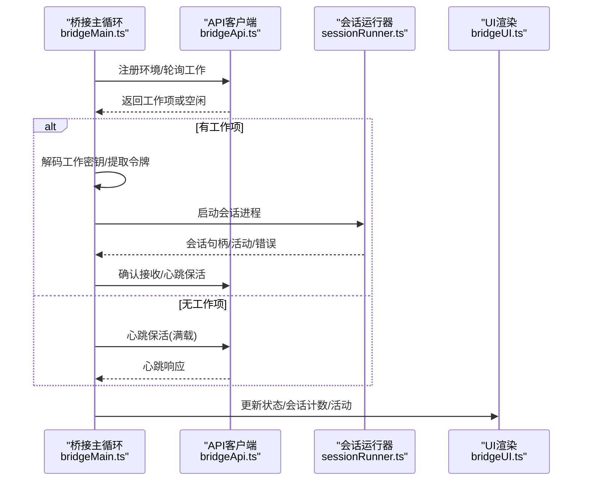
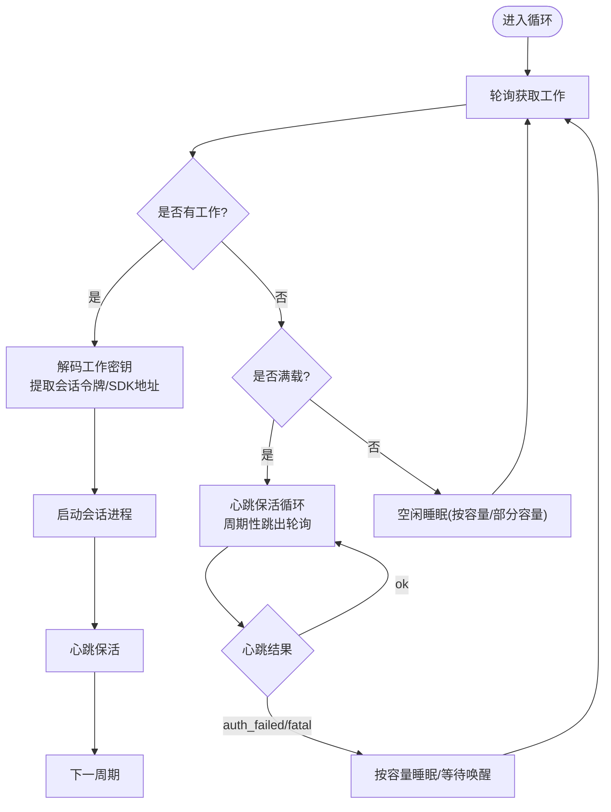
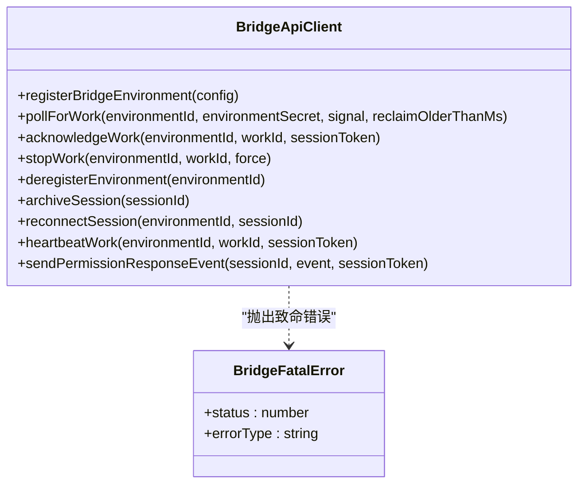
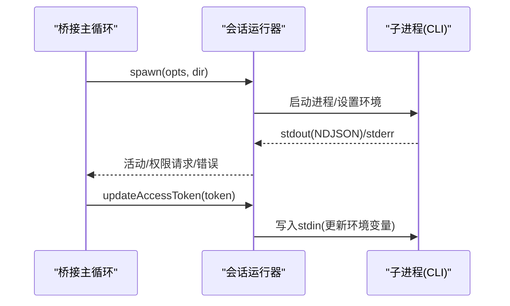
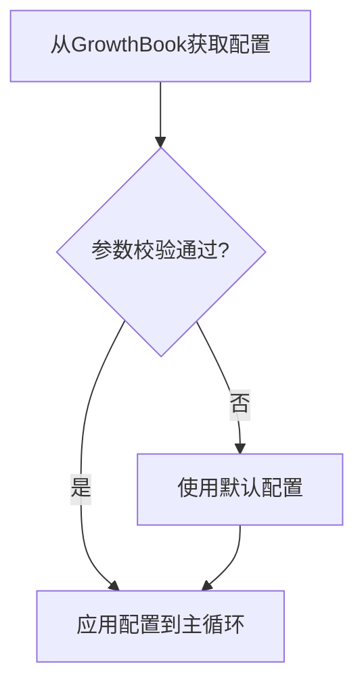
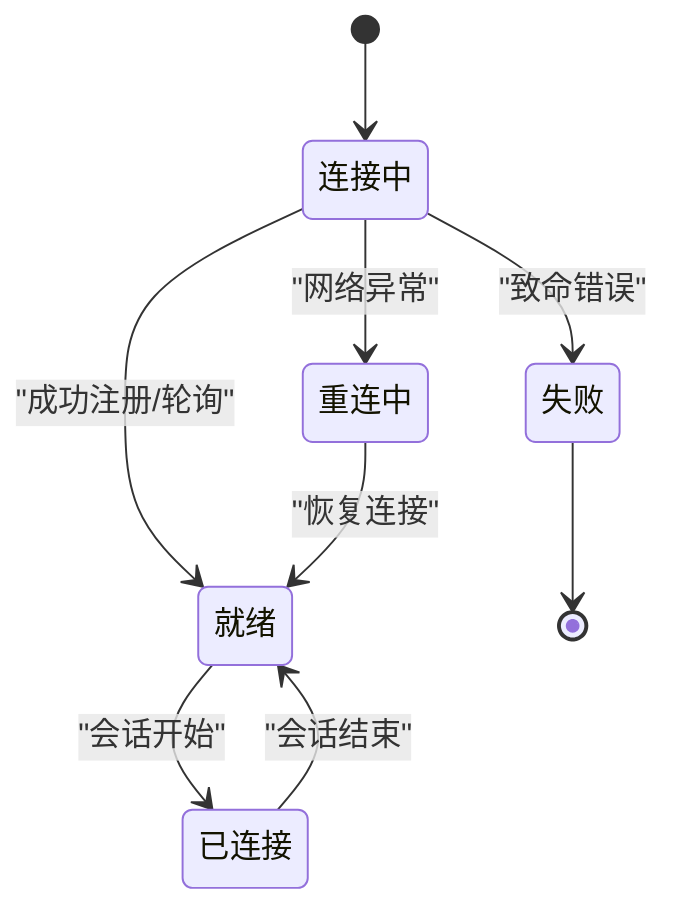
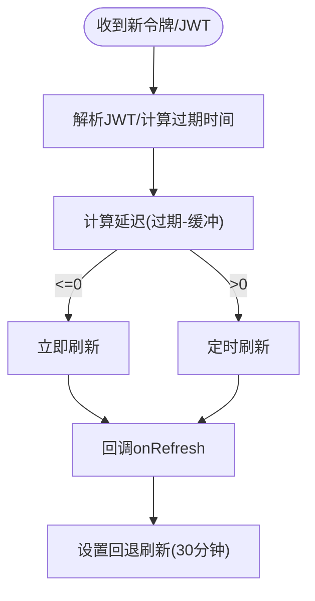
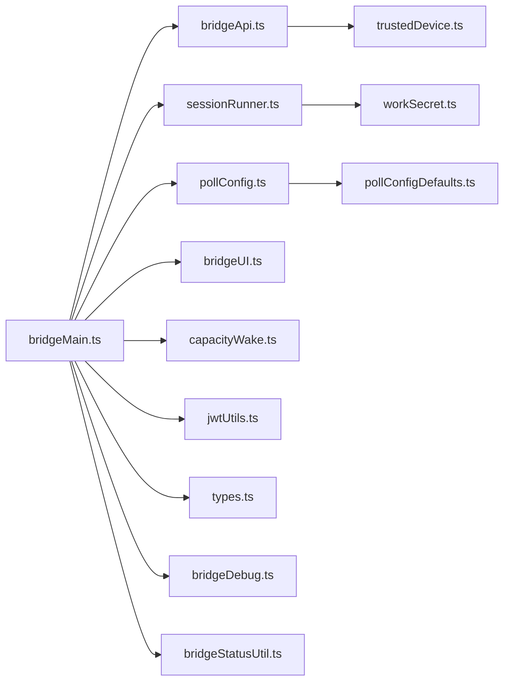

# 桥接层架构

<cite>
**本文档引用的文件**
- [src/bridge/bridgeMain.ts](file://src/bridge/bridgeMain.ts)
- [src/bridge/bridgeApi.ts](file://src/bridge/bridgeApi.ts)
- [src/bridge/bridgeConfig.ts](file://src/bridge/bridgeConfig.ts)
- [src/bridge/sessionRunner.ts](file://src/bridge/sessionRunner.ts)
- [src/bridge/pollConfig.ts](file://src/bridge/pollConfig.ts)
- [src/bridge/pollConfigDefaults.ts](file://src/bridge/pollConfigDefaults.ts)
- [src/bridge/types.ts](file://src/bridge/types.ts)
- [src/bridge/bridgeMessaging.ts](file://src/bridge/bridgeMessaging.ts)
- [src/bridge/bridgeUI.ts](file://src/bridge/bridgeUI.ts)
- [src/bridge/bridgeDebug.ts](file://src/bridge/bridgeDebug.ts)
- [src/bridge/bridgeStatusUtil.ts](file://src/bridge/bridgeStatusUtil.ts)
- [src/bridge/capacityWake.ts](file://src/bridge/capacityWake.ts)
- [src/bridge/jwtUtils.ts](file://src/bridge/jwtUtils.ts)
- [src/bridge/trustedDevice.ts](file://src/bridge/trustedDevice.ts)
- [src/bridge/workSecret.ts](file://src/bridge/workSecret.ts)
</cite>

## 目录
1. [引言](#引言)
2. [项目结构](#项目结构)
3. [核心组件](#核心组件)
4. [架构总览](#架构总览)
5. [详细组件分析](#详细组件分析)
6. [依赖关系分析](#依赖关系分析)
7. [性能考量](#性能考量)
8. [故障排查指南](#故障排查指南)
9. [结论](#结论)
10. [附录](#附录)

## 引言
本文件面向Claude Code桥接层（Remote Control）的架构设计与实现，系统性阐述桥接层的整体理念、工作负载调度、会话管理、状态同步、主循环机制、配置体系、与远程服务器的交互模式、性能优化与资源管理策略，并提供调试与监控方法。目标读者既包括需要快速上手的使用者，也包括希望深入理解实现细节的工程师。

## 项目结构
桥接层位于src/bridge目录下，围绕“桥接主循环”组织核心逻辑，通过API客户端、会话运行器、UI渲染、配置与工具模块协同工作，形成稳定的远程控制通道。

图表来源
- [src/bridge/bridgeMain.ts:141-900](file://src/bridge/bridgeMain.ts#L141-L900)
- [src/bridge/bridgeApi.ts:68-452](file://src/bridge/bridgeApi.ts#L68-L452)
- [src/bridge/sessionRunner.ts:248-548](file://src/bridge/sessionRunner.ts#L248-L548)
- [src/bridge/pollConfig.ts:102-111](file://src/bridge/pollConfig.ts#L102-L111)
- [src/bridge/pollConfigDefaults.ts:55-83](file://src/bridge/pollConfigDefaults.ts#L55-L83)
- [src/bridge/types.ts:81-263](file://src/bridge/types.ts#L81-L263)
- [src/bridge/bridgeUI.ts:42-531](file://src/bridge/bridgeUI.ts#L42-L531)
- [src/bridge/bridgeDebug.ts:54-136](file://src/bridge/bridgeDebug.ts#L54-L136)
- [src/bridge/bridgeStatusUtil.ts:38-164](file://src/bridge/bridgeStatusUtil.ts#L38-L164)
- [src/bridge/capacityWake.ts:28-57](file://src/bridge/capacityWake.ts#L28-L57)
- [src/bridge/jwtUtils.ts:72-257](file://src/bridge/jwtUtils.ts#L72-L257)
- [src/bridge/trustedDevice.ts:54-211](file://src/bridge/trustedDevice.ts#L54-L211)
- [src/bridge/workSecret.ts:6-128](file://src/bridge/workSecret.ts#L6-L128)

章节来源
- [src/bridge/bridgeMain.ts:141-900](file://src/bridge/bridgeMain.ts#L141-L900)
- [src/bridge/types.ts:81-263](file://src/bridge/types.ts#L81-L263)

## 核心组件
- 桥接主循环：负责轮询、心跳、会话生命周期管理、错误处理与重连、容量唤醒与状态更新。
- API客户端：封装HTTP请求、鉴权、重试、错误分类与致命错误处理。
- 会话运行器：子进程管理、活动追踪、权限请求转发、令牌更新、转录日志。
- 轮询配置：基于GrowthBook的动态轮询参数，支持单/多会话模式下的不同节流策略。
- UI渲染：终端状态栏、QR码、会话列表、工具活动展示与闪烁动画。
- 容量唤醒：在“满载”状态下睡眠并可被事件唤醒，避免空转。
- 令牌刷新：基于JWT过期时间的预刷新与回退刷新策略。
- 可信设备：在Elevated安全级别下发送X-Trusted-Device-Token头。
- 工作密钥：解码服务端下发的工作密钥，提取会话令牌与SDK地址。
- 调试注入：仅限Ant用户，用于注入故障以验证恢复路径。

章节来源
- [src/bridge/bridgeMain.ts:141-900](file://src/bridge/bridgeMain.ts#L141-L900)
- [src/bridge/bridgeApi.ts:68-452](file://src/bridge/bridgeApi.ts#L68-L452)
- [src/bridge/sessionRunner.ts:248-548](file://src/bridge/sessionRunner.ts#L248-L548)
- [src/bridge/pollConfig.ts:102-111](file://src/bridge/pollConfig.ts#L102-L111)
- [src/bridge/bridgeUI.ts:42-531](file://src/bridge/bridgeUI.ts#L42-L531)
- [src/bridge/capacityWake.ts:28-57](file://src/bridge/capacityWake.ts#L28-L57)
- [src/bridge/jwtUtils.ts:72-257](file://src/bridge/jwtUtils.ts#L72-L257)
- [src/bridge/trustedDevice.ts:54-211](file://src/bridge/trustedDevice.ts#L54-L211)
- [src/bridge/workSecret.ts:6-128](file://src/bridge/workSecret.ts#L6-L128)
- [src/bridge/bridgeDebug.ts:54-136](file://src/bridge/bridgeDebug.ts#L54-L136)

## 架构总览
桥接层采用“主循环 + 多组件协作”的模式：
- 主循环驱动：根据轮询配置在“寻找工作”和“心跳保活”之间切换；在满载时进入低功耗心跳模式或按容量唤醒。
- 会话管理：通过会话运行器启动/终止子进程，追踪活动与错误，转发权限请求。
- 状态同步：UI渲染器根据当前状态、仓库分支、会话数、工具活动实时更新显示。
- 配置与策略：轮询参数、心跳间隔、会话超时、令牌刷新缓冲等均通过配置模块统一管理。
- 错误与恢复：区分致命错误与瞬时错误，采用指数退避、重连、重新派发等策略。

图表来源
- [src/bridge/bridgeMain.ts:600-784](file://src/bridge/bridgeMain.ts#L600-L784)
- [src/bridge/bridgeApi.ts:199-417](file://src/bridge/bridgeApi.ts#L199-L417)
- [src/bridge/sessionRunner.ts:248-548](file://src/bridge/sessionRunner.ts#L248-L548)
- [src/bridge/bridgeUI.ts:42-531](file://src/bridge/bridgeUI.ts#L42-L531)

## 详细组件分析

### 桥接主循环（runBridgeLoop）
- 设计理念：以“轮询/心跳”双轨机制为核心，结合容量唤醒与状态更新，实现低开销、高鲁棒性的远程控制通道。
- 关键机制：
  - 轮询与心跳：根据配置在“寻找工作”和“心跳保活”间切换；满载时优先心跳，必要时周期性跳出到轮询。
  - 容量唤醒：当会话结束或传输丢失时，提前从满载睡眠中唤醒，立即检查新工作。
  - 令牌刷新：对v1使用OAuth直传，对v2通过reconnectSession触发服务端重新派发。
  - 会话超时：基于配置的会话超时阈值进行看门狗式清理。
  - 错误处理：区分致命错误（如401/403/404/410）与瞬时错误（网络/5xx），采用不同恢复策略。
- 重连与恢复：在连接断开后记录断开时长，恢复后上报统计；对JWT过期触发reconnectSession以重新派发工作。

图表来源
- [src/bridge/bridgeMain.ts:600-784](file://src/bridge/bridgeMain.ts#L600-L784)
- [src/bridge/capacityWake.ts:28-57](file://src/bridge/capacityWake.ts#L28-L57)

章节来源
- [src/bridge/bridgeMain.ts:141-900](file://src/bridge/bridgeMain.ts#L141-L900)

### API客户端（createBridgeApiClient）
- 认证与重试：统一通过Bearer Token访问，401时尝试OAuth刷新并重试一次；其他错误按状态码分类为致命错误。
- 请求封装：注册环境、轮询工作、确认接收、停止工作、注销环境、归档会话、重连会话、心跳保活、发送权限响应事件。
- 安全头：可选添加X-Trusted-Device-Token，满足Elevated安全级别的要求。
- 错误分类：401/403/404/410作为致命错误抛出；429限流；其他非2xx抛出普通错误。

图表来源
- [src/bridge/bridgeApi.ts:68-452](file://src/bridge/bridgeApi.ts#L68-L452)
- [src/bridge/types.ts:133-176](file://src/bridge/types.ts#L133-L176)

章节来源
- [src/bridge/bridgeApi.ts:68-452](file://src/bridge/bridgeApi.ts#L68-L452)

### 会话运行器（createSessionSpawner）
- 子进程管理：构建参数与环境变量，启动CLI子进程；屏蔽桥接OAuth令牌，确保子进程使用会话令牌。
- 活动追踪：解析子进程stdout的NDJSON，提取工具执行、文本生成、结果/错误等活动，维护环形缓冲。
- 权限请求：检测control_request并转发给服务器；支持首次用户消息标题推导。
- 令牌更新：通过stdin发送更新后的OAuth令牌，使子进程即时生效。
- 日志与转录：可选写入调试日志与转录文件，便于排障。

图表来源
- [src/bridge/sessionRunner.ts:248-548](file://src/bridge/sessionRunner.ts#L248-L548)

章节来源
- [src/bridge/sessionRunner.ts:248-548](file://src/bridge/sessionRunner.ts#L248-L548)

### 轮询配置与动态节流
- 动态配置：通过GrowthBook拉取轮询参数，包含“不在容量时”、“部分容量时”、“满载时”的轮询间隔，以及心跳间隔、回收旧任务窗口、会话保活间隔等。
- 参数校验：严格的Zod校验，拒绝不合理的值；至少启用一种满载保活机制（心跳或轮询）。
- 默认值：未命中配置时回退到默认值，保证行为稳定。

图表来源
- [src/bridge/pollConfig.ts:102-111](file://src/bridge/pollConfig.ts#L102-L111)
- [src/bridge/pollConfigDefaults.ts:55-83](file://src/bridge/pollConfigDefaults.ts#L55-L83)

章节来源
- [src/bridge/pollConfig.ts:102-111](file://src/bridge/pollConfig.ts#L102-L111)
- [src/bridge/pollConfigDefaults.ts:55-83](file://src/bridge/pollConfigDefaults.ts#L55-L83)

### UI渲染与状态同步
- 状态机：idle/attached/titled/reconnecting/failed五种状态，配合闪烁动画与QR码展示。
- 会话列表：多会话模式下显示每个会话的标题、URL与活动摘要。
- 工具活动：最近工具执行摘要在一定时间内可见，提升交互反馈。
- 连接信息：在空闲/活跃状态下显示不同的底部提示与QR码切换。

图表来源
- [src/bridge/bridgeUI.ts:42-531](file://src/bridge/bridgeUI.ts#L42-L531)
- [src/bridge/bridgeStatusUtil.ts:9-164](file://src/bridge/bridgeStatusUtil.ts#L9-L164)

章节来源
- [src/bridge/bridgeUI.ts:42-531](file://src/bridge/bridgeUI.ts#L42-L531)
- [src/bridge/bridgeStatusUtil.ts:38-164](file://src/bridge/bridgeStatusUtil.ts#L38-L164)

### 令牌刷新与可信设备
- 令牌刷新：基于JWT的exp字段计算刷新时机，预留缓冲时间；若无法解析JWT则采用回退刷新间隔；失败达到上限后退避重试。
- v2重连：对于CCR v2会话，OAuth刷新改为调用reconnectSession触发服务端重新派发。
- 可信设备：在Elevated安全级别下，通过X-Trusted-Device-Token头增强认证；支持设备注册、缓存与清理。

图表来源
- [src/bridge/jwtUtils.ts:72-257](file://src/bridge/jwtUtils.ts#L72-L257)
- [src/bridge/trustedDevice.ts:54-211](file://src/bridge/trustedDevice.ts#L54-L211)

章节来源
- [src/bridge/jwtUtils.ts:72-257](file://src/bridge/jwtUtils.ts#L72-L257)
- [src/bridge/trustedDevice.ts:54-211](file://src/bridge/trustedDevice.ts#L54-L211)

### 工作密钥与SDK地址
- 工作密钥解码：base64url解码并校验版本，提取会话入口令牌、API基础URL、源信息、认证信息、环境变量与CCR v2选择器。
- SDK地址构建：根据API基础URL与会话ID生成WebSocket/SSE地址，区分本地与生产路径。
- 会话ID兼容：支持cse_*与session_*两种前缀的兼容比较，确保内部一致性。

章节来源
- [src/bridge/workSecret.ts:6-128](file://src/bridge/workSecret.ts#L6-L128)

### 消息路由与权限控制
- 入站消息处理：解析NDJSON，过滤echo与重复消息，识别control_request/control_response，按类型分发。
- 控制请求响应：对initialize/set_model/set_max_thinking_tokens/set_permission_mode/interrupt等请求快速响应，避免服务器挂起。
- 结果消息：在会话结束时构造最小化result事件，确保服务端能正确归档。

章节来源
- [src/bridge/bridgeMessaging.ts:132-417](file://src/bridge/bridgeMessaging.ts#L132-L417)

### 调试与监控
- 调试注入：仅限Ant用户，可注入致命/瞬时错误，测试恢复路径；支持强制重连、唤醒轮询、描述当前环境/会话ID。
- 统计事件：连接断开时长、心跳模式进入/退出、会话完成、令牌刷新、桥接错误等事件上报。
- 诊断日志：桥接启动、会话开始/结束、API调用详情、令牌刷新轨迹等。

章节来源
- [src/bridge/bridgeDebug.ts:54-136](file://src/bridge/bridgeDebug.ts#L54-L136)
- [src/bridge/bridgeApi.ts:454-540](file://src/bridge/bridgeApi.ts#L454-L540)

## 依赖关系分析
- 模块内聚：bridgeMain集中编排，sessionRunner与bridgeApi分别承担“进程生命周期”和“远端通信”，职责清晰。
- 外部依赖：axios用于HTTP请求；chalk/qrcode用于UI输出；lodash-es/memoize用于可信设备令牌缓存。
- 循环依赖：未发现直接循环；通过接口类型与工厂函数解耦。

图表来源
- [src/bridge/bridgeMain.ts:141-900](file://src/bridge/bridgeMain.ts#L141-L900)
- [src/bridge/bridgeApi.ts:68-452](file://src/bridge/bridgeApi.ts#L68-L452)
- [src/bridge/sessionRunner.ts:248-548](file://src/bridge/sessionRunner.ts#L248-L548)
- [src/bridge/pollConfig.ts:102-111](file://src/bridge/pollConfig.ts#L102-L111)
- [src/bridge/pollConfigDefaults.ts:55-83](file://src/bridge/pollConfigDefaults.ts#L55-L83)
- [src/bridge/bridgeUI.ts:42-531](file://src/bridge/bridgeUI.ts#L42-L531)
- [src/bridge/capacityWake.ts:28-57](file://src/bridge/capacityWake.ts#L28-L57)
- [src/bridge/jwtUtils.ts:72-257](file://src/bridge/jwtUtils.ts#L72-L257)
- [src/bridge/trustedDevice.ts:54-211](file://src/bridge/trustedDevice.ts#L54-L211)
- [src/bridge/workSecret.ts:6-128](file://src/bridge/workSecret.ts#L6-L128)
- [src/bridge/bridgeDebug.ts:54-136](file://src/bridge/bridgeDebug.ts#L54-L136)
- [src/bridge/bridgeStatusUtil.ts:38-164](file://src/bridge/bridgeStatusUtil.ts#L38-L164)
- [src/bridge/types.ts:81-263](file://src/bridge/types.ts#L81-L263)

## 性能考量
- 节流与背压：通过轮询配置与容量唤醒避免空转；满载时仅心跳保活，必要时周期性轮询。
- 令牌预刷新：减少因JWT过期导致的中断与重连成本；v2场景通过reconnectSession避免无声死亡。
- 资源管理：会话超时看门狗、工作树清理、日志与转录文件的及时关闭，降低资源泄漏风险。
- UI渲染：状态行按需更新，避免频繁重绘；QR码与闪烁动画仅在需要时生成与更新。

## 故障排查指南
- 常见错误定位：
  - 401/403：登录失效或权限不足，检查OAuth令牌与组织权限；必要时重新登录。
  - 404/410：环境过期或不存在，需重新注册环境或重启桥接。
  - 429：轮询过于频繁，调整轮询配置或等待限流恢复。
- 诊断步骤：
  - 查看桥接启动日志与会话日志（--debug-file或临时目录）。
  - 使用桥接调试命令注入故障，观察恢复路径是否按预期工作。
  - 检查令牌刷新链路与可信设备令牌缓存状态。
- 监控指标：
  - 连接断开时长、心跳模式进入/退出次数、会话完成/失败统计、令牌刷新成功率。

章节来源
- [src/bridge/bridgeApi.ts:454-540](file://src/bridge/bridgeApi.ts#L454-L540)
- [src/bridge/bridgeDebug.ts:54-136](file://src/bridge/bridgeDebug.ts#L54-L136)
- [src/bridge/jwtUtils.ts:72-257](file://src/bridge/jwtUtils.ts#L72-L257)
- [src/bridge/trustedDevice.ts:54-211](file://src/bridge/trustedDevice.ts#L54-L211)

## 结论
桥接层通过“主循环 + 多组件协作”的架构，在保证稳定性的同时实现了灵活的动态配置、高效的令牌管理与完善的错误恢复机制。其设计兼顾了用户体验（实时状态、QR码、工具活动）与工程实践（日志、转录、调试注入）。建议在生产环境中结合轮询配置与令牌刷新策略，持续监控关键指标，以获得最佳的远程控制体验。

## 附录
- 配置要点速查：
  - 最大并发会话数：config.maxSessions
  - 轮询间隔（不在容量/满载/部分容量）：由轮询配置模块提供
  - 心跳间隔：non_exclusive_heartbeat_interval_ms
  - 会话超时：sessionTimeoutMs（默认24小时）
  - 回收旧任务窗口：reclaim_older_than_ms
- 关键流程参考路径：
  - 主循环入口：[runBridgeLoop:141-900](file://src/bridge/bridgeMain.ts#L141-L900)
  - API调用封装：[createBridgeApiClient:68-452](file://src/bridge/bridgeApi.ts#L68-L452)
  - 会话启动与活动追踪：[createSessionSpawner:248-548](file://src/bridge/sessionRunner.ts#L248-L548)
  - 轮询配置加载：[getPollIntervalConfig:102-111](file://src/bridge/pollConfig.ts#L102-L111)
  - UI状态渲染：[createBridgeLogger:42-531](file://src/bridge/bridgeUI.ts#L42-L531)
  - 令牌刷新调度：[createTokenRefreshScheduler:72-257](file://src/bridge/jwtUtils.ts#L72-L257)
  - 可信设备令牌：[getTrustedDeviceToken:54-211](file://src/bridge/trustedDevice.ts#L54-L211)
  - 工作密钥解码与SDK地址：[decodeWorkSecret/buildSdkUrl:6-128](file://src/bridge/workSecret.ts#L6-L128)
  - 消息路由与权限响应：[handleIngressMessage/handleServerControlRequest:132-417](file://src/bridge/bridgeMessaging.ts#L132-L417)
  - 调试注入与故障模拟：[wrapApiForFaultInjection:84-136](file://src/bridge/bridgeDebug.ts#L84-L136)