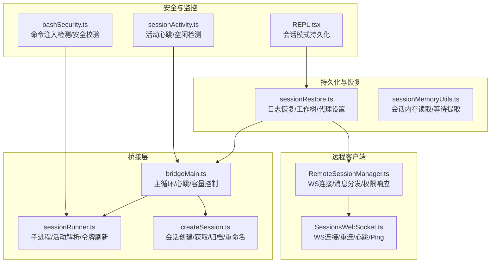
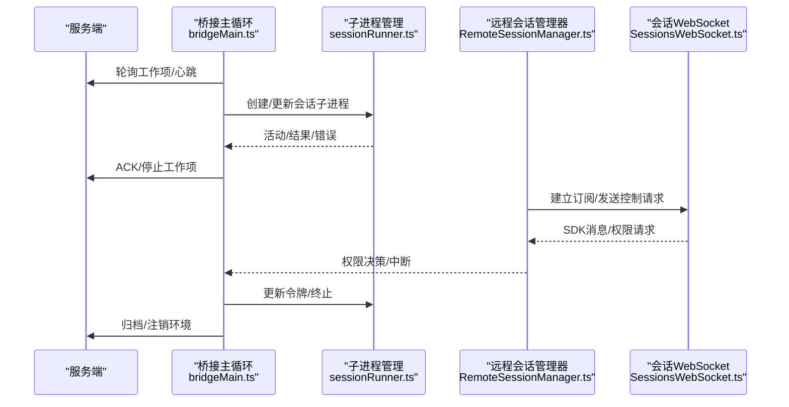
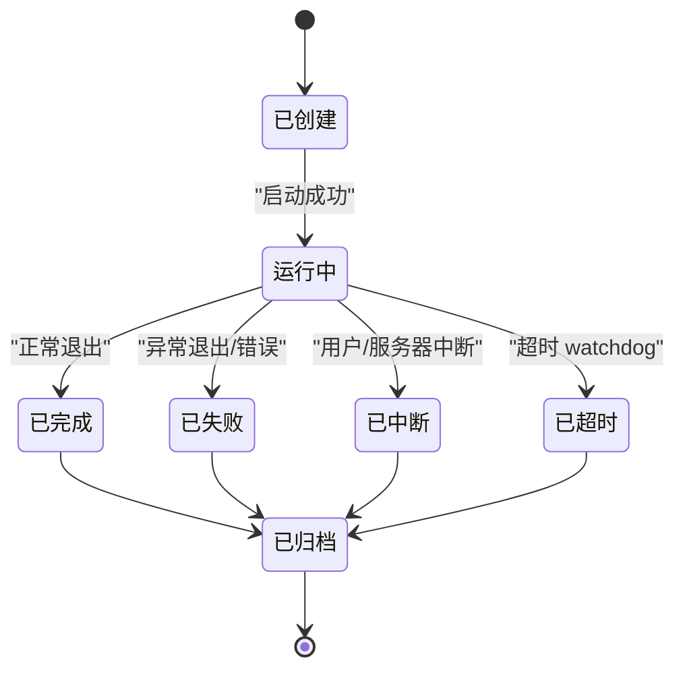
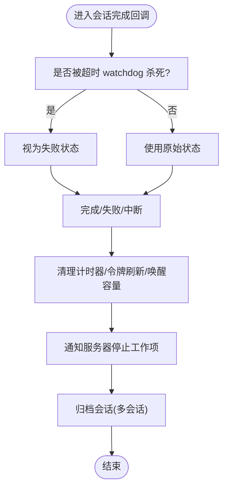
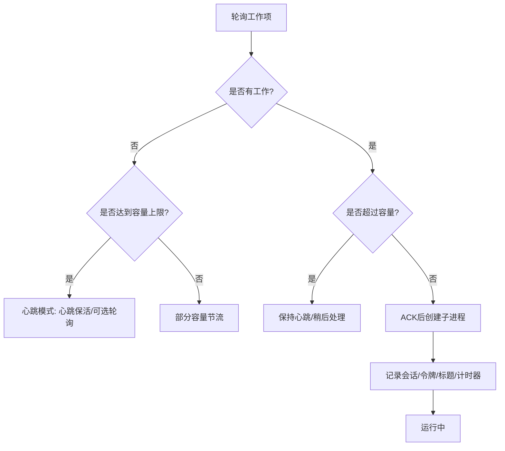
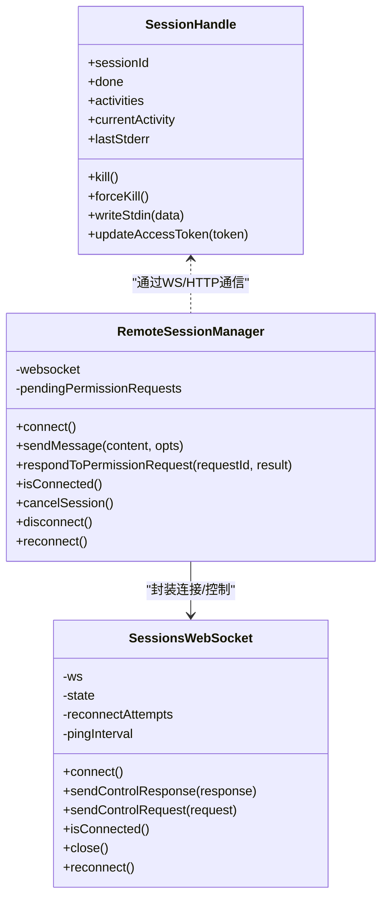
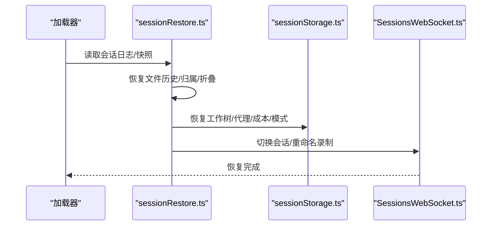
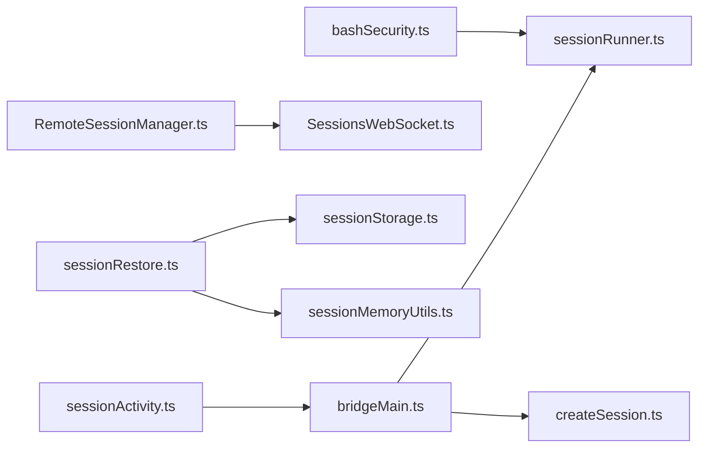

# 远程会话管理

<cite>
**本文档引用的文件**
- [bridgeMain.ts](file://src/bridge/bridgeMain.ts)
- [sessionRunner.ts](file://src/bridge/sessionRunner.ts)
- [RemoteSessionManager.ts](file://src/remote/RemoteSessionManager.ts)
- [SessionsWebSocket.ts](file://src/remote/SessionsWebSocket.ts)
- [createSession.ts](file://src/bridge/createSession.ts)
- [sessionRestore.ts](file://src/utils/sessionRestore.ts)
- [sessionMemoryUtils.ts](file://src/services/SessionMemory/sessionMemoryUtils.ts)
- [sessionActivity.ts](file://src/utils/sessionActivity.ts)
- [bashSecurity.ts](file://src/tools/BashTool/bashSecurity.ts)
- [REPL.tsx](file://src/screens/REPL.tsx)
</cite>

## 目录
1. [简介](#简介)
2. [项目结构](#项目结构)
3. [核心组件](#核心组件)
4. [架构总览](#架构总览)
5. [详细组件分析](#详细组件分析)
6. [依赖关系分析](#依赖关系分析)
7. [性能考虑](#性能考虑)
8. [故障排除指南](#故障排除指南)
9. [结论](#结论)

## 简介
本文件系统性阐述 Claude Code 远程会话管理系统的实现，覆盖会话生命周期（创建、启动、运行、停止、销毁）、状态跟踪与转换、会话池容量与复用、隔离与安全、持久化与恢复、以及监控与诊断。内容基于仓库源码进行深入分析，配合可视化图表帮助读者理解跨模块协作。

## 项目结构
围绕远程会话管理的关键目录与文件：
- 桥接层：负责与服务端交互、调度子进程、维护会话池与心跳、处理超时与清理
- 远程客户端：通过 WebSocket 订阅会话事件，处理权限请求与中断信号
- 会话持久化与恢复：从日志重建对话状态、工作树状态、代理设置等
- 安全与隔离：工具执行安全校验、进程间隔离、权限控制

**图表来源**
- [bridgeMain.ts:141-1580](file://src/bridge/bridgeMain.ts#L141-L1580)
- [sessionRunner.ts:248-551](file://src/bridge/sessionRunner.ts#L248-L551)
- [RemoteSessionManager.ts:95-324](file://src/remote/RemoteSessionManager.ts#L95-L324)
- [SessionsWebSocket.ts:82-405](file://src/remote/SessionsWebSocket.ts#L82-L405)
- [createSession.ts:34-384](file://src/bridge/createSession.ts#L34-L384)
- [sessionRestore.ts:99-551](file://src/utils/sessionRestore.ts#L99-L551)
- [sessionMemoryUtils.ts:85-138](file://src/services/SessionMemory/sessionMemoryUtils.ts#L85-L138)
- [sessionActivity.ts:1-133](file://src/utils/sessionActivity.ts#L1-L133)
- [bashSecurity.ts:1017-1044](file://src/tools/BashTool/bashSecurity.ts#L1017-L1044)
- [REPL.tsx:1894-1910](file://src/screens/REPL.tsx#L1894-L1910)

**章节来源**
- [bridgeMain.ts:141-1580](file://src/bridge/bridgeMain.ts#L141-L1580)
- [sessionRunner.ts:248-551](file://src/bridge/sessionRunner.ts#L248-L551)
- [RemoteSessionManager.ts:95-324](file://src/remote/RemoteSessionManager.ts#L95-L324)
- [SessionsWebSocket.ts:82-405](file://src/remote/SessionsWebSocket.ts#L82-L405)
- [createSession.ts:34-384](file://src/bridge/createSession.ts#L34-L384)
- [sessionRestore.ts:99-551](file://src/utils/sessionRestore.ts#L99-L551)
- [sessionMemoryUtils.ts:85-138](file://src/services/SessionMemory/sessionMemoryUtils.ts#L85-L138)
- [sessionActivity.ts:1-133](file://src/utils/sessionActivity.ts#L1-L133)
- [bashSecurity.ts:1017-1044](file://src/tools/BashTool/bashSecurity.ts#L1017-L1044)
- [REPL.tsx:1894-1910](file://src/screens/REPL.tsx#L1894-L1910)

## 核心组件
- 桥接主循环（bridgeMain.ts）：轮询工作项、按容量调度、心跳保活、超时与失败处理、优雅关闭
- 子进程会话管理（sessionRunner.ts）：子进程生命周期、活动解析、权限请求转发、令牌更新
- 远程会话管理器（RemoteSessionManager.ts + SessionsWebSocket.ts）：WebSocket 订阅、权限请求/响应、中断、重连
- 会话创建与元数据（createSession.ts）：创建/获取/归档/重命名会话
- 会话恢复（sessionRestore.ts）：从日志重建状态、工作树、代理设置、成本状态
- 持久化与内存（sessionMemoryUtils.ts）
- 活动与监控（sessionActivity.ts）
- 安全校验（bashSecurity.ts）

**章节来源**
- [bridgeMain.ts:141-1580](file://src/bridge/bridgeMain.ts#L141-L1580)
- [sessionRunner.ts:248-551](file://src/bridge/sessionRunner.ts#L248-L551)
- [RemoteSessionManager.ts:95-324](file://src/remote/RemoteSessionManager.ts#L95-L324)
- [SessionsWebSocket.ts:82-405](file://src/remote/SessionsWebSocket.ts#L82-L405)
- [createSession.ts:34-384](file://src/bridge/createSession.ts#L34-L384)
- [sessionRestore.ts:99-551](file://src/utils/sessionRestore.ts#L99-L551)
- [sessionMemoryUtils.ts:85-138](file://src/services/SessionMemory/sessionMemoryUtils.ts#L85-L138)
- [sessionActivity.ts:1-133](file://src/utils/sessionActivity.ts#L1-L133)
- [bashSecurity.ts:1017-1044](file://src/tools/BashTool/bashSecurity.ts#L1017-L1044)

## 架构总览
远程会话管理由“桥接层 + 远程客户端 + 持久化/恢复”三层构成，桥接层负责与服务端协调与本地子进程管理；远程客户端负责与远端会话建立实时通信；持久化/恢复在需要时从历史记录重建上下文。

**图表来源**
- [bridgeMain.ts:600-1580](file://src/bridge/bridgeMain.ts#L600-L1580)
- [sessionRunner.ts:248-551](file://src/bridge/sessionRunner.ts#L248-L551)
- [RemoteSessionManager.ts:95-324](file://src/remote/RemoteSessionManager.ts#L95-L324)
- [SessionsWebSocket.ts:82-405](file://src/remote/SessionsWebSocket.ts#L82-L405)

## 详细组件分析

### 会话生命周期管理
- 创建：桥接层根据工作项解码密钥，选择 v1（Session-Ingress WS）或 v2（/v1/code/sessions SSE）路径，注册 worker 并创建子进程；必要时为 on-demand 会话创建独立 git worktree
- 启动：记录开始时间、设置标题、启动状态更新、注册超时定时器、安排令牌刷新
- 运行：解析子进程输出中的活动与结果，维护最近活动列表；处理权限请求转发至服务器；保持心跳与 Ping
- 停止：收到完成回调后清理计时器、取消令牌刷新、唤醒容量等待、通知服务器停止工作项
- 销毁：桥接优雅关闭时，向所有活跃会话发送 SIGTERM，超时后 SIGKILL；清理 worktree、归档会话、注销环境

**图表来源**
- [bridgeMain.ts:442-591](file://src/bridge/bridgeMain.ts#L442-L591)
- [sessionRunner.ts:448-480](file://src/bridge/sessionRunner.ts#L448-L480)

**章节来源**
- [bridgeMain.ts:859-1204](file://src/bridge/bridgeMain.ts#L859-L1204)
- [sessionRunner.ts:248-551](file://src/bridge/sessionRunner.ts#L248-L551)

### 会话状态跟踪与转换
- 活动状态：从子进程输出解析 tool_start/text/result/error，维护最近活动列表，用于状态栏显示与诊断
- 错误状态：捕获子进程退出码与 stderr，区分失败与中断；对致命错误（401/403/过期）直接终止
- 完成状态：完成回调触发清理流程，区分超时杀死与正常结束；对多会话模式保留会话以便复用

**图表来源**
- [bridgeMain.ts:442-591](file://src/bridge/bridgeMain.ts#L442-L591)

**章节来源**
- [bridgeMain.ts:442-591](file://src/bridge/bridgeMain.ts#L442-L591)
- [sessionRunner.ts:107-200](file://src/bridge/sessionRunner.ts#L107-L200)

### 会话池管理策略
- 最大会话数限制：根据配置与当前活跃会话数量决定是否接受新会话；在容量满载时进入“心跳模式”，周期性心跳保活而非轮询
- 会话复用：多会话模式下，会话完成后不立即退出桥接，而是归档并等待新工作项；单会话模式下会话结束后桥接退出
- 资源回收：超时 watchdog 清理长时间无响应会话；优雅关闭阶段统一 SIGTERM/SIGKILL，清理 worktree 与令牌刷新任务

**图表来源**
- [bridgeMain.ts:600-746](file://src/bridge/bridgeMain.ts#L600-L746)
- [bridgeMain.ts:859-1204](file://src/bridge/bridgeMain.ts#L859-L1204)

**章节来源**
- [bridgeMain.ts:600-746](file://src/bridge/bridgeMain.ts#L600-L746)
- [bridgeMain.ts:859-1204](file://src/bridge/bridgeMain.ts#L859-L1204)

### 会话间的隔离与安全
- 进程隔离：每个会话作为独立子进程运行，支持 worktree 隔离避免文件冲突；支持沙箱模式强制隔离
- 内存管理：会话调试日志与转录文件分离存储，便于问题定位；会话内存读取带超时与过期保护
- 权限控制：工具调用前通过权限请求流程，远程客户端转发控制请求到服务器审批；bash 安全校验防止 IFS 注入与敏感路径访问

**图表来源**
- [sessionRunner.ts:482-543](file://src/bridge/sessionRunner.ts#L482-L543)
- [RemoteSessionManager.ts:95-324](file://src/remote/RemoteSessionManager.ts#L95-L324)
- [SessionsWebSocket.ts:82-405](file://src/remote/SessionsWebSocket.ts#L82-L405)

**章节来源**
- [sessionRunner.ts:248-551](file://src/bridge/sessionRunner.ts#L248-L551)
- [RemoteSessionManager.ts:95-324](file://src/remote/RemoteSessionManager.ts#L95-L324)
- [SessionsWebSocket.ts:82-405](file://src/remote/SessionsWebSocket.ts#L82-L405)
- [bashSecurity.ts:1017-1044](file://src/tools/BashTool/bashSecurity.ts#L1017-L1044)

### 会话的持久化与恢复
- 日志恢复：从会话日志重建文件历史、归属信息、上下文折叠提交与快照、待办列表等
- 工作树恢复：根据会话最后的工作树状态自动切换回对应目录，若目录不存在则清理缓存标记
- 代理与模式：恢复会话使用的代理类型与模型覆盖；在协调者/普通模式切换时重新派生代理定义
- 成本与模式：恢复目标会话的成本状态；持久化当前模式以便后续恢复

**图表来源**
- [sessionRestore.ts:99-551](file://src/utils/sessionRestore.ts#L99-L551)
- [sessionMemoryUtils.ts:85-138](file://src/services/SessionMemory/sessionMemoryUtils.ts#L85-L138)
- [REPL.tsx:1894-1910](file://src/screens/REPL.tsx#L1894-L1910)

**章节来源**
- [sessionRestore.ts:99-551](file://src/utils/sessionRestore.ts#L99-L551)
- [sessionMemoryUtils.ts:85-138](file://src/services/SessionMemory/sessionMemoryUtils.ts#L85-L138)
- [REPL.tsx:1894-1910](file://src/screens/REPL.tsx#L1894-L1910)

### 监控与诊断
- 活动心跳：当存在活动时定期发送保活信号，空闲一段时间后记录空闲事件，支持诊断长尾空闲
- 桥接循环指标：记录会话开始/结束、心跳模式进入/退出、重连耗时、致命错误、关闭原因等
- 会话内存：提供会话内存内容读取与提取等待，带超时与过期阈值保护
- 会话标题：动态派生标题并与服务器同步，避免覆盖用户自定义标题

**章节来源**
- [sessionActivity.ts:1-133](file://src/utils/sessionActivity.ts#L1-L133)
- [bridgeMain.ts:651-705](file://src/bridge/bridgeMain.ts#L651-L705)
- [createSession.ts:327-384](file://src/bridge/createSession.ts#L327-L384)

## 依赖关系分析
- 组件耦合
  - bridgeMain 与 sessionRunner：强耦合（子进程生命周期、活动解析、令牌更新）
  - RemoteSessionManager 与 SessionsWebSocket：紧密耦合（连接/重连/控制）
  - sessionRestore 与 sessionStorage：依赖会话元数据与工作树状态
- 外部依赖
  - HTTP API：会话创建/获取/归档/重命名
  - WebSocket：会话订阅与控制
  - 文件系统：调试日志、转录文件、会话内存

**图表来源**
- [bridgeMain.ts:141-1580](file://src/bridge/bridgeMain.ts#L141-L1580)
- [sessionRunner.ts:248-551](file://src/bridge/sessionRunner.ts#L248-L551)
- [RemoteSessionManager.ts:95-324](file://src/remote/RemoteSessionManager.ts#L95-L324)
- [SessionsWebSocket.ts:82-405](file://src/remote/SessionsWebSocket.ts#L82-L405)
- [createSession.ts:34-384](file://src/bridge/createSession.ts#L34-L384)
- [sessionRestore.ts:99-551](file://src/utils/sessionRestore.ts#L99-L551)
- [sessionMemoryUtils.ts:85-138](file://src/services/SessionMemory/sessionMemoryUtils.ts#L85-L138)
- [sessionActivity.ts:1-133](file://src/utils/sessionActivity.ts#L1-L133)
- [bashSecurity.ts:1017-1044](file://src/tools/BashTool/bashSecurity.ts#L1017-L1044)

**章节来源**
- [bridgeMain.ts:141-1580](file://src/bridge/bridgeMain.ts#L141-L1580)
- [sessionRunner.ts:248-551](file://src/bridge/sessionRunner.ts#L248-L551)
- [RemoteSessionManager.ts:95-324](file://src/remote/RemoteSessionManager.ts#L95-L324)
- [SessionsWebSocket.ts:82-405](file://src/remote/SessionsWebSocket.ts#L82-L405)
- [createSession.ts:34-384](file://src/bridge/createSession.ts#L34-L384)
- [sessionRestore.ts:99-551](file://src/utils/sessionRestore.ts#L99-L551)
- [sessionMemoryUtils.ts:85-138](file://src/services/SessionMemory/sessionMemoryUtils.ts#L85-L138)
- [sessionActivity.ts:1-133](file://src/utils/sessionActivity.ts#L1-L133)
- [bashSecurity.ts:1017-1044](file://src/tools/BashTool/bashSecurity.ts#L1017-L1044)

## 性能考虑
- 心跳与轮询：在容量满载时采用心跳模式减少轮询压力，避免紧循环；心跳间隔与轮询间隔可配置
- 退避与抖动：网络错误与服务器错误采用指数退避并加入抖动，避免风暴效应
- 超时与保活：会话超时 watchdog 与活动心跳结合，既保证资源回收又避免误杀
- I/O 优化：调试日志与转录文件分离写入，避免阻塞主循环

[本节为通用指导，无需特定文件引用]

## 故障排除指南
- 会话无法启动
  - 检查工作密钥解码与会话 ingress 令牌；确认 v2 worker 注册是否成功
  - 查看子进程 stderr 与调试日志
- 会话卡住或无响应
  - 观察心跳模式日志与退出原因；检查超时配置与 watchdog 行为
  - 使用活动心跳诊断空闲时段
- 权限拒绝
  - 确认权限请求是否正确转发到服务器；检查 RemoteSessionManager 的权限响应流程
- 断线重连
  - SessionsWebSocket 对 4001（会话未找到）有限次重试；其他错误按最大尝试次数与延迟重连
- 优雅关闭
  - 确认 SIGTERM/SIGKILL 流程与 worktree 清理；检查归档与注销环境步骤

**章节来源**
- [bridgeMain.ts:1236-1400](file://src/bridge/bridgeMain.ts#L1236-L1400)
- [SessionsWebSocket.ts:234-288](file://src/remote/SessionsWebSocket.ts#L234-L288)
- [sessionActivity.ts:84-133](file://src/utils/sessionActivity.ts#L84-L133)
- [RemoteSessionManager.ts:186-214](file://src/remote/RemoteSessionManager.ts#L186-L214)

## 结论
该系统通过桥接主循环与子进程管理实现高并发会话的稳定调度，借助 WebSocket 实现与远端会话的实时交互，并以严格的权限控制与安全校验保障执行安全。持久化与恢复机制确保会话状态可追溯与可复原，监控与诊断能力为运维与排障提供支撑。整体设计兼顾可靠性、可扩展性与可观测性。