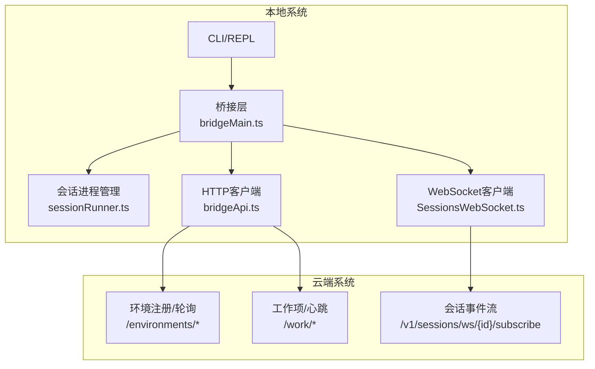
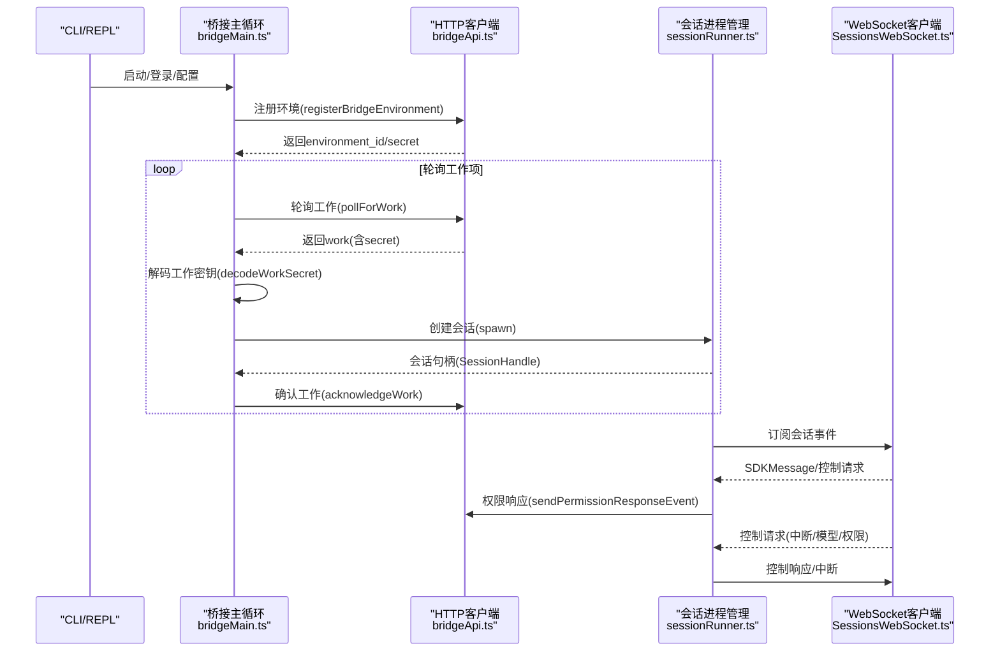
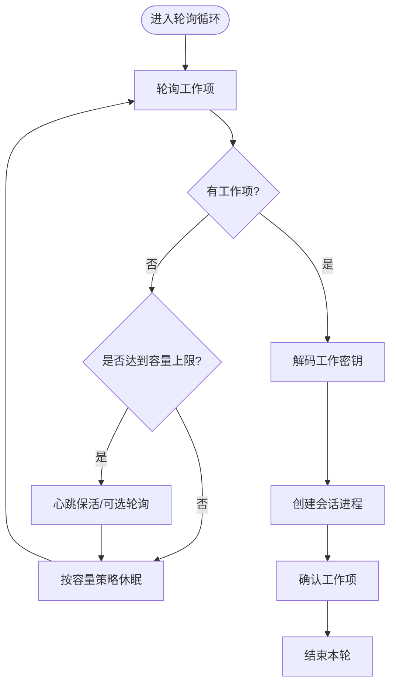
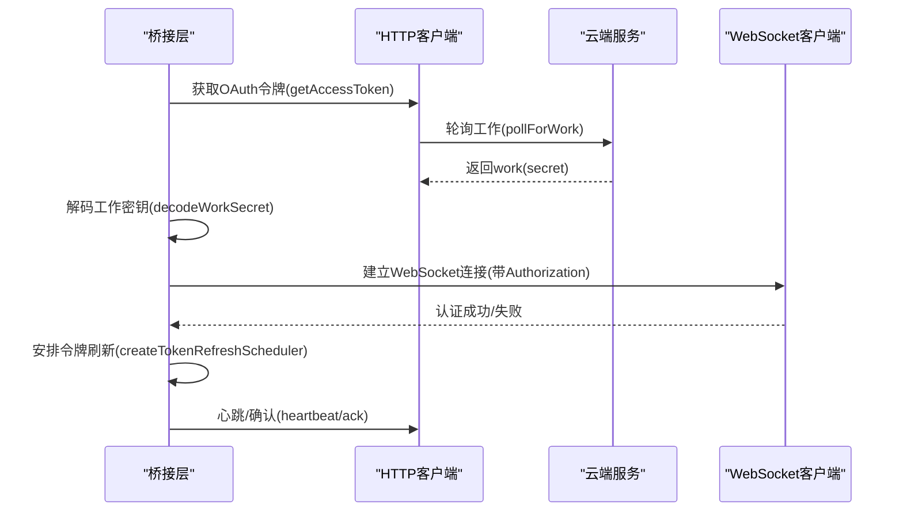
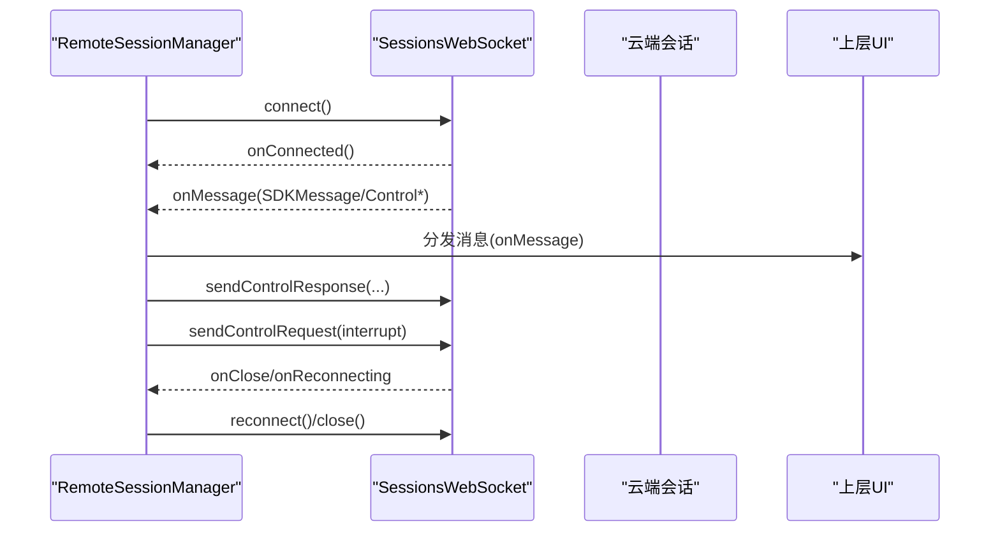
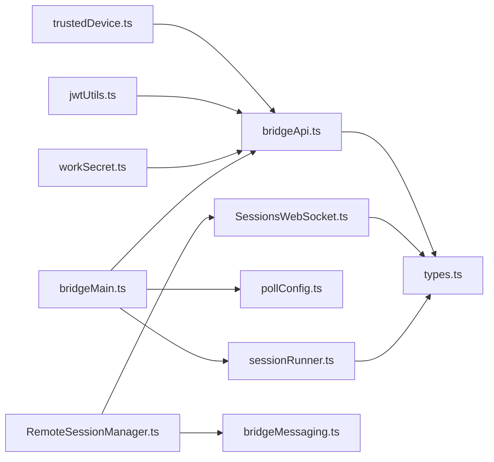

# 远程协作系统

<cite>
**本文档引用的文件**
- [README.md](file://README.md)
- [bridgeMain.ts](file://src/bridge/bridgeMain.ts)
- [bridgeApi.ts](file://src/bridge/bridgeApi.ts)
- [bridgeMessaging.ts](file://src/bridge/bridgeMessaging.ts)
- [sessionRunner.ts](file://src/bridge/sessionRunner.ts)
- [workSecret.ts](file://src/bridge/workSecret.ts)
- [createSession.ts](file://src/bridge/createSession.ts)
- [pollConfig.ts](file://src/bridge/pollConfig.ts)
- [trustedDevice.ts](file://src/bridge/trustedDevice.ts)
- [jwtUtils.ts](file://src/bridge/jwtUtils.ts)
- [types.ts](file://src/bridge/types.ts)
- [RemoteSessionManager.ts](file://src/remote/RemoteSessionManager.ts)
- [SessionsWebSocket.ts](file://src/remote/SessionsWebSocket.ts)
- [peerSessions.js](file://bridge/peerSessions.js)
</cite>

## 目录
1. [简介](#简介)
2. [项目结构](#项目结构)
3. [核心组件](#核心组件)
4. [架构总览](#架构总览)
5. [详细组件分析](#详细组件分析)
6. [依赖关系分析](#依赖关系分析)
7. [性能考虑](#性能考虑)
8. [故障排查指南](#故障排查指南)
9. [结论](#结论)
10. [附录](#附录)

## 简介
本文件面向Claude Code远程协作系统，围绕桥接层架构设计与实现进行深入技术说明。内容涵盖远程会话管理（创建、状态同步、消息转发）、通信协议（JWT认证、工作密钥交换、会话生命周期）、容错与重连策略、安全与权限控制、性能优化与资源管理、配置与部署指南，以及与本地系统的集成方式。

## 项目结构
远程协作系统由“桥接层”和“远程层”两大子系统构成：
- 桥接层（Bridge Layer）：负责在本地CLI与云端环境之间建立稳定连接，管理会话生命周期、消息中继、权限请求处理、心跳保活与重连。
- 远程层（Remote Layer）：负责通过WebSocket订阅会话事件流，处理控制请求/响应，支持中断、模型切换、权限模式变更等服务器端指令。

图表来源
- [bridgeMain.ts:141-800](file://src/bridge/bridgeMain.ts#L141-L800)
- [bridgeApi.ts:133-451](file://src/bridge/bridgeApi.ts#L133-L451)
- [sessionRunner.ts:248-548](file://src/bridge/sessionRunner.ts#L248-L548)
- [SessionsWebSocket.ts:82-404](file://src/remote/SessionsWebSocket.ts#L82-L404)

章节来源
- [README.md:728-748](file://README.md#L728-L748)

## 核心组件
- 桥接主循环：负责环境注册、轮询工作项、会话创建与管理、心跳保活、错误恢复与重连。
- HTTP客户端：封装环境/会话/工作项相关API调用，统一鉴权头与错误处理。
- 会话进程管理器：负责子进程的启动、标准流解析、活动追踪、权限请求转发、令牌刷新。
- WebSocket客户端：用于订阅远程会话事件流，处理控制请求/响应、心跳、重连。
- 工作密钥解码：从服务端下发的工作密钥中提取会话入口令牌与API基础URL。
- 会话创建与归档：支持空会话创建、历史会话预填充、标题更新与归档。
- 轮询配置：通过特性门控动态调整轮询间隔、容量时心跳与保活策略。
- 受信任设备令牌：在增强安全级别下，向云端发送受信任设备令牌以满足连接要求。

章节来源
- [bridgeMain.ts:141-800](file://src/bridge/bridgeMain.ts#L141-L800)
- [bridgeApi.ts:133-451](file://src/bridge/bridgeApi.ts#L133-L451)
- [sessionRunner.ts:248-548](file://src/bridge/sessionRunner.ts#L248-L548)
- [SessionsWebSocket.ts:82-404](file://src/remote/SessionsWebSocket.ts#L82-L404)
- [workSecret.ts:6-32](file://src/bridge/workSecret.ts#L6-L32)
- [createSession.ts:34-180](file://src/bridge/createSession.ts#L34-L180)
- [pollConfig.ts:102-110](file://src/bridge/pollConfig.ts#L102-L110)
- [trustedDevice.ts:54-59](file://src/bridge/trustedDevice.ts#L54-L59)

## 架构总览
远程协作采用“桥接主循环 + 多路传输”的架构：
- 环境注册：桥接层向云端注册环境，携带最大会话数与元数据，便于前端筛选。
- 工作轮询：桥接层周期性轮询云端工作队列，获取待执行的工作项（通常为会话创建）。
- 会话创建：根据工作密钥解码结果，启动本地子进程，建立会话入口令牌与SDK URL。
- 事件中继：子进程输出NDJSON消息，桥接层解析并转发至云端；同时接收云端控制请求并即时响应。
- 心跳保活：在容量满载或空闲状态下，采用心跳或轮询维持活跃状态，避免被回收。
- 安全与权限：使用JWT令牌与受信任设备令牌，配合权限请求事件实现细粒度授权。

图表来源
- [bridgeMain.ts:141-800](file://src/bridge/bridgeMain.ts#L141-L800)
- [bridgeApi.ts:133-451](file://src/bridge/bridgeApi.ts#L133-L451)
- [sessionRunner.ts:248-548](file://src/bridge/sessionRunner.ts#L248-L548)
- [SessionsWebSocket.ts:82-404](file://src/remote/SessionsWebSocket.ts#L82-L404)

## 详细组件分析

### 桥接主循环与会话管理
- 环境注册与注销：注册时携带机器名、目录、分支、仓库URL、最大会话数与元数据；注销时清理环境。
- 工作轮询与去重：轮询返回空时按容量策略休眠；对已完成的工作ID进行去重，避免重复创建。
- 会话创建与参数传递：通过工作密钥解码获取会话入口令牌与API基础URL，构建SDK URL并传递给子进程。
- 心跳保活与错误恢复：在容量满载时仅心跳保活，遇到401/403等致命错误时触发重新连接或环境过期处理。
- 会话生命周期：记录会话开始时间、活动轨迹、最后stderr、超时监控与清理；支持单/多会话模式。

图表来源
- [bridgeMain.ts:600-784](file://src/bridge/bridgeMain.ts#L600-L784)

章节来源
- [bridgeMain.ts:141-800](file://src/bridge/bridgeMain.ts#L141-L800)
- [bridgeApi.ts:133-451](file://src/bridge/bridgeApi.ts#L133-L451)
- [sessionRunner.ts:248-548](file://src/bridge/sessionRunner.ts#L248-L548)

### 通信协议与认证
- JWT认证：会话入口令牌作为Bearer Token用于会话级API调用；支持令牌解码与到期前刷新。
- 受信任设备令牌：在增强安全级别下，通过X-Trusted-Device-Token头发送，确保连接合法性。
- 工作密钥交换：服务端下发base64url编码的JSON，包含版本、会话入口令牌、API基础URL等字段，桥接层解码后使用。
- 令牌刷新调度：基于JWT过期时间提前刷新，失败时重试并记录诊断信息，防止会话因令牌过期而中断。

图表来源
- [bridgeApi.ts:133-451](file://src/bridge/bridgeApi.ts#L133-L451)
- [workSecret.ts:6-32](file://src/bridge/workSecret.ts#L6-L32)
- [jwtUtils.ts:72-256](file://src/bridge/jwtUtils.ts#L72-L256)
- [trustedDevice.ts:54-59](file://src/bridge/trustedDevice.ts#L54-L59)

章节来源
- [bridgeApi.ts:133-451](file://src/bridge/bridgeApi.ts#L133-L451)
- [workSecret.ts:6-32](file://src/bridge/workSecret.ts#L6-L32)
- [jwtUtils.ts:72-256](file://src/bridge/jwtUtils.ts#L72-L256)
- [trustedDevice.ts:54-59](file://src/bridge/trustedDevice.ts#L54-L59)

### 远程会话管理与消息转发
- 远程会话管理器：负责WebSocket连接、消息接收与分发、权限请求处理、中断信号发送、断线重连。
- WebSocket客户端：支持代理、mTLS、心跳ping、有限次数重连与特定关闭码处理（如会话不存在）。
- 消息去重与回放防护：通过最近发出/收到UUID集合进行回环与重复消息过滤，确保消息一致性。
- 控制请求处理：对服务器端初始化、模型设置、权限模式、中断等请求进行快速响应，避免超时断开。

图表来源
- [RemoteSessionManager.ts:95-324](file://src/remote/RemoteSessionManager.ts#L95-L324)
- [SessionsWebSocket.ts:82-404](file://src/remote/SessionsWebSocket.ts#L82-L404)
- [bridgeMessaging.ts:132-208](file://src/bridge/bridgeMessaging.ts#L132-L208)

章节来源
- [RemoteSessionManager.ts:95-324](file://src/remote/RemoteSessionManager.ts#L95-L324)
- [SessionsWebSocket.ts:82-404](file://src/remote/SessionsWebSocket.ts#L82-L404)
- [bridgeMessaging.ts:132-208](file://src/bridge/bridgeMessaging.ts#L132-L208)

### 权限控制与安全
- 权限请求事件：当子进程需要针对具体工具调用进行授权时，通过权限响应事件上报云端，等待用户决策。
- 受信任设备：在增强安全级别下，桥接层在请求头中携带受信任设备令牌，满足服务器端强制校验。
- 错误类型识别：区分会话/环境过期、权限不足、速率限制等错误类型，采取不同恢复策略。
- 会话归档：在关闭或异常退出时，主动归档会话，避免前端显示为“活跃”。

章节来源
- [bridgeApi.ts:454-500](file://src/bridge/bridgeApi.ts#L454-L500)
- [trustedDevice.ts:54-59](file://src/bridge/trustedDevice.ts#L54-L59)
- [createSession.ts:263-317](file://src/bridge/createSession.ts#L263-L317)

### 会话生命周期与资源管理
- 会话创建：支持空会话与预填充历史会话两种模式，自动推断Git源与产出上下文。
- 标题同步：用户重命名会话时，桥接层将标题同步到云端，保持前后端一致。
- 归档与清理：在退出或异常情况下，归档会话并清理临时文件与工作树。
- 资源隔离：多会话模式支持同目录共享或独立工作树，避免相互覆盖。

章节来源
- [createSession.ts:34-180](file://src/bridge/createSession.ts#L34-L180)
- [createSession.ts:190-244](file://src/bridge/createSession.ts#L190-L244)
- [createSession.ts:263-317](file://src/bridge/createSession.ts#L263-L317)
- [sessionRunner.ts:248-548](file://src/bridge/sessionRunner.ts#L248-L548)

## 依赖关系分析
- 组件耦合
  - 桥接主循环依赖HTTP客户端与会话进程管理器；会话进程管理器依赖子进程与NDJSON解析。
  - 远程会话管理器依赖WebSocket客户端与云端事件API；消息处理依赖桥接层的去重与路由逻辑。
- 外部依赖
  - HTTP客户端使用Axios进行REST调用，统一错误处理与重试策略。
  - WebSocket客户端兼容浏览器与Node环境，支持代理与mTLS。
- 特性门控
  - 轮询配置通过特性门控动态调整，确保在不同部署环境下具备最优行为。

图表来源
- [bridgeMain.ts:1-120](file://src/bridge/bridgeMain.ts#L1-L120)
- [bridgeApi.ts:1-50](file://src/bridge/bridgeApi.ts#L1-L50)
- [sessionRunner.ts:1-20](file://src/bridge/sessionRunner.ts#L1-L20)
- [RemoteSessionManager.ts:1-20](file://src/remote/RemoteSessionManager.ts#L1-L20)
- [SessionsWebSocket.ts:1-20](file://src/remote/SessionsWebSocket.ts#L1-L20)
- [bridgeMessaging.ts:1-20](file://src/bridge/bridgeMessaging.ts#L1-L20)
- [workSecret.ts:1-10](file://src/bridge/workSecret.ts#L1-L10)
- [jwtUtils.ts:1-10](file://src/bridge/jwtUtils.ts#L1-L10)
- [trustedDevice.ts:1-10](file://src/bridge/trustedDevice.ts#L1-L10)
- [types.ts:1-30](file://src/bridge/types.ts#L1-L30)

章节来源
- [bridgeMain.ts:1-120](file://src/bridge/bridgeMain.ts#L1-L120)
- [bridgeApi.ts:1-50](file://src/bridge/bridgeApi.ts#L1-L50)
- [sessionRunner.ts:1-20](file://src/bridge/sessionRunner.ts#L1-L20)
- [RemoteSessionManager.ts:1-20](file://src/remote/RemoteSessionManager.ts#L1-L20)
- [SessionsWebSocket.ts:1-20](file://src/remote/SessionsWebSocket.ts#L1-L20)
- [bridgeMessaging.ts:1-20](file://src/bridge/bridgeMessaging.ts#L1-L20)
- [workSecret.ts:1-10](file://src/bridge/workSecret.ts#L1-L10)
- [jwtUtils.ts:1-10](file://src/bridge/jwtUtils.ts#L1-L10)
- [trustedDevice.ts:1-10](file://src/bridge/trustedDevice.ts#L1-L10)
- [types.ts:1-30](file://src/bridge/types.ts#L1-L30)

## 性能考虑
- 轮询与心跳策略：通过特性门控配置在容量满载时仅心跳保活，减少网络压力；空闲时采用更长休眠间隔。
- 令牌刷新：在JWT到期前5分钟触发刷新，避免会话中断；失败时最多重试3次并退避。
- 消息去重：使用固定容量的UUID环形集合，降低内存占用并提升去重效率。
- 子进程I/O：标准流解析与转录文件写入异步化，避免阻塞主循环。
- 代理与TLS：支持代理与mTLS，减少网络抖动对性能的影响。

章节来源
- [pollConfig.ts:102-110](file://src/bridge/pollConfig.ts#L102-L110)
- [jwtUtils.ts:72-256](file://src/bridge/jwtUtils.ts#L72-L256)
- [bridgeMessaging.ts:429-461](file://src/bridge/bridgeMessaging.ts#L429-L461)
- [sessionRunner.ts:248-548](file://src/bridge/sessionRunner.ts#L248-L548)

## 故障排查指南
- 认证失败（401/403）
  - 检查OAuth令牌是否有效与可刷新；必要时重新登录。
  - 若为环境过期或会话过期，需重新注册环境或重启会话。
- 会话不存在（4001）
  - 属于瞬态情况，客户端会在有限次数内重试；若持续出现，检查云端会话状态。
- 速率限制（429）
  - 减少轮询频率或增大休眠间隔，避免触发限流。
- 连接中断与重连
  - 观察重连尝试次数与延迟；超过阈值后停止重连并上报错误。
- 令牌刷新失败
  - 检查令牌来源与可用性；查看诊断日志中的失败计数与重试间隔。

章节来源
- [bridgeApi.ts:454-500](file://src/bridge/bridgeApi.ts#L454-L500)
- [SessionsWebSocket.ts:234-288](file://src/remote/SessionsWebSocket.ts#L234-L288)
- [jwtUtils.ts:165-230](file://src/bridge/jwtUtils.ts#L165-L230)

## 结论
该远程协作系统通过桥接层与远程层的协同，实现了高可靠、低耦合的远程会话管理。其设计重点在于：
- 明确的会话生命周期与消息中继机制；
- 健壮的认证与安全策略（JWT与受信任设备令牌）；
- 灵活的轮询与心跳策略，兼顾性能与稳定性；
- 完备的容错与重连机制，确保在网络波动下的连续性；
- 清晰的权限控制与会话归档，保障用户体验与合规性。

## 附录

### 配置与部署指南
- 登录与认证
  - 使用登录命令获取OAuth令牌，随后桥接层自动使用该令牌进行API调用。
- 环境注册
  - 指定机器名、目录、分支、仓库URL与最大会话数，注册后获得environment_id与environment_secret。
- 会话创建
  - 通过工作密钥解码获取会话入口令牌与SDK URL，启动本地子进程并建立会话。
- 代理与TLS
  - 支持HTTP代理与mTLS配置，适用于企业网络环境。
- 会话归档
  - 在退出或异常时主动归档会话，避免前端显示为“活跃”。

章节来源
- [bridgeApi.ts:142-197](file://src/bridge/bridgeApi.ts#L142-L197)
- [workSecret.ts:6-32](file://src/bridge/workSecret.ts#L6-L32)
- [createSession.ts:34-180](file://src/bridge/createSession.ts#L34-L180)
- [trustedDevice.ts:142-210](file://src/bridge/trustedDevice.ts#L142-L210)

### 与本地系统的集成方式
- CLI/REPL集成：桥接主循环与会话进程管理器紧密集成，通过标准流解析与NDJSON协议实现消息互通。
- UI集成：桥接层提供状态更新接口，用于实时展示会话数量、活动与标题；远程层通过WebSocket事件驱动UI更新。
- 插件与工具：通过权限请求事件与控制请求响应，实现工具调用的细粒度授权与运行时控制。

章节来源
- [sessionRunner.ts:248-548](file://src/bridge/sessionRunner.ts#L248-L548)
- [bridgeMessaging.ts:132-208](file://src/bridge/bridgeMessaging.ts#L132-L208)
- [RemoteSessionManager.ts:95-324](file://src/remote/RemoteSessionManager.ts#L95-L324)