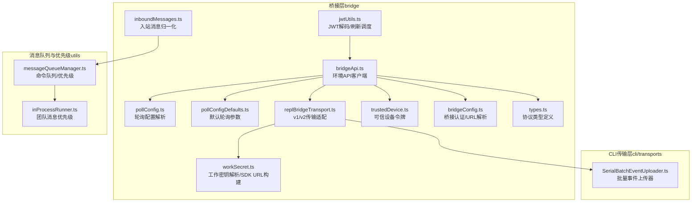
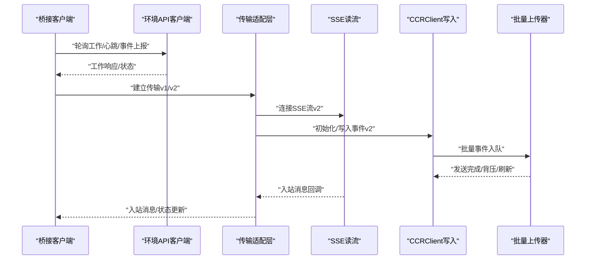
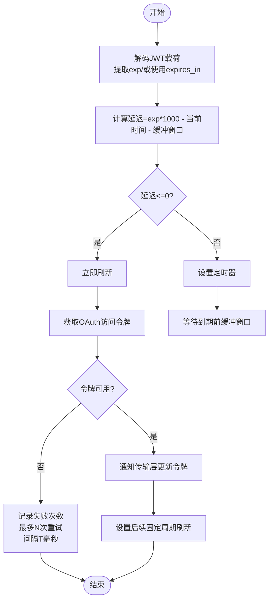
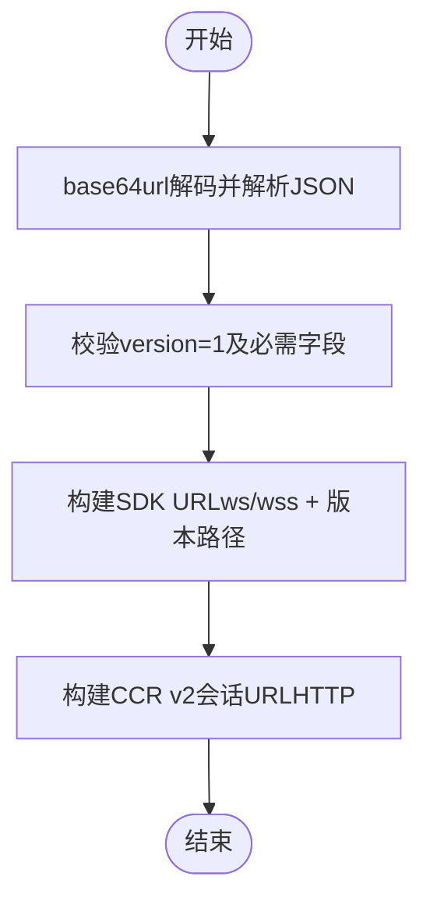
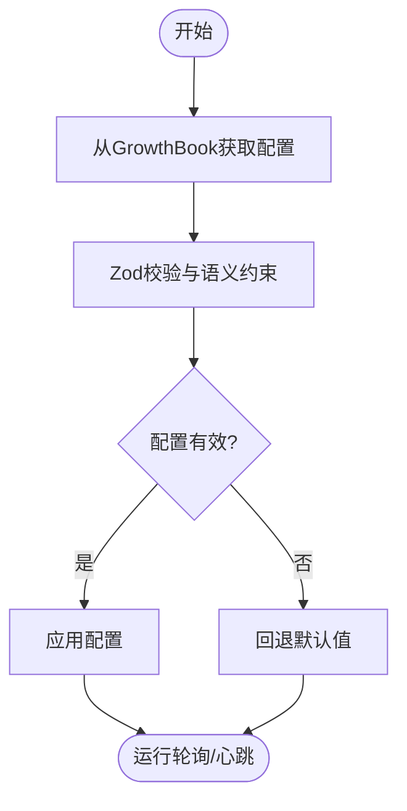
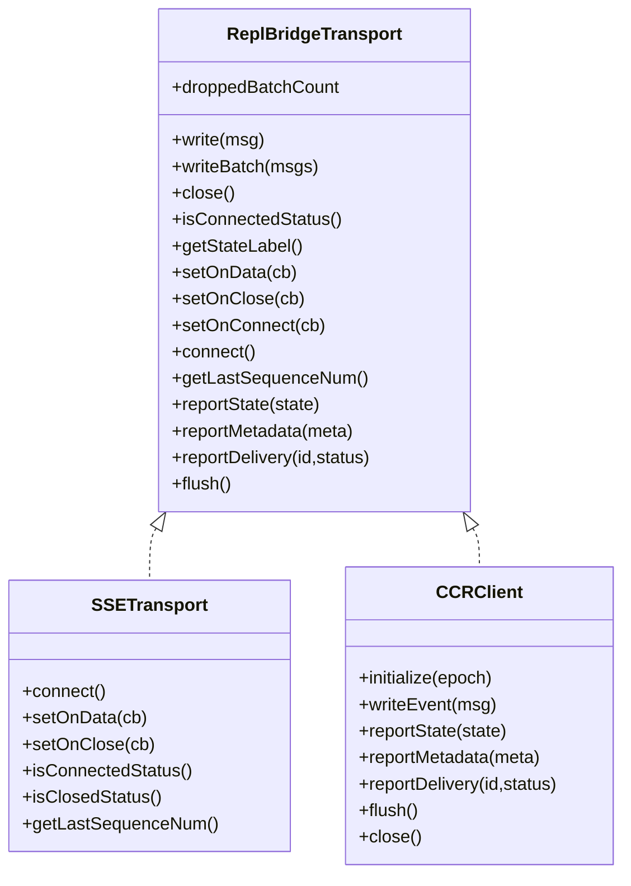
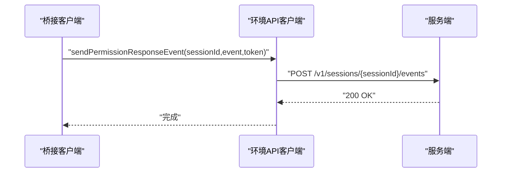
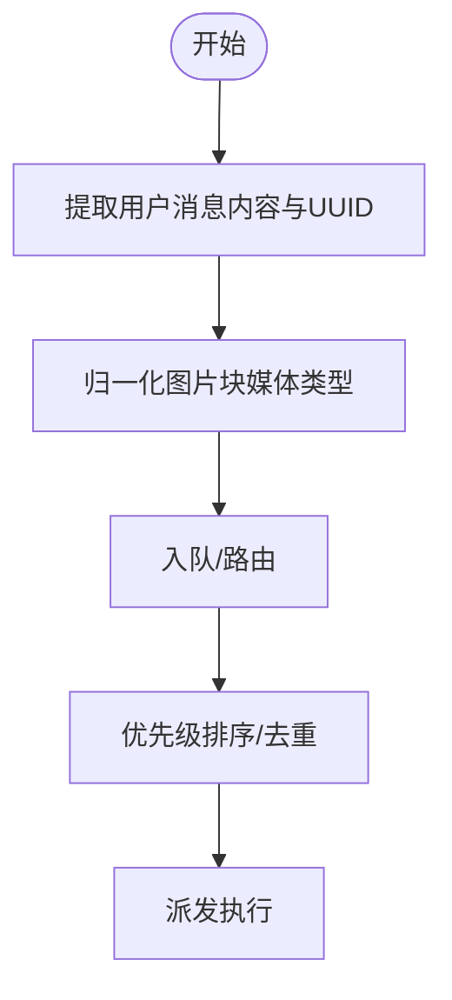
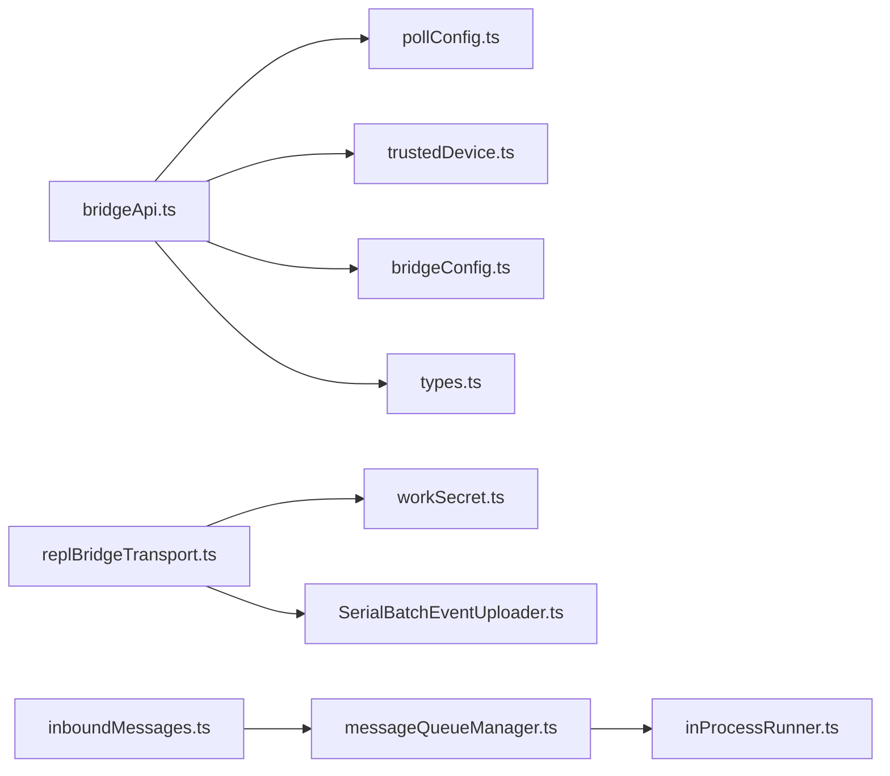

# 通信协议设计

<cite>
**本文引用的文件**
- [src/bridge/jwtUtils.ts](file://src/bridge/jwtUtils.ts)
- [src/bridge/workSecret.ts](file://src/bridge/workSecret.ts)
- [src/bridge/pollConfig.ts](file://src/bridge/pollConfig.ts)
- [src/bridge/pollConfigDefaults.ts](file://src/bridge/pollConfigDefaults.ts)
- [src/bridge/replBridgeTransport.ts](file://src/bridge/replBridgeTransport.ts)
- [src/bridge/bridgeApi.ts](file://src/bridge/bridgeApi.ts)
- [src/bridge/types.ts](file://src/bridge/types.ts)
- [src/bridge/inboundMessages.ts](file://src/bridge/inboundMessages.ts)
- [src/bridge/trustedDevice.ts](file://src/bridge/trustedDevice.ts)
- [src/bridge/bridgeConfig.ts](file://src/bridge/bridgeConfig.ts)
- [src/cli/transports/SerialBatchEventUploader.ts](file://src/cli/transports/SerialBatchEventUploader.ts)
- [src/utils/messageQueueManager.ts](file://src/utils/messageQueueManager.ts)
- [src/utils/swarm/inProcessRunner.ts](file://src/utils/swarm/inProcessRunner.ts)
</cite>

## 目录
1. [引言](#引言)
2. [项目结构](#项目结构)
3. [核心组件](#核心组件)
4. [架构总览](#架构总览)
5. [详细组件分析](#详细组件分析)
6. [依赖关系分析](#依赖关系分析)
7. [性能考量](#性能考量)
8. [故障排查指南](#故障排查指南)
9. [结论](#结论)
10. [附录](#附录)

## 引言
本文件面向Claude Code通信协议的设计与实现，系统化阐述远程通信的整体架构、消息格式、传输机制、协议版本、认证与授权、密钥交换、轮询与心跳、消息路由与分发、以及安全保障与性能优化策略。文档以仓库中的桥接层（bridge）为核心，结合CLI传输层（transports）、消息队列与优先级调度、以及可信设备令牌等模块，形成从客户端到服务端的完整通信闭环。

## 项目结构
通信协议相关代码主要集中在以下模块：
- 桥接层（bridge）：负责环境注册、工作轮询、心跳、权限事件上报、v1/v2传输适配、工作密钥解析与SDK URL构建、可信设备令牌集成等。
- CLI传输层（cli/transports）：封装SSE读取、HTTP写入、批量事件上传器、背压控制与刷新关闭等。
- 消息队列与优先级（utils）：提供命令队列、优先级排序、去重与清理等能力，支撑消息路由与分发。
- 安全与认证（bridge/trustedDevice、bridge/jwtUtils、bridge/bridgeConfig）：提供JWT解码与刷新、可信设备令牌、OAuth访问令牌获取与覆盖等。

**图表来源**
- [src/bridge/bridgeApi.ts:12-452](file://src/bridge/bridgeApi.ts#L12-L452)
- [src/bridge/jwtUtils.ts:72-256](file://src/bridge/jwtUtils.ts#L72-L256)
- [src/bridge/workSecret.ts:1-128](file://src/bridge/workSecret.ts#L1-L128)
- [src/bridge/pollConfig.ts:28-111](file://src/bridge/pollConfig.ts#L28-L111)
- [src/bridge/pollConfigDefaults.ts:55-83](file://src/bridge/pollConfigDefaults.ts#L55-L83)
- [src/bridge/replBridgeTransport.ts:23-371](file://src/bridge/replBridgeTransport.ts#L23-L371)
- [src/bridge/trustedDevice.ts:15-211](file://src/bridge/trustedDevice.ts#L15-L211)
- [src/bridge/bridgeConfig.ts:17-49](file://src/bridge/bridgeConfig.ts#L17-L49)
- [src/bridge/types.ts:16-263](file://src/bridge/types.ts#L16-L263)
- [src/bridge/inboundMessages.ts:10-81](file://src/bridge/inboundMessages.ts#L10-L81)
- [src/cli/transports/SerialBatchEventUploader.ts:106-150](file://src/cli/transports/SerialBatchEventUploader.ts#L106-L150)
- [src/utils/messageQueueManager.ts:240-547](file://src/utils/messageQueueManager.ts#L240-L547)
- [src/utils/swarm/inProcessRunner.ts:785-824](file://src/utils/swarm/inProcessRunner.ts#L785-L824)

**章节来源**
- [src/bridge/bridgeApi.ts:12-452](file://src/bridge/bridgeApi.ts#L12-L452)
- [src/bridge/replBridgeTransport.ts:23-371](file://src/bridge/replBridgeTransport.ts#L23-L371)
- [src/bridge/pollConfig.ts:28-111](file://src/bridge/pollConfig.ts#L28-L111)
- [src/bridge/pollConfigDefaults.ts:55-83](file://src/bridge/pollConfigDefaults.ts#L55-L83)
- [src/bridge/jwtUtils.ts:72-256](file://src/bridge/jwtUtils.ts#L72-L256)
- [src/bridge/workSecret.ts:1-128](file://src/bridge/workSecret.ts#L1-L128)
- [src/bridge/trustedDevice.ts:15-211](file://src/bridge/trustedDevice.ts#L15-L211)
- [src/bridge/bridgeConfig.ts:17-49](file://src/bridge/bridgeConfig.ts#L17-L49)
- [src/bridge/types.ts:16-263](file://src/bridge/types.ts#L16-L263)
- [src/bridge/inboundMessages.ts:10-81](file://src/bridge/inboundMessages.ts#L10-L81)
- [src/cli/transports/SerialBatchEventUploader.ts:106-150](file://src/cli/transports/SerialBatchEventUploader.ts#L106-L150)
- [src/utils/messageQueueManager.ts:240-547](file://src/utils/messageQueueManager.ts#L240-L547)
- [src/utils/swarm/inProcessRunner.ts:785-824](file://src/utils/swarm/inProcessRunner.ts#L785-L824)

## 核心组件
- 环境API客户端：封装OAuth/Bearer认证、带重试的401刷新、请求头注入（含可信设备令牌）、工作轮询、心跳、会话事件上报、环境注销与回收等。
- JWT工具：提供JWT载荷解码、过期时间提取、基于到期时间的主动刷新调度、失败重试与取消管理。
- 工作密钥与SDK URL：解析base64url编码的工作密钥，校验版本字段；根据API基础URL与会话ID构建SDK连接地址；支持CCR v2兼容路径。
- 轮询配置：通过GrowthBook动态下发轮询间隔、心跳间隔、回收旧任务阈值、保持活跃间隔等，并进行严格校验与默认回退。
- v1/v2传输适配：统一抽象SSE读流与HTTP写流，支持v2的worker注册、状态上报、交付确认、写队列刷新与epoch不一致处理。
- 可信设备令牌：在Elevated安全级别下，通过X-Trusted-Device-Token头参与鉴权，支持设备注册、持久化与缓存失效。
- 消息队列与优先级：提供命令队列的增删改查、按优先级筛选、去重与清理，以及团队消息优先级策略。

**章节来源**
- [src/bridge/bridgeApi.ts:12-452](file://src/bridge/bridgeApi.ts#L12-L452)
- [src/bridge/jwtUtils.ts:72-256](file://src/bridge/jwtUtils.ts#L72-L256)
- [src/bridge/workSecret.ts:1-128](file://src/bridge/workSecret.ts#L1-L128)
- [src/bridge/pollConfig.ts:28-111](file://src/bridge/pollConfig.ts#L28-L111)
- [src/bridge/pollConfigDefaults.ts:55-83](file://src/bridge/pollConfigDefaults.ts#L55-L83)
- [src/bridge/replBridgeTransport.ts:23-371](file://src/bridge/replBridgeTransport.ts#L23-L371)
- [src/bridge/trustedDevice.ts:15-211](file://src/bridge/trustedDevice.ts#L15-L211)
- [src/utils/messageQueueManager.ts:240-547](file://src/utils/messageQueueManager.ts#L240-L547)
- [src/utils/swarm/inProcessRunner.ts:785-824](file://src/utils/swarm/inProcessRunner.ts#L785-L824)

## 架构总览
通信协议采用“环境API驱动 + SSE/HTTP传输 + 批量写入”的分层架构：
- 环境API层：负责工作分配、心跳续约、权限事件上报、会话回收与重新连接。
- 传输适配层：v1使用HybridTransport（WebSocket读 + Session-Ingress POST写），v2使用SSETransport（读）+ CCRClient（写）。
- 写入层：SerialBatchEventUploader负责批量聚合、背压控制、刷新等待与关闭清理。
- 队列与路由：消息队列与优先级策略确保关键指令优先执行，团队消息优先于同侪消息。

**图表来源**
- [src/bridge/bridgeApi.ts:199-451](file://src/bridge/bridgeApi.ts#L199-L451)
- [src/bridge/replBridgeTransport.ts:119-371](file://src/bridge/replBridgeTransport.ts#L119-L371)
- [src/cli/transports/SerialBatchEventUploader.ts:106-150](file://src/cli/transports/SerialBatchEventUploader.ts#L106-L150)

## 详细组件分析

### JWT认证与刷新机制
- JWT解码与过期提取：支持去除前缀并解析base64url载荷，提取exp时间戳，用于计算刷新时机。
- 主动刷新调度：基于到期时间与缓冲窗口（默认5分钟）设置定时器；当token接近过期或已过期时触发刷新；支持从expires_in直接调度（避免无法解析JWT时的fallback）。
- 刷新失败与重试：连续失败达到上限后停止重试，避免风暴；成功后设置后续固定周期（默认30分钟）的follow-up刷新，保证长会话持续可用。
- 与传输层集成：v2路径中，刷新后的OAuth令牌通过回调传递给传输层，确保写入通道的认证信息同步更新。

**图表来源**
- [src/bridge/jwtUtils.ts:72-256](file://src/bridge/jwtUtils.ts#L72-L256)

**章节来源**
- [src/bridge/jwtUtils.ts:72-256](file://src/bridge/jwtUtils.ts#L72-L256)

### 工作密钥交换与SDK URL构建
- 工作密钥解析：对base64url编码字符串进行JSON解析，校验版本字段与必需字段（如session_ingress_token、api_base_url），异常时抛出错误。
- SDK URL构建：根据API基础URL判断本地或生产环境，选择ws/wss与对应版本路径；支持CCR v2兼容路径（HTTP会话URL）。
- 会话ID一致性：提供跨标签前缀的会话ID比较逻辑，避免兼容层导致的“外域”误判。

**图表来源**
- [src/bridge/workSecret.ts:6-87](file://src/bridge/workSecret.ts#L6-L87)

**章节来源**
- [src/bridge/workSecret.ts:6-87](file://src/bridge/workSecret.ts#L6-L87)

### 轮询配置与心跳策略
- 动态配置：通过GrowthBook拉取轮询间隔、心跳间隔、多会话间隔、回收旧任务阈值、保持活跃间隔等；对字段进行最小值约束与语义校验，防止误配置导致紧循环。
- 默认回退：若配置缺失或部分字段非法，回退至默认值，确保系统稳定运行。
- 心跳与背压：非独占式心跳与轮询可并行；当处于容量上限时，心跳独立运行，定期打断轮询，避免服务器侧超时与资源占用。

**图表来源**
- [src/bridge/pollConfig.ts:28-111](file://src/bridge/pollConfig.ts#L28-L111)
- [src/bridge/pollConfigDefaults.ts:55-83](file://src/bridge/pollConfigDefaults.ts#L55-L83)

**章节来源**
- [src/bridge/pollConfig.ts:28-111](file://src/bridge/pollConfig.ts#L28-L111)
- [src/bridge/pollConfigDefaults.ts:55-83](file://src/bridge/pollConfigDefaults.ts#L55-L83)

### 传输适配与写入层
- v1适配：HybridTransport提供完整的读写接口，作为统一的ReplBridgeTransport实现。
- v2适配：SSETransport负责读流，CCRClient负责写入、心跳、状态上报、交付确认；支持outbound-only模式（仅写入）；epoch不一致时触发优雅关闭与重连。
- 写入批量化：SerialBatchEventUploader内部批量聚合（默认最大批次100），支持背压等待、刷新阻塞、关闭清理与丢弃计数统计。

**图表来源**
- [src/bridge/replBridgeTransport.ts:23-371](file://src/bridge/replBridgeTransport.ts#L23-L371)
- [src/cli/transports/SerialBatchEventUploader.ts:106-150](file://src/cli/transports/SerialBatchEventUploader.ts#L106-L150)

**章节来源**
- [src/bridge/replBridgeTransport.ts:23-371](file://src/bridge/replBridgeTransport.ts#L23-L371)
- [src/cli/transports/SerialBatchEventUploader.ts:106-150](file://src/cli/transports/SerialBatchEventUploader.ts#L106-L150)

### 权限与事件上报
- 权限响应事件：通过会话事件API上报控制响应（如权限决策），携带事件数组与会话令牌。
- 环境API操作：注册/注销环境、工作确认/停止、会话归档/重连、心跳续约等，均使用OAuth/Bearer认证与可选的可信设备令牌头。

**图表来源**
- [src/bridge/bridgeApi.ts:419-451](file://src/bridge/bridgeApi.ts#L419-L451)

**章节来源**
- [src/bridge/bridgeApi.ts:133-176](file://src/bridge/bridgeApi.ts#L133-L176)
- [src/bridge/bridgeApi.ts:419-451](file://src/bridge/bridgeApi.ts#L419-L451)

### 入站消息归一化与路由
- 入站消息处理：从SDK消息中提取用户内容与UUID，支持图片块的媒体类型归一化（驼峰到蛇形），避免因字段缺失导致的后续调用失败。
- 消息路由与优先级：命令队列支持按优先级筛选、去重与移除；团队领导消息优先于同侪消息，未读消息优先处理，必要时进行清空与重排。

**图表来源**
- [src/bridge/inboundMessages.ts:21-81](file://src/bridge/inboundMessages.ts#L21-L81)
- [src/utils/messageQueueManager.ts:240-547](file://src/utils/messageQueueManager.ts#L240-L547)
- [src/utils/swarm/inProcessRunner.ts:785-824](file://src/utils/swarm/inProcessRunner.ts#L785-L824)

**章节来源**
- [src/bridge/inboundMessages.ts:21-81](file://src/bridge/inboundMessages.ts#L21-L81)
- [src/utils/messageQueueManager.ts:240-547](file://src/utils/messageQueueManager.ts#L240-L547)
- [src/utils/swarm/inProcessRunner.ts:785-824](file://src/utils/swarm/inProcessRunner.ts#L785-L824)

### 可信设备令牌与安全加固
- 设备注册：在登录后短时间内向OAuth服务注册可信设备，返回设备令牌并持久化到安全存储；支持环境变量覆盖以满足企业场景。
- 请求头注入：当门控开启且存在令牌时，在环境API请求中附加X-Trusted-Device-Token头，增强Elevated安全级别的鉴权强度。
- 缓存与失效：读取令牌时进行缓存，登录/注销/门控切换时清除缓存，确保令牌新鲜度与一致性。

**章节来源**
- [src/bridge/trustedDevice.ts:15-211](file://src/bridge/trustedDevice.ts#L15-L211)
- [src/bridge/bridgeApi.ts:76-89](file://src/bridge/bridgeApi.ts#L76-L89)

## 依赖关系分析
- 组件耦合：桥接API客户端依赖轮询配置、可信设备令牌、桥接认证配置；传输适配层依赖工作密钥与SDK URL构建；写入层依赖传输适配层的回调与状态。
- 外部依赖：Axios用于HTTP请求；GrowthBook用于动态配置；安全存储用于持久化令牌；Lodash.memoize用于缓存可信设备令牌读取。
- 循环依赖：当前模块间无明显循环依赖，职责边界清晰。

**图表来源**
- [src/bridge/bridgeApi.ts:12-452](file://src/bridge/bridgeApi.ts#L12-L452)
- [src/bridge/pollConfig.ts:28-111](file://src/bridge/pollConfig.ts#L28-L111)
- [src/bridge/trustedDevice.ts:15-211](file://src/bridge/trustedDevice.ts#L15-L211)
- [src/bridge/bridgeConfig.ts:17-49](file://src/bridge/bridgeConfig.ts#L17-L49)
- [src/bridge/types.ts:16-263](file://src/bridge/types.ts#L16-L263)
- [src/bridge/replBridgeTransport.ts:23-371](file://src/bridge/replBridgeTransport.ts#L23-L371)
- [src/bridge/workSecret.ts:1-128](file://src/bridge/workSecret.ts#L1-L128)
- [src/cli/transports/SerialBatchEventUploader.ts:106-150](file://src/cli/transports/SerialBatchEventUploader.ts#L106-L150)
- [src/bridge/inboundMessages.ts:10-81](file://src/bridge/inboundMessages.ts#L10-L81)
- [src/utils/messageQueueManager.ts:240-547](file://src/utils/messageQueueManager.ts#L240-L547)
- [src/utils/swarm/inProcessRunner.ts:785-824](file://src/utils/swarm/inProcessRunner.ts#L785-L824)

**章节来源**
- [src/bridge/bridgeApi.ts:12-452](file://src/bridge/bridgeApi.ts#L12-L452)
- [src/bridge/replBridgeTransport.ts:23-371](file://src/bridge/replBridgeTransport.ts#L23-L371)
- [src/bridge/pollConfig.ts:28-111](file://src/bridge/pollConfig.ts#L28-L111)
- [src/bridge/trustedDevice.ts:15-211](file://src/bridge/trustedDevice.ts#L15-L211)
- [src/bridge/bridgeConfig.ts:17-49](file://src/bridge/bridgeConfig.ts#L17-L49)
- [src/bridge/types.ts:16-263](file://src/bridge/types.ts#L16-L263)
- [src/bridge/inboundMessages.ts:10-81](file://src/bridge/inboundMessages.ts#L10-L81)
- [src/cli/transports/SerialBatchEventUploader.ts:106-150](file://src/cli/transports/SerialBatchEventUploader.ts#L106-L150)
- [src/utils/messageQueueManager.ts:240-547](file://src/utils/messageQueueManager.ts#L240-L547)
- [src/utils/swarm/inProcessRunner.ts:785-824](file://src/utils/swarm/inProcessRunner.ts#L785-L824)

## 性能考量
- 轮询与心跳：非独占式心跳与轮询并行，避免服务器超时；容量上限时的心跳间隔与轮询间隔分开配置，减少不必要的网络开销。
- 批量写入与背压：写入层采用批量聚合与背压等待，降低HTTP请求频率与服务器压力；刷新阻塞确保在回合边界与优雅关闭时有序收尾。
- 令牌刷新：主动刷新与固定周期follow-up刷新相结合，避免长时间窗口内的集中刷新风暴；失败重试上限与退避策略降低抖动。
- 传输切换：v2路径在传输切换时保留序列号高水位标记，避免重复回放历史消息，提升恢复速度与带宽利用率。

[本节为通用性能建议，无需特定文件引用]

## 故障排查指南
- 认证失败（401）：检查OAuth访问令牌是否可用；若存在刷新处理器，确认刷新流程是否成功；必要时重新登录并清除缓存。
- 会话过期（410/环境过期）：根据错误类型提示重启远程控制或重新发起会话；检查工作密钥中的API基础URL与会话ID是否匹配。
- 权限不足（403）：确认组织权限与作用域；对于可抑制的403（如外部轮询会话或管理操作），可在上层进行静默处理。
- 轮询过于频繁（429）：调整轮询间隔配置，遵循服务端速率限制；检查心跳与轮询是否同时启用导致频率过高。
- 传输异常：v2路径中epoch不一致时会触发关闭与重连；检查worker注册与心跳配置；确认写入层背压与刷新是否正常。

**章节来源**
- [src/bridge/bridgeApi.ts:454-540](file://src/bridge/bridgeApi.ts#L454-L540)
- [src/bridge/replBridgeTransport.ts:209-232](file://src/bridge/replBridgeTransport.ts#L209-L232)

## 结论
该通信协议以桥接层为核心，结合动态轮询配置、主动JWT刷新、v1/v2传输适配与批量写入，实现了高可靠、低延迟、可扩展的远程控制通信链路。通过可信设备令牌与严格的配置校验，进一步提升了安全性与稳定性。消息队列与优先级策略确保关键指令的及时处理，配合背压与刷新机制，兼顾了性能与可靠性。

[本节为总结性内容，无需特定文件引用]

## 附录
- 协议版本与消息格式：工作密钥包含版本字段与必需字段（如session_ingress_token、api_base_url），SDK URL根据环境自动选择ws/wss与版本路径；事件上报采用JSON数组形式。
- 配置项参考：轮询间隔、心跳间隔、回收旧任务阈值、保持活跃间隔等均可通过GrowthBook动态下发并进行严格校验与默认回退。

**章节来源**
- [src/bridge/types.ts:33-51](file://src/bridge/types.ts#L33-L51)
- [src/bridge/workSecret.ts:41-87](file://src/bridge/workSecret.ts#L41-L87)
- [src/bridge/pollConfig.ts:28-111](file://src/bridge/pollConfig.ts#L28-L111)
- [src/bridge/pollConfigDefaults.ts:55-83](file://src/bridge/pollConfigDefaults.ts#L55-L83)