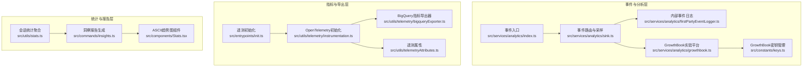
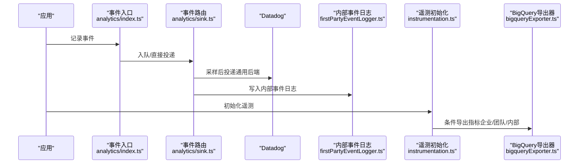
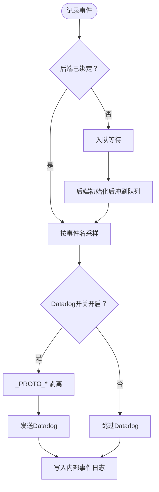
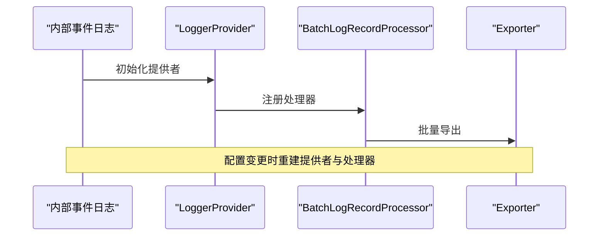
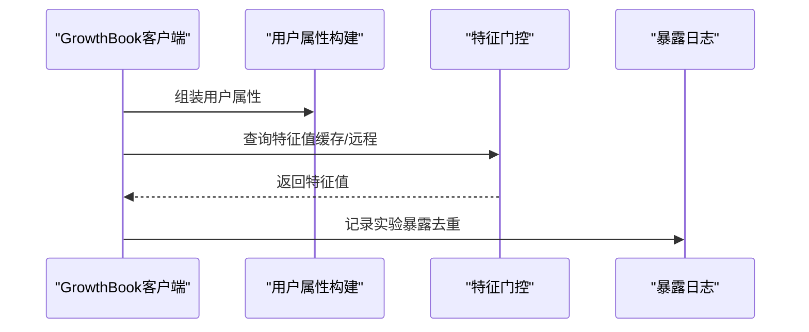
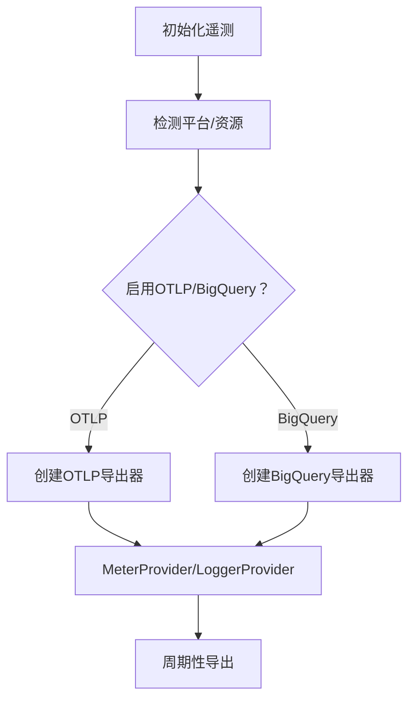
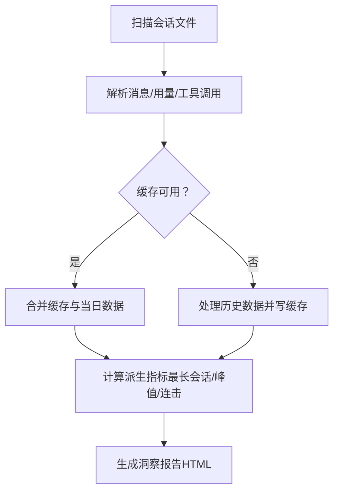
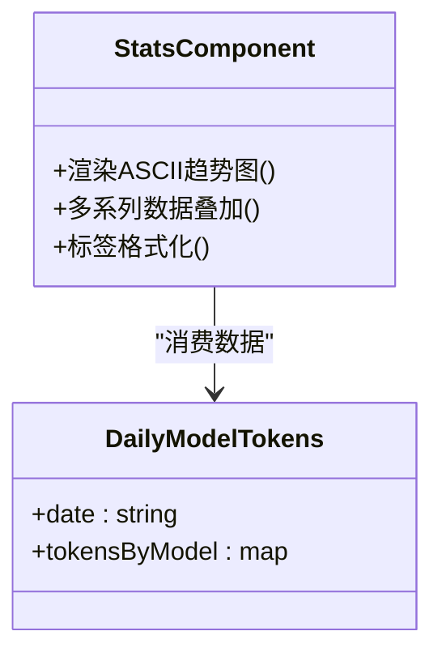
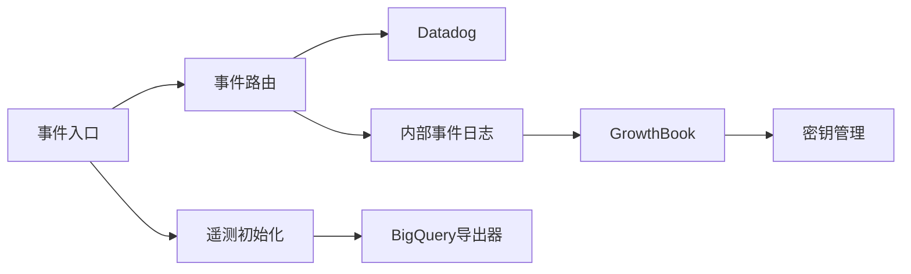

# 分析报告与可视化

<cite>
**本文引用的文件**
- [src/services/analytics/index.ts](file://src/services/analytics/index.ts)
- [src/services/analytics/sink.ts](file://src/services/analytics/sink.ts)
- [src/services/analytics/firstPartyEventLogger.ts](file://src/services/analytics/firstPartyEventLogger.ts)
- [src/services/analytics/growthbook.ts](file://src/services/analytics/growthbook.ts)
- [src/constants/keys.ts](file://src/constants/keys.ts)
- [src/entrypoints/init.ts](file://src/entrypoints/init.ts)
- [src/utils/telemetry/instrumentation.ts](file://src/utils/telemetry/instrumentation.ts)
- [src/utils/telemetry/bigqueryExporter.ts](file://src/utils/telemetry/bigqueryExporter.ts)
- [src/utils/telemetryAttributes.ts](file://src/utils/telemetryAttributes.ts)
- [src/utils/stats.ts](file://src/utils/stats.ts)
- [src/commands/insights.ts](file://src/commands/insights.ts)
- [src/components/Stats.tsx](file://src/components/Stats.tsx)
</cite>

## 目录
1. [简介](#简介)
2. [项目结构](#项目结构)
3. [核心组件](#核心组件)
4. [架构总览](#架构总览)
5. [详细组件分析](#详细组件分析)
6. [依赖关系分析](#依赖关系分析)
7. [性能考量](#性能考量)
8. [故障排查指南](#故障排查指南)
9. [结论](#结论)
10. [附录](#附录)

## 简介
本技术文档面向“Claude Code分析报告与可视化系统”，围绕以下目标展开：  
- 分析平台选择与集成：GrowthBook实验平台、Datadog监控系统、BigQuery数据分析  
- 报告生成流程与模板系统：统计报告、性能分析报告、用户行为分析  
- 实时监控与历史数据分析机制  
- 可视化图表类型与配置：趋势分析、分布统计、漏斗分析等  
- A/B实验设计与执行：实验分组、指标计算、统计显著性检验  
- 自定义报告与仪表板开发指南  
- 数据导出与API接口使用方法  

本系统通过统一的事件日志入口、多后端路由（Datadog与内部事件日志）、以及基于会话与时间序列的数据聚合，形成从采集、传输到分析与可视化的完整闭环。

## 项目结构
本项目采用模块化组织方式，分析与可视化相关的关键模块如下：
- 事件日志与路由：src/services/analytics/*（统一事件入口、Datadog路由、内部事件日志）
- 指标采集与导出：src/utils/telemetry/*（OpenTelemetry初始化、BigQuery导出器）
- 统计与报告：src/utils/stats.ts、src/commands/insights.ts
- 可视化组件：src/components/Stats.tsx
- 实验平台：src/services/analytics/growthbook.ts、src/constants/keys.ts

**图表来源**
- [src/services/analytics/index.ts:1-174](file://src/services/analytics/index.ts#L1-L174)
- [src/services/analytics/sink.ts:1-115](file://src/services/analytics/sink.ts#L1-L115)
- [src/services/analytics/firstPartyEventLogger.ts:1-450](file://src/services/analytics/firstPartyEventLogger.ts#L1-L450)
- [src/services/analytics/growthbook.ts:1-1018](file://src/services/analytics/growthbook.ts#L1-L1018)
- [src/constants/keys.ts:1-11](file://src/constants/keys.ts#L1-L11)
- [src/entrypoints/init.ts:288-340](file://src/entrypoints/init.ts#L288-L340)
- [src/utils/telemetry/instrumentation.ts:421-701](file://src/utils/telemetry/instrumentation.ts#L421-L701)
- [src/utils/telemetry/bigqueryExporter.ts:87-252](file://src/utils/telemetry/bigqueryExporter.ts#L87-L252)
- [src/utils/telemetryAttributes.ts:1-42](file://src/utils/telemetryAttributes.ts#L1-L42)
- [src/utils/stats.ts:640-710](file://src/utils/stats.ts#L640-L710)
- [src/commands/insights.ts:1612-2719](file://src/commands/insights.ts#L1612-L2719)
- [src/components/Stats.tsx:981-1018](file://src/components/Stats.tsx#L981-L1018)

**章节来源**
- [src/services/analytics/index.ts:1-174](file://src/services/analytics/index.ts#L1-L174)
- [src/services/analytics/sink.ts:1-115](file://src/services/analytics/sink.ts#L1-L115)
- [src/services/analytics/firstPartyEventLogger.ts:1-450](file://src/services/analytics/firstPartyEventLogger.ts#L1-L450)
- [src/services/analytics/growthbook.ts:1-1018](file://src/services/analytics/growthbook.ts#L1-L1018)
- [src/constants/keys.ts:1-11](file://src/constants/keys.ts#L1-L11)
- [src/entrypoints/init.ts:288-340](file://src/entrypoints/init.ts#L288-L340)
- [src/utils/telemetry/instrumentation.ts:421-701](file://src/utils/telemetry/instrumentation.ts#L421-L701)
- [src/utils/telemetry/bigqueryExporter.ts:87-252](file://src/utils/telemetry/bigqueryExporter.ts#L87-L252)
- [src/utils/telemetryAttributes.ts:1-42](file://src/utils/telemetryAttributes.ts#L1-L42)
- [src/utils/stats.ts:640-710](file://src/utils/stats.ts#L640-L710)
- [src/commands/insights.ts:1612-2719](file://src/commands/insights.ts#L1612-L2719)
- [src/components/Stats.tsx:981-1018](file://src/components/Stats.tsx#L981-L1018)

## 核心组件
- 事件入口与队列：在未绑定后端前，所有事件进入内存队列；后端就绪后异步冲刷，保证启动路径不阻塞。
- 事件路由与采样：根据动态配置对事件进行采样，并分别投递至Datadog（通用后端）与内部事件日志（1P）。
- 内部事件日志：独立的OpenTelemetry日志提供者，批量导出至内部批处理端点，支持动态批处理配置热更新。
- GrowthBook实验平台：集中式实验分组与特征门控，支持快速刷新与暴露日志记录。
- 遥测与指标导出：延迟加载OpenTelemetry子系统，按需启用OTLP或BigQuery导出器，支持mTLS、代理与超时控制。
- 统计与报告：按会话解析消息，聚合日活、工具调用、模型用量、峰值时段等，生成洞察报告与ASCII趋势图。
- 可视化组件：ASCII趋势图组件支持多系列、自动缩放与标签格式化。

**章节来源**
- [src/services/analytics/index.ts:80-174](file://src/services/analytics/index.ts#L80-L174)
- [src/services/analytics/sink.ts:45-86](file://src/services/analytics/sink.ts#L45-L86)
- [src/services/analytics/firstPartyEventLogger.ts:146-230](file://src/services/analytics/firstPartyEventLogger.ts#L146-L230)
- [src/services/analytics/growthbook.ts:296-314](file://src/services/analytics/growthbook.ts#L296-L314)
- [src/entrypoints/init.ts:305-340](file://src/entrypoints/init.ts#L305-L340)
- [src/utils/telemetry/instrumentation.ts:421-701](file://src/utils/telemetry/instrumentation.ts#L421-L701)
- [src/utils/stats.ts:640-710](file://src/utils/stats.ts#L640-L710)
- [src/commands/insights.ts:1612-2719](file://src/commands/insights.ts#L1612-L2719)
- [src/components/Stats.tsx:981-1018](file://src/components/Stats.tsx#L981-L1018)

## 架构总览
系统采用“事件驱动 + 多后端导出”的架构：
- 事件入口负责无依赖地收集事件，避免循环依赖。
- 路由模块决定是否向Datadog发送（通用访问），并同时写入内部事件日志（受控访问）。
- 内部事件日志使用独立的日志提供者与批处理器，支持动态配置变更时的平滑重建。
- 指标采集通过OpenTelemetry初始化，按条件启用BigQuery导出器，其余场景走OTLP。
- 统计模块从磁盘会话文件聚合数据，生成报告与可视化。

**图表来源**
- [src/services/analytics/index.ts:133-164](file://src/services/analytics/index.ts#L133-L164)
- [src/services/analytics/sink.ts:45-86](file://src/services/analytics/sink.ts#L45-L86)
- [src/services/analytics/firstPartyEventLogger.ts:146-230](file://src/services/analytics/firstPartyEventLogger.ts#L146-L230)
- [src/utils/telemetry/instrumentation.ts:421-701](file://src/utils/telemetry/instrumentation.ts#L421-L701)
- [src/utils/telemetry/bigqueryExporter.ts:87-148](file://src/utils/telemetry/bigqueryExporter.ts#L87-L148)

## 详细组件分析

### 事件入口与路由
- 事件入口提供同步/异步两种记录接口，若尚未绑定后端则入队，待后端初始化完成后再冲刷。
- 路由模块负责：
  - 动态采样：按事件名配置采样率，采样结果写入元数据。
  - Datadog投递：通用后端，投递前剥离可能包含敏感信息的字段。
  - 内部事件日志：保留原始元数据，供内部分析与合规用途。

**图表来源**
- [src/services/analytics/index.ts:80-123](file://src/services/analytics/index.ts#L80-L123)
- [src/services/analytics/sink.ts:45-86](file://src/services/analytics/sink.ts#L45-L86)
- [src/services/analytics/firstPartyEventLogger.ts:146-230](file://src/services/analytics/firstPartyEventLogger.ts#L146-L230)

**章节来源**
- [src/services/analytics/index.ts:80-174](file://src/services/analytics/index.ts#L80-L174)
- [src/services/analytics/sink.ts:1-115](file://src/services/analytics/sink.ts#L1-L115)
- [src/services/analytics/firstPartyEventLogger.ts:1-230](file://src/services/analytics/firstPartyEventLogger.ts#L1-L230)

### 内部事件日志与批处理
- 独立的LoggerProvider与BatchLogRecordProcessor，支持动态批处理配置（间隔、批次大小、队列上限、重试次数、基础路径与URL）。
- 支持在配置变化时重建流水线，确保事件不丢失。
- 事件体包含核心元数据、用户元数据与事件元数据，便于后续分析。

**图表来源**
- [src/services/analytics/firstPartyEventLogger.ts:300-449](file://src/services/analytics/firstPartyEventLogger.ts#L300-L449)

**章节来源**
- [src/services/analytics/firstPartyEventLogger.ts:1-450](file://src/services/analytics/firstPartyEventLogger.ts#L1-L450)

### GrowthBook实验平台与密钥管理
- 用户属性：设备ID、会话ID、平台、订阅类型、首次令牌时间等，用于精准分组。
- 特征门控：支持缓存命中快速路径与远程刷新慢路径，暴露日志仅记录一次/会话。
- 密钥管理：根据用户类型与调试开关选择SDK密钥，ANT用户可切换开发密钥。

**图表来源**
- [src/services/analytics/growthbook.ts:29-47](file://src/services/analytics/growthbook.ts#L29-L47)
- [src/services/analytics/growthbook.ts:917-935](file://src/services/analytics/growthbook.ts#L917-L935)
- [src/services/analytics/growthbook.ts:296-314](file://src/services/analytics/growthbook.ts#L296-L314)
- [src/constants/keys.ts:1-11](file://src/constants/keys.ts#L1-L11)

**章节来源**
- [src/services/analytics/growthbook.ts:1-1018](file://src/services/analytics/growthbook.ts#L1-L1018)
- [src/constants/keys.ts:1-11](file://src/constants/keys.ts#L1-L11)

### 遥测初始化与BigQuery导出
- 遥测初始化延迟加载OTLP/Prometheus导出器，支持多种协议与HTTP/JSON、HTTP/Protobuf、gRPC。
- BigQuery导出器按条件启用（API客户、C4E、Teams），使用delta聚合以适配产品仪表盘。
- 支持mTLS、代理、动态头部与超时控制，提供优雅关闭与强制刷新。

**图表来源**
- [src/utils/telemetry/instrumentation.ts:421-701](file://src/utils/telemetry/instrumentation.ts#L421-L701)
- [src/utils/telemetry/bigqueryExporter.ts:87-148](file://src/utils/telemetry/bigqueryExporter.ts#L87-L148)

**章节来源**
- [src/entrypoints/init.ts:288-340](file://src/entrypoints/init.ts#L288-L340)
- [src/utils/telemetry/instrumentation.ts:421-701](file://src/utils/telemetry/instrumentation.ts#L421-L701)
- [src/utils/telemetry/bigqueryExporter.ts:87-252](file://src/utils/telemetry/bigqueryExporter.ts#L87-L252)
- [src/utils/telemetryAttributes.ts:1-42](file://src/utils/telemetryAttributes.ts#L1-L42)

### 统计聚合与洞察报告
- 会话文件解析：按项目目录扫描会话JSONL，过滤侧链消息，提取模型用量、工具调用、峰值时段等。
- 缓存与增量：使用磁盘缓存避免重复处理历史数据，每日增量处理当天数据。
- 报告生成：按目标维度（工具、语言、目标类别、满意度、摩擦点）生成统计与可视化HTML片段。

**图表来源**
- [src/utils/stats.ts:374-435](file://src/utils/stats.ts#L374-L435)
- [src/utils/stats.ts:640-710](file://src/utils/stats.ts#L640-L710)
- [src/commands/insights.ts:1612-2719](file://src/commands/insights.ts#L1612-L2719)

**章节来源**
- [src/utils/stats.ts:1-800](file://src/utils/stats.ts#L1-L800)
- [src/commands/insights.ts:1612-2719](file://src/commands/insights.ts#L1612-L2719)

### ASCII趋势图组件
- 多系列折线图：支持多模型token用量趋势，自动缩放与标签格式化（K/M）。
- 交互友好：支持x轴日期标签生成与颜色主题映射。

**图表来源**
- [src/components/Stats.tsx:981-1018](file://src/components/Stats.tsx#L981-L1018)
- [src/utils/stats.ts:33-36](file://src/utils/stats.ts#L33-L36)

**章节来源**
- [src/components/Stats.tsx:981-1018](file://src/components/Stats.tsx#L981-L1018)
- [src/utils/stats.ts:33-36](file://src/utils/stats.ts#L33-L36)

## 依赖关系分析
- 低耦合高内聚：事件入口无第三方依赖，避免循环导入；路由模块仅依赖配置与采样逻辑。
- 外部依赖隔离：Datadog与内部事件日志分别维护独立的提供者与导出器，互不影响。
- 实验平台与密钥：GrowthBook客户端与密钥管理解耦，支持ANT用户切换开发密钥。
- 遥测导出：BigQuery导出器与OTLP导出器按条件启用，避免不必要的开销。

**图表来源**
- [src/services/analytics/index.ts:1-174](file://src/services/analytics/index.ts#L1-L174)
- [src/services/analytics/sink.ts:1-115](file://src/services/analytics/sink.ts#L1-L115)
- [src/services/analytics/firstPartyEventLogger.ts:1-450](file://src/services/analytics/firstPartyEventLogger.ts#L1-L450)
- [src/services/analytics/growthbook.ts:1-1018](file://src/services/analytics/growthbook.ts#L1-L1018)
- [src/constants/keys.ts:1-11](file://src/constants/keys.ts#L1-L11)
- [src/utils/telemetry/instrumentation.ts:421-701](file://src/utils/telemetry/instrumentation.ts#L421-L701)
- [src/utils/telemetry/bigqueryExporter.ts:87-252](file://src/utils/telemetry/bigqueryExporter.ts#L87-L252)

**章节来源**
- [src/services/analytics/index.ts:1-174](file://src/services/analytics/index.ts#L1-L174)
- [src/services/analytics/sink.ts:1-115](file://src/services/analytics/sink.ts#L1-L115)
- [src/services/analytics/firstPartyEventLogger.ts:1-450](file://src/services/analytics/firstPartyEventLogger.ts#L1-L450)
- [src/services/analytics/growthbook.ts:1-1018](file://src/services/analytics/growthbook.ts#L1-L1018)
- [src/constants/keys.ts:1-11](file://src/constants/keys.ts#L1-L11)
- [src/utils/telemetry/instrumentation.ts:421-701](file://src/utils/telemetry/instrumentation.ts#L421-L701)
- [src/utils/telemetry/bigqueryExporter.ts:87-252](file://src/utils/telemetry/bigqueryExporter.ts#L87-L252)

## 性能考量
- 启动延迟最小化：遥测初始化延迟加载，仅在需要时引入OTLP/Prometheus导出器，避免冷启动体积膨胀。
- 批量导出与背压：内部事件日志与BigQuery导出器均使用批处理器与队列上限，防止内存压力。
- 采样与动态配置：事件级采样与动态批处理配置减少网络与存储压力。
- 文件I/O优化：统计聚合使用分批并行处理与缓存，避免重复解析历史数据。
- 关闭与刷新：提供优雅关闭与超时保护，确保退出前完成导出。

[本节为通用指导，无需特定文件引用]

## 故障排查指南
- 事件未到达Datadog：检查特征门控状态与采样配置，确认未被杀开关禁用。
- 内部事件日志未导出：确认1P事件日志启用、批处理配置有效、且未被杀开关禁用。
- BigQuery导出失败：检查信任对话状态、组织级指标开关、认证头与网络可达性。
- 遥测导出超时：调整关闭超时环境变量，检查后端性能与网络状况。
- 统计聚合异常：查看会话文件读取错误日志，确认文件权限与完整性。

**章节来源**
- [src/services/analytics/sink.ts:29-43](file://src/services/analytics/sink.ts#L29-L43)
- [src/services/analytics/firstPartyEventLogger.ts:116-128](file://src/services/analytics/firstPartyEventLogger.ts#L116-L128)
- [src/utils/telemetry/bigqueryExporter.ts:104-148](file://src/utils/telemetry/bigqueryExporter.ts#L104-L148)
- [src/utils/telemetry/instrumentation.ts:654-699](file://src/utils/telemetry/instrumentation.ts#L654-L699)
- [src/utils/stats.ts:188-191](file://src/utils/stats.ts#L188-L191)

## 结论
本系统通过统一事件入口、双后端路由与独立的内部事件日志，实现了从采集、传输到分析与可视化的全链路能力。结合GrowthBook实验平台与BigQuery导出器，既能满足通用监控需求，又能支撑内部深度分析与合规要求。统计与报告模块提供了丰富的维度与可视化形式，便于生成定制化洞察与仪表板。

[本节为总结，无需特定文件引用]

## 附录
- 自定义报告开发建议
  - 使用事件入口记录业务指标，配合采样与元数据标注，确保可追溯与合规。
  - 在洞察报告中增加自定义维度（如项目、分支、工具链阶段），并通过HTML模板扩展。
  - 对于大体量数据，优先使用BigQuery导出器与SQL查询，再在前端进行二次聚合与可视化。
- 仪表板开发建议
  - 将ASCII趋势图组件与外部可视化库结合，实现更丰富的图表类型（柱状、饼图、热力图）。
  - 利用遥测属性与GrowthBook分组，实现A/B实验对比面板。
- 数据导出与API
  - 内部事件日志与BigQuery导出器遵循统一的批处理与认证流程，便于对接下游分析平台。
  - 如需对外API，可在服务层封装只读查询接口，确保数据安全与一致性。

[本节为通用指导，无需特定文件引用]