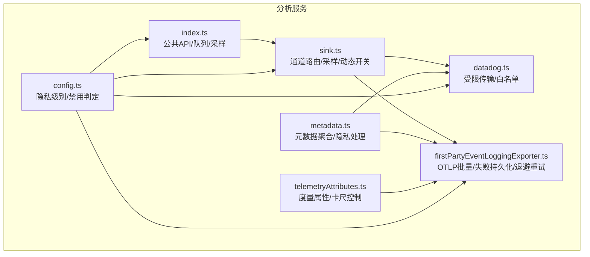
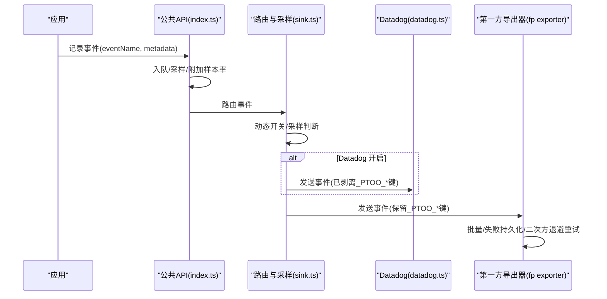
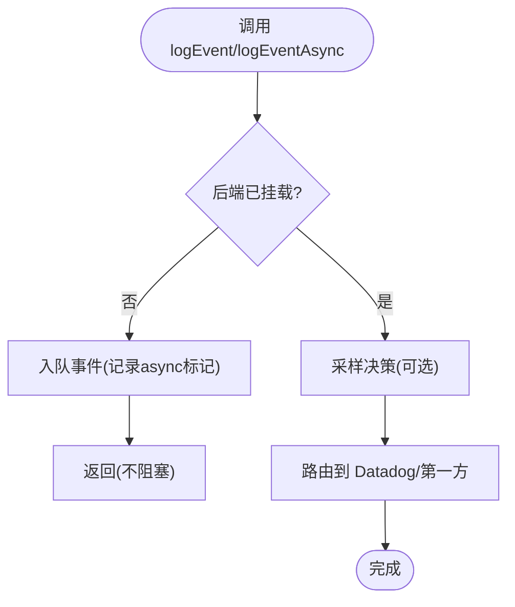
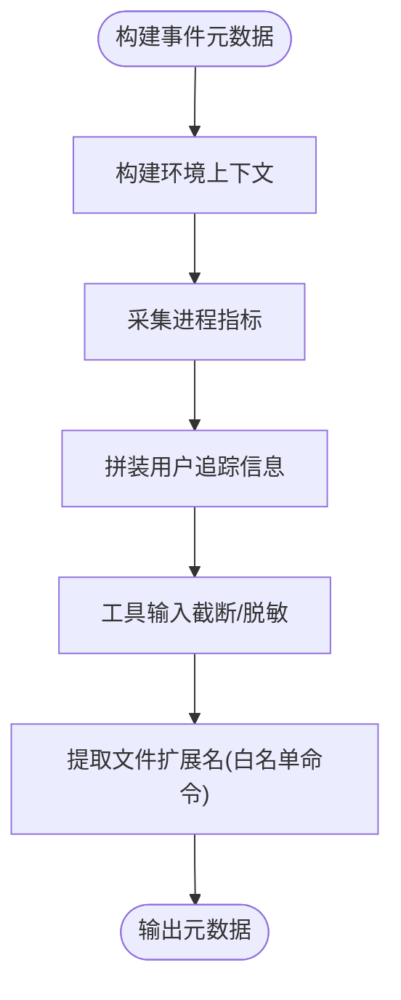
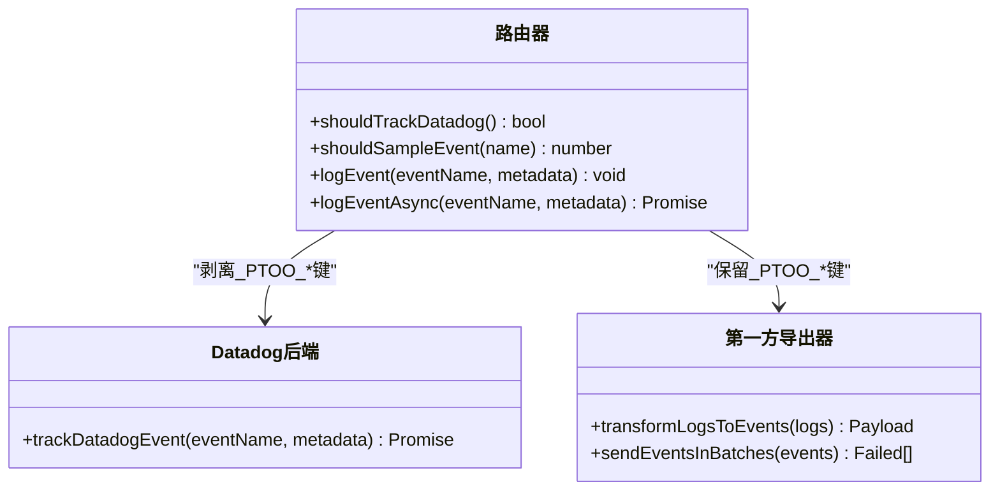
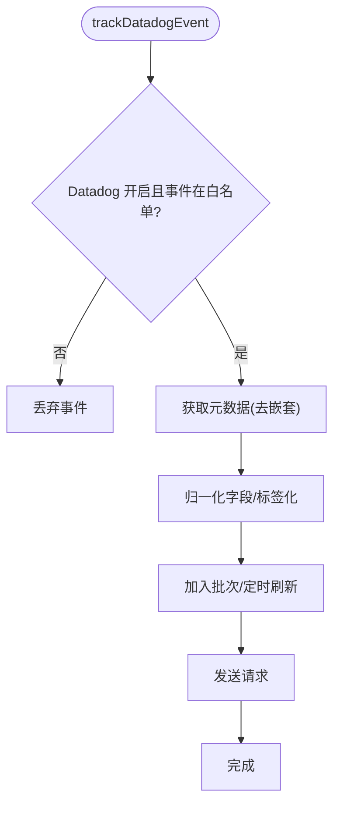
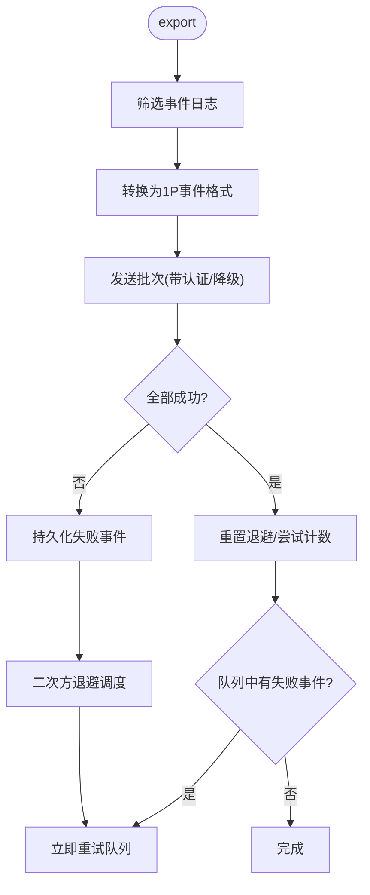
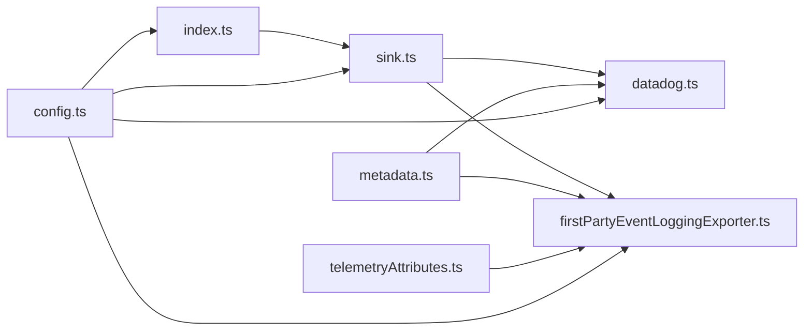

# 遥测和分析系统

<cite>
**本文引用的文件**
- [src/services/analytics/index.ts](file://src/services/analytics/index.ts)
- [src/services/analytics/metadata.ts](file://src/services/analytics/metadata.ts)
- [src/services/analytics/sink.ts](file://src/services/analytics/sink.ts)
- [src/services/analytics/datadog.ts](file://src/services/analytics/datadog.ts)
- [src/services/analytics/firstPartyEventLoggingExporter.ts](file://src/services/analytics/firstPartyEventLoggingExporter.ts)
- [src/utils/telemetryAttributes.ts](file://src/utils/telemetryAttributes.ts)
- [docs/zh/01-遥测与隐私分析.md](file://docs/zh/01-遥测与隐私分析.md)
- [src/services/analytics/config.ts](file://src/services/analytics/config.ts)
- [src/entrypoints/init.ts](file://src/entrypoints/init.ts)
</cite>

## 目录
1. [简介](#简介)
2. [项目结构](#项目结构)
3. [核心组件](#核心组件)
4. [架构总览](#架构总览)
5. [详细组件分析](#详细组件分析)
6. [依赖关系分析](#依赖关系分析)
7. [性能考量](#性能考量)
8. [故障排查指南](#故障排查指南)
9. [结论](#结论)
10. [附录](#附录)

## 简介
本文件为 Claude Code 遥测与分析系统的全面技术文档。系统采用双通道遥测架构：第一方事件日志（1P）通过 OpenTelemetry 批量导出至 Anthropic 后端，并具备本地失败事件持久化与指数退避重试；第二方日志（Datadog）对预批准事件进行受限传输。系统在事件元数据采集上覆盖环境指纹、进程指标、用户追踪、工具输入与文件扩展名等维度，并通过多种隐私保护与匿名化策略降低敏感信息泄露风险。同时，系统支持采样、动态开关、卡尺度量属性控制以及可观测性调试能力。

## 项目结构
遥测与分析相关模块主要集中在以下路径：
- 分析服务入口与公共 API：src/services/analytics/index.ts
- 元数据聚合与隐私处理：src/services/analytics/metadata.ts
- 通道路由与采样：src/services/analytics/sink.ts
- Datadog 传输与白名单：src/services/analytics/datadog.ts
- 第一方事件导出器与失败重试：src/services/analytics/firstPartyEventLoggingExporter.ts
- 度量属性与卡尺控制：src/utils/telemetryAttributes.ts
- 配置与隐私级别：src/services/analytics/config.ts
- 初始化与信任授权后的遥测初始化：src/entrypoints/init.ts
- 文档化隐私与数据范围：docs/zh/01-遥测与隐私分析.md

**图表来源**
- [src/services/analytics/index.ts:1-174](file://src/services/analytics/index.ts#L1-L174)
- [src/services/analytics/metadata.ts:1-974](file://src/services/analytics/metadata.ts#L1-L974)
- [src/services/analytics/sink.ts:1-115](file://src/services/analytics/sink.ts#L1-L115)
- [src/services/analytics/datadog.ts:1-308](file://src/services/analytics/datadog.ts#L1-L308)
- [src/services/analytics/firstPartyEventLoggingExporter.ts:1-807](file://src/services/analytics/firstPartyEventLoggingExporter.ts#L1-L807)
- [src/utils/telemetryAttributes.ts:1-72](file://src/utils/telemetryAttributes.ts#L1-L72)
- [src/services/analytics/config.ts:1-39](file://src/services/analytics/config.ts#L1-L39)

**章节来源**
- [src/services/analytics/index.ts:1-174](file://src/services/analytics/index.ts#L1-L174)
- [src/services/analytics/metadata.ts:1-974](file://src/services/analytics/metadata.ts#L1-L974)
- [src/services/analytics/sink.ts:1-115](file://src/services/analytics/sink.ts#L1-L115)
- [src/services/analytics/datadog.ts:1-308](file://src/services/analytics/datadog.ts#L1-L308)
- [src/services/analytics/firstPartyEventLoggingExporter.ts:1-807](file://src/services/analytics/firstPartyEventLoggingExporter.ts#L1-L807)
- [src/utils/telemetryAttributes.ts:1-72](file://src/utils/telemetryAttributes.ts#L1-L72)
- [src/services/analytics/config.ts:1-39](file://src/services/analytics/config.ts#L1-L39)
- [docs/zh/01-遥测与隐私分析.md:1-110](file://docs/zh/01-遥测与隐私分析.md#L1-L110)

## 核心组件
- 公共 API 与事件队列：提供同步/异步事件记录接口，支持在未挂载后端时将事件入队，待后端就绪后批量投递。
- 元数据聚合与隐私处理：统一构建环境上下文、进程指标、用户追踪等元数据，内置工具名称脱敏、工具输入截断、文件扩展名提取与过滤等隐私保护逻辑。
- 通道路由与采样：根据动态开关与采样配置决定是否向 Datadog 或第一方日志发送，同时保留原始样本率元数据。
- Datadog 传输：限定事件白名单，进行字段归一化与标签化，控制批次与刷新间隔。
- 第一方事件导出器：基于 OpenTelemetry 批处理器触发批量导出，失败事件落盘并采用二次方退避重试，支持健康检查与立即重试。
- 度量属性与卡尺控制：通过环境变量控制会话 ID、版本、账户 UUID 等属性的注入，降低指标卡尺。
- 配置与隐私级别：综合测试环境、第三方云提供商与隐私级别，统一判定是否禁用分析。

**章节来源**
- [src/services/analytics/index.ts:125-174](file://src/services/analytics/index.ts#L125-L174)
- [src/services/analytics/metadata.ts:417-743](file://src/services/analytics/metadata.ts#L417-L743)
- [src/services/analytics/sink.ts:45-86](file://src/services/analytics/sink.ts#L45-L86)
- [src/services/analytics/datadog.ts:19-64](file://src/services/analytics/datadog.ts#L19-L64)
- [src/services/analytics/firstPartyEventLoggingExporter.ts:73-139](file://src/services/analytics/firstPartyEventLoggingExporter.ts#L73-L139)
- [src/utils/telemetryAttributes.ts:29-71](file://src/utils/telemetryAttributes.ts#L29-L71)
- [src/services/analytics/config.ts:19-27](file://src/services/analytics/config.ts#L19-L27)

## 架构总览
系统采用“事件生产—元数据增强—通道路由—后端导出”的流水线式设计。事件在应用启动早期即可产生，通过队列与延迟初始化避免阻塞启动路径；后端路由模块负责采样与分流；Datadog 作为通用访问后端，严格遵循白名单与字段归一化；第一方日志作为特权通道接收更丰富的元数据，包含 PII 标记字段并在导出器侧进行拆分与清洗。

**图表来源**
- [src/services/analytics/index.ts:133-164](file://src/services/analytics/index.ts#L133-L164)
- [src/services/analytics/sink.ts:48-72](file://src/services/analytics/sink.ts#L48-L72)
- [src/services/analytics/datadog.ts:160-279](file://src/services/analytics/datadog.ts#L160-L279)
- [src/services/analytics/firstPartyEventLoggingExporter.ts:277-377](file://src/services/analytics/firstPartyEventLoggingExporter.ts#L277-L377)

## 详细组件分析

### 公共 API 与事件队列
- 设计要点
  - 无外部依赖，避免循环导入；事件在后端挂载前入队，挂载后异步清空。
  - 提供同步与异步两条路径，异步实现当前为同步包装以保持接口一致性。
  - 支持采样配置，采样结果写入元数据，便于后续分析。
- 关键行为
  - 未挂载时：事件进入内存队列。
  - 挂载后：按异步标记逐条投递；若队列为空则直接返回。
  - 重置接口仅用于测试，用于清空状态与队列。

**图表来源**
- [src/services/analytics/index.ts:95-123](file://src/services/analytics/index.ts#L95-L123)
- [src/services/analytics/index.ts:133-164](file://src/services/analytics/index.ts#L133-L164)

**章节来源**
- [src/services/analytics/index.ts:1-174](file://src/services/analytics/index.ts#L1-L174)

### 元数据聚合与隐私处理
- 环境上下文：平台、架构、Node 版本、终端类型、包管理器/运行时、CI/WSL/Linux 发行版/内核、版本控制系统、部署环境等。
- 进程指标：运行时长、RSS、堆内存、外部内存、数组缓冲、受限内存、CPU 使用量与百分比。
- 用户追踪：模型、会话 ID、用户 ID、设备 ID、账户 UUID、组织 UUID、订阅等级、仓库远程 URL 哈希、代理类型、团队名、父会话 ID 等。
- 工具输入与 MCP/Skill 名称：默认对工具输入进行截断与深度限制；可通过环境变量开启完整输入记录；MCP 工具名按规则脱敏；Skill 名称提取受控。
- 文件扩展名：从允许的 Bash 命令中提取扩展名，超长扩展名替换为通用值，避免潜在敏感信息泄露。

**图表来源**
- [src/services/analytics/metadata.ts:574-743](file://src/services/analytics/metadata.ts#L574-L743)
- [src/services/analytics/metadata.ts:236-303](file://src/services/analytics/metadata.ts#L236-L303)
- [src/services/analytics/metadata.ts:372-412](file://src/services/analytics/metadata.ts#L372-L412)

**章节来源**
- [src/services/analytics/metadata.ts:417-743](file://src/services/analytics/metadata.ts#L417-L743)

### 通道路由与采样
- 采样：根据动态配置对事件进行采样，采样率写入元数据，便于事后归因。
- 动态开关：Datadog 通道通过特性门控控制，启动阶段加载缓存值以保证早期事件不丢失。
- 路由策略：Datadog 为通用访问后端，发送前剥离 PII 标记字段；第一方通道保留并由导出器拆分到协议字段。

**图表来源**
- [src/services/analytics/sink.ts:29-86](file://src/services/analytics/sink.ts#L29-L86)
- [src/services/analytics/datadog.ts:160-279](file://src/services/analytics/datadog.ts#L160-L279)
- [src/services/analytics/firstPartyEventLoggingExporter.ts:635-762](file://src/services/analytics/firstPartyEventLoggingExporter.ts#L635-L762)

**章节来源**
- [src/services/analytics/sink.ts:1-115](file://src/services/analytics/sink.ts#L1-L115)

### Datadog 传输与白名单
- 事件白名单：仅允许预批准的事件类型进入 Datadog。
- 字段归一化：模型名、版本、状态码等进行标准化，避免保留字段冲突。
- 标签化：高基数字段转为标签，便于查询与聚合。
- 刷新与批次：定时刷新与最大批次控制，减少网络开销。

**图表来源**
- [src/services/analytics/datadog.ts:160-279](file://src/services/analytics/datadog.ts#L160-L279)

**章节来源**
- [src/services/analytics/datadog.ts:1-308](file://src/services/analytics/datadog.ts#L1-L308)

### 第一方事件导出器与失败重试
- 批量与刷新：基于 OpenTelemetry 批处理器，按时间或批次大小触发导出。
- 失败持久化：导出失败事件追加写入本地 JSON Lines 文件，目录位于配置主目录下的 telemetry 子目录。
- 二次方退避重试：按尝试次数计算延迟上限，成功后立即重试队列中的事件。
- 认证与降级：在认证不可用或令牌过期时自动降级为非认证发送；支持健康探测与立即重试。
- 进程隔离：使用会话 ID 与唯一运行标识区分不同进程的失败文件，避免互相干扰。

**图表来源**
- [src/services/analytics/firstPartyEventLoggingExporter.ts:277-377](file://src/services/analytics/firstPartyEventLoggingExporter.ts#L277-L377)
- [src/services/analytics/firstPartyEventLoggingExporter.ts:429-517](file://src/services/analytics/firstPartyEventLoggingExporter.ts#L429-L517)

**章节来源**
- [src/services/analytics/firstPartyEventLoggingExporter.ts:1-807](file://src/services/analytics/firstPartyEventLoggingExporter.ts#L1-L807)

### 度量属性与卡尺控制
- 卡尺默认策略：通过环境变量控制是否注入会话 ID、版本、账户 UUID 等属性，降低指标卡尺。
- 动态开关：支持布尔型环境变量覆盖默认值，便于在不同场景下平衡可观测性与隐私。

**章节来源**
- [src/utils/telemetryAttributes.ts:9-71](file://src/utils/telemetryAttributes.ts#L9-L71)

### 配置与隐私级别
- 禁用判定：测试环境、第三方云提供商（Bedrock/Vertex/Foundry）、隐私级别为“无遥测”或“仅必要流量”时禁用分析。
- 反馈调查抑制：与遥测禁用逻辑类似，但不屏蔽第三方云提供商场景。

**章节来源**
- [src/services/analytics/config.ts:1-39](file://src/services/analytics/config.ts#L1-L39)

### 初始化与信任授权后的遥测初始化
- 在获得用户信任授权后，系统等待远程托管设置加载（非阻塞），随后重新应用环境变量并初始化遥测。
- 对于特定场景（如非交互会话与 Beta 追踪），可能提前初始化以确保首个查询前追踪器可用。

**章节来源**
- [src/entrypoints/init.ts:240-268](file://src/entrypoints/init.ts#L240-L268)

## 依赖关系分析
- 模块耦合
  - index.ts 作为纯公共 API，不引入其他分析模块，避免循环依赖。
  - metadata.ts 依赖环境、平台、订阅等工具函数，形成较宽的依赖面但保持纯函数特性。
  - sink.ts 依赖 Datadog 与第一方日志实现，并通过采样与动态开关协调两者。
  - firstPartyEventLoggingExporter.ts 依赖 HTTP 客户端、文件系统、错误处理与用户代理等工具。
- 外部依赖
  - OpenTelemetry SDK（日志记录与批处理器）
  - Axios（HTTP 请求）
  - Node.js 文件系统与加密模块（失败事件持久化与用户桶）

**图表来源**
- [src/services/analytics/index.ts:1-174](file://src/services/analytics/index.ts#L1-L174)
- [src/services/analytics/sink.ts:1-115](file://src/services/analytics/sink.ts#L1-L115)
- [src/services/analytics/datadog.ts:1-308](file://src/services/analytics/datadog.ts#L1-L308)
- [src/services/analytics/firstPartyEventLoggingExporter.ts:1-807](file://src/services/analytics/firstPartyEventLoggingExporter.ts#L1-L807)
- [src/services/analytics/metadata.ts:1-974](file://src/services/analytics/metadata.ts#L1-L974)
- [src/utils/telemetryAttributes.ts:1-72](file://src/utils/telemetryAttributes.ts#L1-L72)
- [src/services/analytics/config.ts:1-39](file://src/services/analytics/config.ts#L1-L39)

**章节来源**
- [src/services/analytics/index.ts:1-174](file://src/services/analytics/index.ts#L1-L174)
- [src/services/analytics/sink.ts:1-115](file://src/services/analytics/sink.ts#L1-L115)
- [src/services/analytics/datadog.ts:1-308](file://src/services/analytics/datadog.ts#L1-L308)
- [src/services/analytics/firstPartyEventLoggingExporter.ts:1-807](file://src/services/analytics/firstPartyEventLoggingExporter.ts#L1-L807)
- [src/services/analytics/metadata.ts:1-974](file://src/services/analytics/metadata.ts#L1-L974)
- [src/utils/telemetryAttributes.ts:1-72](file://src/utils/telemetryAttributes.ts#L1-L72)
- [src/services/analytics/config.ts:1-39](file://src/services/analytics/config.ts#L1-L39)

## 性能考量
- 批量与刷新：第一方导出器按固定批次大小与时间间隔触发导出，减少网络往返与 CPU 占用。
- 异步队列：事件在未挂载时入队，挂载后异步清空，避免阻塞启动路径。
- 采样与动态开关：通过采样与特性门控降低事件量，减轻网络与存储压力。
- 退避与立即重试：健康恢复时立即重试队列，缩短延迟高峰。
- 卡尺控制：通过环境变量控制注入属性数量，降低指标卡尺与存储成本。

[本节为通用性能讨论，无需列出具体文件来源]

## 故障排查指南
- Datadog 未收到事件
  - 检查 Datadog 通道是否开启与事件是否在白名单内。
  - 查看初始化缓存与特性门控状态。
- 第一方事件积压
  - 检查失败事件持久化文件是否存在，确认导出器是否处于退避状态。
  - 观察网络错误上下文（状态码、请求 ID）以定位问题。
- 认证相关问题
  - 导出器在认证不可用或令牌过期时会自动降级为非认证发送，确认信任对话是否已接受。
- 调试与日志
  - 在蚂蚁用户类型下可启用更详细的调试日志，观察导出器与元数据构建过程。
  - 使用重置接口清理测试状态，避免历史数据干扰。

**章节来源**
- [src/services/analytics/datadog.ts:130-144](file://src/services/analytics/datadog.ts#L130-L144)
- [src/services/analytics/firstPartyEventLoggingExporter.ts:527-615](file://src/services/analytics/firstPartyEventLoggingExporter.ts#L527-L615)
- [src/services/analytics/firstPartyEventLoggingExporter.ts:781-800](file://src/services/analytics/firstPartyEventLoggingExporter.ts#L781-L800)

## 结论
Claude Code 的遥测系统通过双通道设计实现了广泛的使用与环境观测，同时在隐私与性能之间取得平衡。第一方日志承载更丰富的元数据并具备强大的容错能力，Datadog 通道则以白名单与归一化保障通用访问的安全性。系统通过采样、动态开关、卡尺控制与失败持久化等机制，既满足产品分析需求，又尽量降低对用户的影响。建议在部署与运营中结合隐私策略与合规要求，合理配置环境变量与特性门控，持续监控导出器健康状态与事件积压情况。

[本节为总结性内容，无需列出具体文件来源]

## 附录

### 数据收集范围与方式
- 环境指纹：平台、架构、Node 版本、终端类型、包管理器/运行时、CI/WSL/Linux 发行版/内核、版本控制系统、部署环境等。
- 进程指标：运行时长、RSS、堆内存、外部内存、数组缓冲、受限内存、CPU 使用量与百分比。
- 用户追踪：模型、会话 ID、用户 ID、设备 ID、账户 UUID、组织 UUID、订阅等级、仓库远程 URL 哈希、代理类型、团队名、父会话 ID。
- 工具输入与 MCP/Skill：默认截断与深度限制；可通过环境变量开启完整输入记录；MCP 工具名按规则脱敏；Skill 名称提取受控。
- 文件扩展名：从允许的 Bash 寽令中提取扩展名，超长扩展名替换为通用值。

**章节来源**
- [src/services/analytics/metadata.ts:417-496](file://src/services/analytics/metadata.ts#L417-L496)
- [src/services/analytics/metadata.ts:236-303](file://src/services/analytics/metadata.ts#L236-L303)
- [src/services/analytics/metadata.ts:372-412](file://src/services/analytics/metadata.ts#L372-L412)

### 隐私保护与匿名化策略
- 元数据类型标注：通过专用类型标记确保字符串值不包含代码片段或文件路径。
- PII 标记字段：_PROTO_* 键仅用于第一方特权列，通用后端发送前剥离。
- 工具名称脱敏：MCP 工具名统一替换为安全占位符，内置服务器名保留。
- 工具输入截断：字符串、JSON、集合与嵌套对象均有限制，避免敏感信息泄露。
- 文件扩展名过滤：超长扩展名替换为通用值，避免哈希类文件名泄露。

**章节来源**
- [src/services/analytics/index.ts:19-58](file://src/services/analytics/index.ts#L19-L58)
- [src/services/analytics/metadata.ts:57-77](file://src/services/analytics/metadata.ts#L57-L77)
- [src/services/analytics/metadata.ts:236-303](file://src/services/analytics/metadata.ts#L236-L303)
- [src/services/analytics/metadata.ts:313-337](file://src/services/analytics/metadata.ts#L313-L337)

### 分析报告生成与可视化
- Datadog：通过标签化与字段归一化，支持按事件、平台、模型、订阅等级等维度聚合与可视化。
- 第一方日志：通过 BigQuery 表结构与协议字段拆分，支持更细粒度的分析与关联。

**章节来源**
- [src/services/analytics/datadog.ts:234-279](file://src/services/analytics/datadog.ts#L234-L279)
- [src/services/analytics/firstPartyEventLoggingExporter.ts:714-762](file://src/services/analytics/firstPartyEventLoggingExporter.ts#L714-L762)

### 配置与管理选项
- 环境变量
  - OTEL_METRICS_INCLUDE_SESSION_ID / OTEL_METRICS_INCLUDE_VERSION / OTEL_METRICS_INCLUDE_ACCOUNT_UUID：控制度量属性注入。
  - OTEL_LOG_TOOL_DETAILS：开启完整工具输入记录（谨慎使用）。
  - CLAUDE_CODE_DATADOG_FLUSH_INTERVAL_MS：Datadog 刷新间隔。
  - CLAUDE_CODE_USE_BEDROCK / CLAUDE_CODE_USE_VERTEX / CLAUDE_CODE_USE_FOUNDRY：第三方云提供商标志。
  - NODE_ENV：测试环境禁用分析。
- 隐私级别：无遥测或仅必要流量时禁用分析。
- 动态开关：Datadog 通道通过特性门控控制，启动阶段加载缓存值。

**章节来源**
- [src/utils/telemetryAttributes.ts:9-27](file://src/utils/telemetryAttributes.ts#L9-L27)
- [src/services/analytics/datadog.ts:301-307](file://src/services/analytics/datadog.ts#L301-L307)
- [src/services/analytics/config.ts:19-27](file://src/services/analytics/config.ts#L19-L27)
- [src/services/analytics/sink.ts:29-43](file://src/services/analytics/sink.ts#L29-L43)

### 存储与处理流程
- 第一方日志
  - 批量：最多 200 事件/批，固定刷新间隔。
  - 失败持久化：追加写入本地 JSON Lines 文件，目录位于配置主目录下的 telemetry 子目录。
  - 退避重试：二次方退避，最多 8 次尝试，健康时立即重试队列。
- Datadog 日志
  - 白名单事件，定时刷新与最大批次控制，网络超时短路。

**章节来源**
- [src/services/analytics/firstPartyEventLoggingExporter.ts:73-139](file://src/services/analytics/firstPartyEventLoggingExporter.ts#L73-L139)
- [src/services/analytics/firstPartyEventLoggingExporter.ts:429-517](file://src/services/analytics/firstPartyEventLoggingExporter.ts#L429-L517)
- [src/services/analytics/datadog.ts:12-17](file://src/services/analytics/datadog.ts#L12-L17)
- [src/services/analytics/datadog.ts:102-128](file://src/services/analytics/datadog.ts#L102-L128)

### 监控与调试
- 调试日志：蚂蚁用户类型下输出详细导出器与元数据构建日志。
- 重置接口：测试环境下重置分析状态与队列。
- 健康检查：导出器在认证异常时自动降级，记录错误上下文（状态码、请求 ID）。

**章节来源**
- [src/services/analytics/firstPartyEventLoggingExporter.ts:366-376](file://src/services/analytics/firstPartyEventLoggingExporter.ts#L366-L376)
- [src/services/analytics/firstPartyEventLoggingExporter.ts:594-614](file://src/services/analytics/firstPartyEventLoggingExporter.ts#L594-L614)
- [src/services/analytics/index.ts:166-173](file://src/services/analytics/index.ts#L166-L173)

### 遥测系统与用户隐私的关系与合规性
- 文档化范围：系统收集大量环境与使用元数据，虽无键盘记录或源代码窃取证据，但收集范围广泛且无法完全退出引发合理隐私担忧。
- 第一方日志无法关闭：直接使用 Anthropic API 的用户无法禁用第一方事件日志。
- 第三方共享：数据发送到 Datadog，遵循白名单与归一化策略。
- 工具详情后门：通过环境变量可启用完整工具输入记录，需谨慎使用。
- 仓库指纹：仓库 URL 哈希用于服务端关联。

**章节来源**
- [docs/zh/01-遥测与隐私分析.md:1-110](file://docs/zh/01-遥测与隐私分析.md#L1-L110)