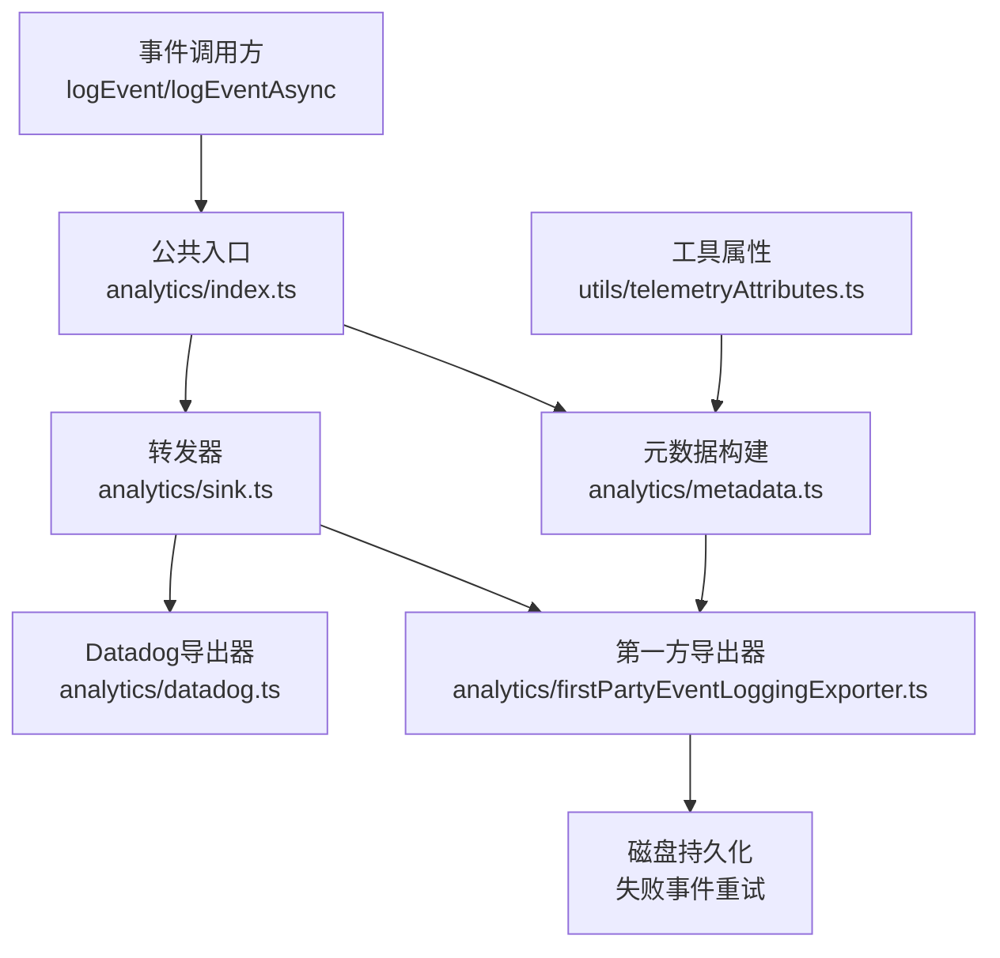
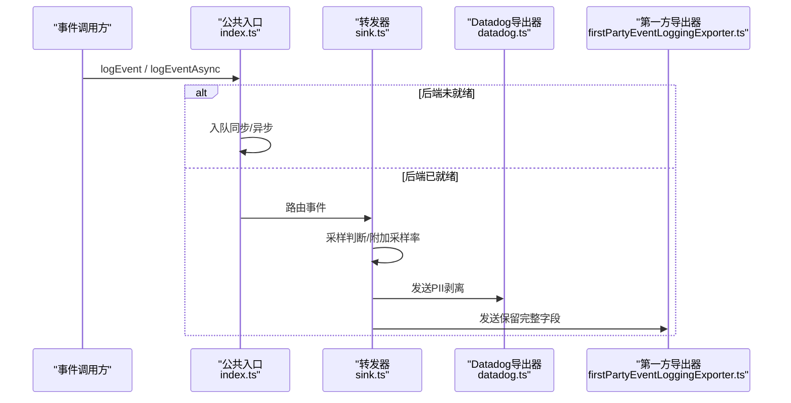
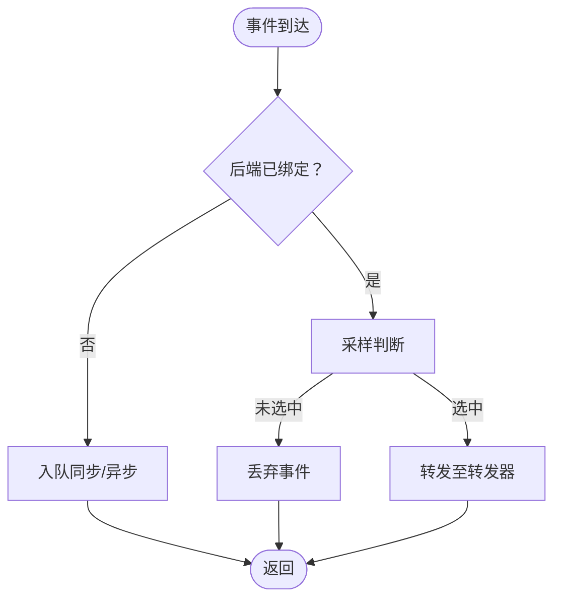
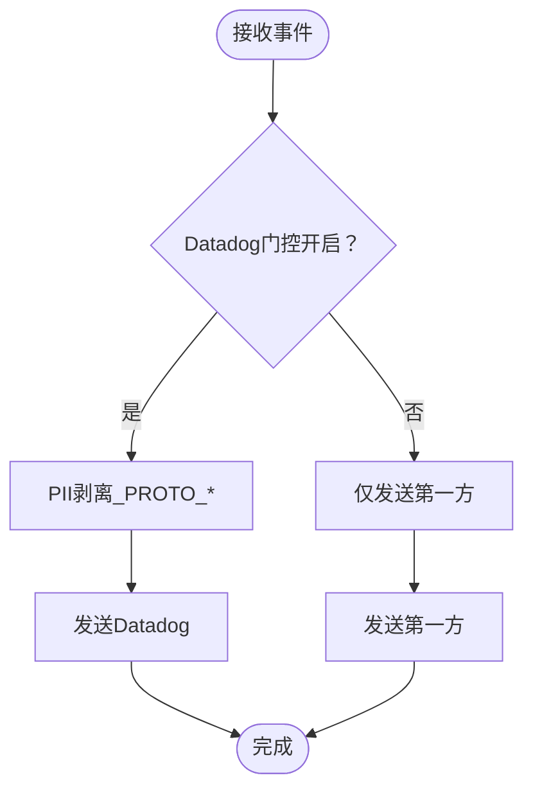
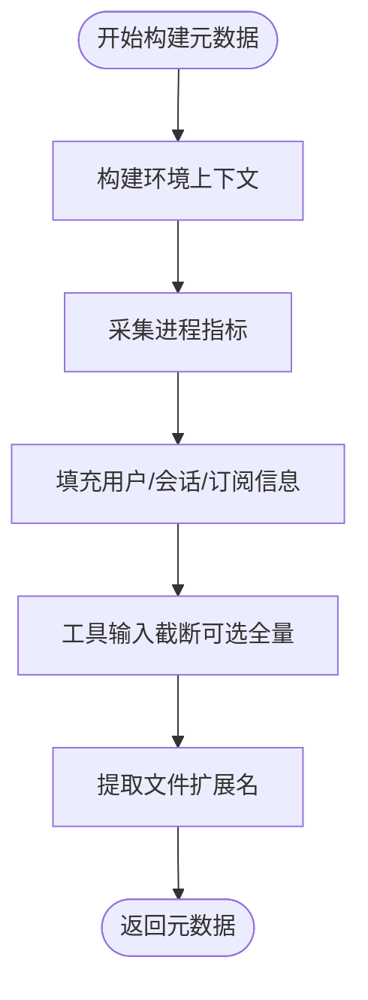
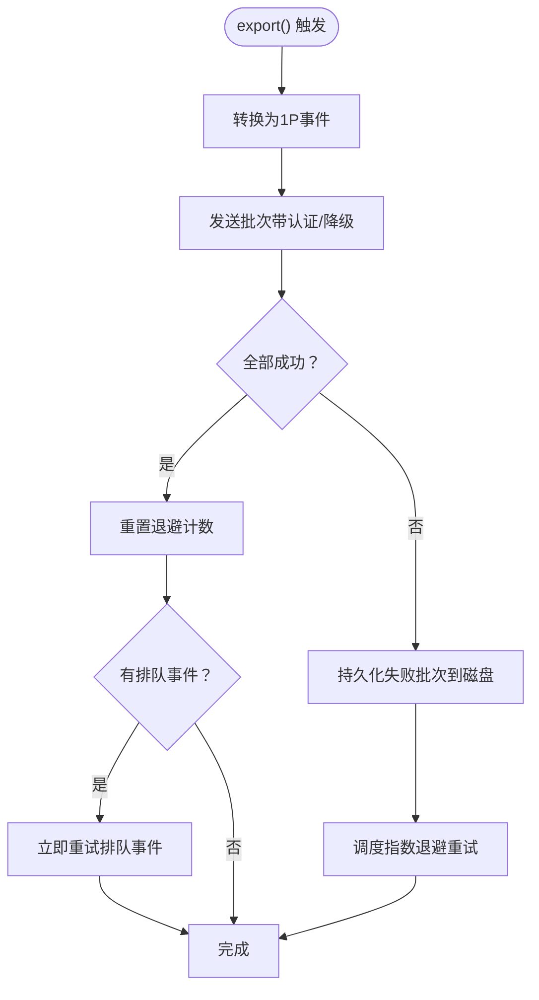
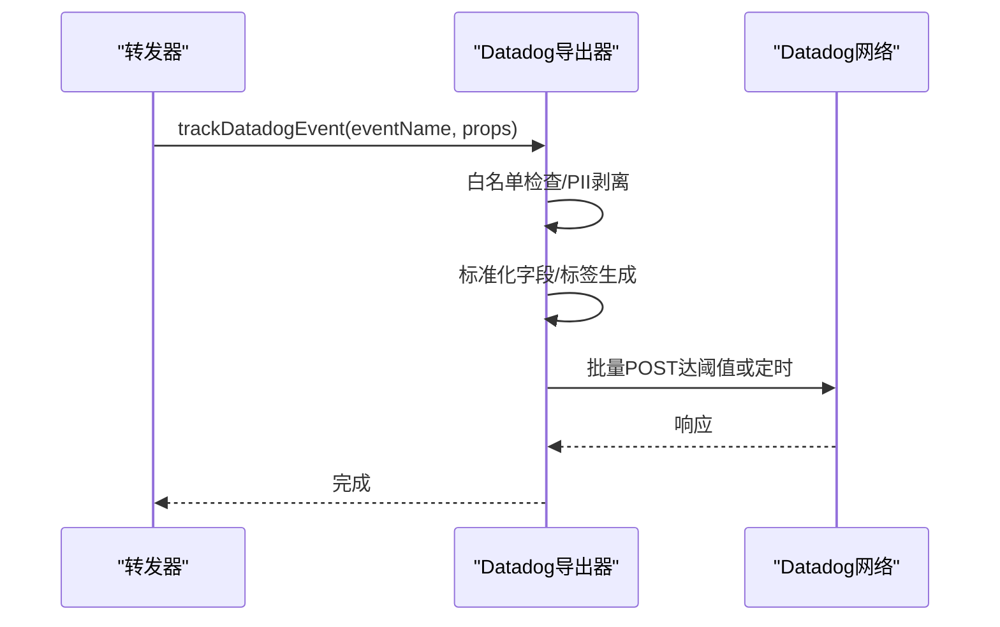
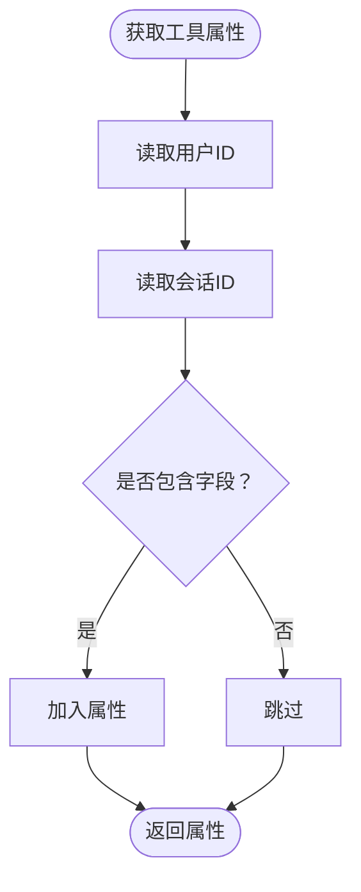
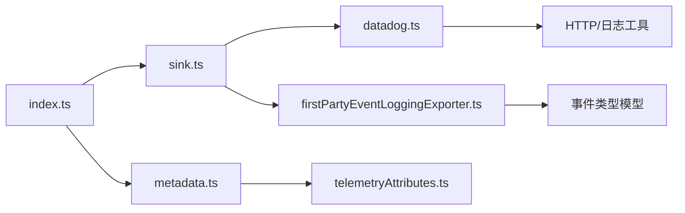

# 遥测数据收集

<cite>
**本文引用的文件**
- [src/services/analytics/index.ts](file://src/services/analytics/index.ts)
- [src/services/analytics/sink.ts](file://src/services/analytics/sink.ts)
- [src/services/analytics/metadata.ts](file://src/services/analytics/metadata.ts)
- [src/services/analytics/firstPartyEventLoggingExporter.ts](file://src/services/analytics/firstPartyEventLoggingExporter.ts)
- [src/services/analytics/datadog.ts](file://src/services/analytics/datadog.ts)
- [src/utils/telemetryAttributes.ts](file://src/utils/telemetryAttributes.ts)
- [docs/en/01-telemetry-and-privacy.md](file://docs/en/01-telemetry-and-privacy.md)
- [src/commands/stats/index.ts](file://src/commands/stats/index.ts)
</cite>

## 目录
1. [简介](#简介)
2. [项目结构](#项目结构)
3. [核心组件](#核心组件)
4. [架构总览](#架构总览)
5. [详细组件分析](#详细组件分析)
6. [依赖关系分析](#依赖关系分析)
7. [性能考量](#性能考量)
8. [故障排查指南](#故障排查指南)
9. [结论](#结论)
10. [附录](#附录)

## 简介
本技术文档面向Claude Code遥测数据收集系统，系统性阐述事件捕获、数据格式化、传输管道与持久化重试机制。文档覆盖以下关键主题：
- 事件捕获与队列：在分析后端初始化前的事件排队与异步/同步落盘
- 数据格式化与脱敏：环境元数据、进程指标、工具输入截断、PII保护
- 传输管道：第一方（Anthropic）与第三方（Datadog）双通道，含批处理、指数退避与磁盘持久化
- 采样与过滤：基于动态配置的事件采样与白名单事件过滤
- 扩展点：新增事件类型与自定义事件处理器的接入方式
- 完整性与错误处理：失败事件重试、上下文保留、调试日志与关闭流程

## 项目结构
遥测子系统主要由以下模块组成：
- 公共入口与队列：事件记录入口、队列与后端绑定
- 转发器：将事件路由到Datadog与第一方导出器
- 元数据：统一构建环境、会话、订阅、进程等元数据
- 第一方导出器：OTLP日志SDK批处理导出器，带磁盘持久化与指数退避
- Datadog导出器：受限白名单事件、批处理与标签规范化
- 工具属性：默认遥测属性注入（用户ID、会话ID、账户信息等）

图表来源
- [src/services/analytics/index.ts:125-173](file://src/services/analytics/index.ts#L125-L173)
- [src/services/analytics/sink.ts:1-115](file://src/services/analytics/sink.ts#L1-L115)
- [src/services/analytics/metadata.ts:693-743](file://src/services/analytics/metadata.ts#L693-L743)
- [src/services/analytics/firstPartyEventLoggingExporter.ts:73-139](file://src/services/analytics/firstPartyEventLoggingExporter.ts#L73-L139)
- [src/services/analytics/datadog.ts:1-115](file://src/services/analytics/datadog.ts#L1-L115)
- [src/utils/telemetryAttributes.ts:1-72](file://src/utils/telemetryAttributes.ts#L1-L72)

章节来源
- [src/services/analytics/index.ts:1-174](file://src/services/analytics/index.ts#L1-L174)
- [src/services/analytics/sink.ts:1-115](file://src/services/analytics/sink.ts#L1-L115)
- [src/services/analytics/metadata.ts:1-800](file://src/services/analytics/metadata.ts#L1-L800)
- [src/services/analytics/firstPartyEventLoggingExporter.ts:1-807](file://src/services/analytics/firstPartyEventLoggingExporter.ts#L1-L807)
- [src/services/analytics/datadog.ts:1-308](file://src/services/analytics/datadog.ts#L1-L308)
- [src/utils/telemetryAttributes.ts:1-72](file://src/utils/telemetryAttributes.ts#L1-L72)

## 核心组件
- 公共入口与队列
  - 提供同步与异步事件记录接口；在后端未就绪时将事件入队，后端就绪后批量投递
  - 支持采样率注入与敏感字段剥离
- 转发器
  - 将事件按门控与采样策略分发至Datadog与第一方导出器
  - 对Datadog进行PII字段剥离，对第一方保留完整字段
- 元数据构建
  - 统一构建环境上下文、进程指标、订阅与会话信息
  - 工具输入截断与MCP/Skill名称脱敏
- 第一方导出器
  - 基于OpenTelemetry批处理器，支持时间/大小双触发
  - 失败事件追加写入磁盘，指数退避重试，最大尝试次数限制
- Datadog导出器
  - 白名单事件过滤，批处理与标签规范化，避免保留字冲突
- 工具属性
  - 默认注入用户ID、会话ID、账户与版本等属性，受环境变量控制

章节来源
- [src/services/analytics/index.ts:125-173](file://src/services/analytics/index.ts#L125-L173)
- [src/services/analytics/sink.ts:45-86](file://src/services/analytics/sink.ts#L45-L86)
- [src/services/analytics/metadata.ts:236-303](file://src/services/analytics/metadata.ts#L236-L303)
- [src/services/analytics/firstPartyEventLoggingExporter.ts:277-377](file://src/services/analytics/firstPartyEventLoggingExporter.ts#L277-L377)
- [src/services/analytics/datadog.ts:19-64](file://src/services/analytics/datadog.ts#L19-L64)
- [src/utils/telemetryAttributes.ts:29-71](file://src/utils/telemetryAttributes.ts#L29-L71)

## 架构总览
遥测系统采用“入口-转发-双后端”的两层架构：
- 入口层负责事件聚合与队列，确保启动阶段无阻塞
- 转发层根据门控与采样策略决定是否发送及发送目标
- 双后端分别承担内部审计与外部可观测性，均具备批处理与失败重试能力

图表来源
- [src/services/analytics/index.ts:125-173](file://src/services/analytics/index.ts#L125-L173)
- [src/services/analytics/sink.ts:45-86](file://src/services/analytics/sink.ts#L45-L86)
- [src/services/analytics/datadog.ts:160-279](file://src/services/analytics/datadog.ts#L160-L279)
- [src/services/analytics/firstPartyEventLoggingExporter.ts:277-377](file://src/services/analytics/firstPartyEventLoggingExporter.ts#L277-L377)

## 详细组件分析

### 公共入口与事件队列
- 设计要点
  - 无依赖设计，避免循环导入
  - 初始化前事件入队，初始化后微任务批量投递，不阻塞启动路径
  - 支持采样配置，采样率写回事件元数据
- 关键接口
  - 同步记录：logEvent
  - 异步记录：logEventAsync
  - 绑定后端：attachAnalyticsSink
  - 重置（仅测试）：_resetForTesting

图表来源
- [src/services/analytics/index.ts:95-123](file://src/services/analytics/index.ts#L95-L123)
- [src/services/analytics/index.ts:133-164](file://src/services/analytics/index.ts#L133-L164)

章节来源
- [src/services/analytics/index.ts:1-174](file://src/services/analytics/index.ts#L1-L174)

### 转发器与采样/过滤
- 采样
  - 基于动态配置的采样结果，0表示丢弃，正数表示采样率并写入元数据
- 过滤
  - Datadog侧白名单事件集合
  - PII字段剥离（以_PROTO_前缀标识的字段仅用于第一方）
- 异步兼容
  - 当前两个后端均为fire-and-forget，异步实现直接委托同步实现

图表来源
- [src/services/analytics/sink.ts:29-72](file://src/services/analytics/sink.ts#L29-L72)

章节来源
- [src/services/analytics/sink.ts:1-115](file://src/services/analytics/sink.ts#L1-L115)

### 元数据构建与工具输入截断
- 元数据来源
  - 环境上下文：平台、架构、终端、包管理器、运行时、WSL/Linux发行版、CI信息、部署环境等
  - 进程指标：内存、CPU使用率、外部/数组缓冲等
  - 用户与会话：模型、会话ID、订阅等级、仓库远程哈希、代理/团队信息等
- 工具输入截断策略
  - 字符串：超过阈值截断并标注长度
  - JSON/对象：限制最大键值数量与嵌套深度
  - 数组：限制最大项数
  - 可选开启全量记录（OTEL_LOG_TOOL_DETAILS）
- 文件扩展提取
  - 从允许命令的bash命令中提取安全的文件扩展名，长扩展名替换为通用值

图表来源
- [src/services/analytics/metadata.ts:574-638](file://src/services/analytics/metadata.ts#L574-L638)
- [src/services/analytics/metadata.ts:648-682](file://src/services/analytics/metadata.ts#L648-L682)
- [src/services/analytics/metadata.ts:291-303](file://src/services/analytics/metadata.ts#L291-L303)
- [src/services/analytics/metadata.ts:372-412](file://src/services/analytics/metadata.ts#L372-L412)

章节来源
- [src/services/analytics/metadata.ts:417-496](file://src/services/analytics/metadata.ts#L417-L496)
- [src/services/analytics/metadata.ts:236-303](file://src/services/analytics/metadata.ts#L236-L303)
- [src/services/analytics/metadata.ts:372-412](file://src/services/analytics/metadata.ts#L372-L412)

### 第一方导出器（磁盘持久化与指数退避）
- 批处理
  - 基于OpenTelemetry批处理器，时间或大小达到阈值即触发
- 失败持久化
  - 失败事件追加写入当前会话专属文件，原子写入
- 指数退避
  - 以尝试次数平方增长延迟，上限可配置，最多尝试次数可配置
- 启动重试
  - 进程启动时扫描历史失败文件并后台重试
- 认证与降级
  - 信任未建立或令牌过期时自动降级为非认证发送
  - 401时自动切换为非认证重试

图表来源
- [src/services/analytics/firstPartyEventLoggingExporter.ts:277-377](file://src/services/analytics/firstPartyEventLoggingExporter.ts#L277-L377)
- [src/services/analytics/firstPartyEventLoggingExporter.ts:445-467](file://src/services/analytics/firstPartyEventLoggingExporter.ts#L445-L467)
- [src/services/analytics/firstPartyEventLoggingExporter.ts:469-517](file://src/services/analytics/firstPartyEventLoggingExporter.ts#L469-L517)

章节来源
- [src/services/analytics/firstPartyEventLoggingExporter.ts:73-139](file://src/services/analytics/firstPartyEventLoggingExporter.ts#L73-L139)
- [src/services/analytics/firstPartyEventLoggingExporter.ts:519-525](file://src/services/analytics/firstPartyEventLoggingExporter.ts#L519-L525)
- [src/services/analytics/firstPartyEventLoggingExporter.ts:527-615](file://src/services/analytics/firstPartyEventLoggingExporter.ts#L527-L615)

### Datadog导出器（白名单与批处理）
- 事件白名单
  - 仅允许预置的有限事件类型进入Datadog
- 批处理与定时刷新
  - 达到最大批次或定时器触发时刷新
- 标签规范化
  - 高基数字段转为标签，避免保留字冲突（如status映射为http_status与范围）
  - 用户桶化（基于用户ID哈希）降低告警基数

图表来源
- [src/services/analytics/sink.ts:63-71](file://src/services/analytics/sink.ts#L63-L71)
- [src/services/analytics/datadog.ts:160-279](file://src/services/analytics/datadog.ts#L160-L279)

章节来源
- [src/services/analytics/datadog.ts:19-83](file://src/services/analytics/datadog.ts#L19-L83)
- [src/services/analytics/datadog.ts:102-128](file://src/services/analytics/datadog.ts#L102-L128)
- [src/services/analytics/datadog.ts:281-307](file://src/services/analytics/datadog.ts#L281-L307)

### 工具属性与默认注入
- 默认属性
  - 用户ID、会话ID、组织ID、邮箱、账户UUID与标签ID
  - 版本、终端类型等
- 卡片inality控制
  - 通过环境变量控制是否包含会话ID、版本、账户UUID等高基数字段

图表来源
- [src/utils/telemetryAttributes.ts:29-71](file://src/utils/telemetryAttributes.ts#L29-L71)

章节来源
- [src/utils/telemetryAttributes.ts:1-72](file://src/utils/telemetryAttributes.ts#L1-L72)

### 事件类型与分类（基于文档）
- 环境指纹：平台、架构、终端、包管理器、运行时、WSL/Linux、CI/GitHub Actions、部署环境等
- 进程指标：运行时长、RSS、堆内存、外部/数组缓冲、CPU使用率
- 用户追踪：模型、会话ID、用户ID、设备ID、账户UUID、组织UUID、订阅等级、仓库远程哈希
- 工具输入：默认截断，可通过环境变量开启全量记录
- 文件扩展：从允许命令的bash命令中提取安全扩展名

章节来源
- [docs/en/01-telemetry-and-privacy.md:29-86](file://docs/en/01-telemetry-and-privacy.md#L29-L86)

## 依赖关系分析
- 公共入口依赖转发器与采样/剥离逻辑
- 转发器依赖Datadog导出器与第一方导出器
- 元数据构建依赖状态、平台、订阅等工具函数
- 第一方导出器依赖HTTP客户端、文件系统、认证头与类型化事件模型
- Datadog导出器依赖HTTP客户端、白名单与标签规范化

图表来源
- [src/services/analytics/index.ts:1-174](file://src/services/analytics/index.ts#L1-L174)
- [src/services/analytics/sink.ts:1-115](file://src/services/analytics/sink.ts#L1-L115)
- [src/services/analytics/metadata.ts:1-800](file://src/services/analytics/metadata.ts#L1-L800)
- [src/services/analytics/firstPartyEventLoggingExporter.ts:1-807](file://src/services/analytics/firstPartyEventLoggingExporter.ts#L1-L807)
- [src/services/analytics/datadog.ts:1-308](file://src/services/analytics/datadog.ts#L1-L308)
- [src/utils/telemetryAttributes.ts:1-72](file://src/utils/telemetryAttributes.ts#L1-L72)

章节来源
- [src/services/analytics/index.ts:1-174](file://src/services/analytics/index.ts#L1-L174)
- [src/services/analytics/sink.ts:1-115](file://src/services/analytics/sink.ts#L1-L115)
- [src/services/analytics/metadata.ts:1-800](file://src/services/analytics/metadata.ts#L1-L800)
- [src/services/analytics/firstPartyEventLoggingExporter.ts:1-807](file://src/services/analytics/firstPartyEventLoggingExporter.ts#L1-L807)
- [src/services/analytics/datadog.ts:1-308](file://src/services/analytics/datadog.ts#L1-L308)
- [src/utils/telemetryAttributes.ts:1-72](file://src/utils/telemetryAttributes.ts#L1-L72)

## 性能考量
- 启动路径无阻塞：初始化前事件入队，初始化后微任务批量投递
- 批处理优化：时间与大小双阈值，减少网络调用次数
- 指数退避：避免雪崩效应，提升网络恢复后的吞吐
- 磁盘持久化：失败事件本地落盘，保障数据不丢失
- 标签与字段规范化：降低高基数字段带来的查询与存储成本

## 故障排查指南
- 事件未到达Datadog
  - 检查事件是否在白名单内
  - 检查门控状态与PII剥离是否导致字段缺失
- 事件未到达第一方
  - 查看磁盘持久化文件是否存在与内容
  - 检查认证状态（信任对话框接受、OAuth令牌有效性）
  - 关注指数退避重试日志与最大尝试次数
- 启动阶段事件丢失
  - 确认后端绑定是否幂等调用
  - 检查队列清空与微任务投递
- 调试与观测
  - 在特定用户类型下启用调试输出
  - 使用统计命令查看使用情况与活动

章节来源
- [src/services/analytics/sink.ts:29-43](file://src/services/analytics/sink.ts#L29-L43)
- [src/services/analytics/firstPartyEventLoggingExporter.ts:220-275](file://src/services/analytics/firstPartyEventLoggingExporter.ts#L220-L275)
- [src/services/analytics/firstPartyEventLoggingExporter.ts:530-536](file://src/services/analytics/firstPartyEventLoggingExporter.ts#L530-L536)
- [src/services/analytics/datadog.ts:130-144](file://src/services/analytics/datadog.ts#L130-L144)
- [src/commands/stats/index.ts:1-11](file://src/commands/stats/index.ts#L1-L11)

## 结论
该遥测系统通过“入口-转发-双后端”架构实现了高可用、可扩展且具备隐私保护的数据收集链路。其批处理、指数退避与磁盘持久化机制确保了在网络异常或服务不可用时的数据完整性；PII剥离与白名单过滤兼顾了合规性与可观测性。对于扩展新事件类型与自定义处理器，建议遵循现有接口契约与采样/过滤策略，确保一致性与可维护性。

## 附录

### 事件触发条件与时机
- 同步事件：立即入队或直接投递
- 异步事件：立即入队或直接投递（当前实现为fire-and-forget）
- 初始化时机：后端绑定后批量投递队列中的事件

章节来源
- [src/services/analytics/index.ts:95-123](file://src/services/analytics/index.ts#L95-L123)
- [src/services/analytics/index.ts:154-164](file://src/services/analytics/index.ts#L154-L164)

### 数据序列化与压缩策略
- 第一方导出器
  - 事件序列化为协议缓冲消息，额外字段以Base64编码存储
  - 失败事件以JSON Lines形式追加写入磁盘
- Datadog导出器
  - 事件以JSON批量POST，达阈值或定时刷新

章节来源
- [src/services/analytics/firstPartyEventLoggingExporter.ts:708-758](file://src/services/analytics/firstPartyEventLoggingExporter.ts#L708-L758)
- [src/services/analytics/datadog.ts:102-119](file://src/services/analytics/datadog.ts#L102-L119)

### 批量传输机制
- 时间触发：默认批处理间隔
- 大小触发：默认批大小
- 第一方导出器还支持批次间延迟与单批重试

章节来源
- [src/services/analytics/firstPartyEventLoggingExporter.ts:73-139](file://src/services/analytics/firstPartyEventLoggingExporter.ts#L73-L139)
- [src/services/analytics/datadog.ts:15-17](file://src/services/analytics/datadog.ts#L15-L17)

### 事件过滤与采样规则配置
- 采样：基于动态配置的采样率，0表示丢弃
- 过滤：Datadog白名单事件集合
- PII剥离：_PROTO_*字段仅用于第一方

章节来源
- [src/services/analytics/sink.ts:49-71](file://src/services/analytics/sink.ts#L49-L71)
- [src/services/analytics/datadog.ts:19-64](file://src/services/analytics/datadog.ts#L19-L64)

### 数据完整性校验与错误处理
- 校验
  - 缺失核心元数据时生成部分事件记录
  - 失败事件持久化与重试上下文保留
- 错误处理
  - 指数退避与最大尝试次数
  - 401自动降级为非认证重试
  - 关闭与强制刷新流程

章节来源
- [src/services/analytics/firstPartyEventLoggingExporter.ts:690-704](file://src/services/analytics/firstPartyEventLoggingExporter.ts#L690-L704)
- [src/services/analytics/firstPartyEventLoggingExporter.ts:594-614](file://src/services/analytics/firstPartyEventLoggingExporter.ts#L594-L614)
- [src/services/analytics/firstPartyEventLoggingExporter.ts:764-778](file://src/services/analytics/firstPartyEventLoggingExporter.ts#L764-L778)

### 扩展新事件类型与自定义事件处理器
- 新增事件类型
  - 在调用方使用公共入口记录事件，遵循元数据构建规范
  - 若需进入Datadog，需将其加入白名单
- 自定义事件处理器
  - 实现转发器接口，接入采样与PII剥离逻辑
  - 保持幂等与无阻塞特性

章节来源
- [src/services/analytics/index.ts:63-78](file://src/services/analytics/index.ts#L63-L78)
- [src/services/analytics/sink.ts:109-114](file://src/services/analytics/sink.ts#L109-L114)