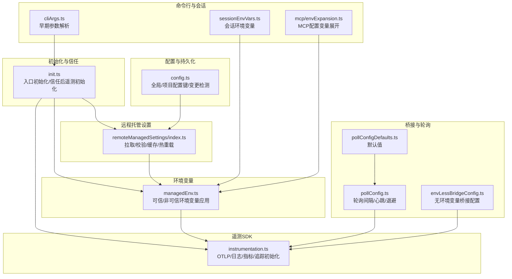
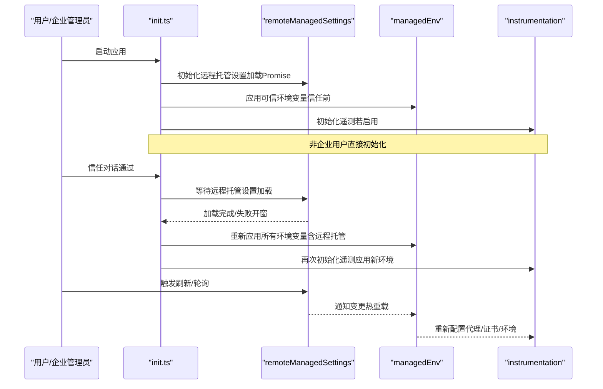
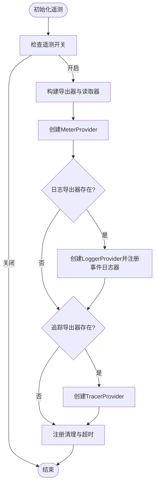
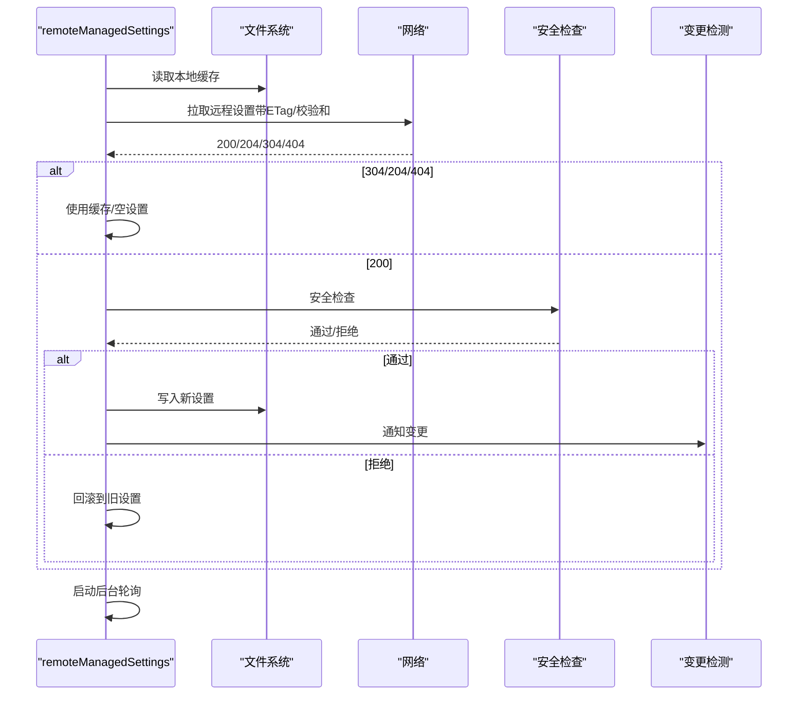
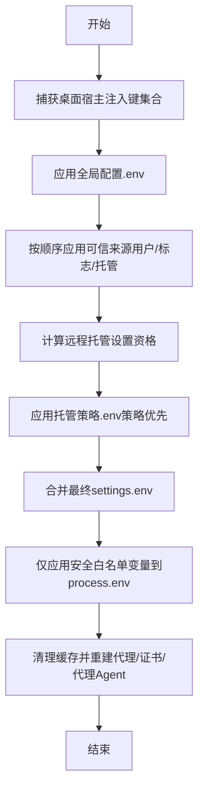
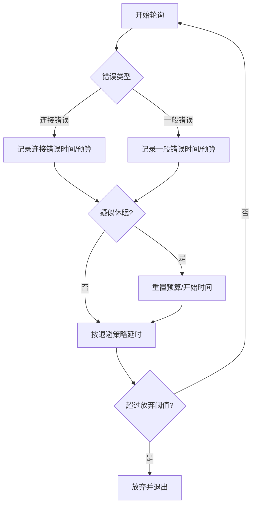
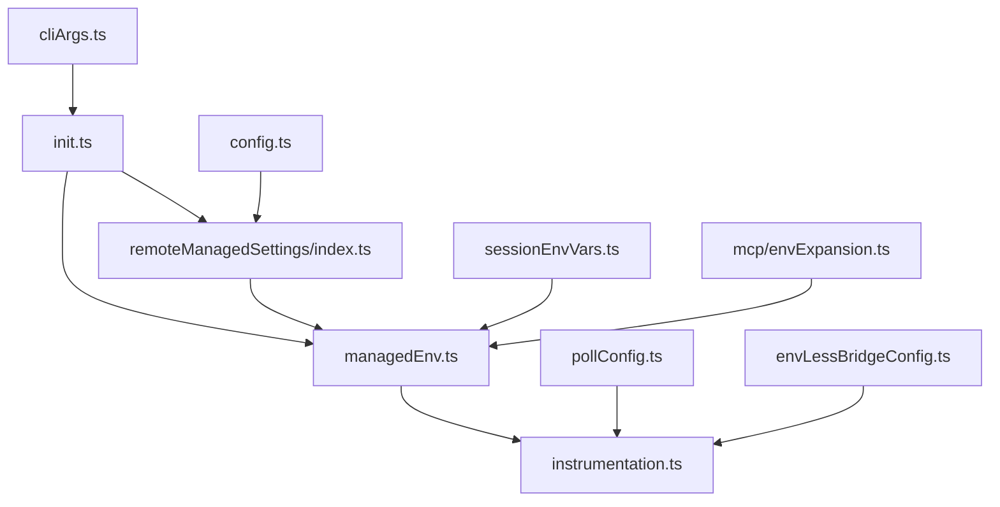

# 遥测配置与管理

<cite>
**本文引用的文件**
- [src/entrypoints/init.ts](file://src/entrypoints/init.ts)
- [src/utils/telemetry/instrumentation.ts](file://src/utils/telemetry/instrumentation.ts)
- [src/services/remoteManagedSettings/index.ts](file://src/services/remoteManagedSettings/index.ts)
- [src/utils/managedEnv.ts](file://src/utils/managedEnv.ts)
- [src/bridge/pollConfig.ts](file://src/bridge/pollConfig.ts)
- [src/bridge/envLessBridgeConfig.ts](file://src/bridge/envLessBridgeConfig.ts)
- [src/bridge/pollConfigDefaults.ts](file://src/bridge/pollConfigDefaults.ts)
- [src/utils/cliArgs.ts](file://src/utils/cliArgs.ts)
- [src/utils/sessionEnvVars.ts](file://src/utils/sessionEnvVars.ts)
- [src/services/mcp/envExpansion.ts](file://src/services/mcp/envExpansion.ts)
- [src/utils/config.ts](file://src/utils/config.ts)
</cite>

## 目录
1. [简介](#简介)
2. [项目结构](#项目结构)
3. [核心组件](#核心组件)
4. [架构总览](#架构总览)
5. [详细组件分析](#详细组件分析)
6. [依赖关系分析](#依赖关系分析)
7. [性能考量](#性能考量)
8. [故障排查指南](#故障排查指南)
9. [结论](#结论)
10. [附录](#附录)

## 简介
本文件面向Claude Code的遥测配置与管理系统，系统性阐述遥测的配置项、参数与优先级、热重载与动态更新、遥测开关与流量控制、验证与错误处理、备份与迁移、环境变量与命令行参数管理、审计与变更追踪，以及常见问题排查。目标是帮助开发者与运维人员在不深入源码的前提下，理解并正确使用遥测配置。

## 项目结构
遥测相关能力主要分布在以下模块：
- 初始化与信任流程：入口初始化、信任对话后遥测初始化
- 遥测SDK与导出器：OpenTelemetry集成、导出协议选择、超时与清理
- 远程托管设置：企业级远程配置拉取、校验、缓存与热重载
- 环境变量应用：可信与非可信来源的分层应用、代理与证书影响
- 桥接与轮询：桥接轮询间隔、心跳与退避策略
- 命令行与会话环境：早期参数解析、会话级环境变量
- 配置与持久化：全局/项目配置键、变更检测与持久化

**图表来源**
- [src/entrypoints/init.ts:1-341](file://src/entrypoints/init.ts#L1-L341)
- [src/utils/telemetry/instrumentation.ts:1-826](file://src/utils/telemetry/instrumentation.ts#L1-L826)
- [src/services/remoteManagedSettings/index.ts:1-639](file://src/services/remoteManagedSettings/index.ts#L1-L639)
- [src/utils/managedEnv.ts:1-200](file://src/utils/managedEnv.ts#L1-L200)
- [src/bridge/pollConfig.ts:1-110](file://src/bridge/pollConfig.ts#L1-L110)
- [src/bridge/pollConfigDefaults.ts:1-30](file://src/bridge/pollConfigDefaults.ts#L1-L30)
- [src/bridge/envLessBridgeConfig.ts:1-166](file://src/bridge/envLessBridgeConfig.ts#L1-L166)
- [src/utils/cliArgs.ts:1-29](file://src/utils/cliArgs.ts#L1-L29)
- [src/utils/sessionEnvVars.ts:1-22](file://src/utils/sessionEnvVars.ts#L1-L22)
- [src/services/mcp/envExpansion.ts:1-38](file://src/services/mcp/envExpansion.ts#L1-L38)
- [src/utils/config.ts:1-800](file://src/utils/config.ts#L1-L800)

**章节来源**
- [src/entrypoints/init.ts:1-341](file://src/entrypoints/init.ts#L1-L341)
- [src/utils/telemetry/instrumentation.ts:1-826](file://src/utils/telemetry/instrumentation.ts#L1-L826)
- [src/services/remoteManagedSettings/index.ts:1-639](file://src/services/remoteManagedSettings/index.ts#L1-L639)
- [src/utils/managedEnv.ts:1-200](file://src/utils/managedEnv.ts#L1-L200)
- [src/bridge/pollConfig.ts:1-110](file://src/bridge/pollConfig.ts#L1-L110)
- [src/bridge/pollConfigDefaults.ts:1-30](file://src/bridge/pollConfigDefaults.ts#L1-L30)
- [src/bridge/envLessBridgeConfig.ts:1-166](file://src/bridge/envLessBridgeConfig.ts#L1-L166)
- [src/utils/cliArgs.ts:1-29](file://src/utils/cliArgs.ts#L1-L29)
- [src/utils/sessionEnvVars.ts:1-22](file://src/utils/sessionEnvVars.ts#L1-L22)
- [src/services/mcp/envExpansion.ts:1-38](file://src/services/mcp/envExpansion.ts#L1-L38)
- [src/utils/config.ts:1-800](file://src/utils/config.ts#L1-L800)

## 核心组件
- 遥测初始化与开关
  - 通过环境变量控制是否启用遥测；支持多种导出器（OTLP/HTTP/GRPC、Prometheus、Console）与协议（http/json、http/protobuf、grpc），并可配置导出间隔。
  - 支持Beta追踪通道与增强遥测（追踪）的独立路径。
  - 提供优雅关闭与超时控制，确保退出前完成flush。
- 远程托管设置与热重载
  - 企业用户可通过远程托管设置获取策略，包含环境变量、代理、证书等，失败时“开窗”继续运行。
  - 使用ETag缓存与校验和，支持后台轮询检测变更并触发热重载。
- 环境变量应用与优先级
  - 可信来源（用户设置、CLI标志、托管设置）在信任前应用；项目来源仅应用安全白名单变量。
  - 重新应用环境变量以反映远程托管设置变化。
- 桥接轮询与心跳
  - 轮询间隔、心跳间隔、抖动、超时、退避策略均通过配置或默认值控制，保障在高负载或睡眠场景下的稳定性。
- 命令行与会话环境
  - 早期参数解析支持在初始化前读取关键标志；会话级环境变量用于子进程而非REPL进程本身。
- 配置与持久化
  - 全局/项目配置键定义明确；变更检测触发热重载；持久化避免丢失认证状态。

**章节来源**
- [src/utils/telemetry/instrumentation.ts:324-747](file://src/utils/telemetry/instrumentation.ts#L324-L747)
- [src/services/remoteManagedSettings/index.ts:514-639](file://src/services/remoteManagedSettings/index.ts#L514-L639)
- [src/utils/managedEnv.ts:124-199](file://src/utils/managedEnv.ts#L124-L199)
- [src/bridge/pollConfig.ts:102-110](file://src/bridge/pollConfig.ts#L102-L110)
- [src/bridge/envLessBridgeConfig.ts:130-166](file://src/bridge/envLessBridgeConfig.ts#L130-L166)
- [src/utils/cliArgs.ts:13-29](file://src/utils/cliArgs.ts#L13-L29)
- [src/utils/sessionEnvVars.ts:1-22](file://src/utils/sessionEnvVars.ts#L1-L22)
- [src/utils/config.ts:627-774](file://src/utils/config.ts#L627-L774)

## 架构总览
遥测配置与管理的关键流程如下：

**图表来源**
- [src/entrypoints/init.ts:240-286](file://src/entrypoints/init.ts#L240-L286)
- [src/services/remoteManagedSettings/index.ts:514-579](file://src/services/remoteManagedSettings/index.ts#L514-L579)
- [src/utils/managedEnv.ts:187-199](file://src/utils/managedEnv.ts#L187-L199)
- [src/utils/telemetry/instrumentation.ts:421-701](file://src/utils/telemetry/instrumentation.ts#L421-L701)

## 详细组件分析

### 遥测初始化与导出配置
- 开关与协议
  - 通过环境变量控制遥测开关；支持多种导出器类型与协议，按需动态导入，减少启动体积。
  - 指标、日志、追踪分别配置导出器与批量处理器，支持自定义导出间隔。
- Beta追踪与增强遥测
  - Beta追踪使用独立端点与导出器，便于内部调试；增强遥测开启时初始化追踪导出器。
- 关闭与超时
  - 注册清理函数，在退出前强制flush并关闭Provider；提供超时保护，避免阻塞退出。
- 头部与代理
  - 动态/静态头部合并；根据代理与mTLS配置构建HTTP Agent选项；支持绕过代理的端点白名单。

**图表来源**
- [src/utils/telemetry/instrumentation.ts:421-701](file://src/utils/telemetry/instrumentation.ts#L421-L701)

**章节来源**
- [src/utils/telemetry/instrumentation.ts:324-747](file://src/utils/telemetry/instrumentation.ts#L324-L747)

### 远程托管设置与热重载
- 获取与缓存
  - 使用ETag与校验和优化网络；失败时使用本地缓存（开窗）；支持空响应清理缓存。
- 安全检查
  - 在应用新设置前执行安全检查，用户拒绝则回滚到旧设置。
- 背景轮询
  - 每小时轮询一次，检测变更并触发热重载；停止时清理定时器与注册的清理函数。
- 刷新与清理
  - 登录/登出或权限变化时可清理缓存并重新加载；失败同样开窗继续。

**图表来源**
- [src/services/remoteManagedSettings/index.ts:414-503](file://src/services/remoteManagedSettings/index.ts#L414-L503)
- [src/services/remoteManagedSettings/index.ts:584-606](file://src/services/remoteManagedSettings/index.ts#L584-L606)

**章节来源**
- [src/services/remoteManagedSettings/index.ts:514-639](file://src/services/remoteManagedSettings/index.ts#L514-L639)

### 环境变量应用与优先级
- 可信来源（信任前）
  - 全局配置、用户设置、CLI标志、托管设置（策略最高优先级）全部应用，包括潜在危险变量。
- 非可信来源（信任后）
  - 仅应用安全白名单变量；过滤掉桌面宿主注入、主机托管提供者变量、SSH隧道占位变量等。
- 重新应用
  - 远程托管设置加载完成后，重新应用所有环境变量，确保遥测与代理/证书配置生效。

**图表来源**
- [src/utils/managedEnv.ts:124-199](file://src/utils/managedEnv.ts#L124-L199)

**章节来源**
- [src/utils/managedEnv.ts:1-200](file://src/utils/managedEnv.ts#L1-L200)

### 桥接轮询与心跳配置
- 轮询间隔
  - 非容量与容量场景分别配置轮询间隔；支持从特性开关中拉取实时配置并校验。
- 心跳与抖动
  - 心跳间隔与抖动范围受约束，确保服务端TTL内稳定存活。
- 退避与睡眠检测
  - 连接错误与一般错误分别统计并退避；检测系统休眠，重置预算并恢复。
- 默认值
  - 定义非容量与容量场景的默认轮询间隔，兼顾Redis TTL与服务端健康门限。

**图表来源**
- [src/bridge/pollConfig.ts:102-110](file://src/bridge/pollConfig.ts#L102-L110)
- [src/bridge/envLessBridgeConfig.ts:130-166](file://src/bridge/envLessBridgeConfig.ts#L130-L166)
- [src/bridge/pollConfigDefaults.ts:1-30](file://src/bridge/pollConfigDefaults.ts#L1-L30)

**章节来源**
- [src/bridge/pollConfig.ts:62-110](file://src/bridge/pollConfig.ts#L62-L110)
- [src/bridge/envLessBridgeConfig.ts:1-166](file://src/bridge/envLessBridgeConfig.ts#L1-L166)
- [src/bridge/pollConfigDefaults.ts:1-30](file://src/bridge/pollConfigDefaults.ts#L1-L30)

### 命令行参数与会话环境
- 早期参数解析
  - 在Commander处理前解析关键标志（如--settings），以便尽早影响配置加载。
- 会话环境变量
  - 会话级变量仅应用于子进程，不污染REPL进程；支持增删清空操作。
- MCP配置变量展开
  - 支持${VAR}与${VAR:-default}语法，返回展开结果与缺失变量列表，便于错误报告。

**章节来源**
- [src/utils/cliArgs.ts:13-29](file://src/utils/cliArgs.ts#L13-L29)
- [src/utils/sessionEnvVars.ts:1-22](file://src/utils/sessionEnvVars.ts#L1-L22)
- [src/services/mcp/envExpansion.ts:10-38](file://src/services/mcp/envExpansion.ts#L10-L38)

### 配置键与持久化
- 全局/项目配置键
  - 明确列出可持久化的键集合，避免意外写入导致状态丢失。
- 变更检测
  - 通过变更检测器触发热重载，确保环境变量、遥测与权限等在下次读取时生效。
- 持久化保护
  - 检测写入可能丢失认证/引导状态的情况，避免因文件损坏导致永久丢失。

**章节来源**
- [src/utils/config.ts:627-774](file://src/utils/config.ts#L627-L774)

## 依赖关系分析
- 组件耦合
  - 初始化模块依赖远程托管设置与环境变量模块；遥测模块依赖代理/证书/代理配置与设置模块。
  - 桥接轮询配置与默认值相互独立，但共同影响桥接稳定性。
- 外部依赖
  - OpenTelemetry SDK与导出器；HTTP代理与mTLS；Axios网络库；文件系统缓存。
- 循环依赖
  - 通过延迟导入与模块边界设计避免循环依赖；变更检测器作为事件总线解耦。

**图表来源**
- [src/entrypoints/init.ts:1-341](file://src/entrypoints/init.ts#L1-L341)
- [src/utils/telemetry/instrumentation.ts:1-826](file://src/utils/telemetry/instrumentation.ts#L1-L826)
- [src/services/remoteManagedSettings/index.ts:1-639](file://src/services/remoteManagedSettings/index.ts#L1-L639)
- [src/utils/managedEnv.ts:1-200](file://src/utils/managedEnv.ts#L1-L200)
- [src/bridge/pollConfig.ts:1-110](file://src/bridge/pollConfig.ts#L1-L110)
- [src/bridge/envLessBridgeConfig.ts:1-166](file://src/bridge/envLessBridgeConfig.ts#L1-L166)
- [src/utils/cliArgs.ts:1-29](file://src/utils/cliArgs.ts#L1-L29)
- [src/utils/sessionEnvVars.ts:1-22](file://src/utils/sessionEnvVars.ts#L1-L22)
- [src/services/mcp/envExpansion.ts:1-38](file://src/services/mcp/envExpansion.ts#L1-L38)
- [src/utils/config.ts:1-800](file://src/utils/config.ts#L1-L800)

**章节来源**
- [src/entrypoints/init.ts:1-341](file://src/entrypoints/init.ts#L1-L341)
- [src/utils/telemetry/instrumentation.ts:1-826](file://src/utils/telemetry/instrumentation.ts#L1-L826)
- [src/services/remoteManagedSettings/index.ts:1-639](file://src/services/remoteManagedSettings/index.ts#L1-L639)
- [src/utils/managedEnv.ts:1-200](file://src/utils/managedEnv.ts#L1-L200)
- [src/bridge/pollConfig.ts:1-110](file://src/bridge/pollConfig.ts#L1-L110)
- [src/bridge/envLessBridgeConfig.ts:1-166](file://src/bridge/envLessBridgeConfig.ts#L1-L166)
- [src/utils/cliArgs.ts:1-29](file://src/utils/cliArgs.ts#L1-L29)
- [src/utils/sessionEnvVars.ts:1-22](file://src/utils/sessionEnvVars.ts#L1-L22)
- [src/services/mcp/envExpansion.ts:1-38](file://src/services/mcp/envExpansion.ts#L1-L38)
- [src/utils/config.ts:1-800](file://src/utils/config.ts#L1-L800)

## 性能考量
- 启动体积与懒加载
  - 导出器与gRPC相关模块按需动态导入，显著降低启动时内存占用。
- 批量导出与间隔
  - 指标、日志、追踪分别配置导出间隔，避免高频网络请求。
- 缓存与ETag
  - 远程托管设置使用ETag与校验和，减少无效下载；后台轮询降低实时性要求。
- 退避与休眠检测
  - 轮询错误采用退避策略，并检测系统休眠，避免长时间无效重试。

[本节为通用指导，无需具体文件来源]

## 故障排查指南
- 遥测未导出/导出异常
  - 检查遥测开关与导出器类型/协议配置；确认代理与mTLS配置正确；查看超时与关闭流程日志。
  - 参考：[遥测初始化与导出配置:421-701](file://src/utils/telemetry/instrumentation.ts#L421-L701)
- 远程托管设置未生效
  - 确认用户具备托管设置资格；检查网络与认证头；查看缓存与ETag；关注安全检查拒绝日志。
  - 参考：[远程托管设置与热重载:514-639](file://src/services/remoteManagedSettings/index.ts#L514-L639)
- 环境变量未按预期生效
  - 区分可信与非可信阶段的应用范围；确认已重新应用环境变量；检查安全白名单与过滤规则。
  - 参考：[环境变量应用与优先级:124-199](file://src/utils/managedEnv.ts#L124-L199)
- 轮询频繁或连接失败
  - 检查轮询间隔与心跳配置；确认退避策略与休眠检测逻辑；核对服务端TTL与健康门限。
  - 参考：[桥接轮询与心跳配置:62-110](file://src/bridge/pollConfig.ts#L62-L110)
- 命令行参数未被识别
  - 确认在Commander处理前解析了关键标志；检查argv传递与格式（=或空格）。
  - 参考：[命令行参数与会话环境:13-29](file://src/utils/cliArgs.ts#L13-L29)
- 配置持久化丢失状态
  - 避免写入可能丢失认证/引导状态的配置；利用变更检测器触发热重载。
  - 参考：[配置键与持久化:783-795](file://src/utils/config.ts#L783-L795)

**章节来源**
- [src/utils/telemetry/instrumentation.ts:654-699](file://src/utils/telemetry/instrumentation.ts#L654-L699)
- [src/services/remoteManagedSettings/index.ts:514-579](file://src/services/remoteManagedSettings/index.ts#L514-L579)
- [src/utils/managedEnv.ts:124-199](file://src/utils/managedEnv.ts#L124-L199)
- [src/bridge/pollConfig.ts:62-110](file://src/bridge/pollConfig.ts#L62-L110)
- [src/utils/cliArgs.ts:13-29](file://src/utils/cliArgs.ts#L13-L29)
- [src/utils/config.ts:783-795](file://src/utils/config.ts#L783-L795)

## 结论
本系统通过“可信/非可信环境变量分层应用 + 远程托管设置热重载 + OpenTelemetry可插拔导出器 + 桥接轮询与心跳退避”的组合，实现了灵活、安全、可观测且可维护的遥测配置与管理。企业用户可通过远程托管设置统一治理遥测行为，普通用户可在本地配置中精细控制导出与协议。建议在生产环境中结合代理与mTLS、合理设置导出间隔与超时，并定期审查远程托管设置的安全检查结果。

[本节为总结，无需具体文件来源]

## 附录

### 配置项与参数速览
- 遥测开关与导出
  - 开关：通过环境变量控制；支持多种导出器与协议；可配置导出间隔。
  - 参考：[遥测初始化与导出配置:421-701](file://src/utils/telemetry/instrumentation.ts#L421-L701)
- 远程托管设置
  - 资格判断、拉取、缓存、ETag/校验和、安全检查、热重载、后台轮询。
  - 参考：[远程托管设置与热重载:514-639](file://src/services/remoteManagedSettings/index.ts#L514-L639)
- 环境变量优先级
  - 信任前：全局/用户/CLI/托管；信任后：仅安全白名单变量。
  - 参考：[环境变量应用与优先级:124-199](file://src/utils/managedEnv.ts#L124-L199)
- 桥接轮询与心跳
  - 轮询间隔、心跳、抖动、超时、退避、睡眠检测。
  - 参考：[桥接轮询与心跳配置:62-110](file://src/bridge/pollConfig.ts#L62-L110)
- 命令行与会话
  - 早期参数解析、会话环境变量、MCP变量展开。
  - 参考：[命令行参数与会话环境:13-29](file://src/utils/cliArgs.ts#L13-L29), [src/utils/sessionEnvVars.ts:1-22](file://src/utils/sessionEnvVars.ts#L1-L22), [src/services/mcp/envExpansion.ts:10-38](file://src/services/mcp/envExpansion.ts#L10-L38)
- 配置键与持久化
  - 全局/项目配置键、变更检测、持久化保护。
  - 参考：[配置键与持久化:627-774](file://src/utils/config.ts#L627-L774)

### 配置验证与错误处理清单
- 遥测
  - 检查开关、导出器类型/协议、导出间隔、代理/mTLS、超时与关闭流程。
  - 参考：[遥测初始化与导出配置:421-701](file://src/utils/telemetry/instrumentation.ts#L421-L701)
- 远程托管设置
  - 校验资格、网络/认证、ETag/校验和、安全检查、热重载。
  - 参考：[远程托管设置与热重载:514-639](file://src/services/remoteManagedSettings/index.ts#L514-L639)
- 环境变量
  - 分阶段应用范围、白名单、过滤规则、重新应用。
  - 参考：[环境变量应用与优先级:124-199](file://src/utils/managedEnv.ts#L124-L199)
- 桥接轮询
  - 轮询/心跳/抖动/超时/退避/睡眠检测。
  - 参考：[桥接轮询与心跳配置:62-110](file://src/bridge/pollConfig.ts#L62-L110)

### 配置备份与迁移策略
- 备份
  - 远程托管设置：本地缓存文件；全局配置：~/.claude.json；项目配置：项目目录内配置。
  - 参考：[远程托管设置与热重载:367-386](file://src/services/remoteManagedSettings/index.ts#L367-L386), [src/utils/config.ts:627-774](file://src/utils/config.ts#L627-L774)
- 迁移
  - 通过迁移版本字段避免重复同步；注意持久化保护，防止丢失认证/引导状态。
  - 参考：[配置键与持久化:574-578](file://src/utils/config.ts#L574-L578), [src/utils/config.ts:783-795](file://src/utils/config.ts#L783-L795)

### 环境变量与命令行参数管理
- 环境变量
  - 遥测：OTEL_*、CLAUDE_CODE_ENABLE_TELEMETRY、CLAUDE_CODE_OTEL_*；代理：HTTP_PROXY/HTTPS_PROXY/NO_PROXY；证书：NODE_EXTRA_CA_CERTS。
  - 参考：[遥测初始化与导出配置:768-800](file://src/utils/telemetry/instrumentation.ts#L768-L800), [src/utils/managedEnv.ts:187-199](file://src/utils/managedEnv.ts#L187-L199)
- 命令行
  - 早期解析：--settings等；运行时：Commander处理。
  - 参考：[命令行参数与会话环境:13-29](file://src/utils/cliArgs.ts#L13-L29)

### 配置审计与变更追踪
- 审计
  - 变更检测器触发热重载；遥测日志记录关键事件与超时信息。
  - 参考：[远程托管设置与热重载:546-547](file://src/services/remoteManagedSettings/index.ts#L546-L547), [src/utils/telemetry/instrumentation.ts:654-699](file://src/utils/telemetry/instrumentation.ts#L654-L699)