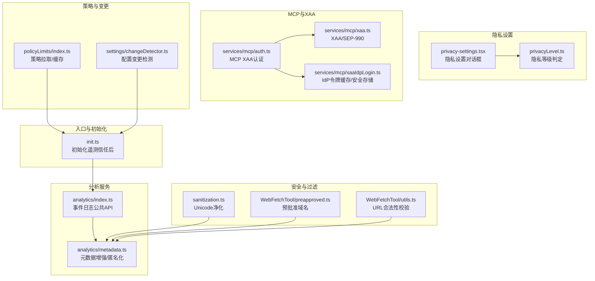
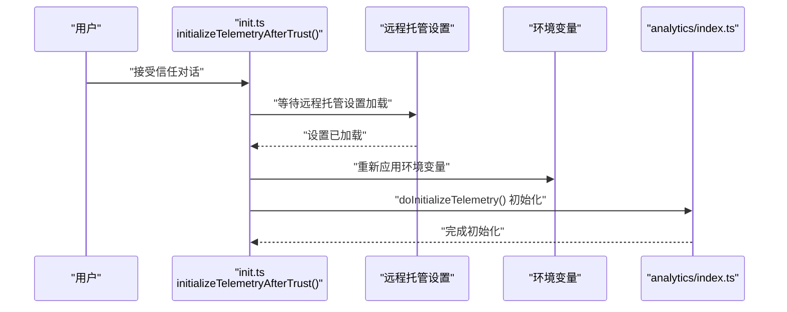
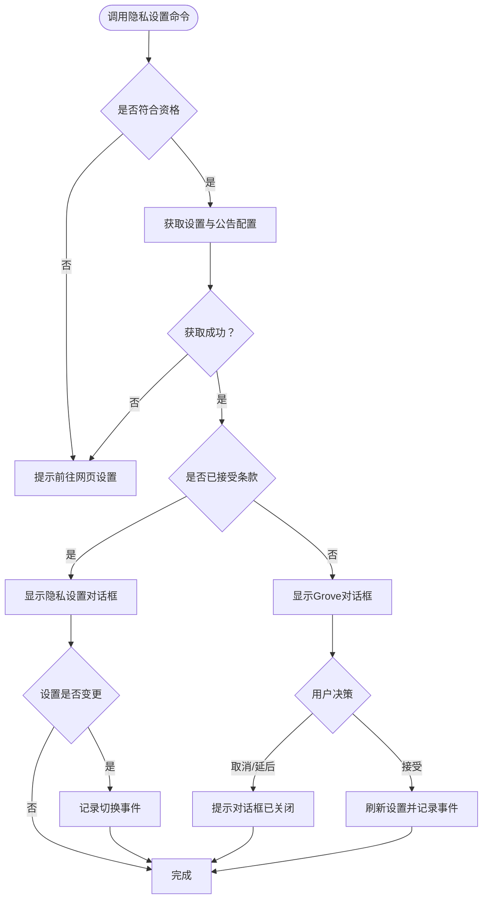
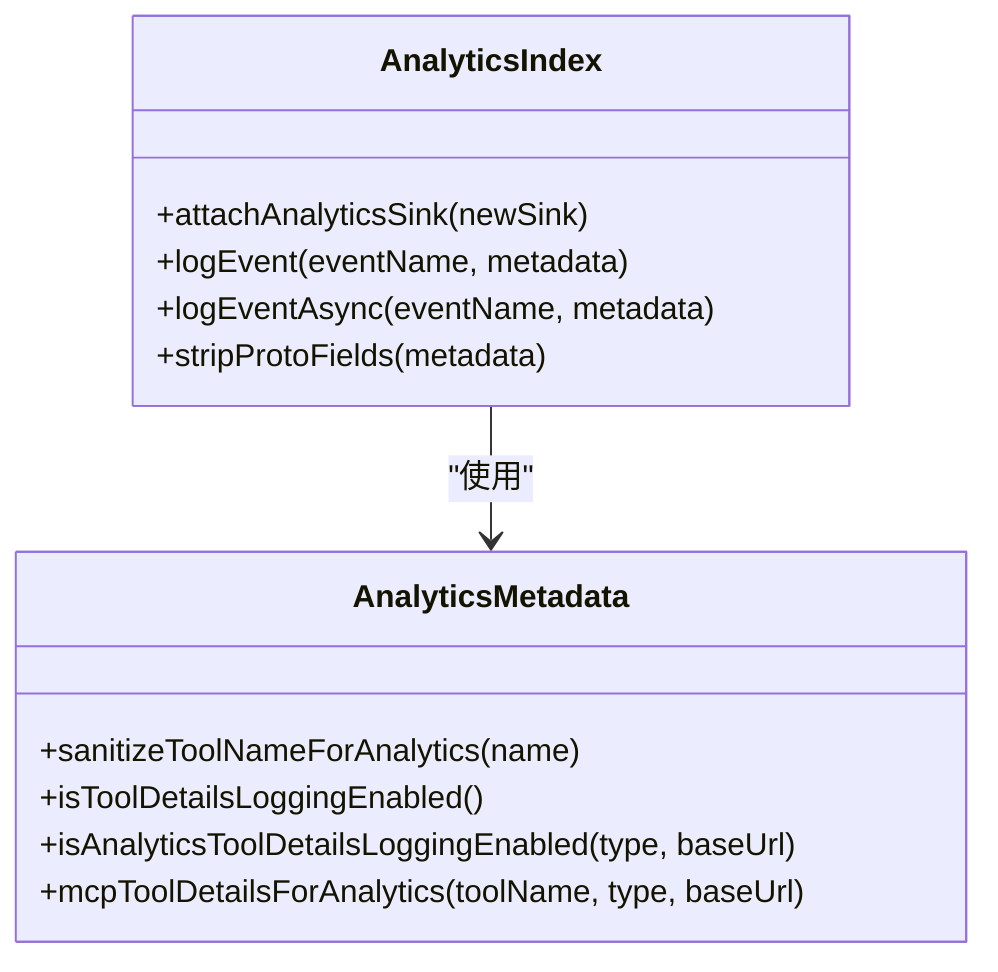
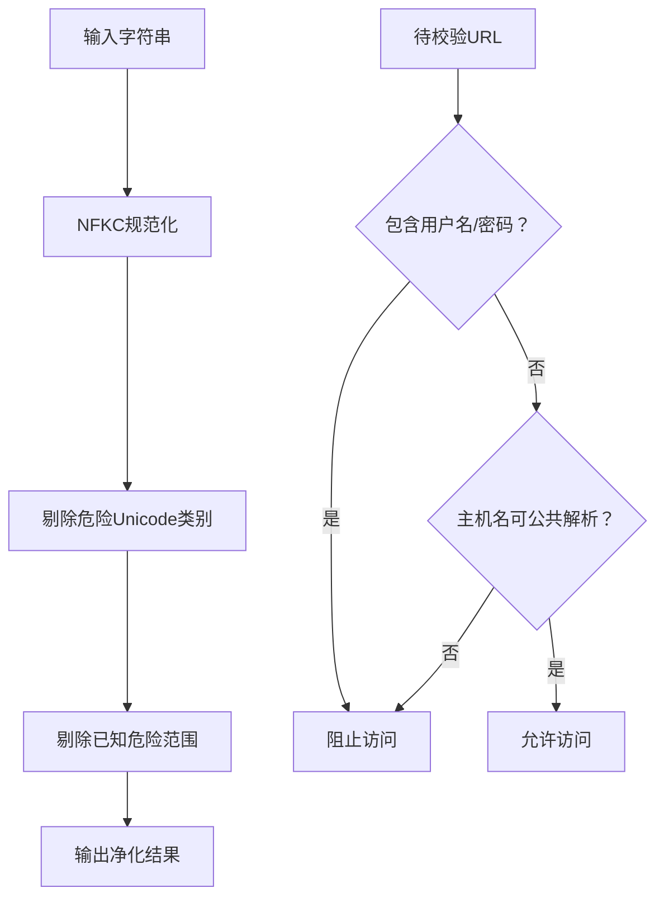
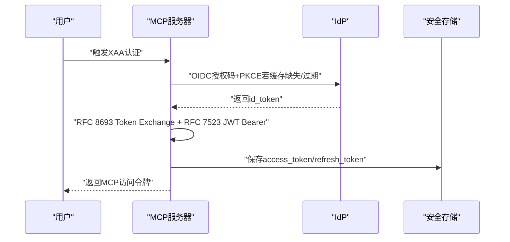
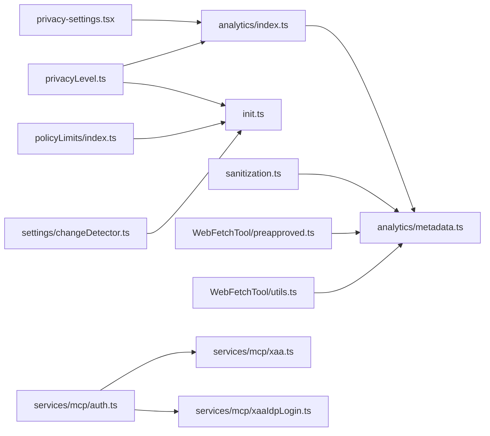

# 隐私保护与合规

<cite>
**本文引用的文件**
- [README.md](file://README.md)
- [README_CN.md](file://README_CN.md)
- [01-telemetry-and-privacy.md](file://docs/en/01-telemetry-and-privacy.md)
- [privacy-settings.tsx](file://src/commands/privacy-settings/privacy-settings.tsx)
- [privacyLevel.ts](file://src/utils/privacyLevel.ts)
- [index.ts](file://src/entrypoints/init.ts)
- [index.ts](file://src/services/analytics/index.ts)
- [metadata.ts](file://src/services/analytics/metadata.ts)
- [sanitization.ts](file://src/utils/sanitization.ts)
- [preapproved.ts](file://src/tools/WebFetchTool/preapproved.ts)
- [utils.ts](file://src/tools/WebFetchTool/utils.ts)
- [xaa.ts](file://src/services/mcp/xaa.ts)
- [auth.ts](file://src/services/mcp/auth.ts)
- [xaaIdpLogin.ts](file://src/services/mcp/xaaIdpLogin.ts)
- [filesApi.ts](file://src/services/api/filesApi.ts)
- [index.ts](file://src/services/policyLimits/index.ts)
- [changeDetector.ts](file://src/utils/settings/changeDetector.ts)
</cite>

## 目录
1. [引言](#引言)
2. [项目结构](#项目结构)
3. [核心组件](#核心组件)
4. [架构总览](#架构总览)
5. [详细组件分析](#详细组件分析)
6. [依赖关系分析](#依赖关系分析)
7. [性能考量](#性能考量)
8. [故障排查指南](#故障排查指南)
9. [结论](#结论)
10. [附录](#附录)

## 引言
本文件面向Claude Code隐私保护与合规系统，结合源码与官方分析文档，系统阐述数据最小化、匿名化处理、用户同意机制、合规性要求与法律框架、用户控制选项、敏感信息识别与过滤、PIA与风险缓解、数据保留与安全存储、跨境传输与第三方服务集成等主题。目标是帮助开发者与合规人员理解当前实现边界与改进方向。

## 项目结构
- 文档与分析：docs/en/01-telemetry-and-privacy.md 提供遥测与隐私的权威分析，涵盖数据管道、采集范围、不可退出性等关键事实。
- 隐私设置命令：src/commands/privacy-settings/privacy-settings.tsx 提供隐私设置对话框与引导，支持“帮助改进Claude”开关。
- 隐私等级工具：src/utils/privacyLevel.ts 提供环境变量驱动的隐私等级判定，支持essential-traffic与no-telemetry两种限制级别。
- 分析服务：src/services/analytics/index.ts 与 metadata.ts 提供事件日志公共API、PII标记字段剥离、工具名称匿名化、采样与队列机制。
- 安全与过滤：src/utils/sanitization.ts、src/tools/WebFetchTool/preapproved.ts、src/tools/WebFetchTool/utils.ts 提供Unicode净化、网络域白名单与URL合法性校验。
- MCP与XAA：src/services/mcp/xaa.ts、src/services/mcp/auth.ts、src/services/mcp/xaaIdpLogin.ts 提供跨应用访问（XAA/SEP-990）与IdP令牌缓存与安全存储。
- 文件API与数据保留：src/services/api/filesApi.ts 展示上传下载流程与大小校验；结合会话持久化与遥测磁盘重试策略形成数据保留特征。
- 策略与变更：src/services/policyLimits/index.ts 与 src/utils/settings/changeDetector.ts 提供策略拉取、缓存清理与配置变更检测。

图表来源
- [init.ts:240-268](file://src/entrypoints/init.ts#L240-L268)
- [privacy-settings.tsx:1-58](file://src/commands/privacy-settings/privacy-settings.tsx#L1-L58)
- [privacyLevel.ts:1-56](file://src/utils/privacyLevel.ts#L1-L56)
- [index.ts:1-174](file://src/services/analytics/index.ts#L1-L174)
- [metadata.ts:1-200](file://src/services/analytics/metadata.ts#L1-L200)
- [sanitization.ts:25-55](file://src/utils/sanitization.ts#L25-L55)
- [preapproved.ts:1-35](file://src/tools/WebFetchTool/preapproved.ts#L1-L35)
- [utils.ts:151-174](file://src/tools/WebFetchTool/utils.ts#L151-L174)
- [xaa.ts:1-29](file://src/services/mcp/xaa.ts#L1-L29)
- [auth.ts:641-670](file://src/services/mcp/auth.ts#L641-L670)
- [xaaIdpLogin.ts:78-194](file://src/services/mcp/xaaIdpLogin.ts#L78-L194)
- [index.ts:548-608](file://src/services/policyLimits/index.ts#L548-L608)
- [changeDetector.ts:339-375](file://src/utils/settings/changeDetector.ts#L339-L375)

章节来源
- [README.md:23-68](file://README.md#L23-L68)
- [README_CN.md:21-51](file://README_CN.md#L21-L51)

## 核心组件
- 隐私设置命令：提供隐私设置对话框与引导，支持“帮助改进Claude”开关，并记录切换事件。
- 隐私等级工具：通过环境变量判定no-telemetry与essential-traffic限制，影响遥测与非必要网络流量。
- 分析服务：统一事件日志入口，支持采样、队列、PII字段剥离、工具名称匿名化与动态配置。
- 安全与过滤：Unicode净化、网络域白名单、URL合法性校验，降低敏感信息泄露与滥用风险。
- MCP与XAA：实现企业级跨应用访问与IdP令牌缓存，确保凭据安全存储与复用。
- 策略与变更：策略拉取与缓存、配置变更检测，保障合规策略落地与审计。

章节来源
- [privacy-settings.tsx:1-58](file://src/commands/privacy-settings/privacy-settings.tsx#L1-L58)
- [privacyLevel.ts:1-56](file://src/utils/privacyLevel.ts#L1-L56)
- [index.ts:1-174](file://src/services/analytics/index.ts#L1-L174)
- [metadata.ts:44-116](file://src/services/analytics/metadata.ts#L44-L116)
- [sanitization.ts:25-55](file://src/utils/sanitization.ts#L25-L55)
- [preapproved.ts:1-35](file://src/tools/WebFetchTool/preapproved.ts#L1-L35)
- [utils.ts:151-174](file://src/tools/WebFetchTool/utils.ts#L151-L174)
- [auth.ts:641-670](file://src/services/mcp/auth.ts#L641-L670)
- [xaaIdpLogin.ts:78-194](file://src/services/mcp/xaaIdpLogin.ts#L78-L194)
- [index.ts:548-608](file://src/services/policyLimits/index.ts#L548-L608)
- [changeDetector.ts:339-375](file://src/utils/settings/changeDetector.ts#L339-L375)

## 架构总览
以下序列图展示“信任授予后遥测初始化”的关键流程，体现远程托管设置与环境变量的协同作用。

图表来源
- [init.ts:240-268](file://src/entrypoints/init.ts#L240-L268)
- [index.ts:95-123](file://src/services/analytics/index.ts#L95-L123)

## 详细组件分析

### 隐私设置与用户控制
- 隐私设置命令：根据资格判断显示隐私设置对话框或引导至网页设置；记录开关切换事件，便于审计。
- 隐私等级：通过环境变量决定no-telemetry与essential-traffic限制，提供“仅必要流量”与“禁用遥测”的控制路径。

图表来源
- [privacy-settings.tsx:7-57](file://src/commands/privacy-settings/privacy-settings.tsx#L7-L57)
- [privacyLevel.ts:20-44](file://src/utils/privacyLevel.ts#L20-L44)

章节来源
- [privacy-settings.tsx:1-58](file://src/commands/privacy-settings/privacy-settings.tsx#L1-L58)
- [privacyLevel.ts:1-56](file://src/utils/privacyLevel.ts#L1-L56)

### 遥测与数据分析服务
- 事件日志公共API：提供同步/异步事件记录、队列与采样、PII字段剥离、类型级安全标记。
- 元数据增强与匿名化：工具名称匿名化、MCP工具详情按条件放行、环境指纹与进程指标、用户追踪标识、文件扩展跟踪等。
- 不可退出性：第一方日志对直接API用户不可禁用；OTEL_LOG_TOOL_DETAILS=1可开启完整工具输入记录。

图表来源
- [index.ts:1-174](file://src/services/analytics/index.ts#L1-L174)
- [metadata.ts:44-167](file://src/services/analytics/metadata.ts#L44-L167)

章节来源
- [index.ts:1-174](file://src/services/analytics/index.ts#L1-L174)
- [metadata.ts:44-116](file://src/services/analytics/metadata.ts#L44-L116)
- [01-telemetry-and-privacy.md:88-125](file://docs/en/01-telemetry-and-privacy.md#L88-L125)

### 敏感信息识别与过滤
- Unicode净化：迭代NFKC规范化与危险Unicode类别/范围剔除，防止隐蔽格式字符与零宽字符。
- 网络域白名单：WebFetch仅允许预批准域名（代码相关），且仅GET请求，避免上传通道导致的数据外泄。
- URL合法性：禁止用户名/密码、内网/特权域、不可公共解析主机名等高风险URL。

图表来源
- [sanitization.ts:25-55](file://src/utils/sanitization.ts#L25-L55)
- [preapproved.ts:1-35](file://src/tools/WebFetchTool/preapproved.ts#L1-L35)
- [utils.ts:151-174](file://src/tools/WebFetchTool/utils.ts#L151-L174)

章节来源
- [sanitization.ts:25-55](file://src/utils/sanitization.ts#L25-L55)
- [preapproved.ts:1-35](file://src/tools/WebFetchTool/preapproved.ts#L1-L35)
- [utils.ts:151-174](file://src/tools/WebFetchTool/utils.ts#L151-L174)

### MCP与XAA（跨境与第三方集成）
- XAA/SEP-990：通过IdP id_token与RFC 8693+7523链路获取MCP访问令牌，避免浏览器同意屏幕，适合企业托管。
- IdP令牌缓存与安全存储：按issuer键入安全存储，分离IdP与MCP服务器AS密钥，支持过期缓冲与显式清除。
- 认证流程：严格错误可操作性，失败阶段明确，无静默回退。

图表来源
- [auth.ts:641-670](file://src/services/mcp/auth.ts#L641-L670)
- [auth.ts:1791-1824](file://src/services/mcp/auth.ts#L1791-L1824)
- [xaaIdpLogin.ts:78-194](file://src/services/mcp/xaaIdpLogin.ts#L78-L194)
- [xaa.ts:1-29](file://src/services/mcp/xaa.ts#L1-L29)

章节来源
- [auth.ts:641-670](file://src/services/mcp/auth.ts#L641-L670)
- [auth.ts:1791-1824](file://src/services/mcp/auth.ts#L1791-L1824)
- [xaaIdpLogin.ts:78-194](file://src/services/mcp/xaaIdpLogin.ts#L78-L194)
- [xaa.ts:1-29](file://src/services/mcp/xaa.ts#L1-L29)

### 数据保留与安全存储
- 遥测持久化：失败事件落盘重试，磁盘持久化与指数回退，确保数据不丢失。
- 文件API：上传前进行大小校验，避免TOCTOU竞争；下载统计与错误聚合。
- 安全存储：IdP令牌与客户端密钥按issuer键安全存储，支持显式清除。

章节来源
- [01-telemetry-and-privacy.md:11-27](file://docs/en/01-telemetry-and-privacy.md#L11-L27)
- [filesApi.ts:378-385](file://src/services/api/filesApi.ts#L378-L385)
- [xaaIdpLogin.ts:78-194](file://src/services/mcp/xaaIdpLogin.ts#L78-L194)

### 合规性与法律框架
- 法律框架：文档明确遥测与隐私分析，指出第一方日志不可退出、第三方共享至Datadog、工具输入细节开关等。
- 合规要点：匿名化与PII剥离、最小化采集、用户同意与控制、数据保留与删除、跨境传输（XAA）、第三方集成（MCP）。

章节来源
- [01-telemetry-and-privacy.md:1-125](file://docs/en/01-telemetry-and-privacy.md#L1-L125)
- [README_CN.md:44-51](file://README_CN.md#L44-L51)

## 依赖关系分析
- 组件耦合：隐私设置命令依赖分析服务与远程托管设置；隐私等级工具独立于UI，通过环境变量影响分析服务与网络行为。
- 外部依赖：MCP SDK、安全存储抽象、遥测导出器（1P与Datadog）。
- 潜在风险：OTEL_LOG_TOOL_DETAILS=1可绕过默认匿名化；远程托管设置可能影响初始化时机与遥测策略。

图表来源
- [privacy-settings.tsx:1-58](file://src/commands/privacy-settings/privacy-settings.tsx#L1-L58)
- [privacyLevel.ts:1-56](file://src/utils/privacyLevel.ts#L1-L56)
- [index.ts:1-174](file://src/services/analytics/index.ts#L1-L174)
- [metadata.ts:1-200](file://src/services/analytics/metadata.ts#L1-L200)
- [sanitization.ts:25-55](file://src/utils/sanitization.ts#L25-L55)
- [preapproved.ts:1-35](file://src/tools/WebFetchTool/preapproved.ts#L1-L35)
- [utils.ts:151-174](file://src/tools/WebFetchTool/utils.ts#L151-L174)
- [auth.ts:641-670](file://src/services/mcp/auth.ts#L641-L670)
- [xaa.ts:1-29](file://src/services/mcp/xaa.ts#L1-L29)
- [xaaIdpLogin.ts:78-194](file://src/services/mcp/xaaIdpLogin.ts#L78-L194)
- [index.ts:548-608](file://src/services/policyLimits/index.ts#L548-L608)
- [changeDetector.ts:339-375](file://src/utils/settings/changeDetector.ts#L339-L375)

## 性能考量
- 遥测批处理与重试：批量大小与回退策略平衡吞吐与可靠性。
- 事件队列：启动时事件排队，避免阻塞；采样减少带宽与存储压力。
- 网络限制：WebFetch白名单与URL校验降低无效请求与潜在攻击面。
- MCP认证：XAA链路避免浏览器交互，提升用户体验与安全性。

## 故障排查指南
- 遥测不可退出：确认是否为直接API用户（不可退出）；检查全局遥测禁用标志。
- 工具输入细节：OTEL_LOG_TOOL_DETAILS=1启用完整输入记录，注意PII风险。
- 隐私等级：essential-traffic仅禁用非必要网络；no-telemetry同时禁用遥测。
- 配置变更：策略拉取失败时继续运行（开窗）；检查缓存清理与重载。
- MCP/XAA：IdP令牌过期缓冲、客户端密钥安全存储、失败阶段明确。

章节来源
- [01-telemetry-and-privacy.md:88-125](file://docs/en/01-telemetry-and-privacy.md#L88-L125)
- [privacyLevel.ts:20-56](file://src/utils/privacyLevel.ts#L20-L56)
- [index.ts:548-608](file://src/services/policyLimits/index.ts#L548-L608)
- [xaaIdpLogin.ts:78-194](file://src/services/mcp/xaaIdpLogin.ts#L78-L194)

## 结论
Claude Code在隐私保护方面采取了多层设计：隐私设置命令与等级工具提供用户控制；分析服务通过匿名化、PII剥离与采样实现最小化采集；安全与过滤机制降低敏感信息泄露风险；MCP与XAA满足企业合规与跨境传输需求。但仍存在不可退出的第一方日志、工具输入细节开关等风险点，建议在后续版本中强化用户同意与透明度，并完善删除与访问权限的自动化实现。

## 附录
- 关键实现路径参考：
  - 隐私设置命令：[privacy-settings.tsx:1-58](file://src/commands/privacy-settings/privacy-settings.tsx#L1-L58)
  - 隐私等级判定：[privacyLevel.ts:1-56](file://src/utils/privacyLevel.ts#L1-L56)
  - 遥测初始化：[init.ts:240-268](file://src/entrypoints/init.ts#L240-L268)
  - 分析服务API：[index.ts:1-174](file://src/services/analytics/index.ts#L1-L174)
  - 元数据增强与匿名化：[metadata.ts:44-167](file://src/services/analytics/metadata.ts#L44-L167)
  - Unicode净化：[sanitization.ts:25-55](file://src/utils/sanitization.ts#L25-L55)
  - WebFetch白名单与URL校验：[preapproved.ts:1-35](file://src/tools/WebFetchTool/preapproved.ts#L1-L35)、[utils.ts:151-174](file://src/tools/WebFetchTool/utils.ts#L151-L174)
  - MCP/XAA认证与IdP令牌缓存：[auth.ts:641-670](file://src/services/mcp/auth.ts#L641-L670)、[auth.ts:1791-1824](file://src/services/mcp/auth.ts#L1791-L1824)、[xaaIdpLogin.ts:78-194](file://src/services/mcp/xaaIdpLogin.ts#L78-L194)
  - 策略拉取与缓存：[index.ts:548-608](file://src/services/policyLimits/index.ts#L548-L608)
  - 配置变更检测：[changeDetector.ts:339-375](file://src/utils/settings/changeDetector.ts#L339-L375)