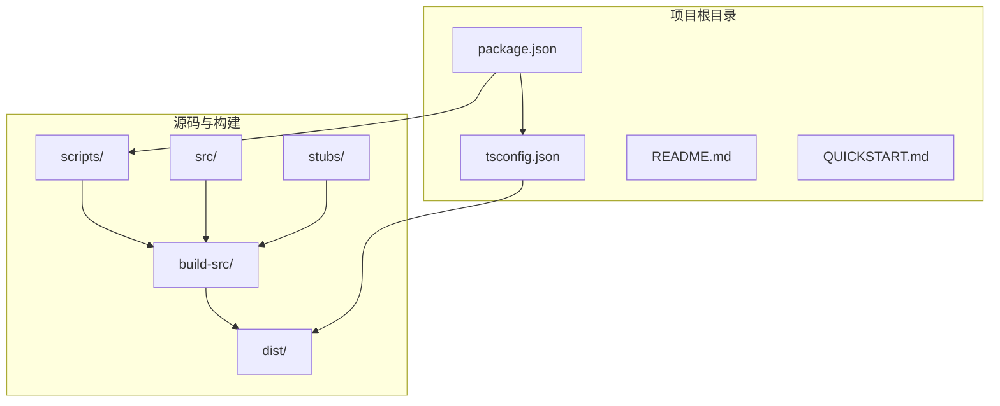
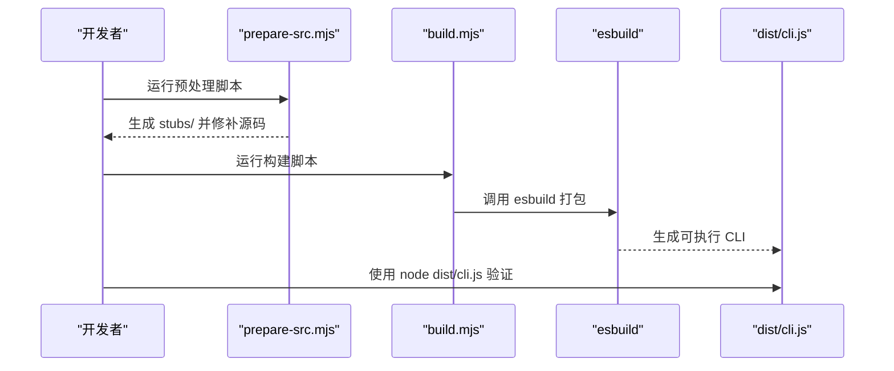

# 依赖安装

<cite>
**本文引用的文件列表**
- [package.json](file://package.json)
- [tsconfig.json](file://tsconfig.json)
- [QUICKSTART.md](file://QUICKSTART.md)
- [README.md](file://README.md)
- [scripts/build.mjs](file://scripts/build.mjs)
- [scripts/prepare-src.mjs](file://scripts/prepare-src.mjs)
- [scripts/transform.mjs](file://scripts/transform.mjs)
- [scripts/stub-modules.mjs](file://scripts/stub-modules.mjs)
- [stubs/bun-bundle.ts](file://stubs/bun-bundle.ts)
- [stubs/macros.ts](file://stubs/macros.ts)
- [stubs/global.d.ts](file://stubs/global.d.ts)
- [package-lock.json](file://package-lock.json)
</cite>

## 目录
1. [简介](#简介)
2. [项目结构与依赖关系概览](#项目结构与依赖关系概览)
3. [核心组件与依赖清单](#核心组件与依赖清单)
4. [架构总览](#架构总览)
5. [详细安装步骤与配置](#详细安装步骤与配置)
6. [依赖类型与作用域](#依赖类型与作用域)
7. [构建工具与编译器](#构建工具与编译器)
8. [故障排除指南](#故障排除指南)
9. [验证与功能测试](#验证与功能测试)
10. [包管理器对比与选择建议](#包管理器对比与选择建议)
11. [结论](#结论)

## 简介
本指南面向希望从源码构建或验证 Claude Code 的开发者，系统讲解 Node.js 与 npm/yarn/pnpm 的安装与配置；区分生产依赖与开发依赖；说明 esbuild 与 TypeScript 编译器的安装与版本管理；介绍项目特有的依赖（如 esbuild、@commander-js/extra-typings 等）；并提供 Bun 作为构建工具的安装与配置方法。同时给出常见问题的故障排除方案、依赖安装正确性的验证方式，以及不同包管理器的选择建议。

## 项目结构与依赖关系概览
该项目采用“源码 + 构建脚本 + 类型声明”的组织方式：
- 源码位于 src/，包含大量 TypeScript/TSX 文件
- 构建脚本位于 scripts/，负责预处理、转换与打包
- 类型与运行时内联宏定义位于 stubs/，用于在非 Bun 环境下模拟 Bun 特性
- TypeScript 配置位于 tsconfig.json，定义编译目标、模块解析策略与路径映射
- 包管理与脚本定义位于 package.json，声明引擎要求与开发依赖

图表来源
- [package.json](file://package.json)
- [tsconfig.json](file://tsconfig.json)
- [scripts/build.mjs](file://scripts/build.mjs)
- [scripts/prepare-src.mjs](file://scripts/prepare-src.mjs)
- [stubs/bun-bundle.ts](file://stubs/bun-bundle.ts)

章节来源
- [package.json](file://package.json)
- [tsconfig.json](file://tsconfig.json)
- [QUICKSTART.md](file://QUICKSTART.md)
- [README.md](file://README.md)

## 核心组件与依赖清单
- Node.js 引擎：要求版本 ≥ 18（由 engines 字段约束）
- 开发依赖（devDependencies）：
  - esbuild：用于打包 CLI 输出
  - typescript：用于类型检查与编译
- 生产依赖：未在当前仓库中显式列出，但构建脚本会通过 esbuild 外部化处理
- 项目特有依赖与工具：
  - bun:bundle、bun:ffi（通过 stubs/ 提供的桩文件模拟）
  - 全局宏常量 MACRO（通过入口包装注入）

章节来源
- [package.json](file://package.json)
- [tsconfig.json](file://tsconfig.json)
- [scripts/build.mjs](file://scripts/build.mjs)
- [scripts/prepare-src.mjs](file://scripts/prepare-src.mjs)
- [stubs/bun-bundle.ts](file://stubs/bun-bundle.ts)
- [stubs/macros.ts](file://stubs/macros.ts)

## 架构总览
从源码到可执行 CLI 的关键流程如下：
- 预处理：将 Bun 特性（feature、bun:bundle、MACRO）替换为可运行的等价物
- 转换：扫描并修复导入语句，生成入口包装以注入全局宏
- 打包：使用 esbuild 将入口与依赖打包为单文件 CLI
- 运行：dist/cli.js 可直接由 Node 运行

图表来源
- [scripts/prepare-src.mjs](file://scripts/prepare-src.mjs)
- [scripts/build.mjs](file://scripts/build.mjs)
- [package.json](file://package.json)

## 详细安装步骤与配置

### 1) 安装与配置 Node.js
- 要求：Node.js 版本 ≥ 18（由 engines 字段约束）
- 安装方式（任选其一）：
  - 使用官方安装包或包管理器安装
  - 使用 nvm（推荐）安装并切换到指定版本
- 验证：执行 node --version，确保输出满足 ≥ 18 的要求

章节来源
- [package.json](file://package.json)

### 2) 安装与配置 npm
- 安装：随 Node.js 附带 npm，无需额外安装
- 建议：升级到较新版本（例如 ≥ 9），以获得更好的依赖解析与性能
- 验证：执行 npm --version

章节来源
- [QUICKSTART.md](file://QUICKSTART.md)

### 3) 安装与配置 yarn/pnpm
- yarn：安装后可使用 yarn 或 yarnpkg 命令
- pnpm：安装后可使用 pnpm 命令
- 注意：本项目使用 npm 脚本与 esbuild 调用 npx，因此 yarn/pnpm 可直接使用 npx 语法调用 esbuild

章节来源
- [QUICKSTART.md](file://QUICKSTART.md)

### 4) 安装与配置 Bun（可选，用于完整重建）
- 安装：参考官方安装脚本
- 用途：原生支持 Bun 特性（如 feature()、bun:bundle、bun:ffi），可进行完整重建
- 注意：本仓库发布的源码包含 Bun 特性，需 Bun 环境才能完全复现

章节来源
- [QUICKSTART.md](file://QUICKSTART.md)
- [README.md](file://README.md)

### 5) 安装 TypeScript 编译器与版本管理
- 安装：项目声明 typescript 为开发依赖，可通过 npm/yarn/pnpm 安装
- 版本：当前仓库锁定版本为 ^6.0.2
- 使用：通过 tsc --noEmit 进行类型检查；tsconfig.json 定义了编译目标与路径映射

章节来源
- [package.json](file://package.json)
- [tsconfig.json](file://tsconfig.json)

### 6) 安装 esbuild 与相关工具
- 安装：项目声明 esbuild 为开发依赖，可通过 npm/yarn/pnpm 安装
- 使用：构建脚本通过 npx esbuild 调用打包；若本地未安装，脚本会自动安装
- 版本：当前仓库锁定版本为 ^0.27.4

章节来源
- [package.json](file://package.json)
- [scripts/build.mjs](file://scripts/build.mjs)
- [scripts/transform.mjs](file://scripts/transform.mjs)
- [package-lock.json](file://package-lock.json)

### 7) 安装项目依赖（生产与开发）
- 生产依赖：本仓库未显式列出生产依赖，构建脚本通过 esbuild 外部化处理
- 开发依赖：esbuild、typescript（由 package.json 声明）
- 安装命令示例（以 npm 为例）：
  - npm install --save-dev esbuild typescript
  - npm install
- 验证：安装完成后，执行 npm run check 或 npm run build 验证

章节来源
- [package.json](file://package.json)
- [scripts/build.mjs](file://scripts/build.mjs)

### 8) 预处理与转换（非 Bun 环境下的必要步骤）
- prepare-src.mjs：将 bun:bundle 导入替换为 stubs，并注入 MACRO 常量
- transform.mjs：生成入口包装并注入全局 MACRO
- build.mjs：复制源码、执行转换、迭代创建桩文件并打包

章节来源
- [scripts/prepare-src.mjs](file://scripts/prepare-src.mjs)
- [scripts/transform.mjs](file://scripts/transform.mjs)
- [scripts/build.mjs](file://scripts/build.mjs)
- [stubs/bun-bundle.ts](file://stubs/bun-bundle.ts)
- [stubs/macros.ts](file://stubs/macros.ts)
- [stubs/global.d.ts](file://stubs/global.d.ts)

## 依赖类型与作用域
- 开发依赖（devDependencies）
  - esbuild：打包工具
  - typescript：类型检查与编译
- 生产依赖（本仓库未显式列出）
  - 通过 esbuild 外部化处理，不打入最终产物
- 项目特有依赖
  - bun:bundle、bun:ffi：通过 stubs/ 提供桩文件
  - MACRO：通过入口包装注入全局变量

章节来源
- [package.json](file://package.json)
- [scripts/build.mjs](file://scripts/build.mjs)
- [stubs/bun-bundle.ts](file://stubs/bun-bundle.ts)
- [stubs/macros.ts](file://stubs/macros.ts)

## 构建工具与编译器
- esbuild
  - 作用：将 TypeScript/JS 源码打包为单文件 CLI
  - 特性：快速、零配置、支持 sourcemap
  - 限制：无法完全还原 Bun 的 compile-time intrinsics（如 feature()）
- TypeScript 编译器
  - 作用：类型检查与编译
  - 配置：tsconfig.json 指定目标、模块解析、路径映射与输出目录

章节来源
- [scripts/build.mjs](file://scripts/build.mjs)
- [scripts/transform.mjs](file://scripts/transform.mjs)
- [tsconfig.json](file://tsconfig.json)

## 故障排除指南
- 版本冲突
  - 现象：esbuild 或 TypeScript 报错
  - 解决：统一使用与仓库锁定版本一致的工具版本；优先使用 npx esbuild/typescript
- 网络问题
  - 现象：安装依赖失败
  - 解决：配置 npm/yarn/pnpm 的镜像源；或使用离线缓存
- 权限错误
  - 现象：安装失败或写入失败
  - 解决：避免使用 sudo；检查目录权限；使用全局安装前确认环境
- Bun 特性缺失导致的打包失败
  - 现象：缺少 bun:bundle、bun:ffi 或 feature() 分支被误打包
  - 解决：运行 prepare-src.mjs 与 build.mjs；根据提示创建缺失的桩文件；必要时改用 Bun 环境进行完整重建

章节来源
- [QUICKSTART.md](file://QUICKSTART.md)
- [scripts/build.mjs](file://scripts/build.mjs)
- [scripts/transform.mjs](file://scripts/transform.mjs)

## 验证与功能测试
- 版本检查
  - Node.js：node --version
  - npm：npm --version
  - TypeScript：tsc --version
  - esbuild：npx esbuild --version
- 功能测试
  - 类型检查：npm run check
  - 构建：npm run build
  - 运行：node dist/cli.js --version
- 交互式验证
  - 非交互模式：node dist/cli.js -p "Hello Claude"
  - 登录认证：按 QUICKSTART 文档指引设置密钥或登录

章节来源
- [package.json](file://package.json)
- [QUICKSTART.md](file://QUICKSTART.md)

## 包管理器对比与选择建议
- npm
  - 优点：默认随 Node.js 安装，生态成熟，npx esbuild 调用稳定
  - 适用：本项目默认脚本与依赖均基于 npm
- yarn
  - 优点：安装速度快，缓存友好
  - 适用：可直接使用 npx esbuild；注意与 npm 的锁文件互换性
- pnpm
  - 优点：磁盘占用小，链接依赖
  - 适用：可直接使用 npx esbuild；注意与 npm 的锁文件互换性
- 选择建议
  - 若追求一致性与最小化问题，优先使用 npm
  - 若团队已有 yarn/pnpm 工作流，可继续使用，但需确保 npx esbuild 可用

章节来源
- [QUICKSTART.md](file://QUICKSTART.md)
- [package.json](file://package.json)

## 结论
本指南围绕 Claude Code 源码构建所需的依赖安装与配置提供了系统化的步骤与建议。对于仅需运行 CLI 的场景，可直接使用已发布的 dist/cli.js；若需要从源码构建，请先满足 Node.js ≥ 18 的要求，安装 esbuild 与 TypeScript，并按脚本顺序执行预处理与构建。遇到 Bun 特性缺失导致的问题，可按脚本提示创建桩文件，或在具备 Bun 环境时进行完整重建。