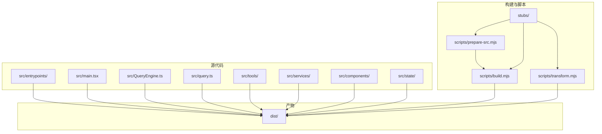
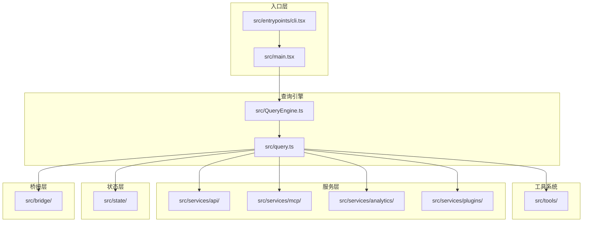
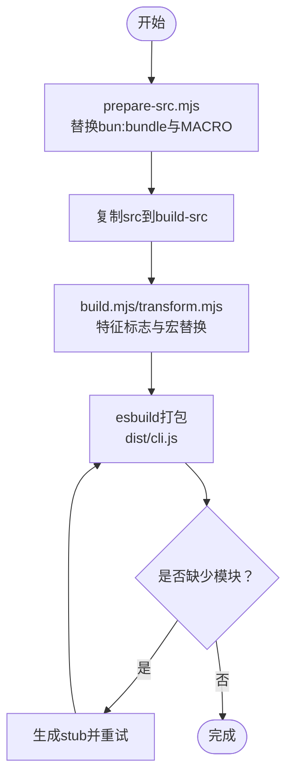
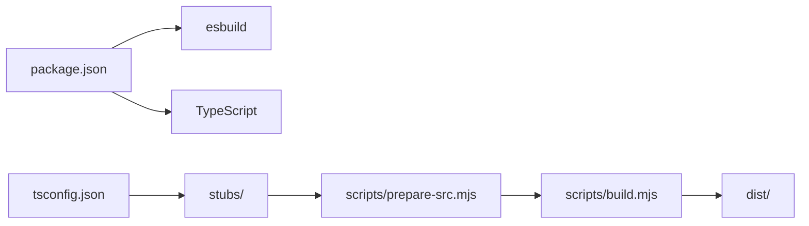

# 开发工作流

<cite>
**本文引用的文件**
- [package.json](file://package.json)
- [README.md](file://README.md)
- [QUICKSTART.md](file://QUICKSTART.md)
- [tsconfig.json](file://tsconfig.json)
- [scripts/build.mjs](file://scripts/build.mjs)
- [scripts/prepare-src.mjs](file://scripts/prepare-src.mjs)
- [scripts/transform.mjs](file://scripts/transform.mjs)
</cite>

## 目录
1. [简介](#简介)
2. [项目结构](#项目结构)
3. [核心组件](#核心组件)
4. [架构总览](#架构总览)
5. [详细组件分析](#详细组件分析)
6. [依赖分析](#依赖分析)
7. [性能考虑](#性能考虑)
8. [故障排查指南](#故障排查指南)
9. [结论](#结论)
10. [附录](#附录)

## 简介
本指南面向Claude Code项目的日常开发与维护工作，围绕以下目标展开：  
- 日常开发流程：代码编辑、保存、自动构建、热重载（或替代方案）  
- 调试方法与工具：Node.js调试器、浏览器开发者工具、日志输出  
- 代码质量保证：TypeScript类型检查、代码格式化、静态分析  
- 测试流程与最佳实践：单元测试、集成测试、端到端测试的组织与执行  
- 版本控制工作流：分支策略、提交规范、合并流程  
- 开发效率提升：快捷键、自动化脚本、开发环境优化  
- 常见问题与解决方案  

本项目以TypeScript为主，采用esbuild进行打包，源码经由脚本完成预处理与转换，以适配非Bun运行时的编译需求。

章节来源
- [README.md:1-120](file://README.md#L1-L120)

## 项目结构
仓库采用按功能域分层的目录组织方式，核心模块包括：  
- 入口与主程序：src/entrypoints、src/main.tsx、src/QueryEngine.ts、src/query.ts  
- 组件与UI：src/components、src/hooks、src/state  
- 工具系统：src/tools、src/tasks、src/commands  
- 服务层：src/services、src/utils  
- 构建与脚本：scripts/（prepare-src.mjs、build.mjs、transform.mjs）、stubs/（bun:bundle、macros、global.d.ts）  
- 文档与多语言：docs/（英文、日文、韩文、中文）

图表来源
- [README.md:250-380](file://README.md#L250-L380)
- [scripts/build.mjs:1-246](file://scripts/build.mjs#L1-L246)
- [scripts/prepare-src.mjs:1-116](file://scripts/prepare-src.mjs#L1-L116)
- [scripts/transform.mjs:1-144](file://scripts/transform.mjs#L1-L144)

章节来源
- [README.md:250-380](file://README.md#L250-L380)

## 核心组件
- 入口与生命周期
  - CLI入口：src/entrypoints/cli.tsx
  - REPL引导：src/main.tsx
  - 查询引擎：src/QueryEngine.ts、src/query.ts（主循环与工具执行）
- 工具系统：src/tools/（40+内置工具，如BashTool、FileReadTool、FileEditTool、WebFetchTool、MCPTool等）
- 服务层：src/services/（API客户端、分析与遥测、MCP管理、插件加载、设置同步等）
- 状态与UI：src/state/（应用状态存储与上下文）、src/components/（React/Ink终端UI）
- 构建与脚本：scripts/（准备源码、esbuild打包、转换宏与特性标志）、stubs/（bun:bundle、MACRO类型声明等）

章节来源
- [README.md:250-380](file://README.md#L250-L380)

## 架构总览
下图展示从入口到查询引擎、工具系统、服务层与桥接层的整体交互关系。

图表来源
- [README.md:383-445](file://README.md#L383-L445)

章节来源
- [README.md:383-445](file://README.md#L383-L445)

## 详细组件分析

### 构建与打包流程
- 预处理阶段（prepare-src.mjs）
  - 将bun:bundle导入替换为本地stub
  - 将MACRO.X宏替换为字符串字面量
  - 生成全局类型声明与bun-ffi stub
- 打包阶段（build.mjs）
  - 复制src至build-src，迭代式替换feature()为false、注入MACRO全局
  - 使用esbuild进行打包，遇到缺失模块则自动生成stub并重试（最多5轮）
  - 输出dist/cli.js（含sourcemap）
- 替代方案（transform.mjs）
  - 直接在build-src上进行导入替换与入口包装，再调用esbuild

图表来源
- [scripts/prepare-src.mjs:1-116](file://scripts/prepare-src.mjs#L1-L116)
- [scripts/build.mjs:1-246](file://scripts/build.mjs#L1-L246)
- [scripts/transform.mjs:1-144](file://scripts/transform.mjs#L1-L144)

章节来源
- [scripts/prepare-src.mjs:1-116](file://scripts/prepare-src.mjs#L1-L116)
- [scripts/build.mjs:1-246](file://scripts/build.mjs#L1-L246)
- [scripts/transform.mjs:1-144](file://scripts/transform.mjs#L1-L144)
- [QUICKSTART.md:47-87](file://QUICKSTART.md#L47-L87)

### 类型检查与编译配置
- TypeScript配置（tsconfig.json）
  - 目标与模块：ES2022 + ESNext + bundler解析
  - JSX：react-jsx
  - 路径映射：bun:bundle → stubs/bun-bundle.ts
  - 严格性：关闭严格模式（strict: false），跳过库检查（skipLibCheck: true）
  - 输出：dist，根目录src
- 类型检查命令：npm run check（基于tsc --noEmit）

章节来源
- [tsconfig.json:1-37](file://tsconfig.json#L1-L37)
- [package.json:7-12](file://package.json#L7-L12)

### 调试方法与工具
- Node.js调试器
  - 使用Node的inspect能力启动CLI：node --inspect-brk dist/cli.js
  - 在浏览器或VS Code中连接调试器
- 浏览器开发者工具
  - 若涉及桌面/浏览器桥接场景，可在对应页面打开开发者工具查看网络、控制台与性能
- 日志输出
  - 通过CLI参数或环境变量启用详细日志（参考各服务模块的日志开关）
  - 结合sourcemap定位源码行号

章节来源
- [README.md:728-776](file://README.md#L728-L776)

### 代码质量保证
- TypeScript类型检查
  - 使用tsc --noEmit进行全量类型检查
  - 严格模式关闭，但可通过局部调整提升覆盖率
- 代码格式化
  - 建议配合prettier或editorconfig统一风格
- 静态分析
  - 可结合eslint/tslint（如存在）对复杂表达式与潜在问题进行扫描

章节来源
- [package.json:10-10](file://package.json#L10-L10)
- [tsconfig.json:8-16](file://tsconfig.json#L8-L16)

### 测试流程与最佳实践
- 单元测试
  - 针对工具与服务层的纯函数与规则逻辑编写测试
  - 使用最小化依赖的测试框架（如vitest/jest），隔离I/O与外部服务
- 集成测试
  - 覆盖工具执行链路与权限校验流程
  - 使用内存或临时文件系统模拟真实场景
- 端到端测试
  - 通过CLI封装测试输入，断言输出与会话持久化
  - 对桥接与MCP协议场景，使用mock服务器或容器化环境
- 组织与执行
  - 将测试文件置于对应模块目录或tests/目录
  - 使用npm脚本统一执行：npm test 或自定义脚本

章节来源
- [README.md:500-563](file://README.md#L500-L563)

### 版本控制工作流
- 分支策略
  - 主分支：release/2.x 或 main（依据团队约定）
  - 功能分支：feature/xxx
  - 修复分支：fix/xxx
- 提交规范
  - 建议采用约定式提交（feat/fix/docs/chore/style/refactor/test/build/ci）
- 合并流程
  - Pull Request审查后合并，确保类型检查与关键测试通过

章节来源
- [README.md:500-563](file://README.md#L500-L563)

### 开发效率提升
- 快捷键与编辑器
  - VS Code：启用TypeScript自动提示、路径智能感知、格式化快捷键
- 自动化脚本
  - 使用npm scripts快速执行构建、类型检查与运行
  - 在CI中缓存node_modules与dist，加速二次构建
- 开发环境优化
  - 启用TypeScript增量编译（tsc --watch）
  - 使用esbuild进行快速打包预览（仅开发阶段）

章节来源
- [package.json:7-12](file://package.json#L7-L12)
- [tsconfig.json:1-37](file://tsconfig.json#L1-L37)

## 依赖分析
- 运行时要求：Node.js >= 18
- 构建依赖：esbuild、TypeScript
- 关键外部模块：bun:bundle、bun:ffi（通过stubs替代）
- 内部依赖：src/路径映射至stubs/以支持bun特定宏与特性标志

图表来源
- [package.json:13-20](file://package.json#L13-L20)
- [tsconfig.json:19-26](file://tsconfig.json#L19-L26)
- [scripts/prepare-src.mjs:1-116](file://scripts/prepare-src.mjs#L1-L116)
- [scripts/build.mjs:1-246](file://scripts/build.mjs#L1-L246)

章节来源
- [package.json:13-20](file://package.json#L13-L20)
- [tsconfig.json:19-26](file://tsconfig.json#L19-L26)

## 性能考虑
- 构建性能
  - 使用esbuild进行快速打包；在开发阶段可先不生成sourcemap
  - 通过迭代stub策略减少多次失败重试
- 运行性能
  - 合理使用上下文压缩与历史修剪，避免消息过多导致延迟
  - 工具并发安全与串行限制需明确标注，避免阻塞

章节来源
- [README.md:650-690](file://README.md#L650-L690)

## 故障排查指南
- 构建失败：缺少模块
  - 现象：esbuild报“Could not resolve”错误
  - 处理：根据错误信息在build-src/src/创建stub文件（JS/TS导出空函数或空对象，文本资源创建空文件），然后重新构建
- 宏与特性标志问题
  - 现象：feature('FLAG')在esbuild中仍被解析为require
  - 处理：确认prepare-src.mjs已将bun:bundle导入替换为stub，并在build.mjs/transform.mjs中将feature()替换为false
- bun:ffi相关错误
  - 现象：运行时报错找不到bun:ffi
  - 处理：确保stubs/bun-ffi.ts存在，或在打包时external该模块
- 版本与反馈渠道
  - 如遇问题，可参考反馈渠道与问题解释链接（来自MACRO常量）

章节来源
- [scripts/build.mjs:144-246](file://scripts/build.mjs#L144-L246)
- [scripts/prepare-src.mjs:93-116](file://scripts/prepare-src.mjs#L93-L116)
- [scripts/transform.mjs:111-144](file://scripts/transform.mjs#L111-L144)
- [QUICKSTART.md:58-87](file://QUICKSTART.md#L58-L87)

## 结论
本指南总结了Claude Code项目的开发工作流：从源码准备、构建打包到调试与质量保障，覆盖了日常开发的关键环节。由于源码包含大量Bun编译期特性，推荐优先使用提供的脚本完成最佳努力构建，并在需要时手动补充缺失模块的stub。通过规范化的测试与版本控制流程，可有效提升团队协作效率与代码质量。

## 附录
- 快速开始（预构建CLI）
  - 直接运行已编译的cli.js或安装后使用claude命令
- 最佳努力构建
  - 安装esbuild后执行scripts/build.mjs，若仍有缺失模块，按提示创建stub并重试
- 全重建（需要Bun）
  - 使用Bun的编译期特性与内建宏进行完整构建（需内部访问）

章节来源
- [QUICKSTART.md:1-122](file://QUICKSTART.md#L1-L122)
- [README.md:1-120](file://README.md#L1-L120)