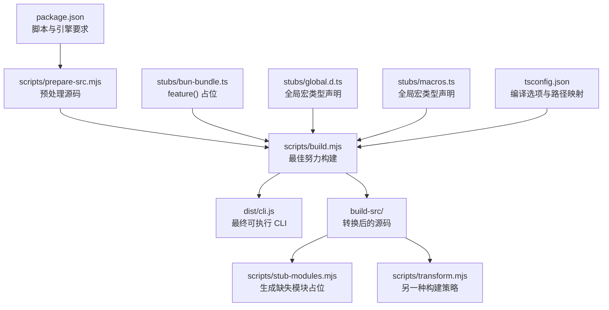
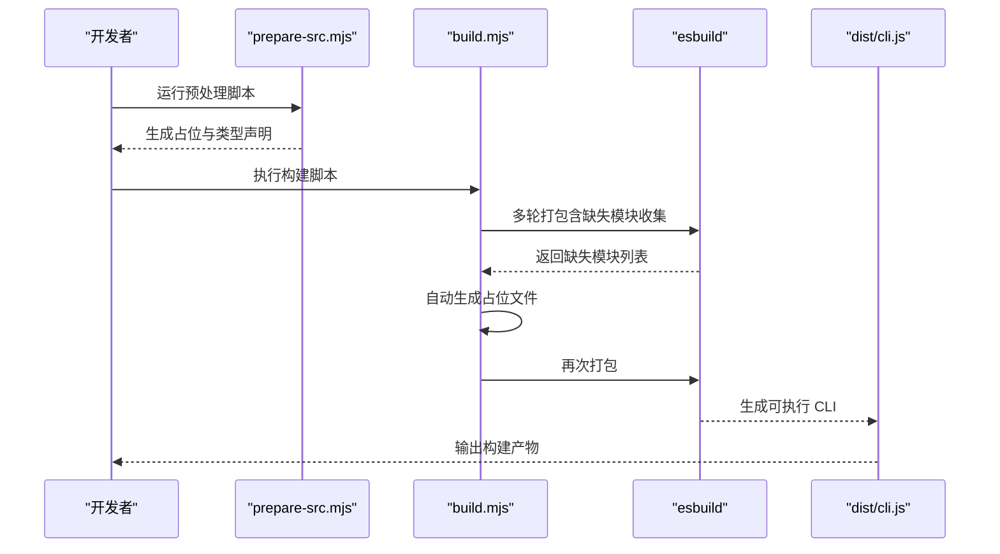
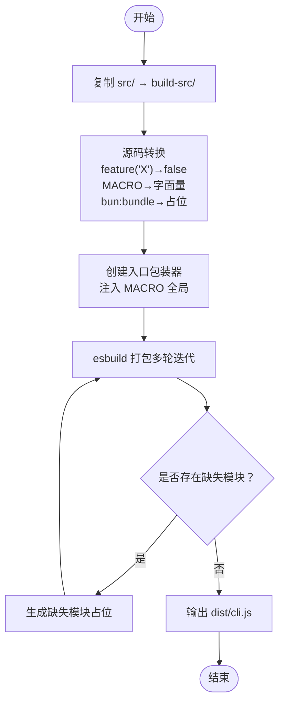
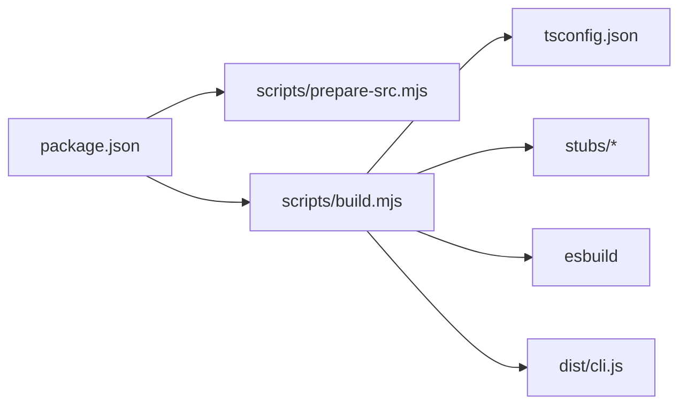

# 开发环境

<cite>
**本文引用的文件**
- [package.json](file://package.json)
- [tsconfig.json](file://tsconfig.json)
- [QUICKSTART.md](file://QUICKSTART.md)
- [README.md](file://README.md)
- [scripts/build.mjs](file://scripts/build.mjs)
- [scripts/prepare-src.mjs](file://scripts/prepare-src.mjs)
- [scripts/transform.mjs](file://scripts/transform.mjs)
- [scripts/stub-modules.mjs](file://scripts/stub-modules.mjs)
- [stubs/bun-bundle.ts](file://stubs/bun-bundle.ts)
- [stubs/global.d.ts](file://stubs/global.d.ts)
- [stubs/macros.ts](file://stubs/macros.ts)
</cite>

## 目录
1. [简介](#简介)
2. [项目结构](#项目结构)
3. [核心组件](#核心组件)
4. [架构总览](#架构总览)
5. [详细组件分析](#详细组件分析)
6. [依赖关系分析](#依赖关系分析)
7. [性能考虑](#性能考虑)
8. [故障排除指南](#故障排除指南)
9. [结论](#结论)
10. [附录](#附录)

## 简介
本指南面向希望在本地搭建并开发 Claude Code v2.1.88 的工程师，涵盖系统要求、工具安装与配置、构建系统（esbuild + TypeScript）、开发工作流（编辑、调试、测试、打包）、脚本命令与自动化工具，以及常见问题排查与性能优化建议。  
项目特点：源码包含约 1884 个 TypeScript 文件与大量内置工具、权限系统、MCP 协议集成与会话持久化等复杂模块；由于使用了 Bun 编译期内建特性（如 feature()、MACRO 宏、bun:bundle），直接用 Node/TypeScript 构建存在“最佳努力”限制，需要通过脚本进行源码转换与占位补丁。

## 项目结构
- 核心目录
  - src/：TypeScript 源码（入口、查询引擎、工具、服务、状态、组件等）
  - scripts/：构建与准备脚本（build、prepare-src、transform、stub-modules）
  - stubs/：Bun 编译期内建特性的类型与运行时占位（bun-bundle、global.d.ts、macros）
  - dist/：构建输出（单文件 CLI）
  - build-src/：构建前的源码副本（经转换后）
- 关键文件
  - package.json：脚本命令、Node 引擎要求、开发依赖（esbuild、typescript）
  - tsconfig.json：TypeScript 编译选项（目标、模块、路径映射、声明、sourceMap 等）

**图表来源**
- [package.json:7-19](file://package.json#L7-L19)
- [scripts/prepare-src.mjs:1-116](file://scripts/prepare-src.mjs#L1-L116)
- [scripts/build.mjs:1-246](file://scripts/build.mjs#L1-L246)
- [scripts/stub-modules.mjs:1-159](file://scripts/stub-modules.mjs#L1-L159)
- [scripts/transform.mjs:1-144](file://scripts/transform.mjs#L1-L144)
- [stubs/bun-bundle.ts:1-5](file://stubs/bun-bundle.ts#L1-L5)
- [stubs/global.d.ts:1-11](file://stubs/global.d.ts#L1-L11)
- [stubs/macros.ts:1-21](file://stubs/macros.ts#L1-L21)
- [tsconfig.json:1-37](file://tsconfig.json#L1-L37)

**章节来源**
- [package.json:1-21](file://package.json#L1-L21)
- [tsconfig.json:1-37](file://tsconfig.json#L1-L37)
- [QUICKSTART.md:1-122](file://QUICKSTART.md#L1-L122)

## 核心组件
- 构建脚本与策略
  - prepare-src.mjs：替换 bun:bundle 导入、注入 MACRO 常量、生成类型声明，使源码可在非 Bun 环境下编译
  - build.mjs：复制源码 → 多轮 esbuild 打包 → 自动创建缺失模块占位 → 输出 dist/cli.js
  - transform.mjs：另一种构建思路（直接注入 MACRO 全局）并通过 esbuild 打包
  - stub-modules.mjs：解析 esbuild 报错中的缺失模块，自动生成占位文件
- 编译配置
  - tsconfig.json：目标 ES2022、模块系统 ESNext、bundler 解析、React JSX、输出到 dist、路径别名等
- 运行时占位
  - bun-bundle.ts：feature(flag) 占位返回 false
  - global.d.ts / macros.ts：MACRO 类型与声明，确保 TS 不报错

**章节来源**
- [scripts/prepare-src.mjs:1-116](file://scripts/prepare-src.mjs#L1-L116)
- [scripts/build.mjs:1-246](file://scripts/build.mjs#L1-L246)
- [scripts/transform.mjs:1-144](file://scripts/transform.mjs#L1-L144)
- [scripts/stub-modules.mjs:1-159](file://scripts/stub-modules.mjs#L1-L159)
- [stubs/bun-bundle.ts:1-5](file://stubs/bun-bundle.ts#L1-L5)
- [stubs/global.d.ts:1-11](file://stubs/global.d.ts#L1-L11)
- [stubs/macros.ts:1-21](file://stubs/macros.ts#L1-L21)
- [tsconfig.json:1-37](file://tsconfig.json#L1-L37)

## 架构总览
下图展示从源码到可执行 CLI 的关键步骤与工具链交互。

**图表来源**
- [scripts/prepare-src.mjs:1-116](file://scripts/prepare-src.mjs#L1-L116)
- [scripts/build.mjs:140-230](file://scripts/build.mjs#L140-L230)
- [scripts/stub-modules.mjs:21-121](file://scripts/stub-modules.mjs#L21-L121)

## 详细组件分析

### 构建系统与脚本命令
- 脚本命令
  - prepare-src：预处理源码，替换 bun:bundle 导入、注入 MACRO 常量、生成类型声明
  - build：先执行 prepare-src，再执行 build.mjs 完成最佳努力构建
  - check：先执行 prepare-src，再运行 tsc --noEmit 进行类型检查
  - start：运行已构建的 dist/cli.js
- Node 引擎要求
  - engines.node >= 18
- 开发依赖
  - esbuild ^0.27.4
  - typescript ^6.0.2

**章节来源**
- [package.json:7-19](file://package.json#L7-L19)

### TypeScript 编译配置
- 目标与模块
  - target: ES2022
  - module: ESNext
  - moduleResolution: bundler
- 类型与声明
  - types: node
  - lib: ES2022, DOM
  - declaration 与 declarationMap: 启用
  - sourceMap: 启用
- 路径映射
  - "bun:bundle" → stubs/bun-bundle.ts
  - "src/*" → src/*
- 输出与输入
  - outDir: dist
  - rootDir: src
  - include: src/**/*, stubs/**/*

**章节来源**
- [tsconfig.json:1-37](file://tsconfig.json#L1-L37)

### 最佳努力构建流程（build.mjs）
- 步骤概览
  - 复制 src/ 到 build-src/
  - 替换 feature('X') → false、MACRO.X → 字面量、移除 bun:bundle 导入、清理 global.d.ts 类型导入
  - 创建入口包装器注入 MACRO 全局
  - 多轮 esbuild 打包：若报“无法解析”，解析缺失模块并自动生成占位，最多 5 轮
  - 成功后输出 dist/cli.js，并提示运行方式
- 已知限制
  - 无法完全还原 Bun 编译期特性（feature()、MACRO 宏、bun:bundle、bun:ffi）
  - 存在约 108 个特性门控模块在发布包中不存在，需手动补齐占位

**图表来源**
- [scripts/build.mjs:53-230](file://scripts/build.mjs#L53-L230)

**章节来源**
- [scripts/build.mjs:1-246](file://scripts/build.mjs#L1-L246)
- [QUICKSTART.md:58-87](file://QUICKSTART.md#L58-L87)

### 预处理与类型声明（prepare-src.mjs）
- 功能
  - 将 bun:bundle 导入替换为 stubs/bun-bundle.js
  - 将 MACRO.X 替换为字符串字面量
  - 生成 global.d.ts 与 bun-ffi.ts 占位
- 影响
  - 使 TypeScript 编译器在无 Bun 环境下也能解析相关符号

**章节来源**
- [scripts/prepare-src.mjs:1-116](file://scripts/prepare-src.mjs#L1-L116)
- [stubs/global.d.ts:1-11](file://stubs/global.d.ts#L1-L11)
- [stubs/bun-bundle.ts:1-5](file://stubs/bun-bundle.ts#L1-L5)

### 另一种构建策略（transform.mjs）
- 思路
  - 复制 src 与 stubs 到 build-src
  - 将 bun:bundle 导入替换为 stubs/bun-bundle.ts
  - 在入口处注入 MACRO 全局对象
  - 使用 esbuild 打包为单文件 CLI
- 适用场景
  - 快速验证或对比不同构建策略

**章节来源**
- [scripts/transform.mjs:1-144](file://scripts/transform.mjs#L1-L144)

### 缺失模块占位生成（stub-modules.mjs）
- 流程
  - 通过 esbuild 分析错误，提取“无法解析”的模块
  - 针对相对路径尝试解析绝对位置，按类型创建空占位（JS/TS 函数导出、文本/JSON 空文件）
  - 再次尝试打包，直至成功
- 作用
  - 补齐特性门控模块导致的构建失败，提高“最佳努力”成功率

**章节来源**
- [scripts/stub-modules.mjs:1-159](file://scripts/stub-modules.mjs#L1-L159)

### 运行与调试
- 运行已构建 CLI
  - node dist/cli.js --version
  - node dist/cli.js -p "Hello Claude"
- 认证
  - 设置 ANTHROPIC_API_KEY 或运行登录流程

**章节来源**
- [QUICKSTART.md:21-21](file://QUICKSTART.md#L21-L21)

## 依赖关系分析
- 构建链路
  - package.json 脚本驱动 prepare-src.mjs 与 build.mjs
  - build.mjs 依赖 esbuild 与 tsconfig.json 的编译选项
  - stubs 提供 Bun 编译期内建特性的占位，保证 TS 与打包阶段不报错
- 外部依赖
  - esbuild：打包与最小化
  - typescript：类型检查与编译

**图表来源**
- [package.json:7-19](file://package.json#L7-L19)
- [scripts/build.mjs:134-230](file://scripts/build.mjs#L134-L230)
- [tsconfig.json:1-37](file://tsconfig.json#L1-L37)
- [stubs/bun-bundle.ts:1-5](file://stubs/bun-bundle.ts#L1-L5)
- [stubs/global.d.ts:1-11](file://stubs/global.d.ts#L1-L11)
- [stubs/macros.ts:1-21](file://stubs/macros.ts#L1-L21)

**章节来源**
- [package.json:1-21](file://package.json#L1-L21)
- [tsconfig.json:1-37](file://tsconfig.json#L1-L37)

## 性能考虑
- 编译速度
  - 使用 esbuild 的增量构建与缓存（在本地开发时可复用已生成的 dist）
  - 避免不必要的源码改动，减少 prepare-src.mjs 与 build.mjs 的执行次数
- 内存使用
  - 多轮 esbuild 打包可能占用较多内存，建议在内存充足的机器上执行
  - 若出现 OOM，可减少并发或分步执行（先运行 prepare-src.mjs，再单独运行 build.mjs）
- 产物体积
  - 默认启用 sourcemap 便于调试，但会增大体积；生产可选配最小化参数（参考 transform.mjs 的 --minify 用法）

[本节为通用建议，无需特定文件引用]

## 故障排除指南
- esbuild 报“无法解析”模块
  - 使用 stub-modules.mjs 自动识别缺失模块并生成占位
  - 手动检查 build-src/src 下对应路径是否已存在占位文件
- 特性门控模块导致死代码消除差异
  - 由于 Bun 编译期 feature() 与 MACRO 宏的存在，部分分支在发布包中被剔除
  - 通过占位补丁可缓解，但无法完全还原原生行为
- bun:ffi 与 bun:bundle 无法在 Node 环境使用
  - 通过 stubs/bun-bundle.ts 与 stubs/bun-ffi.ts 提供占位，避免编译期报错
- TypeScript 报“MACRO 未定义”
  - 确保已运行 prepare-src.mjs 生成 global.d.ts 与 macros.ts
  - 或在入口包装器中注入全局 MACRO 对象（参见 transform.mjs）
- Node 版本过低
  - 确认 engines.node >= 18，否则 tsc/esbuild 可能失败

**章节来源**
- [scripts/stub-modules.mjs:21-121](file://scripts/stub-modules.mjs#L21-L121)
- [scripts/build.mjs:175-229](file://scripts/build.mjs#L175-L229)
- [scripts/prepare-src.mjs:93-116](file://scripts/prepare-src.mjs#L93-L116)
- [stubs/bun-bundle.ts:1-5](file://stubs/bun-bundle.ts#L1-L5)
- [stubs/global.d.ts:1-11](file://stubs/global.d.ts#L1-L11)
- [stubs/macros.ts:1-21](file://stubs/macros.ts#L1-L21)
- [QUICKSTART.md:58-87](file://QUICKSTART.md#L58-L87)

## 结论
Claude Code 的源码在设计上依赖 Bun 的编译期特性，直接使用 Node/TypeScript 构建属于“最佳努力”方案。通过 prepare-src.mjs 与 build.mjs 的配合，结合 stubs 占位与多轮 esbuild 迭代，可以在本地快速获得一个可用的 dist/cli.js。对于需要完整功能体验的开发者，建议优先采用官方提供的预编译 CLI；若必须从源码构建，请遵循本指南的步骤与注意事项，以获得稳定且可重复的构建结果。

[本节为总结性内容，无需特定文件引用]

## 附录

### 系统要求与工具清单
- 操作系统
  - Linux/macOS/Windows（建议 Linux/macOS，便于终端与 esbuild）
- 硬件配置建议
  - CPU：多核（esbuild 并行打包）
  - 内存：≥8GB（建议 ≥16GB，避免 OOM）
  - 磁盘：剩余空间 ≥2GB（包含 node_modules、dist、build-src）
- 网络环境
  - 可访问 npm registry（用于安装 esbuild、typescript）
- Node.js 与包管理器
  - Node.js：≥ 18（满足 engines 要求）
  - npm：≥ 9（推荐使用 npm 9+）
- 可选工具
  - Bun：可选（用于完整构建，但源码未包含内部配置）

**章节来源**
- [package.json:13-15](file://package.json#L13-L15)
- [QUICKSTART.md:25-30](file://QUICKSTART.md#L25-L30)

### VS Code 推荐配置（可选）
- 插件
  - ESLint、Prettier、TypeScript Importer、Bracket Pair Colorizer
- 设置（建议）
  - editor.formatOnSave: true
  - editor.codeActionsOnSave: { "source.fixAll.eslint": true }
  - typescript.preferences.importModuleSpecifier: "relative"
  - files.exclude: { "**/node_modules": true, "**/dist": true, "**/build-src": true }

[本节为通用建议，无需特定文件引用]

### 开发工作流建议
- 日常开发
  - 修改源码 → 运行 npm run build → 验证 dist/cli.js 是否可执行
  - 如遇“无法解析”模块，运行 stub-modules.mjs 生成占位后重试
- 调试
  - 使用 sourceMap（默认启用）定位问题
  - 在入口包装器中添加日志或断点（参考 transform.mjs 的全局注入方式）
- 测试
  - 使用 tsc --noEmit 进行类型检查（npm run check）
- 打包
  - 生产构建可参考 transform.mjs 的 --minify 参数

**章节来源**
- [package.json:7-12](file://package.json#L7-L12)
- [scripts/transform.mjs:127-140](file://scripts/transform.mjs#L127-L140)