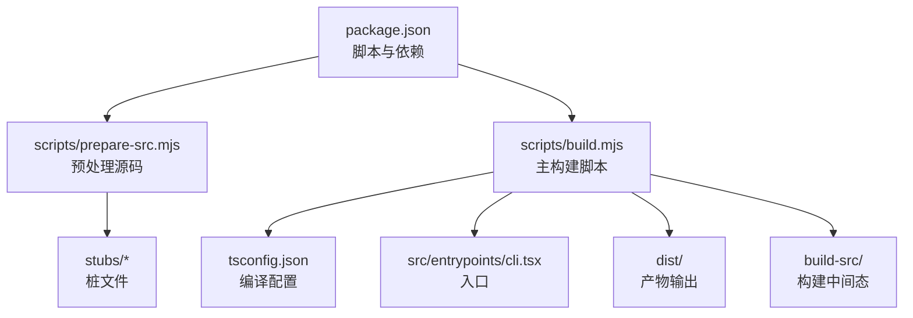
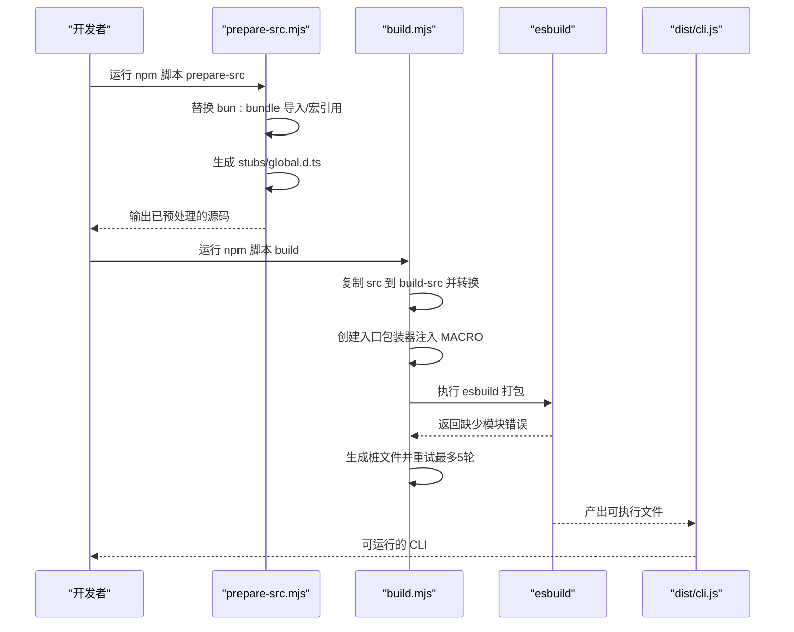
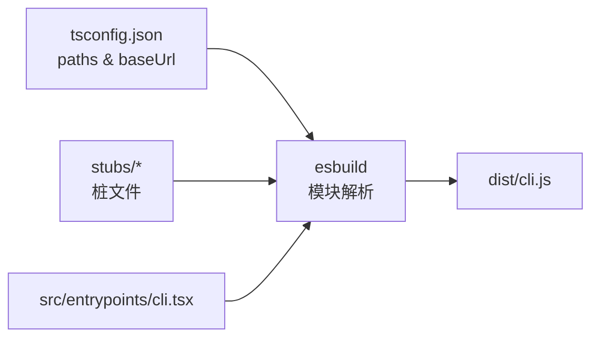

# 构建配置

<cite>
**本文引用的文件**
- [package.json](file://package.json)
- [tsconfig.json](file://tsconfig.json)
- [scripts/build.mjs](file://scripts/build.mjs)
- [scripts/prepare-src.mjs](file://scripts/prepare-src.mjs)
- [scripts/stub-modules.mjs](file://scripts/stub-modules.mjs)
- [scripts/transform.mjs](file://scripts/transform.mjs)
- [stubs/bun-bundle.ts](file://stubs/bun-bundle.ts)
- [stubs/bun-bundle.js](file://stubs/bun-bundle.js)
- [stubs/bun-ffi.ts](file://stubs/bun-ffi.ts)
- [stubs/global.d.ts](file://stubs/global.d.ts)
- [src/entrypoints/cli.tsx](file://src/entrypoints/cli.tsx)
- [src/main.tsx](file://src/main.tsx)
- [QUICKSTART.md](file://QUICKSTART.md)
- [README.md](file://README.md)
</cite>

## 目录
1. [简介](#简介)
2. [项目结构](#项目结构)
3. [核心组件](#核心组件)
4. [架构总览](#架构总览)
5. [详细组件分析](#详细组件分析)
6. [依赖分析](#依赖分析)
7. [性能考虑](#性能考虑)
8. [故障排查指南](#故障排查指南)
9. [结论](#结论)
10. [附录](#附录)

## 简介
本文件系统性梳理 Claude Code v2.1.88 的构建配置与流程，重点围绕以下目标展开：
- 解释构建脚本的两个阶段（prepare-src 与 build）及其职责边界
- 深入说明 TypeScript 编译配置（编译选项、路径映射、模块解析策略）
- 阐述 esbuild 的配置与优化策略（打包参数、代码分割、源码映射、外部化策略）
- 介绍构建期的特殊处理（stub 生成、模块转换、宏替换）
- 对比开发模式与生产模式的差异（优化策略、调试信息、资源处理）
- 提供构建性能优化建议（并行构建、缓存策略、增量编译）
- 总结常见失败原因与修复方法

## 项目结构
与构建直接相关的关键目录与文件：
- scripts：构建脚本集合（prepare-src、build、stub-modules、transform）
- stubs：为 Bun 编译期内建能力提供的桩文件（bun-bundle、bun-ffi、global.d.ts）
- src：TypeScript 源码（入口文件位于 src/entrypoints/cli.tsx）
- tsconfig.json：TypeScript 编译配置
- package.json：脚本入口与依赖声明

图表来源
- [package.json](file://package.json)
- [scripts/prepare-src.mjs](file://scripts/prepare-src.mjs)
- [scripts/build.mjs](file://scripts/build.mjs)
- [tsconfig.json](file://tsconfig.json)
- [src/entrypoints/cli.tsx](file://src/entrypoints/cli.tsx)

章节来源
- [package.json](file://package.json)
- [QUICKSTART.md](file://QUICKSTART.md)

## 核心组件
- 构建脚本与阶段
  - prepare-src.mjs：在不改变原始 src 的前提下，对源码进行“预处理”，替换 Bun 特定的导入与宏引用，并生成必要的类型桩文件。
  - build.mjs：复制并转换后的源码到 build-src，创建入口包装器，使用 esbuild 进行打包；若遇到缺失模块，自动创建桩文件并重试，最多五轮迭代。
  - stub-modules.mjs：基于 esbuild 报错解析缺失模块，批量生成桩文件，再尝试打包。
  - transform.mjs：另一种构建策略（非推荐），通过全局注入 MACRO 值并替换 bun:bundle 导入后打包。

- 类型系统与路径映射
  - tsconfig.json 定义了 target/module/moduleResolution、严格性与源码映射策略，并通过 paths 将 src/* 与 bun:bundle 映射到 stubs 目录，确保 esbuild 与 TS 编译器都能正确解析。

- 桩文件与宏定义
  - bun-bundle.ts/js：提供 feature() 的桩实现，使 feature('FLAG') 在构建时可被死代码消除。
  - bun-ffi.ts：为 bun:ffi 提供空实现，避免运行时错误。
  - global.d.ts：声明全局 MACRO 类型，保证 TS 编译期类型检查通过。

章节来源
- [scripts/prepare-src.mjs](file://scripts/prepare-src.mjs)
- [scripts/build.mjs](file://scripts/build.mjs)
- [scripts/stub-modules.mjs](file://scripts/stub-modules.mjs)
- [scripts/transform.mjs](file://scripts/transform.mjs)
- [tsconfig.json](file://tsconfig.json)
- [stubs/bun-bundle.ts](file://stubs/bun-bundle.ts)
- [stubs/bun-bundle.js](file://stubs/bun-bundle.js)
- [stubs/bun-ffi.ts](file://stubs/bun-ffi.ts)
- [stubs/global.d.ts](file://stubs/global.d.ts)

## 架构总览
从源码到可执行产物的整体流程如下：

图表来源
- [scripts/prepare-src.mjs](file://scripts/prepare-src.mjs)
- [scripts/build.mjs](file://scripts/build.mjs)
- [src/entrypoints/cli.tsx](file://src/entrypoints/cli.tsx)

## 详细组件分析

### prepare-src 阶段（预处理）
- 目标
  - 将源码中对 bun:bundle 的导入替换为本地桩文件路径，确保 esbuild 能解析
  - 将 MACRO.X 引用替换为字符串字面量，模拟 Bun 的 define 行为
  - 生成全局类型声明 global.d.ts，避免 TS 编译期报错
  - 生成 bun-ffi.ts 桩文件，覆盖上游代理模块的依赖

- 关键行为
  - 遍历 src 下的 TS/TSX 文件，逐个进行字符串替换
  - 计算相对深度以修正导入路径，确保多层目录下的引用正确
  - 生成类型声明文件，声明 MACRO 全局对象的结构

- 产物
  - 修改后的源码（不覆盖原始 src）
  - stubs/global.d.ts
  - stubs/bun-ffi.ts

章节来源
- [scripts/prepare-src.mjs](file://scripts/prepare-src.mjs)
- [stubs/global.d.ts](file://stubs/global.d.ts)
- [stubs/bun-ffi.ts](file://stubs/bun-ffi.ts)

### build 阶段（主构建）
- 目标
  - 将 build-src 中的源码通过 esbuild 打包为单文件 CLI
  - 自动处理缺失模块：解析 esbuild 错误，生成桩文件，循环重试直至成功或达到最大轮次

- 关键步骤
  - 清理/创建 build-src 与 dist 目录
  - 复制 src 到 build-src，并在入口处注入 MACRO 全局值
  - 使用 esbuild 执行打包，传入平台、目标、格式、外部化策略、源码映射等参数
  - 若打包失败，解析“无法解析”的模块名，生成桩文件并重试（最多 5 轮）

- 参数要点
  - 平台与目标：--platform=node 与 --target=node18
  - 输出格式：--format=esm
  - 外部化策略：--packages=external 与 --external:'bun:*'
  - 源码映射：--sourcemap
  - 日志级别：--log-level=error 或 warning（视脚本而定）

- 产物
  - dist/cli.js（可执行 CLI）
  - build-src/（构建中间态，便于调试）

章节来源
- [scripts/build.mjs](file://scripts/build.mjs)
- [src/entrypoints/cli.tsx](file://src/entrypoints/cli.tsx)

### stub-modules 阶段（按需生成桩）
- 目标
  - 基于 esbuild 的错误输出，解析所有“无法解析”的模块，批量生成桩文件
  - 再次尝试打包，验证修复效果

- 关键行为
  - 调用 esbuild 获取错误输出，提取模块名
  - 针对相对路径模块，搜索导入者并解析绝对路径
  - 为不同类型的缺失模块（文本资产、JS/TS 模块、类型声明）生成合适的桩文件
  - 重复尝试打包，输出最终结果

章节来源
- [scripts/stub-modules.mjs](file://scripts/stub-modules.mjs)

### transform 阶段（替代构建策略）
- 目标
  - 通过全局注入 MACRO 值与替换 bun:bundle 导入的方式，直接调用 esbuild 打包

- 关键行为
  - 复制 src 与 stubs 到 build-src
  - 替换所有 bun:bundle 导入为本地桩
  - 在入口包装器中注入 MACRO 全局对象
  - 调用 esbuild 打包，支持可选的 minify 开关

章节来源
- [scripts/transform.mjs](file://scripts/transform.mjs)

### TypeScript 编译配置（tsconfig.json）
- 编译选项
  - 目标与模块：target ES2022，module ESNext，moduleResolution bundler
  - 互操作与默认导入：esModuleInterop 与 allowSyntheticDefaultImports
  - 严格性：strict 放松（false），skipLibCheck、forceConsistentCasingInFileNames
  - JSON 模块：resolveJsonModule
  - 类型与源码映射：declaration、declarationMap、sourceMap
  - JSX：react-jsx
  - 输出目录：outDir dist，rootDir src
  - 基础路径与路径映射：baseUrl .，paths 包含 src/* 与 bun:bundle → stubs/bun-bundle.ts

- 影响
  - 为 esbuild 提供一致的模块解析与路径映射，避免运行时模块解析失败
  - 生成声明与源码映射，便于调试与 IDE 支持

章节来源
- [tsconfig.json](file://tsconfig.json)

### esbuild 配置与优化策略
- 基本参数
  - 平台与目标：--platform=node、--target=node18
  - 输出格式：--format=esm
  - 输出文件：--outfile=dist/cli.js
  - 外部化：--packages=external、--external:'bun:*'
  - 源码映射：--sourcemap
  - 日志：--log-level=error 或 warning
  - 允许覆盖：--allow-overwrite

- 代码分割与打包
  - 当前策略是单文件打包（入口为包装器），未启用代码分割
  - 通过外部化策略减少打包体积，避免将 node_modules 与 bun:* 注入

- 源码映射
  - 启用 sourcemap，便于定位运行时错误与调试

- 迭代式桩生成
  - 通过解析 esbuild 错误，动态生成缺失模块桩文件，提升构建成功率

章节来源
- [scripts/build.mjs](file://scripts/build.mjs)
- [scripts/stub-modules.mjs](file://scripts/stub-modules.mjs)

### 开发模式与生产模式差异
- 开发模式（prepare-src + build）
  - 保留源码映射与较详细的日志，便于问题定位
  - 通过 stubs 与路径映射保证模块解析一致性
  - 逐步迭代生成桩文件，提高成功率

- 生产模式（发布产物）
  - 发布包中包含已打包的 dist/cli.js
  - 无需额外构建步骤，直接运行 node dist/cli.js 或安装后使用 claude 命令

章节来源
- [package.json](file://package.json)
- [QUICKSTART.md](file://QUICKSTART.md)

### 入口与宏注入
- 入口包装器
  - 在 build.mjs 中创建 build-src/entry.ts，注入 MACRO 全局对象，再导入 src/entrypoints/cli.tsx
  - 该方式在 esbuild 打包阶段即可解析 MACRO.X 引用，避免运行时错误

- 宏与特性门控
  - 源码中大量使用 feature('FLAG') 进行死代码消除，构建阶段将其替换为 false，配合 esbuild 的 DCE
  - MACRO.X 在 TS 层通过字符串替换注入，在打包阶段由 esbuild 处理

章节来源
- [scripts/build.mjs](file://scripts/build.mjs)
- [src/entrypoints/cli.tsx](file://src/entrypoints/cli.tsx)

## 依赖分析
- 构建依赖
  - esbuild：用于打包与生成单文件 CLI
  - TypeScript：用于类型检查与路径映射（与 esbuild 协同）

- 运行时依赖
  - 通过 --packages=external 与 --external:'bun:*' 控制外部化，避免将 node_modules 注入打包

- 模块解析链路
  - tsconfig.json 的 paths 与 baseUrl 为 esbuild 提供一致的解析规则
  - stubs 目录下的桩文件作为 bun:bundle 与类型声明的占位

图表来源
- [tsconfig.json](file://tsconfig.json)
- [scripts/build.mjs](file://scripts/build.mjs)
- [src/entrypoints/cli.tsx](file://src/entrypoints/cli.tsx)

章节来源
- [tsconfig.json](file://tsconfig.json)
- [scripts/build.mjs](file://scripts/build.mjs)

## 性能考虑
- 并行构建
  - 构建脚本本身为顺序执行，可通过外部并行化策略（例如在 CI 中并行多个子任务）提升整体吞吐

- 缓存策略
  - 优先复用已生成的 dist/cli.js，避免重复打包
  - 在本地开发时，可先运行 prepare-src，再增量运行 build.mjs，减少不必要的重复工作

- 增量编译
  - TypeScript 编译器支持增量编译（需要配置增量选项），但当前构建脚本主要依赖 esbuild 打包
  - 建议在修改少量文件时，优先使用 stub-modules.mjs 快速定位缺失模块并生成桩，减少全量重试

- 外部化与体积
  - 使用 --packages=external 与 --external:'bun:*' 减少打包体积，缩短构建时间
  - 对于大型依赖，可考虑分包策略（当前为单文件打包，暂不适用）

## 故障排查指南
- 常见失败原因
  - 108 个特性门控模块缺失：这些模块在发布包中被死代码消除，构建时会报“无法解析”错误
  - bun:ffi 使用：上游代理模块依赖 bun:ffi，需使用桩文件
  - 复杂表达式中的 MACRO.X：字符串替换可能遗漏复杂表达式场景
  - feature('FLAG') 的 require：esbuild 仍会解析 require，即使构建阶段已替换为 false

- 修复步骤
  - 使用 stub-modules.mjs 自动解析并生成缺失模块桩文件
  - 手动补充特定缺失模块的桩文件（JS/TS 导出空函数，文本资产创建空文件）
  - 检查并修正路径映射与导入深度，确保桩文件放置在正确位置
  - 重新运行 build.mjs，直至成功

- 调试建议
  - 查看 build-src/ 中的转换结果，确认宏替换与导入替换是否生效
  - 使用 --log-level=warning 或更详细日志定位具体模块缺失
  - 分离 prepare-src 与 build.mjs 的执行，分别排查预处理与打包阶段的问题

章节来源
- [scripts/stub-modules.mjs](file://scripts/stub-modules.mjs)
- [scripts/build.mjs](file://scripts/build.mjs)
- [README.md](file://README.md)

## 结论
Claude Code 的构建体系以“预处理 + esbuild 打包”为核心，通过 stubs 与路径映射弥补 Bun 编译期内建能力的缺失，并借助迭代式桩生成机制提升成功率。尽管存在 108 个特性门控模块缺失与复杂表达式中的宏替换挑战，但通过上述策略与工具，仍可在 Node 环境下完成近似完整的最佳努力构建。对于生产环境，建议直接使用已发布的 dist/cli.js，避免构建期的不确定性。

## 附录
- 术语说明
  - 特性门控（feature gate）：通过 feature('FLAG') 控制代码分支，构建时根据布尔值决定是否保留
  - 桩文件（stub）：为缺失模块提供的最小实现，用于通过编译与打包校验
  - 外部化（external）：将某些模块排除在打包之外，由运行时提供

- 相关文件索引
  - 构建脚本：scripts/prepare-src.mjs、scripts/build.mjs、scripts/stub-modules.mjs、scripts/transform.mjs
  - 类型与路径：tsconfig.json
  - 桩文件：stubs/bun-bundle.ts、stubs/bun-bundle.js、stubs/bun-ffi.ts、stubs/global.d.ts
  - 入口与宏：src/entrypoints/cli.tsx、src/main.tsx