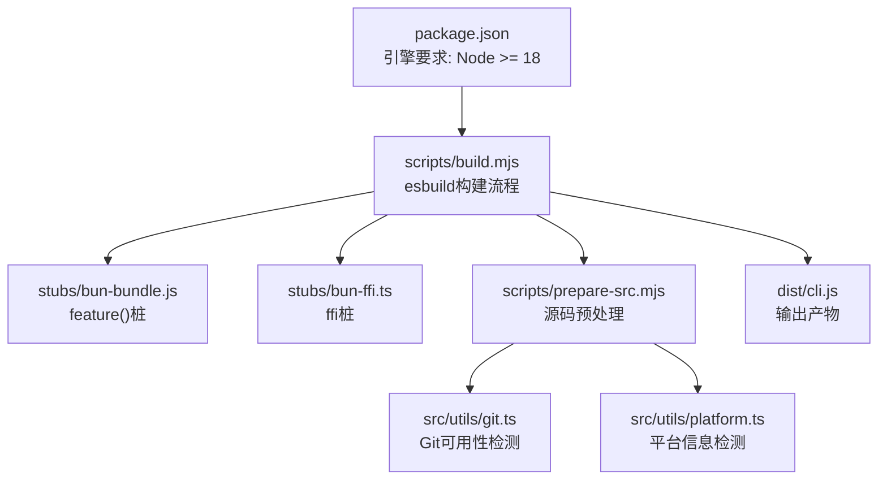
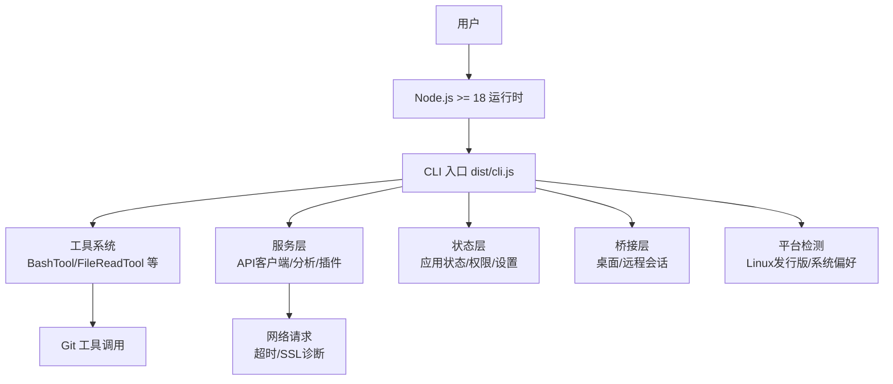
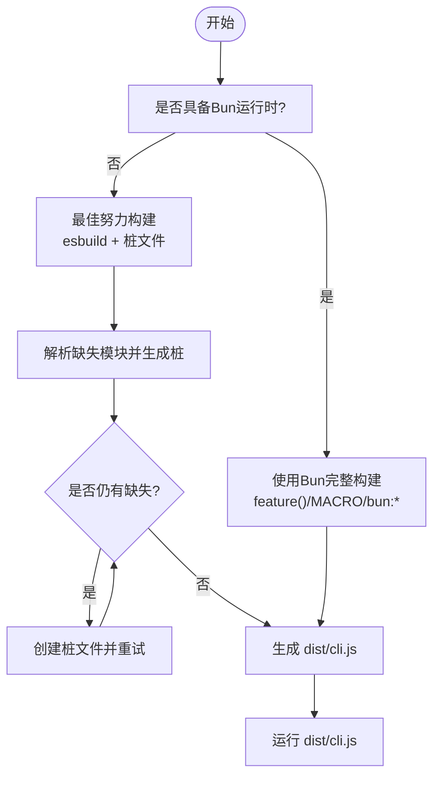
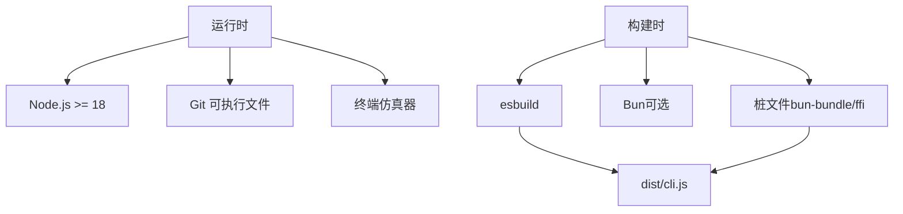

# 系统要求

<cite>
**本文引用的文件**
- [package.json](file://package.json)
- [README.md](file://README.md)
- [QUICKSTART.md](file://QUICKSTART.md)
- [scripts/build.mjs](file://scripts/build.mjs)
- [scripts/prepare-src.mjs](file://scripts/prepare-src.mjs)
- [stubs/bun-bundle.js](file://stubs/bun-bundle.js)
- [stubs/bun-ffi.ts](file://stubs/bun-ffi.ts)
- [src/utils/git.ts](file://src/utils/git.ts)
- [src/utils/platform.ts](file://src/utils/platform.ts)
- [src/utils/plugins/gitAvailability.ts](file://src/utils/plugins/gitAvailability.ts)
- [src/services/api/errorUtils.ts](file://src/services/api/errorUtils.ts)
</cite>

## 目录
1. [简介](#简介)
2. [项目结构](#项目结构)
3. [核心组件](#核心组件)
4. [架构总览](#架构总览)
5. [详细组件分析](#详细组件分析)
6. [依赖关系分析](#依赖关系分析)
7. [性能考虑](#性能考虑)
8. [故障排查指南](#故障排查指南)
9. [结论](#结论)
10. [附录](#附录)

## 简介
本文件面向Claude Code项目的使用者与维护者，提供系统要求与兼容性说明，涵盖操作系统支持、硬件配置建议、Node.js版本要求、网络环境要求、第三方依赖（Bun、Git、终端模拟器等）、系统兼容性测试方法以及各平台的注意事项与已知限制。内容基于仓库中的构建脚本、运行时检测与错误处理逻辑进行归纳总结。

## 项目结构
- 核心入口与运行方式
  - 项目通过Node.js >= 18执行，支持直接运行预编译的CLI或从源码构建。
  - 源码构建使用esbuild进行打包，但完整功能需要Bun的编译期特性（feature()、MACRO、bun:bundle），因此官方建议优先使用预编译CLI。
- 关键目录与文件
  - scripts/build.mjs：最佳努力的esbuild构建流程，包含源码转换、入口包装、迭代生成桩模块并打包。
  - scripts/prepare-src.mjs：预构建阶段替换bun:bundle导入与MACRO引用，生成类型声明与ffi桩。
  - stubs/：存放bun:bundle与bun-ffi的桩文件，用于非Bun环境下编译。
  - src/utils/git.ts、src/utils/platform.ts：运行时检测Git可用性与平台信息，影响功能启用与行为。
  - src/services/api/errorUtils.ts：网络连接错误的诊断提示，涉及SSL/TLS与超时等场景。

**图表来源**
- [package.json:13-15](file://package.json#L13-L15)
- [scripts/build.mjs:17-246](file://scripts/build.mjs#L17-L246)
- [scripts/prepare-src.mjs:1-116](file://scripts/prepare-src.mjs#L1-L116)
- [stubs/bun-bundle.js:1-4](file://stubs/bun-bundle.js#L1-L4)
- [stubs/bun-ffi.ts:1-3](file://stubs/bun-ffi.ts#L1-L3)
- [src/utils/git.ts:1-800](file://src/utils/git.ts#L1-L800)
- [src/utils/platform.ts:93-150](file://src/utils/platform.ts#L93-L150)

**章节来源**
- [package.json:13-15](file://package.json#L13-L15)
- [QUICKSTART.md:1-122](file://QUICKSTART.md#L1-L122)
- [scripts/build.mjs:1-246](file://scripts/build.mjs#L1-L246)
- [scripts/prepare-src.mjs:1-116](file://scripts/prepare-src.mjs#L1-L116)

## 核心组件
- Node.js版本要求
  - 引擎要求：Node.js >= 18.0.0；构建脚本与快速开始文档均强调此版本门槛。
- 构建与运行路径
  - 预编译CLI：直接运行dist/cli.js，无需Bun。
  - 源码构建：使用esbuild进行最佳努力构建，但会遇到缺少108个内部模块的问题，需手动创建桩文件。
  - 完整构建：需要Bun的编译期特性（feature()、MACRO、bun:bundle），官方未公开内部构建配置。
- 第三方依赖
  - Git：作为VCS工具在运行时被调用，若不可用则部分功能降级或禁用。
  - 终端模拟器：项目内含终端渲染与交互逻辑，需支持ANSI转义与基本终端能力。
  - Bun：仅用于完整构建与运行时检测，非必需（可使用Node运行预编译CLI）。

**章节来源**
- [package.json:13-15](file://package.json#L13-L15)
- [QUICKSTART.md:25-45](file://QUICKSTART.md#L25-L45)
- [scripts/build.mjs:17-246](file://scripts/build.mjs#L17-L246)
- [src/utils/git.ts:212-229](file://src/utils/git.ts#L212-L229)

## 架构总览
下图展示从用户到CLI再到工具链的整体流程，以及与网络、Git与平台检测的关系：

**图表来源**
- [scripts/build.mjs:144-173](file://scripts/build.mjs#L144-L173)
- [src/utils/git.ts:347-354](file://src/utils/git.ts#L347-L354)
- [src/services/api/errorUtils.ts:204-235](file://src/services/api/errorUtils.ts#L204-L235)
- [src/utils/platform.ts:93-150](file://src/utils/platform.ts#L93-L150)

## 详细组件分析

### Node.js版本要求与影响
- 版本要求
  - engines.node >= 18.0.0，确保项目以ESM模块与较新API运行。
- 影响范围
  - 构建脚本与快速开始文档均要求Node >= 18与npm >= 9。
  - 源码构建使用esbuild，但不完全等价于Bun的编译期特性，可能导致部分功能缺失或需手工修复。

**章节来源**
- [package.json:13-15](file://package.json#L13-L15)
- [QUICKSTART.md:27-30](file://QUICKSTART.md#L27-L30)
- [scripts/build.mjs:17-18](file://scripts/build.mjs#L17-L18)

### 构建与运行路径
- 预编译CLI（推荐）
  - 直接运行dist/cli.js，无需Bun；适合大多数用户与CI环境。
- 源码构建（最佳努力）
  - 使用esbuild迭代解析缺失模块并生成桩文件，最多尝试5轮；仍可能遗留108个内部模块问题。
- 完整构建（需要内部访问）
  - 使用Bun编译期特性（feature()、MACRO、bun:bundle）进行死代码消除与打包，官方未公开内部配置。

**图表来源**
- [QUICKSTART.md:89-104](file://QUICKSTART.md#L89-L104)
- [scripts/build.mjs:144-229](file://scripts/build.mjs#L144-L229)

**章节来源**
- [QUICKSTART.md:3-21](file://QUICKSTART.md#L3-L21)
- [scripts/build.mjs:1-246](file://scripts/build.mjs#L1-L246)

### 第三方依赖与系统要求
- Git工具
  - 运行时检测：通过which查找git可执行文件；若失败或调用异常，会标记为不可用并降级相关功能。
  - 项目内多处调用git命令（状态、分支、远程、工作树等），不可用将影响仓库相关功能。
- 终端模拟器
  - 项目包含终端渲染与交互逻辑，需支持ANSI转义、光标控制与基本终端能力。
- Bun
  - 仅用于完整构建与运行时检测；非必需（可使用Node运行预编译CLI）。

**章节来源**
- [src/utils/git.ts:212-229](file://src/utils/git.ts#L212-L229)
- [src/utils/plugins/gitAvailability.ts:46-69](file://src/utils/plugins/gitAvailability.ts#L46-L69)
- [src/utils/platform.ts:93-150](file://src/utils/platform.ts#L93-L150)

### 网络环境要求与错误处理
- 常见网络问题与提示
  - 超时：检查网络连接与代理设置。
  - SSL/TLS证书：自签名、过期、吊销、主机名不匹配等情况均有明确提示。
- 诊断建议
  - 核实代理与企业防火墙策略，确保对外网API访问放行。
  - 如遇SSL错误，检查本地证书链与企业中间证书。

**章节来源**
- [src/services/api/errorUtils.ts:204-235](file://src/services/api/errorUtils.ts#L204-L235)

### 平台兼容性与已知限制
- Windows
  - 项目未提供专门的Windows安装包；可在Windows上使用WSL或原生命令行运行Node版CLI。
  - Git在Windows上通常通过Git for Windows提供，需确保PATH正确。
- macOS
  - 若存在xcrun shim导致的git调用失败，会触发“invalid active developer path”等错误；可通过系统设置或重新安装Xcode命令行工具解决。
- Linux
  - 通过/etc/os-release识别发行版与版本；部分功能依赖标准Unix工具链。
- 已知限制
  - 源码构建无法完全还原Bun编译期特性，存在约108个内部模块缺失，需手工创建桩文件。
  - bun:ffi在非Bun环境中被stub，部分原生代理支持不可用。

**章节来源**
- [src/utils/platform.ts:93-150](file://src/utils/platform.ts#L93-L150)
- [src/utils/plugins/gitAvailability.ts:46-69](file://src/utils/plugins/gitAvailability.ts#L46-L69)
- [QUICKSTART.md:58-87](file://QUICKSTART.md#L58-L87)
- [stubs/bun-ffi.ts:1-3](file://stubs/bun-ffi.ts#L1-L3)

## 依赖关系分析
- 运行时依赖
  - Node.js >= 18：引擎要求。
  - Git：运行时工具，影响仓库相关功能。
  - 终端：渲染与交互的基础能力。
- 构建时依赖
  - esbuild：最佳努力构建的核心工具。
  - Bun：完整构建所需，且用于运行时检测（非必需）。
- 内部模块与桩
  - 108个内部模块在发布包中不存在，需通过桩文件补齐。

**图表来源**
- [package.json:13-15](file://package.json#L13-L15)
- [scripts/build.mjs:134-163](file://scripts/build.mjs#L134-L163)
- [stubs/bun-bundle.js:1-4](file://stubs/bun-bundle.js#L1-L4)
- [stubs/bun-ffi.ts:1-3](file://stubs/bun-ffi.ts#L1-L3)

**章节来源**
- [package.json:13-15](file://package.json#L13-L15)
- [scripts/build.mjs:134-163](file://scripts/build.mjs#L134-L163)

## 性能考虑
- 构建性能
  - 最佳努力构建采用esbuild并迭代生成桩文件，最多5轮；建议在空闲磁盘空间充足、网络稳定的环境中进行。
- 运行性能
  - 大型仓库的Git操作（如diff、status）可能受磁盘I/O与文件数量影响；建议在SSD上工作并在必要时清理无关文件。
- 网络性能
  - API调用受网络延迟与带宽影响；合理配置代理与DNS可改善响应时间。

## 故障排查指南
- 构建失败
  - 缺少模块：根据esbuild输出定位缺失模块，创建对应桩文件后重试。
  - 版本不匹配：确认Node >= 18与npm >= 9。
- 运行失败
  - Git不可用：检查PATH中git可执行文件位置，或参考平台章节的macOS解决方案。
  - 网络错误：根据SSL/TLS错误提示检查证书链、代理与防火墙策略。
- 功能缺失
  - 源码构建可能缺少约108个内部模块；如需完整功能，请使用Bun或预编译CLI。

**章节来源**
- [scripts/build.mjs:175-229](file://scripts/build.mjs#L175-L229)
- [QUICKSTART.md:72-87](file://QUICKSTART.md#L72-L87)
- [src/services/api/errorUtils.ts:204-235](file://src/services/api/errorUtils.ts#L204-L235)

## 结论
- 推荐使用Node.js >= 18运行预编译CLI，避免源码构建的复杂性。
- 若必须从源码构建，准备好esbuild与桩文件，并理解约108个内部模块缺失的限制。
- 确保Git可用与网络连通，按平台章节的注意事项进行配置，可显著提升稳定性与体验。

## 附录

### 系统兼容性测试方法与验证步骤
- Node.js版本验证
  - 运行 node --version，确认输出符合 >= 18 的要求。
- Git可用性验证
  - 运行 git --version，确认输出正常；在macOS中如遇xcrun错误，按平台章节处理。
- 网络连通性验证
  - 尝试访问外部API域名，观察是否出现超时或SSL错误提示。
- 构建验证（可选）
  - 运行 node scripts/build.mjs，观察是否成功生成 dist/cli.js；若失败，按提示创建桩文件并重试。

**章节来源**
- [QUICKSTART.md:27-30](file://QUICKSTART.md#L27-L30)
- [src/utils/git.ts:212-229](file://src/utils/git.ts#L212-L229)
- [src/services/api/errorUtils.ts:204-235](file://src/services/api/errorUtils.ts#L204-L235)
- [scripts/build.mjs:175-229](file://scripts/build.mjs#L175-L229)