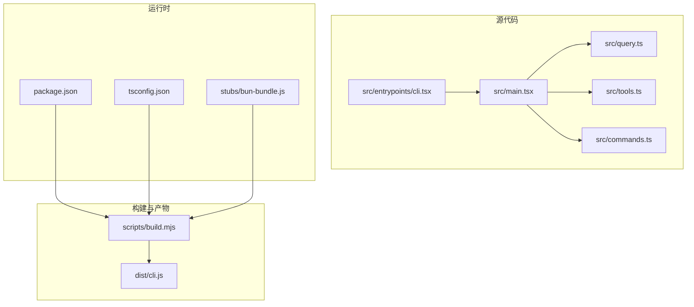
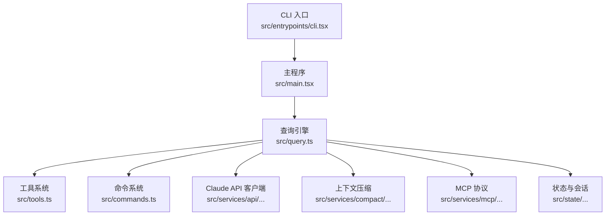
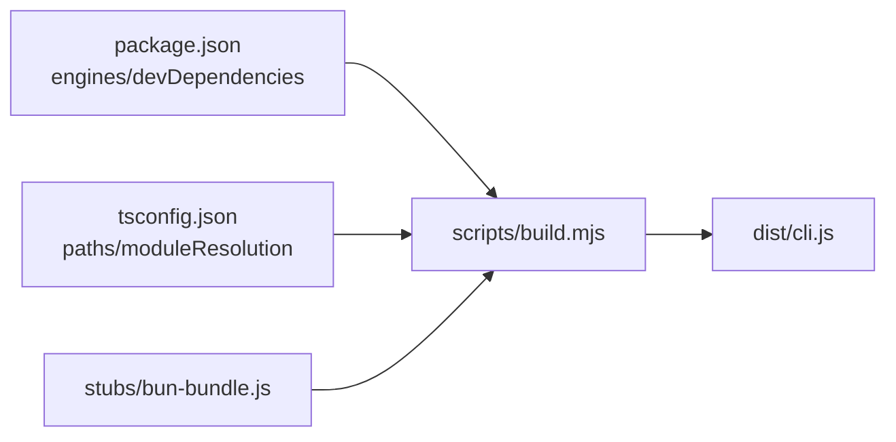

# 快速开始

<cite>
**本文引用的文件列表**
- [package.json](file://package.json)
- [QUICKSTART.md](file://QUICKSTART.md)
- [README.md](file://README.md)
- [scripts/build.mjs](file://scripts/build.mjs)
- [src/entrypoints/cli.tsx](file://src/entrypoints/cli.tsx)
- [src/main.tsx](file://src/main.tsx)
- [src/query.ts](file://src/query.ts)
- [src/tools.ts](file://src/tools.ts)
- [src/commands.ts](file://src/commands.ts)
- [stubs/bun-bundle.js](file://stubs/bun-bundle.js)
- [tsconfig.json](file://tsconfig.json)
</cite>

## 目录
1. [简介](#简介)
2. [项目结构](#项目结构)
3. [核心组件](#核心组件)
4. [架构总览](#架构总览)
5. [详细组件分析](#详细组件分析)
6. [依赖关系分析](#依赖关系分析)
7. [性能考虑](#性能考虑)
8. [故障排除指南](#故障排除指南)
9. [结论](#结论)
10. [附录](#附录)

## 简介
本指南面向首次接触 Claude Code 的用户，帮助你在本地完成环境准备、安装与构建，并快速上手使用 CLI 进行代码查询、文件操作与工具调用。文档涵盖：
- 环境准备与 Node.js 版本要求
- 构建与运行流程（包含最佳努力构建与完整构建）
- 基本使用示例（非交互模式、登录认证、常用命令）
- 目录结构与关键配置文件说明
- 常见使用场景（个人开发、团队协作、远程开发）
- 故障排除与学习路径建议

## 项目结构
该项目采用 TypeScript 源码与脚本驱动的构建体系，核心入口位于 src/entrypoints/cli.tsx，主逻辑在 src/main.tsx，查询与工具系统在 src/query.ts 与 src/tools.ts，命令系统在 src/commands.ts。构建脚本位于 scripts/build.mjs，打包产物输出到 dist/cli.js。

图表来源
- [src/entrypoints/cli.tsx:1-303](file://src/entrypoints/cli.tsx#L1-L303)
- [src/main.tsx:1-4684](file://src/main.tsx#L1-L4684)
- [src/query.ts:1-200](file://src/query.ts#L1-L200)
- [src/tools.ts:1-200](file://src/tools.ts#L1-L200)
- [src/commands.ts:1-200](file://src/commands.ts#L1-L200)
- [scripts/build.mjs:1-246](file://scripts/build.mjs#L1-L246)
- [package.json:1-21](file://package.json#L1-L21)
- [tsconfig.json:1-37](file://tsconfig.json#L1-L37)
- [stubs/bun-bundle.js:1-4](file://stubs/bun-bundle.js#L1-L4)

章节来源
- [README.md:250-380](file://README.md#L250-L380)
- [package.json:1-21](file://package.json#L1-L21)
- [tsconfig.json:1-37](file://tsconfig.json#L1-L37)

## 核心组件
- CLI 入口：负责解析参数、快速路径优化与加载主程序，详见 [src/entrypoints/cli.tsx:1-303](file://src/entrypoints/cli.tsx#L1-L303)。
- 主程序：初始化配置、权限、遥测、插件与技能，启动 REPL 或头模式执行，详见 [src/main.tsx:1-4684](file://src/main.tsx#L1-L4684)。
- 查询引擎：处理用户输入、组装系统提示词、调用 Claude API、执行工具并流式返回结果，详见 [src/query.ts:1-200](file://src/query.ts#L1-L200)。
- 工具系统：内置 Bash、文件读写、搜索、网络请求、MCP 等工具，按特性门控动态加载，详见 [src/tools.ts:1-200](file://src/tools.ts#L1-L200)。
- 命令系统：提供大量 /slash 命令，如 config、mcp、review、tasks 等，详见 [src/commands.ts:1-200](file://src/commands.ts#L1-L200)。

章节来源
- [src/entrypoints/cli.tsx:1-303](file://src/entrypoints/cli.tsx#L1-L303)
- [src/main.tsx:1-4684](file://src/main.tsx#L1-L4684)
- [src/query.ts:1-200](file://src/query.ts#L1-L200)
- [src/tools.ts:1-200](file://src/tools.ts#L1-L200)
- [src/commands.ts:1-200](file://src/commands.ts#L1-L200)

## 架构总览
下图展示了从 CLI 启动到查询执行的关键路径，以及工具与服务层的关系。

图表来源
- [src/entrypoints/cli.tsx:1-303](file://src/entrypoints/cli.tsx#L1-L303)
- [src/main.tsx:1-4684](file://src/main.tsx#L1-L4684)
- [src/query.ts:1-200](file://src/query.ts#L1-L200)
- [src/tools.ts:1-200](file://src/tools.ts#L1-L200)
- [src/commands.ts:1-200](file://src/commands.ts#L1-L200)

章节来源
- [README.md:383-446](file://README.md#L383-L446)

## 详细组件分析

### CLI 入口与启动流程
- 快速路径：支持 --version、--dump-system-prompt 等零模块加载的快速路径，详见 [src/entrypoints/cli.tsx:33-93](file://src/entrypoints/cli.tsx#L33-L93)。
- 分支加载：根据特性门控与子命令动态导入模块，减少冷启动时间，详见 [src/entrypoints/cli.tsx:95-299](file://src/entrypoints/cli.tsx#L95-L299)。
- 启动主程序：最终调用 [src/main.tsx:585-800](file://src/main.tsx#L585-L800) 开始初始化与交互。

章节来源
- [src/entrypoints/cli.tsx:1-303](file://src/entrypoints/cli.tsx#L1-L303)
- [src/main.tsx:585-800](file://src/main.tsx#L585-L800)

### 查询引擎与工具执行
- 输入处理：解析用户输入、解析 /slash 命令、组装消息，详见 [src/query.ts:1-200](file://src/query.ts#L1-L200)。
- 工具执行：通过 StreamingToolExecutor 并行或串行执行工具，权限校验与结果汇总，详见 [src/query.ts:1-200](file://src/query.ts#L1-L200)。
- 上下文压缩：自动压缩历史消息，避免超出上下文窗口，详见 [src/query.ts:1-200](file://src/query.ts#L1-L200)。

章节来源
- [src/query.ts:1-200](file://src/query.ts#L1-L200)

### 工具系统与特性门控
- 内置工具：Bash、FileRead/Write/Edit、Glob/Grep、WebFetch/Search、AgentTool、SkillTool、MCPTool 等，详见 [src/tools.ts:1-200](file://src/tools.ts#L1-L200)。
- 特性门控：feature('FLAG') 控制是否包含特定工具与功能，构建脚本对这些门控进行替换与死代码消除，详见 [scripts/build.mjs:86-116](file://scripts/build.mjs#L86-L116)。

章节来源
- [src/tools.ts:1-200](file://src/tools.ts#L1-L200)
- [scripts/build.mjs:86-116](file://scripts/build.mjs#L86-L116)

### 命令系统与插件/技能
- 命令注册：commands.ts 动态导入各类 /slash 命令，按特性门控启用，详见 [src/commands.ts:1-200](file://src/commands.ts#L1-L200)。
- 技能与插件：技能目录与内置技能加载，插件命令与技能缓存管理，详见 [src/commands.ts:156-169](file://src/commands.ts#L156-L169)。

章节来源
- [src/commands.ts:1-200](file://src/commands.ts#L1-L200)

## 依赖关系分析
- Node.js 版本：要求 >= 18，详见 [package.json:13-15](file://package.json#L13-L15)。
- 构建依赖：esbuild，用于打包 CLI，详见 [package.json:16-19](file://package.json#L16-L19)。
- TypeScript 配置：目标 ES2022，模块解析 bundler，别名映射 bun:bundle 到 stubs，详见 [tsconfig.json:1-37](file://tsconfig.json#L1-L37)。
- 构建脚本：scripts/build.mjs 对源码进行拷贝、转换、入口包装与 esbuild 打包，详见 [scripts/build.mjs:1-246](file://scripts/build.mjs#L1-L246)。

图表来源
- [package.json:13-19](file://package.json#L13-L19)
- [tsconfig.json:19-22](file://tsconfig.json#L19-L22)
- [scripts/build.mjs:1-246](file://scripts/build.mjs#L1-L246)
- [stubs/bun-bundle.js:1-4](file://stubs/bun-bundle.js#L1-L4)

章节来源
- [package.json:1-21](file://package.json#L1-L21)
- [tsconfig.json:1-37](file://tsconfig.json#L1-L37)
- [scripts/build.mjs:1-246](file://scripts/build.mjs#L1-L246)

## 性能考虑
- 启动优化：CLI 入口对常见标志进行快速路径处理，避免不必要的模块加载，详见 [src/entrypoints/cli.tsx:33-93](file://src/entrypoints/cli.tsx#L33-L93)。
- 死代码消除：构建脚本将 feature('FLAG') 替换为 false，配合 esbuild 死代码消除，减少打包体积，详见 [scripts/build.mjs:86-116](file://scripts/build.mjs#L86-L116)。
- 上下文压缩：自动压缩历史消息，降低 token 使用，详见 [src/query.ts:1-200](file://src/query.ts#L1-L200)。

章节来源
- [src/entrypoints/cli.tsx:33-93](file://src/entrypoints/cli.tsx#L33-L93)
- [scripts/build.mjs:86-116](file://scripts/build.mjs#L86-L116)
- [src/query.ts:1-200](file://src/query.ts#L1-L200)

## 故障排除指南
- 构建失败（esbuild 无法解析模块）：构建脚本会迭代收集缺失模块并生成桩文件，参考 [scripts/build.mjs:175-229](file://scripts/build.mjs#L175-L229) 的“手动修复”步骤。
- 缺少 API 密钥：需要设置 ANTHROPIC_API_KEY 或先执行登录命令，参考 [QUICKSTART.md:21-21](file://QUICKSTART.md#L21-L21)。
- Node 版本过低：确保 Node >= 18，参考 [package.json:13-15](file://package.json#L13-L15)。
- 远程控制/桥接相关错误：检查策略限制与认证状态，详见 [src/entrypoints/cli.tsx:108-162](file://src/entrypoints/cli.tsx#L108-L162)。

章节来源
- [scripts/build.mjs:175-229](file://scripts/build.mjs#L175-L229)
- [QUICKSTART.md:21-21](file://QUICKSTART.md#L21-L21)
- [package.json:13-15](file://package.json#L13-L15)
- [src/entrypoints/cli.tsx:108-162](file://src/entrypoints/cli.tsx#L108-L162)

## 结论
通过本指南，你可以在本地完成环境准备与构建，使用 CLI 进行非交互查询、登录认证、常用命令操作，并理解项目的目录结构与关键配置。遇到构建问题可按构建脚本的迭代桩文件策略逐步修复；遇到运行期问题可结合特性门控与日志定位。

## 附录

### 环境准备与安装
- Node.js 版本要求：>= 18，参考 [package.json:13-15](file://package.json#L13-L15)。
- 安装依赖：使用 npm 安装项目依赖，参考 [package.json:1-21](file://package.json#L1-L21)。
- TypeScript 配置：目标 ES2022，模块解析 bundler，别名映射 bun:bundle，参考 [tsconfig.json:1-37](file://tsconfig.json#L1-L37)。

章节来源
- [package.json:13-19](file://package.json#L13-L19)
- [tsconfig.json:1-37](file://tsconfig.json#L1-L37)

### 构建与运行流程
- 最佳努力构建（推荐）：安装 esbuild 后运行 scripts/build.mjs，参考 [scripts/build.mjs:1-246](file://scripts/build.mjs#L1-L246) 与 [QUICKSTART.md:23-46](file://QUICKSTART.md#L23-L46)。
- 运行已构建 CLI：使用 node dist/cli.js --version 或 node dist/cli.js -p "Hello Claude"，参考 [QUICKSTART.md:11-19](file://QUICKSTART.md#L11-L19)。
- 完整构建（需要内部访问）：使用 Bun 的 compile-time intrinsics 进行全量构建，参考 [QUICKSTART.md:89-104](file://QUICKSTART.md#L89-L104)。

章节来源
- [scripts/build.mjs:1-246](file://scripts/build.mjs#L1-L246)
- [QUICKSTART.md:11-19](file://QUICKSTART.md#L11-L19)
- [QUICKSTART.md:23-46](file://QUICKSTART.md#L23-L46)
- [QUICKSTART.md:89-104](file://QUICKSTART.md#L89-L104)

### 基本使用示例
- 非交互模式：node dist/cli.js -p "Hello Claude"，参考 [QUICKSTART.md:11-19](file://QUICKSTART.md#L11-L19)。
- 登录认证：执行 node dist/cli.js login 或设置 ANTHROPIC_API_KEY，参考 [QUICKSTART.md:21-21](file://QUICKSTART.md#L21-L21)。
- 常用命令：查看帮助与命令列表，参考 [src/commands.ts:1-200](file://src/commands.ts#L1-L200)。

章节来源
- [QUICKSTART.md:11-19](file://QUICKSTART.md#L11-L19)
- [QUICKSTART.md:21-21](file://QUICKSTART.md#L21-L21)
- [src/commands.ts:1-200](file://src/commands.ts#L1-L200)

### 目录结构与主要配置文件
- 源码目录：src/entrypoints/cli.tsx、src/main.tsx、src/query.ts、src/tools.ts、src/commands.ts。
- 构建脚本：scripts/build.mjs。
- 配置文件：package.json、tsconfig.json。
- 构建桩：stubs/bun-bundle.js。

章节来源
- [README.md:250-380](file://README.md#L250-L380)
- [package.json:1-21](file://package.json#L1-L21)
- [tsconfig.json:1-37](file://tsconfig.json#L1-L37)
- [stubs/bun-bundle.js:1-4](file://stubs/bun-bundle.js#L1-L4)

### 常见使用场景
- 个人开发：使用非交互模式快速查询与输出，参考 [QUICKSTART.md:11-19](file://QUICKSTART.md#L11-L19)。
- 团队协作：通过命令系统与技能/插件扩展能力，参考 [src/commands.ts:1-200](file://src/commands.ts#L1-L200)。
- 远程开发：使用远程控制/桥接相关命令（需满足策略与认证），参考 [src/entrypoints/cli.tsx:108-162](file://src/entrypoints/cli.tsx#L108-L162)。

章节来源
- [QUICKSTART.md:11-19](file://QUICKSTART.md#L11-L19)
- [src/commands.ts:1-200](file://src/commands.ts#L1-L200)
- [src/entrypoints/cli.tsx:108-162](file://src/entrypoints/cli.tsx#L108-L162)

### 学习路径建议
- 第一步：阅读 README.md 的“架构总览”与“数据流”，理解查询生命周期，参考 [README.md:383-496](file://README.md#L383-L496)。
- 第二步：尝试非交互模式与登录认证，参考 [QUICKSTART.md:11-21](file://QUICKSTART.md#L11-L21)。
- 第三步：探索命令系统与工具清单，参考 [src/commands.ts:1-200](file://src/commands.ts#L1-L200) 与 [src/tools.ts:1-200](file://src/tools.ts#L1-L200)。
- 第四步：研究构建脚本与特性门控，理解死代码消除与最佳努力构建，参考 [scripts/build.mjs:86-116](file://scripts/build.mjs#L86-L116) 与 [stubs/bun-bundle.js:1-4](file://stubs/bun-bundle.js#L1-L4)。

章节来源
- [README.md:383-496](file://README.md#L383-L496)
- [QUICKSTART.md:11-21](file://QUICKSTART.md#L11-L21)
- [src/commands.ts:1-200](file://src/commands.ts#L1-L200)
- [src/tools.ts:1-200](file://src/tools.ts#L1-L200)
- [scripts/build.mjs:86-116](file://scripts/build.mjs#L86-L116)
- [stubs/bun-bundle.js:1-4](file://stubs/bun-bundle.js#L1-L4)