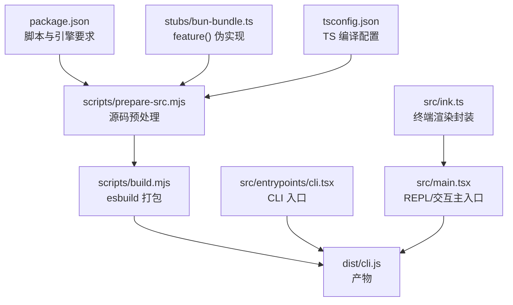
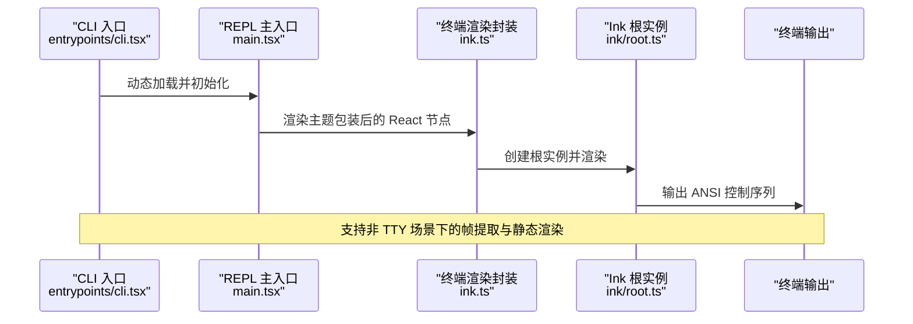
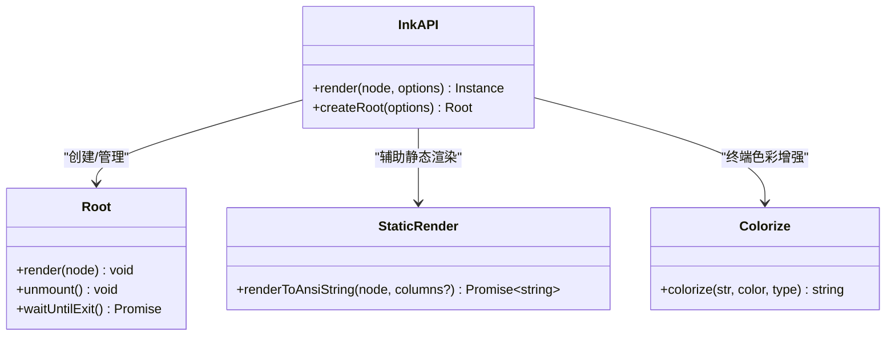
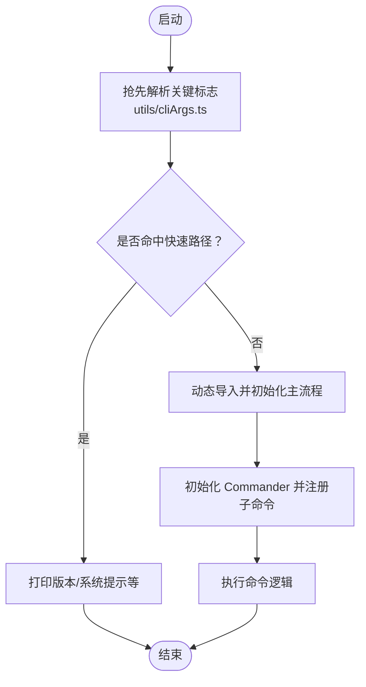
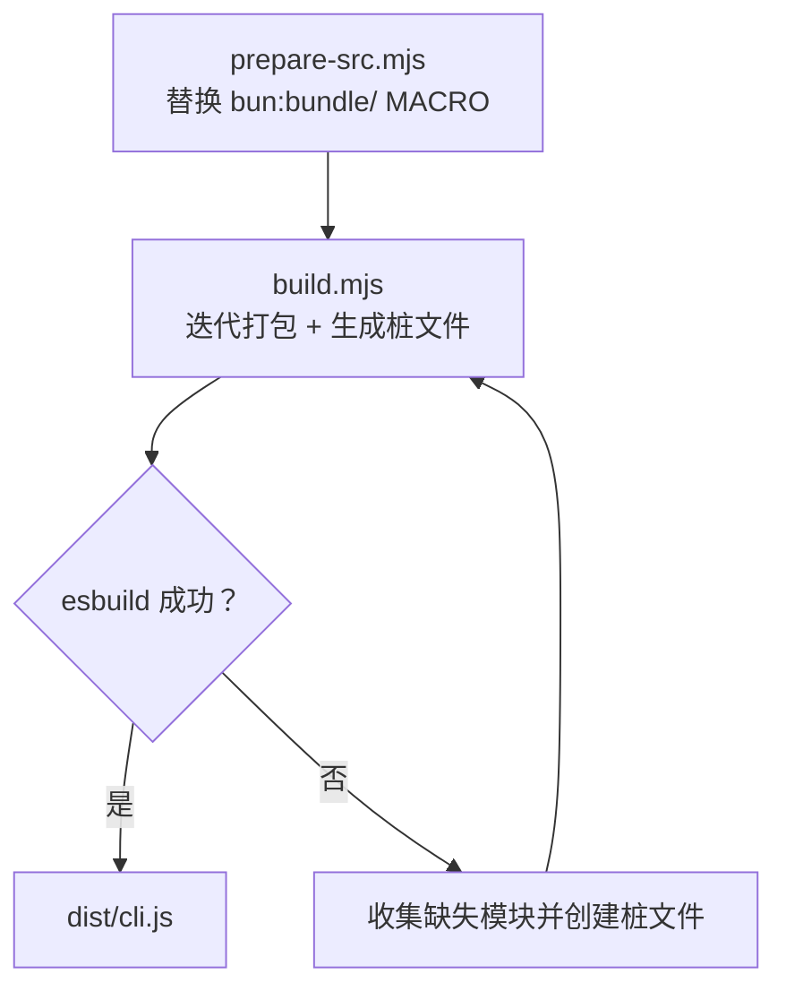
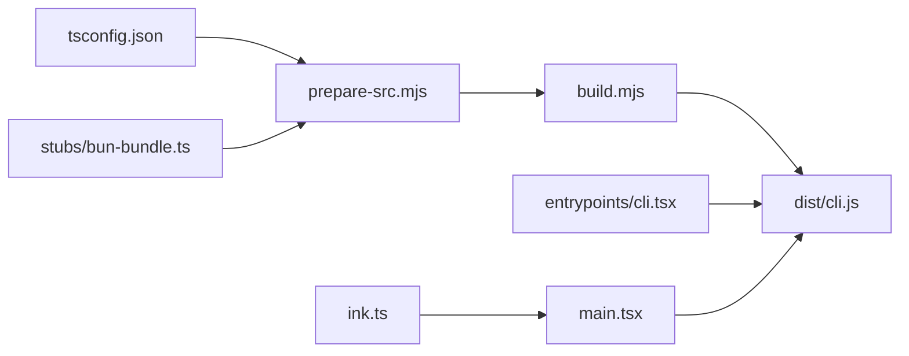

# 技术栈

<cite>
**本文引用的文件**
- [package.json](file://package.json)
- [tsconfig.json](file://tsconfig.json)
- [README.md](file://README.md)
- [QUICKSTART.md](file://QUICKSTART.md)
- [scripts/prepare-src.mjs](file://scripts/prepare-src.mjs)
- [scripts/build.mjs](file://scripts/build.mjs)
- [stubs/bun-bundle.ts](file://stubs/bun-bundle.ts)
- [src/main.tsx](file://src/main.tsx)
- [src/entrypoints/cli.tsx](file://src/entrypoints/cli.tsx)
- [src/ink.ts](file://src/ink.ts)
- [src/ink/root.ts](file://src/ink/root.ts)
- [src/utils/staticRender.tsx](file://src/utils/staticRender.tsx)
- [src/utils/bundledMode.ts](file://src/utils/bundledMode.ts)
- [src/utils/cliArgs.ts](file://src/utils/cliArgs.ts)
- [src/ink/colorize.ts](file://src/ink/colorize.ts)
</cite>

## 目录
1. [引言](#引言)
2. [项目结构](#项目结构)
3. [核心组件](#核心组件)
4. [架构总览](#架构总览)
5. [详细组件分析](#详细组件分析)
6. [依赖关系分析](#依赖关系分析)
7. [性能考量](#性能考量)
8. [故障排查指南](#故障排查指南)
9. [结论](#结论)
10. [附录](#附录)

## 引言
本技术栈文档面向开发者，系统梳理 Claude Code 的技术选型与实现要点，重点说明：
- 以 TypeScript 为主要开发语言的原因与优势
- React 与 Ink 组合在终端渲染中的应用与双端适配
- 构建工具链（esbuild）与编译时工具（Bun intrinsics）的配合
- 命令行解析（@commander-js）、终端样式（chalk）等关键库的作用
- 运行时环境要求（Node.js 版本、Bun 运行时支持）
- 技术选型的权衡（性能、可维护性、开发体验）

## 项目结构
该项目采用“源码分层 + 多入口”的组织方式：
- 源码位于 src/，包含 CLI、REPL、React 组件、服务层、工具系统、任务系统等
- 构建脚本位于 scripts/，通过预处理与 esbuild 实现最佳努力的“无 Bun”构建
- 运行时兼容层位于 stubs/，用于模拟 Bun 编译期特性（如 feature()、MACRO.*）
- 文档与快速开始位于 README.md 与 QUICKSTART.md

图表来源
- [package.json:1-21](file://package.json#L1-L21)
- [scripts/prepare-src.mjs:1-116](file://scripts/prepare-src.mjs#L1-L116)
- [scripts/build.mjs:1-246](file://scripts/build.mjs#L1-L246)
- [stubs/bun-bundle.ts:1-5](file://stubs/bun-bundle.ts#L1-L5)
- [tsconfig.json:1-37](file://tsconfig.json#L1-L37)
- [src/entrypoints/cli.tsx:1-200](file://src/entrypoints/cli.tsx#L1-L200)
- [src/main.tsx:1-200](file://src/main.tsx#L1-L200)
- [src/ink.ts:1-86](file://src/ink.ts#L1-L86)

章节来源
- [README.md:250-380](file://README.md#L250-L380)
- [QUICKSTART.md:1-122](file://QUICKSTART.md#L1-L122)

## 核心组件
- TypeScript：统一类型系统、严格的编译选项、声明输出，便于跨平台与静态分析
- React + Ink：在终端中渲染 React 组件，提供一致的 UI 开发体验与组件化能力
- esbuild：快速打包，支持外部依赖、sourcemap、目标平台与格式
- @commander-js：命令行参数解析与帮助信息生成
- chalk：终端颜色与样式增强，适配不同终端环境（含 VS Code、tmux）
- Bun 编译期特性（feature()、MACRO.*、bun:bundle）：用于死代码消除与宏替换，构建脚本提供近似实现

章节来源
- [tsconfig.json:2-26](file://tsconfig.json#L2-L26)
- [src/entrypoints/cli.tsx:1-200](file://src/entrypoints/cli.tsx#L1-L200)
- [src/ink.ts:1-86](file://src/ink.ts#L1-L86)
- [src/ink/colorize.ts:1-112](file://src/ink/colorize.ts#L1-L112)
- [scripts/build.mjs:1-246](file://scripts/build.mjs#L1-L246)
- [stubs/bun-bundle.ts:1-5](file://stubs/bun-bundle.ts#L1-L5)

## 架构总览
从入口到渲染的关键流程如下：

图表来源
- [src/entrypoints/cli.tsx:1-200](file://src/entrypoints/cli.tsx#L1-L200)
- [src/main.tsx:1-200](file://src/main.tsx#L1-L200)
- [src/ink.ts:18-31](file://src/ink.ts#L18-L31)
- [src/ink/root.ts:76-95](file://src/ink/root.ts#L76-L95)
- [src/utils/staticRender.tsx:57-91](file://src/utils/staticRender.tsx#L57-L91)

## 详细组件分析

### TypeScript 与构建配置
- 编译目标与模块系统：ES2022 + ESNext，启用 bundler 解析，支持 JSX（react-jsx）
- 类型与声明：开启声明输出与 sourcemap，路径映射 src/*，lib 包含 DOM 与 ES2022
- 关键路径别名：bun:bundle 映射至 stubs/bun-bundle.ts，便于 esbuild 打包
- 运行时检测：通过 src/utils/bundledMode.ts 判断是否运行于 Bun 环境

章节来源
- [tsconfig.json:2-26](file://tsconfig.json#L2-L26)
- [tsconfig.json:19-22](file://tsconfig.json#L19-L22)
- [src/utils/bundledMode.ts:1-22](file://src/utils/bundledMode.ts#L1-L22)

### React 与 Ink 终端渲染
- ink.ts 对外导出渲染函数与常用组件，统一注入主题提供器，简化调用方使用
- ink/root.ts 提供同步渲染与根实例管理，支持 rerender/unmount/waitUntilExit
- staticRender.tsx 提供将首帧内容提取为 ANSI 字符串的能力，适配非 TTY 输出场景
- colorize.ts 针对 VS Code 与 tmux 等终端环境进行 chalk 等级调整，保证色彩一致性

图表来源
- [src/ink.ts:18-31](file://src/ink.ts#L18-L31)
- [src/ink/root.ts:67-71](file://src/ink/root.ts#L67-L71)
- [src/utils/staticRender.tsx:74-91](file://src/utils/staticRender.tsx#L74-L91)
- [src/ink/colorize.ts:69-112](file://src/ink/colorize.ts#L69-L112)

章节来源
- [src/ink.ts:1-86](file://src/ink.ts#L1-L86)
- [src/ink/root.ts:46-71](file://src/ink/root.ts#L46-L71)
- [src/utils/staticRender.tsx:57-91](file://src/utils/staticRender.tsx#L57-L91)
- [src/ink/colorize.ts:20-62](file://src/ink/colorize.ts#L20-L62)

### 命令行解析与参数处理
- 使用 @commander-js/extra-typings 定义命令与选项，支持排序帮助信息与位置参数
- utils/cliArgs.ts 提供对特定标志的“抢先解析”，确保在初始化前读取必要配置
- CLI 入口通过动态导入实现快速路径（如 --version），减少模块加载开销

图表来源
- [src/utils/cliArgs.ts:13-60](file://src/utils/cliArgs.ts#L13-L60)
- [src/entrypoints/cli.tsx:33-93](file://src/entrypoints/cli.tsx#L33-L93)
- [src/main.tsx:887-903](file://src/main.tsx#L887-L903)

章节来源
- [src/entrypoints/cli.tsx:1-200](file://src/entrypoints/cli.tsx#L1-L200)
- [src/utils/cliArgs.ts:1-60](file://src/utils/cliArgs.ts#L1-L60)
- [src/main.tsx:887-903](file://src/main.tsx#L887-L903)

### 构建与打包（esbuild + Bun 编译期特性）
- prepare-src.mjs：将 Bun 编译期特性替换为可运行的近似实现（bun:bundle → stub；MACRO.* → 字面量）
- build.mjs：迭代式打包（esbuild），收集缺失模块并自动生成桩文件，最多重试若干轮
- 运行时说明：README 指出完整构建需 Bun（包含 compile-time intrinsics），esbuild 仅能“最佳努力”

图表来源
- [scripts/prepare-src.mjs:36-77](file://scripts/prepare-src.mjs#L36-L77)
- [scripts/build.mjs:144-173](file://scripts/build.mjs#L144-L173)
- [scripts/build.mjs:196-229](file://scripts/build.mjs#L196-L229)

章节来源
- [scripts/prepare-src.mjs:1-116](file://scripts/prepare-src.mjs#L1-L116)
- [scripts/build.mjs:1-246](file://scripts/build.mjs#L1-L246)
- [README.md:222-223](file://README.md#L222-L223)

### 运行时环境与兼容性
- Node.js 版本：engines 要求 >= 18
- Bun 运行时：通过 isRunningWithBun()/isInBundledMode() 检测运行环境，支持 Bun 编译产物
- 终端样式：chalk 在 VS Code 与 tmux 等环境下自动调整等级，保证色彩一致

章节来源
- [package.json:13-15](file://package.json#L13-L15)
- [src/utils/bundledMode.ts:1-22](file://src/utils/bundledMode.ts#L1-L22)
- [src/ink/colorize.ts:20-62](file://src/ink/colorize.ts#L20-L62)

## 依赖关系分析
- 源码预处理阶段：prepare-src.mjs 将 Bun 编译期特性替换为 stubs 中的实现，避免直接依赖 Bun
- 打包阶段：build.mjs 通过 esbuild 将 src/ 打包为单文件 CLI，同时处理缺失模块的桩文件
- 运行时：CLI 入口与 REPL 主入口动态导入，减少冷启动时间；Ink 封装统一渲染

图表来源
- [tsconfig.json:19-22](file://tsconfig.json#L19-L22)
- [scripts/prepare-src.mjs:40-51](file://scripts/prepare-src.mjs#L40-L51)
- [scripts/build.mjs:149-168](file://scripts/build.mjs#L149-L168)
- [src/entrypoints/cli.tsx:1-200](file://src/entrypoints/cli.tsx#L1-200)
- [src/main.tsx:1-200](file://src/main.tsx#L1-200)
- [src/ink.ts:1-86](file://src/ink.ts#L1-86)

章节来源
- [tsconfig.json:19-22](file://tsconfig.json#L19-L22)
- [scripts/prepare-src.mjs:1-116](file://scripts/prepare-src.mjs#L1-L116)
- [scripts/build.mjs:1-246](file://scripts/build.mjs#L1-L246)
- [src/entrypoints/cli.tsx:1-200](file://src/entrypoints/cli.tsx#L1-L200)
- [src/main.tsx:1-200](file://src/main.tsx#L1-200)
- [src/ink.ts:1-86](file://src/ink.ts#L1-86)

## 性能考量
- 冷启动优化：CLI 入口对 --version 等路径进行零模块加载的快速路径；动态导入减少初始模块评估
- 渲染性能：Ink 提供帧级渲染与实例复用，减少重复挂载成本
- 打包体积：通过 feature() 死代码消除与 esbuild 快速打包，降低分发体积
- 终端色彩：chalk 等级自适应在不同终端下保持视觉一致性，避免额外渲染损耗

章节来源
- [src/entrypoints/cli.tsx:36-42](file://src/entrypoints/cli.tsx#L36-L42)
- [src/ink/root.ts:67-71](file://src/ink/root.ts#L67-L71)
- [src/ink/colorize.ts:20-62](file://src/ink/colorize.ts#L20-L62)
- [scripts/build.mjs:149-168](file://scripts/build.mjs#L149-L168)

## 故障排查指南
- 构建失败（缺少模块）：根据 esbuild 输出的“Could not resolve”逐项创建桩文件，再重新构建
- 非 TTY 输出异常：使用 staticRender.tsx 提取首帧 ANSI 内容，或检查终端是否支持同步更新序列
- 颜色显示异常：确认终端环境变量（如 VS Code、tmux），chalk 会自动降级或提升等级以适配
- 运行时检测：若需要区分 Bun 与 Node 环境，可通过 isRunningWithBun()/isInBundledMode() 判断

章节来源
- [scripts/build.mjs:175-229](file://scripts/build.mjs#L175-L229)
- [src/utils/staticRender.tsx:57-91](file://src/utils/staticRender.tsx#L57-L91)
- [src/ink/colorize.ts:20-62](file://src/ink/colorize.ts#L20-L62)
- [src/utils/bundledMode.ts:1-22](file://src/utils/bundledMode.ts#L1-L22)

## 结论
本项目通过 TypeScript 提供强类型保障，结合 React + Ink 在终端中实现一致的 UI 开发体验；借助 @commander-js 与 chalk 提升命令行可用性与终端表现力；构建链路以 esbuild 为核心，配合 stubs 与迭代式桩文件策略，在“无 Bun”环境下实现“最佳努力”的可运行产物。运行时对 Bun 与 Node 的兼容检测进一步增强了部署灵活性。

## 附录
- 学习路径建议
  - TypeScript：掌握编译配置、路径映射与严格模式
  - React + Ink：学习组件化与终端渲染、主题与样式
  - 命令行：使用 @commander-js 定义子命令与选项，结合抢先解析
  - 构建：理解 esbuild 打包、外部依赖与 sourcemap
  - 终端兼容：了解 chalk 等级与不同终端的适配策略
- 相关资源
  - [TypeScript 官方文档](https://www.typescriptlang.org/docs/)
  - [React 官方文档](https://react.dev/)
  - [Ink 官方文档](https://github.com/vadimdemedes/ink)
  - [Commander.js 官方文档](https://github.com/tj/commander.js)
  - [esbuild 官方文档](https://esbuild.github.io/)