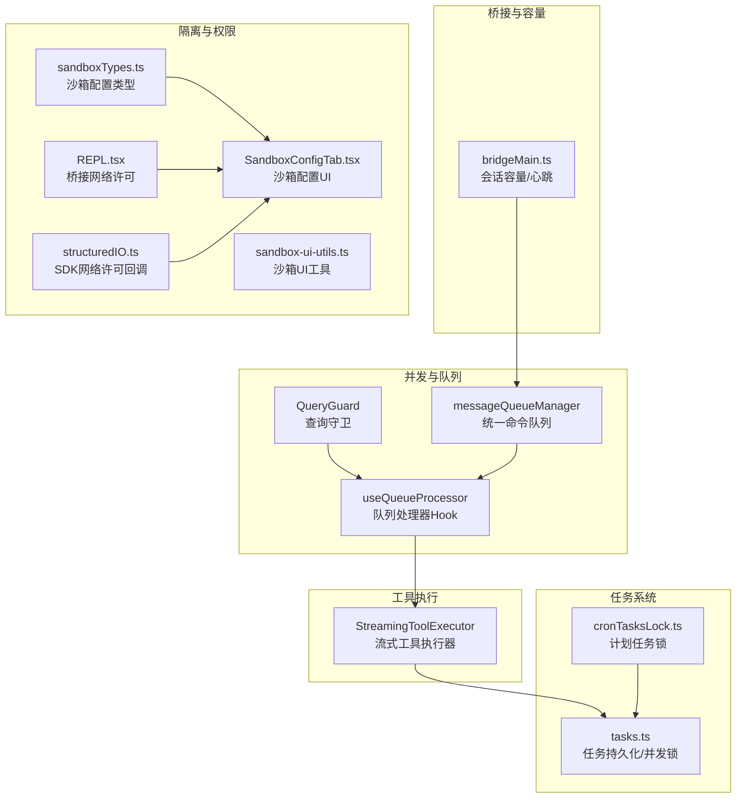
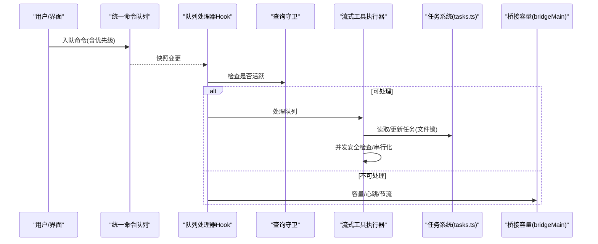
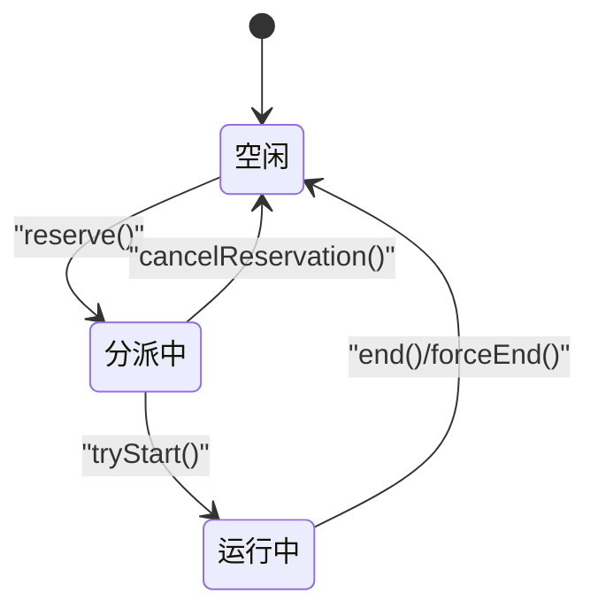
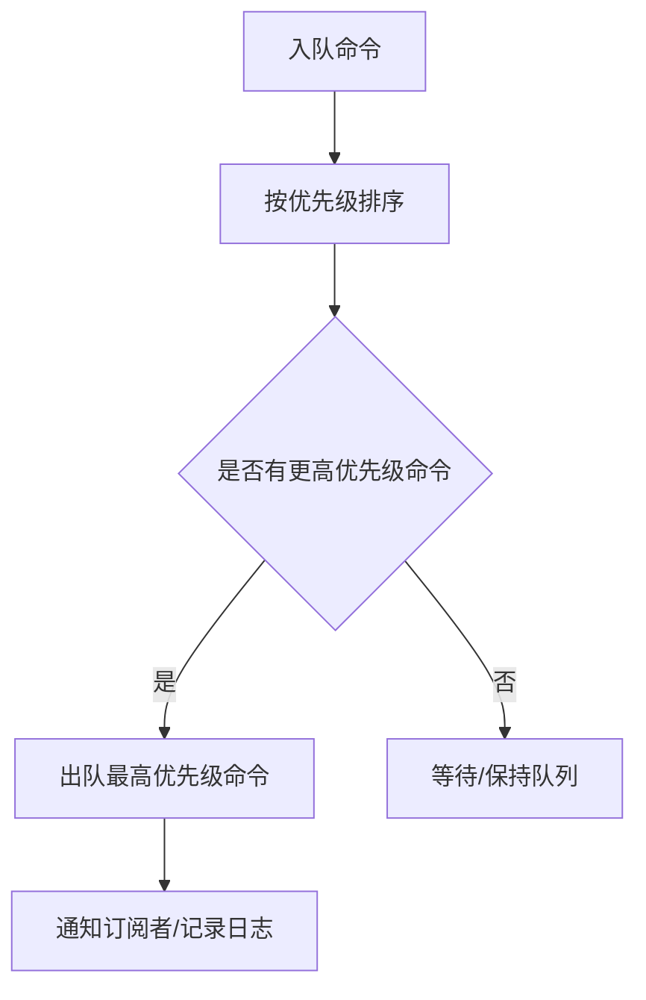
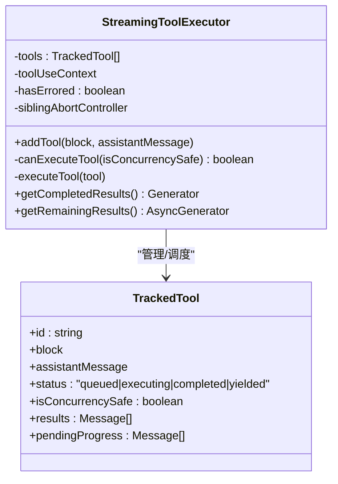
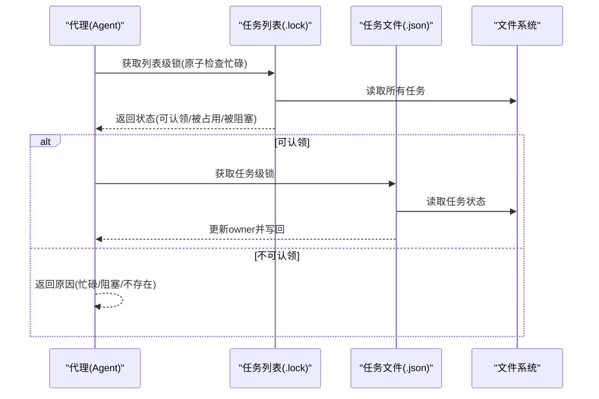
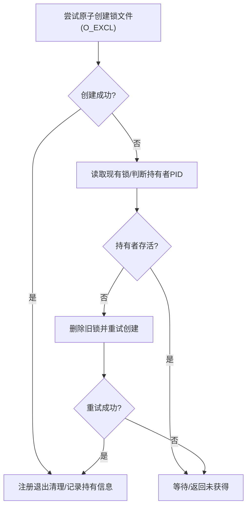
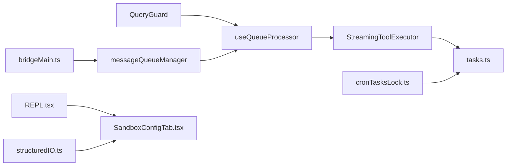

# 任务并发控制

<cite>
**本文引用的文件**
- [src/utils/tasks.ts](file://src/utils/tasks.ts)
- [src/services/tools/StreamingToolExecutor.ts](file://src/services/tools/StreamingToolExecutor.ts)
- [src/utils/QueryGuard.ts](file://src/utils/QueryGuard.ts)
- [src/hooks/useQueueProcessor.ts](file://src/hooks/useQueueProcessor.ts)
- [src/utils/messageQueueManager.ts](file://src/utils/messageQueueManager.ts)
- [src/utils/cronTasksLock.ts](file://src/utils/cronTasksLock.ts)
- [src/utils/lockfile.ts](file://src/utils/lockfile.ts)
- [src/bridge/bridgeMain.ts](file://src/bridge/bridgeMain.ts)
- [src/utils/sequential.ts](file://src/utils/sequential.ts)
- [src/services/claudeAiLimits.ts](file://src/services/claudeAiLimits.ts)
- [src/entrypoints/sandboxTypes.ts](file://src/entrypoints/sandboxTypes.ts)
- [src/components/sandbox/SandboxConfigTab.tsx](file://src/components/sandbox/SandboxConfigTab.tsx)
- [src/utils/sandbox/sandbox-ui-utils.ts](file://src/utils/sandbox/sandbox-ui-utils.ts)
- [src/screens/REPL.tsx](file://src/screens/REPL.tsx)
- [src/cli/structuredIO.ts](file://src/cli/structuredIO.ts)
</cite>

## 目录
1. [引言](#引言)
2. [项目结构](#项目结构)
3. [核心组件](#核心组件)
4. [架构总览](#架构总览)
5. [详细组件分析](#详细组件分析)
6. [依赖关系分析](#依赖关系分析)
7. [性能考量](#性能考量)
8. [故障排查指南](#故障排查指南)
9. [结论](#结论)
10. [附录](#附录)

## 引言
本文件系统性梳理 Claude Code 的“任务并发控制”体系，围绕以下目标展开：并发限制与资源配额、优先级调度、任务间同步与互斥（锁、信号量、条件变量）、任务隔离（进程/内存/网络）、资源共享与竞争处理、性能优化（并行度与负载均衡）、死锁预防与检测、异常恢复策略。文档以代码为依据，辅以可视化图示帮助理解。

## 项目结构
与任务并发控制直接相关的模块主要分布在以下区域：
- 任务生命周期与并发控制：src/utils/tasks.ts、src/services/tools/StreamingToolExecutor.ts
- 查询/回合并发守卫：src/utils/QueryGuard.ts、src/hooks/useQueueProcessor.ts、src/utils/messageQueueManager.ts
- 资源/锁与容量控制：src/utils/cronTasksLock.ts、src/utils/lockfile.ts、src/bridge/bridgeMain.ts
- 顺序化与串行化：src/utils/sequential.ts
- 限额与配额：src/services/claudeAiLimits.ts
- 隔离与安全边界：src/entrypoints/sandboxTypes.ts、src/components/sandbox/SandboxConfigTab.tsx、src/utils/sandbox/sandbox-ui-utils.ts、src/screens/REPL.tsx、src/cli/structuredIO.ts

**图表来源**
- [src/utils/QueryGuard.ts:1-122](file://src/utils/QueryGuard.ts#L1-L122)
- [src/utils/messageQueueManager.ts:123-292](file://src/utils/messageQueueManager.ts#L123-L292)
- [src/hooks/useQueueProcessor.ts:1-69](file://src/hooks/useQueueProcessor.ts#L1-L69)
- [src/services/tools/StreamingToolExecutor.ts:1-531](file://src/services/tools/StreamingToolExecutor.ts#L1-L531)
- [src/utils/tasks.ts:1-863](file://src/utils/tasks.ts#L1-L863)
- [src/utils/cronTasksLock.ts:1-196](file://src/utils/cronTasksLock.ts#L1-L196)
- [src/bridge/bridgeMain.ts:748-784](file://src/bridge/bridgeMain.ts#L748-L784)
- [src/entrypoints/sandboxTypes.ts:1-42](file://src/entrypoints/sandboxTypes.ts#L1-L42)
- [src/components/sandbox/SandboxConfigTab.tsx:1-34](file://src/components/sandbox/SandboxConfigTab.tsx#L1-L34)
- [src/utils/sandbox/sandbox-ui-utils.ts:1-12](file://src/utils/sandbox/sandbox-ui-utils.ts#L1-L12)
- [src/screens/REPL.tsx:2267-2295](file://src/screens/REPL.tsx#L2267-L2295)
- [src/cli/structuredIO.ts:723-753](file://src/cli/structuredIO.ts#L723-L753)

**章节来源**
- [src/utils/QueryGuard.ts:1-122](file://src/utils/QueryGuard.ts#L1-L122)
- [src/utils/messageQueueManager.ts:123-292](file://src/utils/messageQueueManager.ts#L123-L292)
- [src/hooks/useQueueProcessor.ts:1-69](file://src/hooks/useQueueProcessor.ts#L1-L69)
- [src/services/tools/StreamingToolExecutor.ts:1-531](file://src/services/tools/StreamingToolExecutor.ts#L1-L531)
- [src/utils/tasks.ts:1-863](file://src/utils/tasks.ts#L1-L863)
- [src/utils/cronTasksLock.ts:1-196](file://src/utils/cronTasksLock.ts#L1-L196)
- [src/bridge/bridgeMain.ts:748-784](file://src/bridge/bridgeMain.ts#L748-L784)
- [src/entrypoints/sandboxTypes.ts:1-42](file://src/entrypoints/sandboxTypes.ts#L1-L42)
- [src/components/sandbox/SandboxConfigTab.tsx:1-34](file://src/components/sandbox/SandboxConfigTab.tsx#L1-L34)
- [src/utils/sandbox/sandbox-ui-utils.ts:1-12](file://src/utils/sandbox/sandbox-ui-utils.ts#L1-L12)
- [src/screens/REPL.tsx:2267-2295](file://src/screens/REPL.tsx#L2267-L2295)
- [src/cli/structuredIO.ts:723-753](file://src/cli/structuredIO.ts#L723-L753)

## 核心组件
- 查询守卫（QueryGuard）：通过状态机管理“空闲/分派中/运行中”，防止队列处理器在异步间隙内重入，保障并发安全。
- 统一命令队列（messageQueueManager）：集中管理用户输入、任务通知等命令，支持优先级（now/next/later）与FIFO。
- 队列处理器Hook（useQueueProcessor）：基于守卫与队列快照触发处理，避免与本地UI交互冲突。
- 流式工具执行器（StreamingToolExecutor）：按并发安全策略执行工具，非并发安全工具串行独占，其余可并行。
- 任务系统（tasks.ts）：基于文件锁的原子操作，支持任务创建、更新、删除、认领、阻塞关系维护与代理状态统计。
- 计划任务锁（cronTasksLock.ts）：多会话间唯一调度者选举，避免重复执行。
- 桥接容量控制（bridgeMain.ts）：会话数量上限、心跳与节流、去重已结束工作项。
- 沙箱与网络隔离（sandboxTypes.ts、SandboxConfigTab.tsx、sandbox-ui-utils.ts、REPL.tsx、structuredIO.ts）：网络域白名单、代理端口、Unix Socket控制、跨端许可转发。

**章节来源**
- [src/utils/QueryGuard.ts:1-122](file://src/utils/QueryGuard.ts#L1-L122)
- [src/utils/messageQueueManager.ts:123-292](file://src/utils/messageQueueManager.ts#L123-L292)
- [src/hooks/useQueueProcessor.ts:1-69](file://src/hooks/useQueueProcessor.ts#L1-L69)
- [src/services/tools/StreamingToolExecutor.ts:1-531](file://src/services/tools/StreamingToolExecutor.ts#L1-L531)
- [src/utils/tasks.ts:1-863](file://src/utils/tasks.ts#L1-L863)
- [src/utils/cronTasksLock.ts:1-196](file://src/utils/cronTasksLock.ts#L1-L196)
- [src/bridge/bridgeMain.ts:748-784](file://src/bridge/bridgeMain.ts#L748-L784)
- [src/entrypoints/sandboxTypes.ts:1-42](file://src/entrypoints/sandboxTypes.ts#L1-L42)
- [src/components/sandbox/SandboxConfigTab.tsx:1-34](file://src/components/sandbox/SandboxConfigTab.tsx#L1-L34)
- [src/utils/sandbox/sandbox-ui-utils.ts:1-12](file://src/utils/sandbox/sandbox-ui-utils.ts#L1-L12)
- [src/screens/REPL.tsx:2267-2295](file://src/screens/REPL.tsx#L2267-L2295)
- [src/cli/structuredIO.ts:723-753](file://src/cli/structuredIO.ts#L723-L753)

## 架构总览
下图展示从“命令入队”到“工具执行”的关键路径，以及并发守卫、队列优先级、工具并发策略与任务系统之间的交互。

**图表来源**
- [src/utils/messageQueueManager.ts:123-292](file://src/utils/messageQueueManager.ts#L123-L292)
- [src/hooks/useQueueProcessor.ts:1-69](file://src/hooks/useQueueProcessor.ts#L1-L69)
- [src/utils/QueryGuard.ts:1-122](file://src/utils/QueryGuard.ts#L1-L122)
- [src/services/tools/StreamingToolExecutor.ts:1-531](file://src/services/tools/StreamingToolExecutor.ts#L1-L531)
- [src/utils/tasks.ts:1-863](file://src/utils/tasks.ts#L1-L863)
- [src/bridge/bridgeMain.ts:748-784](file://src/bridge/bridgeMain.ts#L748-L784)

## 详细组件分析

### 组件A：查询守卫与回合并发控制
- 状态机：idle → dispatching → running → idle；提供 reserve/cancelReservation/tryStart/end/forceEnd。
- 与React集成：通过useSyncExternalStore暴露isActive，避免批处理延迟导致的误判。
- 作用：确保队列处理器在异步链路完成前不会再次进入，避免重入与竞态。

**图表来源**
- [src/utils/QueryGuard.ts:1-122](file://src/utils/QueryGuard.ts#L1-L122)

**章节来源**
- [src/utils/QueryGuard.ts:1-122](file://src/utils/QueryGuard.ts#L1-L122)
- [src/hooks/useQueueProcessor.ts:1-69](file://src/hooks/useQueueProcessor.ts#L1-L69)

### 组件B：统一命令队列与优先级调度
- 优先级：now > next（用户输入）> later（任务通知），同优先级FIFO。
- 支持过滤、批量出队、移除特定命令等操作，便于跨线程/跨端场景隔离处理。
- 与队列处理器Hook配合，基于快照触发处理，避免UI阻塞。

**图表来源**
- [src/utils/messageQueueManager.ts:123-292](file://src/utils/messageQueueManager.ts#L123-L292)

**章节来源**
- [src/utils/messageQueueManager.ts:123-292](file://src/utils/messageQueueManager.ts#L123-L292)
- [src/hooks/useQueueProcessor.ts:1-69](file://src/hooks/useQueueProcessor.ts#L1-L69)

### 组件C：流式工具执行器与并发策略
- 工具分类：并发安全/不安全；并发安全工具可并行，不安全工具需独占执行。
- 执行顺序：严格按接收顺序缓冲结果，保证输出一致性。
- 中断与错误传播：兄弟工具错误（如Bash失败）通过子AbortController广播，其他工具同步取消；用户中断按行为策略决定取消或阻塞。
- 进度消息：独立队列立即产出，提升交互体验。

**图表来源**
- [src/services/tools/StreamingToolExecutor.ts:1-531](file://src/services/tools/StreamingToolExecutor.ts#L1-L531)

**章节来源**
- [src/services/tools/StreamingToolExecutor.ts:1-531](file://src/services/tools/StreamingToolExecutor.ts#L1-L531)

### 组件D：任务系统与文件锁并发控制
- 原子操作：任务创建/更新/删除均使用文件锁，避免多进程/多线程竞态。
- 列表级锁：任务列表级.lock文件用于“认领前原子检查代理忙碌状态”，防止TOCTOU。
- 任务状态与阻塞：支持owner、blocks/blockedBy、高水位标记防止ID回绕。
- 代理状态统计：基于任务所有权计算“空闲/忙碌”。

**图表来源**
- [src/utils/tasks.ts:534-692](file://src/utils/tasks.ts#L534-L692)

**章节来源**
- [src/utils/tasks.ts:1-863](file://src/utils/tasks.ts#L1-L863)

### 组件E：计划任务锁与多会话协调
- 唯一调度者：通过O_EXCL原子创建与PID存活探测，确保同一项目目录仅一个会话驱动计划任务。
- 僵尸锁恢复：若锁持有者进程不存在则清理并重试获取。
- 生命周期清理：进程退出时自动释放锁。

**图表来源**
- [src/utils/cronTasksLock.ts:100-195](file://src/utils/cronTasksLock.ts#L100-L195)

**章节来源**
- [src/utils/cronTasksLock.ts:1-196](file://src/utils/cronTasksLock.ts#L1-L196)

### 组件F：桥接容量控制与会话节流
- 会话上限：根据配置限制最大会话数，超过时进行心跳保活但拒绝新工作。
- 去重与节流：跳过已完成的工作ID；在容量饱和时进行心跳与睡眠节流，避免轮询风暴。
- 与统一命令队列协作：在不可处理状态下仍维持心跳与短暂停顿。

**章节来源**
- [src/bridge/bridgeMain.ts:748-784](file://src/bridge/bridgeMain.ts#L748-L784)

### 组件G：顺序化与串行化工具
- sequential包装器：将并发调用串行化，保证顺序与正确返回值，适用于文件写入等易冲突操作。
- 适用场景：需要严格顺序且避免竞态的异步函数。

**章节来源**
- [src/utils/sequential.ts:1-57](file://src/utils/sequential.ts#L1-L57)

### 组件H：限额与配额提示
- 早期预警：基于五小时/七日窗口与阈值组合，向用户发出配额消耗过快的提示。
- 显示名称映射：将限额类型映射为可读名称，辅助UI呈现。

**章节来源**
- [src/services/claudeAiLimits.ts:43-89](file://src/services/claudeAiLimits.ts#L43-L89)

### 组件I：沙箱与网络隔离
- 沙箱配置：允许域白名单、仅受管域名、Unix Socket控制、本地绑定、HTTP/SOCKS代理端口等。
- UI与交互：配置页显示启用状态与依赖警告；REPL/CLI将网络许可请求转发至宿主进行审批。
- 沙箱违规清理：UI工具可移除沙箱违规标签，改善错误信息可读性。

**章节来源**
- [src/entrypoints/sandboxTypes.ts:1-42](file://src/entrypoints/sandboxTypes.ts#L1-L42)
- [src/components/sandbox/SandboxConfigTab.tsx:1-34](file://src/components/sandbox/SandboxConfigTab.tsx#L1-L34)
- [src/utils/sandbox/sandbox-ui-utils.ts:1-12](file://src/utils/sandbox/sandbox-ui-utils.ts#L1-L12)
- [src/screens/REPL.tsx:2267-2295](file://src/screens/REPL.tsx#L2267-L2295)
- [src/cli/structuredIO.ts:723-753](file://src/cli/structuredIO.ts#L723-L753)

## 依赖关系分析
- 并发守卫与队列处理器：QueryGuard与messageQueueManager共同构成“回合级并发控制”的基础。
- 工具执行器依赖任务系统：在工具执行过程中可能读取/更新任务状态，从而引入文件锁依赖。
- 计划任务锁与任务系统：两者均依赖文件锁与进程PID存活探测，确保唯一性与健壮性。
- 桥接容量控制：与统一命令队列协同，在容量饱和时进行节流与心跳保活。
- 沙箱与网络：REPL/CLI通过“can_use_tool”协议转发网络许可请求，形成跨端一致的权限控制。

**图表来源**
- [src/utils/QueryGuard.ts:1-122](file://src/utils/QueryGuard.ts#L1-L122)
- [src/hooks/useQueueProcessor.ts:1-69](file://src/hooks/useQueueProcessor.ts#L1-L69)
- [src/utils/messageQueueManager.ts:123-292](file://src/utils/messageQueueManager.ts#L123-L292)
- [src/services/tools/StreamingToolExecutor.ts:1-531](file://src/services/tools/StreamingToolExecutor.ts#L1-L531)
- [src/utils/tasks.ts:1-863](file://src/utils/tasks.ts#L1-L863)
- [src/utils/cronTasksLock.ts:1-196](file://src/utils/cronTasksLock.ts#L1-L196)
- [src/bridge/bridgeMain.ts:748-784](file://src/bridge/bridgeMain.ts#L748-L784)
- [src/screens/REPL.tsx:2267-2295](file://src/screens/REPL.tsx#L2267-L2295)
- [src/cli/structuredIO.ts:723-753](file://src/cli/structuredIO.ts#L723-L753)
- [src/components/sandbox/SandboxConfigTab.tsx:1-34](file://src/components/sandbox/SandboxConfigTab.tsx#L1-L34)

**章节来源**
- [src/utils/QueryGuard.ts:1-122](file://src/utils/QueryGuard.ts#L1-L122)
- [src/utils/messageQueueManager.ts:123-292](file://src/utils/messageQueueManager.ts#L123-L292)
- [src/hooks/useQueueProcessor.ts:1-69](file://src/hooks/useQueueProcessor.ts#L1-L69)
- [src/services/tools/StreamingToolExecutor.ts:1-531](file://src/services/tools/StreamingToolExecutor.ts#L1-L531)
- [src/utils/tasks.ts:1-863](file://src/utils/tasks.ts#L1-L863)
- [src/utils/cronTasksLock.ts:1-196](file://src/utils/cronTasksLock.ts#L1-L196)
- [src/bridge/bridgeMain.ts:748-784](file://src/bridge/bridgeMain.ts#L748-L784)
- [src/screens/REPL.tsx:2267-2295](file://src/screens/REPL.tsx#L2267-L2295)
- [src/cli/structuredIO.ts:723-753](file://src/cli/structuredIO.ts#L723-L753)
- [src/components/sandbox/SandboxConfigTab.tsx:1-34](file://src/components/sandbox/SandboxConfigTab.tsx#L1-L34)

## 性能考量
- 并行度调整
  - 工具并发：并发安全工具可并行，减少整体时延；非并发安全工具串行，避免资源争用。
  - 任务并发：文件锁退避重试（retries/backoff）平衡吞吐与延迟，适合多代理并发场景。
- 负载均衡
  - 统一命令队列优先级：用户输入优先于系统通知，避免UI饥饿；跨端场景可通过过滤器隔离命令来源。
  - 桥接容量：在达到会话上限时进行心跳保活与节流，避免轮询风暴。
- 资源配额
  - 限额早期预警：基于时间窗口与利用率阈值提示用户，避免突发用量导致的限流。
- I/O与锁
  - proper-lockfile惰性加载与stale超时设置，降低启动开销并容忍合理范围内的僵尸锁。

[本节为通用性能建议，无需具体文件分析]

## 故障排查指南
- 死锁预防与检测
  - 文件锁：采用O_EXCL原子创建与PID存活探测，结合stale超时与僵尸锁恢复，降低死锁风险。
  - 顺序化：对易冲突操作使用sequential包装，避免并发写入导致的竞态。
  - 工具中断：兄弟工具错误通过子AbortController传播，避免级联阻塞。
- 异常恢复
  - 计划任务锁：持有者进程消失时自动清理并重试，确保调度连续性。
  - 限额提示：当服务器未返回阈值头时，使用内置早期预警配置作为降级提示。
- 常见问题定位
  - 任务认领失败：检查任务是否存在、是否已被他人认领、是否被阻塞、代理是否正忙。
  - 工具执行卡住：确认工具是否为非并发安全类型，或是否存在兄弟工具错误导致的取消。
  - 网络许可：跨端场景下确认REPL/CLI已正确转发许可请求并得到响应。

**章节来源**
- [src/utils/cronTasksLock.ts:100-195](file://src/utils/cronTasksLock.ts#L100-L195)
- [src/utils/sequential.ts:1-57](file://src/utils/sequential.ts#L1-L57)
- [src/services/tools/StreamingToolExecutor.ts:207-241](file://src/services/tools/StreamingToolExecutor.ts#L207-L241)
- [src/utils/tasks.ts:534-692](file://src/utils/tasks.ts#L534-L692)
- [src/services/claudeAiLimits.ts:43-89](file://src/services/claudeAiLimits.ts#L43-L89)

## 结论
该系统通过“回合级守卫 + 统一队列 + 工具并发策略 + 文件锁原子操作 + 多会话协调 + 沙箱隔离”的组合，实现了稳定可控的任务并发执行。其设计兼顾了易用性与健壮性：在保证数据一致性的同时，提供了灵活的并发与优先级控制，并通过限额与隔离策略提升用户体验与安全性。

[本节为总结性内容，无需具体文件分析]

## 附录
- 关键流程速览
  - 命令入队 → 队列处理器检查守卫与优先级 → 工具执行器按并发策略执行 → 任务系统原子更新 → 桥接容量节流与心跳保活。
- 术语
  - 并发安全：工具可与其他并发安全工具并行执行。
  - 非并发安全：工具需独占执行，期间阻塞其他非并发安全工具。
  - 列表级锁：对整个任务列表加锁，用于原子检查代理忙碌状态。
  - 僵尸锁：持有者进程不存在的锁，系统会自动清理并重试。

[本节为补充说明，无需具体文件分析]