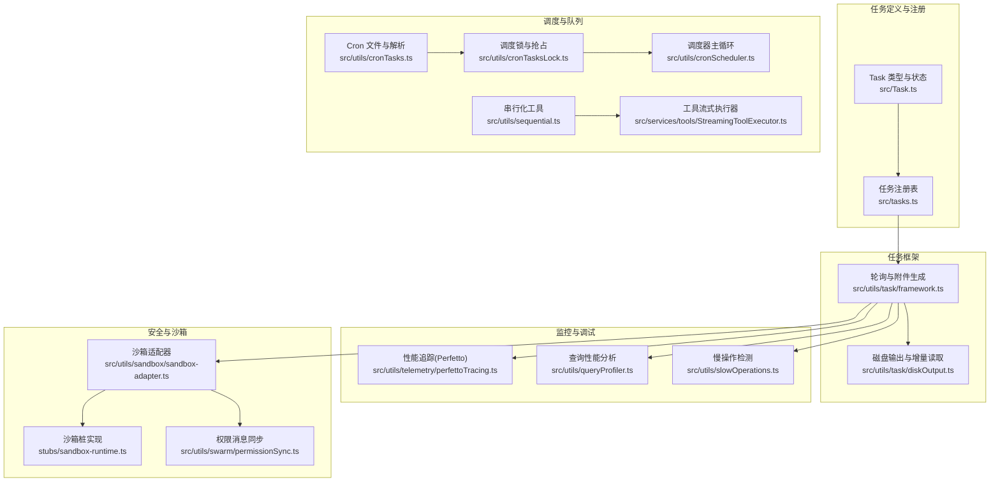
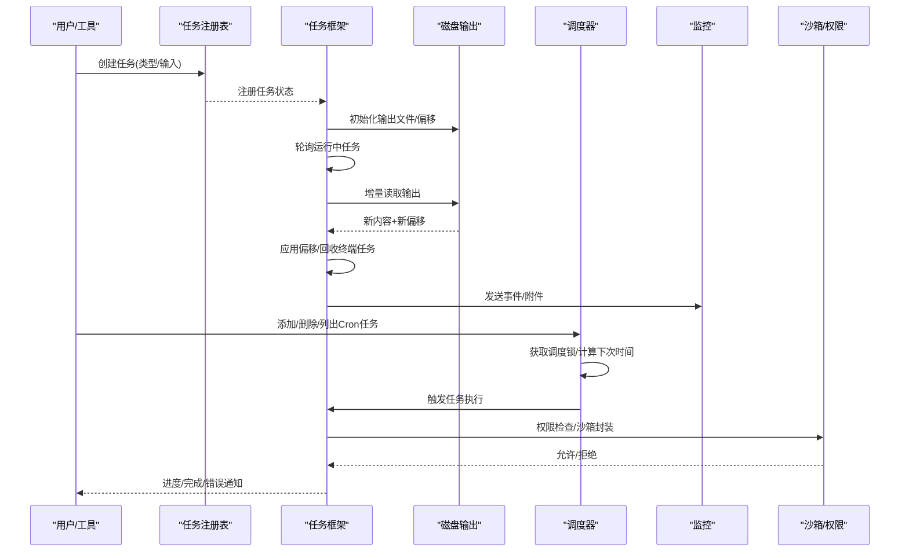
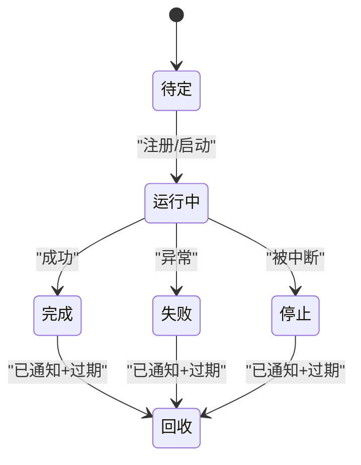
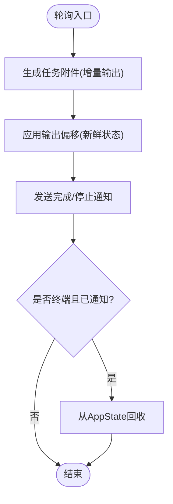
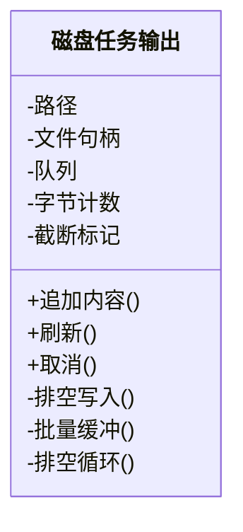
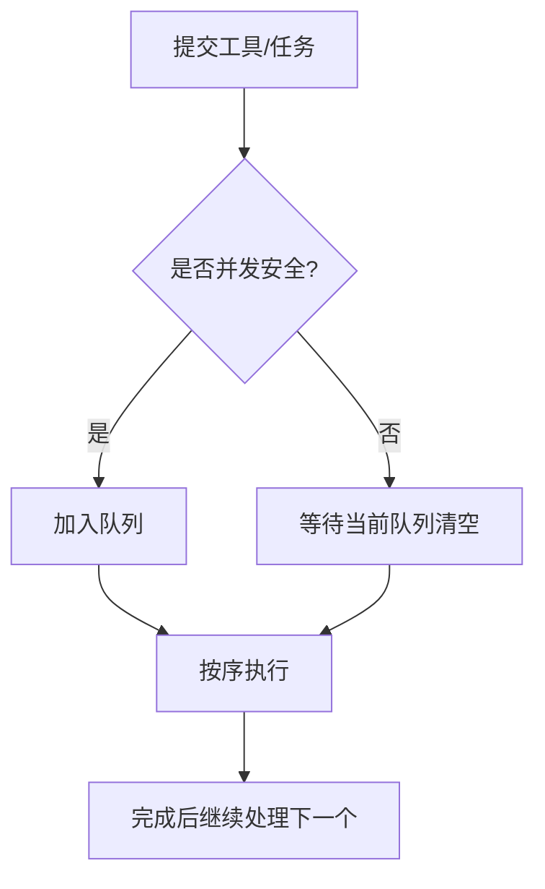
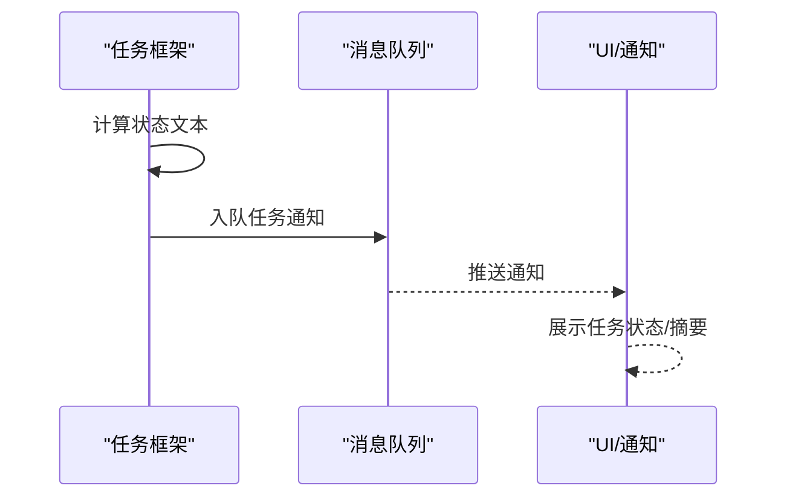
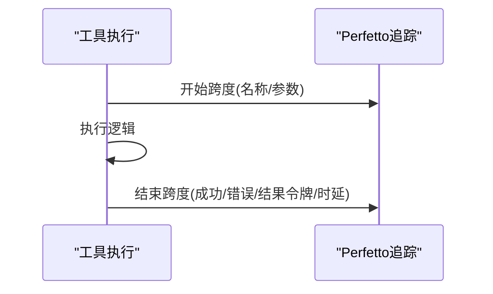
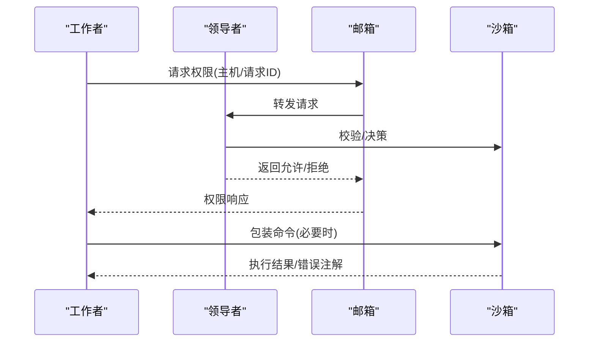
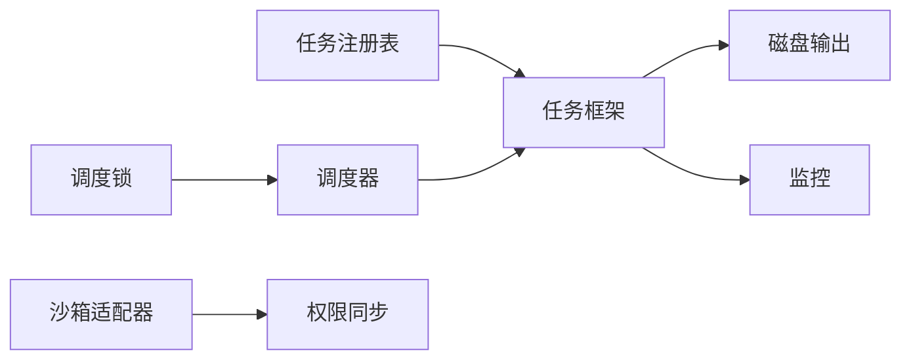

# 任务执行引擎

<cite>
**本文引用的文件**
- [src/Task.ts](file://src/Task.ts)
- [src/tasks.ts](file://src/tasks.ts)
- [src/utils/task/framework.ts](file://src/utils/task/framework.ts)
- [src/utils/task/diskOutput.ts](file://src/utils/task/diskOutput.ts)
- [src/utils/cronTasks.ts](file://src/utils/cronTasks.ts)
- [src/utils/cronTasksLock.ts](file://src/utils/cronTasksLock.ts)
- [src/utils/cronScheduler.ts](file://src/utils/cronScheduler.ts)
- [src/utils/sequential.ts](file://src/utils/sequential.ts)
- [src/services/tools/StreamingToolExecutor.ts](file://src/services/tools/StreamingToolExecutor.ts)
- [src/utils/telemetry/perfettoTracing.ts](file://src/utils/telemetry/perfettoTracing.ts)
- [src/utils/queryProfiler.ts](file://src/utils/queryProfiler.ts)
- [src/utils/slowOperations.ts](file://src/utils/slowOperations.ts)
- [src/utils/sandbox/sandbox-adapter.ts](file://src/utils/sandbox/sandbox-adapter.ts)
- [stubs/sandbox-runtime.ts](file://stubs/sandbox-runtime.ts)
- [src/utils/swarm/permissionSync.ts](file://src/utils/swarm/permissionSync.ts)
- [src/hooks/useCommandQueue.ts](file://src/hooks/useCommandQueue.ts)
- [src/hooks/notifs/useTeammateShutdownNotification.ts](file://src/hooks/notifs/useTeammateShutdownNotification.ts)
</cite>

## 目录
1. [简介](#简介)
2. [项目结构](#项目结构)
3. [核心组件](#核心组件)
4. [架构总览](#架构总览)
5. [详细组件分析](#详细组件分析)
6. [依赖关系分析](#依赖关系分析)
7. [性能考量](#性能考量)
8. [故障排查指南](#故障排查指南)
9. [结论](#结论)
10. [附录](#附录)

## 简介
本文件系统性阐述 Claude Code 的“任务执行引擎”，覆盖任务生命周期、调度与并发控制、资源管理、队列与优先级、状态转换与事件通知、监控与调试、以及安全与沙箱隔离策略。目标是帮助开发者与使用者理解从任务创建、启动、执行到完成的全链路机制，并提供可操作的优化建议与排障指引。

## 项目结构
围绕任务执行的关键模块分布如下：
- 任务定义与类型：src/Task.ts、src/tasks.ts
- 任务框架与轮询：src/utils/task/framework.ts
- 输出与磁盘管理：src/utils/task/diskOutput.ts
- 定时调度（Cron）：src/utils/cronTasks.ts、src/utils/cronTasksLock.ts、src/utils/cronScheduler.ts
- 并发与串行化：src/utils/sequential.ts、src/services/tools/StreamingToolExecutor.ts
- 监控与性能：src/utils/telemetry/perfettoTracing.ts、src/utils/queryProfiler.ts、src/utils/slowOperations.ts
- 沙箱与权限：src/utils/sandbox/sandbox-adapter.ts、stubs/sandbox-runtime.ts、src/utils/swarm/permissionSync.ts
- 事件与队列：src/hooks/useCommandQueue.ts、src/hooks/notifs/useTeammateShutdownNotification.ts

图表来源
- [src/Task.ts:1-126](file://src/Task.ts#L1-L126)
- [src/tasks.ts:1-40](file://src/tasks.ts#L1-L40)
- [src/utils/task/framework.ts:1-309](file://src/utils/task/framework.ts#L1-L309)
- [src/utils/task/diskOutput.ts:1-452](file://src/utils/task/diskOutput.ts#L1-L452)
- [src/utils/cronTasks.ts:1-459](file://src/utils/cronTasks.ts#L1-L459)
- [src/utils/cronTasksLock.ts:100-195](file://src/utils/cronTasksLock.ts#L100-L195)
- [src/utils/cronScheduler.ts:40-283](file://src/utils/cronScheduler.ts#L40-L283)
- [src/utils/sequential.ts:1-56](file://src/utils/sequential.ts#L1-L56)
- [src/services/tools/StreamingToolExecutor.ts:123-151](file://src/services/tools/StreamingToolExecutor.ts#L123-L151)
- [src/utils/telemetry/perfettoTracing.ts:696-763](file://src/utils/telemetry/perfettoTracing.ts#L696-L763)
- [src/utils/queryProfiler.ts:72-124](file://src/utils/queryProfiler.ts#L72-L124)
- [src/utils/slowOperations.ts:46-67](file://src/utils/slowOperations.ts#L46-L67)
- [src/utils/sandbox/sandbox-adapter.ts:701-985](file://src/utils/sandbox/sandbox-adapter.ts#L701-L985)
- [stubs/sandbox-runtime.ts:1-38](file://stubs/sandbox-runtime.ts#L1-L38)
- [src/utils/swarm/permissionSync.ts:758-794](file://src/utils/swarm/permissionSync.ts#L758-L794)

章节来源
- [src/Task.ts:1-126](file://src/Task.ts#L1-L126)
- [src/tasks.ts:1-40](file://src/tasks.ts#L1-L40)
- [src/utils/task/framework.ts:1-309](file://src/utils/task/framework.ts#L1-L309)
- [src/utils/task/diskOutput.ts:1-452](file://src/utils/task/diskOutput.ts#L1-L452)
- [src/utils/cronTasks.ts:1-459](file://src/utils/cronTasks.ts#L1-L459)
- [src/utils/cronTasksLock.ts:100-195](file://src/utils/cronTasksLock.ts#L100-L195)
- [src/utils/cronScheduler.ts:40-283](file://src/utils/cronScheduler.ts#L40-L283)
- [src/utils/sequential.ts:1-56](file://src/utils/sequential.ts#L1-L56)
- [src/services/tools/StreamingToolExecutor.ts:123-151](file://src/services/tools/StreamingToolExecutor.ts#L123-L151)
- [src/utils/telemetry/perfettoTracing.ts:696-763](file://src/utils/telemetry/perfettoTracing.ts#L696-L763)
- [src/utils/queryProfiler.ts:72-124](file://src/utils/queryProfiler.ts#L72-L124)
- [src/utils/slowOperations.ts:46-67](file://src/utils/slowOperations.ts#L46-L67)
- [src/utils/sandbox/sandbox-adapter.ts:701-985](file://src/utils/sandbox/sandbox-adapter.ts#L701-L985)
- [stubs/sandbox-runtime.ts:1-38](file://stubs/sandbox-runtime.ts#L1-L38)
- [src/utils/swarm/permissionSync.ts:758-794](file://src/utils/swarm/permissionSync.ts#L758-L794)

## 核心组件
- 任务类型与状态：统一的任务类型枚举、状态机与终止态判定，确保生命周期一致性。
- 任务注册表：集中管理可用任务类型，按需动态加载。
- 任务框架：轮询运行中任务、生成增量输出附件、异步应用偏移与回收终端任务。
- 磁盘输出：基于会话隔离的输出目录、写队列与内存缓冲、上限截断与安全打开标志。
- 定时调度：Cron 文件读写、调度锁、调度器主循环与抖动策略。
- 并发控制：串行化包装器与工具执行器的并发策略。
- 监控与调试：Perfetto 工具调用跨度、查询性能分析、慢操作检测。
- 安全与沙箱：沙箱初始化与配置更新、权限请求/响应、违规存储与注解。

章节来源
- [src/Task.ts:6-29](file://src/Task.ts#L6-L29)
- [src/tasks.ts:22-40](file://src/tasks.ts#L22-L40)
- [src/utils/task/framework.ts:21-309](file://src/utils/task/framework.ts#L21-L309)
- [src/utils/task/diskOutput.ts:17-31](file://src/utils/task/diskOutput.ts#L17-L31)
- [src/utils/cronTasks.ts:30-70](file://src/utils/cronTasks.ts#L30-L70)
- [src/utils/cronTasksLock.ts:100-195](file://src/utils/cronTasksLock.ts#L100-L195)
- [src/utils/sequential.ts:19-56](file://src/utils/sequential.ts#L19-L56)
- [src/services/tools/StreamingToolExecutor.ts:123-151](file://src/services/tools/StreamingToolExecutor.ts#L123-L151)
- [src/utils/telemetry/perfettoTracing.ts:696-763](file://src/utils/telemetry/perfettoTracing.ts#L696-L763)
- [src/utils/queryProfiler.ts:72-124](file://src/utils/queryProfiler.ts#L72-L124)
- [src/utils/slowOperations.ts:46-67](file://src/utils/slowOperations.ts#L46-L67)
- [src/utils/sandbox/sandbox-adapter.ts:701-985](file://src/utils/sandbox/sandbox-adapter.ts#L701-L985)

## 架构总览
任务执行引擎由“任务定义—注册—框架轮询—输出管理—调度—并发—监控—安全”构成闭环。框架负责驱动任务状态变更与输出增量推送；调度模块在会话内通过锁保障唯一性；并发控制保证非安全并行工具的有序执行；监控贯穿工具与查询路径；安全模块在命令执行前进行权限校验与沙箱封装。

图表来源
- [src/tasks.ts:22-40](file://src/tasks.ts#L22-L40)
- [src/utils/task/framework.ts:77-117](file://src/utils/task/framework.ts#L77-L117)
- [src/utils/task/diskOutput.ts:400-421](file://src/utils/task/diskOutput.ts#L400-L421)
- [src/utils/cronTasks.ts:194-219](file://src/utils/cronTasks.ts#L194-L219)
- [src/utils/cronTasksLock.ts:111-173](file://src/utils/cronTasksLock.ts#L111-L173)
- [src/utils/telemetry/perfettoTracing.ts:696-763](file://src/utils/telemetry/perfettoTracing.ts#L696-L763)
- [src/utils/sandbox/sandbox-adapter.ts:701-725](file://src/utils/sandbox/sandbox-adapter.ts#L701-L725)

## 详细组件分析

### 任务生命周期与状态机
- 状态定义：pending、running、completed、failed、killed。
- 终止态判定：用于避免对已完成任务注入消息与清理路径。
- 生命周期要点：
  - 创建：生成任务ID、输出文件路径、初始偏移与通知标记。
  - 启动：注册到 AppState，发出“任务已开始”SDK事件。
  - 执行：轮询输出增量，应用偏移；根据状态决定回收。
  - 完成：标记 notified 并延迟回收，面板保留一段时间便于查看。

图表来源
- [src/Task.ts:15-29](file://src/Task.ts#L15-L29)
- [src/utils/task/framework.ts:77-117](file://src/utils/task/framework.ts#L77-L117)
- [src/utils/task/framework.ts:125-144](file://src/utils/task/framework.ts#L125-L144)

章节来源
- [src/Task.ts:15-29](file://src/Task.ts#L15-L29)
- [src/utils/task/framework.ts:77-117](file://src/utils/task/framework.ts#L77-L117)
- [src/utils/task/framework.ts:125-144](file://src/utils/task/framework.ts#L125-L144)

### 任务框架与轮询机制
- 轮询间隔：固定轮询周期，平衡实时性与开销。
- 附件生成：针对运行中任务生成增量输出附件，包含任务ID、类型、状态与摘要。
- 偏移应用：在新鲜状态上应用输出偏移，避免竞态导致的状态回退。
- 终端回收：满足条件后从 AppState 中回收，释放内存。

图表来源
- [src/utils/task/framework.ts:255-269](file://src/utils/task/framework.ts#L255-L269)
- [src/utils/task/framework.ts:158-206](file://src/utils/task/framework.ts#L158-L206)
- [src/utils/task/framework.ts:213-249](file://src/utils/task/framework.ts#L213-L249)

章节来源
- [src/utils/task/framework.ts:21-309](file://src/utils/task/framework.ts#L21-L309)

### 磁盘输出与资源管理
- 会话隔离：输出目录包含会话ID，避免多会话互相影响。
- 写入队列：单文件句柄、数组队列与一次性缓冲，降低内存占用。
- 上限与截断：超过阈值自动截断并追加提示信息。
- 安全打开：使用 O_NOFOLLOW 防止符号链接攻击；Windows 使用互斥创建。
- 增量读取：仅读取指定偏移范围，避免大文件全量加载。

图表来源
- [src/utils/task/diskOutput.ts:97-231](file://src/utils/task/diskOutput.ts#L97-L231)
- [src/utils/task/diskOutput.ts:304-330](file://src/utils/task/diskOutput.ts#L304-L330)
- [src/utils/task/diskOutput.ts:400-421](file://src/utils/task/diskOutput.ts#L400-L421)

章节来源
- [src/utils/task/diskOutput.ts:17-31](file://src/utils/task/diskOutput.ts#L17-L31)
- [src/utils/task/diskOutput.ts:97-231](file://src/utils/task/diskOutput.ts#L97-L231)
- [src/utils/task/diskOutput.ts:304-330](file://src/utils/task/diskOutput.ts#L304-L330)
- [src/utils/task/diskOutput.ts:400-421](file://src/utils/task/diskOutput.ts#L400-L421)

### 任务队列与调度（含优先级、阻塞与超时）
- 串行化：通过队列与处理标志，确保并发调用按序执行，避免竞态。
- 工具执行器：维护执行中的工具列表，非并发安全工具必须等待队列清空或同类工具全部完成。
- Cron 调度：支持一次性与周期性任务，带抖动以避免“打群架”；通过调度锁确保同一会话内唯一执行。
- 超时与阻塞：任务可配置超时；调度器在锁持有期间阻塞其他会话接管。

图表来源
- [src/utils/sequential.ts:19-56](file://src/utils/sequential.ts#L19-L56)
- [src/services/tools/StreamingToolExecutor.ts:123-151](file://src/services/tools/StreamingToolExecutor.ts#L123-L151)

章节来源
- [src/utils/sequential.ts:1-56](file://src/utils/sequential.ts#L1-L56)
- [src/services/tools/StreamingToolExecutor.ts:123-151](file://src/services/tools/StreamingToolExecutor.ts#L123-L151)
- [src/utils/cronTasks.ts:30-70](file://src/utils/cronTasks.ts#L30-L70)
- [src/utils/cronTasksLock.ts:111-173](file://src/utils/cronTasksLock.ts#L111-L173)

### 任务状态转换与事件通知
- 状态文本映射：根据状态生成人类可读文本，用于通知与附件。
- 通知机制：通过消息队列管理器发送任务通知，包含任务ID、类型、输出路径与状态摘要。
- 面板与生命周期通知：对进程内同伴任务的启停进行聚合通知，减少噪音。

图表来源
- [src/utils/task/framework.ts:295-309](file://src/utils/task/framework.ts#L295-L309)
- [src/utils/task/framework.ts:274-290](file://src/utils/task/framework.ts#L274-L290)
- [src/hooks/notifs/useTeammateShutdownNotification.ts:54-78](file://src/hooks/notifs/useTeammateShutdownNotification.ts#L54-L78)

章节来源
- [src/utils/task/framework.ts:274-290](file://src/utils/task/framework.ts#L274-L290)
- [src/utils/task/framework.ts:295-309](file://src/utils/task/framework.ts#L295-L309)
- [src/hooks/notifs/useTeammateShutdownNotification.ts:54-78](file://src/hooks/notifs/useTeammateShutdownNotification.ts#L54-L78)

### 监控与调试（日志、性能分析）
- Perfetto 工具跨度：为工具执行创建开始/结束事件，记录时延、结果令牌与错误。
- 查询性能分析：标记关键时间点，计算阶段耗时，识别慢操作。
- 慢操作检测：对超过阈值的操作提取调用栈帧，辅助定位热点。

图表来源
- [src/utils/telemetry/perfettoTracing.ts:696-763](file://src/utils/telemetry/perfettoTracing.ts#L696-L763)
- [src/utils/queryProfiler.ts:72-124](file://src/utils/queryProfiler.ts#L72-L124)
- [src/utils/slowOperations.ts:54-67](file://src/utils/slowOperations.ts#L54-L67)

章节来源
- [src/utils/telemetry/perfettoTracing.ts:696-763](file://src/utils/telemetry/perfettoTracing.ts#L696-L763)
- [src/utils/queryProfiler.ts:72-124](file://src/utils/queryProfiler.ts#L72-L124)
- [src/utils/slowOperations.ts:46-67](file://src/utils/slowOperations.ts#L46-L67)

### 安全机制与沙箱隔离
- 沙箱初始化：按设置动态更新配置，订阅设置变化以热更新限制。
- 命令封装：在启用沙箱时对命令进行封装，失败则优雅降级。
- 权限请求/响应：通过邮箱消息在团队领导者与工作者之间传递权限决策。
- 违规存储与注解：记录违规事件并在stderr中附加失败信息以便诊断。

图表来源
- [src/utils/sandbox/sandbox-adapter.ts:701-792](file://src/utils/sandbox/sandbox-adapter.ts#L701-L792)
- [src/utils/swarm/permissionSync.ts:758-794](file://src/utils/swarm/permissionSync.ts#L758-L794)
- [stubs/sandbox-runtime.ts:15-38](file://stubs/sandbox-runtime.ts#L15-L38)

章节来源
- [src/utils/sandbox/sandbox-adapter.ts:701-792](file://src/utils/sandbox/sandbox-adapter.ts#L701-L792)
- [src/utils/swarm/permissionSync.ts:758-794](file://src/utils/swarm/permissionSync.ts#L758-L794)
- [stubs/sandbox-runtime.ts:15-38](file://stubs/sandbox-runtime.ts#L15-L38)

## 依赖关系分析
- 低耦合高内聚：任务框架与输出模块通过接口解耦；调度模块独立于任务类型。
- 关键依赖链：
  - 任务注册表 → 任务框架 → 磁盘输出
  - 调度锁 → 调度器 → 任务框架
  - 沙箱适配器 → 权限同步 → 邮箱
  - 监控模块贯穿工具与查询路径

图表来源
- [src/tasks.ts:22-40](file://src/tasks.ts#L22-L40)
- [src/utils/task/framework.ts:77-117](file://src/utils/task/framework.ts#L77-L117)
- [src/utils/task/diskOutput.ts:400-421](file://src/utils/task/diskOutput.ts#L400-L421)
- [src/utils/cronTasksLock.ts:111-173](file://src/utils/cronTasksLock.ts#L111-L173)
- [src/utils/cronScheduler.ts:40-283](file://src/utils/cronScheduler.ts#L40-L283)
- [src/utils/sandbox/sandbox-adapter.ts:701-792](file://src/utils/sandbox/sandbox-adapter.ts#L701-L792)
- [src/utils/swarm/permissionSync.ts:758-794](file://src/utils/swarm/permissionSync.ts#L758-L794)

章节来源
- [src/tasks.ts:22-40](file://src/tasks.ts#L22-L40)
- [src/utils/task/framework.ts:77-117](file://src/utils/task/framework.ts#L77-L117)
- [src/utils/task/diskOutput.ts:400-421](file://src/utils/task/diskOutput.ts#L400-L421)
- [src/utils/cronTasksLock.ts:111-173](file://src/utils/cronTasksLock.ts#L111-L173)
- [src/utils/cronScheduler.ts:40-283](file://src/utils/cronScheduler.ts#L40-L283)
- [src/utils/sandbox/sandbox-adapter.ts:701-792](file://src/utils/sandbox/sandbox-adapter.ts#L701-L792)
- [src/utils/swarm/permissionSync.ts:758-794](file://src/utils/swarm/permissionSync.ts#L758-L794)

## 性能考量
- 轮询与增量：固定轮询间隔与增量读取，避免全量扫描。
- 写入优化：单句柄+队列+一次性缓冲，降低内存峰值与GC压力。
- 调度抖动：对周期性任务引入抖动，分散负载，避免同时触发。
- 监控开销：仅在启用时记录，关键时间点标记，避免高频采样。
- 慢操作告警：对超过阈值的操作提取调用栈帧，便于定位瓶颈。

## 故障排查指南
- 任务未回收：确认任务处于终止态且 notified 为真；检查面板宽限期配置。
- 输出为空或不更新：检查输出文件是否存在、偏移是否正确推进；确认磁盘容量与截断策略。
- 调度未生效：检查调度锁是否被其他会话持有；核对 Cron 表达式与下次触发时间。
- 权限被拒：检查权限请求/响应流程与邮箱消息；确认沙箱配置与违规存储。
- 慢操作定位：利用慢操作检测提取调用栈帧，结合查询性能分析定位阶段瓶颈。

章节来源
- [src/utils/task/framework.ts:125-144](file://src/utils/task/framework.ts#L125-L144)
- [src/utils/task/diskOutput.ts:304-330](file://src/utils/task/diskOutput.ts#L304-L330)
- [src/utils/cronTasksLock.ts:111-173](file://src/utils/cronTasksLock.ts#L111-L173)
- [src/utils/swarm/permissionSync.ts:758-794](file://src/utils/swarm/permissionSync.ts#L758-L794)
- [src/utils/slowOperations.ts:54-67](file://src/utils/slowOperations.ts#L54-L67)
- [src/utils/queryProfiler.ts:72-124](file://src/utils/queryProfiler.ts#L72-L124)

## 结论
该任务执行引擎通过清晰的状态机、稳健的磁盘输出与增量读取、可靠的调度锁与抖动策略、严格的并发控制与权限/沙箱隔离，构建了高可用、可观测、可扩展的任务执行体系。配合完善的监控与调试能力，能够有效支撑复杂工作流与多会话场景下的稳定运行。

## 附录
- 常用路径参考
  - 任务类型与状态定义：[src/Task.ts:6-29](file://src/Task.ts#L6-L29)
  - 任务注册表：[src/tasks.ts:22-40](file://src/tasks.ts#L22-L40)
  - 任务框架轮询与附件：[src/utils/task/framework.ts:255-269](file://src/utils/task/framework.ts#L255-L269)
  - 磁盘输出初始化与增量读取：[src/utils/task/diskOutput.ts:400-421](file://src/utils/task/diskOutput.ts#L400-L421)、[src/utils/task/diskOutput.ts:304-330](file://src/utils/task/diskOutput.ts#L304-L330)
  - Cron 任务添加/删除/列出：[src/utils/cronTasks.ts:194-219](file://src/utils/cronTasks.ts#L194-L219)、[src/utils/cronTasks.ts:231-248](file://src/utils/cronTasks.ts#L231-L248)、[src/utils/cronTasks.ts:288-296](file://src/utils/cronTasks.ts#L288-L296)
  - 调度锁获取/释放：[src/utils/cronTasksLock.ts:111-173](file://src/utils/cronTasksLock.ts#L111-L173)、[src/utils/cronTasksLock.ts:178-195](file://src/utils/cronTasksLock.ts#L178-L195)
  - 串行化与工具执行器：[src/utils/sequential.ts:19-56](file://src/utils/sequential.ts#L19-L56)、[src/services/tools/StreamingToolExecutor.ts:123-151](file://src/services/tools/StreamingToolExecutor.ts#L123-L151)
  - Perfetto 工具跨度：[src/utils/telemetry/perfettoTracing.ts:696-763](file://src/utils/telemetry/perfettoTracing.ts#L696-L763)
  - 查询性能分析：[src/utils/queryProfiler.ts:72-124](file://src/utils/queryProfiler.ts#L72-L124)
  - 慢操作检测：[src/utils/slowOperations.ts:54-67](file://src/utils/slowOperations.ts#L54-L67)
  - 沙箱初始化与配置更新：[src/utils/sandbox/sandbox-adapter.ts:701-792](file://src/utils/sandbox/sandbox-adapter.ts#L701-L792)
  - 权限消息同步：[src/utils/swarm/permissionSync.ts:758-794](file://src/utils/swarm/permissionSync.ts#L758-L794)
  - React 队列订阅：[src/hooks/useCommandQueue.ts:13-16](file://src/hooks/useCommandQueue.ts#L13-L16)
  - 同伴任务生命周期通知：[src/hooks/notifs/useTeammateShutdownNotification.ts:54-78](file://src/hooks/notifs/useTeammateShutdownNotification.ts#L54-L78)