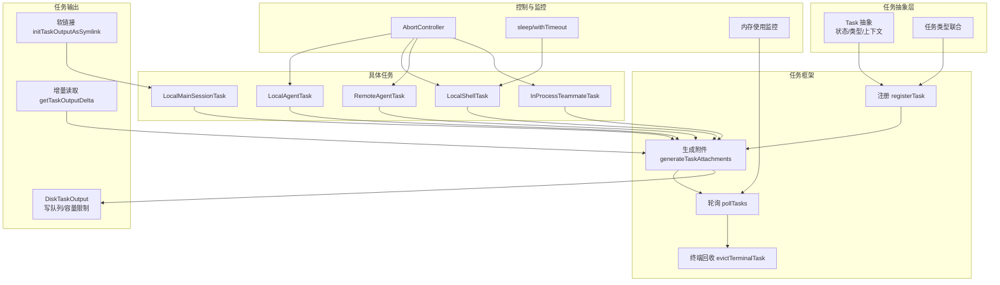
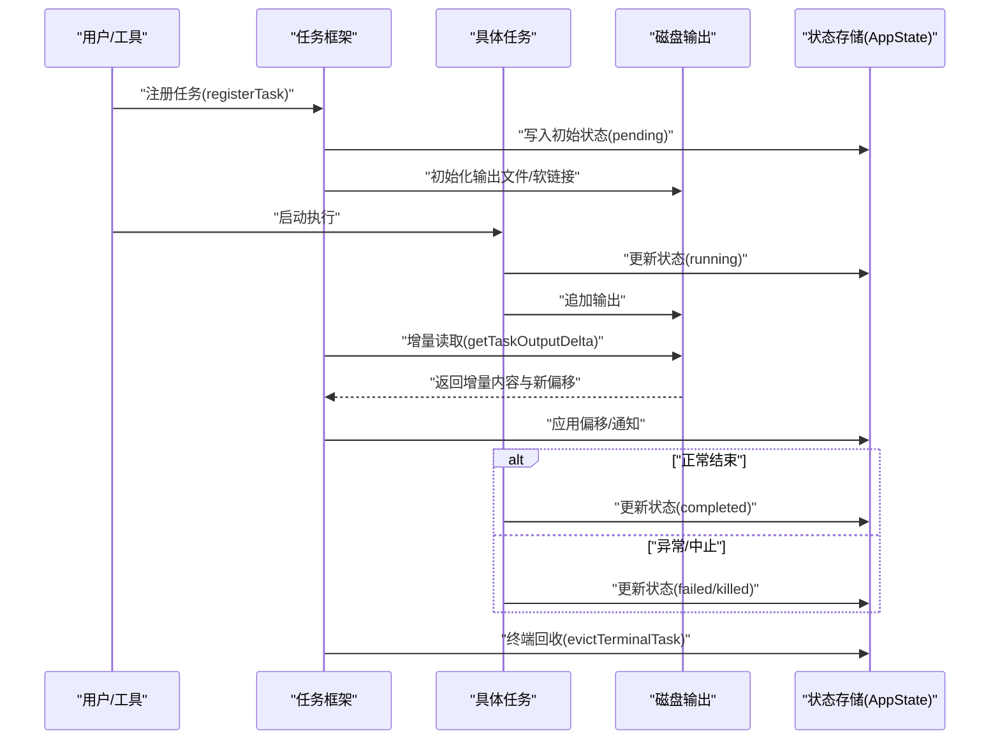
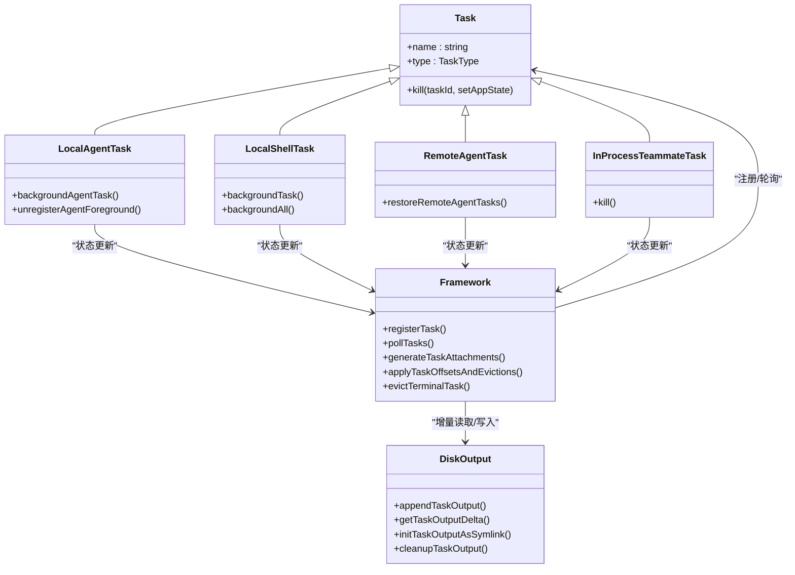
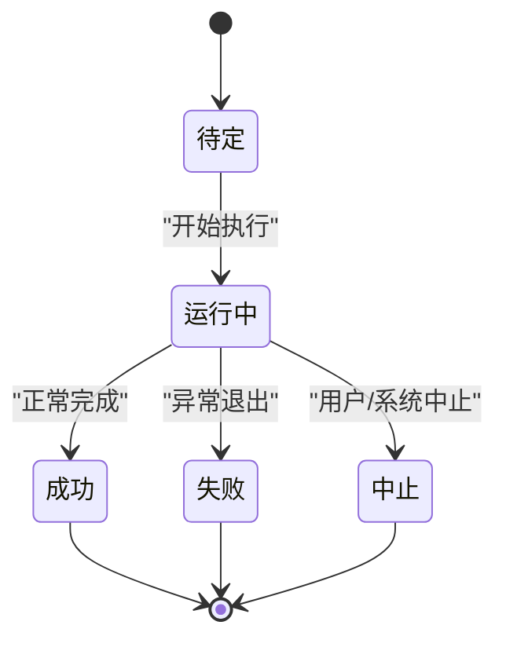

# 任务生命周期管理

<cite>
**本文引用的文件**
- [src/Task.ts](file://src/Task.ts)
- [src/tasks.ts](file://src/tasks.ts)
- [src/utils/task/framework.ts](file://src/utils/task/framework.ts)
- [src/utils/task/diskOutput.ts](file://src/utils/task/diskOutput.ts)
- [src/tasks/types.ts](file://src/tasks/types.ts)
- [src/tasks/LocalMainSessionTask.ts](file://src/tasks/LocalMainSessionTask.ts)
- [src/tasks/LocalAgentTask/LocalAgentTask.tsx](file://src/tasks/LocalAgentTask/LocalAgentTask.tsx)
- [src/tasks/LocalShellTask/LocalShellTask.tsx](file://src/tasks/LocalShellTask/LocalShellTask.tsx)
- [src/tasks/RemoteAgentTask/RemoteAgentTask.tsx](file://src/tasks/RemoteAgentTask/RemoteAgentTask.tsx)
- [src/tasks/InProcessTeammateTask/InProcessTeammateTask.tsx](file://src/tasks/InProcessTeammateTask/InProcessTeammateTask.tsx)
- [src/utils/swarm/spawnInProcess.ts](file://src/utils/swarm/spawnInProcess.ts)
- [src/utils/swarm/backends/InProcessBackend.ts](file://src/utils/swarm/backends/InProcessBackend.ts)
- [src/utils/sleep.ts](file://src/utils/sleep.ts)
- [src/utils/ShellCommand.ts](file://src/utils/ShellCommand.ts)
- [src/tools/TaskOutputTool/TaskOutputTool.tsx](file://src/tools/TaskOutputTool/TaskOutputTool.tsx)
- [src/components/tasks/taskStatusUtils.tsx](file://src/components/tasks/taskStatusUtils.tsx)
- [src/hooks/useMemoryUsage.ts](file://src/hooks/useMemoryUsage.ts)
- [src/utils/cronTasksLock.ts](file://src/utils/cronTasksLock.ts)
- [src/utils/cronScheduler.ts](file://src/utils/cronScheduler.ts)
- [src/utils/commandLifecycle.ts](file://src/utils/commandLifecycle.ts)
</cite>

## 目录
1. [简介](#简介)
2. [项目结构](#项目结构)
3. [核心组件](#核心组件)
4. [架构总览](#架构总览)
5. [详细组件分析](#详细组件分析)
6. [依赖关系分析](#依赖关系分析)
7. [性能考量](#性能考量)
8. [故障排查指南](#故障排查指南)
9. [结论](#结论)
10. [附录](#附录)

## 简介
本文件系统性梳理 Claude Code 的任务生命周期管理，覆盖从创建、初始化、激活、执行、暂停（后台化）、恢复、终止到销毁的全链路。文档重点阐述：
- 任务状态定义与转换规则（pending、running、completed、failed、killed）
- 任务持久化与恢复机制（磁盘输出、会话侧车文件、内存映射）
- 取消与清理策略（AbortController、资源释放、内存回收）
- 监控与告警（轮询、增量通知、内存阈值、超时与卡顿检测）
- 性能优化点与最佳实践（写队列、增量读取、延迟回收）

## 项目结构
围绕任务生命周期的关键模块与职责如下：
- 任务抽象与类型：定义任务类型、状态、上下文与工具函数
- 任务框架：注册、轮询、增量通知、终端回收
- 任务输出：磁盘输出、增量读取、软链接复用、容量限制
- 具体任务实现：本地代理、本地 Shell、远程代理、进程内同伴、主会话背景任务
- 并发与控制：AbortController、超时与卡顿检测、后台化/前台切换
- 恢复与持久化：会话侧车元数据、锁文件、计划任务调度器

图表来源
- [src/Task.ts:1-126](file://src/Task.ts#L1-L126)
- [src/tasks.ts:1-40](file://src/tasks.ts#L1-L40)
- [src/utils/task/framework.ts:1-309](file://src/utils/task/framework.ts#L1-L309)
- [src/utils/task/diskOutput.ts:1-452](file://src/utils/task/diskOutput.ts#L1-L452)
- [src/tasks/LocalAgentTask/LocalAgentTask.tsx](file://src/tasks/LocalAgentTask/LocalAgentTask.tsx)
- [src/tasks/LocalShellTask/LocalShellTask.tsx](file://src/tasks/LocalShellTask/LocalShellTask.tsx)
- [src/tasks/RemoteAgentTask/RemoteAgentTask.tsx](file://src/tasks/RemoteAgentTask/RemoteAgentTask.tsx)
- [src/tasks/InProcessTeammateTask/InProcessTeammateTask.tsx](file://src/tasks/InProcessTeammateTask/InProcessTeammateTask.tsx)
- [src/tasks/LocalMainSessionTask.ts:1-480](file://src/tasks/LocalMainSessionTask.ts#L1-L480)

章节来源
- [src/Task.ts:1-126](file://src/Task.ts#L1-L126)
- [src/tasks.ts:1-40](file://src/tasks.ts#L1-L40)
- [src/utils/task/framework.ts:1-309](file://src/utils/task/framework.ts#L1-L309)
- [src/utils/task/diskOutput.ts:1-452](file://src/utils/task/diskOutput.ts#L1-L452)

## 核心组件
- 任务类型与状态
  - 类型：local_bash、local_agent、remote_agent、in_process_teammate、local_workflow、monitor_mcp、dream
  - 状态：pending、running、completed、failed、killed
  - 终止态判定：用于安全回收与通知抑制
- 任务上下文与句柄
  - 上下文包含 AbortController、获取/设置 AppState 的函数
  - 任务句柄支持清理回调
- 任务注册与轮询
  - 注册：合并 UI 状态并发出 SDK 事件
  - 轮询：按固定间隔扫描增量输出，生成附件并入队通知
  - 终端回收：完成/失败/中止且已通知的任务延迟移除，释放内存

章节来源
- [src/Task.ts:6-29](file://src/Task.ts#L6-L29)
- [src/Task.ts:36-42](file://src/Task.ts#L36-L42)
- [src/utils/task/framework.ts:48-117](file://src/utils/task/framework.ts#L48-L117)
- [src/utils/task/framework.ts:255-269](file://src/utils/task/framework.ts#L255-L269)

## 架构总览
任务生命周期由“抽象层—框架层—具体任务—控制与监控”四层协同实现。抽象层定义统一接口；框架层负责注册、轮询与通知；具体任务实现各自业务逻辑；控制与监控贯穿始终。

图表来源
- [src/utils/task/framework.ts:77-117](file://src/utils/task/framework.ts#L77-L117)
- [src/utils/task/framework.ts:158-206](file://src/utils/task/framework.ts#L158-L206)
- [src/utils/task/framework.ts:213-249](file://src/utils/task/framework.ts#L213-L249)
- [src/utils/task/diskOutput.ts:304-330](file://src/utils/task/diskOutput.ts#L304-L330)

## 详细组件分析

### 任务状态与转换规则
- 状态集合与终止态判定
  - 状态：pending、running、completed、failed、killed
  - 终止态：completed、failed、killed，触发终端回收与通知抑制
- 背景任务判定
  - 运行或等待中且未显式前台化的任务视为背景任务，参与后台任务指示器

章节来源
- [src/Task.ts:15-29](file://src/Task.ts#L15-L29)
- [src/tasks/types.ts:31-46](file://src/tasks/types.ts#L31-L46)

### 任务注册与轮询
- 注册流程
  - 合并 UI 状态（如 retain、startTime、messages、diskLoaded、pendingMessages）
  - 发出 SDK 事件 task_started
- 轮询与通知
  - 固定轮询间隔，扫描运行中任务的增量输出
  - 生成附件并入队任务通知
- 终端回收
  - completed/failed/killed 且 notified=true 的任务延迟移除
  - 面板保留窗口与 retain 控制

章节来源
- [src/utils/task/framework.ts:77-117](file://src/utils/task/framework.ts#L77-L117)
- [src/utils/task/framework.ts:158-206](file://src/utils/task/framework.ts#L158-L206)
- [src/utils/task/framework.ts:213-249](file://src/utils/task/framework.ts#L213-L249)

### 磁盘输出与增量读取
- 输出目录与路径
  - 基于项目临时目录与会话 ID，避免并发会话互相干扰
- 写入与容量限制
  - 单任务输出类采用队列+缓冲批量写入，避免链式闭包导致的内存滞留
  - 达到容量上限后截断并注入提示
- 增量读取
  - 仅读取自上次偏移以来的新内容，避免加载整文件
- 软链接复用
  - 主会话背景任务通过软链接复用代理转录文件，保证 /clear 不影响背景任务输出

章节来源
- [src/utils/task/diskOutput.ts:50-74](file://src/utils/task/diskOutput.ts#L50-L74)
- [src/utils/task/diskOutput.ts:97-231](file://src/utils/task/diskOutput.ts#L97-L231)
- [src/utils/task/diskOutput.ts:304-330](file://src/utils/task/diskOutput.ts#L304-L330)
- [src/utils/task/diskOutput.ts:427-451](file://src/utils/task/diskOutput.ts#L427-L451)
- [src/tasks/LocalMainSessionTask.ts:107-110](file://src/tasks/LocalMainSessionTask.ts#L107-L110)

### 本地代理任务（LocalAgentTask）
- 后台化与前台切换
  - 将前台代理任务标记为后台，中断其内部循环并允许 UI 切换
  - 前台注销时清理后台信号解析器与任务条目
- 背景会话任务
  - 用户双击 Ctrl+B 时，将当前查询以“主会话任务”形式后台化
  - 使用独立转录路径，避免 /clear 影响

章节来源
- [src/tasks/LocalAgentTask/LocalAgentTask.tsx](file://src/tasks/LocalAgentTask/LocalAgentTask.tsx)
- [src/tasks/LocalMainSessionTask.ts:94-162](file://src/tasks/LocalMainSessionTask.ts#L94-L162)
- [src/tasks/LocalMainSessionTask.ts:168-219](file://src/tasks/LocalMainSessionTask.ts#L168-L219)
- [src/tasks/LocalAgentTask/LocalAgentTask.tsx:616-678](file://src/tasks/LocalAgentTask/LocalAgentTask.tsx#L616-L678)

### 本地 Shell 任务（LocalShellTask）
- 后台化
  - 通过 ShellCommand 的 background 将前台命令转为后台，同时保持 TaskOutput 数据接收
- 超时与卡顿检测
  - 超时可自动后台化或发送 SIGTERM
  - 启动卡顿看门狗，对长时间无输出的任务进行告警

章节来源
- [src/tasks/LocalShellTask/LocalShellTask.tsx:293-400](file://src/tasks/LocalShellTask/LocalShellTask.tsx#L293-L400)
- [src/utils/ShellCommand.ts:106-146](file://src/utils/ShellCommand.ts#L106-L146)

### 远程代理任务（RemoteAgentTask）
- 恢复机制
  - 应用重启后扫描远程侧车元数据，拉取远端会话状态重建任务
  - 对已归档或 404 的会话清理侧车文件
- 完成条件
  - 通过检查器判定结果，更新状态为 completed 并清理侧车与输出

章节来源
- [src/tasks/RemoteAgentTask/RemoteAgentTask.tsx:477-483](file://src/tasks/RemoteAgentTask/RemoteAgentTask.tsx#L477-L483)
- [src/tasks/RemoteAgentTask/RemoteAgentTask.tsx:484-610](file://src/tasks/RemoteAgentTask/RemoteAgentTask.tsx#L484-L610)

### 进程内同伴任务（InProcessTeammateTask）
- 生命周期
  - 通过 AbortController 中止执行，调用清理回调，移出团队上下文
  - 提供 isActive 检查与 terminate 请求（通过邮箱消息）能力
- 杀死流程
  - 通过 spawnInProcess 的 killInProcessTeammate 实现中止与清理

章节来源
- [src/tasks/InProcessTeammateTask/InProcessTeammateTask.tsx:24-30](file://src/tasks/InProcessTeammateTask/InProcessTeammateTask.tsx#L24-L30)
- [src/utils/swarm/spawnInProcess.ts:227-265](file://src/utils/swarm/spawnInProcess.ts#L227-L265)
- [src/utils/swarm/backends/InProcessBackend.ts:223-339](file://src/utils/swarm/backends/InProcessBackend.ts#L223-L339)

### 任务等待与超时
- 等待完成
  - 工具方法轮询任务状态，支持 AbortController 中止
- 超时与中断
  - sleep 支持带中断的睡眠与超时竞速
  - withTimeout 将任意 Promise 与超时竞速，不取消底层工作

章节来源
- [src/tools/TaskOutputTool/TaskOutputTool.tsx:117-138](file://src/tools/TaskOutputTool/TaskOutputTool.tsx#L117-L138)
- [src/utils/sleep.ts:14-84](file://src/utils/sleep.ts#L14-L84)

### 监控与告警
- 状态图标与颜色
  - 根据状态与标志位（空闲、待审批、错误、请求关闭）选择图标与语义色
- 内存使用监控
  - 定期轮询 Node.js heapUsed，超过阈值触发告警
- 通知节流
  - 任务通知最大可见数量限制，溢出时合成汇总消息

章节来源
- [src/components/tasks/taskStatusUtils.tsx:20-70](file://src/components/tasks/taskStatusUtils.tsx#L20-L70)
- [src/hooks/useMemoryUsage.ts:18-39](file://src/hooks/useMemoryUsage.ts#L18-L39)

### 计划任务与调度锁
- 调度锁
  - 会话拥有者持有锁，非拥有者周期探测；崩溃时释放
- 任务老化
  - 周期性任务在达到最大年龄后删除

章节来源
- [src/utils/cronTasksLock.ts:175-195](file://src/utils/cronTasksLock.ts#L175-L195)
- [src/utils/cronScheduler.ts:40-60](file://src/utils/cronScheduler.ts#L40-L60)

### 命令生命周期监听
- 监听器注册与通知
  - 提供命令生命周期监听器注册与通知分发

章节来源
- [src/utils/commandLifecycle.ts:1-21](file://src/utils/commandLifecycle.ts#L1-L21)

## 依赖关系分析

图表来源
- [src/Task.ts:72-76](file://src/Task.ts#L72-L76)
- [src/tasks.ts:22-32](file://src/tasks.ts#L22-L32)
- [src/utils/task/framework.ts:48-117](file://src/utils/task/framework.ts#L48-L117)
- [src/utils/task/diskOutput.ts:268-394](file://src/utils/task/diskOutput.ts#L268-L394)

章节来源
- [src/tasks.ts:17-40](file://src/tasks.ts#L17-L40)
- [src/utils/task/framework.ts:1-309](file://src/utils/task/framework.ts#L1-L309)
- [src/utils/task/diskOutput.ts:1-452](file://src/utils/task/diskOutput.ts#L1-L452)

## 性能考量
- 写入路径优化
  - DiskTaskOutput 使用队列+缓冲批量写入，避免链式闭包捕获导致的内存滞留
  - 写队列在 drain 循环中逐步清空，chunk 在写入后尽快被 GC
- 读取路径优化
  - 增量读取仅读取新增内容，避免大文件全量加载
  - 软链接复用避免重复 IO
- 回收策略
  - 轮询后立即应用偏移与回收，减少内存占用
  - 终端任务延迟回收，配合面板保留窗口与 retain 控制
- 超时与卡顿
  - 超时自动后台化或终止，避免阻塞
  - 卡顿看门狗对长时间无输出任务告警

章节来源
- [src/utils/task/diskOutput.ts:97-231](file://src/utils/task/diskOutput.ts#L97-L231)
- [src/utils/task/diskOutput.ts:304-330](file://src/utils/task/diskOutput.ts#L304-L330)
- [src/utils/task/framework.ts:213-249](file://src/utils/task/framework.ts#L213-L249)
- [src/utils/ShellCommand.ts:106-146](file://src/utils/ShellCommand.ts#L106-L146)

## 故障排查指南
- 任务未完成或卡住
  - 检查轮询是否正常，确认增量读取与偏移应用
  - 查看内存使用是否过高，必要时触发内存告警
- 任务被提前回收
  - 确认 notified 标志与终端回收条件
  - 检查面板保留窗口与 retain 设置
- 远程任务恢复失败
  - 检查侧车元数据是否存在与远端会话状态
  - 处理 404 或认证错误场景
- 进程内同伴无法停止
  - 确认 AbortController 是否被正确中止
  - 检查清理回调是否被调用

章节来源
- [src/utils/task/framework.ts:125-144](file://src/utils/task/framework.ts#L125-L144)
- [src/tasks/RemoteAgentTask/RemoteAgentTask.tsx:484-610](file://src/tasks/RemoteAgentTask/RemoteAgentTask.tsx#L484-L610)
- [src/utils/swarm/spawnInProcess.ts:227-265](file://src/utils/swarm/spawnInProcess.ts#L227-L265)
- [src/hooks/useMemoryUsage.ts:18-39](file://src/hooks/useMemoryUsage.ts#L18-L39)

## 结论
该任务生命周期体系以统一抽象与框架为核心，结合磁盘输出的增量读取与容量控制、AbortController 的中止能力、以及轮询与回收策略，实现了稳定、可观测、可扩展的任务管理。通过后台化/前台切换、超时与卡顿检测、内存阈值告警等机制，兼顾了用户体验与系统稳定性。建议在实际使用中遵循“尽早注册、及时回收、增量读取、容量控制”的最佳实践。

## 附录
- 任务状态可视化

[此图为概念性状态图，无需图表来源]