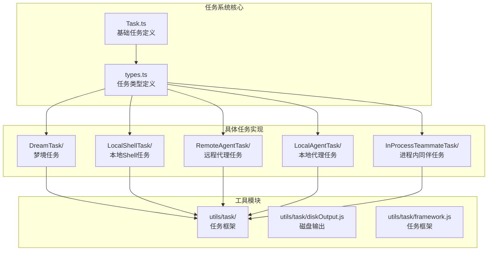
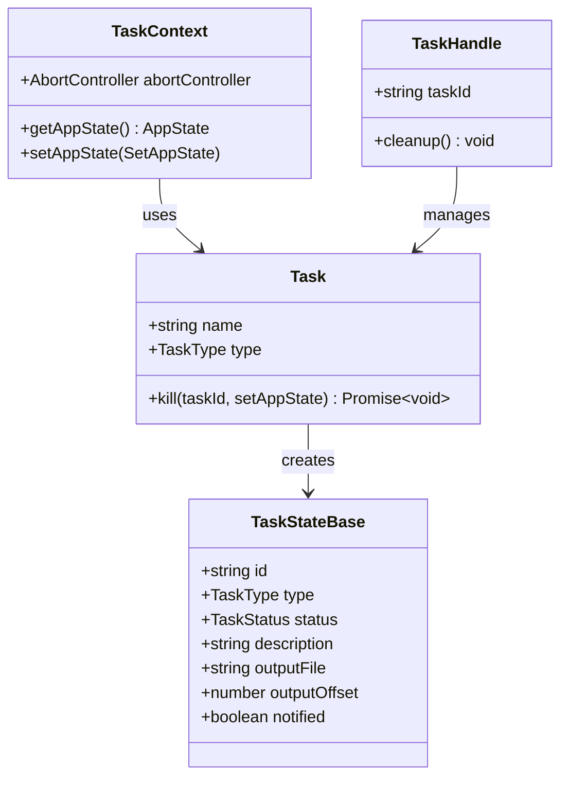
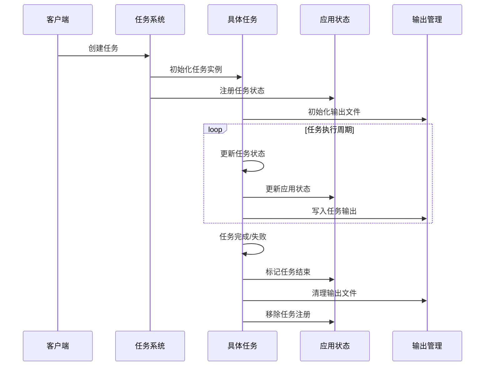
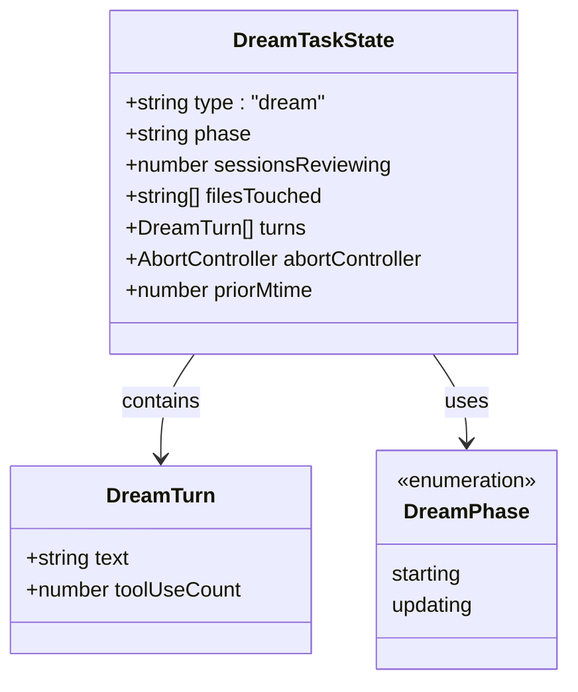
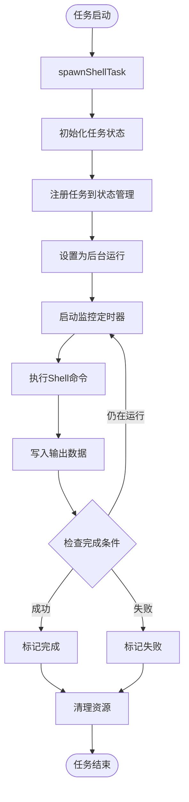
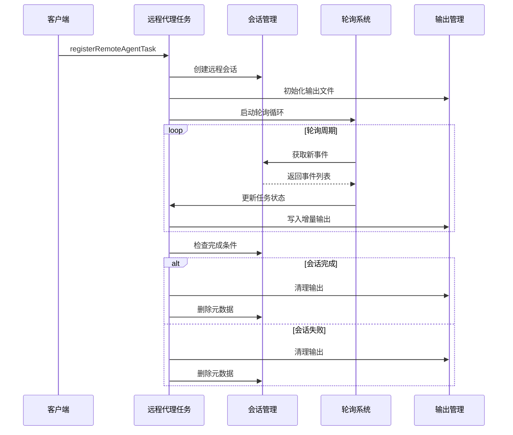
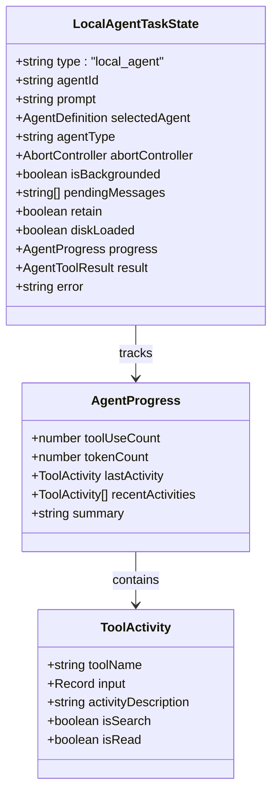
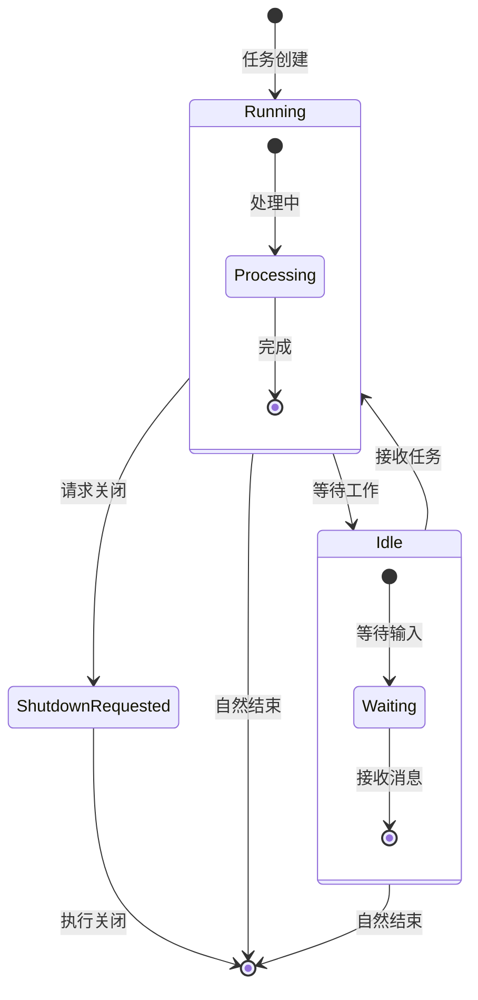
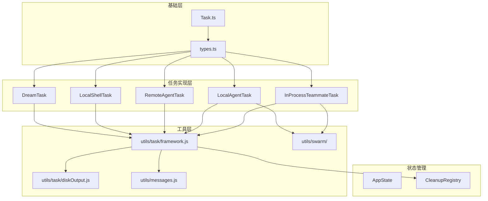

# 任务类型详解

<cite>
**本文档引用的文件**
- [Task.ts](file://src/Task.ts)
- [types.ts](file://src/tasks/types.ts)
- [DreamTask.ts](file://src/tasks/DreamTask/DreamTask.ts)
- [LocalShellTask.tsx](file://src/tasks/LocalShellTask/LocalShellTask.tsx)
- [RemoteAgentTask.tsx](file://src/tasks/RemoteAgentTask/RemoteAgentTask.tsx)
- [LocalAgentTask.tsx](file://src/tasks/LocalAgentTask/LocalAgentTask.tsx)
- [InProcessTeammateTask.tsx](file://src/tasks/InProcessTeammateTask/InProcessTeammateTask.tsx)
</cite>

## 目录
1. [简介](#简介)
2. [项目结构](#项目结构)
3. [核心组件](#核心组件)
4. [架构概览](#架构概览)
5. [详细组件分析](#详细组件分析)
6. [依赖分析](#依赖分析)
7. [性能考虑](#性能考虑)
8. [故障排除指南](#故障排除指南)
9. [结论](#结论)

## 简介

Claude Code 的任务类型系统是一个统一的任务管理框架，用于协调和控制各种类型的后台任务执行。该系统提供了标准化的任务生命周期管理、状态跟踪、通知机制和资源清理功能。

## 项目结构

任务类型系统主要分布在以下目录中：

**图表来源**
- [Task.ts:1-126](file://src/Task.ts#L1-L126)
- [types.ts:1-47](file://src/tasks/types.ts#L1-L47)

**章节来源**
- [Task.ts:1-126](file://src/Task.ts#L1-L126)
- [types.ts:1-47](file://src/tasks/types.ts#L1-L47)

## 核心组件

### 基础任务类型系统

任务系统的核心是统一的 Task 接口和 TaskStateBase 结构：

**图表来源**
- [Task.ts:38-125](file://src/Task.ts#L38-L125)

### 任务类型枚举

系统支持以下七种任务类型：

| 任务类型 | 类型标识 | 描述 |
|---------|---------|------|
| 本地Shell任务 | `local_bash` | 在本地执行命令行任务 |
| 本地代理任务 | `local_agent` | 在本地运行AI代理任务 |
| 远程代理任务 | `remote_agent` | 在云端环境运行AI代理任务 |
| 进程内同伴任务 | `in_process_teammate` | 在同一进程中运行的团队成员 |
| 本地工作流任务 | `local_workflow` | 本地自动化工作流程 |
| 监控MCP任务 | `monitor_mcp` | 监控MCP服务的任务 |
| 梦境任务 | `dream` | 内存整理和巩固任务 |

**章节来源**
- [Task.ts:6-14](file://src/Task.ts#L6-L14)
- [Task.ts:78-87](file://src/Task.ts#L78-L87)

## 架构概览

任务系统的整体架构采用统一接口设计，确保所有任务类型具有一致的行为模式：

**图表来源**
- [Task.ts:69-76](file://src/Task.ts#L69-L76)
- [framework.js](file://src/utils/task/framework.js)

## 详细组件分析

### 梦境任务 (DreamTask)

梦境任务专门用于内存整理和巩固过程，为用户界面提供可见性：

**图表来源**
- [DreamTask.ts:15-41](file://src/tasks/DreamTask/DreamTask.ts#L15-L41)

**使用场景**：
- 自动内存整理过程监控
- 提供后台任务的可视化反馈
- 支持任务中断和恢复

**配置选项**：
- `sessionsReviewing`: 正在审查的会话数量
- `priorMtime`: 之前的修改时间戳
- `abortController`: 中断控制

**章节来源**
- [DreamTask.ts:1-158](file://src/tasks/DreamTask/DreamTask.ts#L1-L158)

### 本地Shell任务 (LocalShellTask)

本地Shell任务处理在本地系统上执行的各种命令行操作：

**图表来源**
- [LocalShellTask.tsx:180-252](file://src/tasks/LocalShellTask/LocalShellTask.tsx#L180-L252)

**关键特性**：
- 自动检测交互式提示并发出警告
- 支持前台到后台的转换
- 实时输出监控和通知
- 资源自动清理机制

**配置参数**：
- `command`: 要执行的完整命令
- `description`: 任务描述
- `timeout`: 执行超时时间
- `kind`: 任务类型（bash或monitor）
- `agentId`: 关联的代理ID

**章节来源**
- [LocalShellTask.tsx:1-523](file://src/tasks/LocalShellTask/LocalShellTask.tsx#L1-L523)

### 远程代理任务 (RemoteAgentTask)

远程代理任务在云端环境中执行AI代理工作负载：

**图表来源**
- [RemoteAgentTask.tsx:538-799](file://src/tasks/RemoteAgentTask/RemoteAgentTask.tsx#L538-L799)

**远程任务类型**：
- `remote-agent`: 标准远程代理任务
- `ultraplan`: 计划生成任务
- `ultrareview`: 代码审查任务
- `autofix-pr`: 自动修复PR任务
- `background-pr`: 后台PR任务

**章节来源**
- [RemoteAgentTask.tsx:1-856](file://src/tasks/RemoteAgentTask/RemoteAgentTask.tsx#L1-L856)

### 本地代理任务 (LocalAgentTask)

本地代理任务管理在本地运行的AI代理执行：

**图表来源**
- [LocalAgentTask.tsx:116-148](file://src/tasks/LocalAgentTask/LocalAgentTask.tsx#L116-L148)

**高级功能**：
- 实时进度跟踪和摘要生成
- 工具使用活动的详细记录
- 前台到后台的智能转换
- 终端状态的优雅处理

**章节来源**
- [LocalAgentTask.tsx:1-683](file://src/tasks/LocalAgentTask/LocalAgentTask.tsx#L1-L683)

### 进程内同伴任务 (InProcessTeammateTask)

进程内同伴任务管理在同一Node.js进程中运行的团队成员：

**图表来源**
- [InProcessTeammateTask.tsx:24-30](file://src/tasks/InProcessTeammateTask/InProcessTeammateTask.tsx#L24-L30)

**核心特性**：
- 使用AsyncLocalStorage进行隔离
- 支持计划模式审批流程
- 团队感知的身份标识
- 用户消息注入机制

**章节来源**
- [InProcessTeammateTask.tsx:1-126](file://src/tasks/InProcessTeammateTask/InProcessTeammateTask.tsx#L1-126)

## 依赖分析

任务系统采用分层架构设计，确保模块间的松耦合：

**图表来源**
- [Task.ts:1-126](file://src/Task.ts#L1-L126)
- [types.ts:1-47](file://src/tasks/types.ts#L1-L47)

**依赖关系**：
- 所有任务都依赖于统一的Task接口
- 任务状态通过框架模块进行管理
- 输出管理通过磁盘输出模块处理
- 通知机制通过消息队列管理

**章节来源**
- [Task.ts:1-126](file://src/Task.ts#L1-L126)
- [types.ts:1-47](file://src/tasks/types.ts#L1-L47)

## 性能考虑

### 内存管理

任务系统采用了多种内存优化策略：

1. **增量输出**: 仅写入新增的输出内容，避免全量重写
2. **状态压缩**: 只在状态变化时更新应用状态
3. **资源清理**: 自动清理不再需要的资源和文件句柄

### 并发控制

- 使用AbortController管理异步操作的取消
- 通过状态锁防止竞态条件
- 实现优雅的任务终止机制

### 缓存策略

- 任务输出缓存在磁盘中
- 进度信息缓存在内存中
- 最近活动历史限制长度以控制内存使用

## 故障排除指南

### 常见问题及解决方案

**任务无法启动**
- 检查任务类型是否正确注册
- 验证任务参数的完整性
- 确认必要的权限已授予

**任务卡死或无响应**
- 检查AbortController是否正常工作
- 验证超时设置是否合理
- 查看日志中的错误信息

**内存泄漏**
- 确保所有清理回调都被调用
- 检查事件监听器是否正确移除
- 验证文件句柄是否正确关闭

**章节来源**
- [LocalShellTask.tsx:515-522](file://src/tasks/LocalShellTask/LocalShellTask.tsx#L515-L522)
- [LocalAgentTask.tsx:281-303](file://src/tasks/LocalAgentTask/LocalAgentTask.tsx#L281-L303)

## 结论

Claude Code 的任务类型系统通过统一的接口设计和模块化架构，为各种类型的任务提供了标准化的管理和执行机制。该系统具有以下优势：

1. **一致性**: 所有任务类型遵循相同的生命周期和状态管理模式
2. **可扩展性**: 新的任务类型可以轻松添加到现有框架中
3. **可靠性**: 完善的错误处理和资源清理机制
4. **可观测性**: 详细的进度跟踪和状态报告功能

通过合理使用这些任务类型，开发者可以构建复杂的工作流和自动化系统，同时保持代码的清晰性和可维护性。