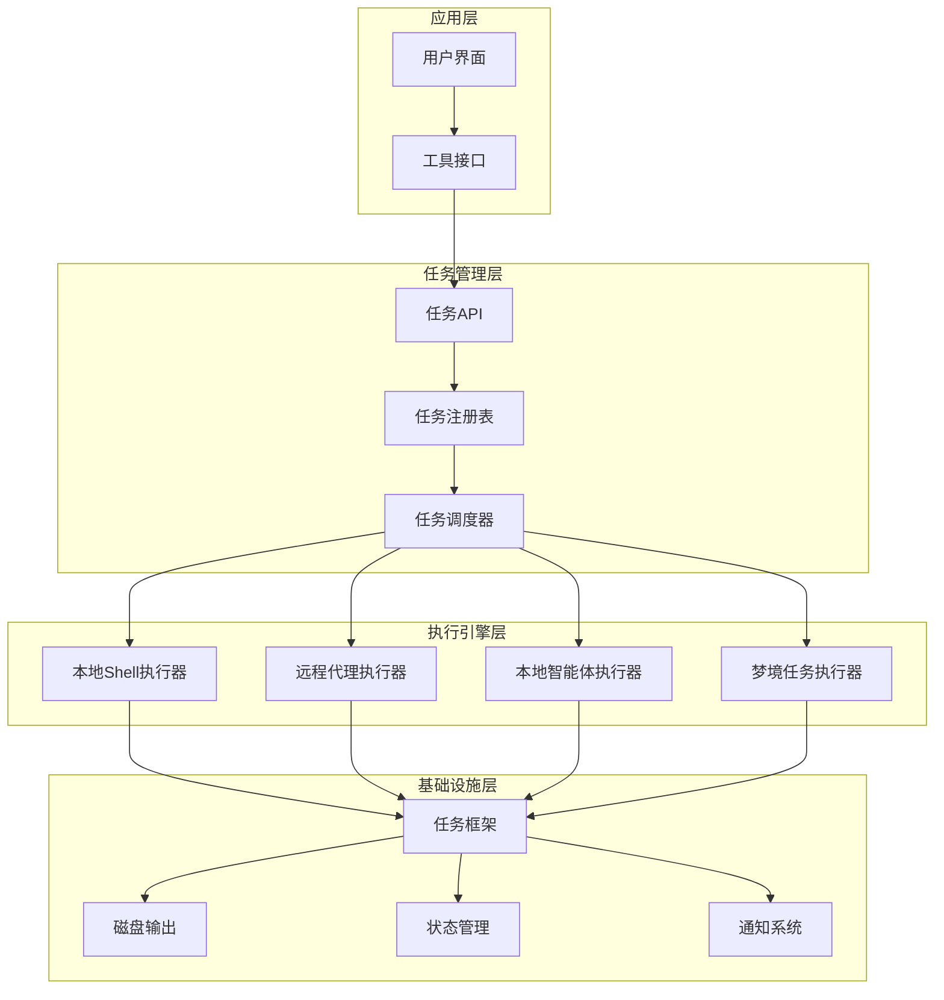
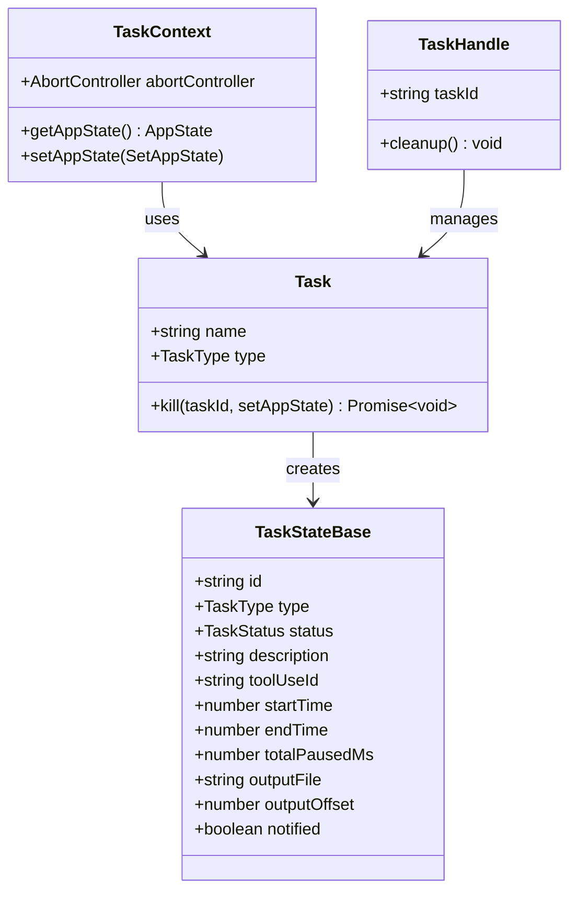
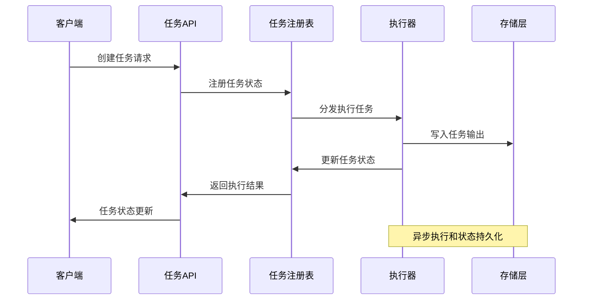
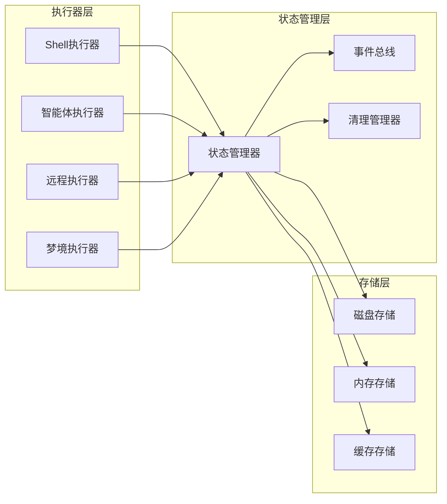
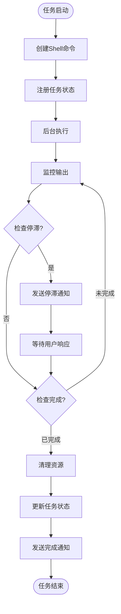
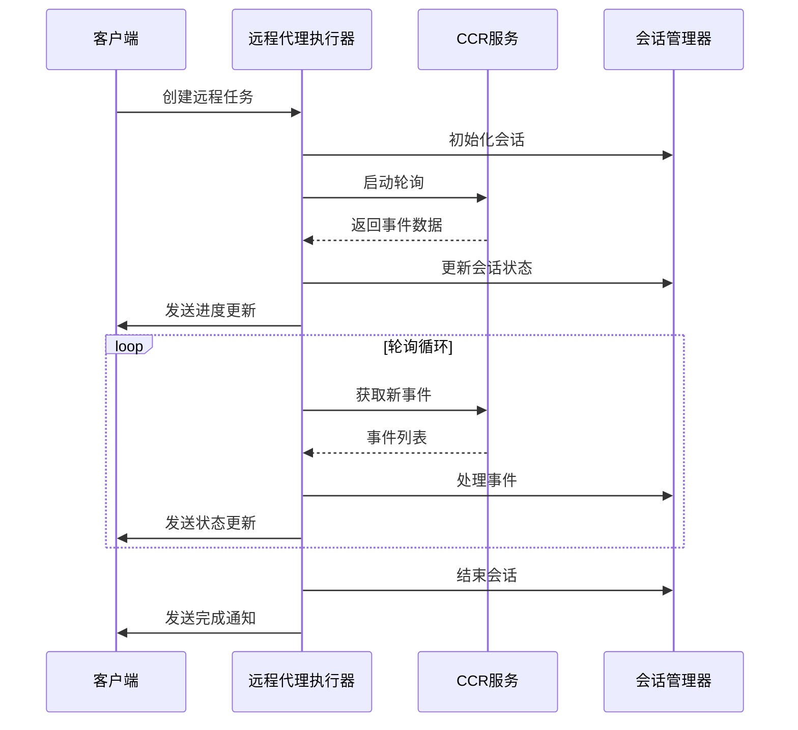
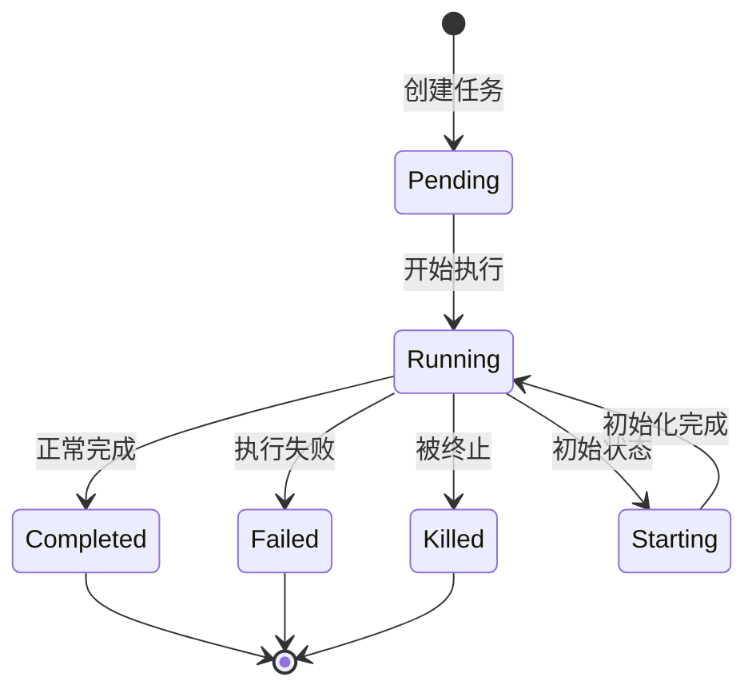
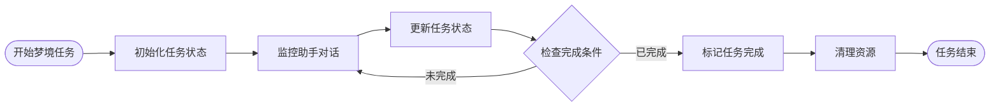
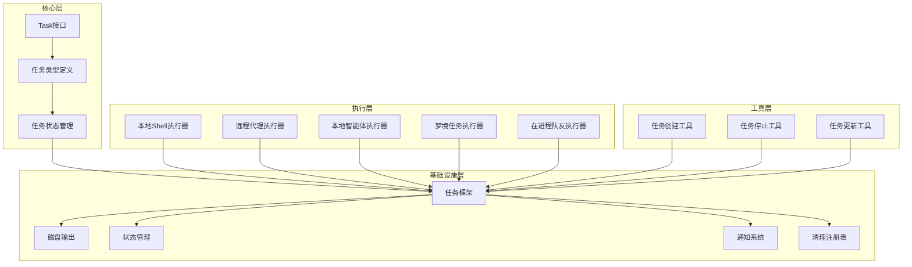

# 任务系统架构

<cite>
**本文档引用的文件**
- [src/Task.ts](file://src/Task.ts)
- [src/tasks.ts](file://src/tasks.ts)
- [src/tasks/types.ts](file://src/tasks/types.ts)
- [src/tasks/DreamTask/DreamTask.ts](file://src/tasks/DreamTask/DreamTask.ts)
- [src/tasks/LocalShellTask/LocalShellTask.tsx](file://src/tasks/LocalShellTask/LocalShellTask.tsx)
- [src/tasks/RemoteAgentTask/RemoteAgentTask.tsx](file://src/tasks/RemoteAgentTask/RemoteAgentTask.tsx)
- [src/tasks/LocalAgentTask/LocalAgentTask.tsx](file://src/tasks/LocalAgentTask/LocalAgentTask.tsx)
- [src/tasks/InProcessTeammateTask/InProcessTeammateTask.tsx](file://src/tasks/InProcessTeammateTask/InProcessTeammateTask.tsx)
- [src/tasks/LocalMainSessionTask.ts](file://src/tasks/LocalMainSessionTask.ts)
- [src/tasks/stopTask.ts](file://src/tasks/stopTask.ts)
- [src/utils/task/framework.ts](file://src/utils/task/framework.ts)
- [src/utils/task/diskOutput.ts](file://src/utils/task/diskOutput.ts)
- [src/tools/TaskCreateTool/TaskCreateTool.ts](file://src/tools/TaskCreateTool/TaskCreateTool.ts)
- [src/tools/TaskStopTool/TaskStopTool.ts](file://src/tools/TaskStopTool/TaskStopTool.ts)
- [src/tools/TaskUpdateTool/prompt.ts](file://src/tools/TaskUpdateTool/prompt.ts)
</cite>

## 目录
1. [简介](#简介)
2. [项目结构](#项目结构)
3. [核心组件](#核心组件)
4. [架构概览](#架构概览)
5. [详细组件分析](#详细组件分析)
6. [依赖关系分析](#依赖关系分析)
7. [性能考虑](#性能考虑)
8. [故障排除指南](#故障排除指南)
9. [结论](#结论)

## 简介

Claude Code 的任务系统是一个高度模块化和可扩展的后台任务管理系统，支持多种类型的任务执行，包括本地 Shell 命令、远程代理会话、智能体任务和梦境任务等。该系统提供了完整的任务生命周期管理、并发控制、状态跟踪和错误处理机制。

任务系统的核心设计理念是通过统一的 Task 接口规范来抽象不同类型的执行器，使得各种任务类型可以在相同的框架下运行，同时保持各自的特性和优化。

## 项目结构

任务系统采用分层架构设计，主要包含以下层次：

**图表来源**
- [src/tasks.ts:1-40](file://src/tasks.ts#L1-L40)
- [src/Task.ts:69-76](file://src/Task.ts#L69-L76)

**章节来源**
- [src/tasks.ts:1-40](file://src/tasks.ts#L1-L40)
- [src/Task.ts:1-126](file://src/Task.ts#L1-L126)

## 核心组件

### 任务接口规范

任务系统定义了统一的任务接口规范，确保所有任务类型都遵循相同的标准：

**图表来源**
- [src/Task.ts:31-76](file://src/Task.ts#L31-L76)
- [src/Task.ts:44-57](file://src/Task.ts#L44-L57)

### 任务类型系统

系统支持多种任务类型，每种类型都有其特定的功能和用途：

| 任务类型 | 描述 | 主要用途 | 特性 |
|---------|------|----------|------|
| `local_bash` | 本地Shell命令执行 | 执行本地命令行操作 | 支持前台/后台切换、交互式提示检测 |
| `local_agent` | 本地智能体任务 | 运行AI智能体代理 | 支持进度跟踪、摘要生成、并发控制 |
| `remote_agent` | 远程代理会话 | 在云端环境运行代理 | 支持长连接轮询、状态同步、超时处理 |
| `in_process_teammate` | 在进程队友 | 团队协作智能体 | 支持团队身份、计划模式审批 |
| `dream` | 梦境任务 | 内存整理和 Consolidation | UI可见的后台任务 |

**章节来源**
- [src/Task.ts:6-14](file://src/Task.ts#L6-L14)
- [src/tasks/types.ts:12-19](file://src/tasks/types.ts#L12-L19)

## 架构概览

任务系统的整体架构采用事件驱动的设计模式，通过状态管理、任务注册和执行器分离来实现高可扩展性：

**图表来源**
- [src/utils/task/framework.ts](file://src/utils/task/framework.ts)
- [src/utils/task/diskOutput.ts](file://src/utils/task/diskOutput.ts)

### 执行引擎架构

执行引擎采用多执行器模式，每个执行器专门处理特定类型的任务：

**图表来源**
- [src/tasks/LocalShellTask/LocalShellTask.tsx:173-179](file://src/tasks/LocalShellTask/LocalShellTask.tsx#L173-L179)
- [src/tasks/RemoteAgentTask/RemoteAgentTask.tsx:538-799](file://src/tasks/RemoteAgentTask/RemoteAgentTask.tsx#L538-L799)

## 详细组件分析

### 本地Shell任务执行器

本地Shell任务执行器是最复杂的任务类型之一，提供了丰富的功能特性：

**图表来源**
- [src/tasks/LocalShellTask/LocalShellTask.tsx:220-245](file://src/tasks/LocalShellTask/LocalShellTask.tsx#L220-L245)

#### 关键特性

1. **前台/后台切换机制**：支持将正在运行的前台任务转换为后台任务
2. **停滞检测**：自动检测长时间无输出的命令并发出警告
3. **交互式提示识别**：识别需要用户输入的命令并提示用户
4. **资源清理**：确保任务结束后正确清理相关资源

**章节来源**
- [src/tasks/LocalShellTask/LocalShellTask.tsx:1-523](file://src/tasks/LocalShellTask/LocalShellTask.tsx#L1-L523)

### 远程代理任务执行器

远程代理任务执行器专为云端环境设计，提供了强大的远程任务管理能力：

**图表来源**
- [src/tasks/RemoteAgentTask/RemoteAgentTask.tsx:538-799](file://src/tasks/RemoteAgentTask/RemoteAgentTask.tsx#L538-L799)

#### 核心功能

1. **长连接轮询**：持续监控远程会话状态变化
2. **状态同步**：与远程服务保持状态同步
3. **超时处理**：处理长时间无响应的情况
4. **进度追踪**：实时追踪远程任务的执行进度

**章节来源**
- [src/tasks/RemoteAgentTask/RemoteAgentTask.tsx:1-856](file://src/tasks/RemoteAgentTask/RemoteAgentTask.tsx#L1-L856)

### 本地智能体任务执行器

本地智能体任务执行器专注于AI智能体的管理和执行：

**图表来源**
- [src/tasks/LocalAgentTask/LocalAgentTask.tsx:412-456](file://src/tasks/LocalAgentTask/LocalAgentTask.tsx#L412-L456)

#### 进度跟踪机制

智能体任务执行器实现了详细的进度跟踪系统：

| 进度指标 | 描述 | 计算方式 |
|---------|------|----------|
| 工具使用次数 | AI工具调用次数 | 统计tool_use消息数量 |
| 令牌消耗 | API令牌使用量 | 输入令牌 + 输出令牌 |
| 最近活动 | 最近的工具使用记录 | 保存最近5次活动 |
| 总体摘要 | 任务执行摘要 | 周期性生成的总结 |

**章节来源**
- [src/tasks/LocalAgentTask/LocalAgentTask.tsx:1-683](file://src/tasks/LocalAgentTask/LocalAgentTask.tsx#L1-L683)

### 梦境任务执行器

梦境任务执行器是一个特殊的后台任务类型，主要用于内存整理和数据 Consolidation：

**图表来源**
- [src/tasks/DreamTask/DreamTask.ts:106-130](file://src/tasks/DreamTask/DreamTask.ts#L106-L130)

#### 任务特点

1. **UI可见性**：通过任务注册表在界面中显示
2. **自动完成**：基于特定条件自动完成任务
3. **资源回滚**：支持任务失败时的资源回滚
4. **状态持久化**：确保任务状态的持久化存储

**章节来源**
- [src/tasks/DreamTask/DreamTask.ts:1-158](file://src/tasks/DreamTask/DreamTask.ts#L1-L158)

## 依赖关系分析

任务系统的依赖关系呈现清晰的分层结构：

**图表来源**
- [src/tasks.ts:1-40](file://src/tasks.ts#L1-L40)
- [src/utils/task/framework.ts](file://src/utils/task/framework.ts)

### 关键依赖关系

1. **任务接口依赖**：所有执行器都依赖于统一的Task接口
2. **状态管理依赖**：执行器通过状态管理器进行状态同步
3. **存储依赖**：执行器依赖磁盘输出进行数据持久化
4. **工具依赖**：工具层通过任务框架与执行器交互

**章节来源**
- [src/tasks.ts:17-40](file://src/tasks.ts#L17-L40)
- [src/utils/task/framework.ts](file://src/utils/task/framework.ts)

## 性能考虑

任务系统在设计时充分考虑了性能优化：

### 并发控制策略

1. **异步执行**：所有任务都采用异步执行模式，避免阻塞主线程
2. **资源池管理**：合理管理CPU和内存资源，防止资源耗尽
3. **背压处理**：通过队列机制处理大量并发任务
4. **超时控制**：为长时间运行的任务设置合理的超时限制

### 内存管理

1. **增量输出**：采用流式输出减少内存占用
2. **状态压缩**：定期清理历史状态数据
3. **垃圾回收**：及时释放不再使用的资源
4. **缓存策略**：智能缓存常用数据提高访问速度

### I/O优化

1. **批量写入**：合并多个小的写入操作
2. **异步读取**：非阻塞的文件读取操作
3. **缓冲区管理**：合理设置缓冲区大小
4. **磁盘空间监控**：防止磁盘空间不足影响性能

## 故障排除指南

### 常见问题诊断

#### 任务卡死问题

**症状**：任务长时间无响应但状态仍为running

**诊断步骤**：
1. 检查任务输出是否仍在写入
2. 验证网络连接状态（远程任务）
3. 查看系统资源使用情况
4. 检查是否有异常日志

**解决方案**：
1. 使用任务停止工具终止任务
2. 清理相关资源和临时文件
3. 重新启动任务
4. 调整超时参数

#### 内存泄漏问题

**症状**：系统内存持续增长

**诊断方法**：
1. 监控任务内存使用情况
2. 检查对象引用链
3. 分析垃圾回收行为
4. 查看内存快照

**预防措施**：
1. 及时清理事件监听器
2. 释放大对象引用
3. 使用弱引用管理循环引用
4. 实施内存使用上限

#### 状态不一致问题

**症状**：任务状态与实际执行情况不符

**解决方法**：
1. 重启任务系统
2. 手动同步任务状态
3. 检查数据库一致性
4. 实施状态校验机制

**章节来源**
- [src/tasks/LocalShellTask/LocalShellTask.tsx:476-523](file://src/tasks/LocalShellTask/LocalShellTask.tsx#L476-L523)
- [src/tasks/RemoteAgentTask/RemoteAgentTask.tsx:760-784](file://src/tasks/RemoteAgentTask/RemoteAgentTask.tsx#L760-L784)

## 结论

Claude Code 的任务系统通过精心设计的架构实现了高度的模块化、可扩展性和可靠性。系统的核心优势包括：

1. **统一接口设计**：通过Task接口规范确保所有任务类型的一致性
2. **灵活的执行模型**：支持多种执行器类型满足不同场景需求
3. **完善的生命周期管理**：从创建到销毁的全生命周期管理
4. **强大的并发控制**：高效的并发处理和资源管理
5. **全面的状态跟踪**：详细的进度监控和状态报告
6. **健壮的错误处理**：完善的错误检测和恢复机制

该系统为Claude Code提供了稳定可靠的任务执行基础，支持从简单的Shell命令到复杂的AI代理会话等各种任务类型，为用户提供了强大而灵活的自动化能力。