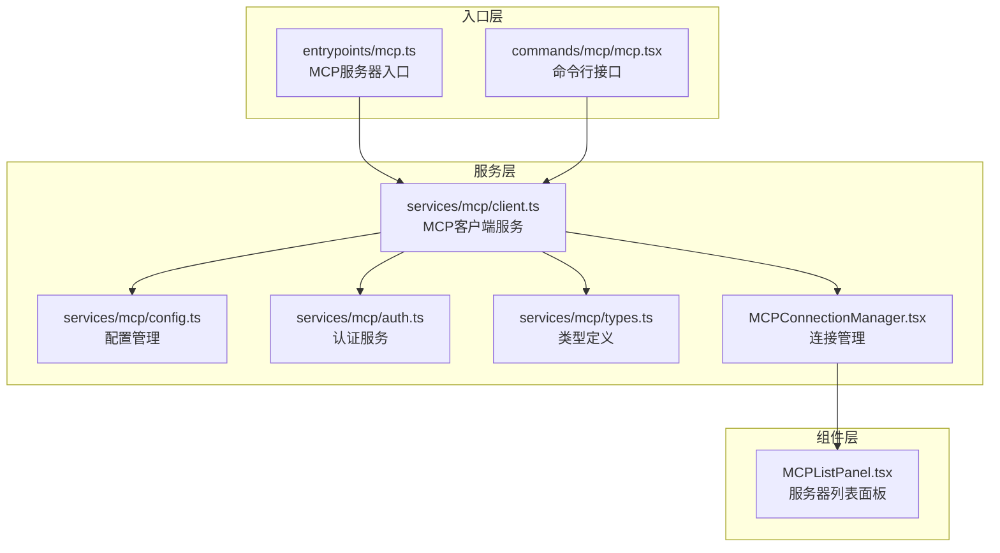
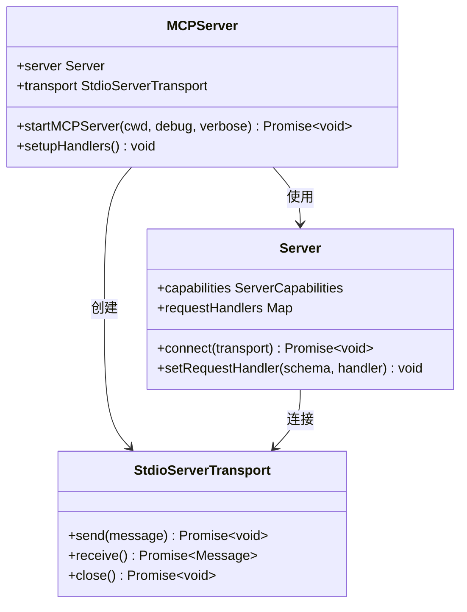
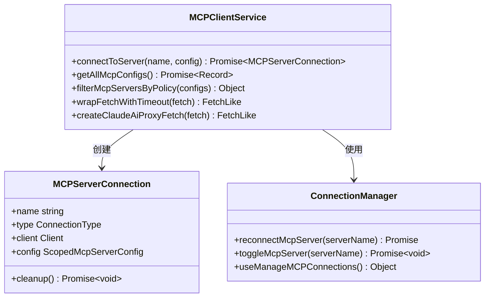
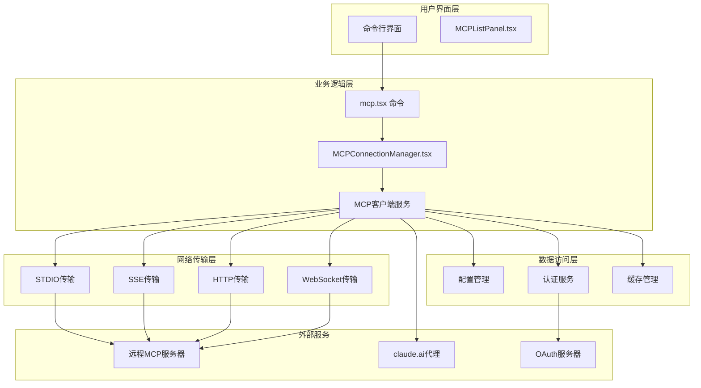
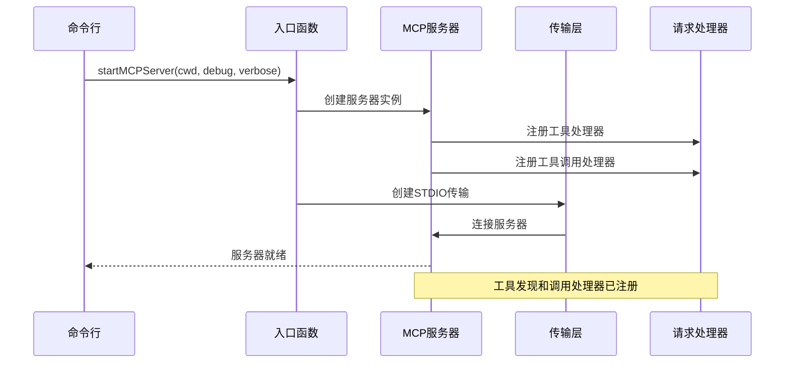
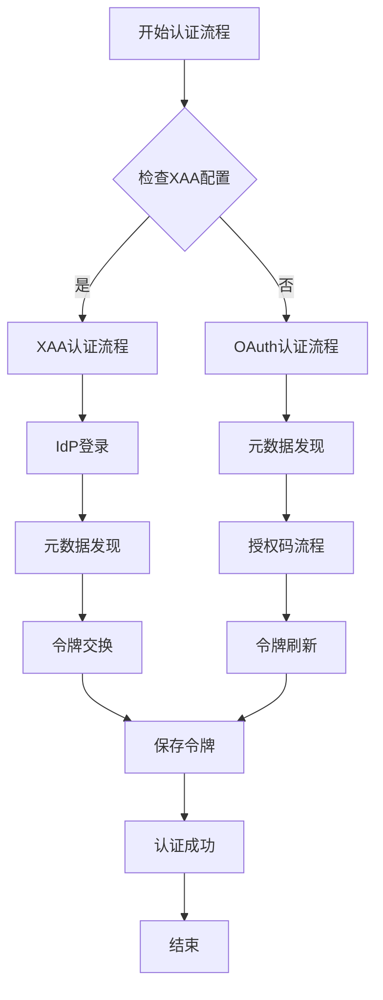
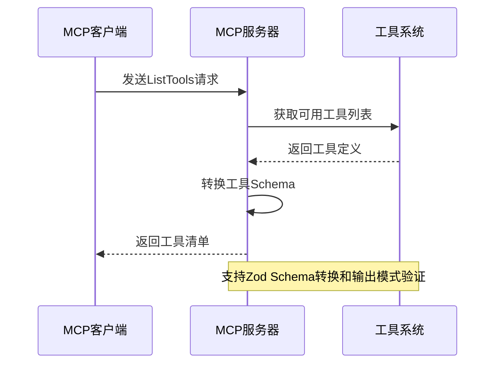
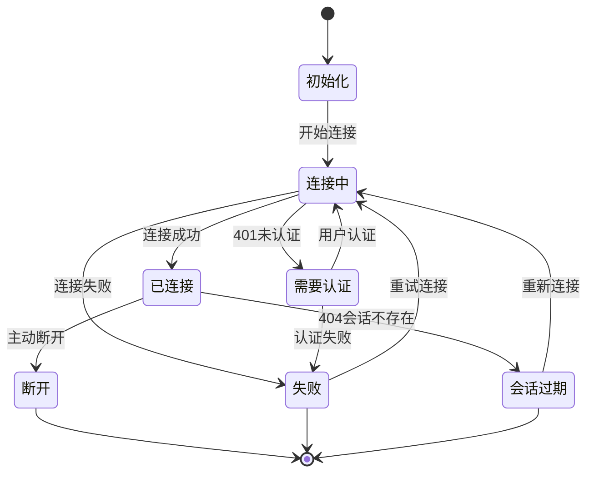
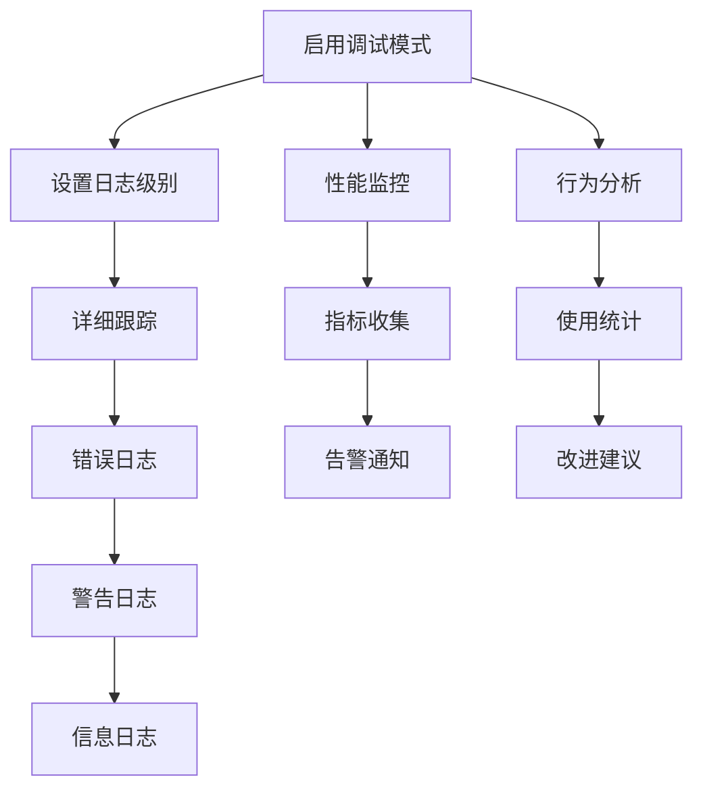

# MCP协议入口

<cite>
**本文档引用的文件**
- [src/entrypoints/mcp.ts](file://src/entrypoints/mcp.ts)
- [src/commands/mcp/mcp.tsx](file://src/commands/mcp/mcp.tsx)
- [src/services/mcp/client.ts](file://src/services/mcp/client.ts)
- [src/services/mcp/config.ts](file://src/services/mcp/config.ts)
- [src/services/mcp/types.ts](file://src/services/mcp/types.ts)
- [src/services/mcp/auth.ts](file://src/services/mcp/auth.ts)
- [src/services/mcp/MCPConnectionManager.tsx](file://src/services/mcp/MCPConnectionManager.tsx)
- [src/components/mcp/MCPListPanel.tsx](file://src/components/mcp/MCPListPanel.tsx)
</cite>

## 目录
1. [简介](#简介)
2. [项目结构](#项目结构)
3. [核心组件](#核心组件)
4. [架构概览](#架构概览)
5. [详细组件分析](#详细组件分析)
6. [依赖关系分析](#依赖关系分析)
7. [性能考虑](#性能考虑)
8. [故障排除指南](#故障排除指南)
9. [结论](#结论)

## 简介

Claude Code的MCP（Model Context Protocol）协议入口是一个完整的MCP服务器实现，支持多种传输方式和认证机制。该系统提供了本地MCP服务器、远程MCP服务器以及标准传输协议的统一接入点，实现了工具发现、能力协商和资源访问的完整功能。

MCP协议入口的核心目标是为Claude Code提供一个安全、可靠的MCP服务器实现，支持：
- 多种MCP服务器类型：本地服务器、远程服务器、标准传输
- 完整的认证机制：OAuth 2.0、XAA（跨应用访问）
- 工具发现和能力协商
- 资源访问和管理
- 会话管理和状态维护

## 项目结构

MCP协议入口的项目结构采用模块化设计，主要分为以下几个核心部分：



**图表来源**
- [src/entrypoints/mcp.ts:1-197](file://src/entrypoints/mcp.ts#L1-L197)
- [src/services/mcp/client.ts:1-800](file://src/services/mcp/client.ts#L1-L800)

**章节来源**
- [src/entrypoints/mcp.ts:1-197](file://src/entrypoints/mcp.ts#L1-L197)
- [src/services/mcp/client.ts:1-800](file://src/services/mcp/client.ts#L1-L800)

## 核心组件

### MCP服务器入口

MCP服务器入口是整个系统的启动点，负责初始化MCP服务器并设置请求处理器。



**图表来源**
- [src/entrypoints/mcp.ts:35-197](file://src/entrypoints/mcp.ts#L35-L197)

### MCP客户端服务

MCP客户端服务是核心的服务层组件，负责管理所有MCP服务器的连接、认证和通信。



**图表来源**
- [src/services/mcp/client.ts:595-800](file://src/services/mcp/client.ts#L595-L800)
- [src/services/mcp/MCPConnectionManager.tsx:37-73](file://src/services/mcp/MCPConnectionManager.tsx#L37-L73)

**章节来源**
- [src/entrypoints/mcp.ts:35-197](file://src/entrypoints/mcp.ts#L35-L197)
- [src/services/mcp/client.ts:595-800](file://src/services/mcp/client.ts#L595-L800)
- [src/services/mcp/MCPConnectionManager.tsx:37-73](file://src/services/mcp/MCPConnectionManager.tsx#L37-L73)

## 架构概览

MCP协议入口采用分层架构设计，确保了良好的可维护性和扩展性：



**图表来源**
- [src/commands/mcp/mcp.tsx:63-85](file://src/commands/mcp/mcp.tsx#L63-L85)
- [src/services/mcp/client.ts:619-800](file://src/services/mcp/client.ts#L619-L800)

## 详细组件分析

### MCP服务器启动流程

MCP服务器的启动流程遵循标准的MCP协议规范，确保与其他MCP客户端的兼容性。



**图表来源**
- [src/entrypoints/mcp.ts:35-197](file://src/entrypoints/mcp.ts#L35-L197)

### 认证机制实现

MCP协议入口支持多种认证机制，包括OAuth 2.0和XAA（跨应用访问）：



**图表来源**
- [src/services/mcp/auth.ts:664-800](file://src/services/mcp/auth.ts#L664-L800)

### 服务器类型支持

系统支持多种MCP服务器类型，每种类型都有特定的配置和连接方式：

| 服务器类型 | 传输协议 | 配置参数 | 用途 |
|-----------|----------|----------|------|
| stdio | STDIO | command, args, env | 本地进程启动 |
| sse | Server-Sent Events | url, headers | 远程HTTP服务器 |
| http | HTTP | url, headers | REST API服务器 |
| ws | WebSocket | url, headers | 实时双向通信 |
| sdk | SDK内联 | name | 内部SDK集成 |
| claudeai-proxy | HTTP代理 | url, id | claude.ai代理 |

**章节来源**
- [src/services/mcp/types.ts:23-135](file://src/services/mcp/types.ts#L23-L135)
- [src/services/mcp/config.ts:595-800](file://src/services/mcp/config.ts#L595-L800)

### 工具发现和能力协商

MCP协议入口实现了完整的工具发现和能力协商机制：



**图表来源**
- [src/entrypoints/mcp.ts:59-96](file://src/entrypoints/mcp.ts#L59-L96)

**章节来源**
- [src/entrypoints/mcp.ts:59-96](file://src/entrypoints/mcp.ts#L59-L96)

### 会话管理和状态维护

系统提供了完整的会话管理和状态维护机制：



**图表来源**
- [src/services/mcp/client.ts:193-206](file://src/services/mcp/client.ts#L193-L206)

**章节来源**
- [src/services/mcp/client.ts:193-206](file://src/services/mcp/client.ts#L193-L206)

## 依赖关系分析

MCP协议入口的依赖关系体现了清晰的分层架构：

```mermaid
graph TB
subgraph "外部依赖"
SDK[@modelcontextprotocol/sdk<br/>MCP SDK]
AXIOS[axios<br/>HTTP客户端]
Lodash[lodash-es<br/>工具函数库]
ZOD[zod/v4<br/>Schema验证]
end
subgraph "内部模块"
ENTRY[entrypoints/mcp.ts]
CLIENT[services/mcp/client.ts]
AUTH[services/mcp/auth.ts]
CONFIG[services/mcp/config.ts]
TYPES[services/mcp/types.ts]
UTILS[utils/*]
end
ENTRY --> SDK
CLIENT --> SDK
CLIENT --> AXIOS
CLIENT --> Lodash
CLIENT --> ZOD
CLIENT --> AUTH
CLIENT --> CONFIG
CLIENT --> TYPES
CLIENT --> UTILS
AUTH --> UTILS
CONFIG --> UTILS
TYPES --> ZOD
```

**图表来源**
- [src/entrypoints/mcp.ts:1-29](file://src/entrypoints/mcp.ts#L1-L29)
- [src/services/mcp/client.ts:1-42](file://src/services/mcp/client.ts#L1-L42)

**章节来源**
- [src/entrypoints/mcp.ts:1-29](file://src/entrypoints/mcp.ts#L1-L29)
- [src/services/mcp/client.ts:1-42](file://src/services/mcp/client.ts#L1-L42)

## 性能考虑

MCP协议入口在设计时充分考虑了性能优化：

### 缓存策略
- 文件读取状态缓存：使用LRU缓存限制内存使用
- 认证令牌缓存：减少重复认证开销
- 服务器配置缓存：避免重复解析配置

### 并发处理
- 连接批量处理：支持多服务器并发连接
- 请求超时管理：防止长时间阻塞
- 连接池管理：复用网络连接

### 内存管理
- 智能垃圾回收：及时释放不再使用的资源
- 流式处理：大文件和响应的流式传输
- 内存限制：防止内存泄漏和过度占用

## 故障排除指南

### 常见问题诊断

| 问题类型 | 症状 | 可能原因 | 解决方案 |
|---------|------|----------|----------|
| 连接失败 | 无法连接到MCP服务器 | 网络问题、认证失败 | 检查网络连接、验证认证配置 |
| 工具不可用 | 工具列表为空 | 服务器配置错误、权限不足 | 检查服务器配置、确认工具权限 |
| 认证失败 | 401未认证错误 | 令牌过期、配置错误 | 刷新令牌、重新配置认证 |
| 会话超时 | 404会话不存在 | 会话过期、服务器重启 | 重新建立会话、检查服务器状态 |

### 调试和监控

系统提供了完善的调试和监控功能：



**章节来源**
- [src/services/mcp/client.ts:193-206](file://src/services/mcp/client.ts#L193-L206)

### 最佳实践

1. **配置管理**
   - 使用环境变量管理敏感配置
   - 定期更新和轮换认证令牌
   - 启用配置验证和错误处理

2. **安全性**
   - 实施最小权限原则
   - 使用HTTPS和TLS加密
   - 定期审计访问日志

3. **可靠性**
   - 实现重连机制和退避策略
   - 监控服务器健康状态
   - 建立故障转移机制

4. **性能优化**
   - 合理设置超时和重试参数
   - 使用连接池和缓存策略
   - 监控资源使用情况

## 结论

Claude Code的MCP协议入口提供了一个完整、安全、高效的MCP服务器实现。通过模块化的架构设计、完善的认证机制和丰富的功能特性，该系统能够满足各种MCP应用场景的需求。

主要优势包括：
- **完整性**：支持所有标准MCP传输协议和认证方式
- **安全性**：实施多层次的安全保护和访问控制
- **可扩展性**：模块化设计便于功能扩展和定制
- **可靠性**：完善的错误处理和故障恢复机制
- **易用性**：提供直观的命令行界面和配置管理

该MCP协议入口为Claude Code生态系统提供了强大的MCP服务器能力，为开发者和用户提供了一个可靠、安全的MCP集成平台。